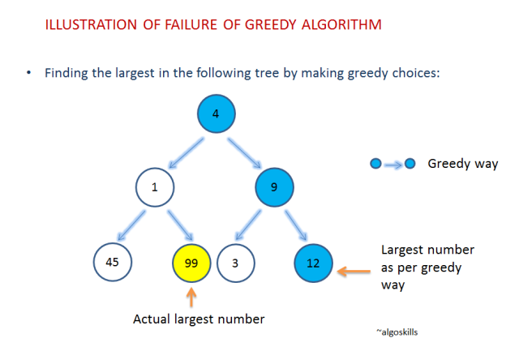

[notion note](https://www.notion.so/bluecandle/Greedy-Algorithm-3686a3c4a5e440c4a4aa64c1e25dce13)


# Greedy Algorithm

A greedy algorithm is a simple, intuitive algorithm that is used in optimization problems. The algorithm makes the **optimal choice at each step** as it attempts to find the overall optimal way to solve the entire problem.

각 상황 (local) 에서 최선의 해결책을 찾아내어 전체적으로 최선의 해결책을 낸다.

참조 1

[https://velog.io/@cyranocoding/동적-계획법Dynamic-Programming과-탐욕법Greedy-Algorithm-3yjyoohia5](https://velog.io/@cyranocoding/%EB%8F%99%EC%A0%81-%EA%B3%84%ED%9A%8D%EB%B2%95Dynamic-Programming%EA%B3%BC-%ED%83%90%EC%9A%95%EB%B2%95Greedy-Algorithm-3yjyoohia5#:~:text=com%2Fgreedy.php-,Greedy%20Algorithms(%ED%83%90%EC%9A%95%EB%B2%95%2C%20%ED%83%90%EC%9A%95%20%EC%95%8C%EA%B3%A0%EB%A6%AC%EC%A6%98),%ED%95%98%EB%8A%94%20%EB%AC%B8%EC%A0%9C%20%ED%95%B4%EA%B2%B0%20%EB%B0%A9%EC%8B%9D%EC%9D%B4%EB%8B%A4)

## Dynamic Programming (동적 계획법)

---

Dynamic Programming은 전체 문제를 여러 개의 하위 문제로 나누어 풀고, 하위 문제들의 해결 방법들을 결합하여 최종 문제를 해결하는 문제 해결 방식이다.

## Greedy Algorithms(탐욕법, 탐욕 알고리즘)

---

Greedy Algorithm은 문제를 해결하는 과정에서 그 순간순간마다 최적이라고 생각되는 결정을 하는 방식으로 진행하여 최종 해답에 도달하는 문제 해결 방식이다



하지만 이러한 단점들을 극복하는 Greedy의 가장 큰 장점은 계산 속도에 있다. 그래서 Greedy 방법이 통하는 몇몇의 문제에서는 최적해를 빠르게 산출해낼 수 있다.

빠른 계산 속도의 장점으로 앞서 말한 Dynamic Programming과 서로 보완하는 개념으로 알려져 있다.

### 대표적 예제 1 : 활동 선택 문제(Activity Selection Problem) - 1

---


출처 : [https://www.algoskills.com/activityselection.php](https://www.algoskills.com/activityselection.php)

시작시간과 종료시간이 있다. 한 사람이 최대한 많이 할 수 있는 액티비티의 수와 액티비티의 종류 구하기.

```
1. 각각의 활동들은 시작시간과 종료시간이 주어져 있다.
2. 한 사람이 하는 것이므로 한 가지 액티비티를 종료하여야 다른 액티비티를 할 수 있다.
```

Greedy는

1. **탐욕스러운 선택 조건(Greedy choice property)**
    1. 앞의 선택이 이후의 선택에 영향을 주지 않는 조건.
2. **최적 부분 구조 조건(Optimal Substructure)**
    1. 문제에 대한 최종 해결 방법이 부분 문제에 대해서도 또한 최적 문제 해결 방법이다는 조건.

위의 두 가지 조건이 성립되어야 잘 작동한다.

참조 2

[https://www.zerocho.com/category/Algorithm/post/584ba5c9580277001862f188](https://www.zerocho.com/category/Algorithm/post/584ba5c9580277001862f188)

물론 모든 경우에서 그리디 알고리즘이 통하지는 않습니다.

쉬운 예를 들자면 지금 선택하면 1개의 마시멜로를 받고, 1분 기다렸다 선택하면 2개의 마시멜로를 받는 문제에서는, 그리디 알고리즘을 사용하면 항상 마시멜로를 1개밖에 받지 못합니다. 지금 당장 최선의 선택은 마시멜로 1개를 받는 거지만, 결과적으로는 1분 기다렸다가 2개 받는 게 최선이기 때문이죠.

### 대표적 예제 1 : 활동 선택 문제(Activity Selection Problem) - 2


이 문제는 동적 프로그래밍을 통해서도 풀 수 있습니다. 하나의 예를 들어 G18을 A1이 종료된 후부터, A8이 시작하기 전 활동들의 집합이라고 보면, G18 = {A3, A5, A6, A7}입니다. 이 중에서 최적의 조합(활동들이 겹치지 않고 개수는 최대)을 B18이라고 하면, 하나의 예로 B18 = {A3, A6}라고 할 수 있습니다. {A3, A7}도 되겠네요.

B18에서 A6를 골랐다고 칩시다. A6를 고르면 이제 문제는 두 개로 쪼개집니다. G16과 G68에서 각각 최적인 B16와 B18을 찾는 거죠. 이제 B16과 B18의 개수와 A6 1개를 더하면 최적 활동의 개수를 알 수 있습니다. 이를 식으로 나타내면 **C[i,j] = max(C[i,k] + C[k,j] + 1)**이 됩니다. C는 집합 Gij의 최적 개수를 나타냅니다. max는 B18에서 A6 말고 다른 것을 골랐을 때의 경우도 모두 생각해서 그 중 최적을 찾는 겁니다.

### 대표적 에제 2 : 분할 가능 배낭 문제

---


가방에 물건을 쪼개서 넣을 수 있다는 조건이 있다면, 무게 대비 가치가 가장 높은 물건부터 ㄱㄱ!

가방의 무게 제한이 50이라고 해보자.

무게 대비 가치가 6인 1번 물건을 넣고 (무게 10)

무게 대비 가치가 5인 2번 물건을 넣고 (무게 20)

무게 대비 가치가 4인 3번 물건을 20만큼 쪼개서 넣으면 (무게 20)

가방 무게 제한을 채우면서 가장 높은 가치를 넣은 가방 구성이 된다.

## 그리디 알고리즘을 이용한 알고리즘

---

### 그 전에! MST : minimum spanning tree

---

minimum possible total edge weight. That is, it is a spanning tree whose sum of edge weights is as small as possible.


가중치 합 가장 적게 모든 node(key) 가 연결된 tree

### 1. 프림 알고리즘

---

[프림알고리즘](https://www.notion.so/45197cb4a6c748b8856aed9d38dd5549)

### 2. 다익스트라 알고리즘

---

[다익스트라 알고리즘, 최단경로검색](https://www.notion.so/04d3a93bef764b788c4b2414436feefd)
