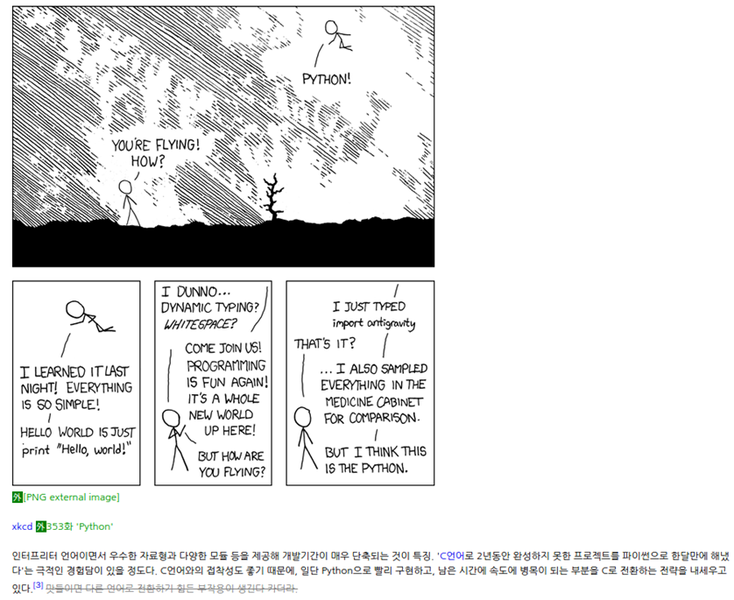

# AIFFEL_10일차 2020.08.05

Tags: AIFFEL_DAILY

당일 결석

---

# [F-8]파이썬 잘하는 척 해보자

---

### **학습 목표**

---

- 파이썬에 대해서 알아보자.
- 코드 재사용에 대해서 알아보자.
- 프로그래밍 패러다임에 대해서 알아보자.
- 파이썬 코드를 이쁘게 해보자.

### 왜 파이썬인가?



따라서 성능과 상관없이 개발이 빨리 돼야 하는 프로젝트를 하시게 된다면 파이썬을 사용하시면 좋습니다.

이 때문에 수정이 빈번하게 발생하는 부분은 소스코드를 한줄 한줄 읽어 바로바로 실행하는 인터프리터 방식이 상당히 유리합니다. 스크립트 언어는 이런 부분에 사용하기 위해 나온 것으로, 응용 소프트웨어에서 스크립트 언어에 맞는 API를 제공, 응용 소프트웨어와 상호작용하면서 돌아가게 됩니다.

## For loop

### 리스트 컴프리헨션(list Comprehension)

```python
my_list = ['a','b','c','d']

result_list = [(i, j) for i in range(2) for j in my_list]

print(result_list)
```

### 제너레이터(Generator)

```python
my_list = ['a','b','c','d']

# 인자로 받은 리스트로부터 데이터를 하나씩 가져오는 제너레이터를 리턴하는 함수
def get_dataset_generator(my_list):
    result_list = []
    for i in range(2):
        for j in my_list:
            yield (i, j)
            print('>>  1 data loaded..')

dataset_generator = get_dataset_generator(my_list)
for X, y in dataset_generator:
    print(X, y)
```

1억개의 레코드가 담겨 있는 빅데이터 파일이라면 어떨까요? 제너레이터가 없다면 우리는 길이 1억짜리 리스트를 리턴받아 메모리에 전부 올려놓고 처리를 시작해야 합니다. 그러나 제너레이터를 활용할 때는 1억개의 데이터를 전부 메모리에 올려놓을 필요가 없이 현재 처리해야 할 데이터를 1개씩 로드해서 사용할 수 있게 됩니다. 이것은 빅데이터를 처리해야 할 머신러닝 상황에서 매우 요긴합니다.

## Multiprocessing

```python
import multiprocessing
import time

num_list = ['p1','p2', 'p3', 'p4']
start = time.time()

def count(name):
    for i in range(0, 100000000):
            a=1+2
    print("finish : ",name)
    

if __name__ == '__main__':
    pool = multiprocessing.Pool(processes = 4)
    pool.map(count, num_list)
    pool.close()
    pool.join()

print("time :", time.time() - start)
```

- **`pool.map(count, num_list)`** : 병렬화를 시키는 함수로서 count 함수에 num_list의 원소들을 하나씩 넣어 놓습니다. 여기서 num_list의 원소는 4개이므로 4개의 count 함수에 각각 하나씩 원소가 들어가게 됩니다.즉, count('p1'), count('p2'), count('p3'), count('p4')가 만들어 집니다.
- **`pool.close()`** : 일반적으로 병렬화 부분이 끝나면 나옵니다. 더이상 pool을 통해서 새로운 작업을 추가하지 않을 때 사용합니다.
- **`pool.join()`** : 프로세스가 종료될 때까지 대기하도록 지시하는 구문으로써 병렬처리 작업이 끝날때까지 기다리도록 합니다.

## 함수

### **pass**

---

파이썬에서 함수를 만들기 전에 함수 이름과 입력 정도만 먼저 만들어 놓는 경우가 있습니다.'*이런 이런 동작을 하는 함수를 만들거지만 먼저 일단 이름만 작성 해놓고 함수 내부 구현은 나중에 해야겠다~*'라는 겁니다. 이런 상황에선 어떻게 해야 할까요? 파이썬은 즉각적인 코드 실행이 가능하기 때문에 만약 함수 안을 비워 놓은 채 이름만 써 놓는다면 에러가 날 것입니다.

pass 문은 기타 제어 흐름 도구입니다.

pass가 하는 일은.. 놀랍게도 아무것도 하지 않는 일입니다.

즉, 문법적으로 해당 문장이 필요하지만, 프로그램이 특별히 할 일이 없을 때 사용할 수 있습니다. 사용 가능한 곳은 다양하며 대표적으로 위에서 사용한 함수 내부, if 내부, while 내부 등 다양한 곳에서 쓸 수 있습니다.

### **함수에 함수 사용**

---

파이썬의 좋은 기능 중 하나가 함수에 함수를 사용할 수 있다는 것입니다.

```python
def minmax_function (x_list):
	~~~
	return x_min, x_max

min_value, max_value = minmax_function(list_data)

print("최솟값은 : ", min_value)
print("최댓값은 : ", max_value)
```

## 람다 표현식

---

람다는 런타임에 생성해서 사용할 수 있는 익명 함수 입니다. 쉽게 말하자면, 함수 이름이 없는 함수라고 생각하시면 됩니다.

람다 표현식을 사용하는 가장 중요한 이유는 함수의 인수 부분을 간단히 하기 위함입니다. 이런 방식으로 사용하는 대표적인 예가 map()입니다.

map() 함수는 입력 받은 자료형의 각 요소가 함수에 의해 수행된 결과를 묶어서 map iterator 객체로 출력하는 역할을 합니다.

```python
def list_mul(x):
     return x * 2

result = list(map(list_mul, [1, 2, 3]))
print(result)

#map_res = map(list_mul, [1, 2, 3])
#print(map_res)
#list_map_res = list(map_res)
#print(list_map_res)

result = list(map(lambda i: i * 2 , [1, 2, 3]))
print(result)
```

map()에 list_mul()함수와 리스트 [1, 2, 3]을 넣습니다. 주의할 점이 map()의 결과는 그냥 map 객체이므로 결과창에서 직접 눈으로 확인할 수 있는 형태로 바꾸기 위해 list()를 사용해 리스트 형태로 변환해 줍니다.

map(f, iterable) 는 입력으로 함수(f)와 반복 가능한(iterable) 객체(리스트, 튜플 등)를 받습니다. 코드에서 보시면 f에는 list_mul() 함수가 들어갔고 iterable에는 [1,2,3] 리스트가 들어가 있습니다. 코드를 수행하면 리스트에 들어가 있는 값들에 2를 곱한 결과가 나옵니다. 즉, 리스트안의 원소들을 1(0번째) 부터 시작해서 2(1번째), 3(2번째) 순서로 list_mul() 함수에 차례로 넣고 출력을 받아서 list 형태로 바꾼 것입니다.

map() 이외에도 filter(), reduce() 등 람다 표현식과 자주 쓰이는 함수가 많이 있습니다.

[https://wikidocs.net/64](https://wikidocs.net/64)

## Class, Module, Package

모듈은 함수, 변수, 클래스를 모아 놓은 파일을 말합니다. 즉, 코드의 저장소라고 볼 수 있습니다.

파이썬에서 패키지는 여러 모듈을 하나로 모아둔 폴더라고 할 수 있습니다. 아래 그림을 보시면 종이처럼 보이는 부분이 함수이고, 그 함수 여러 개가 모여서 모듈을 만들고, 모듈이 여러 개 모여 패키지를 이룹니다.

## 프로그래밍 패러다임과 함수형 프로그래밍

---

**객체 지향 프로그래밍**

객체지향 프로그래밍은 개발자가 프로그램을 상호작용하는 객체들의 집합으로 볼 수 있게 합니다. 객체지향 프로그래밍은 객체를 먼저 작성하고 함수를 작성합니다. 이렇게 작성된 객체는 객체 간의 상호작용이 있습니다.

- 장점 : 코드를 재사용하기 쉽습니다. 코드 분석이 쉬우며 아키텍처를 바꾸기 쉽습니다.
- 단점 : 객체 간의 상호작용이 있기 때문에 설계에서 많은 시간이 소요되며 설계를 잘못하면 전체적으로 바꿔야 할 수도 있습니다.

파이썬은 객체지향 프로그래밍(OOP, Object Oriented Programming) 패러다임을 기본적으로 지원하고 있습니다.

---

[http://schoolofweb.net/blog/posts/파이썬-oop-part-1-객체-지향-프로그래밍oop은-무엇인가-왜-사용하는가/](http://schoolofweb.net/blog/posts/%ED%8C%8C%EC%9D%B4%EC%8D%AC-oop-part-1-%EA%B0%9D%EC%B2%B4-%EC%A7%80%ED%96%A5-%ED%94%84%EB%A1%9C%EA%B7%B8%EB%9E%98%EB%B0%8Doop%EC%9D%80-%EB%AC%B4%EC%97%87%EC%9D%B8%EA%B0%80-%EC%99%9C-%EC%82%AC%EC%9A%A9%ED%95%98%EB%8A%94%EA%B0%80/)

객체 지향 프로그래밍(영어: Object-Oriented Programming, OOP)은 컴퓨터 프로그래밍의 패러다임의 하나이다. 객체 지향 프로그래밍은 컴퓨터 프로그램을 명령어의 목록으로 보는 시각에서 벗어나 여러 개의 독립된 단위, 즉 "객체"들의 모임으로 파악하고자 하는 것이다. 각각의 객체는 메시지를 주고받고, 데이터를 처리할 수 있다.

객체 지향 프로그래밍은 프로그램을 유연하고 변경이 용이하게 만들기 때문에 대규모 소프트웨어 개발에 많이 사용된다. 또한 프로그래밍을 더 배우기 쉽게 하고 소프트웨어 개발과 보수를 간편하게 하며, 보다 직관적인 코드 분석을 가능하게 하는 장점을 갖고 있습니다. 그러나 지나친 프로그램의 객체화 경향은 실제 세계의 모습을 그대로 반영하지 못한다는 비판을 받기도 한다.

OOP란 클래스란 이름의 블루프린트를 이용하여 새로운 데이터 타입을 만들어 데이터와 함수(클래스 안에서는 메소드라고 부름)의 논리적 그룹을 만들어 사용하는 것이라고 생각하시면 됩니다.

OOP를 사용하여 반복되는 코드를 없애고 사전이나 리스트가 지원하지 않는 상속과 같은 클래스의 기능을 사용할 수가 있습니다.

코드와 데이터를 논리적인 집합으로 묶을 수 있게 된다.

---

### 함수형 프로그래밍

함수형 프로그래밍은 함수로 문제를 분해합니다. 이 함수들은 입력을 받아서 출력을 만들어 내기만 하며, 주어진 입력이 함수를 통과하고 값이 생성되면 이 출력값은 함수 외부의 다른 변수나 함수에 의해 변하지 않습니다.

1. 순수성

부작용이 전혀 없는 함수를 순수 함수 라고 합니다. 부작용을 피한다는 것은 프로그램이 실행될 때 해당 프로그램이 수정될 수 있는 상황을 엄격히 제한한다는 의미입니다. 그리고 모든 함수의 출력은 입력에만 의존해야 합니다.

2. 모듈성

3. 디버깅과 테스트 용이성

프로그램이 동작하지 않는다면, 각 함수는 데이터가 올바른지 확인할 수 있는 포인트들이 됩니다. 각 함수의 입력과 출력을 확인하면서 예상되는 것과 다른 출력이 나오면 해당 부분이 문제이기 때문에 디버깅이 쉽습니다. 각 함수는 잠재적으로 단위 테스트의 대상이기 때문에 테스트가 더 쉽습니다. 올바른 입력을 함수에 입력하고 결과가 예상과 일치하는지 확인만 하면 되기 때문이죠.

---

[https://docs.python.org/ko/3/howto/functional.html](https://docs.python.org/ko/3/howto/functional.html)

---

## 파이써닉한 코드

[https://pep8.org/#code-lay-out](https://pep8.org/#code-lay-out)

### **이름 규칙**

---

- 변수명 앞에 _(밑줄)이 붙으면 함수 등의 내부에서만 사용되는 변수를 일컫습니다.

```
_my_list = []
```

- 변수명 뒤에 _(밑줄)이 붙으면 라이브러리 혹은 파이썬 기본 키워드와의 충돌을 피하고 싶을 때 사용합니다.

```
import_ = "not_import"
```

- 소문자 L, 대문자 O, 대문자 I를 가능하면 사용하지 마세요. 특정 폰트에서는 가독성이 굉장히 안 좋습니다.
- 모듈(Module) 명은 짧은 소문자로 구성되며, 필요하다면 밑줄로 나눕니다.
- 상수(Constant)는 모듈 단위에서만 정의하며 모두 대문자에 필요하다면 밑줄로 나눕니다.

```
    MY_PI = 3.14 # 상수는 변하지 않는 변수입니다.
```