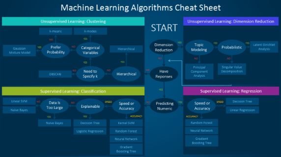

# AIFFEL_11일차 2020.08.06

Tags: AIFFEL_DAILY

### 일정

1. [F-9]사이킷런으로 구현하는 머신러닝
2. [E-4]고양이상, 강아지상 구분해보기

---

# [F-9]사이킷런으로 구현하는 머신러닝

---

### **학습목표**

---

- 머신러닝의 다양한 알고리즘을 소개합니다.
- 사이킷런 라이브러리의 사용법을 익힙니다.
- 사이킷런에서 데이터를 표현하는 방법에 대해 이해하고 훈련용 데이터셋과 테스트용 데이터셋으로 데이터를 나누는 방법을 이해합니다.

---

- 지도학습 (Supervised Learning)
- 비지도학습 (Unsupervised Learning)
- 강화학습 (Reinforcement Learning)

구현하고자 하는 Application에 따라 합쳐서 사용될 수도 있습니다. 경우에 따라 지도학습으로 학습을 진행하다 차원과 특징(Feature)의 수가 너무 많아지면 비지도 학습으로 전환하기도 합니다.

어떤 문헌에서는 지도학습과 비지도학습의 중간 개념으로 준(반)지도학습(Semi-Supervised Learning) 또는 약지도학습(Weakly Supervised Learning)을 제시하기도 합니다.

---

[최적의 머신러닝 알고리즘 고르기]

[https://blogs.sas.com/content/saskorea/2017/08/22/최적의-머신러닝-알고리즘을-고르기-위한-치트/](https://blogs.sas.com/content/saskorea/2017/08/22/%EC%B5%9C%EC%A0%81%EC%9D%98-%EB%A8%B8%EC%8B%A0%EB%9F%AC%EB%8B%9D-%EC%95%8C%EA%B3%A0%EB%A6%AC%EC%A6%98%EC%9D%84-%EA%B3%A0%EB%A5%B4%EA%B8%B0-%EC%9C%84%ED%95%9C-%EC%B9%98%ED%8A%B8/)



몇몇 데이터 과학자들은 “최고의 알고리즘을 찾는 단 하나의 확실한 방법은 모든 알고리즘을 시도해보는 것”이라고 말하기도 합니다.

### 1. 지도 학습(Supervised learning)

- **분류(Classification):** 데이터가 범주형(categorical) 변수를 예측하기 위해 사용될 때 지도 학습을 ‘분류’라고 부르기도 합니다. 이미지에 강아지나 고양이와 같은 레이블 또는 지표(indicator)를 할당하는 경우가 해당되는데요. 레이블이 두 개인 경우를 ‘이진 분류(binary classification)’라고 부르며, 범주가 두 개 이상인 경우는 다중 클래스 분류(multi-class classification)라고 부릅니다.
- **회귀(Regression):** 연속 값을 예측할 때 문제는 회귀 문제가 됩니다.
- **예측(Forecasting):** 과거 및 현재 데이터를 기반으로 미래를 예측하는 과정입니다. 예측은 동향(trends)을 분석하기 위해 가장 많이 사용되는데요. 예를 들어 올해와 전년도 매출을 기반으로 내년도 매출을 추산하는 과정입니다.

### 3. 비지도(자율) 학습(Unsupervised learning)

데이터의 기저를 이루는 고유 패턴을 발견하도록 설정됩니다.

- **클러스터링(Clustering):** 특정 기준에 따라 유사한 데이터 사례들을 하나의 세트로 그룹화합니다. 이 과정은 종종 전체 데이터 세트를 여러 그룹으로 분류하기 위해 사용되는데요. 사용자는 고유한 패턴을 찾기 위해 개별 그룹 차원에서 분석을 수행할 수 있습니다.
- **차원 축소(Dimension Reduction):** 고려 중인 변수의 개수를 줄이는 작업입니다. 많은 애플리케이션에서 **원시 데이터(raw data)는 아주 높은 차원의 특징**을 지니는데요. 이때 일부 특징들은 중복되거나 작업과 아무 관련이 없습니다. 따라서 **차원수(dimensionality)를 줄이면 잠재된 진정한 관계를 도출**하기 용이해집니다.

### 핵심

- 문제를 정의한다. 어떤 문제를 해결하고 싶은가?
- 단순하게 시작한다. 데이터와 기준이 되는 결과(baseline results)를 잘 인지하고 있어야 한다.
- 그리고 나서 복잡한 것들을 시도한다.

---

### 강화학습

학습하는 시스템을 **에이전트**라고 하고**, 환경**을 관찰해서 에이전트가 스스로 행동하게 합니다. 모델은 그 결과로 **특정 보상**을 받아 이 **보상을 최대화** 하도록 학습합니다.

sciPy Toolkit ⇒ scikit

sklearn.model_selection > train_test_split : 데이터 shuffle 하고 훈련 데이터와 테스트 데이터로 나누는 것을 하나로 묶은 메소드

---

[Software Library APIs: Lessons Learned from scikit-learn - PyCon 2018]

[https://www.youtube.com/watch?time_continue=12&v=WCEXYvv-T5Q&feature=emb_logo](https://www.youtube.com/watch?time_continue=12&v=WCEXYvv-T5Q&feature=emb_logo)

Scikit-Learn에서 ETL(Extract Transform Load) 기능을 수행하는 함수??

일단 transformer 클래스가 해결한다


추상화를 잘 해놓았을 때, API 사용이 훨씬 편해진다 ⇒ 그런 의미에서 scikit-learn 이 잘 되어있더라.

estimator methods : fit(), predict()

model stacking


estimator, transformer 를 실행하는 API : Pipeline, meta-estimator

2편의 동영상을 시청한 소감이 어떤가요? 동영상에서 중요하게 생각하는 부분을 한번 요약해 보고 토론해 보세요.

안정성 강조. 믿고 사용할 수 있는 라이브러리를 만드는 것의 중요성. 그리고, 다른 개발자와 협업이 용이하도록 추상화가 잘 되어있어야 하고, 사용자의 생각을 그대로 코드로 나타낼 수 있도록 생각의 흐름을 잘 반영하는 형태를 가져야 한다.

일반적으로 머신러닝에서 데이터 가공(ETL)을 거쳐 모델을 훈련하고 예측하는 과정을 거치는데 ETL부분은 ScikitLearn의 transformer()를 제공하고, 모델의 훈련과 예측은 Estimator 객체를 통해 수행되며, Estimator에는 각각 fit()(훈련), predict()(예측)을 행하는 메소드가 있습니다. 모델의 훈련과 예측이 끝나면 이 2가지는 작업을 Pipeline()으로 묶어 검증을 수행합니다.

---

사이킷런의 알고리즘은 파이썬 클래스로 구현되어 있고, 데이터셋은 NumPy의 ndarray, Pandas의 DataFrame, SciPy의 Sparse Matrix를 이용해 나타낼 수 있습니다.


위의 입력 데이터인 x를 그대로 넣으면, 에러가 발생합니다. x를 행렬로 바꾸어 주어야 합니다. 행렬로 어떻게 바꾸면 좋을까요? x는 numpy의 ndarray타입이니 reshape()를 사용하면 좋을 것 같네요. 통상 특성 행렬의 변수명은 X로 한다고 했습니다. 변수명 X에 특성 행렬을 넣어 봅시다.

```python
X = x.reshape(100,1)
```

reshape() 함수에서 나머지 숫자를 -1로 넣으면 자동으로 남은 숫자를 계산해준다.

x 의 인자 개수가 100개라고 했을 때 x.reshape(2,-1) 로 하면, (2,50) 의 형태로 자동 변환

 

모델의 성능 평가 관련 모듈은 sklearn.metrics에 저장되어 있습니다.

회귀 모델의 경우 RMSE(Root Mean Square Error)를 사용해 성능을 평가합니다.

```python
error = np.sqrt(mean_squared_error(y,y_new))
```

### sklearn.datasets 모듈

sklearn.datasets 모듈은 크게 dataset loaders와 dataset fetchers로 나뉘며, 각각 Toy dataset과 Real Word dataset을 제공하고 있습니다. 우리는 Toy dataset을 다뤄볼 예정입니다.

Bunch는 파이썬의 딕셔너리와 유사한 형태의 데이터 타입입니다.

ndim을 이용해 차원을 확인할 수 있습니다.

```python
data.data.ndim
```

feature_names란 키에 특성들의 이름이 저장되어 있습니다.

```python
data.feature_names
```

```python
#!pip install pandas

import pandas as pd
pd.DataFrame(data.data, columns=data.feature_names)
```

DataFrame으로 나타내니 한결 데이터 보기가 편해졌습니다. 이렇게 하면 EDA(Exploration Data Analysis)할때 굉장히 편할 것 같네요.

## scikit-learn 주요모듈

앞의 실습에서 머신러닝 모델의 훈련은 fit() 메소드를 이용하고 예측은 predict() 메소드를 이용했습니다. 사이킷런은 API가 매우 일관성 있게 설계되어 있다는 점이 장점입니다.

### **Estimator 객체**

---

데이터셋을 기반으로 머신러닝 모델의 파라미터를 추정하는 객체를 **`Estimator`**라고 합니다. 사이킷런의 모든 머신러닝 모델은 **`Estimator`**라는 파이썬 클래스로 구현되어 있습니다. 추정을 하는 과정 즉, 훈련은 **`Estimator`**의 **`fit()`**메소드를 통해 이루어 지고, 예측은 **`predict()`**메소드를 통해 이루어 집니다.


*정답이 없는 데이터인 비지도학습의 경우는 fit() 메소드의 인자로 Target Vector가 들어가지 않습니다.

### from sklearn.model_selection import train_test_split

네 0번 원소부터 순서대로 훈련 데이터용 특성 행렬, 테스트 데이터용 특성 행렬, 훈련 데이터용 타겟 벡터, 테스트 데이터용 타겟 벡터 입니다.

---

---

# [E-4] 멍멍이 상, 고양이 상

---

### **학습 목표**

---

- 이미지를 분류할 때 이미 잘 학습되어 있는 모델을 사용한다는 아이디어를 떠올릴 수 있다.
- 사전학습 모델인 Backbone 모델의 종류와 개념을 알고, Transfer Learning의 개념을 설명할 수 있다.
- VGG, ResNet과 같은 기본적인 Backbone 모델을 불러와서 사용할 수 있다.
- Backbone 모델을 원하는 레이어(layer)만큼 새로 학습시켜서 사용할 수 있다.
- Backbone 모델을 Transfer Learning 시킴으로써 원하는 이미지를 분류시킬 수 있다.

Structured 데이터 : 정형 데이터. 2차원 형태의 표 데이터

Structured 데이터란 행과 열이 있는 2차원 형태의 표 데이터로, 다른 말로는 정형 데이터라고 하기도 한다.
각 행은 하나의 데이터 포인트들을 나타내고, 각 열은 각 데이터 포인트의 특징들을 나타낸다.

## 내가 만드는 강아지, 고양이 분류기

---

### 데이터 준비하기

```python
<PrefetchDataset shapes: ((None, None, 3), ()), types: (tf.uint8, tf.int64)>
```

모든 데이터셋은 **`(image, label)`**의 형태를 가집니다. **`((None, None, 3), ())`**가 이를 나타내죠.여기에서 앞에 있는 **`(None, None, 3)`**은 image의 shape를, 뒤의 **`()`**는 정답 카테고리인 label의 shape를 의미합니다.

여기에서 이미지는 **`(height, width, channel)`**로 3차원 데이터이기 때문에 **`(None, None, 3)`**과 같이 나타났습니다. 이 때 **`height`**와 **`width`**가 **`None`**으로 나타난 이유는 무엇일까요?잠시 뒤에 확인하겠지만, 모든 이미지의 크기가 전부 다르기 때문입니다. 정해져있지 않은 사이즈이기 때문에 **`None`**으로 나타낸 거죠.그렇다면 **`3`**이라는 숫자는 무엇을 나타낼까요?

바로 이미지의 색을 표현하는 채널의 수를 나타냅니다. 컬러 이미지의 경우, 색은 RGB의 세 가지 색 조합으로 나타낼 수 있다는 것을 알고 있을 겁니다.

앞서 설명했듯 이미지의 사이즈는 전부 제각각이네요. 모델을 학습시킬 때에는 이미지 사이즈를 통일시켜주는 작업을 해야 할 것 같습니다.

```python
IMG_SIZE = 160 # All images will be resized to 160x160

def format_example(image, label):
    image = tf.cast(image, tf.float32)  # image=float(image)같은 타입캐스팅의  텐서플로우 버전입니다.
    image = (image/127.5) - 1
    image = tf.image.resize(image, (IMG_SIZE, IMG_SIZE))
    return image, label

# 127.5 로 나누고 1을 빼주기 때문에 각 픽셀은 이제 -1~1의 값을 갖게된다.
```

리스트에 map을 사용해보겠습니다. map은 리스트의 요소를 지정된 함수로 처리해주는 함수입니다(map은 원본 리스트를 변경하지 않고 새 리스트를 생성합니다).

```python
train = raw_train.map(format_example)
validation = raw_validation.map(format_example)
test = raw_test.map(format_example)
```

### 모델 만들기

```python
from tensorflow.keras.models import Sequential
from tensorflow.keras.layers import Dense, Conv2D, Flatten, MaxPooling2D
```

models는 모델 그 자체를 구축하기 위한 함수들을 포함하고 있고, layers에는 모델의 구성 요소인 여러 가지 종류의 레이어(layer), 즉 "층" 이라는 함수들을 가지고 있죠.

**`Sequential`**은 말 그대로 "연속적인" 모델을 쌓기 위한 함수입니다. Sequential 함수 안에 연속적으로 여러 가지 레이어들이 들어가죠.

즉, summary() 에서 출력된 표는 (160, 160, 3) 크기의 이미지가 모델에 입력된 후 각 레이어를 지나면서 그 이미지의 사이즈가 어떻게 변화하는지를 나타내주고 있습니다.

여기서 처음 6개의 레이어를 지나고 난 후의 shape는 모두 (None, height, width, channel)로 4차원입니다.

첫 번째 차원은 데이터의 개수를 나타냅니다. 여기서는 정해지지 않은 수라는 **`None`** 기호로 표시 되었네요. **`None`**은 배치(batch) 사이즈에 따라 모델에 다른 수의 입력이 들어올 수 있음을 나타냅니다. 데이터 하나의 크기는 **`(height, width, channel)`**로 3차원이죠. 6개의 레이어를 지나면서 height와 width는 점점 작아지고, channel은 점점 커지다가, flatten 계층을 만나 25,600이라는 하나의 숫자로, 즉 1차원으로 shape가 줄어듭니다.

앞의 CNN(Convolutional Neural Net)에서 점점 작은 feature map이 출력되다가, Flatten과 Dense 레이어를 거쳐 1차원으로 shape이 줄어드는 네트워크는 CNN을 사용한 딥러닝 모델의 가장 대표적인 형태입니다.


3차원의 이미지를 1차원으로 펼치는거죠.

모델을 compile 하여 학습할 수 있는 형태로 변환해주도록 하겠습니다.

```python
base_learning_rate = 0.0001
model.compile(optimizer=tf.keras.optimizers.RMSprop(lr=base_learning_rate),
              loss=tf.keras.losses.sparse_categorical_crossentropy,
              metrics=['accuracy'])
```

**`compile`**을 하기 위해서는 세 가지가 필요합니다.바로 **`optimizer`**, **`loss`**, **`metrics`** 라는 친구들입니다. 간단히 설명하자면,

- **`optimizer`**는 학습을 어떤 방식으로 시킬 것인지 결정합니다. 어떻게 최적화시킬 것인지를 결정하기 때문에 최적화 함수라고 부르기도 합니다.
- **`loss`**는 모델이 학습해나가야 하는 방향을 결정합니다. 이 문제에서는 모델의 출력은 입력받은 이미지가 고양이인지 강아지인지에 대한 확률분포로 두었으므로, 입력이미지가 고양이(label=0)일 경우 모델의 출력이 [1.0, 0.0]에 가깝도록, 강아지(label=1)일 경우 [0.0, 1.0]에 가깝도록 하는 **방향을 제시합니다.**
- **`metrics`**는 모델의 성능을 평가하는 척도입니다. 분류 문제를 풀 때, 성능을 평가할 수 있는 지표는 정확도(accuracy), 정밀도(precision), 재현율(recall) 등이 있습니다.

```python
for image_batch, label_batch in train_batches.take(1):
pass

image_batch.shape, label_batch.shape
```

학습 시작 전 초기 모델의 성능을 확인해본다.

```python
validation_steps = 20
loss0, accuracy0 = model.evaluate(validation_batches, steps=validation_steps)

print("initial loss: {:.2f}".format(loss0))
print("initial accuracy: {:.2f}".format(accuracy0))
```

### Overfitting

training accuracy는 꾸준히 오르지만 검증 정확도는 어떤 한계선을 넘지 못하는 것으로 보입니다.심지어 loss 그래프에서, training loss는 계속 안정적으로 줄어들지만 validation loss값은 특정 순간 이후로 다시 커지는 모습을 보입니다.

이러한 문제를 칭하는 용어는 바로 **과적합(Overfitting, 오버피팅)** 입니다.

---

## 내가 직접 만들지 않고 가져다 쓰는 강아지 고양이 분류기

---

ILSVRC은 ImageNet Large Scale Visual Recognition Challenge의 약자로 이미지 인식(image recognition) 경진대회이다.

대회가 종료된 이유는 2012년 딥러닝을 이용한 모델이 우승을 한 것이 시발점이 되었습니다. 이후 거의 모든 팀이 딥러닝 모델을 들고 나왔고 인간보다 정확한 결과가 나오고 나서부터는 업그레이드 버전이 아닌 옆그레이드 버전이 무수히 쏟아졌기 때문이라고 합니다.

딥러닝은 paramerized learning 이기 때문입니다. 데이터를 저장하거나 뭔가 다른 것이 필요한 게 아닌 파라미터 값만을 저장하면 되기 때문입니다. 쉽게 생각하면, 학습된 어떤 f(x) 를 저장하는 겁니다.

### Transfer Learning

---

대회에서 사용된 모델은 분명 1,000개의 카테고리를 맞추어야 하는 모델이었고, 학습한 데이터도 우리가 사용하는 데이터와 다른데 어떻게 그 모델을 우리의 강아지 고양이 분류기에 활용할 수 있는 걸까요?

이러한 의문을 풀기 위해 한 가지 알고 가야 할 개념이 있습니다.바로 **`거인의 어깨에 서서`** 문제를 푼다는, Transfer Learning (전이학습) 개념이죠.

---

[출처][https://jeinalog.tistory.com/13](https://jeinalog.tistory.com/13)

컴퓨터 비전에서 말하는 전이학습은 주로 사전학습 된 모델 (pre-trained model) 을 이용하는 것을 뜻합니다. 사전학습 된 모델이란, 내가 풀고자 하는 문제와 비슷하면서 사이즈가 큰 데이터로 이미 학습이 되어 있는 모델입니다

일반적인 CNN은 다음 두 가지 파트로 구성되어 있습니다.

- **Convolutional base**합성곱층과 풀링층이 여러겹 쌓여있는 부분입니다. convolutional base의 목표는 **이미지로부터 특징을 효과적으로 추출하는 것 (feature extraction)** 입니다. 합성곱층과 풀링층에 대한 직관적인 설명을 보시려면 Chollet (2017) 논문을 참고하세요.ㅤ
- **Classifier**주로 완전 연결 계층 (fully connected layer)로 이루어져 있습니다. 완전 연결 계층이란 모든 계층의 뉴런이 이전 층의 출력 노드와 하나도 빠짐없이 모두 연결되어 있는 층을 말합니다. 분류기(Classifier)의 최종 목표는 **추출된 특징을 잘 학습해서 이미지를 알맞은 카테고리로 분류하는 것 (image classification)** 입니다.


이러한 딥러닝 모델의 중요한 성격 중 하나는 바로 **"계층적인 특징"을 "스스로" 학습한다**는 점입니다. **`계층적인 특징을 학습한다`** 는 말이 무슨 뜻이냐면, 모델의 **첫 번째 층**은 **"일반적인(general)" 특징**을 추출하도록 하는 학습이 이루어지는 반면에, 모델의 **마지막 층**에 가까워질수록 특정 데이터셋 또는 특정 문제에서만 나타날 수 있는 **"구체적인(specific)" 특징**을 추출해내도록 하는 고도화된 학습이 이루어진다는 뜻입니다. 따라서 앞단에 있는 계층들은 다른 데이터셋의 이미지들을 학습할 때도 재사용될 수 있지만, 뒷단의 계층들은 새로운 문제를 맞이할 때마다 새로 학습이 필요합니다.ㅤ

Yosinski et al. (2014) 논문에서는 이러한 딥러닝의 특성에 대해, '만약 첫 번째 계층에서 추출된 특징이 **일반적인** 특징이고 마지막 층에서 추출된 특징이 **구체적인** 특징이라면, 네트워크 내의 어딘가에 일반적인 수준에서 구체적인 수준으로 넘어가는 **전환점**이 분명 존재할 것이다.' 라고 서술하고 있습니다.ㅤ

결론적으로, 우리가 살펴본 CNN 모델의 **`Convolutional base`** 부분, 그 중에서도 특히 **낮은 레벨의 계층**(input에 가까운 계층)일수록 **일반적인 특징**을 추출할 것이고, 그와 반대로 **`Convolutional base`** 의 **높은 레벨의 계층**(output에 가까운 계층)과 **`Classifier`** 부분은 보다 **구체적이고 특유한 특징**들을 추출할 것입니다.

1. 전체 모델을 새로 학습시키기
    1. 큰 사이즈의 데이터셋이 필요합니다. (그리고, 좋은 컴퓨팅 연산 능력도요!)
2. Convolutional base의 일부분은 고정시킨 상태로, 나머지 계층과 classifier를 새로 학습시키기
    1. 신경망의 파라미터 중 어느 정도까지를 재학습시킬지를 정할 수 있습니다.
    2. 만약 데이터셋이 작고 모델의 파라미터가 많다면, 오버피팅이 될 위험이 있으므로 더 많은 계층을 건들지 않고 그대로 둡니다. 반면에, 데이터셋이 크고 그에 비해 모델이 작아서 파라미터가 적다면, 오버피팅에 대한 걱정을 할 필요가 없으므로 더 많은 계층을 학습시켜서 내 프로젝트에 더 적합한 모델로 발전시킬 수 있습니다.
3. Convloutional base는 고정시키고, classifier만 새로 학습시키기
    1. 컴퓨팅 연산 능력이 부족하거나 데이터셋이 너무 작을때, 그리고/또는 내가 풀고자 하는 문제가 사전학습모델이 이미 학습한 데이터셋과 매우 비슷할 때 고려해볼 수 있습니다.


### 전이학습의 과정

1. 사전학습 모델 선택
2. 내 문제가 데이터크기-유사성 그래프에서 어떤 부분에 속하는지 알아보기
3. 내 모델을 fine-tuning 하기


---

간단히 말하자면, Transfer Learning은 누군가 이미 잘 만들어놓은 모델을 가져와서, 내 입맛에 맞게 일부분만 새로 학습시켜 사용하는 것이라고 할 수 있겠습니다.

이전 스텝에 언급한 대로, VGG 모델을 가져올 때, output에 가까운 높은 레벨에 있는 3개의 FC 레이어는 제외하고 불러와야 하므로 include_top=False 옵션을 주었다는 것을 눈여겨 봐주세요.

```python
IMG_SHAPE = (IMG_SIZE, IMG_SIZE, 3)

# Create the base model from the pre-trained model VGG16
base_model = tf.keras.applications.VGG16(input_shape=IMG_SHAPE,
                                         include_top=False,
                                         weights='imagenet')
```

*VGG 모델의 네 가지 레이어

convolution, max pooling, fully connected, softmax

FC(fully connected)


이러한 구조로 인해 Fully connected 레이어에 입력될 수 있는 벡터는 반드시 1차원이어야 합니다.

하지만, VGG16이 출력하는 벡터는 몇 차원이었죠?

(5, 5, 512)로 3차원의 구조를 가졌습니다.

따라서, 우리는 classifier를 구성하기 전에 이 3차원 벡터를 1차원 벡터로 변환하는 작업을 거쳐야 합니다.

2차원 또는 3차원 벡터를 1차원으로 축소시키는 방법에는 Flattening 하는 것보다 조금 더 좋은 방법이 있거든요.

그 방법은 바로 Global Average Pooling입니다.

[https://peltarion.com/knowledge-center/documentation/modeling-view/build-an-ai-model/blocks/2d-global-average-pooling](https://peltarion.com/knowledge-center/documentation/modeling-view/build-an-ai-model/blocks/2d-global-average-pooling)

⇒ 3차원의 벡터가 있을 때, 겹겹이 쌓여있는 2차원 배열을 평균취한 후 하나의 값으로 축소시키는 기법입니다.

(32,5,5,512) 벡터에 대해 적용하면 (32,1,1,512) 형태가 되며, 이는 (32,512)와 같다.

여기에서, VGG16에 해당하는 base_model은 학습을 시키지 않을 예정이니 학습 여부를 결정하는 trainable 변수를 False로 지정해 "꺼주겠"습니다.

```python
base_model.trainable = False
```

```python
acc = history.history['accuracy']
val_acc = history.history['val_accuracy']

loss = history.history['loss']
val_loss = history.history['val_loss']

plt.figure(figsize=(16, 8))
plt.subplot(1, 2, 1)
plt.plot(acc, label='Training Accuracy')
plt.plot(val_acc, label='Validation Accuracy')
plt.legend(loc='lower right')
plt.ylabel('Accuracy')
plt.ylim([min(plt.ylim()),1])
plt.title('Training and Validation Accuracy')

plt.subplot(1, 2, 2)
plt.plot(loss, label='Training Loss')
plt.plot(val_loss, label='Validation Loss')
plt.legend(loc='upper right')
plt.ylabel('Cross Entropy')
plt.ylim([0,1.0])
plt.title('Training and Validation Loss')
plt.xlabel('epoch')
plt.show()
```

```python
for image_batch, label_batch in test_batches.take(1):
    images = image_batch
    labels = label_batch
    predictions = model.predict(image_batch)
    pass

predictions
```

save_weights : 학습된 모델을 저장해놓기

이미지 불러와서 학습된 모델로 예측해보기

```python
def show_and_predict_image(dirpath, filename, img_size=160):
    filepath = os.path.join(dirpath, filename)
    image = load_img(filepath, target_size=(img_size, img_size))
    plt.imshow(image)
    plt.axis('off')
    image = img_to_array(image).reshape(1, img_size, img_size, 3)
    prediction = model.predict(image)[0]
    cat_percentage = round(prediction[0] * 100)
    dog_percentage = round(prediction[1] * 100)
    print(f"This image seems {dog_percentage}% dog, and {cat_percentage}% cat.")
```

---

# 실습 : 새로운 데이터셋으로 나만의 이미지 분류기 만들어보기

---

5종류의 꽃을 분류하는 모델 만들기.

모델 학습에 사용된 데이터보다 적은 수의 꽃 이미지 데이터 (약 3,600장)를 갖고 있는 상황.

데이터의 특징은 비슷함.

그래서, VGG16 모델을 기반으로 하여, high level 부분만 변경하는 시도를 함.

분류 대상이 5종류의 꽃이기 때문에, Dense layer의 출력값을 2가 아닌 5로 하였다.

learning rate, epoch 를 조절해가며 결과를 관찰하고, 인터넷에서 각 종류별로 2장씩 데이터를 가져와서 모델을 사용해보았음.

GPU resource 가 없다는 에러와 씨름하다가, 작업이 중복으로 실행되었는지 이미 대부부의 gpu 메모리를 하나의 tensorflow 작업에서 잡아먹고 있음을 발견하고, 해당 프로세스를 종료 후 다시 실행하여 문제를 해결함.