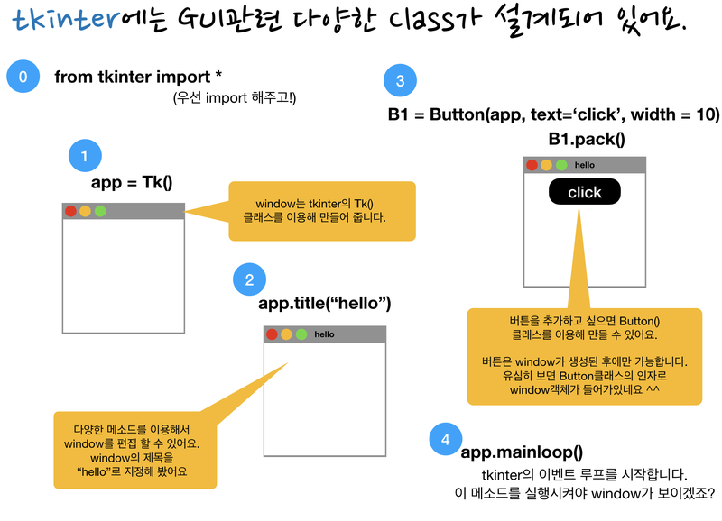

# AIFFEL_15일차 2020.08.12

Tags: AIFFEL_DAILY

### 일정

- cs231n lecture 5 한글 정리내용 읽어보기
- 풀잎스쿨 : cs231n lecture 5
- LMS F-13
- LMS F-14

# [F-13]🦄 가랏, 몬스터볼! 전설의 포켓몬 찾아 삼만리

---

### **학습 전제**

---

- numpy, pandas를 활용해서 표 데이터를 다뤄본 적이 있고, 이에 대한 기본적인 활용을 할 수 있다.
- pandas의 문법과 다양한 메서드를 활용해본 적이 있고, 코드를 보면 어느정도 이해할 수 있다.
- matplotlib을 활용해서 데이터 시각화를 해본 적이 있고, 코드를 보면 어느정도 이해할 수 있다.
- 데이터셋을 train/test 데이터셋으로 나누어서 모델을 학습 및 검증해본 경험이 있다.

### 본격적으로 시작하기 전의 팁들

---

포켓몬의 이름, 속성, 또는 공격력이나 방어력 등과 같은 스탯 값만을 가지고 전설의 포켓몬인지 아닌지를 구별해낼 수 있을까요?

오늘은 이러한 분류 문제를 풀기 위해 **데이터를 밑바닥부터 샅샅이 뜯어보는 연습**을 할 것입니다.

이러한 과정을 **탐색적 데이터 분석(Exploratory Data Analysis, 이하 EDA)** 라고 합니다.

데이터를 다루는 작업을 할 때는 어떤 데이터든 처음에 이렇게 **간략하게라도 꼭 데이터셋을 이해하고 시작하는 것이 중요**합니다.

**원본 데이터는 훼손하지 않고 놔두기 위함입니다.** 꼭 필요한 과정은 아니지만, 이렇게 원본 데이터를 메모리 상에 따로 두는 습관은 다양한 데이터 작업을 할 때 때때로 도움이 됩니다.

### 결측치?

---

```python
pokemon.isnull().sum()
```

데이터셋을 다룰 때 빈 데이터를 다루는 것은 매우 조심스러운 일입니다. 데이터셋의 성격에 따라 빈 데이터를 어떻게 다루어야 할지에 대한 방법이 달라지기 때문이죠.

### 중복값?

---

```python
len(set(pokemon["#"]))
```

파이썬에서 set 자료형이 중복값을 가질 수 없다는 점을 활용하는 것!

### groupby, count

---

```python
# print(pokemon.columns)
print(pokemon.groupby('Type 1').count())
```

### 차집함 함수 (set difference)

---

```python
set(pokemon["Type 2"]) - set(pokemon["Type 1"])
```

### 시각화하여 데이터를 살펴보자

---

일반 포켓몬과 전설의 포켓몬 속성 분포가 각각 어떤지 확인하겠습니다.

우리의 데이터는 일반 포켓몬보다 전설의 포켓몬 수가 매우 적은 불균형 데이터이기 때문에, 전설의 포켓몬은 따로 시각화해 주는 것이 좋을 것 같군요.

피벗 테이블을 사용해보자.

```python
# Type1별로 Legendary 의 비율을 보여주는 피벗 테이블
pd.pivot_table(pokemon, index="Type 1", values="Legendary").sort_values(by=["Legendary"], ascending=False)
```

참고로, Type 2에는 NaN(결측값)이 존재했었습니다. Countplot을 그릴 때는 결측값은 자동으로 제외됩니다.

pokemon['Total'].values 와 pokemon[stats].values 들의 총합이 같은 포켓몬의 개수를 sum으로 확인해보는 것. 근데, stats의 경우에는 포켓몬별로 가로 방향으로 더해야하기 때문에 axis=1이 들어가있음!

```python
sum(pokemon['Total'].values == pokemon[stats].values.sum(axis=1))
```

total 값과 type에 따라 시각화해보자!

```python
fig, ax = plt.subplots()
fig.set_size_inches(18, 6)

sns.scatterplot(data=pokemon, x="Type 1", y="Total", hue="Legendary")
plt.show()
```

전설의 포켓몬은 주로 Total 스탯 값이 높다는 것이 확인됩니다.

### subplot with seaborn

---

```python
figure, ((ax1, ax2), (ax3, ax4), (ax5, ax6)) = plt.subplots(nrows=3, ncols=2)
figure.set_size_inches(18, 18)

sns.scatterplot(data=pokemon, y="Total", x="HP", hue="Legendary", ax=ax1)
sns.scatterplot(data=pokemon, y="Total", x="Attack", hue="Legendary", ax=ax2)
sns.scatterplot(data=pokemon, y="Total", x="Defense", hue="Legendary", ax=ax3)
sns.scatterplot(data=pokemon, y="Total", x="Sp. Atk", hue="Legendary", ax=ax4)
sns.scatterplot(data=pokemon, y="Total", x="Sp. Def", hue="Legendary", ax=ax5)
sns.scatterplot(data=pokemon, y="Total", x="Speed", hue="Legendary", ax=ax6)
plt.show()
```

### 찾고자 하는 답의 데이터 분포를 살펴보는 아이디어 - (1)

---

흠, 총 65마리의 전설의 포켓몬이 9개의 Total값만 가진다는 것은,

약 7.22마리 끼리는 같은 Total 스탯 값을 가진다는 의미와 같습니다.

일반 포켓몬은 총 195가지의 Total 속성값을 가지고, 전체 일반 포켓몬은 (800 - 65), 즉 735마리이므로, 약 3.77마리만 같은 Total 스탯 값을 가지는군요.

- **`Total`**값의 다양성은 일반 포켓몬이 전설의 포켓몬보다 두 배 가까이 된다. 즉 전설의 포켓몬의 **`Total`**값은 다양하지 않다.: **한 포켓몬의 `Total` 속성값이 전설의 포켓몬의 값들 집합에 포함되는지의 여부**는 전설의 포켓몬임을 결정하는 데에 영향을 미친다.
- 또한, **전설의 포켓몬의 `Total` 값 중에는 일반 포켓몬이 가지지 못하는 `Total`값이 존재**한다. ex) 680, 720, 770, 780: **`Total`**값은 전설의 포켓몬인지 아닌지를 결정하는 데에 이러한 방식으로도 영향을 미칠 수 있다.

⇒ 두 번째 생각의 지점! A라는 대상이 갖지 못하는 데이터에 대해 파악해보는것! 반대로, A라는 대상만 가질 수밖에 없는 데이터에 대해 파악해볼 수도 있겠지!

### column A 의 값으로부터 새로운 column을 추가해주기

---

datetime 함수를 사용했던 것과 비슷한 맥락

```python
legendary["name_count"] = legendary["Name"].apply(lambda i: len(i))    
legendary.head()
```

### 찾고자 하는 답의 데이터 분포를 살펴보는 아이디어 - (2)

---

**전설의 포켓몬의 이름이 10 이상일 확률은 41%**를 넘는 반면에,

**일반 포켓몬의 이름이 10 이상일 확률은 약 16%**밖에 안됨을 확인할 수 있습니다!

이는 아주 큰 차이이므로 legendary인지 아닌지를 구분하는 데에 큰 의미가 있습니다.

⇒ 이렇게 정답과 정답이 아닌 것에 대해 명확한 차이가 보이는 항목(column) 찾아내는 것이 EDA 에서 얻어내고자 하는 것 중 하나라는거지. 모든 항목을 신경쓰며 작업을 진행하기가 어려우니, 신경을 많이 써야할 항목을 찾아내는것!

## 모델에 넣기위해! 데이터 전처리하기

---

데이터 분석을 통해 머신러닝을 수행하고 싶다면, 데이터를 모델에 입력할 수 있는 형태로 변환하는 것이 매우 중요합니다.

머신러닝을 수행할 모델은 문자열 데이터를 처리할 수 없기 때문에 이를 적절한 숫자 데이터 또는 True, False를 나타내는 부울(bool) 데이터 등으로 전처리하는 과정이 필요합니다.

다만, 전설의 포켓몬을 분류하는 데에 이름의 길잇값 자체를 가진 **`name_count`** 컬럼이 더 유리할지, 혹은 **`long_name`**이 더 유리할지는 아직 모릅니다.

따라서 모델을 학습시킬 때에는 두 가지를 모두 활용해 볼 것입니다.

### isalpha() 함수를 이용한 알파벳 이외의 문자가 들어간 이름 걸러내기

우리는 알파벳이 아닌 문자를 포함하는 이름을 걸러내고 싶은데, 주의할 점은 이름에 띄어쓰기가 있는 경우에도 isalpha() = False로 처리된다는 점입니다.

*알파벳 이외의 문자가 들어간 이름을 가진 포켓몬들 확인해보기

print(pokemon[pokemon["name_isalpha"] == False].shape)
pokemon[pokemon["name_isalpha"] == False]

### **Dot(.)**

정규 표현식의 Dot(.) 메타 문자는 줄바꿈 문자인 `\n`을 제외한 모든 문자와 매치됨을 의미한다.

> ※ 나중에 배우겠지만 정규식을 작성할 때 re.DOTALL 옵션을 주면 \n 문자와도 매치된다.

붙어있는 이름을 우리는 대문자로 시작해서 소문자로 끝나는 토큰들로 분리하고 싶습니다. 그러기 위해서는 대문자로 시작해서 소문자로 끝나는 패턴을 찾으면 됩니다.

```python
tokens = re.findall('[A-Z][a-z]*', temp)
tokens
```

- **`[A-Z]`** : **`A`**부터 **`Z`**까지의 대문자 중 한 가지로 시작하고,
- **`[a-z]`** : 그 뒤에 **`a`**부터 **`z`**까지의 소문자 중 한 가지가 붙는데,
- **`*`** : 그 소문자의 개수는 하나 이상인 패턴 (**`*`**는 정규표현식 중에서 "반복"을 나타내는 기호)

### Collections.Counter

list 또는 set의 자료형에서 각 요소의 개수를 다루고 싶을 때에는 파이썬의 collection이라는 패키지를 사용하면 편리합니다. most_common()을 통해 가장 자주 나타난 내역을 집계할 수도 있다.

```
import collections
 
myList = ['a', 'b', 'c', 'c', 'a', 'a']
myCounter = collections.Counter(myList)
print('myCounter:', myCounter)
# myCounter: Counter({'a': 3, 'c': 2, 'b': 1})
 
print("myCounter['a']:", myCounter['a'])
# myCounter['a']: 3
 
yourList = ['a', 'd', 'c', 'a', 'b']
yourCounter = collections.Counter(yourList)
print('yourCounter:', yourCounter)
# yourCounter: Counter({'a': 2, 'd': 1, 'b': 1, 'c': 1})
 
ourCounter = myCounter + yourCounter
print('ourCounter:', ourCounter)
# ourCounter: Counter({'a': 5, 'c': 3, 'b': 2, 'd': 1})
 
print('ourCounter.most_common(3):', ourCounter.most_common(3))
# ourCounter.most_common(3): [('a', 5), ('c', 3), ('b', 2)]
```

가장 많이 쓰인 토큰을 찾아보자!

```python
most_common = Counter(token_set).most_common(10)
most_common
```

Pandas에서 문자열 데이터셋에 특정 구문이 포함되어 있는지 여부는 str.contains 함수로 간단히 확인할 수 있습니다.

```python
for token, _ in most_common:
    pokemon[token] = pokemon["Name"].str.contains(token)

pokemon.head(10)
```

⇒ most_common을 통해 찾아낸 legendary 포켓몬에 많이 들어가는 이름 토큰을 기준으로 포켓몬 데이터에 적용시켜보기 (이름에 해당 토큰이 들어간 경우 찾기). 그리고 적용시킨 결과를 token 이라는 이름의 column으로 넣어주기

## 학습 및 확인

---

### 베이스라인 모델

---

베이스라인 모델이란 가장 기초적인 방법으로 만든 모델입니다.

베이스라인 모델은 성능은 안 좋을지 모르지만, 성능 하한선을 제공함으로써 우리가 새롭게 만들 모델이 맞는 방향으로 가고 있는지 확인할 수 있게 도와줍니다. (맞는 모델 구현이라면 적어도 베이스라인 모델보다는 성능이 잘 나와야겠죠!).

베이스라인 모델을 만들면 자신이 데이터를 맞게 이해하고 있는지 확인할 수도 있습니다.

### 의사결정트리 모델 학습시키기 with 원본데이터

---

전체 800마리 중, 단 65마리만 전설의 포켓몬이고, 735마리는 일반 포켓몬이었습니다. 이것이 무엇을 뜻하죠?

바로, 800마리를 전부 다 일반 포켓몬으로 예측하더라도, 735마리는 일단 맞추고 들어간다는 것을 뜻합니다.즉, 아무런 학습을 안하고 모든 답을 하나로 찍어도, 735 / 800 * 100 = 92% 의 정확도를 달성할 수 있다는거죠.따라서 이번 데이터셋에서는 정확도로 모델의 성능을 평가하는 것은 거의 의미가 없습니다.

⇒ 정답이 되는 데이터의 분포를 통해 어떤 지표를 성능 평가 지표로 사용해야하는지 기준으로 사용할 수 있다!

불균형 데이터에서는 무엇보다 적은 양의 데이터인 '***Positive**'* 를 잘 잡아내는 것이 중요합니다. 즉, 전설의 포켓몬을 잘 잡아내는 것이 중요하죠. ⇒ ***recall 이 유용한 지표가 될 수 있겠죠***

학습이 덜 되었다면 전설의 포켓몬을 그냥 일반 포켓몬으로 치고 넘어갈 테고, 잘 될 수록 집요하게 적은 전설의 포켓몬을 잡아낼 테니까요!

### 피쳐 엔지니어링이 된 데이터로 학습시키면??

---

원본 데이터에서 이름, type 값들을 토대로 column들을 많이 추가해줬었음!

⇒ 이걸 가지고 해보니 recall 값이 많이 상승하더라!

# [F-14] Tkinter로 배우는 GUI 프로그래밍

---

### **학습 목표**

---

- 파이썬 Tkinter 라이브러리를 이용해 GUI를 프로그래밍해 봅니다.
- 기본 GUI 화면의 동작에 나오는 **`Event`** 와 **`mainloop()`** 원리를 이해합니다.
- GUI 화면을 구성하는 위젯들에 대해 알아봅니다.
- 간단한 Tkinter GUI 프로그램을 직접 구현해 봅니다.

[참고자료]

[https://realpython.com/python-gui-tkinter/](https://realpython.com/python-gui-tkinter/)

Although Tkinter is considered the de-facto Python GUI framework, it’s not without criticism. One notable criticism is that GUIs built with Tkinter look outdated. If you want a shiny, modern interface, then Tkinter may not be what you’re looking for.

However, Tkinter is lightweight and relatively painless to use compared to other frameworks. This makes it a compelling choice for building GUI applications in Python, especially for applications where a modern sheen is unnecessary, and the top priority is to build something that’s functional and cross-platform quickly.

### CLI ⇒ GUI, 사용자 접점의 중요성

---

CLI가 주는 사용자 경험은 전문가인 사용자 경험밖에 제공할 수가 없다. 그러나 그래픽 상의 인터페이스를 마우스로 조작하는 것은 일반인 사용자의 경험을 제공할 수 있게 된다. 이것은 컴퓨터의 대중화를 가속화하는데 결정적인 이점을 제공한다.

더욱이 머신러닝 엔지니어를 꿈꾸는 여러분들**은 사용자 접점**에 더욱 주목할 필요가 있습니다. **사용자가 발생시키는 데이터는 모두 그 접점에서 발생하는 것이기 때문**입니다. 그리고 **머신러닝이란 어떤 데이터를 입력과 출력으로 삼느냐에 따라 우리가 만들고자 하는 함수가 규정되는 것**이기 때문입니다.

## Tkinter

---

```python
window.mainloop()
# window가 보이게 해주는역할? GUI 를 나타내는 프로세스를 실행시키는 함수? 
```



### event, event loop

---

사용자가 키보드를 누르거나 마우스 버튼을 클릭하는 것이 대표적인 "이벤트"입니다.

이벤트 루프 방식은 이벤트가 발생했을 때 바로 보내는 것이 아니라 이벤트 루프를 동작시켜 그 이벤트를 보내는 방식의 프로그램 방법입니다.

⇒ 일반적으로 웹 프론트에서 이벤트 핸들링 하는 방식 ㅇㅇ

### Tkinter OOP Hierarchy

---


### Tkinter 사용해보기 : Button, Layout

---

```python
from tkinter import *
import tkinter.ttk as ttk
import tkinter.messagebox as tmb

print('코드 실행 중..🛸')
window = Tk()   
window.title("ex3_Button")   
window.geometry("480x320") 

label1 = ttk.Label(window, text="Label")
label1.grid(column=0, row=0)

# 버튼클릭 이벤트 핸들러 정의
def click():
    label1.configure(text='버튼이 눌렸습니다.')   # 버튼이 눌리면 라벨 텍스트값을 바꿉니다.
    tmb.showinfo("버튼", "버튼클릭!!")                 # 그리고 메시지박스로 버튼클릭을 알립니다.

# 버튼 생성
action = ttk.Button(window, text="버튼을 눌러주세요", command=click)   
action.grid(row=0, column=1)

window.mainloop()
print('완료!')
```

```python
from tkinter import *
import tkinter.ttk as ttk

print('코드 실행 중..🛸')
window = Tk()
window.title("Layout_pack")
window.geometry("480x320") 

B1 = Button(window, text="Left").pack(side="left", padx=20, pady=20)
B2 = Button(window, text="Right").pack(side="right", padx=20, pady=20)
B3 = Button(window, text="Top").pack(side="top", padx=20, pady=20)
B4 = Button(window, text="Bottom").pack(side="bottom", padx=20, pady=20)

window.mainloop()
print('완료!')
```

grid, pack, place 세가지 중 무엇을 사용하든 상관없습니다. 그러나 이 중 하나도 사용하지 않으면 위젯이 나타나지 않아요!

Google Translate API 활용

```python
$ pip install googletrans

# =================================
from googletrans import Translator

def translate(input_str, lang='en'):
    translator = Translator()
    result = translator.translate(input_str, dest=lang)
    return result.text

translate('안녕하세요', lang='en')
```

```python
## 미니번역기
from tkinter import *
import tkinter.ttk as ttk
from googletrans import Translator

print('코드 실행 중..🛸')
window = Tk()
window.title("나의 구글 번역기")

window.geometry("1024x512")

label1 = Label(window, text="번역전")
label2 = Label(window, text="번역후")
label1.grid(row=0, column=0, padx=20, pady=10)
label2.grid(row=0, column=2, padx=20, pady=10)

combo = ttk.Combobox(window, width=10)
combo['values']= ("en", "ko", "ja")
combo.current(0) #set the selected item
combo.grid(row=0, column=1)

text1 = Text(window, width=60, height=40)
text2 = Text(window, width=60, height=40)
text1.grid(row=1, column=0, padx=20, pady=10)
text2.grid(row=1, column=2, padx=20, pady=10)

def translate(input_str, lang='en'):
    translator = Translator()
    result = translator.translate(input_str, dest=lang)
    return result.text

def click():
    intput_str = text1.get("1.0","end")
    lang=combo.get()
    output_str = translate(intput_str, lang=lang)
    text2.delete(1.0, "end")
    text2.insert("end", output_str)

action = ttk.Button(window, text="번역", command=click)   
action.grid(row=1, column=1)

window.mainloop()
print('완료!')
```