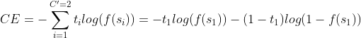

# AIFFEL_17일차 2020.08.14

Tags: AIFFEL_DAILY

### 일정

1. LMS F-15
2. cs231n lecture 6 마무리
3. 일주일 복습

# 기타

---

### Binary Cross-Entropy Loss

---

[https://gombru.github.io/2018/05/23/cross_entropy_loss/#:~:text=is available here-,Binary Cross-Entropy Loss,affected by other component values](https://gombru.github.io/2018/05/23/cross_entropy_loss/#:~:text=is%20available%20here-,Binary%20Cross%2DEntropy%20Loss,affected%20by%20other%20component%20values).

Sigmoid activation 과 Cross-Entropy loss 를 합친 것.

Softmax loss 와 다르게, 각 벡터 컴포넌트가 독립적이게 된다. CNN 에서 나오는 벡터 컴포넌트들이 다른 컴포넌트에 의해 영향을 받지 않게 된다. 그래서 multi-label classification에 사용된다.




# [F-15] 더 많이! 더 깔끔하게! 데이터를 관리하는 데이터베이스

---

### **학습 목표**

---

- 데이터를 연산하는 방법에 대해 학습합니다.
- Pandas, Class를 이용한 데이터 연산법을 연습합니다.
- Database에 대해 학습하고, Python을 이용해 간단한 Database를 직접 사용해 봅니다.

데이터를 합치는 건 좋지만 그렇다고 막 같다 붙이면 안되겠죠. 데이터를 합칠 때는 어떤 연관이 있어야 합니다. 즉 서로 관계가 있는 데이터에 대해서 합칠 수 있습니다.

### pd.merge()

merge() 메소드는 공통의 칼럼에 있는 값을 키로 사용해 데이터를 합쳐줍니다.

on 인자에 키 값을 넣어 주어 공통 칼럼이 여러 개인 경우를 대비해 직접 값을 넣어줄 수 있으며, 키 값이 될 수 있는 필드가 1개더라도 명확한 코드를 작성하기 위해 키 값을 담은 컬럼(column)의 이름을 직접 나타내주면 좋습니다.

```python
pd.merge(df1, df2, on='Student')
```

공통의 데이터에 대해서만 데이터를 합치는 것을 inner join 이라고 합니다. 꼭 Pandas가 아니더라도 관계형 데이터베이스 전반에 쓰이는 용어이지요.

```python
pd.merge(df1, df2, how='inner')
```

outer join은 전체 데이터에 합치는 연산을 합니다.

```python
pd.merge(df1, df2, how='outer')
```

### df.join()

```python
df1.join(df2, how='outer', lsuffix='_caller', rsuffix='_other') 
# '_caller'인 df1 컬럼이 왼쪽에 가도록 배치
```

### pd.concat()

인덱스가 처음부터 시작하는 경우가 있는데 그때는 ignore_index 인자를 True로 설정해 줍니다

```python
pd.concat([df1, df2], sort=False, ignore_index=True)
```


Pandas 기능활용의 이점에 대한 생각

Pandas가 내부적으로 인덱스(index)를 가지고 있어서 필터링, 탐색, 그룹 질의 등을 매우 빠르게 수행해 주기 때문이었습니다.

## 데이터 필터링

---

필터링 방법에는 몇 가지 방법이 있습니다.

- 경우에 따라 몇 개의 행들을 먼저 고르고 거기서 원하는 칼럼만 선택하거나,
- 혹은 칼럼을 먼저 선택한 다음 특정 행만 선택하는 순서로 데이터를 필터링 할 수도 있지요.

### df.loc

```python
df.loc[[행],[열]]
print(df.loc[0, 'B'])
print(df.loc[:, 'A'])
```

### iloc

정수 인덱스 를 사용하여 행 또는 열(칼럼)을 지정, 데이터를 추출합니다.

```python
df.iloc[[행],[열]]
# 행, 열에 숫자만 들어가는거!
```

## 그룹연산 : groupby(), apply()

---

값을 선택하거나 데이터를 정렬할 때 기준이 되는 값을 키(key)라고 부릅니다.

일반적인 데이터베이스에서는 이 키 값에 따라 그룹을 묶은(grouping) 뒤 원하는 연산을 수행할 수 있습니다. **Pandas에서는 groupby()** 연산이라고 합니다.

- groupby()객체를 생성
- groupby()객체의 연산을 수행
    - max(), min(), sum(), mean()
    - + apply() 메소드를 통해 특수 수식에 대한 연산을 수행할 수 있습니다.

```python
import numpy as  np
df.groupby(['Columns1']).max().apply(np.sqrt)
```

### apply() 의 사용

```python
# Q10을 위한 코드를 작성해 주세요.
#print(sal.head())

def chief_string(title):
    if 'chief' in title.lower().split(): 
        return True
    else:
        return False
sum(sal['JobTitle'].apply(lambda x : chief_string(x)))
```

## 데이터베이스

---

동일한 데이터를 여러 프로세스가 동시에 접근해서 변경하려고 들 때, 한 프로세스의 변경이 다른 프로세스의 변경을 무효화해서는 안됩니다.

DBA(Database Architect)는 데이터를 어떻게 관리할지, 어떤 항목으로 관리할지 등을 설계하고 데이터베이스에 접근하기 위한 쿼리를 작성합니다. 이때 설계하는 데이터베이스의 구조를 전문 용어로 스키마(schema)라고 부릅니다.

### 관계형 데이터베이스 (Relational Database)

---

키(key)와 값(value)들의 간단한 관계를 테이블화 시킨 매우 간단한 원칙의 전산정보 데이터베이스이다.이 모델은 데이터를 컬럼(column)과 로우(row)를 이루는 하나 이상의 테이블(또는 관계)로 정리하며**, 고유 키(Primary key)가 각 로우를 식별**한다. **로우는 레코드나 튜플로 부른다.** 일반적으로 각 테이블/관계는 하나의 엔티티 타입(고객이나 제품과 같은)을 대표한다. 로우는 그 엔티티 종류의 인스턴스(예: "Lee" 등)를 대표하며 컬럼은 그 인스턴스의 속성이 되는 값들(예: 주소나 가격)을 대표한다.

⇒ 데이터를 "표" 형태로 표현하고 어떤 관계(연관)가 있는 항목끼리 묶어서 관리하는 체계


데이터에 **의미가** 생기려면 그 데이터를 지칭할 수 있는 **이름이** 있어야 합니다. 관계형 DB는 테이블 형태로 정리된 엄청난 데이터 더미 속 그 어느 곳에라도 의미를 부여할 수 있게 합니다.

### SQL

---

웹의 번성을 가능하게 했던 것도 HTML이라는 간단한 문법의 언어로 표준화할 수 있었기 때문이라면, 데이터베이스 또한 **SQL이라는 표준 인터페이스**를 누구나 제공할 수 있었기 때문에 대중화가 가능했던 것입니다.

파이썬 인터프리터는 데이터베이스를 바로 사용할 수 있도록 표준 API를 지원 합니다. PEP249가 바로 그 스펙이에요.

- 참고: [PEP 249 -- Python Database API Specification v2.0](https://www.python.org/dev/peps/pep-0249/)

### **데이터베이스에 반영: `commit()`**

쿼리 명령어를 데이터베이스에 반영하기 위해선 꼭 **`commit()`** 함수를 써주어야 해요.

### **종료: `close()`**

데이터베이스 관련 작업이 끝나면 종료를 해주세요. 파일 객체를 종료하는 것과 비슷합니다.

파이썬에는 SQLite 드라이버가 내장되어 있다. 그걸 이용해서 메모리에 SQLite3 DB를 생성하고 사용해보는 예시

```python
import sqlite3

conn = sqlite3.connect(':memory:')
query = """CREATE TABLE sales
            (product VARCHAR(20),
            maker VARCHAR(40),
            amount FLOAT,
            date DATE);"""
conn.execute(query)
conn.commit()

data = [('smart phone', 'Apple', '47.2', '2019-08-03'),
        ('printer', 'Samsung', '15.2', '2018-02-10',),
        ('monitor', 'LG', '14.25', '2019-12-20'),
        ('python book', 'Amazon', '12.40', '2020-01-23')]
statement = "INSERT INTO sales VALUES(?, ?, ?, ?)"
conn.executemany(statement, data)
conn.commit()

cursor = conn.execute("SELECT * FROM sales")
rows = cursor.fetchall()

row_counter = 0
for row in rows:
    print(row)
    row_counter +=1

print("Number of rows: {}".format(row_counter))
```