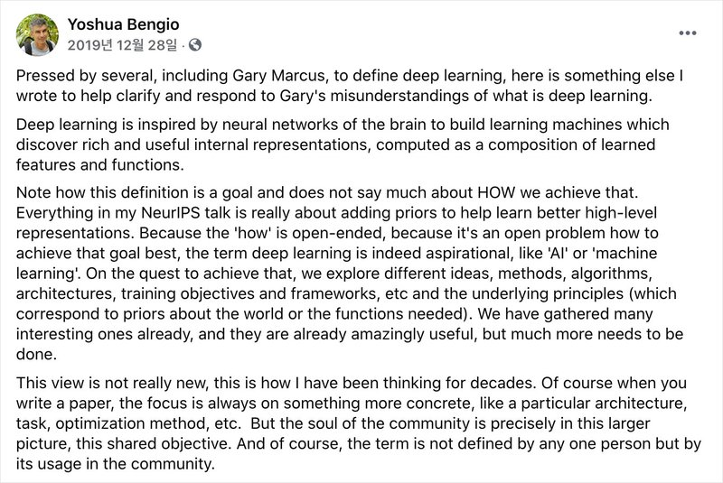

# AIFFEL_12일차 2020.08.07

Tags: AIFFEL_DAILY

### 일정

1. LMS F-10 : 딥러닝과 신경망의 본질 (feature)
2. 풀잎스쿨 : 나만의 글쓰기
3. backpropagation 추가 학습 및 cs231n 5강 듣기

---

# [F-10] 딥러닝과 신경망의 본질 (feature)

### **학습 목표**

---

- 딥러닝과 머신러닝의 차이를 설명할 수 있다.
- 딥러닝은 특히 데이터를 '표현'하는 것을 목표로 하며, '표현 학습'이라고 이야기 할 수 있는 본질을 이해한다.
- 연결주의를 계승하여 채택한 신경망 모델의 본질을 함수 차원에서 이해한다.
- 선형성이 무엇인지 설명할 수 있다.

[https://wendys.tistory.com/136](https://wendys.tistory.com/136)

???

머신러닝과 가장 큰 차이점은 딥러닝은 분류에 사용할 데이터를 스스로 학습할 수 있는 반면 머신 러닝은 학습 데이터를 수동으로 제공해야한다는점이 딥러닝과 머신러닝의 가장 큰 차이점입니다.

- 인공지능은 사람이 직접 프로그래밍 한 내용이 아니라 기계가 자체 규칙 시스템을 구축하는 과학을 말한다.
- 그 중에서도 머신러닝은 데이터를 통해 스스로 학습하는 방법론을 말한다. 데이터를 분석하고, 데이터 안에 있는 패턴을 학습하며, 학습한 내용을 토대로 판단이나 예측을 한다.
- 머신러닝의 하위 집합인 딥러닝은 학습하는 모델의 형태가 신경망인 방법론을 말한다.

---

## Representation Learning

---

딥러닝을 단순히 머신러닝의 하위 집합 중 하나라고만 설명하기엔 그 특성을 뚜렷하게 뒷받침하지 못하는 것 같습니다.

뇌를 구성하는 신경세포를 닮은 뉴런의 형태를 가지는 '신경망'을 모델로 활용하는 것이 딥러닝이라는데, 그렇다면 왜 하필 신경망일까요?그리고 그 신경망이 뭐길래 그토록 잘 되고, 이전에는 풀지 못했던 많은 문제들을 해결하고 있는 걸까요?

그러니까, '왜 딥러닝이냐'는 본질적인 의문을 갖게 됩니다. 신경망을 모델로 하는 딥러닝은 어디서부터 왔고, 그 이면에 담긴 철학은 무엇일까요?

오늘 RNN과 attention-based 방법을 자세히 설명하지는 않겠지만, 두 가지 모두 단순한 '순방향 행렬 연산'만으로 이루어지지는 않으며, 그 성능을 인정받아 활발하게 응용되고 있는 방법론들입니다.

> Deep learning is inspired by neural networks of the brain to build learning machines which discover rich and useful internal representations, computed as a composition of learned features and functions.

의역하자면 다음과 같습니다.

> 뇌의 신경 구조로부터 영감을 받아 신경망 형태로 설계된 딥러닝의 목표는, "합성된 함수를 학습시켜서 풍부하면서도 유용한 '내재적 표현'을 찾아내는 machine을 구축하는 것"이다.

**internal representation,** 즉 '**내재적 표현**'이라는 단어를 사용합니다. 표현(Representation)은 딥러닝에서 굉장히 중요하게 여겨지는 개념입니다. 벤지오가 언급했듯 데이터의 '**좋은 표현**'을 찾아낼 수 있는 machine을 만드는 것이 딥러닝의 궁극적인 목표이기도 하죠.

### Representation

그렇다면 '내재적 표현', 혹은 '표현(Representation)'은 무엇을 의미할까요?

꽃 이미지를 '데이터'라고 했을 때,

데이터는 다양한 방법으로 '**표현**' 될 수 있습니다.

⇒ 분자, 이미지, 표, 카테고리

표 형식으로 나타낼 때에는 먼저 해당 데이터를 '어떤 특징(Feature)으로 나타낼 것인지', 즉 각 열의 내용을 적합한 것들로 정의하는 과정이 필요합니다.

카테고리는 머신러닝에서 주로 '예측하고자 하는 값'으로 사용되는 것이기도 합니다. 데이터를 카테고리로 표현하려면 '어떤 카테고리 공간이 있는지'와 '그 중 어떤 카테고리에 속하는지'를 정하는 과정이 필요합니다.

카테고리를 활용한 표현은 사람의 개입이 매우 강하게 들어갑니다. 사람이 카테고리 공간을 잘 정의해놔야, 해당 데이터가 알맞은 카테고리로 표현될 수 있습니다.

네 가지 표현 방법은 언뜻 보기에는 아무런 관련이 없어보일 수 있지만, 사실 아주 강력한

**'계층적(Hierarchical)'**인 관계를 갖고 있습니다.무슨 말인고 하니, 1번부터 4번으로 갈수록 **'사람의 개입'** 이 강하게 들어가는 표현이라는 겁니다.

결국, 딥러닝의 정리를 다시 한 번 해보자면,

⇒ 사람이 개입하여 만들어내는 형태의 데이터로 결과물을 만들어낼 수 있는 진정한 사람같은 사고를 갖는 기계를 만드는 것

⇒ 뇌의 신경 구조로부터 영감을 받아 신경망 형태로 설계된 딥러닝의 목표는, '합성된 함수를 학습시켜서 풍부하면서도 유용한 '내재적 표현'을 찾아내는 machine을 구축하는 것'이다.

⇒ '표'나 '카테고리'와 같은 추상적이고 내재적인 표현들을 사람의 개입 없이 딥러닝만으로 나타낼 수 있는 모델을 학습시키는 것이 궁극적인 목표라고 할 수 있습니다.

VGG16 모델에 데이터를 집어 넣는다는 의미

---

만약 입력되는 이미지의 크기가 (224x224x3)이었다면 약 15만 개의 숫자로 데이터가 표현됩니다. 이를 잘 학습된 딥러닝 네트워크에 먹이면 단 1,000개의 숫자만으로 그 이미지의 내재된 특성들을 모두 표현할 수 있게 되는 것입니다. 놀랍게도 사람이 가르쳐준 규칙 없이도요! (물론 네트워크를 학습시키는 것은 사람의 몫입니다. 하지만 한 번 잘 학습시켜 놓으면 몇 천, 몇 만 장의 이미지를 수 분 내에 처리할 수 있다는 것이 중요한 포인트죠)

***⇒ 15만 개의 숫자에서 1,000개의' 좋은 표현'을 추출해내고 '내재적 표현'을 얻어내는 것!***

- 데이터의 **내재된 표현**이란, 그 데이터가 담고 있는 정보의 총체, 혹은 **함의**를 나타내는 표현을 말한다. 다만, raw한 sensory 데이터는 그 자체로는 중요한 의미를 담지 못하고 있을 수 있다. *마치 이미지를 멀리서 보면 강아지가 보이지만, 각 픽셀 하나하나의 값들은 강아지와 직접적인 연관이 없는 것과 같다.*
- 이러한 맥락에서 데이터로부터 **표현을 추출해낸다**는 것은 데이터 안에 내재되어 있는, **추상적인 표현을 추출한다는 것**을 의미한다. 강아지가 찍힌 이미지에서 좋은 표현을 추출해내려면 픽셀 하나하나의 값으로부터 '강아지'라는 의미를 담고 있는 벡터를 추출해낼 수 있어야 할 것이다.
- 딥러닝의 본질은 이렇게 **데이터로부터 내재된 표현을 추출해내는 것**이며, 이는 모델을 Gradient Descent 기반의 학습으로 수행할 수 있다. 물론 더 뛰어난 모델을 얻기 위해서는 모델의 구조나 최적화 기법 등의 세부적인 요인들을 연구하는 것이 필수적이다.

'날 것의' 데이터를 입력하면 알아서 그 안에 내재된 표현을 추출한다는 것, 이것이 바로 딥러닝이 추구하는 목표의 본질입니다!

---

## 딥러닝을 관통하는 철학

---

### 1. 행동주의

딥러닝의 본질에 대해 논하려면 'Connectionism(연결주의)'이라고 불리는 인지과학의 한 학파로 거슬러 올라가야 합니다. 인지과학은 인간의 지능을 자극과 반응의 관계로만 설명하던 행동주의 심리학에 반발하면서 등장한 학문이죠.

> 행동주의: 학습된 행동은 자극의 반복으로 만들어진다

**행동주의**는 인간의 지능이 **'자극 → 행동'** 과정의 반복으로 만들어진다고 주장합니다.

행동주의는 인간, 혹은 인간뿐만 아니라 모든 생명체의 지능은 반복되는 자극에 따라 형성된다고 주장하였습니다.

### 조작적 조건화

생명체가 외부에서 받는 자극으로 인해 학습되는 과정을 '조작적 조건화(Operant Conditioning)'라고 합니다.

[https://ko.wikipedia.org/wiki/조작적_조건화](https://ko.wikipedia.org/wiki/%EC%A1%B0%EC%9E%91%EC%A0%81_%EC%A1%B0%EA%B1%B4%ED%99%94)

⇒ 조작적 조건화(操作的條件化, Operant Conditioning)는 행동주의 심리학의 이론으로, 어떤 반응에 대해 선택적으로 보상함으로써 그 반응이 일어날 확률을 증가시키거나 감소시키는 방법을 말한다. 여기서 선택적 보상이란 강화와 벌을 의미한다. 조작적 조건화는 작동적 조건화(作動的條件化), 도구적 조건화(道具的 條件化, Instrumental conditioning)라고도 한다.

이렇게 어떤 행동을 한 뒤에 생명체가 원하는 것을 제공하는 것을 강화(Reinforcement)라고 한다.

생명체가 자신에게 유리한 결과를 가져다주는 행동을 알게 된다면 그 행동의 빈도를 높인다는 '강화이론'은, 머신러닝의 방법론 중 '강화학습(Reinforcement Learning)'의 근간이 되는 이론이기도 합니다

### 2. 인지주의

행동주의를 반대하며 제기된 학문이 바로 인지심리학입니다.

'자극 → (정보처리) → 행동' 의 관점을 제시하였다.

즉, 인지심리학은 인간의 마음을 일종의 정보 처리 체계로 보고 접근하고, 이에 따라 인간의 뇌가 정보를 처리하는 과정에 대해 관심을 가지며 신경과학이라는 새로운 분야를 만들어냈다.

인지주의는 자극과 반응 사이에 있는 '정보처리' 과정에 관심을 두었습니다.

### 3. 연결주의

인지주의에는 자극으로부터 반응을 하기까지 정보를 처리하는 과정을 수행하는 모형이 몇 가지 있습니다.

그 중 우리가 주목해야 할 것은 바로 **연결주의(Connectionism)** 입니다. 연결주의는 몇 백억 개의 뉴런이 연결되어 있는 뇌의 형태처럼, 수많은 신호들이 연결된 일련의 과정에 따라 정보가 처리된다고 보죠.

---

[https://ko.wikipedia.org/wiki/연결주의](https://ko.wikipedia.org/wiki/%EC%97%B0%EA%B2%B0%EC%A3%BC%EC%9D%98)

연결주의의 지능체는 처음에는 "백지" 상태이며, 다수의 사례를 주고 "경험"함으로써 스스로 천천히 "학습"해 간다. 지능체에 "경험"을 반복해 주고, 다수의 의사 뉴런이 서로 결합하고, 그 결합도 값 (매개 변수)을 점차적으로 변화시켜 간다. 연결주의의 지능체는 처음에는 별로 올바른 반응을 나타내는 것은 아니고 실수도 범하며 어느 정도의 횟수의 경험을 거친 후 점차 지능적인 반응이 나타나는 비율이 증가해 간다. 

---

연결주의는 자극으로부터 반응을 하기까지의 과정에서 뉴런과 같이 연결되어 있는 모형이 정보를 처리해 나간다고 설명한다. 즉, 학습된 내용은 연결된 뉴런 자체에 저장되어 있으며, 외부에서 자극을 받음에 따라 그 연결 형태가 바뀌면서 학습된 내용이 바뀌어간다.

인지주의를 관통하는 문제의식은 '자극을 받아 반응을 하기까지, 생명체 내부에서 정보가 어떻게 표현되거나 처리되기에 "지능"이라는 현상이 나타나는가?'라고 할 수 있습니다. 이 질문에서 **'정보를 표현하거나 처리하는 방법'**에 대해 **답하기 위한 모형 중 하나가 연결주의**인 것이죠.

**딥러닝**은 바로 이 연결주의를 따릅니다. 딥러닝은 뇌의 뉴런이 얽히고 섥혀서 연결되어 있는 모양을 본딴 '인공 신경망'을 모델로 가집니다. **신경망은 자극(input)을 받아 내부에서 일련의 정보처리 과정을 거친 후 반응(output)을 합니다. 신경망 내부에서는 하나의 데이터를 여러 형태로 바꾸어가며 표현(representation)을 해 나가다가, 최종적으로 우리가 의도한 형태의 데이터를 출력하죠.**

이렇게 인지주의와 연결주의의 철학과 문제의식을 계승하였으니 딥러닝의 궁극적인 목표는 생명체가 데이터를 입력받았을 때 내부에서 정보를 처리하고 표현하는 메커니즘을 알아내는 것이라고 할 수 있습니다.

---

## 신경망의 본질

---

신경망은, 다른 이름으로 말하자면 함수라고 할 수 있습니다. 매우 당연하고 간단한 이야기라고 생각할 수 있습니다. 하지만 신경망을 뇌와 비슷한 형태를 모사해 아주 복잡한 형태를 가진, 미지의 무언가라고 생각하기보다는 **입력을 받은 후 내부에서 일련의 연산 과정을 거쳐 출력을 내는 거대한 함수**로 보는 것도 앞으로 많은 딥러닝 기법을 이해할 때 도움이 될 수 있습니다.

## 함수의 역할들

### 1. Relation: x와 y의 관계를 나타낼 수 있는 도구

"y는 x의 함수이다" 라는 표현의 중요한 함의 :

- y는 x의 변화에 종속적이다. 즉, x가 변하면 그 변화하는 정도에 따라 y가 변하게 된다.
- x가 변하는 정도에 따라 y가 얼마나 변하는지는 x와 y간의 함수의 형태(다항식인지, 삼각함수인지, 신경망인지 등)로 결정된다.

### 2. Transformation: (x)를 변환해주는 도구

함수를 변환(Transformation)의 관점에서 볼 때, 우리가 필수적으로 이해해야 하는 개념은 바로 선형 변환(Linear Transformation)입니다.

---

[https://www.youtube.com/watch?time_continue=3&v=kYB8IZa5AuE&feature=emb_logo](https://www.youtube.com/watch?time_continue=3&v=kYB8IZa5AuE&feature=emb_logo)

선형변환과 매트릭스의 관계의 중요성

### 선형변환이 무엇인가?

---

[youtube.com/watch?time_continue=3&v=kYB8IZa5AuE&feature=emb_logo](http://youtube.com/watch?time_continue=3&v=kYB8IZa5AuE&feature=emb_logo)

행렬곱 연산과 연관되어 있는 것. 행렬곱 연산을 단순히 곱셈과 덧셈이 아닌, 선형 변환의 관점에서  바라보아야 한다! 

변환 == 함수, 특정 벡터를 다른 벡터로 바꾸는 변환같은 것

- Transformation은 function(함수)의 fancy한 용어라고 설명한다. (즉, 같은 용어이다.)
- 특히, 선형대수학에서는 이러한 '변환' 역할을 하는 함수가 변환하기 전의 vector를 입력받아 변환된 후의 vector를 출력한다.

그럼, 왜 변환이라는 말을 쓰는데? 입력 - 출력 관계를 시각화?

점 하나가 벡터 하나의 끝을 가리킨다고 생각해보자!
⇒ 입력벡터를 출력벡터로 바꾸는 변환에 대해 쉽게 생각할 수 있는 방법
⇒ 공간상의 모든 점들이 다른 점으로 이동하는 것처럼 생각하면 된다.

'선형 변환'에 대한 시각적 이해

1. 모든 선들은 변환 이후에도 휘지 않고 직선
2. 원점은 변환 이후에도 여전히 원점이어야 함. (origin 이 바뀌면 안된다.)

⇒ 격자 라인들이 변형 이후에도 '평행'하고 '동일한 간격'으로 있어야 한다.

⇒ 둘 중 하나라도 지켜지지 않으면, 선형 상태에서 대각선으로 그린 직선 그래프가 곡선으로 휜다!

그리고 다른 벡터들은 이 기저벡터들로 구하면 그만이다.

⇒ 이런 이미지를 떠올리는 것이 더 직관적으로 이해할 수 있는 방법이다!

'변환'이 2차원 평면에 어떤 변화를 만들어내는가?

2차원 평면에서의 Transformation은 축(grid)을 '옮기는(move)' 역할을 한다. 어떤 변환을 하냐에 따라 수직과 수평이었던 2차원 축을 옮길수도, 휘게 할 수도, 꼬이게 할 수도 있다.

*선형변환 요약

- 공간을 이동시키는 방법
- 격자선이 여전히 평행하고 균등간격을 유지한 변형
- 원점은 고정되어있음

행렬을 공간의 변형으로 생각해보자!

---

행렬 곱 연산이 좌표축의 변환이라는 것을 이해했다면, 아래와 같은 식이[xy][xy]라는 벡터를[abcd][abcd]행렬을 이용해 변환하게 된 벡터라는 것이 보일 겁니다.

### 3. Mapping: x의 공간에서 y의 공간으로 매핑 해주는 도구

변환(Transformation)의 관점 또한, 하나의 벡터를 다른 벡터로 매핑하는 것이라고 볼 수 있습니다. 다만, 이번에는 조금 더 다양한 매핑을 살펴보려고 합니다.

바로 함수의 입력과 출력이 스칼라(Scalar)인지, 벡터(Vector)인지에 따라 구분해 보는 것이죠.

- 스칼라

막대의 길이가 1 m이면 어느 좌표계에서 재어도 1 m가 될 것이다. 따라서 막대의 길이는 스칼라이다(단 상대론적으로 움직이는 좌표계는 논외로 한다). 수학에서도 스칼라는 비슷한 의미를 가진다. 전산학에서는 스칼라를 단순히 '하나의 수'를 가리키는 말로 쓰기도 한다.

- 벡터

방향과 크기를 모두 포함하는 기하학적 대상. 크기만을 의미하는 스칼라와 달리 벡터는 방향을 포함한다. 주로 힘이나 자기장, 전기장, 변위와 같이, 방향과 크기를 둘 다 가지는 물리적 개념을 설명할 때 이용된다.

회귀 문제란 입력 데이터가 몇 개인지는 상관없이, 단 하나의 연속된 실수 스칼라값을 맞추는 문제를 일컫습니다.

정확히는 One-to-One의 경우 입력되는 변수가 단 하나이기 때문에 단변량 회귀(Univariate Regression), 그리고 Many-to-One의 경우에는 입력 변수가 여러 개이므로 다변량 회귀(Multivariate Regression)라고 합니다.

Many-to-Many가 주로 쓰이는 문제는 바로 '분류' 문제입니다. 위에서 봤던 회귀 문제와 달리, 여러 개의 카테고리 중 어떤 카테고리에 속하는지를 맞추는 분류 문제는 카테고리 개수로 이루어진 벡터를 출력하죠.

### 함수와 모델의 차이점

우리가 지금까지 다뤄왔던 함수는 그 형태가 고정어 있는 경우가 대부분이었습니다.

머신러닝, 혹은 딥러닝에서 다루어야 하는 함수는 정확히 단 하나로 정해져있는 함수도 아닐뿐더러, 그 함수가 이차 함수인지, 삼차 함수인지, 혹은 신경망 형태로 나타날지조차 알지 못합니다. 우리에게 주어진 것이라곤 단 하나! '**데이터'** 뿐이죠.

머신러닝과 딥러닝은 '완벽한 함수'를 찾는 수학 문제를 푸는 것이 아니라, **'그나마 가장 잘 근사할 수 있는 함수**'에 조금씩 가까워지도록 시도하는 것에 가깝습니다.

### 그나마 나은 함수를 찾기 위한 방법

1. 모델을 어떤 함수로 나타낼 것인지 정한다.
    - 입력 데이터가 하나인 경우, 즉 One-to-One 문제의 경우에는 f(x)=wx+b와 같은 일차 함수를 사용할 수 있습니다.
    - 입력 데이터가 여러 개의 특징으로 이루어진 벡터인 경우, 즉 Many-to-One 문제의 경우에는 **`f(x) = wx_1 + wx_2 + ... + wx_n`** 과 같은 다변수 선형 함수로 정할 수 있죠.
    - 물론 신경망 모델을 사용할 수도 있습니다.

이미지나 자연어 같이 형태가 고정되지 않은 '비정형 데이터'같은 경우 최근에는 거의 필연적으로 신경망을 사용합니다. 신경망의 구조는 여러 계층이 쌓인 형태이며 이렇게 'Hierarchial(계층적인)' 구조가 비정형 데이터의 표현을 단계별로 잘 추출해낼 수 있다는 것이 실험적으로 보여졌기 때문입니다.

**Inductive Bias, Prior

어떤 데이터에 대한 문제를 풀기 위해 '이러한 형태의 함수가 유리할 것'이라고 판단하고 함수 공간을 정하는 것을 **Inductive Bias**, 혹은 **Prior**를 가정한다고 합니다.

**Inductive Bias**란 **데이터를 설명할 수 있는 최적의 함수가 특정한 함수 공간에 존재할 것이라는 가설**을 말합니다.

Inductive Bias가 중요한 이유는 우리가 학습시킬 모델이 세상의 모든 데이터를 볼 수 없기 때문입니다. 모델이 학습하는 과정에서 보지 못한 데이터에 대해서도 예측을 잘 하려면(즉, 일반화(Generalization)가 잘 되려면), **일반적인 패턴을 잘 반영할 수 있는 형태의 모델**이어야 합니다.

어떤 문제를 풀고자 할 때 알맞은 함수 형태로 모델을 선택하는 것은 그 데이터에 대한 도메인 지식을 가지고 있는 사람의 몫이며, 더 좋은 모델을 찾기 위해서는 그 데이터에 알맞은 함수 공간, 즉 Inductive Bias를 잘 설정하는 것이 중요합니다.

2. 모델의 함수 형태를 정했다면, 해당 함수 공간 안에서 최적의 함수를 찾아나갑니다.

이 단계가 보통 머신러닝/딥러닝에서 말하는 '모델 학습'에 해당하죠.

모델을 어떤 함수로 나타낼 것인지 형태를 정하고, 해당 함수 공간 안에서 최적의 함수를 찾아나간다.

---

## AI의 현재와 미래

---

Q21. 머신러닝과 딥러닝은 어떻게 다른가요? 이제 여러분의 언어로 설명해 보세요.

⇒ 머신러닝은 데이터를 학습하는 '경험'만을 쌓아올려서 그 경험을 토대로 결과를 내는 것을 말한다면, 딥러닝은 경험을 토대로 '사고'를 생성하고 그 사고를 통해 데이터의 특징을 추출해내는 것을 의미한다.

(흠...일단 지금까지 내가 이해한 대로 써보자면 이러하다!)

머신러닝은 주어진 데이터로부터 패턴을 학습해서 원하는 값을 예측하는 것에 방점이 있다면, 딥러닝은 입력된 데이터에 내재되어 있는 표현 그 자체를 나타내도록 학습하는 것이 목표입니다.

기존의 머신러닝은 데이터를 입력하기 위해 사람이 직접 피처(Feature)를 가공해 주어야 했습니다.

머신러닝 모델을 학습시킬 때에는 데이터를 전처리하고 모델에 들어가도록 이쁘게 가공하는 작업이 필수적입니다. 이러한 과정을 통틀어 피처 엔지니어링(Feature Engineering) 이라고 합니다. 그만큼 머신러닝은 더 좋은 모델을 만들기 위해 '사람의 개입'을 굉장히 많이 필요로 합니다.

한편, 딥러닝은 모델의 복잡성을 늘려 사람이 개입하는 피처 엔지니어링을 최소화하고자 합니다.

이미지라면 픽셀 형태로 된 2차원 배열을 그대로 신경망에 입력하면, 알아서 그 안에 있는 특징이나 표현을 학습하도록 하죠.

자연어라면 한글이나 알파벳을 넣을 순 없기에 자연어를 숫자로 이루어진 벡터 형태로 가공하는 작업은 해야 하지만(자연어 임베딩(Embedding)) 그럼에도 머신러닝과는 조금 다릅니다

딥러닝은 뚜렷한 형태가 없는(비정형) 데이터로부터 표현을 추출해내는 것에 매우 강합니다.

---

[https://research.sualab.com/introduction/2017/09/04/what-is-machine-learning.html](https://research.sualab.com/introduction/2017/09/04/what-is-machine-learning.html)

나무의 예시들을 확장적으로 받아들이면서 동시에 **‘나무’라는 대상의 핵심이 되는 특질을 서서히 압축**해 나가게 됩니다. **나무의 핵심 특질이 압축된 결과물**이 여러분의 머릿속에서 추상적인 형태로 자리잡아 나가는 것입니다.

### 나무[나무]

1. **줄기나 가지가 목질로 된 여러해살이 식물.**

‘처음부터 정의된 문장으로 나무의 개념을 학습한다면, 굳이 여러 개의 샘플을 접해가면서 나무의 개념을 확립해 나가고자 애를 쓰지 않아도 될 것 같은데?’ 일견 일리가 있어 보이는 생각입니다. 그런데, 당연해 보일 수 있겠지만, 실제로는 꼬마 시절의 여러분의 머리로는 그게 될 리가 없습니다. 유아기 시절의 여러분은 ‘줄기’도, ‘가지’도, ‘목질’도, ‘여러해살이’도, ‘식물’조차도 무엇인지 모르는 상태입니다.

이렇게 원 데이터에서 ‘R의 평균’, ‘G의 평균’, ‘B의 평균’과 같이, 데이터를 설명하는 새로운 항목들을 정의하여 위와 같이 새로운 형태의 데이터를 생성함으로써 입력 변수의 개수를 감소시키는 작업은 머신러닝에서 필수적이라고 할 수 있는데, 이 때의 항목을 ‘요인(feature)이라고 부릅니다.

주요한 러닝 모델 및 러닝 알고리즘

- 선형 모델은 가장 단순하고 (선형 모델로 학습이 가능한 데이터 집합에 한해서) 학습 속도가 빠르며 인간이 이해하기 쉬운 대신, 원 데이터 자체가 수많은 픽셀로 이루어져 있는 이미지와 같은 데이터의 경우에는 데이터의 복잡성을 선형 모델에 충분히 반영하는 것이 불가능하다.
- 그래서, 실제 이미지 인식 분야에서는 선형 모델 대신 인공신경망(artificial neural networks)과 같은 복잡성이 높은 러닝 모델을 사용한다. 이렇게 복잡성이 높은 신경망(neural networks) 구조를 러닝 모델로 사용하는 머신러닝 패러다임을 ‘딥러닝(deep learning)‘이라고 한다.

---

[https://research.sualab.com/introduction/2017/10/10/what-is-deep-learning-1.html](https://research.sualab.com/introduction/2017/10/10/what-is-deep-learning-1.html)

이론적으로 딥러닝은 머신러닝의 ‘부분집합’이라고 할 수 있으며, 사실 기존 머신러닝 이론에서 크게 새로울 것이 없습니다.

### 퍼셉트론 - 선형 모델의 일반화

그림을 보시면, 기본 뼈대에 w0, w1, w2가 있고, 여기에 1, x1, x2가 각각 곱해진 후, 이들을 모두 합산한(∑) 결과를 그대로 출력하고 있습니다. 여기까지가 위에서 사용한 선형 모델인데, 일반적으로는 합산 결과에 활성함수(activation function)라는 모종의 함수 σ(⋅)를 적용한 결과를 최종 출력값으로 대신 출력하는 경우가 많습니다.

⇒ 일반화된 이미지

전체 과정을 수행하는 이 선형 모델을 하나의 함수 h(⋅)로 나타낼 수 있으며, 이를 퍼셉트론(perceptron)이라고 부릅니다.

- 입력 벡터 x=(x*1,x*2,…,x_d)를 받아들인 뒤 각 성분에 가중치를 곱하는 선형 모델을 거쳐, 그 결과를 모두 합산한 후 활성화함수 σ(⋅)을 적용한 함수로 이루어진 모델이다. 전체 과정을 수행하는 이 선형 모델을 하나의 함수 h(⋅)로 나타낼 수 있으며, 이를 퍼셉트론(perceptron)이라고 부른다.
- 즉, 퍼셉트론은 선형 함수와 그 결과를 비선형 함수 활성화 함수까지 거치는 합성 함수라고 할 수 있다

더 거대한 인공신경망 구조를 표현하기 위해, 지금부터는 하나의 퍼셉트론을 아래와 같이 좀 더 단순화시켜 표현해 보겠습니다. 그리고, 그림 상에서 입력값 또는 출력값을 나타내는 원형 부분을 **노드(node)**라고 표현할 것입니다.

⇒단순화된 퍼셉트론 구조

퍼셉트론을 기본 빌딩 블록으로 하여, 이런 패턴에 따라 2차원적으로 연결되어 구성되는 인공신경망의 일종을 특별히 다층 퍼셉트론(MLP: multi-layer perceptron)이라고 합니다.

은닉층의 개수가 많아질수록 인공신경망이 ‘깊어졌다(deep)’고 부르며, 이렇게 충분히 깊어진 인공신경망을 러닝 모델로 사용하는 머신러닝 패러다임을 바로 딥러닝(Deep Learning)이라고 합니다. 그리고, 딥러닝을 위해 사용하는 충분히 깊은 인공신경망을 심층 신경망(DNN: Deep neural network)이라고 통칭합니다.

## 대표적인 딥러닝 모델

심층 신경망의 기본 단위는 퍼셉트론이라고 하였습니다. 바로 앞에서는 다층 퍼셉트론 구조를 소개하였는데, 복수 개의 퍼셉트론을 서로 어떻게 연결하느냐에 따라 그와는 다른 새로운 구조를 형성할수도 있습니다. 오늘날, 다루고자 하는 데이터의 속성에 따라 효과적으로 적용할 수 있는 특수한 구조의 심층 신경망이 여럿 발표되었는데, 그 중 현재 가장 많이 쓰는 것 3가지를 소개해 드리고자 합니다.

### 완전 연결 신경망

다층 퍼셉트론의 일반적 구조에서와 같이 노드 간에 횡적/종적으로 2차원적 연결을 이룹니다. 이 때, 서로 같은 층에 위치한 노드 간에는 연결 관계가 존재하지 않으며, 바로 인접한 층에 위치한 노드들 간에만 연결 관계가 존재한다는 것이 핵심적인 특징입니다.

### 컨볼루션 신경망

만약 완전 연결 신경망의 하나의 층에 위치한 노드들이 2차원적으로 가로/세로 방향으로 동시에 배치되어 있다면 어떤 모습일까요?

**연결 개수의 증가에 따라 가중치의 개수가 기하급수적으로 증가한다는 문제** 때문에, 머신러닝 연구자들은 인접한 층 간의 모든 노드의 연결을 고려하는 대신, 크기가 작은 필터(filter)가 존재한다고 가정하고 아래 그림과 같이 ***필터가 겹쳐지는 부분에 대해서만 가중합 및 활성함수 연산을 하도록 하였습니다.***

필터는 원본 입력층 상에서 **일정 간격만큼 횡적/종적으로 이동**하면서 **가중합 및 활성함수 연산을 수행**하고, 그 출력값을 현재 필터의 위치에 놓습니다. 이러한 연산 방식은 컴퓨터 비전(computer vision) 분야에서 이미지에 대한 컨볼루션(convolution) 연산과 유사하여, 이러한 구조를 채택하는 심층 신경망을 특별히 컨볼루션 신경망(CNN: convolutional neural network)이라고 부르게 되었습니다.

컨볼루션 연산 결과 생성되는 은닉층을 특별히 컨볼루션 층(convolutional layer)이라고 부르며, 복수 개의 컨볼루션 층이 존재하는 신경망을 심층 컨볼루션 신경망(DCNN: Deep convolutional neural network)이라고 부릅니다.

하나의 필터로 하여금 국부(local) 영역에 대한 특징에 집중할 수 있도록 한다.
⇒ 컨볼루션 필터는 2차원 영역 상의 물리적 거리가 중요한 판단 기준이 되는 이미지 등의 데이터에 대하여 효과적으로 적용될 수 있습니다.

실제로는 컨볼루션 층 직전에 복수 개의 필터를 설치하고 각 필터의 컨볼루션 연산을 통해 복수 개의 출력 결과물이 생성되도록 합니다.

2차원적 속성을 지니는 데이터에 효과적으로 적용할 수 있습니다. 위에서 보인 바와 같이, 이미지 데이터가 가장 대표적인 사례라고 할 수 있습니다. 실제로도 이미지 인식(image recognition) 분야에서 컨볼루션 신경망이 가장 활발하게 사용됩니다.

### 순환 신경망

선후 관계가 중요하게 취급되는 것들. 이와 같은 형태의 데이터를 시퀀스(sequence)라고 부릅니다.

시퀀스 데이터의 길이 가변성과 선후 관계를 러닝 모델로 하여금 어떻게 학습할 수 있도록 할지에 대하여 머신러닝 과학자들은 고민을 지속해 왔습니다. 그러던 중, 아래의 두 가지 아이디어를 반영하여 새로운 구조의 완전 연결 신경망을 만들었습니다.

1. 데이터 시퀀스 상의 원소를 매 시점(timestep)마다 하나씩 입력한다.
2. 특정 시점에 나온 은닉층의 출력 벡터(이하 은닉 벡터)를, 시퀀스 상의 바로 다음 원소와 함께 입력한다.

이렇게 은닉 벡터를 그 다음 시점으로 전달하는 이유는, 앞선 시점들에서의 입력 벡터 속 정보들이 현재 시점의 은닉 벡터에 누적되어 있다고 간주하기 때문입니다. 이러한 구조의 신경망을 순환 신경망(RNN: recurrent neural network)이라고 합니다.

순환 신경망은 태생적으로 시퀀스 데이터에 대하여 잘 작동하도록 설계되어 있습니다. 오늘날 순환 신경망은 자연어 처리(natural language processing) 분야에서 특히 많이 적용되고 있습니다. 사람들이 사용하는 언어를 텍스트 시퀀스 형태의 데이터로 변환하였을 때, 이 또한 길이 가변성과 선후 관계의 특징을 지니기 때문입니다.

### 딥러닝의 강점

1. 요인 표현 학습: 요인 추출의 자동화

효과적인 요인(feature)을 정의하고 추출하는 것이 머신러닝의 성패에 지대한 영향을 미친다고 말씀드린 바 있습니다. 그리고 이는 해결하고자 하는 문제와 연관된 분야에 대한 풍부한 지식과 뛰어난 직관에 힘입은, 가히 예술에 가까운 작업이라고 하였습니다.

> 요인 추출은, 오랜 기간 갈고 닦은 장인 정신이 필요한 영역이었습니다. 그러나…

이는 딥러닝의 등장으로 서서히 깨지기 시작하였습니다. 바로 딥러닝 모델이 보유한 ‘**요인 표현 학습(feature representation learning)**’ 능력 때문입니다. 기존의 선형 모델과 같이 *‘얕은(shallow)’* 러닝 모델의 경우, 반드시 사람에 의해 사전에 정의된 요인 하에서 최적의 성능을 발휘하는 가중치를 찾아야만 했습니다. 반면 심층 신경망의 경우, 원본 데이터로부터 최적의 성능을 발휘하는 데 사용될 수 있는 요인 표현 방법을 스스로 학습하고, 이를 기반으로 최적의 성능을 발휘하는 가중치를 더욱 효과적으로 찾을 수 있습니다.

⇒ 딥러닝은 ‘요인 표현 학습(feature representation learning)’ 능력을 가지고 있으며, 이는 원본 데이터로부터 최적의 성능을 발휘하는 데 사용될 수 있는 요인 표현 방법을 스스로 학습하고, 이를 기반으로 최적의 성능을 발휘하는 가중치를 더욱 효과적으로 찾는 능력을 말한다.

### CNN 의 구조적 특징

컨볼루션 신경망은 위 그림에서의 자동차 이미지의 바퀴 근처에서 포착되는 저수준 요인들을 통해 점, 선, 면 등의 위치를 파악하고, 이것들을 조합한 고수준 요인을 통해 원형의 사물이 위치하며, 이것이 자동차 바퀴라는 것을 파악합니다. 컨볼루션 신경망의 점점 높은 층으로 올라갈수록 바퀴 외의 주변 사물들도 파악하게 되고, 마지막에는 파악한 내용들을 최종적으로 종합하여 이것이 자동차라는 것을 인식하게 되는 것입니다.

### 딥러닝의 약점

많은 양의 데이터가 필요하다

느린 속도와 높은 요구 사양

### 아무튼!

딥러닝이란, 본질적으로 머신러닝의 세부 방법론을 통칭하는 개념에 불과합니다. 즉, ‘퍼셉트론을 빌딩 블록으로 하여 쌓아올린, 심층 신경망을 러닝 모델로 사용하는 머신러닝 방법론’이 바로 딥러닝입니다. 오늘날 주로 사용되는 대표적인 딥러닝 모델에는 크게 완전 연결 신경망, 컨볼루션 신경망, 순환 신경망이 있으며, 각각이 주로 사용되는 분야가 뚜렷하게 정해져 있는 편입니다.

딥러닝의 최대 강점은, 요인 표현을 스스로 학습할 수 있는 능력이며, 이로 인해 요인 추출을 자동으로 수행한다는 것입니다. 이러한 경향은 심층 신경망의 은닉층의 개수를 늘릴수록(더 깊게 만들수록) 극대화됩니다.

약점은 많은 데이터의 필요성, 느린속도와 높은 요구 사양

---

### 딥러닝은 블랙박스인가 아닌가?

(1) '동작하는 원리를 알고 있으니 블랙박스가 아니다' 라는 주장

[https://blog.pabii.co.kr/aint-blackbox/](https://blog.pabii.co.kr/aint-blackbox/)

- 신경망은 여러 개의 함수를 엮어 놓은 것이라고 할 수 있고, 그 함수는 본질적으로 회귀 식과 형태가 같다.
- 즉, 여러 함수의 연산은 간단한 계산으로 이루어져 있고, 그 함수들이 합성된 형태로 수가 어떻게 연산되는지, **어떤 원리로 동작하는지 알기 때문에** 블랙박스라고 할 수 없다.

(2)'왜 그런 결과를 내놓았는지 설명하지 못하므로 블랙박스다' 라는 주장

핵심 기술은 머신러닝(기계 학습)이고 그 언어는 이제 논리가 아니라 통계였다.

- 딥러닝의 구조는 매우 복잡하고 그 연산량 또한 엄청나게 많기 때문에 그 계산 과정을 전체적으로 이해하는 것은 불가능하다.
- 학습된 딥러닝 모델이 어떤 결과를 내놓을지 예측할 수 없으며, 모델이 내놓은 결과가 어떤 판단 근거에 따라 판단되었는지 또한 설명할 수 없다.
- 예를 들어 어느 은행의 인공지능 프로그램이 컴퓨터가 당신의 대출을 거부한 경우, 어떤 근거로 거부 결정을 내렸는지는 실제로 프로그램을 만든 사람조차도 알 수 없다. 이러한 성질로 인해 딥러닝은 블랙박스라고 할 수 있다.

---

[https://research.sualab.com/introduction/2019/08/30/interpretable-machine-learning-overview-1.html](https://research.sualab.com/introduction/2019/08/30/interpretable-machine-learning-overview-1.html)

하지만 단순한 **정량적 지표** 및 **샘플링된 예측 결과들 일부를 관찰**하는 것만으로, ***딥러닝 모델이 예측을 수행하는 자세한 과정에 대하여 완전히 ‘이해’하였다고 할 수 있을까요?*** 또, 테스트 데이터셋에서 다뤄지지 않은 보다 특수한 상황에서도 **딥러닝 모델이 늘 예측을 올바로 수행할 것이라고 충분히 ‘신뢰’할** 수 있을까요? 딥러닝의 폭발적인 성능에 매료되어 다양한 문제에 대하여 성능 향상을 끊임없이 추구해 오던 딥러닝 연구자들은, 수 년 전부터 서서히 ‘이해’와 ‘신뢰’ 확보를 위한 연구로 관심을 돌리기 시작했습니다.

이러한 목표를 보통 **해석력(interpretability)**이라는 한 단어로 표현하며, 사람의 해석이 가능하도록 하여 이해와 신뢰를 만들어 내기 위한 머신러닝 연구 분야를 interpretable machine learning(이하 IML)이라고 부릅니다.

일반화 성능을 담보하기 위해 따로 정해놓은 테스트 데이터셋에 대하여, 학습된 머신러닝 모델의 예측 정확도가 거의 100%를 달성하였다고 하더라도, ‘**이 모델이 일반적인 상황에서도 지금과 같이 잘 작동할 것이다’는 신뢰**를 사용자가 가지기 위해서는, 보통의 사용자가 납득할 만한 근거를 가지고 예측을 수행했다는 ‘**설명(explanation)‘**을 사용자에게 적절한 형태로 제공해 줘야 합니다.

만약 머신러닝 모델의 예측 결과의 주요한 근거가 무엇이었는지 설명을 받을 수 있다면, 의사 입장에서는 예측 결과가 납득할 만한 과정을 거쳐 도출되었다는 것을 확인함으로써 해당 예측 결과에 대한 신뢰를 가질 수 있습니다.

머신러닝 모델을 적절하게 설명하는 것은 ‘인류의 새로운 발견과 지식 축적‘을 위해서도 도움을 줄 수 있습니다. 사람의 어느 특정 작업에 대한 입력값 및 기대 출력값만을 주입하여 학습시킨 모델에 대하여, 그 행동 방식에 대한 설명을 함께 받을 수 있다면, 해당 작업을 해결하는 데 있어 사람이 그 전까지 알지 못했던 새로운 방법 또는 사실을 발견하게 될 것이고, 그것이 거듭될 수록 다양한 방면에서의 인류의 지식을 점진적으로 증진시키는 결과를 기대할 수 있습니다

내부 수식이 변화할 뿐, 그 과정에서 일반 사용자의 눈에 그럴싸한 설명을 제공하기 위한 그 어떠한 노력(?)도 거치지 않는다는 것입니다(함수는 단지 숫자를 받아 숫자를 출력할 뿐입니다). 특히, 보다 ‘깊은’ 딥러닝 모델 구조로 갈 수록 함수 자체는 점점 더 복잡해지게 되고, 그것의 예측 결과에 대한 그럴싸한 설명은 더욱 어려워지는 경향을 보입니다. 머신러닝 모델의 이러한 특징을 흔히 ‘black box’라고 표현하며, 이러한 맥락에서 머신러닝 모델을 ‘black box model’로 부르기도 합니다.

> 다시금 점(占)에 비유하자면, 딥러닝 모델은 ‘예측 능력은 아주 우수한데, 설명 능력이 최악인 점술가’라고 할 수 있겠습니다.

의사 결정 나무의 경우 그 자체적으로 해석력을 이미 확보하고 있다고 볼 수 있으며, 이를 두고 ‘투명성(transparency)‘을 확보하고 있다고도 합니다. 이렇게 **내재적으로 투명성을 확보하고 있는 머신러닝 모델을 ‘intrinsic(본래 갖추어진)’**하다고 지칭합니다.

머신러닝 모델의 복잡성과 투명성 간에는 tradeoff가 존재한다고 하였는데, 오로지 투명성 향상을 위해 마냥 복잡성이 낮은 intrinsic 모델을 사용하는 것은 실제 예측 성능의 측면을 고려하면 좋은 선택이 아닙니다.

정리하면, intrinsic과 model-specific, post-hoc과 model-agnostic은 서로 간의 관점에 차이가 있을 뿐, 실질적으로는 동시적으로 적용될 수 있는 특성이라고 봐도 크게 무리가 없다고 할 수 있겠습니다.

몇몇 IML 방법론들은 완벽하게 ‘전역적인’ 설명을 포기하는 대신, 모델의 어느 예측 결과에 대하여 적어도 그와 유사한 양상을 나타내는 ‘주변’ 예측 결과들에 한해서는 ‘국소적으로(locally)’ 그럴싸한 설명을 제시할 수 있도록 디자인되었습니다. 이를 ‘local(국소적)’ 방법이라고 지칭합니다.

---

### Lime

- LIME의 핵심 아이디어는 '입력값을 조금 바꿨을 때 모델의 예측값이 크게 바뀌면, 그 변수는 중요한 변수이다.'라는 것이다.
- 즉, 이미지의 경우 이미지를 잘게 쪼개어 각 부분을 지운 상태로 넣었을 때 출력값이 크게 바뀌는지 아닌지를 확인하여 어떤 부분이 모델이 예측을 만들어 내는 데에 중요하게 작용했는지를 찾아낸다.

---

[https://newsight.tistory.com/302](https://newsight.tistory.com/302)

씁쓸한 교훈

'사람이 자신의 지능과 경험을 인공지능에 담으려고 노력하는 것보다, 하드웨어와 연산 속도를 높이는 것이 훨씬 더 큰 도약을 만들어냈다'

초기 방법들은 선(edge)를 찾거나, 일반화 된 실린더를 찾거나, 혹은 SIFT 피쳐에 대한 비젼을 가졌다. 그러나 오늘날 이 모든 것들은 버려졌다. 현대의 딥러닝 신경망은 오직 컨벌루션이란 개념과 특정한 종류의 불변성만 사용하고도 훨씬 더 나은 성과를 낸다.

---