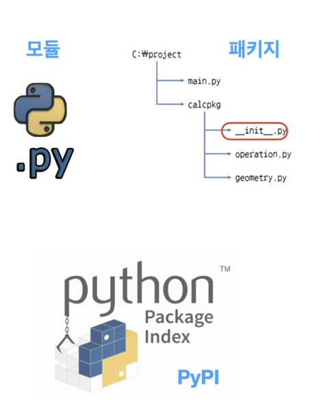

# AIFFEL_13일차 2020.08.10

Tags: AIFFEL_DAILY

### 일정

1. 코딩마스터 Session3 : Hash
2. LMS F11
3. LMS F12
4. cs231n lecture5

# 코딩마스터 Session3: Hash

key : value 구조

key를 만들어주는 다양한 해시 함수의 존재, 가장 유명한건 SHA256

python list comprehension

Collections.Counter

`str.**startswith**`(*prefix*[, *start*[, *end*]])

Return `True` if string starts with the *prefix*, otherwise return `False`. *prefix* can also be a tuple of prefixes to look for. With optional *start*, test string beginning at that position. With optional *end*, stop comparing string at that position.

```python
# 이렇게 key 라는 값에 lambda 사용하듯(lambda도 함수! 익명함수) 함수를 사용할 수 있다.
# key_test = sorted(phone_book, key=len)
# print(key_test)
```

# defaultdict objects

*class* `collections.**defaultdict**`([*default_factory*[, *...*]])

Returns a new dictionary-like object. `[defaultdict](https://docs.python.org/3/library/collections.html?highlight=defaultdict#collections.defaultdict)` is a subclass of the built-in `[dict](https://docs.python.org/3/library/stdtypes.html#dict)` class. It overrides one method and adds one writable instance variable. The remaining functionality is the same as for the `[dict](https://docs.python.org/3/library/stdtypes.html#dict)` class and is not documented here.

```python
s = [('yellow', 1), ('blue', 2), ('yellow', 3), ('blue', 4), ('red', 1)]
d = defaultdict(list)
for k, v in s:
    d[k].append(v)

sorted(d.items())
>> [('blue', [2, 4]), ('red', [1]), ('yellow', [1, 3])]
```

*class* `collections.**Counter**`([*iterable-or-mapping*])

A `[Counter](https://docs.python.org/3/library/collections.html?highlight=counter#collections.Counter)` is a `[dict](https://docs.python.org/3/library/stdtypes.html#dict)` subclass for counting hashable objects. It is a collection where elements are stored as dictionary keys and their counts are stored as dictionary values. Counts are allowed to be any integer value including zero or negative counts. The `[Counter](https://docs.python.org/3/library/collections.html?highlight=counter#collections.Counter)` class is similar to bags or multisets in other languages.

```python
tmp_lst=[]
for check in clothes:
    tmp_lst.append(check[1])
check_dict = Counter(tmp_lst)
# check_dict = Counter([a for _, a in clothes])
```

### zip()

return type : dict

```python
>>> c = dict(zip(['one', 'two', 'three'], [1, 2, 3]))
>>> print(c)
{'one': 1, 'two': 2, 'three': 3}
```

**`operator`**

Converts call to various functions in the `[operator](https://docs.python.org/3/library/operator.html#module-operator)` module to other, but equivalent, function calls. When needed, the appropriate `import` statements are added, e.g. `import collections.abc`. The following mapping is made:

### lambda 로 익명 함수 vs operator : operator 의 실행 속도가 조금 더 빠르다.

### Heapq

# [F-11] 텍스트의 다양한 변신 (문자열, 파일 다루기)

### **학습 목표**

---

- 파이썬에서 텍스트 데이터를 어떻게 처리하는지 알아 봅니다.
- 파이썬에서 텍스트 파일과 디렉토리에 접근하는 방법을 알아 봅니다.
- 텍스트 파일의 종류를 살펴보고 각각 다루는 방법을 연습해 봅니다.

국제표준기구인 ISO(International Standards Organization)는 전세계 문자를 모두 표시할 수 있는 표준코드를 제정하였습니다. 이것이 바로 유니코드(Unicode)입니다.

그렇다면 UTF-8, UTF-16 등은 무엇일까요? 흔히 UTF-8과 유니코드가 같은 것이라고 혼동하는 경우가 많아서, 여러가지 버전의 유니코드가 존재하는 것이 아닌가 오해할 수 있어서 정리합니다.유니코드는 오직 한가지 버전만 존재합니다. 그리고 UTF-8, UTF-16 등은 유니코드로 정의된 텍스트를 메모리에 인코딩하는 방식들을 말합니다.

파이썬 3부터는 문자열이 무조건 유니코드로 인코딩되므로 해당 텍스트가 인코딩이 되어 있는지 혹은 디코딩이 되어 있는지만 고려하면 된다는 것이 포인트입니다

이스케이프 문자는 \[특정 문자] 형태로, 직접 입력할 수 없는 일부 문자를 문자열에 포함시킬 수 있는 특수 문자인데요.

그렇다면, 이스케이프 문자를 무시하고 싶을 때는 어떻게 해야 할까요? 이때 사용하는 것이 원시 문자열(raw string) 입니다. 문자열을 시작하는 따옴표 앞에 r을 붙이면 이스케이프 문자가 적용되지 않은 있는 그대로의 원시 문자열을 나타낼 수 있습니다.

```python
print("사회적\r거리두기")
>>거리두기
```

### **공백 문자 제거하기**

파이썬에서는 **`strip()`** 메서드를 사용해 공백 문자를 처리합니다.

- **`istitle()`**: 문자열의 **첫 글자만 대문자**로 되어 있으면 True, 그렇지 않으면 False를 반환
- **`isalpha()`**: 문자열이 모두 **알파벳 문자**로만 되어 있으면 True, 그렇지 않으면 False를 반환
- **`isalnum()`**: 문자열이 모두 **알파벳 문자**와 숫자로만 되어 있으면 True, 그렇지 않으면 False를 반환
- **`isdecimal()`**: 문자열이 모두 **숫자**로만 되어 있으면 True, 그렇지 않으면 False를 반환

---

[https://webnautes.tistory.com/1181](https://webnautes.tistory.com/1181)

파이썬에서는 값이 같더라도 별개의 객체로 보는 경우가 대부분이기 때문입니다.

데이터를 비교할 때에는 == 연산자를 사용하여 두 객체의 값이 동일한지 테스트해야 합니다.

is 연산자는 같은 객체인지 확인하거나 객체가 파이썬 상수(None, True, False)와 같은지 확인할 때에만 사용하도록 합니다.

파이썬 언어에서 대입은 오른쪽에 있는 값을 가지는 객체를 변수가 가리키라는 의미입니다.

변수 선언이라는 개념이 없으며 변수는 타입을 갖지 않습니다.

왜냐면 파이썬에서는 문자열이나 숫자, 리스트 같은 데이터 자체가 객체이기 때문입니다.

변수는 자체 저장공간을 할당 받지 않으며 객체를 가리키기만 합니다.

```python
a = 1 // 변수 a와 1은 별개의 존재입니다.
```

```python
>>> a = 'abc'

# 변수 a가 문자열 객체를 가리키도록 합니다.
>>> id(a)
1421244119952
>>> id('abc')
1421244119952
>>> a = a + 'd'   # 변수 a가 가리키는 객체의 값을 변경하려하면
>>> id(a)
1421276091312     # 변수 a가 가리키는 객체만 바뀔 뿐
>>> id('abc')     
1421244119952     # 'abc' 객체는 그대로입니다.
```

### tuple

```python
>>> a = (1, 2, 3)
>>> id(a)
1421275979208
>>> a[0]=0            # 튜플를 수정하는 것은 불가능합니다. 
Traceback (most recent call last):
  File "<stdin>", line 1, in <module>
TypeError: 'tuple' object does not support item assignment
>>> a = (1, 2, 3) + (4,)   # 튜플 객체의 값을 변경하는 메소드를 제공하지 않기 때문에 이런 방법으로 원소를 추가해보면
>>> a
(1, 2, 3, 4)
>>> id(a)            # 변수 a는 다른 튜플 객체를 가리키게 됩니다. 
1421276031320
```

### 정규표현식

파이썬에서는 표준 라이브러리인 **`re`** 모듈을 **`import`** 해서 정규 표현식을 사용할 수 있습니다.

```python
import re

#1단계 :  "the"라는 패턴을 컴파일한 후 패턴 객체를 리턴합니다. 
# 명시적으로 패턴 객체를 생성한 경우 해당 객체를 반복 사용 가능하다는 점이 장점이 될 때가 있습니다.
pattern = re.compile("the")    

# 2단계 : 컴파일된 패턴 객체를 활용하여 다른 텍스트에서 검색을 수행합니다.
pattern.findall('of the people, for the people, by the people')
```

```python
#- 전화번호(숫자, 기호)
phonenumber = re.compile(r'\d\d\d-\d\d\d-\d\d\d\d')
phone = phonenumber.search('This is my phone number 010-111-1111')
if phone:
  print(phone.group())
print('------')
# match 메소드는 처음부터 일치해야하기때문에, 결과가 없다!
phone = phonenumber.match ('This is my phone number 010-111-1111')
if phone:
  print(phone.group())

>> 010-111-1111
>> ------
```

## 파일과 디렉토리

```python
with open("hello.txt", "r") as f:
  print(f.read())
```

여기서 with 구문을 사용해서 파일을 열어서 파일 객체를f로 받아서 f.read()를 통해 내용을 읽었는데요, f.close()를 명시적으로 호출하지 않고 있습니다. 이것은 실수가 아니라, with를 통해 open된 객체는 with문이 종료될 때 자동으로 close되는 것이 보장되기 때문입니다. 시스템 리소스의 안정적 사용을 위해 with문 활용을 권장합니다.

---

 [https://www.youtube.com/watch?time_continue=7&v=hZ6j_g_O3Ts&feature=emb_logo](https://www.youtube.com/watch?time_continue=7&v=hZ6j_g_O3Ts&feature=emb_logo)

'bin/' : 실행파일

'mnt/', 'media/' ⇒ 장치 연결

'usr/' : 프로그램 설치

'etc/' : 설치된 프로그램이 실행되기 위한 설정 (윈도우 레지스트리랑 비슷한 역할)

'sbin/' : admin 계정이 쓰는 실행파일

'tmp/' : 임시로 데이터 관리

'sys/' : 시스템 설정

...

결국 쓰다보면 익숙해진다 ㅇㅇ 맞는 말인듯

---

### 파이썬 모듈 및 패키지



### **개념**

- **모듈**(module) : 파이썬으로 만든 코드가 들어간 파일 **`.py`**
- **패키지**(package) : **`__init__.py`**가 포함된 폴더로 흔히 라이브러리라고 칭함
- **PIP**(Package Installer for Python) : 패키지 관리자로 파이썬을 설치하면 기본으로 설치됨
- **PyPA**(Python Packaging Authority) : 파이선 패키지를 관리하고 유지하는 그룹
- **PyPI**(The Python Package Index) : 파이썬 패키지들의 저장소

### **함수**

- **`sys.path`** : 현재 폴더와 파이썬 모듈들이 저장되어 있는 위치를 리스트 형태로 반환
- **`sys.path.append()`** : 자신이 만든 모듈의 경로를 **`append`** 함수를 이용해서 추가함으로써 추가한 디렉토리에 있는 파이썬 모듈을 불러와 사용할 수 있다.
- **`os.chdir()`** : 디렉토리 위치 변경
- **`os.getcwd()`** : 현재 자신의 디렉터리 위치를 반환
- **`os.mkdir()`** : 디렉토리 생성
- **`os.rmdir()`** : 디렉토리 삭제 (단, 디렉토리가 비어 있을 경우)
- **`glob.glob()`** : 해당 경로 안의 디렉토리나 파일들을 리스트 형태로 반환
- **`os.path.join()`** : 경로(path)를 병합하여 새 경로 생성
- **`os.listdir()`** : 디렉토리 안의 파일 및 서브 디렉토리 리스트
- **`os.path.exists()`** : 파일 혹은 디렉토리의 경로 존재 여부 확인
- **`os.path.isfile()`** : 파일 경로의 존재 여부 확인
- **`os.path.isdir()`** : 디렉토리 경로의 존재 여부 확인
- **`os.path.getsize()`** : 파일의 크기 확인

## 여러 파일 포맷 다루기

### csv

```python
#csv => pandas dataframe
df = pd.read_csv('pandas.csv')

# pandas dataframe => csv
df.to_csv('pandas.csv',index=False)
```

### XML

### **ElementTree**

파이썬 표준 라이브러리인 ElementTree는 XML 관련 기능을 다음과 같이 제공합니다.

- **`Element()`** : 태그 생성
- **`SubElement()`** : 자식 태그 생성
- **`tag`** : 태그 이름
- **`text`** : 텍스트 내용 생성
- **`attrib`** : 속성 생성

**dump()**

생성된 XML 요소 구조를 시스템(sys.stdout)에 사용합니다.

- **`write()`** : XML 파일로 저장
- 리스트(list)와 유사한 메소드를 제공
    - append, insert, remove, pop

```python
import xml.etree.ElementTree as ET

person = ET.Element("Person")
name = ET.Element("name")
name.text = "이펠"
person.append(name)

age = ET.Element("age")
age.text = "28"
person.append(age)

ET.SubElement(person, 'place').text = '강남'

ET.dump(person)
```

파일로 저장

```python
ET.ElementTree(person).write('person.xml')
```

### beaurifulsoup4를 이용하여 XML 파싱하기

```python
from bs4 import BeautifulSoup
with open("books.xml", "r", encoding='utf8') as f:
    booksxml = f.read() 
    #- 파일을 문자열로 읽기
 
soup = BeautifulSoup(booksxml,'lxml') 
#- BeautifulSoup 객체 생성 : lxml parser를 이용해 데이터 분석

for title in soup.find_all('title'): 
#-  태그를 찾는 find_all 함수 이용
    print(title.get_text())
```

### JSON

JSON 파일의 내용을 dict 객체로 쉽게 읽어들일 수 있다.

```python
import json

with open("person.json", "r", encoding="utf-8") as f:
		# dict 객체로 읽어들여진다.
    contents = json.load(f)
    print(contents["first name"])
    print(contents["education"])
```

---

# [F-12] 데이터를 한눈에! Visualization

### **학습 목표**

---

- 파이썬 라이브러리(Pandas, Matplotlib, Seaborn)을 이용해서 여러 가지 그래프를 그리는 법을 학습합니다.
- 실전 데이터셋으로 직접 시각화 해보며 데이터 분석에 필요한 탐색적 데이터 분석(EDA)을 하고 인사이트를 도출해 봅니다.

### **파이썬으로 그래프를 그린다는건?**

---

> 도화지를 펼치고 축을 그리고 그 안에 데이터를 그리는 작업

⇒ 현실에서 그래프를 그릴 때 작업의 순서와 비슷하다고 생각하면 된다!

```python
import matplotlib.pyplot as plt
%matplotlib inline
# %matplotlib 이런 형태를 magic fucntion이라고 한다.
```

Provided you are running IPython, the `%matplotlib inline` will make your plot outputs appear and be stored within the notebook.

%matplotlib inline은 IPython에서 사용하는 매직 메소드에요.

Rich output에 대한 표현 방식인데요, 그래프와 같은 그림, 소리, 애니메이션 과같은 결과물을 Rich output 이라고 해요. IPython과 비슷한 환경인 Jupyter Notebook에서 이 명령어를 입력하면 그래프가 바로 출력됩니다.

figure.add_subplot(2,2,x)


```python
...
price = data['Close']
...
price.plot(ax=ax, style='black')
...
```

다음 스텝에서 좀더 설명하겠지만, Pandas도 자체적인 선 그래프 그리기 기능을 제공합니다. 위 예시코드에서는 price.plot(ax=ax, style='black')에서 Pandas의 plot을 사용하면서, matplotlib에서 정의한 subplot 공간 ax를 사용한 것을 볼 수 있습니다.

```python
x = np.linspace(0, 10, 100) 

plt.plot(x, x + 0, linestyle='solid') 
plt.plot(x, x + 1, linestyle='dashed') 
plt.plot(x, x + 2, linestyle='dashdot') 
plt.plot(x, x + 3, linestyle='dotted')
plt.plot(x, x + 0, '-g') # solid green 
plt.plot(x, x + 1, '--c') # dashed cyan 
plt.plot(x, x + 2, '-.k') # dashdot black 
plt.plot(x, x + 3, ':r'); # dotted red
plt.plot(x, x + 4, linestyle='-') # solid 
plt.plot(x, x + 5, linestyle='--') # dashed 
plt.plot(x, x + 6, linestyle='-.') # dashdot 
plt.plot(x, x + 7, linestyle=':'); # dotted
```

### **정리**

---

그래프를 그리는 과정을 다시 정리해 봅시다.

1. **`fig = plt.figure()`**: figure 객체를 선언해 '도화지를 펼쳐' 줍니다.
2. **`ax1 = fig.add_subplot(1,1,1)`** : 축을 그립니다.
3. **`ax1.bar(x, y)`** 축안에 어떤 그래프를 그릴지 메소드를 선택한 다음, 인자로 데이터를 넣어줍니다.
4. 그래프 타이틀 축의 레이블 등을 plt의 여러 메소드 **`grid`**, **`xlabel`**, **`ylabel`** 을 이용해서 추가해주고
5. **`plt.savefig`** 메소드를 이용해 저장해 줍니다.


### 범주형 데이터 나타내기

---

```python
df.describe()
# dataframe의 데이터가 어떤 분포를 갖고있는지 확인하는 함수 (column별 데이터 갯수, 중간값 등)
df.info()
# dataframe의 구조를 확인하는 함수 (column 이름, 데이터 타입 등)
df['smoker'].value_counts()
>> smoker라는 column에 속하는 데이터의 분포 (yes 몇개, no 몇개)
```

matplotlib에 데이터를 인자로 넣기 위해선 pandas 데이터를 바로 이용할 수는 없습니다. 데이터를 x, y에 series, list 형태로 각각 나눠주어야 합니다.

```python
grouped = df['tip'].groupby(df['sex'])
# tip 열의 데이터를 sex 열의 데이터를 기준으로 groupby 한다.
grouped.mean() # 성별에 따른 팁의 평균
# group 이 만들어진 상태에서 평균값을 산출해보는 의미
grouped.size() # 성별에 따른 데이터 량(팁 횟수)
```

```python
# matplotlib을 이용해서 그릴 경우, 데이터 형태를 조금 변형해줘야한다.
# pandas dataframe형태 바로 사용이 불가!
import numpy as np
sex = dict(grouped.mean())
x = list(sex.keys())
y = list(sex.values())

plt.bar(x, y)
plt.ylabel('tip[$]')
plt.title('Tip by Sex')
plt.legend()
```

```python
# 근데, seaborn은 pandas dataframe형태 바로 사용 가능!
sns.barplot(data=df, x='sex', y='tip')
# matplotlib과 섞어서 사용도 가능하다.
```

Subplot을 활용할 수도 있고, 범주형 그래프를 나타내기에 좋은 violineplot을 사용할 수도 있습니다. catplot이라는 모양도 있다.

### 수치형 데이터 나타내기

---

수치형 데이터를 나타내는 데 가장 좋은 그래프는 산점도 혹은 선 그래프입니다.

```python
sns.scatterplot(data=df , x='total_bill', y='tip', palette="ch:r=-.2,d=.3_r")
# 이렇게 hue 옵션에 값을 넣어주면, 들어간 값에 따라 구분하여 나타내준다.
sns.scatterplot(data=df , x='total_bill', y='tip', hue='day')
```

**`numpy.random.randn`(*d0*, *d1*, *...*, *dn*)**

Return a sample (or samples) from the “standard normal” distribution.

```python
3 + 2.5 * np.random.randn(2, 4)
array([[-4.49401501,  4.00950034, -1.81814867,  7.29718677],   # random
       [ 0.39924804,  4.68456316,  4.99394529,  4.84057254]])  # random
```

```python
df['tip_pct'].plot(kind='kde')

kind='kde'로 확률 밀도 그래프로 나타내 보았습니다.

밀도 그래프: 연속된 확률분포를 나타냅니다.
일반적으로는 kernels메서드를 섞어서 이 분포를 근사하는 식으로 그립니다.
이것은 우리에게 친숙한 함수로는 좀 더 단순한 정규분포(가우시안)로 나타낼 수 있습니다.
밀도 그래프는 KDE(Kernel Density Estimate) 커널 밀도 추정 그래프입니다.
```

### **그래프 4대 천왕…**

---

막대 그래프(bar graph), 꺾은선 그래프(line graph), 산점도(scatter plot), 히스토그램(histogram)은 정말 많이 쓰이는 그래프기 때문에 그래프 4대천왕 이라는 이름을 붙여 봤습니다. 수치형 데이터인지, 범주형 데이터인지에 따라 어떤 plot을 사용하는게 좋을지 한번 고민해보세요!

### Heatmap

---

방대한 량의 데이터와 현상을 수치에 따른 색상으로 나타내는 것으로, 데이터 차원에 대한 제한은 없으나 모두 2차원으로 시각화하여 표현합니다.

### **잠깐만! pivot**

Heatmap을 그리기 위해 데이터를 pivot해야 하는 경우가 있습니다.

**pivot이란 어떤 축, 점을 기준으로 바꾸다**란 뜻입니다. 

데이터 표를 재배치 할때도 pivot이라는 단어를 사용합니다. (엑셀, Database에도 등장하는 용어 입니다.)

pandas의 dataframe의 **`pivot()`** 메소드를 사용합니다.

```python
sns.heatmap(pivot, linewidths=.2,
            annot=True,
            fmt="d"
           )
```

---

---

# cs231n lecture 5