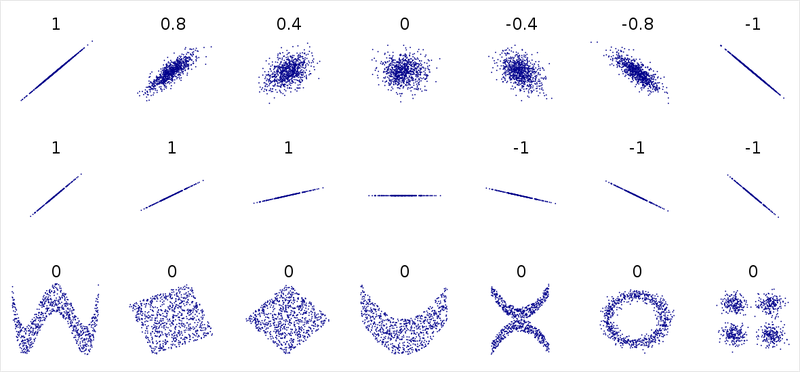

# AIFFEL_14일차 2020.08.11

Tags: AIFFEL_DAILY

### 일정

1. LMS E-5
2. cs231n lecture 5

# [E-5] 날씨 좋은 월요일 오후 세 시, 자전거 타는 사람은 몇 명?

---

### **학습 목표**

---

- 입력데이터인 X, 정답데이터인 y, 모델의 출력인 prediction 각각의 개념을 알고, y에 가까운 prediction을 낼 수 있도록 학습한다는 철학을 이해한다.
- 손실함수의 개념과 손실함수가 필요한 이유를 이해하고, 쓸 수 있는 함수의 종류와 구현을 익힌다.
- 손실함수를 미분해서 구하는 기울기는 손실함수값을 줄이기 위해 필요한 것임을 이해하고, 그 구현을 수치미분과 해석미분 두 가지 방법으로 진행해본다.
- 손실함수를 정의하고 경사하강법을 활용해 선형 방정식 형태로 된 모델을 학습시켜 실수형 데이터를 예측하는 선형 회귀 프로젝트의 전체 프로세스를 경험하고 익힌다.
- sklearn의 LinearRegression을 활용해 빠르고 간편하게 선형 회귀 하는 방법을 익힌다.

이렇게 한 변수가 커짐에 따라 다른 변수가 작아지는 관계인 경우, 두 변수는 '상관 관계가 있다'고 하고, 그 관계된 정도는 '(Pearson) 상관 계수'로 표현할 수 있습니다.



두 번째 줄에는 데이터의 분포는 직선이지만 각각의 기울기가 다릅니다.

하지만 상관계수는 '기울기'를 이야기하는 것이 아니라 두 변수 간에 한 변수가 변함에 따라 다른 변수의 값이 어떻게 변하는지에 대한 '상호적인 관계의 정도'를 나타내는 것이기 때문에, 기울기가 급하든 완만하든 데이터의 분포가 직선에 가깝다면 상관계수는 항상 1 또는 -1에 가까워진다고 할 수 있습니다.

이미지의 마지막 줄에는 데이터 분포가 분명히 어떤 '패턴'을 가지고 있지만, 양 또는 음의 상관관계를 가지는 것은 아니기 때문에 상관계수는 0입니다.

이 또한 상관관계와 상관계수는 **두 변수 간의 패턴을 나타내는 것이 아닌, 각 값의 증가 또는 감소에 대한 관계만을 나타내기 때문**이라고 할 수 있습니다.

```python
# np.corrcoef(x, y)를 사용합니다.
np.corrcoef(macbook['used_years'], macbook['price'])
```

## 모델, 학습, 손실함수, 경사하강법 with 단변량회귀

---

'모델(model)' 이라는 용어를 사용하였는데, 모델은 '특정 정보를 입력받아서 그 정보에 따라 원하는 값을 예측하여 값을 출력하는 함수'로 이해할 수 있습니다.

모델을 학습시킨다는 것은 모델이 입력을 받았을 때 정답값에 가까운 출력을 낼 수 있는 최적의 **"매개변수"**, 혹은 **"파라미터"** 를 찾는다는 뜻과 같습니다.

이게 무슨 말이냐구요?! 정말 쉽게 이야기하자면, **"방정식을 푼다"** 는 것과도 일맥상통하는 말입니다!

우리는 어느 정도의 오차가 있더라도 적절한 값을 예측할 수 있는 모델을 찾기를 바랍니다.

완벽하지 않더라도 최대한 잘 맞는, 그런 함수 또는 모델을 찾고 싶은 거죠!

정확히는, y=wx+b라는 함수에서 위와 같이 최적의 직선이 될 수 있는 w와 b 값을 찾는다는 의미가 되겠습니다.

여기에서 우리가 찾아야하는 **`w`**와 **`b`**같은 값을 보통 **"매개변수"** 또는 **"파라미터"**, 또는 **"가중치"** 라고 합니다.

위 세 가지 용어는 모델이 데이터를 학습해 나감에 따라 업데이트되는 값들을 칭하는 용어입니다.

최소한의 오차를 낼 수 있는 "최적의" 함수를 찾아야 한다는 것을 알았습니다.

그렇다면 이러한 "최적의" 함수는 어떻게 찾을 수 있을까요? 🤔

사실 위의 질문은 아주 본질을 꿰뚫는 질문이라고 할 수 있습니다.

최적의 값을 찾아나가기 위해서 우리는 **손실함수**라는 한 가지 새로운 지표를 설정합니다.바로 "**아직 불완전한 현재의 모델이 출력하는 값과 실제 정답 간의 차이"** 를 확인하는 거죠.

우리는 모델에게 "너가 이만큼 틀리고 있어!" 라는 것을 알려줄 것입니다. 그 정보를 바탕으로 모델이 조금씩 개선을 해나갈 수 있는 방법이 있거든요!그렇다면 모델이 얼마나 틀렸는지는 어떻게 평가할 수 있을까요?

당연히 **"정답과 예측값 간의 차이"** 를 생각해 볼 수 있겠습니다.

그렇다면 price와 prediction의 차이인 error 컬럼을 새로 만들어보겠습니다.

- MAE : Mean Absolute Error, 오차의 절댓값의 평균
- MSE : Mean Squared Error, 오차의 제곱의 평균
- RMSE : Root Mean Squared Error, MSE의 제곱근
- R-squared : Coefficient of Determination, 결정 계수

이렇듯 모델의 예측값과 정답값에 대한 차이를 계산하는 함수를 **손실함수(loss function)**, 또는 **비용함수(cost function)**라고 부릅니다. 현재 모델이 얼마나 손실을 내고 있는지 나타낸다는 개념으로 이해할 수 있습니다.

손실함수는 "모델이 예측하는 출력값과 정답값 간의 거리를 나타내는 함수" 라고도 할 수 있습니다.

여전히 우리는 **최적의 `w` 값이 무엇인지를 모르기** 때문에, **현재 `w` 값 또한 최적의 `w`보다 큰지 혹은 작은지를 알 수 없다**는 점입니다.

현재 w 값은 3.5인데! 최적의 w 가 3.5보다 클 것이냐, 작을 것이냐, 이것을 모르는데 어떻게 값을 옮기냐구요!

자, 이렇게 특정 점에서의 기울기는 항상 자기 자신보다 함수값이 작아지는 **방향** 을 알려줄 수 있습니다.최적의 **`w`**가 어디에 있고, 현재 내 위치가 최적의 **`w`**보다 오른쪽인지, 왼쪽인지 알지 못하더라도 현재 내 위치에서의 기울기만 알 수 있다면 내 위치를 어느 방향으로 옮겨야 하는지를 알 수 있게 되는 것이죠.

따라서 우리는 기울기를 활용해서 다음과 같은 규칙으로 **`w`**를 업데이트 하면 됩니다!

1. 현재 **`w`**에서의 기울기를 구한다.
2. 기울기가 음수라면, 현재 **`w`**를 키운다.
3. 기울기가 양수라면, 현재 **`w`**를 줄인다.

이러한 규칙을 깔끔하게 수식으로 나타내면 다음과 같습니다.

w′=w−ηg

- w′ : 새로운 w

- w : 현재 w

- η : 얼마나 업데이트를 할 지를 결정하는 상수 (학습률) , '배율'

- g : 기울기, 또는 그래디언트, '방향과 크기'

이렇게 학습률과 같이 모델이 스스로 학습해나가는 파라미터 가 아니라, 사람이 직접 사전에 정하고 시작해야 하는 파라미터 를 하이퍼 파라미터 라고 합니다.

손실함수값이 단계별로 얼마 정도인지를 저장할

```python
losses = []
```

라는 빈 리스트를 준비해 보겠습니다.

학습에 영향을 주는 부분은 아니지만, 실험이 매우 중요한 머신러닝 분야에서 학습이 어떤 식으로 진행되는지를 확인하는 습관을 갖는 것은 중요합니다.

## 모델 with 다변량 회귀

---

문자열 형태의 데이터가 몇몇 있다는 것이죠.우리는 위에서 살펴봤듯 수식에 데이터를 넣어서 계산할 것이기 때문에, 모든 데이터의 값이 실수여야 합니다.

따라서 다음과 같이 판다스의 **`get_dummies()`** 함수를 활용해 문자열 데이터에 대해서는 **`0`**, **`1`** 로 변환해주겠습니다. 수식을 구할 때 카테고리형 데이터가 있다면 더미 변수(dummy variable)를 활용해 식에 포함시켜 줄 수 있습니다.

이러한 데이터 변환 방식을 원-핫 인코딩(One Hot Encoding) 이라고 하죠.

컬럼의 순서를 우리의 목적에 맞게 바꾸어보겠습니다.

우리는 나머지 모든 데이터를 가지고 최종적으로 **`tip`** 값을 예측하려고 합니다. 따라서 **`tip`** 컬럼을 맨 오른쪽에 두도록 하겠습니다.

```python
tips = tips[['total_bill', 'size', 'sex_Male', 'sex_Female', 'smoker_Yes', 'smoker_No',
             'day_Thur', 'day_Fri', 'day_Sat', 'day_Sun', 'time_Lunch', 'time_Dinner', 'tip']]
tips.head()
```

$y=w1x1+w2x2+w3x3+w4x4+w5x5+w6x6+w7x7+w8x8+w9x9+w10x10+w11x11+w12x12+b$

이러한 식을 우리는 **선형 방정식**이라고 합니다. 다른 말로는 "**다변수 일차방정식**"이라고 할 수도 있죠.

선형 방정식을 활용해서 원하는 값을 예측하는 모델을 설계하고 학습시키는 방법을 **선형 회귀** 라고 합니다.

**회귀** 라는 단어는 **연속된 실수값을 예측하는 문제** 를 뜻합니다.회귀와 대립되는 개념은 **분류** 인데, 다음 예를 보면 가볍게 이해가 되실 겁니다.

- 사진을 입력받아 해당 사진이 강아지인지, 고양이인지 맞추는 문제는 **분류** 문제입니다.
- 사용연수, 화면크기 등을 입력받아 실수값인 중고 가격을 맞추는 문제는 **회귀** 문제입니다.

즉, 분류 문제는 맞추고자 하는 값이 **카테고리** 이고, 회귀 문제는 맞추고자 하는 값이 **연속된 실수 값** 입니다.

입력 데이터 **`x`**가 3개 이상으로 늘어난다면 우리는 더이상 시각화를 할 수가 없게 됩니다.우리 존재가 3차원 공간에 살고 있기 때문에, 4차원 이상은 상상할 수도, 그려볼 수도 없기 때문이죠!

그렇기 때문에 2개 이상의 입력 변수가 있는 경우에는 데이터가 존재할 n차원의 공간을 어렴풋이 상상하며 최적의 함수를 찾을 뿐, 눈으로 확인할 수는 없습니다.

우리는 손실함수를 어떤 변수로 미분해야하나요? 다시 한 번 생각해 봅시다.

- 우리가 손실함수를 미분하는 이유는 최적의 매개변수, w와 b에 가까워지는 방향을 알기 위함이었다.

- 특정 순간에 기울기가 양수라면 w를 더 작게 줄이고, 기울기가 음수라면 w를 더 크게 늘린다.

- 즉, 우리는 w′=w−ηg공식을 활용해서 변수를 업데이트하는데, 이 때 기울기는 변수 업데이트의 방향을 결정하는 역할을 한다.

- 따라서 손실함수는 언제나 내가 최적을 찾고자 하는 매개변수, 혹은 가중치에 대해 미분해야 한다.

- 현재 모델에는 w1부터 w12까지 12개의 w 와, 1개의 b가 있으므로 우리는 총 13개의 변수에 대해 미분을 해야 한다.

b 에 대한 미분 : 

$\frac {\partial L} {\partial b} = \frac {1}{N} \sum_{i=1}^{N} 2(y_{i, pred}-y_{i, true})$

각각의 가중치에 대한 미분 : 


### 모델 설계, 손실함수 정의, 기울기 계산 및 최적화 과정을 sklearn으로 진행하기

```python
tips = sns.load_dataset("tips")
tips = pd.get_dummies(tips, columns=['sex', 'smoker', 'day', 'time'])
tips = tips[['total_bill', 'size', 'sex_Male', 'sex_Female', 'smoker_Yes', 'smoker_No',
             'day_Thur', 'day_Fri', 'day_Sat', 'day_Sun', 'time_Lunch', 'time_Dinner', 'tip']]
print("슝=3")

X = tips[['total_bill', 'size', 'sex_Male', 'sex_Female', 'smoker_Yes', 'smoker_No',
          'day_Thur', 'day_Fri', 'day_Sat', 'day_Sun', 'time_Lunch', 'time_Dinner']].values
y = tips['tip'].values
print("슝=3")

X_train, X_test, y_train, y_test = train_test_split(X, y, test_size=0.2, random_state=42)
print("슝=3")

from sklearn.linear_model import LinearRegression

model = LinearRegression()
print("슝=3")

model.fit(X_train, y_train)

predictions = model.predict(X_test)

from sklearn.metrics import mean_squared_error

mse = mean_squared_error(y_test, predictions)

plt.scatter(X_test[:, 0], y_test, label="true")
plt.scatter(X_test[:, 0], predictions, label="pred")
plt.legend()
plt.show()
```

### **정리**

---

다시 상기해 보자면, 오늘 우리가 풀어본 문제는 머신러닝 중에서도 "선형 회귀" 문제였습니다.

사실 앞으로는 회귀 문제를 이렇게 풀지 않고 기울기나 모델 학습 과정은 텐서플로우에 내장된 편리한 함수들을 이용하게 될 것입니다.

**하지만, 이미 편하게 쓸 수 있도록 구현되어 있는 라이브러리를 사용할 때에도 내가 무엇을 하려고 이 라이브러리를 사용하고 있는지를 이해하고 쓰는 것과 아닌 것은 매우 큰 차이가 있죠!**

오늘 배운 내용을 정리해 보자면,

- 입력데이터인 X, 정답데이터인 y, 모델의 출력인 prediction, 각각의 개념을 알고, 정답데이터에 가까운 출력을 낼 수 있도록 학습한다는 철학을 이해해 보았고,
- 손실함수의 개념과 손실함수가 필요한 이유를 이해하고, 쓸 수 있는 함수의 종류를 알아보았으며 직접 구현해 보았습니다.
- 또한, 손실함수를 미분해서 구하는 기울기는 손실함수값을 줄이기 위해 필요한 것임을 이해하고, 그 구현을 수치미분과 해석미분 두 가지 방법으로 진행했죠.
- 그리고, 선형 방정식 형태로 된 모델을 학습시켜 실수형 데이터를 예측하는 선형 회귀 프로젝트의 전체 프로세스를 경험하고 익혀보았습니다.
- 마지막으로는 사이킷런을 활용해서 간편하고 빠르게 선형 회귀를 진행해 보기도 했어요!

# cs231n lecture 5