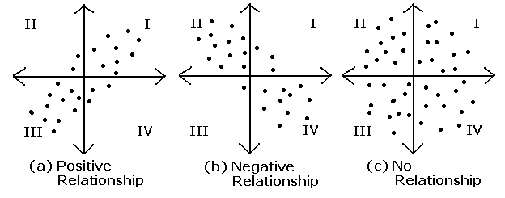

# AIFFEL_16일차 2020.08.13

Tags: AIFFEL_DAILY

### 일정

1. LMS E-6
2. cs231n lecture 6

# [E-6]어제 오른 내 주식, 과연 내일은?

---

시계열 예측에 사용되는 모델에 ARIMA만 있는 것은 아닙니다.

페이스북에서 발표한 Prophet이라는 것도 있고, LSTM 등 딥러닝을 활용하는 방법도 있습니다.

하지만 ARIMA는 탄탄한 통계학 이론적 기반을 갖추고 있으며, 시계열 데이터를 이해하는 관점을 훈련하는 데에도 도움이 된다는 점에서 한번쯤 다루어 볼만한 주제라고 여겨집니다.

### **학습 목표**

---

- 시계열 데이터의 특성과 안정적(Stationary) 시계열의 개념을 이해한다.
- ARIMA 모델을 구성하는 AR, MA, Diffencing의 개념을 이해하고 간단한 시계열 데이터에 적용해 본다.
- 실제 주식 데이터에 ARIMA를 적용해서 예측 정확도를 확인해 본다.

# 시계열 개념

---

시계열이란 시간 순서대로 발생한 데이터의 수열이라는 뜻입니다.

$Y = \lbrace Y_t: t ∈ T \rbrace \text{, where }T\text{ is the index set}$

미래 예측은 불가능한 것입니다.

그럼에도 불구하고 미래의 데이터를 예측하려 든다면 적어도 다음 두가지의 전제가 필요합니다.

1. 패턴발견 : 과거 데이터에 일정한 패턴 발견. 
2. 패턴반복 : 그리고 과거 패턴이 미래에도 동일하게 반복될 것.

***⇒ '안정적'(stationary) 데이터에 대해서만 미래 예측이 가능하다.***

⇒ 안정적 : 시계열 데이터의 통계적 특성이 변하지 않음을 의미.

⇒ 시계열 데이터를 만들어내는 시간의 변화에 무관하게 일정한 프로세스가 존재한다.

⇒ 연단위 기후 변화의 일정한 패턴! 지구의 일정한 기후변동 프로세스가 만들어 내는 안정성에 의해 내일의 기온을 어느정도 오차 범위 내에서 예측 가능.

[오비탈 인사이트]

[https://news.einfomax.co.kr/news/articleView.html?idxno=4082410](https://news.einfomax.co.kr/news/articleView.html?idxno=4082410)

위성 데이터를 기반으로 원유 재고를 추정한다?!

⇒ 유가  변화 예측을 위해 과거의 유가 변동 데이터만 고려한다면 시계열 데이터 예측이지만, 유가가 아닌 다른 성격의 데이터를 추가로 활용한다면, 엄밀한 의미에서 시계열 데이터 예측은 아니다!

---

Q. 유가 변화 예측을 위해 이전의 유가변화 데이터만 활용하지 않고 다른 데이터를 추가로 활용하는 이유는 무엇일까요?

유가 예측을 위해 이전 유가만을 활용하는 **시계열 데이터 분석**은 원유 시장이 외부적인 영향을 받지 않고 자체적으로 유가를 결정하는 **안정적인 프로세스**가 존재한다는 것을 전제로 합니다. 말하자면 국제 수요-공급 균형에 기반한 시장원리에 의해 **원유시장이 안정적인 평형 상태를** 유지한다는 것이지요. 하지만 국제 유가는 국가간 분쟁, 경제 호황/불황 등 **다양한 외부적 요소**에 의해 가격을 결정하는 수요-공급 균형점이 변화하므로, 외부적 요인을 추가로 고려할 수 있는 보조 데이터의 활용이 정확한 예측에 도움이 됩니다.

---

[생각] 위성사진을 활용한 프로젝트?

### stationary, 안정적이라는 의미에 대한 생각

---

현실적으로 다루는 시계열 데이터는 이런 직관적인 안정성의 정의를 만족하는 정도면 충분히 ARIMA 등의 시계열 모델을 통해 분석이 용이하다.

[참고] 'Stationary Time-Series'와 'Stationarity'를 많은 문헌에서 '정상시계열', '정상성'이라는 단어로 번역하기도 합니다.

[http://www.dodomira.com/2016/04/21/arima_in_r/](http://www.dodomira.com/2016/04/21/arima_in_r/)

'안정적 시계열'에서 시간의 추이에 상관없이 일정해야 하는 통계적 특성 : 평균, 분산, 공분산 

Q. Covariance, Correlation 의 차이?

[https://destrudo.tistory.com/15](https://destrudo.tistory.com/15)

각 확률변수들이 **어떻게 퍼져있는**지를 나타내는 것이 공분산(Covariance)이다.

즉, X가 커지면 Y도 커지거나 혹은 작아지거나 아니면 별 상관 없거나 등을 나타내어 주는 것이다.



- Cov(X, Y) > 0 X가 증가 할 때 Y도 증가한다.
- Cov(X, Y) < 0 X가 증가 할 때 Y는 감소한다.
- Cov(X, Y) = 0 공분산이 0이라면 두 변수간에는 아무런 선형관계가 없으며 두 변수는 서로 독립적인 관계에 있음을 알 수 있다. 그러나 두 변수가 독립적이라면 공분산은 0이 되지만, 공분산이 0이라고 해서 항상 독립적이라고 할 수 없다.


⇒ 공분산은 **X의 편차와 Y의 편차를 곱한것의 평균**이라는 뜻이다.

하지만, 공분산의 문제점 : x,y의 단위의 크기에 영향을 받는다.

⇒ 이것을 보완하기 위한 것이 상관계수 (Correlation)


1. 상관계수의 절대값은 1을 넘을 수 없다.

2. 확률변수 X, Y가 독립이라면 상관계수는 0이다.

3. X와 Y가 선형적 관계라면 상관계수는 1 혹은 -1이다.

양의 선형관계면 1, 음의 선형관계면 -1

[분산]

분산은 그 확률변수가 기댓값으로부터 얼마나 떨어진 곳에 분포하는지를 가늠하는 숫자이다.기댓값은 확률변수의 위치를 나타내고 분산은 그것이 얼마나 넓게 퍼져 있는지를 나타낸다.


Q.Cov(X,X)


### Autocovariance, Autocorrelation

[https://m.blog.naver.com/sw4r/221030974616](https://m.blog.naver.com/sw4r/221030974616)

Auto라는 것은 자기자신을 의미한다.

Cov(X,X) = Var(X) 잖아. 즉, 본인에 대한 공분산은 분산이라는거지! 근데 왜 자기공분산이라는 개념이 따로 있는거??

⇒ 자기자신인데, 완전히 자기 자신이 아니라, h라는 간격만큼 이동시킨 자기자신과의 공분산인 것이다. 그래서 Xt가 자신이라면 Xt+h와 공분산을 구하는 것이 Autocovariance 이고, 이러한 함수가 Autocovariance Function이라고 한다.

그리고 Autocorrelation 은 Autocovariance를 정규화 한 것!

---

Q. X(t)와 X(t+h) 사이의 공분산과 X(t-h)와 X(t) 사이의 공분산은 항상 일정한가요? 아니면 어떤 조건 하에서만 성립하나요?

**X가 Stationary한 시계열 변수라는 조건** 하에서만 성립한다. 즉, 안정적인 시계열에 한해서 시차 h가 같다면 데이터의 상관성이 동일한 주기성이 나타난다.

---

다시, 안정적이라는 것을 예시로 이해하자면!

[EX]

예를 들어 직전 5년치 판매량 X(t-4), X(t-3), X(t-2), X(t-1), X(t)를 가지고 X(t+1)이 얼마일지 예측!

이 예측이 의미가 있으려면 **t에 무관하게** 예측이 맞아 떨어져야 한다!

⇒ 2010년에 하든, 2020년에 하든!

⇒ 그러려면 t에 무관하게 X(t-4), X(t-3), X(t-2), X(t-1), X(t)의 평균과 분산이 일정 범위 안에 있음.

⇒ 또한 X(t-h)와 X(t)는 t에 무관하게 h에 대해서만 달라지는 일정한 상관도를 가짐.

⇒ 그렇지 않으면, t에 따라 달라지는 '그때 그때 달라요' 예측이 된다!

⇒ **즉, 과거의 패턴이 미래에도 반복될 것이라는 시계열 예측에서 중요한 전제가 성립되지 않는 것!**

### 시계열 데이터 사례분석

---

하지만 분석에 들어가기 전에 잊지 말아야 할 단계가 하나 있습니다. 바로 결측치 유무 확인입니다.

```python
ts1[ts1.isna()]  # Time Series에서 결측치가 있는 부분만 Series로 출력합니다.
```

혹시 결측치가 있다면 조치가 필요합니다. NaN이 들어있는 데이터는 통계분석시에 많은 오류를 일으킬 뿐더러 분석결과에도 악영향을 미칠 것입니다.

⇒ 결측치를 확인하고, 존재한다면 조치를 취하는 과정이 반복적으로 등장! 중요성을 인식하자.

만약 결측치가 있다면, 1)결측치가 있는 데이터를 모두 삭제(drop)하거나, 2)결측치 양 옆의 값들을 이용해서 적절히 보간(interpolate) 대입해 주는 방법이 있습니다.

*(2)의 보간하는 방법을 pandas로 구현

```python
# 결측치가 있다면 이를 보간합니다. 보간 기준은 time을 선택합니다. 
ts1=ts1.interpolate(method='time')
ts1[ts1.isna()]    # 다시 NaN 확인
```

구간의 평균(rolling mean, 이동평균)과 표준편차(rolling std, 이동표준편차)

```python
def plot_rolling_statistics(timeseries, window=12):
    
    rolmean = timeseries.rolling(window=window).mean()  # 이동평균 시계열
    rolstd = timeseries.rolling(window=window).std()    # 이동표준편차 시계열

     # 원본시계열, 이동평균, 이동표준편차를 plot으로 시각화해 본다.
    orig = plt.plot(timeseries, color='blue',label='Original')    
    mean = plt.plot(rolmean, color='red', label='Rolling Mean')
    std = plt.plot(rolstd, color='black', label = 'Rolling Std')
    plt.legend(loc='best')
    plt.title('Rolling Mean & Standard Deviation')
    plt.show(block=False)
```

⇒ 시각화 이후 안정적이라는 느낌은 들지만, 명확하게 이야기 할 수 있으려면, 좀 다른 패턴의 시계열 데이터와 비교해보는 것도 방법이다!

시간의 추이에 따라 평균과 분산이 증가하는 패턴을 보인다면 이 시계열 데이터는 적어도 안정적이진 않다고 정성적인 결론을 내려볼 수 있을 것 같습니다.

⇒ 하지만, 이런 불안정적인 시계열 데이터에 대해서도 시계열 분석 기법이 존재!

[생각] 아마 MuzPersona 에서 전체 앨범 판매량 추이를 예측하기 위해 사용했던 방법과 비슷하지 않을까?

## Stationary 여부를 체크하는 통계적 방법

---

시각화해놓고 눈으로 확인해보고 '그냥 그런 것 같다' 라고 하는 방식보다는 좋은 방법이 있겠지!

### Augmented Dickey-Fuller Test

---

주어진 시계열 데이터가 안정적이지 않다라는 귀무가설(Null Hypothesis)를 세운 후, 통계적 가설 검정 과정을 통해 이 귀무가설이 기각될 경우에 이 시계열 데이터가 안정적이다라는 대립가설(Alternative Hypothesis)을 채택한다는 내용

---

[https://m.blog.naver.com/baedical/10109291879](https://m.blog.naver.com/baedical/10109291879)

*p-value(유의 확률) : 귀무가설을 기각할 수 있는 유의수준 중 최소값

⇒ 귀무가설의 가정이 틀렸다고 볼 수 있는 확률

⇒ 귀무 가설(null hypothesis)이 맞다는 전제 하에, 표본에서 실제로 관측된 통계치와 '같거나 더 극단적인' 통계치가 관측될 확률이다.

⇒ 귀무가설을 가정했을 때의 확률분포 상에서 현재의 관측보다 더 극단적인 관측이 나올 확률

통계는 항상 귀무가설이 맞다는 가정으로 시작.

(예를들면) 귀무가설:차두리는 차범근 친자다..를 검정하고 싶으면

(1)귀무가설이 맞다는 가정을 세운다

(2)그러면 차범근 친자 키는 (검정통계량) 분포를 갖게 된다(예를 들면 정규분포,t분포등등)

(3)실제 구한 차두리 키(검정통계량의 수치)가 그 분포의 신뢰구간 내에 들면 귀무가설(차두리는

차범근 친자다)을 받아들이는거고,수치가 그 범위에서 벗어나면 귀무가설을 기각하는 것임..

(통계과정)

(1)귀무가설이 맞다고 가정

(2)그러면 그 때 차두리키(검정통계량)는 분포를 따른다(예를 들어 정규분포라고 하자)

(2-1)위의 정규분포는 170 에서 190 범위 내에 들어갈 확률이 95%이다(이 말은 95% 신뢰구간이

170 에서 190이란 말과 같다) 즉 190 를 벗어난 수치 가령 198보다 크게 나올 확률은 0.01(1%)

로 매우 희박하다

(3)그런데 계산해 보니 차두리키(검정통계량 수치)가 [170,190] 사이 값이 아니고, 198 이 나왔다.

->희박한 수치인 198 이 나왔기 때문에, 즉 정규분포의 신뢰구간안에 들지 않기 때문에 귀무가설을

기각하는 것이다(다시 말해 대립가설을 accept 하게 되는 것이다)

---

```python
from statsmodels.tsa.stattools import adfuller

def augmented_dickey_fuller_test(timeseries):
    # statsmodels 패키지에서 제공하는 adfuller 메소드를 호출합니다.
    dftest = adfuller(timeseries, autolag='AIC')  
    
    # adfuller 메소드가 리턴한 결과를 정리하여 출력합니다.
    print('Results of Dickey-Fuller Test:')
    dfoutput = pd.Series(dftest[0:4], index=['Test Statistic','p-value','#Lags Used','Number of Observations Used'])
    for key,value in dftest[4].items():
        dfoutput['Critical Value (%s)' % key] = value
    print(dfoutput)   
```

International airline passengers 시계열이 안정적이지 않다라는 귀무가설은 p-value가 거의 1에 가깝게 나타났습니다. 이것이 바로 이 귀무가설이 옳다는 직접적인 증거가 되지는 않지만, 적어도 이 귀무가설을 기각할 수는 없게 되었으므로 이 시계열이 안정적인 시계열이라고 말할 수는 없습니다.

## Stationary하게 만들 수 있는 방법?

---

두 가지 방향성

1. 정성적인 분석을 통해 보다 Stationary한 특성을 가지도록 기존의 시계열 데이터를 가공/변형하는 시도
2. 시계열 분해 (Time series decomposition)

### 정성적인 가공의 방법들

1. 로그함수 변환 : 시간 추이에 따라 분산이 점점 커질 때 선택할 수 있는 방법.
2. Moving average 제거 : Trend 상쇄.

    ⇒ 시간 추이에 따라 나타나는 평균값 변화 : Trend

[아이디어] Trend 제거를 위해 Moving Average, 즉 rolling mean을 구해서 ts_log에다 빼주면 어떨까요?

⇒ 맨 앞 데이터는 이전 데이터가 없어서 moving average가 계산되지 않아 NaN값 입력됨

⇒ 결측치 제거 필요.

moving average를 고려할 때는 rolling mean을 구하기 위한 window 크기를 결정하는 것이 매우 중요하다는 것을 기억해 둡시다.

3. 차분(Differencing) : Seasonality 상쇄하기

⇒ Trend에는 잡히지 않지만 시게열 데이터 안에 포함된 패턴이 파악되지 않은 주기적 변화 :

계절적, 주기적 패턴 _ Seasonality

⇒ 차분은 시계열을 한 스텝 앞으로 시프트한 시계열을 원래 시계열에 빼주는 방법

⇒ 이번 스텝에서 발생한 변화량 의미.

### 시계열 분해(Time series decomposition)

---

Original 시계열에서 Trend와 Seasonality를 제거하고 난 나머지를 Residual이라고 합니다.

뒤집어서 말하면, Trend+Seasonality+Residual=Original

```python
from statsmodels.tsa.seasonal import seasonal_decompose
decomposition = seasonal_decompose(ts_log)

trend = decomposition.trend
seasonal = decomposition.seasonal
residual = decomposition.resid

plt.subplot(411)
plt.plot(ts_log, label='Original')
plt.legend(loc='best')
plt.subplot(412)
plt.plot(trend, label='Trend')
plt.legend(loc='best')
plt.subplot(413)
plt.plot(seasonal,label='Seasonality')
plt.legend(loc='best')
plt.subplot(414)
plt.plot(residual, label='Residuals')
plt.legend(loc='best')
plt.tight_layout()
```

⇒ 이미 제공된 모듈을 통해 시계열을 분해하여 간단하게 안정적인 시계열 데이터로 변화시킬 수 있지만, 그래도 위의 정성적인 방법들을 해보면서 각 수치(trend, seasonality)가 의미하는 바를 이해하는 것이 중요!

# ARIMA 모델

---

ARIMA는 AR(Autoregressive) + I(Integrated) + MA(Moving Average)가 합쳐진 모델입니다.

### AR(Auto Regressive, 자기회귀)

---

자기회귀(AR)란 Yt 가 이전 p개의 데이터 Yt−1,Yt−2,...,Yt−p 의 가중합으로 수렴한다고 보는 모델입니다.

### MA(Moving Average, 이동평균)

---

이동평균(MA)은 Yt가 이전 q개의 예측오차값 et−1,et−2,...,et−q 의 가중합으로 수렴한다고 보는 모델입니다. MA는 일반적인 시계열에서 Trend에 해당하는 부분을 모델링한다고 볼 수 있습니다. 

(요새 주가가 계속 올랐으니 앞으로도 계속 오를 것이다는 생각)

### I(Integration, 차분누적)

---

예를 들어서 d=1이라면 Yt 는 Yt−1 과 ΔYt−1 의 합으로 보는 것입니다.

I는 일반적인 시계열에서 Seasonality에 해당하는 부분을 모델링한다고 볼 수 있습니다.

---

1. 어제 주식값이 떨어졌다는 것을 알게 되었을 때, '오늘은 주식이 올라서 균형을 맞추겠지?'라는 AR 형태의 기대와
2. '어제 떨어졌으니 추세적으로 계속 떨어지지 않을까?'라는 MA 형태의 우려가 동시에 떠오르게 됩니다.
3. ARIMA는 이 두 모델 사이에서 적정 가중치를 찾아가는 훨씬 통합적인 예측 능력을 보여 줍니다.

---

### ARIMA 모델의 모수 p, q, d

---

1. 자기회귀 모형(AR)의 시차를 의미하는 p
2. 차분(diffdrence) 횟수를 의미하는 d
3. 이동평균 모형(MA)의 시차를 의미하는 q

이들 중 p 와 q 에 대해서는 통상적으로 p + q < 2, p * q = 0 인 값들을 사용

이렇게 하는 이유는 실제로 **대부분의 시계열 데이터는 자기회귀 모형(AR)이나 이동평균 모형(MA) 중 하나의 경향만을 강하게 띠기 때문**

모수 p,d,q는 ACF(Autocorrelation Function)와 PACF(Partial Autocorrelation Function)을 통해 결정할 수 있습니다. ( 물론 적절한 값을 찾기 엄청난 다른 시도들이 있었다. )

- ACF : 시차(lag)에 따른 관측치들 사이의 관련성을 측정하는 함수
- PACF :  다른 관측치의 영향력을 배제하고 두 시차의 관측치 간 관련성을 측정하는 함수


PACF가 0이라는 의미는 현재 데이터와 p 시점 떨어진 이전의 데이터는 상관도가 0, 즉 아무 상관 없는 데이터이기 때문에 고려할 필요가 없다는 뜻.

⇒ 근데, 이 강의에서 다루고 있는 데이터에 PACF 함수를 적용해보았더니 p가 2 이상인 구간에서 PACF 값이 0에 가까워짐. 즉, p는 1로 설정하는 것이 적합할 것.

[d 구하기는 조금 다른 방법]

d차 차분을 구해 보고 이때 시계열이 안정된 상태인지를 확인해 보아야 합니다.

```python
# 1차 차분 구하기
diff_1 = ts_log.diff(periods=1).iloc[1:]
diff_1.plot(title='Difference 1st')

augmented_dickey_fuller_test(diff_1)

# 2차 차분 구하기
diff_2 = diff_1.diff(periods=1).iloc[1:]
diff_2.plot(title='Difference 2nd')

augmented_dickey_fuller_test(diff_2)
```

⇒ 여기서, p는 1로 설정하는 것이 적합할 것이라는 합당한 결론이 나왔지만, q,d 는 변경해보면서 해보는 것이 좋을 것으로 보임. ( **결국 이렇게 여러 값에 대해 시도해보는 것이 중요하다!** )

## ARIMA 모델 훈련과 추론

---

```python
from statsmodels.tsa.arima_model import ARIMA

# Build Model
# p,d,q 를 1,1,0 으로 가정하고 진행해보자.
model = ARIMA(train_data, order=(1, 1, 0))  
fitted_m = model.fit(disp=-1)  
print(fitted_m.summary())
```

최종적인 모델의 오차율을 계산하려면, 그동안 로그 변환된 시계열을 사용해 왔던 것을 모두 지수 변환하여 원본의 스케일로 계산해야 타당합니다.

```python
# np.exp()를 통해 전부 원본 스케일로 돌린 후, MSE, MAE, RMSE, MAPE 계산
from sklearn.metrics import mean_squared_error, mean_absolute_error
import math

mse = mean_squared_error(np.exp(test_data), np.exp(fc))
print('MSE: ', mse)

mae = mean_absolute_error(np.exp(test_data), np.exp(fc))
print('MAE: ', mae)

rmse = math.sqrt(mean_squared_error(np.exp(test_data), np.exp(fc)))
print('RMSE: ', rmse)

mape = np.mean(np.abs(np.exp(fc) - np.exp(test_data))/np.abs(np.exp(test_data)))
print('MAPE: {:.2f}%'.format(mape*100))
```

# 프로젝트: 주가 예측에 도전해보자

---

삼전, 한국단자, sk하이닉스