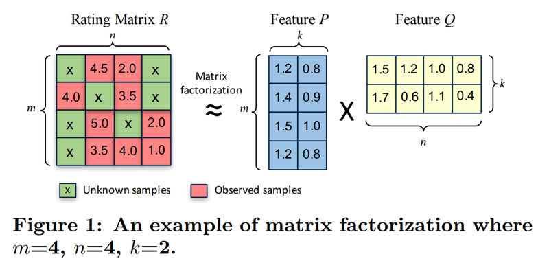

# AIFFEL_18일차 2020.08.18

Tags: AIFFEL_DAILY

### 일정

---

1. BN 논문 마저 읽어보기

    [Batch Normalization](https://www.notion.so/Batch-Normalization-a7325c31ce7844c5b69207c8adbe5ebb)

2. 풀잎스쿨 cs231n lecture 06
3. LMS E-7

# 풀잎스쿨 cs231n lecture 06

---

[CS231n 2017 lecture6](https://www.notion.so/CS231n-2017-lecture6-a91ea7e3cd754888b91b8cdb27d30fc5)

# [E-7] 아이유팬이 좋아할만한 다른 아티스트 찾기.

---

## **실습 목표**

---

0. 추천시스템의 개념과 목적을 이해한다.

1. Implicit 라이브러리를 활용하여 Matrix Factorization(이하 MF) 기반의 추천 모델을 만들어 본다.

2. 음악 감상 기록을 활용하여 비슷한 아티스트를 찾고 아티스트를 추천해 본다.

3. 추천 시스템에서 자주 사용되는 데이터 구조인 CSR Matrix을 익힌다 

4. 유저의 행위 데이터 중 Explicit data와 Implicit data의 차이점을 익힌다.

5. 새로운 데이터셋으로 직접 추천 모델을 만들어 본다.

## 필터링의 방식

---

### 협업 필터링

---

대규모의 기존 사용자 행동 정보를 분석하여 해당 사용자와 비슷한 성향의 사용자들이 기존에 좋아했던 항목을 추천하는 기술.

ex. 라면을 구입한 사용자가 생수를 구입한 경우가 많으면 라면을 구입하는 구매자에게 생수를 추천하는 경우.

### 모델 기반 협력 필터링

---

모델 기반 협력 필터링은 기존 항목 간 유사성을 단순하게 비교하는 것에서 벗어나 자료 안에 내재한 패턴을 이용하는 기법이다.

ex. 이 중 한 방법으로, 연관되는 자료의 크기를 동적으로 변화시키는 방법이 있다. 예를 들어 영
화를 추천하는 경우, ‘해리 포터’ 시리즈 2편을 추천하기 위해서는 ‘해리 포터’ 시리즈 1편, 단 한
편을 좋아했는가가 다른 무엇보다 중요한 요소이다. 하지만 <주토피아>를 추천하기 위해서는
많은 수의 유사한 영화를 고려해야 한다.

### 컨텐츠 기반 필터링

---

항목 자체를 분석하여 추천을 구현.

ex. 음악을 추천하기 위해 음악 자체를 분석하여 유사한 음악을 추천하는 방식.

ex. 유명한 음악 사이트인 판도라(Pandora)의 경우, 신곡이 출시되면 음악을 분석하여 장르, 비트, 음색 등 약 400여 항목의 특성을 추출한다. 그리고 사용자로부터는 ‘like’를 받은 음악의 특색을 바탕으로 해당 사용자의 프로파일을 준비한다. 이러한 음악의 특성과 사용자 프로파일을 비교함으로써 사용자가 선호할 만한 음악을 제공하게 된다.

### 필터버블

---

추천 시스템은 정보를 추려서(filtering) 사용자에게 제공한다.
다시 말하면 사용자가 전체 정보를 볼 기회를 박탈당할 수도 있다는 말이다. 추천 시스템이 고도
화될수록 사용자의 입맛에 맞는 정보만 제공되고 나머지 정보는 감추어지는 위험이 생기는데, 이
러한 현상을 필터버블(filter bubble)이라고 한다.

뉴스나 정보의 경우, 예기치 않은 정보의 차단이 큰 문제가 될 수도 있을 것이다. 예를 들어 본인의 정치적 입맛에 맞는 뉴스만 계속 추천받아 보는 경우가 가능해지는 것이다. 보고 싶은 정보만 보고, 보기 불편한 정보는 자동으로 건너뛰는 것이 기술적으로 가능해지면서 야기될 수 있는 정보의 편향적
제공은 극단적인 양극화와 같은 사회적 문제를 가져올 수도 있다.

### 서비스를 처음 사용할 때 선호도를 묻는 질문에 대한 생각

---

처음 접속한 사용자라면 이 사용자에 대한 아무런 초기 정보가 없는 상황이어서 사용자 기반 추천을 전혀 할 수 없어 콘텐츠 기반 필터링 방식의 추천만 가능한데, 이를 보완하여 처음부터 사용자 특성에 따른 맞춤형 서비스를 제공하기 위해서입니다.
사용자 맞춤형 추천을 제공하지 못한다면 모든 초기 사용자에게 같은 화면을 제시할 수밖에 없는데, 이러면 모든 사용자들이 처음 추천받은 콘텐츠 위주로만 시청하게 되어 추천시스템이 빠지기 쉬운 필터 버블의 문제을 야기하거나, 추천의 다양성을 저해할 수 있는 위험이 생깁니다.

추천시스템은 이처럼 a)아이템은 매우 많고 b)유저의 취향은 다양할 때 유저가 소비할만한 아이템을 예측하는 모델입니다.

### tsv

---

tsv는 Tab-Separated Values의 약자로서, Comma-Separated Values의 약자인 csv 파일과 거의 동일하나 구분자만 comma가 아니라 tab('\t') 문자를 활용한 것입니다.

```python
import pandas as pd
import os

fname = os.getenv('HOME') + '~~'
data = pd.read_csv(fname, sep='\t', names= col_names)
# sep='\t'로 주어야 tsv를 열 수 있습니다.  
data.head(10)
```

첫 번째 유저가 어떤 노래를 듣는지 확인해보기

⇒ 아래 코드처럼 condition 을 변수로 지정하고 해당 condition 을 loc 안에 넣어주는 방식이 가능.

```python
condition = data['user_id']== data.loc[0, 'user_id']
data.loc[condition]
```

## 모델을 만들기 전에 데이터를 탐색하는 과정

---

### 주요 탐색 과정 및 사용되는 pandas 함수들

---

(참고) pandas.DataFrame.nunique()은 특정 컬럼에 포함된 유니크한 데이터의 개수를 알아보는데 유용합니다.

```python
# 유저 수
data['user_id'].nunique()
```

```python
# 인기 많은 아티스트
artist_count = data.groupby('artist')['user_id'].count()
artist_count.sort_values(ascending=False).head(30)
```

```python
# 유저별 몇 명의 아티스트를 듣고 있는지에 대한 통계
user_count = data.groupby('user_id')['artist'].count()
user_count.describe()
```

```python
if not data.isin({'user_id':['zimin']})['user_id'].any():  # user_id에 'zimin'이라는 데이터가 없다면
    data = data.append(my_playlist)                           # 위에 임의로 만든 my_favorite 데이터를 추가해 줍니다. 

```

### indexing

---

```python
# 고유한 유저, 아티스트를 찾아내는 코드
user_unique = data['user_id'].unique()
artist_unique = data['artist'].unique()

# 유저, 아티스트 indexing 하는 코드 idx는 index의 약자입니다.
user_to_idx = {v:k for k,v in enumerate(user_unique)}
artist_to_idx = {v:k for k,v in enumerate(artist_unique)
```

⇒ 유저, 아티스트의 고유값을 걸러내고

⇒ enumerate로 k 에 index v 에 값을 담아서 ( 여기서 v는 아직 unique 한 유저 아이디, 아티스트 이름이겠지)

⇒ v:k 형태, 즉 <아이디 or 이름> : index 형태로 만들어서 dict 형태로 저장

```python
# indexing을 통해 데이터 컬럼 내 값을 바꾸는 코드
# dictionary 자료형의 get 함수는 https://wikidocs.net/16 을 참고하세요.

# user_to_idx.get을 통해 user_id 컬럼의 모든 값을 인덱싱한 Series를 구해 봅시다. 
# 혹시 정상적으로 인덱싱되지 않은 row가 있다면 인덱스가 NaN이 될 테니 dropna()로 제거합니다. 
temp_user_data = data['user_id'].map(user_to_idx.get).dropna()
if len(temp_user_data) == len(data):   # 모든 row가 정상적으로 인덱싱되었다면
    print('user_id column indexing OK!!')
    data['user_id'] = temp_user_data   # data['user_id']을 인덱싱된 Series로 교체해 줍니다. 
else:
    print('user_id column indexing Fail!!')

# artist_to_idx을 통해 artist 컬럼도 동일한 방식으로 인덱싱해 줍니다. 
temp_artist_data = data['artist'].map(artist_to_idx.get).dropna()
if len(temp_artist_data) == len(data):
    print('artist column indexing OK!!')
    data['artist'] = temp_artist_data
else:
    print('artist column indexing Fail!!')

data
```

⇒ 기존 data['user_id'] series 에 담겨있는 user_id 값들에 해당하는 index 값을 하나하나 매칭하여 새로운 series 를 만든 것이 temp_user_data

⇒ 제대로 만들어졌는지 확인 후, 기존 data['user_id'] series 에 새로 만들어진 indexing 된 series를 넣어준다.

## 사용자의 명시적/암묵적 평가

---

사용자가 아이템을 얼마나 선호하는지 모델링하여 추천시스템을 구성하는 것.

그렇게 하려면, **사용자의 아이템 선호도를** 말해주는 유저 행동 데이터셋 필요.

명시적 : 좋아요 횟수.

암묵적 : 아티스트의 곡을 몇 번 플레이했나.

### Implicit dataset을 다룰 때 염두해두어야 할 몇 가지 특징

---

출처 : [https://orill.tistory.com/entry/Explicit-vs-Implicit-Feedback-Datasets?category=1066301](https://orill.tistory.com/entry/Explicit-vs-Implicit-Feedback-Datasets?category=1066301)

1. 부정적인 피드백이 없다 : 싫어해서 보지 않은 것인지, 몰라서 보지 않았는지 모른다.
2. 애초에 잡음이 많다 : 과제 때문에 영화를 봤을 수도 있지.
3. 수치는 신뢰도를 의미한다 : implicit 데이터에서는 높은 수치가 꼭 높은 선호도를 의미하는 것은 아니다.
4. implicit-feedback recommender system의 평가는 적절한 방법을 고민해봐야 한다.

## Matrix Factorization(MF)

---

기본 아이디어는 아래 그림과 같습니다.

(m,n) 사이즈의 행렬 R을 (m,k) 사이즈의 행렬 P와 (k,n) 사이즈의 행렬 Q로 분해한다면 R이란 그저 P와 Q의 행렬곱으로 표현 가능할 수 있다는 간단한 아이디어입니다.

대체로 k는 m이나 n보다 훨씬 작은 값이기 때문에 계산량 측면으로도 훨씬 유리해집니다.

하지만 아이디어의 단순함에도 불구하고 MF 모델은 성능이 준수하고 Scalability가 좋아서 많이 사용되는 모델입니다.



[- 출처: [CuMF_SGD: Fast and Scalable Matrix Factorization](https://arxiv.org/pdf/1610.05838.pdf)]

(m,k) 사이즈의 feature matrix P는 k차원의 벡터를 사용자 수만큼 모아놓은 행렬.

P_0 = (1,0.1) 은 빨간 모자를 쓴 첫번째 사용자의 특성(feature) 벡터가 된다.

Q_0 = (0.9,0.2) 은 해리포터 영화의 특성(feature) 벡터가 된다.


[출처: [https://developers.google.com/machine-learning/recommendation/collaborative/matrix](https://developers.google.com/machine-learning/recommendation/collaborative/matrix)]

모델의 목표는 모든 유저와 아이템에 대해 k-dimension의 벡터를 잘 만드는 것입니다.

벡터를 잘 만드는 기준은

**유저i의 벡터와 아이템j의 벡터를 내적했을 때 유저i가 아이템j에 대해 평가한 수치와 비슷한지** 입니다. $U_i \cdot I_j = M_{ij}$

## CSR (Compressed Sparse Row) Matrix

---

아무리 많은 아티스트를 들어 본 유저도 수백명을 넘어갈 만큼의 아티스트를 들어보지 못했는데, 총 아티스트는 29만명이 넘기 때문에 평가행렬 내의 대부분의 공간은 0으로 채워집니다.

이런 행렬을 **Sparse Matrix**라고 합니다.
이런 메모리 낭비를 최소화하기 위해서는 유저가 들어본 아티스트에 대해서만 정보만을 저장하면서 전체 행렬 형태를 유추할 수 있는 데이터 구조가 필요합니다.

### 구조 설명

---

출처 : [https://lovit.github.io/nlp/machine learning/2018/04/09/sparse_mtarix_handling/#csr-matrix](https://lovit.github.io/nlp/machine%20learning/2018/04/09/sparse_mtarix_handling/#csr-matrix)


```python
print(csr.data) # [1 2 3 4 5 6]

print(csr.indices) # [0 4 1 3 0 3]

print(csr.indptr) # [0 2 4 4 6]

# num of rows + 1
len(csr.indptr) # 5
```

indptr 과 indices 를 이용하면 row 별 연산이 가능합니다. zip(indptr, indptr[1:]) 을 수행하면 (begin, end) index 를 얻을 수 있습니다. enumerate() 는 row index 를 얻기 위하여 입력.

```python
for i, (b, e) in enumerate(zip(csr.indptr, csr.indptr[1:])):
    for idx in range(b, e):
        j = csr.indices[idx]
        d = csr.data[idx]
        print('({}, {}) = {}'.format(i, j, d))

# (0, 0) = 1
# (0, 4) = 2
# (1, 1) = 3
# (1, 3) = 4
# (3, 0) = 5
# (3, 3) = 6
```

---

### 만드는 방법

출처 : [https://docs.scipy.org/doc/scipy/reference/generated/scipy.sparse.csr_matrix.html](https://docs.scipy.org/doc/scipy/reference/generated/scipy.sparse.csr_matrix.html)

**csr_matrix((data, (row_ind, col_ind)), [shape=(M, N)])**

where `data`, `row_ind` and `col_ind` satisfy the relationship `a[row_ind[k], col_ind[k]] = data[k]`.

⇒ 여기 들어간 a는 뭐임??

**예시**

```python
# 실습 위에 설명보고 이해해서 만들어보기
from scipy.sparse import csr_matrix

num_user = data['user_id'].nunique()
num_artist = data['artist'].nunique()

csr_data = csr_matrix((data.play, (data.user_id, data.artist)), shape= (num_user, num_artist))
csr_data
```

## MF 모델 학습하기

---

- **`implicit`** 패키지는 암묵적(implicit) dataset을 사용하는 다양한 모델을 굉장히 빠르게 학습할 수 있는 패키지입니다.
- 이 패키지에 구현된 **`als(AlternatingLeastSquares) 모델`**을 사용하겠습니다. **`Matrix Factorization`**에서 쪼개진 두 Feature Matrix를 한번에 훈련하는 것은 잘 수렴하지 않기 때문에, 한쪽을 고정시키고 다른 쪽을 학습하는 방식을 번갈아 수행하는 AlternatingLeastSquares 방식이 효과적인 것으로 알려져 있습니다.

패키지 : [https://github.com/benfred/implicit](https://github.com/benfred/implicit)

```python
# 기존 csr_data matrix 는 user X item 형태로 되어있었잖아.
# als 모델은 input으로 (item X user 꼴의 matrix를 받기 때문에 Transpose해줍니다.)
csr_data_transpose = csr_data.T
csr_data_transpose
```

---

Q. queen에 대한 선호도를 예측한 결과를 어떻게 해석하면 좋을까요? 사용자와 아티스트 벡터 내적이 0.5를 기준으로 그보다 높으면 모델이 선호한다고 판단했다고 말할 수 있을까요?

⇒ 모델을 만드는 사람이 정하기 나름입니다. 객관적인 지표로 만들어서 기준을 정할 수도 있고 도메인 경험을 통해 정할 수도 있습니다. 추천 시스템은 다른 머신러닝 task보다 객관적인 평가가 어려운 분야입니다. 사람을 도통 알 수 없기 때문에 객관적인 지표를 정하기 어렵기 때문입니다.

---

⇒ 객관적 판단의 어려움. 모델을 만드는데 사용되는 데이터인 사람에 관한 데이터에 대한 깊은 이해의 필요성.

## 비슷한 아티스트 찾기, 유저에게 추천하기

---

AlternatingLeastSquares 클래스에 구현되어 있는 similar_items 메서드를 통하여 비슷한 아티스트를 찾습니다

recommend 메서드를 통하여 제가 좋아할 만한 아티스트를 추천 받습니다. filter_already_liked_items 는 유저가 이미 평가한 아이템은 제외하는 Argument입니다.

AlternatingLeastSquares 클래스에 구현된 explain 메소드를 사용하면 제가 기록을 남긴 데이터 중 이 추천에 기여한 정도를 확인할 수 있습니다.

```python
rihanna = artist_to_idx['rihanna']
explain = als_model.explain(user, csr_data, itemid=rihanna)

print(explain)
[(idx_to_artist[i[0]], i[1]) for i in explain[1]]
```

### 마무리

---

MF 이외의 모델 구조도 많이 연구/ 사용되고 있습니다. 하지만 어떤 추천 모델도 핵심은 MF와 비슷합니다.

유저와 아이템에 대한 벡터를 잘 학습하여 취향에 맞게(유저에 맞게) 아이템을 보여주거나(Retrieval) 걸러내는(Filtering) 역할입니다.

# 프로젝트 : Movielens 영화 추천 실습

---

이번에 활용할 데이터셋은 추천시스템의 MNIST라고 부를만한 Movielens 데이터입니다.

- 별점 데이터는 대표적인 explicit 데이터입니다. 하지만 implicit 데이터로 간주하고 테스트해볼 수 있습니다.
- 별점을 **시청횟수**로 해석해서 생각하겠습니다.
- 또한 유저가 3점 미만으로 준 데이터는 선호하지 않는다고 가정하고 제외하겠습니다.

```python
# rating 컬럼의 이름을 count로 바꿉니다.
ratings.rename(columns={'rating':'count'}, inplace=True)
```

[https://github.com/bluecandle/2020_AIFFEL/blob/master/daily_notes/exploration_codes/e7_code/E7.ipynb](https://github.com/bluecandle/2020_AIFFEL/blob/master/daily_notes/exploration_codes/e7_code/E7.ipynb)