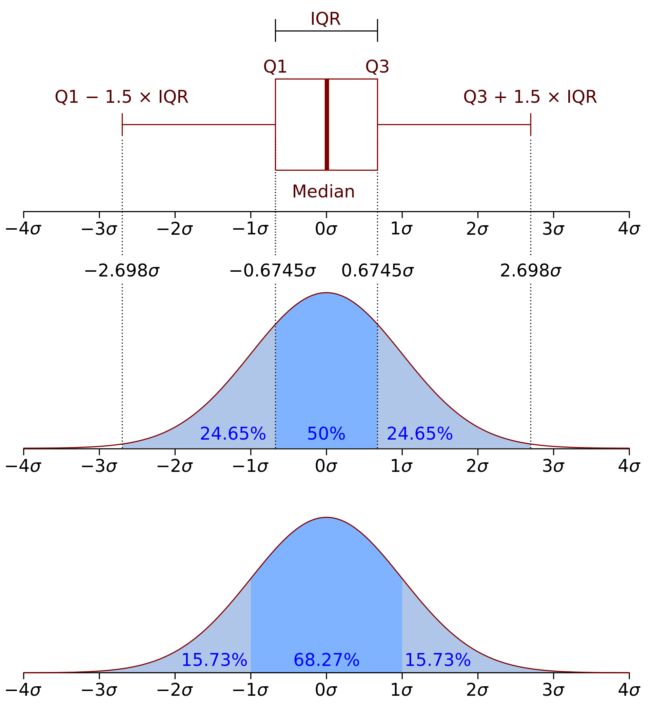

# AIFFEL_19일차 2020.08.19

Tags: AIFFEL_DAILY

### 일정

1. LMS E-7 마무리
2. LMS F-16
3. LMS F-17

# [F-16] 다양한 데이터 전처리 기법

---

## **학습 목표**

---

- 중복된 데이터를 찾아 제거할 수 있고, 결측치(missing data)를 제거하거나 채워 넣을 수 있다.
- 데이터를 정규화시킬 수 있다.
- 이상치(outlier)를 찾고, 이를 처리할 수 있다.
- 범주형 데이터를 원-핫 인코딩할 수 있다.
- 연속적인 데이터를 구간으로 나눠 범주형 데이터로 변환할 수 있다.

## 결측치

---

전체 데이터 건수에서 각 컬럼별 값이 있는 데이터 수를 빼주면 컬럼별 결측치의 개수를 알 수 있습니다.

```python
print('컬럼별 결측치 개수')
len(trade) - trade.count()
# count 함수의 결과값으로 각 컬럼별 값의 수가 나오는데, 결측치면 포함되지 않음.
```

```python
trade.isnull()
# 결측치인지 확인하여 True,False

trade.isnull().any(axis=1)
# 결측치가 하나라도 있으면 해당 행은 True

trade[trade.isnull().any(axis=1)]
# 결측치가 하나라도 있는 행을 찾아냄.

# 결과를 보고 처리
```

### 수치형 데이터 보완

---

1. 특정 값을 지정해줄 수 있습니다. 그러나 결측치가 많은 경우, 모두 같은 값으로 대체한다면 데이터의 분산이 실제보다 작아지는 문제가 생길 수 있습니다.
2. 평균, 중앙값 등으로 대체할 수 있습니다. 1번에서 특정 값으로 대체했을 때와 마찬가지로 결측치가 많은 경우 데이터의 분산이 실제보다 작아지는 문제가 발생할 수 있습니다.
3. 다른 데이터를 이용해 예측값으로 대체할 수 있습니다. 예를 들어 머신러닝 모델로 2020년 4월 미국의 예측값을 만들고, 이 값*으로 결측치를 보완할 수 있습니다.*
4. 시계열 특성을 가진 데이터의 경우 앞뒤 데이터를 통해 결측치를 대체할 수 있습니다. 예를 들어 기온을 측정하는 센서 데이터에서 결측치가 발생할 경우, 전후 데이터의 평균으로 보완할 수 있습니다.

### 범주형 데이터 보완

---

1. 특정 값을 지정해줄 수 있습니다. 예를 들어 ‘기타’, ‘결측’과 같이 새로운 범주를 만들어 결측치를 채울 수 있습니다.
2. 최빈값 등으로 대체한다. 결측치가 많은 경우 최빈값이 지나치게 많아질 수 있으므로 결측치가 많을 때는 다른 방법을 사용한다.
3. 다른 데이터를 이용해 예측값으로 대체할 수 있다.
4. 시계열 특성을 가진 데로터의 경우 앞뒤 데이터를 통해 결측치를 대체할 수 있습니다. 예를 들어 특정인의 2019년 직업이 결측치이고, 2018년과 2020년 직업이 일치한다면 그 값으로 보완할 수 있습니다. 만약 다르다면 둘 중 하나로 보완하도록 합니다.

## 중복된 데이터

---

```python
trade[trade.duplicated()]

trade[(trade['기간']=='2020년 03월')&(trade['국가명']=='중국')]

#중복된 데이터를 손쉽게 삭제
trade.drop_duplicates(inplace=True)
print("👽 It's okay, no biggie.")

# id가 중복된 경우, 맨 나중에 들어온 값만 남겨야 할 때, 간단히 가능.
df.drop_duplicates(subset=['id'], keep='last')
```

## 이상치 (Outlier)

---

### z-score

---

가장 먼저 생각해 볼 수 있는 **간단하고 자주 사용되는 방법**은 **평균과 표준편차**를 이용하는 z-score

방법입니다. **평균을 빼주고 표준편차로 나눠** z score $({\frac {X-\mu }{\sigma }})$ 를 계산합니다. 그리고 z score가 특정 기준을 넘어서는 데이터에 대해 이상치라고 판단합니다.

⇒ 한계 존재

### '이상치'로 판단 후 처리방법

---

1. 가장 간단한 방법으로 이상치를 **삭제**할 수 있습니다. 이상치를 원래 데이터에서 삭제하고, 이상치끼리 따로 분석하는 방안도 있습니다.
2. 이상치를 다른 값으로 **대체**할 수 있습니다. 데이터가 적으면 이상치를 삭제하기보다 다른 값으로 대체하는 것이 나을 수 있습니다. 예를 들어 최댓값, 최솟값을 설정해 데이터의 범위를 제한할 수 있습니다.
3. 혹은 결측치와 마찬가지로 다른 데이터를 활용하여 예측 모델을 만들어 **예측값을 활용**할 수도 있습니다.
4. 아니면 **binning을 통해 수치형 데이터를 범주형으로** 바꿀 수도 있습니다.

### IQR method

---

사분위범위수 IQR(Interquartile range) 로 이상치를 알아내는 방법.

$IQR = Q_3- Q_1$

IQR은 제 3사분위수에서 제 1사분위 값을 뺀 값으로 데이터의 중간 50%의 범위.

$Q_1 - 1.5*IQR$ 보다 왼쪽에 있거나 , $Q_3 + 1.5*IQR$ 보다 오른쪽에 있는 경우 이상치라고 판단.



```python
# 1,3 사분위수 구하기
Q3, Q1 = np.percentile(data, [75 ,25])
```

---

[Three ways to detect outliers]([http://colingorrie.github.io/outlier-detection.html](http://colingorrie.github.io/outlier-detection.html))

the **mean and standard deviation** are **highly affected by outliers** – they are not robust. In fact, the skewing that outliers bring is one of the biggest reasons for finding and removing outliers from a dataset!

behaves strangely in small datasets : in fact, the Z-score method will never detect an outlier if the dataset has fewer than 12 items in it.

*modified Z-score method

it uses the median and MAD rather than the mean and standard deviation. The median and MAD are robust measures of central tendency and dispersion, respectively.

---

## 정규화

---

컬럼마다 스케일이 크게 차이가 나는 데이터를 입력하면 머신러닝 모델 학습에 문제가 발생할 수 있습니다.

가장 잘 알려진 표준화(Standardization)와 Min-Max Scaling을 알아보도록 하겠습니다.

### Standardization(표준화)

---

데이터의 평균은 0, 분산은 1로 변환

${\frac {X-\mu }{\sigma }}$

```python
# trade 데이터를 Standardization 기법으로 정규화합니다. 
# 컬럼 목록을 하나에 넣고 집어넣어도 문제없이 돌아간다!
cols = ['수출건수', '수출금액', '수입건수', '수입금액', '무역수지']
trade_Standardization= (trade[cols]-trade[cols].mean())/trade[cols].std()
trade_Standardization.head()
```

### Min-Max Scaling

---

데이터의 최솟값은 0, 최댓값은 1로 변환

${{\frac {X-X_{\min }}{X_{\max }-X_{\min }}}}$

### 주의사항

---

train 데이터와 test 데이터가 나눠져 있는 경우 **train 데이터를 정규화 시켰던 기준 그대로 test 데이터도 정규화** 시켜줘야 합니다. ( test min, max 기준이 아닌 train min,max 기준으로 해야함! )

⇒ why??

⇒ 그냥 뭐...기준이 동일해야 한다! 라는 상식적인 수준에서도 이해는 되지만 그래도 더 좋은 설명이 있으면 좋겠다는 생각.

⇒ [https://www.youtube.com/watch?v=FDCfw-YqWTE&feature=youtu.be](https://www.youtube.com/watch?v=FDCfw-YqWTE&feature=youtu.be)


train set 정규화에 사용한 동일한 값(방식)을 사용하였을 때,

"정확히 같은 방식으로 테스트 세트를 확장하게 된다"

왜냐하면 훈련 샘플과 테스트 샘플 모두 그렇게 되기를 원하기 때문.

```python
train_min = train.min()
train_max = train.max()

train_min_max = (train - train_min)/(train_max - train_min)
test_min_max =  (test - train_min)/(train_max - train_min)
# test를 min-max scaling할 때도 train 정규화 기준으로 수행
# train 기준으로!!! 그게 중요한 포인트
```

**로그 변환** 등의 기법도 정규화화 함께 사용하면 도움이 될 수 있다는 것도 기억해 주세요!

### 정규화 필요성

---


⇒ 정규화 하지 않으면(왼쪽) 가늘고 긴 활같은 모양의 비용함수를 얻게 되고, 정규화 하면(오른쪽) 평균적으로 대칭적인 모양을 갖게 됨.

⇒ 왼쪽 함수에 경사 하강법을 쓰면 매우 작은 학습율 사용

⇒ 오른쪽 함수에 경사 하강법을 쓰면 큰 학습율 사용할 수 있음 ( 더 빠르게 minima로 이동 )

## One-Hot Encoding

---

카테고리별 이진 특성을 만들어 해당하는 특성만 1 나머지는 0으로 만드는 방법입니다.

pandas에서 get_dummies 함수를 통해 손쉽게 원-핫 인코딩을 할 수 있습니다.

```python
#trade 데이터의 국가명 컬럼 원본
print(trade['국가명'].head())  

# get_dummies를 통해 국가명 원-핫 인코딩
country = pd.get_dummies(trade['국가명'])
country.head()
```

## 구간화(Binning)

---

구간별로 나누고자 합니다. 이러한 기법을 구간화(Data binning 혹은 bucketing)이라고 부릅니다.

pandas의 cut 과 qcut을 이용해 수치형 데이터를 범주형 데이터로 변형시키도록 하겠습니다.

```python
bins = [0, 2000, 4000, 6000, 8000, 10000]
ctg = pd.cut(salary, bins=bins)
ctg

# 구간별로 값 몇개
# sort_index 는 index 의 순서대로 sort
ctg.value_counts().sort_index()

# 구간의 갯수 지정 ( 데이터 최솟값에서 최댓값 군등하게 나눠줌 )
ctg = pd.cut(salary, bins=6)
ctg

# qcut은 구간을 일정하게 나누는 것이 아니라
# 데이터의 분포를 비슷한 크기의 그룹으로 나눠줍니다.
ctg = pd.qcut(salary, q=5)
ctg
```

## 마무리와 복습 과제

---

### 이번 챕터에서 배운 내용

---

- 결측치(Missing Data)
- 중복된 데이터
- 이상치(Outlier)
- 정규화(Normalization)
- 원-핫 인코딩(One-Hot Encoding)
- 구간화(Binning)

### 복습

---

[https://www.kaggle.com/gregorut/videogamesales](https://www.kaggle.com/gregorut/videogamesales)

16,500개 이상의 비디오 게임의 대한 매출 정보 등

복습 노트 :  [https://github.com/bluecandle/2020_AIFFEL/blob/master/daily_notes/exploration_codes/e7_code/E7.ipynb](https://github.com/bluecandle/2020_AIFFEL/blob/master/daily_notes/exploration_codes/e7_code/E7.ipynb)

# [F-17] 그나저나 데이터는 어디서 가져오지?

---

### **학습 목표**

---

- 파이썬 프로그래밍을 이용하여 웹에서 데이터를 접근하고 그 데이터를 가져오는 방법에 대해 학습합니다.
- 웹의 구조와 통신에 대한 기초 지식을 배웁니다.
- 웹 크롤링용 파이썬 라이브러리에 대해 학습하고 간단한 예제를 풀어 봅니다.

## Internet

---

수많은 컴퓨터들 사이의 네트워크로 연결된 웹은 인터넷 상에서 제공되는 서비스이고, 웹의 프로토콜인 HTTP 역시 인터넷 프로토콜인 TCP/IP을 기반으로 정의된 것입니다.

인터넷은 비유하자면 컴퓨터간 연결된 도로같은거.


---

인터넷 상에서 데이터를 교환할 때 쓰이는 프로토콜은 TCP/IP 입니다.

- TCP: Transmission Control Protocol -> **`소켓 포트 단위`**의 송수신 프로토콜
    - Transport 레이어에서 데이터의 흐름과 정확성 여부를 관리한다. 하나의 컴퓨터에 여러개의 소프트웨어가 구동하고 있다면 각각이 다른 포트 번호의 소켓을 가지고 있게 되는데, 이 포트번호를 기준으로 데이터가 타겟 소프트웨어 소켓으로 정확히 전송될 수 있도록 데이터 흐름을 책임지는 것이 TCP의 역할이다.
- IP: Internet Protocol -> 컴퓨터마다 주어지는 **`IP 주소 단위`**의 송수신 프로토콜
    - IP는 타겟 주소로 데이터가 정확히 전송되는 것을 책임지는 역할을 하는 프로토콜이다.

⇒ TCP/IP 기반으로 구동된다는 것은 IP주소와 포트번호를 가지고 통신한다는 뜻과 같은 의미

IP는 IP주소 단위 통신이므로 컴퓨터 레벨, TCP는 포트번호 단위 통신이므로 프로그램 레벨 통신 프로토콜이라고 이해하면 되겠습니다.

IP 덕분에 데이터가 특정 컴퓨터까지는 전달되었지만, 포트번호를 따라 정확하게 소켓까지 전달해 주는 것은 TCP의 역할입니다.

정말 TCP/IP는 인터넷에서 정보를 교환할 때 어떻게 해야되는지에 대한 모든것의 근본이 됩니다. 지구상에 있는 어떤 인터넷 서비스도 IP주소와 포트번호, Application 프로토콜 규격만 알면 모두 접속해서 통신이 가능한 것입니다.

## Web

---

[https://www.youtube.com/watch?v=RsQ1tFLwldY&feature=emb_logo](https://www.youtube.com/watch?v=RsQ1tFLwldY&feature=emb_logo)

웹은 비교하자면 인터넷이라는 도로 위에 다니는 대중교통?

### URI & URL

사실 URL은 URI에 포함되는 하위개념이에요.

예를들어 주소가

```
https://lms.aiffel.io/steps/828
```

이라면

```
https://lms.aiffel.io/steps
```

까지는 steps라는 자원의 위치를 가리키는 URI이면서 URL이라 할수 있는데요.

반면에

```
https://lms.aiffel.io/steps/828
```

는 URI가 맞지만 URL는 아니에요. 숫자 '828' 이라는 식별자를 붙임으로써 이 노드의 스텝에 접속하여 학습할 수 있는거에요.

### API

---

API 를 키보드에 비유하는 것이 인상깊네.

키보드를 누르면 어찌저찌해서 스크린에 글자가 보이게 되잖아.

즉, 나는 키보드를 통해서 컴퓨터와 인터랙션 하는 것이다!

서버에서 버튼을 보여주고(알려주고) 요청하는 입장에서는 코드로 그 버튼을 누르는 것

## 크롤링

---

[https://en.wikipedia.org/wiki/Web_crawler](https://en.wikipedia.org/wiki/Web_crawler)


⇒ 이건 지금 단계에서는 너무 어렵다!

### beautifulSoup4 사용

---

**ind(), findAll()**

BeautifulSoup에서 제공하는 이 두 함수는 정말 자주 사용되는 함수입니다. 태그에 더 쉽게 접근할 수 있고 태그의 속성에 따라 필터링도 할 수 있어요.

```python
def download2(url):
    try:
        response = requests.get(url)
        html = response.text
    except requests.ConnectionError:
        print('Connection error')
        html = None
    return html

download2('https://m.stock.naver.com/marketindex/index.nhn')

html = requests.get('https://m.stock.naver.com/marketindex/index.nhn')
soup = BeautifulSoup(html.text, 'html.parser')

countries = soup.findAll('span',{'class'='stock_item'})
rates = soup.findAll('span',{'class'='stock_price'})
```

### 쿠키, 세션, 캐시

---

[https://www.youtube.com/watch?v=OpoVuwxGRDI](https://www.youtube.com/watch?v=OpoVuwxGRDI)


### 브라우저 제어를 통한 크롤링

---

브라우저를 직접 제어해야만 얻을 수 있는 정보 존재.

### Selenium(셀레니움)

---

**2. 셀레니움을 이용하여 브라우저 제어하기**

셀레니움의 **`find_element_by_css_selector()`** 를 이용할건데요. 버튼의 css selector를 이용해서 csv다운로드 버튼의 위치를 알아낼수 있답니다.

```python
import os

wd_path = os.getenv('HOME')+'/aiffel/lib/chromedriver'

#웹드라이버 실행 및 페이지 이동
driver = webdriver.Chrome(wd_path)   # 크롬드라이버를 통해 브라우저를 띄우고
driver.get(crawling_urls['산과공원'])      # 우리가 원하는 URL로 이동합니다.
time.sleep(5)       # 해당 화면이 다 로딩할 때까지 5초간 충분히 기다려 줍니다. 
 
#btnCsv
#csv파일 다운로드 버튼 클릭하기
driver.find_element_by_css_selector("#btnCsv").click()   # 사람이 누른 것처럼 다운로드 버튼을 클릭한 후
time.sleep(3)     # 다운로드가 완료될 때까지 3초간 기다려 줍니다. 

driver.quit()      # 브라우저를 닫습니다.

#다운받은 csv파일 확인
#_dir = os.getenv('HOME')+'/다운로드'
_dir = os.getenv('HOME')+'/Downloads'   # 영문 우분투 사용자라면 이 경로를 선택해 주세요.

files = glob.glob('{}/서울시*.csv'.format(_dir))
print(files)

#csv파일을 dataframe으로 변환하기
#인코딩 에러 발생시에 encoding옵션 추가
#encoding='UTF-8'
f_M_park = pd.read_csv(files[0],encoding='cp949')  
#CP949: windows에서 사용하는 인코딩 방식
#공공기관 데이터는 cp949 혹은 euc-kr 방식
f_M_park.head(3)
```