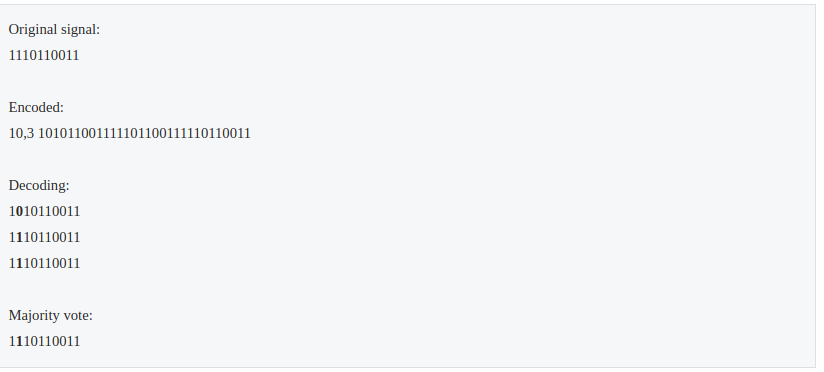

# AIFFEL_20일차 2020.08.20

Tags: AIFFEL_DAILY

### 일정

---

1. cs231n lecture09 마무리
2. LMS E-8
3. 시간 남으면, 코드마스터 과제 (stack,queue)

# LMS E-8

---

## **학습 목표**

---

- 데이터 사이언스 관련 최대 커뮤니티인 캐글의 경진대회에 직접 참여해서 문제를 해결해본다.
- 캐글에서 데이터를 내려받는 것으로부터 시작해서, 로컬 서버에서 자유롭게 다루어보며 문제 해결을 위한 고민을 해본다.
- 앙상블 기법의 개념과 강점을 이해하고, 여러 모델의 예측 결과를 Averaging 한 최종 결과로 캐글에 제출해본다.
- 하이퍼 파라미터 튜닝의 필요성과 의미를 이해하고, Grid Search, Random Search 등의 기법을 알아본다.
- Grid Search 기법을 활용해서 직접 하이퍼 파라미터 튜닝 실험을 해보고, 모델의 성능을 최대한 끌어올려본다.

### RMSE

---

$sqrt( 1/N * Σ((Yt - Ypr)^2) )$

우리가 예측해야 하는 값과 실제 정답값이 모두 실수값입니다.

두 가지 값의 차이를 사용해 얼마나 떨어져 있는지 계산할 수 있는 RMSE를 평가 척도로 사용하는 것은 합리적으로 보이는군요.

캐글 커널

캐글의 커널(Kernel)은 우리가 쓰는 주피터 노트북 형태의 파일이 캐글 서버에서 실행될 때 그 프로그램을 일컫는 개념입니다.

## Baseline 모델 사용해보기

---

Baseline 커널은 위에서 말했던 캐글의 서버에서 돌아가도록 코드가 설계되었기 때문에 데이터가 아래와 같이 **`../input`** 이라는 디렉토리에 위치합니다.

**1) Baseline 커널의 기존 코드**

```
train_data_path = join('../input', 'train.csv')
sub_data_path = join('../input', 'test.csv')
```

✓ 학습 데이터에서 라벨 제거하기

```python
y = data['price']
del data['price']

print(data.columns)
```

✓ 각 변수들의 분포 확인

```python
fig, ax = plt.subplots(10, 2, figsize=(6, 60))   # 가로스크롤 때문에 그래프 확인이 불편하다면 figsize의 x값을 조절해 보세요. 

# id 변수는 제외하고 분포를 확인합니다.
count = 0
columns = data.columns
for row in range(10):
    for col in range(2):
        sns.kdeplot(data[columns[count]], ax=ax[row][col])
        ax[row][col].set_title(columns[count], fontsize=15)
        count += 1
        if count == 19 :
            break
```

bedrooms, sqft_living, sqft_lot, sqft_above, sqft_basement 변수가 한쪽으로 치우친 경향을 보이는군요.

⇒ 한 쪽으로 치우친 분포의 경우에는 로그 변환(log-scaling)을 통해 데이터 분포를 정규분포에 가깝게 만들 수 있습니다.

```python
skew_columns = ['bedrooms', 'sqft_living', 'sqft_lot', 'sqft_above', 'sqft_basement']

for c in skew_columns:
    data[c] = np.log1p(data[c].values)
```

### [로그변환] **그렇다면 왜 로그 변환은 분포의 치우침을 줄어들게 만드는 걸까요?**

---

이는 로그 함수의 형태를 보면 알 수 있습니다.

- 0<x<1 범위에서는 기울기가 매우 가파릅니다. 즉, x의 구간은 (0,1)로 매우 짧은 반면, y의 구간은 (−∞,0)으로 매우 큽니다.
- 따라서 0에 가깝게 모여있는 값들이 x로 입력되면, 그 함수값인 y 값들은 매우 큰 범위로 벌어지게 됩니다. 즉, 로그 함수는 0에 가까운 값들이 조밀하게 모여있는 입력값을, 넓은 범위로 펼칠 수 있는 특징을 가집니다.
    - 위와 같은 특성 때문에 한 쪽으로 몰려있는 분포에 로그 변환을 취하게 되면 넓게 퍼질 수 있는 것이죠.
- 반면, x값이 점점 커짐에 따라 로그 함수의 기울기는 급격히 작아집니다. 이는 곧 큰 x값들에 대해서는 y값이 크게 차이나지 않게 된다는 뜻이고, 따라서 넓은 범위를 가지는 x를 비교적 작은 y값의 구간 내에 모이게 하는 특징을 가집니다.

- 0에 가깝게 몰려있는 데이터들은 넓게 퍼질 것이고, 매우 크게 퍼져있는 소수의 데이터들은 작은 y값으로 모일 것이다.
- 즉, 왼쪽으로 치우친 값들은 보다 넓은 범위로 고르게 퍼지고 오른쪽으로 얇고 넓게 퍼진 값들은 보다 작은 범위로 모이게 된다.

⇒  전체 분포는 정규분포의 형상을 띄는 방향으로 변환될 것이다.

### 로그 변환이 필요한 데이터 처리 완료, 다시 나누어준다.

---

```python
sub = data.iloc[train_len:, :]
x = data.iloc[:train_len, :]

print(x.shape)
print(sub.shape)
```

## 모델 설계

---

### 앙상블

---

Baseline 커널에서는 여러 가지 모델을 함께 사용해서 결과를 섞는, 블렌딩(blending) 이라는 기법을 활용 : 하나의 개별 모델을 사용하는 것이 아니라 다양한 여러 모델을 종합하여 결과를 얻는 기법.

( = 앙상블 )

---

[https://subinium.github.io/introduction-to-ensemble-1/#:~:text=앙상블(Ensemble) 학습은 여러,를 가지고 이해하면 좋습니다](https://subinium.github.io/introduction-to-ensemble-1/#:~:text=%EC%95%99%EC%83%81%EB%B8%94(Ensemble)%20%ED%95%99%EC%8A%B5%EC%9D%80%20%EC%97%AC%EB%9F%AC,%EB%A5%BC%20%EA%B0%80%EC%A7%80%EA%B3%A0%20%EC%9D%B4%ED%95%B4%ED%95%98%EB%A9%B4%20%EC%A2%8B%EC%8A%B5%EB%8B%88%EB%8B%A4).

'하나의 강한 머신러닝 알고리즘보다 여러 개의 약한 머신러닝 알고리즘이 낫다!' 라는 아이디어.

⇒ 이미지, 영상, 음성 등의 비정형 데이터의 분류는 딥러닝이 뛰어난 성능을 보이고 있지만, 대부분의 정형 데이터 분류 시에는 앙상블이 뛰어난 성능을 나타내고 있습니다.

---

### 앙상블 기법

---

*Voting, Averaging

보팅(Voting) 또는 에버리징(Averaging) 은 가장 쉬운 앙상블 기법입니다. 이 둘은 서로 다른 알고리즘을 가진 분류기를 결합하는 방식입니다.

Voting은 분류 에서 사용하며 Averaging은 회귀 에서 사용

*Bagging

배깅(Bagging) 은 Bootstrap Aggregating의 약자입니다. 배깅의 핵심은 평균을 통해 분산(variance)값을 줄여 모델을 더 일반화시킨다는 점

배깅의 대표적인 알고리즘은 랜덤 포레스트(Random Forest) 입니다. 그 외에도 Bagging meta-estimator가 있습니다.

*Boosting

부스팅(Boosting) 알고리즘은 여러 개의 약한 학습기(weak learner)를 순차적으로 학습-예측하며 잘못 예측한 데이터에 가중치 부여를 통해 오류를 개선해 나가면서 학습하는 방식

### 앙상블이 효과가 있는 이유??

---

앙상블은 강력한 개별 모델 하나보다 약한 여러 개의 모델의 결과를 합치는 것이 낫다는 기본 전제로부터 시작됩니다.

하지만 위 전제가 실제로 성립한다면, 그 이유는 무엇일까요?

---

[https://gentlej90.tistory.com/73](https://gentlej90.tistory.com/73)

예시



상관관계에 따른 결과차이?


앙상블 멤버들 간의 낮은 상관관계는 오차수정능력이 상관되는 결과를 보인다.

가중(weighing) 다수결 투표방식도 가능! 더 좋은 모데링 하나의 투표에서 더 많은 가중치를 갖도록.

---

---

*순열,조합

[https://kcms.tistory.com/entry/순열과-조합-기본개념과-계산](https://kcms.tistory.com/entry/%EC%88%9C%EC%97%B4%EA%B3%BC-%EC%A1%B0%ED%95%A9-%EA%B8%B0%EB%B3%B8%EA%B0%9C%EB%85%90%EA%B3%BC-%EA%B3%84%EC%82%B0)


---

### Cross Validation

교차 검증을 통해 모델의 성능을 간단히 평가하겠습니다.

```python
def get_cv_score(models):
    kfold = KFold(n_splits=5, random_state=2019).get_n_splits(x.values)
    for m in models:
        print("Model {} CV score : {:.4f}".format(m['name'], np.mean(cross_val_score(m['model'], x.values, y)), 
                                                  kf=kfold))
```

결정계수 $R^2$

cross_val_score() 함수는 회귀모델을 전달할 경우  $R^2$ 점수를 반환합니다.

 $R^2$ 값은 1에 가까울수록 모델이 잘 학습되었다는 것을 나타냅니다.

[https://newsight.tistory.com/259](https://newsight.tistory.com/259)

만일  $R^2$=1이라면, 이는 "오차^2 = 0인 상황이므로" training error가 0인 것을 의미한다.

 $R^2$의 단점

데이터가 매우 단순하여 평균을 예측하는 것만으로도 오차가 충분히 작을 때에는 모델 성능이 좋든 나쁘든 유사한 지표가 측정될 수 있다는 점일 것이다.

이때에는 편차가 매우 작아지고, 오차도 동시에 매우 작아지게 된다. 그러면 경우에 따라서 우측항이 1보다 큰 값을 낼 수 있어 R^2가 0 이하가 될 수 있다. (그러나 보통 이런 경우 데이터 자체에 문제가 있거나, 정 안되면 Zero-R을 사용하면 된다.)


### AveragingBlending 예시

```python
def AveragingBlending(models, x, y, sub_x):
    for m in models : 
        m['model'].fit(x.values, y)
    
    predictions = np.column_stack([
        m['model'].predict(sub_x.values) for m in models
    ])
    return np.mean(predictions, axis=1)

```

## baseline에서 변경해보자

---

**np.exp1m()**은 **np.log1p()**과는 반대로 각 원소 x마다 exp(x)-1의 값을 반환해 줍니다.

info() 함수로 전체 데이터의 자료형을 한 눈에 확인해 볼까요?

```python
train.info()
```

### 사전준비

---

머신러닝 모델을 학습시키고 튜닝을 하다보면 몇 시간이 훌쩍 지났는지 모를 만큼 실험해볼 것들이 많습니다.

보다 다양하고 많은 실험을 하기 위해서는, 그만큼 실험을 위한 도구들이 잘 준비되어 있는 것이 유리하겠죠.

y_test나 y_pred는 위에서 np.log1p()로 변환이 된 값이기 때문에 원래 데이터의 단위에 맞게 되돌리기 위해 np.expm1()을 추가해야 한다는 점입니다.

```python
def rmse(y_test, y_pred):
    return np.sqrt(mean_squared_error(np.expm1(y_test),np.expm1(y_pred)))
```

각 모델의 이름은 다음과 같이 클래스의 **name** 속성에 접근해서 얻을 수 있습니다.

```python
gboost.__class__.__name__
```

```python
df = {}

for model in models:
    # 모델 이름 획득
    model_name = model.__class__.__name__

    # train, test 데이터셋 분리 - 여기에도 random_state를 고정합니다. 
    X_train, X_test, y_train, y_test = train_test_split(train, y, random_state=random_state, test_size=0.2)

    # 모델 학습
    model.fit(X_train, y_train)
    
    # 예측
    y_pred = model.predict(X_test)

    # 예측 결과의 rmse값 저장
    df[model_name] = rmse(y_test, y_pred)
    
    # data frame에 저장
    score_df = pd.DataFrame(df, index=['RMSE']).T.sort_values('RMSE', ascending=False)
    
df
```

### 하이퍼 파라미터 튜닝

---

[https://shwksl101.github.io/ml/dl/2019/01/30/Hyper_parameter_optimization.html](https://shwksl101.github.io/ml/dl/2019/01/30/Hyper_parameter_optimization.html)


Random Search는 중요한 parameter를 더 많이 탐색할 수 있기 때문에 최적화하기에 유리합니다. 반면, Grid Search는 중요하지 않은 hyper-parameter를 너무 많이 탐색

여전히 Grid Search는 많이 쓰이고 guideline을 개선하는 방식으로 사용되고 있는 것 같습니다.

대중적인 지침은 다음과 같습니다.

1. 경험적으로 중요한 hyper-parameter를 먼저 탐색하고 값을 고정합니다.
2. 덜 중요한 hyper-parameter를 나중에 탐색합니다.
3. 먼저 넓은 범위에 대해 hyper-parameter를 탐색하고 좋은 결과가 나온 범위에서 다시 탐색합니다.

---

1. Grid Search는 hyper-parameter의 범위와 간격을 미리 정해 각 경우의 수에 모두 대입하여 최적의 경우의 수를 찾습니다. 특정 값에 대한 하이퍼 파라미터 조합을 모두 탐색하고자 할 때 유리하다.

2. Random Search는 정해진 범위에서 난수를 생성해 최적의 hyper-parameter를 찾습니다. 최적의 조합을 찾을 수 있는 가능성이 언제나 열려 있다. 하지만 그 가능성 또한 랜덤성에 의존하기 때문에 언제나 최적을 찾는다는 보장은 없다.

### 그리드 서치 예시

GridSearchCV를 이용해서 grid_model 모델을 초기화하고, train과 y 데이터로 모델을 간단히 학습시키면 param_grid 내의 모든 하이퍼 파라미터의 조합에 대해 실험이 완료됩니다.

- **`param_grid`** : 탐색할 파라미터의 종류 (딕셔너리로 입력)
- **`scoring`** : 모델의 성능을 평가할 지표
- **`cv`** : cross validation을 수행하기 위해 train 데이터셋을 나누는 조각의 개수
- **`verbose`** : 그리드 탐색을 진행하면서 진행 과정을 출력해서 보여줄 메세지의 양 (숫자가 클수록 더 많은 메세지를 출력합니다.)
- **`n_jobs`** : 그리드 탐색을 진행하면서 사용할 CPU의 개수

```python
grid_model = GridSearchCV(model, param_grid=param_grid, \
                        scoring='neg_mean_squared_error', \
                        cv=5, verbose=1, n_jobs=5)

grid_model.fit(train, y)
```

Fitting 5 folds for each of 4 candidates,
param_grid 의 가지수를 2개 입력함 => 2x2 = 4 (4 candidates)
cross validation을 각 5번 진행
=> 4x5 = 20

실험에 대한 결과는 다음과 같이 grid_model.cv_results_ 안에 저장됩니다.

```python
grid_model.cv_results_

params = grid_model.cv_results_['params']
score = grid_model.cv_results_['mean_test_score']
```

GridSearchCV를 사용할 때에는 이 외에도 다양한 점수 체계(scoring)를 사용할 수 있습니다.

⇒ Classification, Clustering, Regression 크게 세 가지 분류로 나뉜다.

'Root Mean Squared Log Error'

log를 취한 값에서 RMSE를 구했다는 뜻이죠!

⇒ baseline에서는 np.expm1 함수로 price 값을 원래대로 복원 후 RMSE 를 구했었음.

이에 맞게 컬럼의 이름을 RMSLE로 변환해주도록 하겠습니다. 판다스에서 컬럼의 이름 변환은 rename으로 할 수 있습니다.

```python
results = results.rename(columns={'RMSE': 'RMSLE'})
results
```

### 하이퍼 파라미터 튜닝, 제출하는 과정을 하나의 함수으로 만들어보자

---

```python
"""
다음과 같은 과정을 진행할 수 있는 `my_GridSearch(model, train, y, param_grid, verbose=2, n_jobs=5)` 함수를 구현해 보세요.
"""

# 코드 입력
def my_GridSearch(model, train, y, param_grid, verbose=2, n_jobs=5):
  # 1. GridSearchCV 모델로 `model`을 초기화합니다.
  grid_model = GridSearchCV(model, param_grid=param_grid, \
                          scoring='neg_mean_squared_error', \
                          cv=5, verbose=1, n_jobs=5)
  # 2. 모델을 fitting 합니다.
  grid_model.fit(train, y)
  
  # 3. params, score에 각 조합에 대한 결과를 저장합니다. 
  params = grid_model.cv_results_['params']
  score = grid_model.cv_results_['mean_test_score']
  
  # 4. 데이터 프레임을 생성하고, RMSLE 값을 추가한 후 점수가 높은 순서로 정렬한 `results`를 반환합니다.
  results = pd.DataFrame(params)
  results['score'] = score
  
  results['RMSLE'] = np.sqrt(-1 * results['score'])
  results.sort_values('RMSLE',inplace=True)

  return results
```

```python
param_grid = {
    'n_estimators': [50, 100],
    'max_depth': [1, 10],
}

model = LGBMRegressor(random_state=random_state)
my_GridSearch(model, train, y, param_grid, verbose=2, n_jobs=5)
```

```python
"""
아래의 과정을 수행하는 `save_submission(model, train, y, test, model_name, rmsle)` 함수를 구현해주세요.
"""

# 코드 작성
def save_submission(model, train, y, test, model_name, rmsle):
  # 1. 모델을 `train`, `y`로 학습시킵니다.
  model.fit(train, y)
  # 2. `test`에 대해 예측합니다.
  prediction = model.predict(test)
  # 3. 예측값을 `np.expm1`으로 변환하고, `submission_model_name_RMSLE_100000.csv` 형태의 `csv` 파일을 저장합니다.
  prediction = np.expm1(prediction)
  
  data_dir = os.getenv('HOME')+'/aiffel/kaggle_kakr_housing/data'

  submission_path = join(data_dir, 'sample_submission.csv')
  submission = pd.read_csv(submission_path)
  
  submission['price'] = prediction
  
  submission_csv_path = '{}/submission_{}_RMSLE_{}.csv'.format(data_dir, 'lgbm', '0.164399')
  submission.to_csv(submission_csv_path, index=False)
  print('{} saved!'.format(submission_csv_path))

save_submission(model, train, y, test, 'lgbm', rmsle='0.0168')
```

## 프로젝트: This is your playground! Leaderboard를 정복해 주세요!

---

이번 과정에서는 하이퍼 파라미터 튜닝에 집중해서 모델의 성능을 끌어올려봤지만,

튜닝은 최적화 방법 중 하나일 뿐이라는 것을 잊지 마세요!

### **✓ 시도해볼 수 있는 방법**

---

여러분이 시도해볼 수 있는 방법은 다음과 같은 것들이 있습니다.

- 기존에 있는 데이터의 피처를 모델을 보다 잘 표현할 수 있는 형태로 처리하기 (피처 엔지니어링)
- LGBMRegressor, XGBRegressor, RandomForestRegressor 세 가지 이상의 다양한 모델에 대해 하이퍼 파라미터 튜닝하기
- 다양한 하이퍼 파라미터에 대해 그리드 탐색을 시도해서 최적의 조합을 찾아보기
- Baseline 커널에서 활용했던 블렌딩 방법 활용하기

제출 : [https://github.com/bluecandle/2020_AIFFEL/blob/master/daily_notes/exploration_codes/e8_code/E8.ipynb](https://github.com/bluecandle/2020_AIFFEL/blob/master/daily_notes/exploration_codes/e8_code/E8.ipynb)