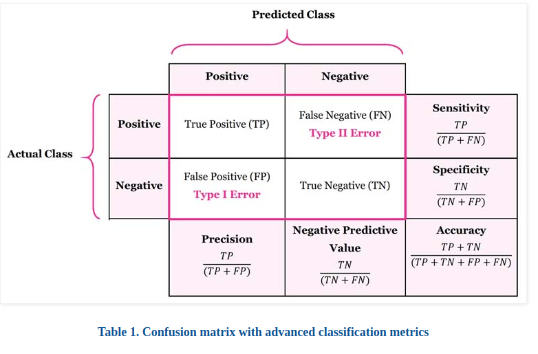

# AIFFEL_6일차 2020.07.30

Tags: AIFFEL_DAILY_OLD

### 일정

- LMS E-2
- 코딩마스터 session2 준비 (문제풀이) : [https://programmers.co.kr/learn/courses/30/parts/12198](https://programmers.co.kr/learn/courses/30/parts/12198)

# [E-2] Iris의 세 가지 품종, 분류해볼 수 있겠어요?

### **학습 목표**

---

- scikit-learn에 내장되어 있는 예제 데이터셋의 종류를 알고 활용할 수 있다.
- scikit-learn에 내장되어 있는 분류 모델들을 학습시키고 예측해 볼 수 있다.
- 모델의 성능을 평가하는 지표의 종류에 대해 이해하고, 활용 및 확인해 볼 수 있다.
- Decision Tree, XGBoost, RandomForest, 로지스틱 회귀 모델을 활용해서 간단하게 학습 및 예측해 볼 수 있다.
- 데이터셋을 사용해서 스스로 분류 기초 실습을 진행할 수 있다.

### scikit-learn

---

사이킷런이라고 부르는 scikit-learn은 파이썬을 기반으로 한 머신러닝 생태계에서 오랜 기간 동안 사랑받고 있는 라이브러리입니다. 최근에는 TensorFlow, PyTorch 등 딥러닝에 특화된 라이브러리들이 강세를 보이고 있지만, 머신러닝의 다양한 알고리즘과 편리한 프레임워크를 제공한다는 점으로 인해 여전히 많은 데이터 분석가들이 사용하고 있습니다.

### pandas

---

pandas 를 들어보셨나요?

판다스라고 불리는 이 라이브러리는 파이썬에서 표 형태로 이루어진 2차원 배열 데이터를 다루는 데에 가장 많이 쓰이는 도구입니다. 표 데이터를 활용해서 데이터 분석을 하기도 하고, 또는 대형 데이터의 여러 통계량을 다루기에도 최적화가 되어있죠.

- 문제지 : 머신러닝 모델에게 입력되는 데이터. **feature**라고 부르기도 한다. 변수 이름으로는 **`X`**를 많이 사용한다.
- 정답지 : 머신러닝 모델이 맞추어야 하는 데이터. **label**, 또는 **target**이라고 부르기도 한다. 변수 이름으로는 **`y`**를 많이 사용한다.

### 지도 vs 비지도

---

머신러닝은 크게

**지도학습 (Supervised Learning)**,**비지도 학습 (Unsupervised Learning)** 이라는 두 가지로 구분됩니다.

간단히 말해서 지도학습은 지도받을 수 있는, 즉 **정답이 있는** 문제에 대해 학습하는 것을 말하고,

반대로 비지도학습은 **정답이 없는** 문제를 학습하는 것을 말합니다.

### 회귀 vs 분류

---

지도학습은 다시 두 가지로 나눌 수 있는데, 바로 **분류(Classification)** 와 **회귀(Regression)** 입니다.

분류는 입력받은 데이터를 특정 카테고리 중 하나로 분류해내는 문제를, 회귀는 입력받은 데이터에 따라 특정 필드의 수치를 맞추는 문제를 말합니다.

우리가 해결하고자 하는 붓꽃 문제는

- 첫 번째, 머신러닝 중 정답이 있고 그 정답을 맞추기 위해 학습하는 **지도 학습(Supervised Learning)**이며,
- 지도학습 중에서는 특정 카테고리 중 주어진 데이터가 어떤 카테고리에 해당하는지를 맞추는 **분류(Classification)** 문제

라고 할 수 있겠습니다.

그러면 여기까지 정리가 되었으니 우리는 무슨 머신러닝 모델을 써야할지 명확해집니다. **지도학습 중에서도 분류를 할 수 있는 모델을 사용하면 되죠.**

## 분류 모델

### Decision Tree

---

출처 : [https://ratsgo.github.io/machine learning/2017/03/26/tree/](https://ratsgo.github.io/machine%20learning/2017/03/26/tree/)

---

전체적으로 보면 나무를 뒤집어놓은 것과 같은 모양입니다. 아시다시피 초기지점은 root node이고 분기가 거듭될 수록 그에 해당하는 데이터의 개수는 줄어듭니다. 각 terminal node에 속하는 데이터의 개수를 합하면 root node의 데이터수와 일치합니다. 바꿔 말하면 terminal node 간 교집합이 없다는 뜻입니다. 한편 terminal node의 개수가 분리된 집합의 개수입니다. 예컨대 위 그림처럼 terminal node가 3개라면 전체 데이터가 3개의 부분집합으로 나눠진 셈입니다.

구분 뒤 각 영역의 순도(homogeneity)가 증가, 불순도(impurity) 혹은 불확실성(uncertainty)이 최대한 감소하도록 하는 방향으로 학습을 진행합니다. 순도가 증가/불확실성이 감소하는 걸 두고 정보이론에서는 정보획득(information gain)이라고 합니다.

불확실성을 측정하는 지표

---

1. 엔트로피 
    - 의사결정나무는 구분 뒤 각 영역의 순도(homogeneity)가 증가/불확실성(엔트로피)가 최대한 감소하도록 하는 방향으로 학습을 진행합니다.
2. 지니 계수
3. 오분류표차 (Misclassification Error)

    오분류오차는 엔트로피나 지니계수와 더불어 불순도를 측정할 수 있긴 하나 나머지 두 지표와 달리 미분이 불가능한 점 때문에 자주 쓰이지는 않는다고 합니다.

모델학습

---

1. 재귀적 분기

    그렇다면 1회 분기를 위해 계산해야 하는 경우의 수는 총 몇 번일까요? 개체가 n개, 변수가 d개라고 할 때 경우의 수는 d(n−1)개가 됩니다. 분기를 하지 않는 경우를 제외하고 모든 개체와 변수를 고려해 보는 것입니다.

2. 가지치기

    모든 terminal node의 순도가 100%인 상태를 Full tree라고 하는데요. 이렇게 Full tree를 생성한 뒤 적절한 수준에서 terminal node를 결합해주어야 합니다. 왜냐하면 분기가 너무 많아서 학습데이터에 과적합(overfitting)할 염려가 생기기 때문입니다. 다만 가지치기는 데이터를 버리는 개념이 아니고 분기를 합치는(merge) 개념으로 이해해야 합니다.

마무리

---

의사결정나무는 계산복잡성 대비 높은 예측 성능을 내는 것으로 정평이 나 있습니다. 아울러 변수 단위로 설명력을 지닌다는 강점을 가지고 있습니다.

다만 의사결정나무는 **결정경계(decision boundary)**가 데이터 축에 수직이어서 특정 데이터에만 잘 작동할 가능성이 높습니다.

이같은 문제를 극복하기 위해 등장한 모델이 바로 [랜덤포레스트](https://ratsgo.github.io/machine%20learning/2017/03/17/treeensemble/)인데요, 같은 데이터에 대해 의사결정나무를 여러 개 만들어 그 결과를 종합해 예측 성능을 높이는 기법입니다.

---

---

네, 간단히 말해 Decision Tree는 의사 결정을 할, 즉 데이터를 분리할 어떤 경계를 찾아내어 데이터를 체에 거르듯 한 단계씩 분류해나가는 모델입니다.

이 과정에서 엔트로피, 정보량, 지니불순도 등의 정보이론 개념이 포함됩니다.

예측한 결과에 대한 수치를 조금 더 편리하게 확인할 수 있는 방법이 있습니다.scikit-learn에서 성능 평가에 대한 함수들이 모여있는 **`sklearn.metrics`** 패키지를 이용하면 되죠.

성능을 평가하는 방법에도 다양한 척도가 있는데, 그 중 일단 **정확도(Accuracy)**를 간단히 확인해 보겠습니다.

```jsx
# (1) 필요한 모듈
from sklearn.datasets import load_iris
from sklearn.model_selection import train_test_split
from sklearn.tree import DecisionTreeClassifier
from sklearn.metrics import classification_report

# (2) 데이터 준비
iris = load_iris()
iris_data = iris.data
iris_label = iris.target

# (3) train, test 데이터 분리
X_train, X_test, y_train, y_test = train_test_split(iris_data, 
                                                    iris_label, 
                                                    test_size=0.2, 
                                                    random_state=7)

# (4) 모델 학습 및 예측
decision_tree = DecisionTreeClassifier(random_state=32)
decision_tree.fit(X_train, y_train)
y_pred = decision_tree.predict(X_test)

print(classification_report(y_test, y_pred))
```

(1)~(4)의 흐름을 잘 기억해주세요.

### Random Forest

---

RandomForest는 Decision Tree 모델을 여러개 합쳐놓음으로써 Decision Tree의 단점을 극복한 모델이라고 소개했죠.

이러한 기법을 **앙상블(Ensemble)** 기법이라고 합니다. 단일 모델을 여러 개 사용하는 방법을 취함으로써 모델 한 개만 사용할 때의 단점을 집단지성으로 극복하는 개념이죠.

---

출처 : [https://medium.com/@deepvalidation/title-3b0e263605de](https://medium.com/@deepvalidation/title-3b0e263605de)

---

이렇게 많은 의사 결정 트리로 ‘숲’을 만들었는데, 의견 통합이 되지 않는다면 어떻게 해야 할까요? 이 역시 현실과 비슷합니다. 의견 통합이 이루어지지 않을 경우 다수결의 원칙을 따르듯이, 저희의 의사 결정 ‘숲'도 투표로 결정을 내리게 됩니다. 1,000개의 의사 결정 트리 중 678개의 트리가 건강 위험도가 높다고 의견을 내고, 나머지는 위험도가 낮다는 의견을 냈을 경우, 숲은 그 의견들을 통합하여 건강 위험도가 높다고 하는 것이죠. 데이터 사이언스에서는 이렇게 의견을 통합하거나 여러가지 결과를 합치는 방식을 “앙상블” (Ensemble method)이라고 합니다.

Q. 무엇이 랜덤인 것인가?

Random Forest는 각**각의 의사 결정 트리를 만드는데 있어 쓰이는 요소들 (흡연 여부, 나이, 등등)을 무작위적으로 선정합니다.** 건강 위험도를 30개의 요소로 설명할 수 있으면, 의사 결정 트리의 한 단계를 생성하면서 모든 요소들을 고려하지 않습니다. 30개 중 무작위로 일부만 선택하여, 그 선택된 일부 중 가장 건강 위험도를 알맞게 예측하는 한 가지 요소가 의사 결정 트리의 한 단계가 됩니다.

---

---

### Soft Vector Machine (SVM)

---

출처 : [https://excelsior-cjh.tistory.com/66?category=918734](https://excelsior-cjh.tistory.com/66?category=918734)

---

Support Vector Machine(SVM)은 원 훈련(또는 학습)데이터를 비선형 매핑(Mapping)을 통해 고차원으로 변환한다. 이 새로운 차원에서 초평면(hyperplane)을 최적으로 분리하는 선형분리를 찾는다. 즉, 최적의 Decision Boundary(의사결정 영역)를 찾는다.

Soft Margin

---

하드마진 방식은 매우 엄격하게 두 개의 클래스를 분리하는 분리초평면을 구하는 방법으로, 모든 입력 투플은 이 초평면을 사이에 두고 무조건 한 클래스에 속해야 한다. 그렇게 되면 몇개의 노이즈로 인해 두 그룹을 구별하는 분리초평면을 잘 못 구할 수도 있고, 경우에 따라서는 찾지 못하는 문제가 발생한다. 따라서, 현실세계에서는 하드마진 방법을 적용하기 힘들다.

이를 해결하기 위해 소프트마진(Soft Margin) 방식이 개발되었다. 소프트 마진 방법은 SVM을 창안했던 러시아 배프니크(Vapnik)가 하드마진 방식의 단점을 극복하고자 코테스(Cortes)와 함께 제안한 방법이다.

---

---

### Stochastic Gradient Descent Classifier (SGDClassifier)

---

출처 : [https://scikit-learn.org/stable/modules/sgd.html](https://scikit-learn.org/stable/modules/sgd.html)

---

he advantages of Stochastic Gradient Descent are:

> Efficiency.Ease of implementation (lots of opportunities for code tuning).

The disadvantages of Stochastic Gradient Descent include:

> SGD requires a number of hyperparameters such as the regularization parameter and the number of iterations.SGD is sensitive to feature scaling.

**Warning**

Make sure you permute (shuffle) your training data before fitting the model or use `shuffle=True` to shuffle after each iteration (used by default). Also, ideally, features should be standardized using e.g. `make_pipeline(StandardScaler(), SGDClassifier())` (see [Pipelines](https://scikit-learn.org/stable/modules/compose.html#combining-estimators)).

The coef_ attribute holds the model parameters:

The intercept_ attribute holds the intercept (aka offset or bias):

---

---

### Logistic Regression

---

출처 : [http://hleecaster.com/ml-logistic-regression-concept/](http://hleecaster.com/ml-logistic-regression-concept/)

---

잠깐, 선형회귀

---

아무튼 결국 선형 회귀 모델의 목표는 모든 데이터로부터 나타나는 오차의 평균을 최소화할 수 있는 최적의 기울기와 절편을 찾는 거다. $y = mx + b$

다시 본론인 로지스틱 회귀로

---

로지스틱 회귀(Logistic Regression)는 회귀를 사용하여 데이터가 어떤 범주에 속할 확률을 0에서 1 사이의 값으로 예측하고 그 확률에 따라 가능성이 더 높은 범주에 속하는 것으로 분류해주는 지도 학습 알고리즘이다.

로지스틱 회귀에서는 데이터가 특정 범주에 속할 확률을 예측하기 위해 아래와 같은 단계를 거친다.

1. 모든 속성(feature)들의 계수(coefficient)와 절편(intercept)을 `0`으로 초기화한다.
2. 각 속성들의 값(value)에 계수(coefficient)를 곱해서 **log-odds**를 구한다.
3. **log-odds**를 **sigmoid 함수**에 넣어서 `[0,1]` 범위의 확률을 구한다.

**로지스틱 회귀**에서도 마찬가지이긴 한데, 마지막에 예측 값 대신 **log-odds**라는 걸 구해줘야 한다는 차이가 있다.

**log-odds**를 어떻게 구하는지 알려면 일단 **odds**부터 계산해야 한다. odds는 아래와 같이 구한다.


사건이 발생할 확률을 발생하지 하지 않을 확률로 나눈 값이 odds다. 그래서 만약 학생이 0.7 확률로 시험에 합격한다면, 당연히 시험에서 떨어질 확률은 0.3이 되니까 이렇게 계산할 수 있겠다.


이렇게 구한 odds에 log를 취한 것이 바로 **log-odds**다. 일단 개념은 쉽다.


그런데 로지스틱 회귀에서는 아래와 같이 여러 속성(feature)들에 계수(coefficient)를 곱하고 절편(intercept)을 더해서 최종 값 log-odds를 구해야 하기 때문에 좀 까다롭다.


그래서 여기서는 (‘내적’ 혹은 ‘점곱’이라고 부르는) **dot product** 방식으로 log-odds를 구한다.

일단 각 속성(feature)들의 값이 포함된 행렬, 그 속성들 각각의 계수(coefficient)가 포함된 행렬을 아래와 같이 계산할 수 있다.


연산은 파이썬 numpy의 `np.dot()`으로 쉽게 처리할 수 있다.

log_odds = np.dot**(**features, coefficients**)** + intercept

그리고, 이렇게 구한 log_odds 값을 sigmoid 함수에 넣어서 0과 1 사이의 값으로 변환을 해주는 것이다!

아무튼 **모델의 “적합성”을 평가하기 위해 각 데이터 샘플의 손실(모델 예측이 얼마나 잘못되었는지)을 계산한 다음 그것들의 평균화 해야 한다.**

**로지스틱 회귀에 대한 손실 함수는 Log Loss(로그 손실)**라고 부르며, 아래와 같이 구할 수 있다.


- `m`:데이터 총 개수
- `y_i`: 데이터 샘플 `i`의 분류
- `z_i`: 데이터 샘플 `i`의 log-odd
- `h(z_i)`: 데이터 샘플 `i`의 log-odd의 sigmoid (즉, 데이터 샘플 `i`가 분류에 속할 확률)

어쨌거나 로지스틱 회귀 모델의 목표는 로지스틱 함수를 구성하는 계수와 절편에 대해 Log Loss(로그 손실)을 최소화하는 값을 찾는 것이라고 이해하자.


정확한 예측은 손실이 거의 없는 반면 잘못된 예측은 거의 무한대에 가까운 큰 손실을 초래하는 꼴이다. (뭐 당연한 거다. 시험 공부 거의 안 한 학생이 시험에 붙을 확률은 0에 가까우니까.)

아무튼 이렇게 예측이 잘못되면서 손실이 점진적으로 증가하는 꼴을 줄이고, 올바른 예측을 하면서 손실이 작아지는 모델에 가까워지도록 하는 게 우리의 목표가 될 거다. 그래서 선형 회귀와 마찬가지로 **경사하강법(Gradient Descent)을 사용하여 모든 데이터에서 로그 손실(Log Loss)을 최소화하는 계수를 찾을 수 있다.**

Classification Threshold (임계값)

---

특정 값 이상의 확률을 도출하면, 해당 클래스에 속한다 ( 1의 값을 출력한다 ) 고 판단하는 과정을 거친다고 위에서 설명하였음.

그 특정 값이 임계값임. 임계값을 낮게 설정하면, 모델이 더 민감하게 결과에 반응할 수 있도록 하는 것.

---

---

## 성능 평가

---

하지만, 사실 머신러닝에서는 모델을 학습시키는 것뿐만 아니라 그 성능을 정확히 평가하고 개선하는 것이 매우 중요합니다.

위에서 **정확도**라는 척도를 통해 모델의 성능을 확인했던 것, 기억하시나요?

모델의 성능을 평가하는 데에는 정확도뿐만 아니라 다른 척도들이 존재합니다.

### 정확도의 함정

---

다만, 이번에는 **정확도의 함정**을 확인하기 위한 실험이었기 때문에 약간의 장치를 넣어볼 것입니다.

바로, 숫자 10개를 모두 분류하는 것이 아니라, 해당 이미지 데이터가 **3인지 아닌지**를 맞추는 문제로 변형해서 풀어보는 것입니다.

즉, 입력된 데이터가 3이라면 3을, 3이 아닌 다른 숫자라면 0을 출력하도록 하는 모델을 생각해 보겠습니다.

우리는 총 10개의 숫자 중 3에만 집중을 해서, 3이라면 3으로, 3이 아니라면 0으로 맞추는 문제로 변형했었죠.

그런 이유로, 정답 데이터인 label은 0이 굉장히 많고 3은 적은 불균형 데이터가 되었습니다.

9개의 숫자들은 label이 모두 0이 되었고, 3만 3으로 남아있었으니 대략 90%의 label이 모두 0이라는 이야기가 되죠.

⇒ 모델이 전혀 학습하지 않고 정답을 모두 0으로만 선택해도 정확도가 90%가량이 나오게 된다는 것입니다.

한 번 더 예시

---

어떠한 모델을 사용하지 않고 답을 0으로만 찍었을 뿐인데, 정확도가 92.5%가 나옵니다.**이러한 문제는 불균형한 데이터, unbalanced 데이터에서 많이 발생할 수 있습니다.**

즉, 정확도는 **정답의 분포에 따라 모델의 성능을 잘 평가하지 못하는 척도가 될 수 있는 것이죠.**

그렇기 때문에 분류 문제에서는 **정확도 외에 다양한 평가 척도**를 사용합니다. 무엇이 있는지 알아보도록 하겠습니다.

### 정답과 오답에도 종류가 있다

---

예를 들어, 코로나 바이러스가 의심되는 환자를 진단하는 경우, 실제 코로나에 걸리지 않았는데 걸린 것으로 오진을 하면 그래도 환자에게는 다행인 일입니다.하지만 실제 코로나에 걸렸는데 걸리지 않았다고 오진을 하는 경우는 환자에게 치명적인 상황이 될 것입니다.이렇듯 같은 오진이라도 양성을 잡아내는 데에 실패하는 오진과, 음성을 잡아내는 데에 실패하는 오진은 그 중요도가 다를 수 있습니다.

이러한 정답과 오답을 구분하여 표현하는 방법을 **오차행렬(confusion matrix)** 이라고 합니다.

오차행렬

---

출처 : [https://manisha-sirsat.blogspot.com/2019/04/confusion-matrix.html](https://manisha-sirsat.blogspot.com/2019/04/confusion-matrix.html)

---



TP: 정답을 정답으로 잘 예측한 것

FN : 정답이지만 오답으로 예측한 것 ⇒ 양성을 놓친 경우 ⇒ 암환자를 걸러내는 경우라면, 이 값이 낮아지도록 해야한다

FP: 오답이지만 정답으로 예측한 것 ⇒ 음성을 놓친 경우 ⇒ 스팸 메일을 걸러내는 경우라면 (스팸이 정답), 이 값이 낮아지도록 해야한다

TN : 오답을 오답으로 잘 예측한 것

Sensitivity == Recall ( $TP / (TP+FN)$ )

---

Sensitivity is also referred as True Positive Rate or Recall. It is measure of positive examples labeled as positive by classifier. It should be higher. For instance, proportion of emails which are spam among all spam emails.

진짜 정답을 정답이라고 맞출 확률 ( 진짜 스팸 메일 중 스팸 메일로 분류,예측한 메일의 비율 )

Specificity 

---

Specificity is also know as True Negative Rate. It is measure of negative examples labeled as negative by classifier. There should be high specificity. For instance, proportion of emails which are non-spam among all non-spam emails.

진짜 오답을 오답이라고 맞출 확률 ( 정상 메일 중 정상 메일로 분류,예측한 메일의 비율 )

Precision

---

Precision is ratio of total number of correctly classified positive examples and the total number of predicted positive examples. It shows correctness achieved in positive prediction.

정답으로 예측한 것 중 진짜 정답일 확률 ( 스팸 메일로 분류,예측한 메일 중 진짜 스팸 메일의 비율 )

Accuracy

---

Accuracy is the proportion of the total number of predictions that are correct.

정답, 오답 합쳐서 정확하게 맞출 확률 ( 전체 예측 중 제대로 예측한 비율 : 스팸을 스팸 메일로, 정상을 정상 메일로 분류한 비율 )

F1 Score

---

F1 score is a weighted average of the recall (sensitivity) and precision. F1 score might be good choice when you seek to balance between Precision and Recall.

$2 *(Precision*Recall)/(Precision + Recall)$

---

---

scikit-learn 에서의 precision,recall 설명

출처 : [https://scikit-learn.org/stable/modules/generated/sklearn.metrics.precision_recall_curve.html#sklearn.metrics.precision_recall_curve](https://scikit-learn.org/stable/modules/generated/sklearn.metrics.precision_recall_curve.html#sklearn.metrics.precision_recall_curve)

---

The precision is the ratio `tp / (tp + fp)` where `tp` is the number of true positives and `fp` the number of false positives. 

***The precision is intuitively the ability of the classifier not to label as positive a sample that is negative.***

⇒ 얼마나 정답을 정확히 예측을 하느냐 ( 신중함의 문제 : 얼마나 날카로운 바늘인가 , 오답 경우를 정답이라고 하지 않아야 한다, 스팸 메일의 경우를 생각 )

The recall is the ratio `tp / (tp + fn)` where `tp` is the number of true positives and `fn` the number of false negatives.

***The recall is intuitively the ability of the classifier to find all the positive samples.***

⇒ 얼마나 정답을 잘 찾아내느냐 ( 꼼꼼함의 문제 : 얼마나 촘촘한 그물인가 , 정답인 경우를 얼마나 하나라도 놓치지 않느냐 , 암 진단의 경우를 생각 )

---

Sensitivity보다는 Recall이라는 용어가 더 보편적이니, 우리도 Recall이라고 부르겠습니다.

모델의 성능은 정확도만으로 평가하면 안된다는 것을요! 특히, **label이 불균형하게 분포되어있는 데이터**를 다룰 때에는 더 조심해야 합니다.

Precision과 Recall이 각각 언제 중요해지는지를 이해하고, 때에 맞는 성능지표로 모델을 평가하시길 바랍니다!

## 실습

[bluecandle/2020_AIFFEL](https://github.com/bluecandle/2020_AIFFEL/blob/master/daily_notes/codes/e2_code/E-2.ipynb)

---

---

# 코딩마스터 Session2 준비 (문제풀이) : [https://programmers.co.kr/learn/courses/30/parts/12198](https://programmers.co.kr/learn/courses/30/parts/12198)

- K번째수