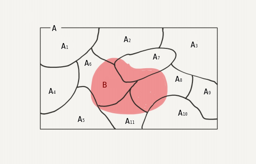

# AIFFEL_22일차 2020.08.24

Tags: AIFFEL_DAILY

비대면 전환

### 일정

---

1. 풀잎스쿨 코딩마스터 Queue, Stack
2. LMS F-19
3. LMS F-20

### 풀잎스쿨 코딩마스터 Queue, Stack

---

list 는 pop(0) 를 쓰면 길이만큼의 시간복잡도가 소요된다! 오호...

근데, 그래서 deque 썼는데도 시간이 많이 걸리는건 똑같은 상황... (문제 3번)

다음 세션은 Heap 으로 하겠습니다! 개념 정리 및 문제풀이 해주세요.

# [F-19] 확률과 확률분포

---

### **학습 목표**

---

- **확률**의 개념과 기본 법칙을 이해한다.
- **조건부 확률**과 **독립**의 의미를 이해한다.
- 대표적인 확률 분포인 **이항 분포**와 **정규 분포**에 대해 이해한다.

### 시행

---

예를 들어서 주사위 던지기를 '**시행'**이라고 할 수 있을까요?

1. 만약 바람의 세기, 주사위를 던지는 각도와 속도, 주사위가 닿는 바닥의 기울기 등등 모든 초기 환경을 동일하게 여러번 던질 수 있다면 "같은 조건하에서 여러번 반복할 수 있는" 실험이라 할 수 있습니다.
2. 던졌을 때 어떤 숫자가 나올지 미리 알 수 없으므로 "결과를 알 수 없는" 실험입니다.
3. 하지만 최소한 1,2,3,4,5,6 중에 하나가 반드시 나온다는 것을 "미리 알고 있는" 실험이므로, "일어날 가능성이 있는 모든 결과를 사전에 알 수 있는" 실험입니다.

따라서 위의 1,2,3을 만족하는 주사위 실험은 '시행'이라고 할 수 있습니다.

### 표본 공간

---

$\Omega = \{ w_1, w_2, \dots, w_n \}$

이산 표본 공간 : 원소의 갯수가 유한개

연속 표본 공간 : 원소의 갯수가 무한개

확률 정의 세 가지

1. 공리적 정의
2. 상대 도수 정의
3. 고전적 정의

- **서로소 집합(disjoint set)**

A∩B=∅

두 집합 A와 B가 서로 공통인 원소를 가지고 있지 않을 때 A와 B는 **서로소 (disjoint)** 혹은 **서로 배타적인 (mutually exclusive)** 집합이라고 합니다.

### 확률 곱셈정리

---

$P(A \cap B) = P(B|A)P(A ) = P(A | B)P(B)$

### 조건부확률

---

확률이 0이 아닌 두 사건 A와 B에 대하여 사건A 가 일어났을 때, 사건 B가 일어날 확률을 사건 A

가 일어났을 때의 사건 B의**조건부확률(conditional probability)**이라고 한다.

$P(B|A) = \frac{P(B \cap A)}{P(A)}$

### 전확률(total probability)



전확률정리

$P(B) = \sum_{i=1}^n P(B \cap A_i) = \sum_{i=1}^n P(B|A_i)P(A_i)$

### 베이즈정리

---

1. 사건 B를 조건으로 하는 임의의 사건 $A_i$ 의 조건부 확률

$P(A_i|B) = \frac{P(A_i \cap B)}{P(B)}$

2. P(B)에 전확률 정리 도입

$\frac{P(A_i \cap B)}{P(B)} = \frac{P(A_i \cap B)}{\sum_{k=1}^n P(B|A_k)P(A_k)}$

3. 확률 곱셈정리 이용하여 분자 치환

$P(A_i|B) =  \frac{P(B|A_i)P(A_i)}{\sum_{k=1}^n P(B|A_k)P(A_k)}$

⇒ 이게 베이즈 정리!

사건 B가 일어났을 때 사건 $A_i$ 가 일어날 확률

사건 B의 확률을 알고 있을 경우, 간단히

$P(A_i|B) =  \frac{P(B|A_i)P(A_i)}{P(B)}$

이렇게 정리하기도 함.

### 독립

---

두 사건 A,B에 대해서 한 사건이 다른 하나의 사건에 영향을 주지 않을 때.

 $P(A|B)=P(A)$

사건 B에 의해 사건 A가 영향을 받지 않으므로!

그리고 위의 식과 확률의 곱셈정리를 통해

*곱셈 정리 = $P(A∩B)=P(A|B)P(B)$

사건 A,B가 독립일 경우 $P(A∩B)=P(A)P(B)$

그래서, 다수의 사건들이 있다고 가정하면 아래 식이 성립함.

$P(A_i \cap A_j \cap \cdots \cap A_n) = P(A_i)P(A_j) \cdots P(A_n), \text{ where } 1 \leq i < j < \cdots \leq n$

### 상호 배타적 vs 독립

---

- 상호 배타적 사건 : 시행의 모든 시도에서 A 혹은 B사건이 발생했을 때 다른 하나의 사건이 발생하지 않을 경우 A와 B는 **서로 배타적(mutually exclusive)**입니다.
- 독립 사건 : 두 사건 A, B에 대해서 한 사건이 다른 하나의 사건에 영향을 주지 않을 때 **'**A 와 B는 **독립(independent)**이다**'** 라고 합니다.

[ex] 동전 던지기는 독립인가?

---

우리는 동전 하나를 '한번씩 던지는 실험'을 하고있습니다.

즉, 두 사건이 독립임을 알아보기 위해서 우리는 '동전 하나를 던졌을 때 뒷면이 나오는 조건하에 앞면이 나오는 경우'을 보아야 하는 것입니다.

그럼 뒷면이면서 앞면인 경우가 있을까요? 없습니다! '동전 하나를 던졌을 때 뒷면이 나오는 조건'이 붙었기 때문에 동전 던지기를 했을 때 동전은 뒷면이 나와 있어야 하며, 이 경우에 앞면이 나올 경우는 없어()집니다.

즉, A의 사건이 B사건에 영향을 받아 나올 수 없는 경우가 되었기에 A와 B는 종속 사건입니다.

---

⇒ 수식으로 살펴보자

$P(A) = 1/2, P(B) = 1/2$ 이며, $P(A|B) = 0$

$P(A|B) \neq P(A)$ 이며, $P(A \cap B) = 0 \neq 1/4 = P(A)P(B)$

이므로, 독립이 아니기 때문에 A와 B 는 종속사건이다.

## 확률변수

---


표본 공간의 한 표본 점 : w

w를 하나의 실수에 대응시키는 것.

**대응시켜주는 '함수'**를 '확률변수'라고 부른다. $X(w)$

즉, 확률 변수는 w∈Ω 를 실수 직선(real line)상의 하나의 값으로 맵핑(혹은 대응)해주는 함수입니다. (쉽게 말해 w를 하나의 **실수**로 바꿔주는 역할 입니다.)


$A_x = \{w|X(w) = x\} = \{X=x\}$

- X(w)는 '확률 변수'라는 함수이며, w라는 표본 공간의 한 표본점(시행을 통해 얻을 수 있는 경우 중 하나)을 실수 직선으로 맵핑해줍니다.
- x는 w라는 표본점이 확률 변수 X에 의해 대응된 하나의 실수 입니다.

### 확률 질량 함수(probability mass function, PMF)

---

$p_X(x) = P(X=x), \text{ 여기서 } \sum_{x=-\infty}^\infty p_X(x) = 1$


이산 누적분포함수와 확률질량함수

### 확률 밀도함수 ( PDF, Probability Density Function )

---


PMF와 PDF

### 기댓값

---

$E[X] =\begin{cases}
\sum_k x_k p_X(x_k),  & \text{이산 확률 변수 X}
\\
\int_{-\infty}^\infty xf_X(x)dx, & \text{연속 확률 변수 X}\end{cases}$

### 분산

---

$\sigma_X^2 = E[(X-m)^2] =\begin{cases}
\sum_k (x_k-m)^2 p_X(x_k),  & \text{이산 확률 변수 X} \\
\int_{-\infty}^\infty (x-m)^2 f_X(x)dx, & \text{연속 확률 변수 X}\end{cases}$

기댓값 E[X] = m 이라고 할때

$\begin{aligned}
\sigma_X^2 & = E[(X-m)^2] = E[X^2 - 2Xm + m^2] = E[X^2] - 2mE[X] + m^2 \\
& = E[X^2] - 2m^2 + m^2 = E[X^2]-m^2 \\
& = E[X^2] -(E[X])^2\end{aligned}$

제곱근 씌우면 표준편차

### 조건부 기댓값

---

$E[X|A] =\begin{cases}
\sum_k x_k p_{X|A}(x_k|A),  & \text{이산 확률 변수 X} \\
\int_{-\infty}^\infty xf_{X|A}(x|A)dx, & \text{연속 확률 변수 X}\end{cases}$

### 베르누이 시도와 베르누이 분포

---

**베르누이 시도(Bernoulli trial) :** 결과가 성공 혹은 실패 두가지로만 나오는 실험

### 이항분포

---

독립적으로 n 번의 베르누이 시도를 했고, 그 중 성공한 수를 X(n)로 표현할 때, 이 X(n)을

**이항 확률 변수(binomial random variable)** 라고 합니다.

X(n)∼B(n,p) 라는 표현은 X(n)은 파라미터 n과 p에 의한 이항 분포를 띄는 이항 확률 변수 X(n) 이라는 뜻입니다.

이항분포의 기댓값

$E[X(n)]=np$

이항분포의 분산

$\sigma_{X(n)}^2 = E[X^2(n)] - (E[X(n)])^2 = n(n-1)p^2 + np - n^2p^2 = np(1-p)$

$\begin{aligned}
P\{X(3) \geq 2\} & = P\{X(3) = 2\} + P\{X(3) = 3\} = \binom{3}{2}(4/5)^2 (1/5)^1 + \binom{3}{3}(4/5)^3 (1/5)^0 \\
& = \frac{112}{125}
\end{aligned}$

$3c2 * 16/125 + 3c3 * 64/125$

### 정규분포

---

X ~ $N(\mu x,\sigma^2_X)$ 라는 표현은 X는 파라미터 $\mu_X$와 $\sigma_X^2$에 의한 정규 분포를 띄는 확률 변수라는 의미입니다.

# [F-20] SQL을 이용해 DB와 대화해보자

---

### **학습 목표**

---

1. 기본적인 SQL문을 공부해 본다.
2. 파이썬을 통해 DB를 연결하여 SQL 질의를 시도해 본다.

### connection, cursor, db browser

---

INSERT처럼 DB에만 적용되는 명령어를 사용한다면 Cursor를 안 사용할 수 있지만 SELECT와 같이 데이터를 불러올 때는 SQL 질의 수행 결과에 접근하기 위한 Cursor가 반드시 필요합니다. 이러한 이유로 습관적으로 conn.cursor()를 사용하는 것을 권해 드립니다.

우리는 sqlite3를 이용해 데이터베이스에 connection을 하나 맺었습니다.

이후 해당 connection을 통해 인서트된 데이터는 conn.commit()를 호출하기 전까지는 그 connection 안에서만 유효합니다. 그래서 sqlite3에서는 SELECT가 되었지만, DB Browser 안에서는 조회되지 않는 것입니다.

### 트랜잭션

---

[https://sjh836.tistory.com/11](https://sjh836.tistory.com/11)

- 원자성(Atomicity): 트랜잭션에 속한 작업들이 모두 수행되었는지 아니면 모두 실행이 안되었는지를 보장하는 능력이다. 즉, 중간 단계까지 실행되고 실패하는 일은 없도록 하는 것이다.
- 일관성(Consistency)은 트랜잭션이 실행을 성공적으로 완료하면 언제나 일관성 있는 데이터베이스 상태로 유지하는 것을 의미한다.
- 고립성(Isolation)은 트랜잭션을 수행 시 다른 트랜잭션의 연산 작업이 끼어들지 못하도록 보장하는 것을 의미한다.
- 지속성(Durability)은 성공적으로 수행된 트랜잭션은 영원히 반영되어야 함을 의미한다.

---

### DDL

---

```python
INSERT INTO 도서명 VALES (?, ?)
```

⇒각 테이블의 변수(도서ID, 도서명)에 [2]번에서 입력한 데이터(data)를 넣겠다는 뜻입니다. 이렇게 **?를 사용해서 데이터를 쿼리에 바인딩하는 기법**을 매우 흔히 사용하니 잘 알아둡시다.


### DISTINCT vs GROUP BY


'기준 별로 중복없이 집계를 하고 싶다!'라고 할 때에는 집계함수와 더불어 DISTINCT, GROUP BY를 모두 활용해야 한답니다.


### 데이터 타입

---


문자형의 특정 부분을 떼어 내는 함수는 LEFT, RIGHT, SUBSTRING를 사용하면 된답니다.


SELECT ID, 이름, 대출년월

, AVG(CAST(SUBSTR(대출일수, 1, (length(대출일수)-1)) AS INT)) AS 대출일수_평균
FROM 도서대출내역2
GROUP BY 1,2,3;

집계함수 등을 사용할 때는 GROUP BY를 사용해 주는 것을 유념해 주세요. 또한 GROUP BY 이후에는 컬럼명 또는 숫자를 적어주면 됩니다.

```python
SELECT * FROM 도서대출내역2 
WHERE 이름 LIKE "문%" ;
WHERE 이름 LIKE "%문%" ;
WHERE 이름 LIKE "%문" ;
```

```python
SELECT *
, CAST(SUBSTR(대출일수, 1, (length(대출일수)-1)) AS INT) AS 대출일수_수정 
FROM 도서대출내역2 
WHERE 
        대출일수_수정 > 5 ;
```

⇒ '대출일수_수정' 이라는 컬럼을 만들고, 대출일수가 5일을 초과하는 사람들의 정보를 가져온다.

## JOIN

---


[출처 : [https://www.dofactory.com/sql/join](https://www.dofactory.com/sql/join)]

구조를 파악하셨으면 JOIN에서 제일 중요한 'KEY'를 포착하셔야 합니다. 대체 'KEY'가 무엇일까요? 'KEY'는 JOIN을 수행할 때 두 테이블을 연결할 수 있는 중요한 다리 역할을 하는 컬럼입니다.

JOIN 기본 구문

```sql
SELECT 컬럼1, 컬럼2, 컬럼3... FROM A테이블 AS A
{INNER/LEFT/RIGHT/FULL OUTER} JOIN B테이블 AS B 
ON A.결합컬럼 = B.결합컬럼
WHERE ~
```

```sql
SELECT A.*, B.도서명 
FROM 대출내역 AS A 
LEFT JOIN 도서명 AS B
ON A.도서ID = B.도서ID
```

### Nested Query

---

```sql
SELECT C.이름, COUNT(*) 대출건수
FROM (
    SELECT A.*, B.도서명 
    FROM 대출내역 AS A 
    LEFT JOIN 도서명 AS B
    ON A.도서ID = B.도서ID ) C
GROUP BY C.이름
```

A 테이블을 기준으로 LEFT JOIN 을 도서ID 컬럼을 KEY로 하여 진행하여 나온 결과 C로부터 다시 쿼리를 수행하는 형태 

### IFNULL

---

```sql
SELECT A.*, IFNULL(B.도서명, '도서명미상') AS 도서명
    FROM 대출내역 AS A 
    LEFT JOIN 도서명 AS B
    ON A.도서ID = B.도서ID
```

⇒ NULL 대신 다른 값으로 바꾸어 출력하고 싶을 때

sqllite 에서는 IFNULL 이라는 이름으로 제공하는 유틸함수임! 다른 DB에서는 다른 이름으로 제공할 수 있으니, 대충 이런거 있다는거 알아두고 쓰면된다 ㅇㅇ

### CASE

---

```sql
SELECT 이름,
CASE WHEN 대출일수_수정 > 5 THEN '기간초과' ELSE '기간내' END AS 대출기간
FROM (
SELECT *, CAST(SUBSTR(대출일수, 1, (length(대출일수)-1)) AS INT) AS 대출일수_수정 
FROM 도서대출내역2 )
```

⇒ IF문처럼 조건에 따라 다양한 출력이 가능하도록 해주는 함수.

LEFT JOIN 하여 도서ID, 도서명 대출건수, 대출상태 항목을 출력하는 쿼리.

```sql
SELECT C.도서ID, C.도서명, SUM(C.대출건수) AS 대출건수, 
 CASE SUM(C.대출건수)-SUM(C.반납건수) WHEN 0 THEN '보관중' ELSE '대출중' END AS 대출상태
FROM (
    SELECT A.도서ID, A.도서명, 
     CASE WHEN B.대출일 IS NULL THEN 0 ELSE 1 END AS 대출건수,
     CASE WHEN B.반납일 IS NULL THEN 0 ELSE 1 END AS 반납건수
    FROM 도서명 AS A 
    LEFT JOIN 도서대출내역 AS B
    ON A.도서ID = B.도서ID ) AS C
GROUP BY C.도서ID, C.도서명 ;
```

⇒ Subquery 안에서 SELECT 다음에 CASE 문을 사용하여 도서대출내역 테이블에 있는 값에 따른 대출건수, 반납건수 컬럼 설정 부분 !

⇒ 최 상단 SELECT 문 다음에 하단 subquery로 인해 생긴 C 테이블에서 대출건수, 반납건수 컬럼 값을 이용하여 대출상태 컬럼 만들어내기.