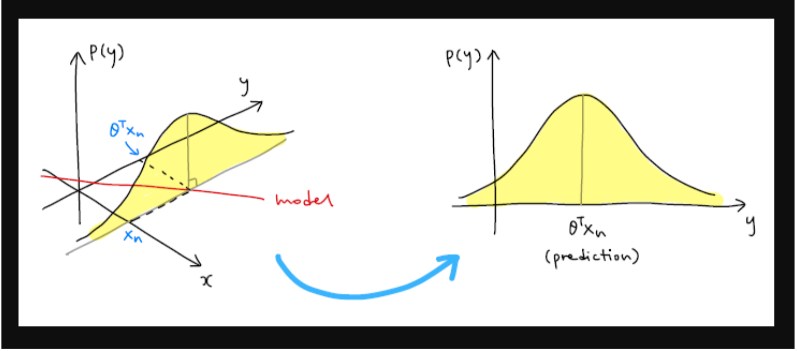
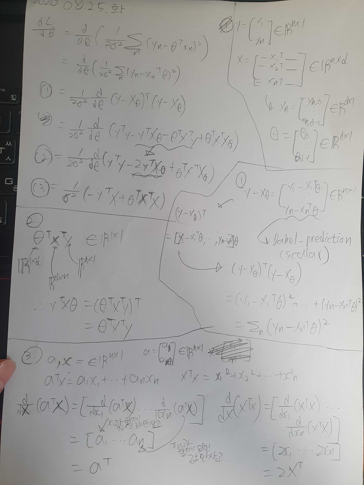

# AIFFEL_23일차 2020.08.25

Tags: AIFFEL_DAILY

### 일정

---

1. LMS F-21
2. LMS F-22
3. 코딩마스터 Session 5 준비 (프로그래머스 코딩테스트 연습 Heap 풀기)

# [F-21] Likelihood (MLE와 MAP)

---

모델이 표현하는 확률 분포를 데이터의 실제 분포에 가깝게 만드는 최적의 파라미터 값을 찾는 것이 머신러닝의 목표라고 할 수 있습니다.

### 베이지안 머신러닝

---

모델 파라미터를 고정된 값이 아닌 불확실성(uncertainty)을 가진 확률 변수로 보는 것, 데이터를 관찰하면서 업데이트되는 값으로 보는 것은 베이지안 머신러닝의 핵심 아이디어

## 사전 확률, 가능도(우도), 사후 확률 (prior, likelihood, posterior)

---

### 사전 확률

---

데이터를 관찰하기 전 파라미터 공간에 주어진 확률 분포

### 가능도( 우도 )

---

 사전 확률 분포를 고정시킨다면, 주어진 파라미터 분포에 대해서 우리가 갖고 있는 데이터가 얼마나 '그럴듯한지'계산하여 나타낸 값.

$p(X=x|\mathbf{\theta})$

⇒ 파라미터의 분포 $p(\mathbf{\theta})$ 가 정해졌을 때 x라는 특정 데이터가 관찰될 확률.

likelihood가 θ에 의해 결정되는 함수라는 것을 강조하기 위해서 가능도 함수를 $\mathcal{L}(\mathbf{\theta}|x)$ 로 표기하기도 합니다.

likelihood가 높다는 것은 지정한 파라미터 조건에서 데이터가 관찰될 확률이 높다는 것. 데이터의 분포를 모델이 잘 표현하는 것.

### MLE ( maximum likelihood estimation, 최대가능도 추정 )

---

그리고 데이터들의 likelihood 값을 최대화하는 방향으로 모델을 학습시키는 방법을 최대가능도 추정(maximum likelihood estimation, MLE) 라고 함.

### Posterior ( 사후확률 )

---

데이터를 관찰한 후 계산되는 확률. 생각해보면 이게 필요한 값임! 근데, 데이터 포인트의 개수가 유한하기 때문에 데이터가 따르는 확률 분포 p(x)는 정확히 알 수 없음.

애초에 머신러닝의 목표가 p(X)를 직접 구할 수가 없으니까 모델 파라미터 $\theta$ 를 조절해가며 간접적으로 근사하는 것.

⇒ 그래서, posterior를 직접 계산하지 않고 prior 와 likelihood에 관한 식으로 변형한 다음, 그 식을 최대화하는 파라미터 $\theta$ 를 찾는다.

### MAP (Maximum A posterior estimation, 최대 사후 확률 추정)

---

posterior를 최대화하는 방향으로 모델을 학습시키는 방법

### posterior와 prior, likelihood 사이의 관계

---

 $p(X,\mathbf{\theta})=p(\mathbf{\theta}|X)p(X)=p(X|\mathbf{\theta})p(\mathbf{\theta})$

⇒ 확률 곱셈정리에 의해 표현한 것.

양변을 $p(X)$ 로 나눠주면

$p(\mathbf{\theta}|X)=\frac{p(X|\mathbf{\theta})p(\mathbf{\theta})}{p(X)}$

$\left(\textrm{posterior}=\frac{\textrm{likelihood} \times \textrm{prior}}{\textrm{evidence}},\textrm{posterior}\propto\textrm{likelihood} \times \textrm{prior}\right)$

 

*데이터가 따르는 정확한 확률분포 p(X)를 알 수 없어서, posterior p(θ|X)의 값도 직접 구할 수 없다는 이야기를 했습니다. 우변의 식에서도 p(X)로 나누는 부분이 있기 때문에 이 식으로도 값을 계산할 수는 없습니다. 다만 여기에서 p(X)는 고정된 값이고 (데이터가 바뀌지는 않으니) likelihood와 prior는 계산이 가능하기 때문에 우변을 최대화하는 파라미터 값은 구할 수 있는 것입니다.*

### likelihood와 머신러닝

---

입력 데이터의 집합을 X, 라벨들의 집합을 Y라고 할때, likelihood는 파라미터와 입력 데이터가 주어졌을 때 출력값(라벨)의 확률 분포, 즉 $p(Y|\mathbf{\theta}, X)$ 가 됩니다.

⇒ $\theta$ 와  X의 교집합의 조건 하에 y가 나올 확률이라 이해하시면 됩니다.교집합 기호를 ,(comma)  로 많이 씁니다.

데이터셋 전체의 likelihood 대신 데이터 하나의 likelihood $p(y_n|\mathbf{\theta}, \mathbf{x}_n)$ 를 생각해보자.

출력값의 분포는? 모델을 선형 모델 $y=\mathbf{\theta}^\top\mathbf{x}$ 로 잡았을 때, 출력값의 분포는 모델의 예측값 $\mathbf{\theta}^\top\mathbf{x}_n$ 에다가 노이즈의 분포를 더한 값이 된다.

노이즈 분포를 평균이 0이고 표준편차가 $\sigma$ 인 정규분포로 가정한다면, 출력값의 분포는 평균이 $\mathbf{\theta}^\top\mathbf{x}_n$ 이고 표준편차가 $\sigma$ 인 정규분포가 된다.

$p(y_n|\mathbf{\theta}, \mathbf{x}_n) = \mathcal{N}(y_n|\mathbf{\theta}^\top\mathbf{x}_n, \sigma^2) = \frac{1}{\sqrt{2\pi\sigma^2}}\exp\left({-\frac{(y_n-\mathbf{\theta}^\top\mathbf{x}_n)^2}{2\sigma^2}}\right)$



### likelihood 감 잡기

---

데이터 포인트가 모델 함수에서 멀어질수록 데이터의 likelihood는 기하급수적으로 감소한다.

```python
likelihood
= 1/(math.sqrt(2*math.pi*0.1*0.1))*math.exp(-pow(y-output,2)/(2*0.1*0.1))
```

⇒ 모델 예측값과 데이터 라벨의 차이를 제곱 ( y- output) 해서 exponential 위에 올려놓음.

⇒ 예측값과 라벨의 차이가 조금만 벌어져도 likelihood 값은 민감하게 반응.

***⇒ 머신러닝의 목표가 데이터 포인트들을 최대한 잘 표현하는 모델을 찾는 것이었다는 사실을 생각하면, 결국 데이터 포인트들의 likelihood 값을 크게 하는 모델을 찾는 것이 된다.***

*그리고, 데이터의 likelihood 값을 최대화하는 모델 파라미터를 찾는 방법이 최대 가능도 추론(MLE)* 

## MLE: 최대 가능도 추론

---

좋은 머신러닝 모델은 하나의 데이터에 대해서만 likelihood가 큰 모델이 아니라, 데이터셋에 있는 모든 데이터 포인트의 likelihood 값을 크게 만드는 모델입니다.

Q. 그렇다면, 데이터셋 전체의 likelihood는 어떻게 구하는가?

### i.i.d ( independent and identically distributed )

---

우리가 가지고 있는 데이터 포인트 (x1,y1),…,(xn,yn) 은 서로 독립이고(independent) 같은 확률 분포를 따른다고(identically distributed) 가정합니다. 이 조건을 independent and identically distributed, 줄여서 i.i.d.라고 부르는데, 머신러닝 문제에서 꼭 필요한 전제조건입니다.

데이터 포인트들이 서로 독립이므로 데이터셋 전체의 likelihood $p(Y|\mathbf{\theta}, X)$ 는 데이터 포인트 각각의 likelihood를 모두 곱한 값과 같다. ( Product! not sigma )

$p(Y|\mathbf{\theta}, X) = \prod_n p(y_n|\mathbf{\theta}, \mathbf{x}_n)$

MLE 를 실제로 적용할 때는 likelihood 대신 log likelihood를 최대화하는 파라미터를 구한다.

⇒ 데이터셋의 likelihood가 데이터 포인트 각각의 likelihood를 곱한 형태인데, 로그를 씌우면 곱셈 연산이 덧셈 연산으로 바뀌면서 미분 계산이 편리해짐!

⇒ 변환으로 인한 영향? nono! 로그 함수는 단조 증가하므로 likelihood를 최대화하는 파라미터와 log likelihood를 최대화하는 파라미터 값이 같아서 학습 결과에 영향을 주지 않는다.

⇒  그리고.. 구현 측면에서 보았을 때, likelihood 값은 0에 가까운 수로 많이 계산됨. 이렇게 계산된 수들을 곱하다보면 CPU가 계산할 수 있는 범위를 넘어서는 언더플로우 발생 가능성! 이 또한 log 를 씌워서 예방 가능.


$\log p(Y|\mathbf{\theta}, X) = \log \prod_n p(y_n|\mathbf{\theta}, \mathbf{x}_n) = \sum_n \log p(y_n|\mathbf{\theta}, \mathbf{x}_n)$

⇒ 모두 곱해서 log 를 씌운 값과 모든 값을 log로 변환하여 더한 값은 같다.

### $**\mathbf{\theta}_{ML}$(ML: maximum likelihood)**

---

likelihood를 최대화하는 파라미터를 $**\mathbf{\theta}_{ML}$(ML: maximum likelihood)**이라고 하면,

$\mathbf{\theta}_{ML} = \arg\max_\mathbf{\theta} \log p(Y|\mathbf{\theta}, X) = \arg\max_\mathbf{\theta} \left(\frac{1}{2\sigma^2}\sum_n (-(y_n-\mathbf{\theta}^\top\mathbf{x}_n)^2) + \textrm{constant}\right)$

( 위의 likelihood 식에 로그를 씌워 계산한 내역 가져옴 )

argmax

In mathematics, the arguments of the maxima (abbreviated arg max or argmax) are the points, or elements, of the domain of some function at which the function values are maximized.

여기서 $\theta$ 와 관계없는 부분을 빼고 식을 정리하면

$\mathbf{\theta}_{ML} = \arg\min_\mathbf{\theta} \frac{1}{2\sigma^2} \sum_n (y_n-\mathbf{\theta}^\top\mathbf{x}_n)^2$

( -1 계수를 제거하고 argmin으로 변경) 

⇒ 손실 함수를 최소화하는 관점에서, log likelihood를 최대화하는 대신 negative log likelihood 를 최소화 하는 식으로 나타내기도 함.

최소화해야 할 식을 $\theta$ 에 대한 함수 $\mathcal{L}(\mathbf{\theta})$ 로 놓으면,

$\mathcal{L}(\mathbf{\theta}) = \frac{1}{2\sigma^2} \sum_n (y_n-\mathbf{\theta}^\top\mathbf{x}_n)^2$

$\mathcal{L}(\mathbf{\theta})$ 를 최소화하는 $\theta$ 의 값은 $\mathcal{L}(\mathbf{\theta})$ 를 $\theta$ 에 대해 미분한 식을 0으로 만드는 $\theta$ 의 값과 같다.

물론 일반적으로는 도함수의 부호 변화, local minimum 여부 등을 모두 따져야 하지만, $\mathcal{L}(\mathbf{\theta})$ 는 $\theta$ 에 대한 이차식이므로 유일한 최솟값을 가집니다. 따라서 도함수를 0으로 만드는 $\theta$ 값을 찾는 것만으로도 충분하다.


[theta_ML 유도과정 설명]


[theta_ML 유도과정 설명]



$\frac{\mathrm{d}\mathcal{L}}{\mathrm{d}\mathbf{\theta}} = \mathbf{0}^\top \Leftrightarrow \frac{1}{\sigma^2} \left(-\mathbf{y}^\top X+\mathbf{\theta}^\top X^\top X \right) = \mathbf{0}^\top$

$\mathbf{\theta}_{ML}^\top X^\top X = \mathbf{y}^\top X \\
\mathbf{\theta}_{ML}^\top = \mathbf{y}^\top X(X^\top X)^{-1} \\
\mathbf{\theta}_{ML} = (X^\top X)^{-1}X^\top\mathbf{y}$

데이터셋 $X=[\mathbf{x}_1 \mathbf{x}_2 \dots \mathbf{x}_n]^\top \in \mathbb{R}^{n \times d}$ (d차원 데이터 $\mathbf{x}_n=[x_{n1} \dots x_{nd}]^\top$ ), 라벨 $\mathbf{y}=[y_1 y_2 \dots y_n]^\top$ 일 때, 최적 파라미터 $\mathbf{\theta}_{ML}$ 은 다음과 같다.

$\mathbf{\theta}_{ML} = (X^\top X)^{-1}X^\top\mathbf{y}$

### MLE 최적해 구하기

---

데이터를 생성할 때는 노이즈 분포의 표준편차를 0.5로 정했지만 데이터를 관찰하고 모델을 설계하는 입장에서는 노이즈의 원래 표준편차를 알 수 없습니다.

노이즈의 표준편차를 0.1로 가정했다고 합시다. likelihood와 negative log likelihood는 다음과 같이 계산됩니다.

$p(Y|\mathbf{\theta}, X) = \prod_n \frac{1}{\sqrt{2\pi\sigma^2}}\exp\left({-\frac{(y_n-\mathbf{\theta}^\top\mathbf{x}_n)^2}{2\sigma^2}}\right)$

$-\log p(Y|\mathbf{\theta}, X) = -\left(\sum_n \log \frac{1}{\sqrt{2\pi\sigma^2}} + \frac{1}{2\sigma^2}\sum_n (-(y_n-\mathbf{\theta}^\top\mathbf{x}_n)^2)\right)$

구현에서 주의해야 할 부분은, 입력 데이터가 실수 스칼라 값을 갖는 것처럼 보이지만 실제로는 변수 x 와 상수항이 묶인 2차원 벡터로 표현된다는 것입니다. 그래서 데이터 포인트들의 묶음 X는 크기가 20×2 인 행렬입니다. ( 예시에서 데이터 포인트 20개를 생성했음 )

$X = \begin{bmatrix}
\mathbf{x}_1 \\ \mathbf{x}_2 \\ \vdots \\ \mathbf{x}_{20}
\end{bmatrix}
= \begin{bmatrix}
x_1 & 1\\ x_2 & 1\\ \vdots & \vdots \\ x_{20} & 1
\end{bmatrix}$

*이전 챕터에서 유도했던 $\theta_{ML}$

$\mathbf{\theta}_{ML} = (X^\top X)^{-1}X^\top\mathbf{y}$

```python
def likelihood(labels, preds):
    result = 1/(np.sqrt(2*math.pi*0.1*0.1))*np.exp(-np.power(labels-preds,2)/(2*0.1*0.1))
    
    return np.prod(result)

def neg_log_likelihood(labels, preds):
    const_term = len(labels)*math.log(1/math.sqrt(2*math.pi*0.1*0.1))

    return (-1)*(const_term + 1/(2*0.1*0.1)*np.sum(-np.power(labels-preds,2)))
```

```python
# X: 20x2 matrix, y: 20x1 matrix
# input_data 리스트를 column vector로 바꾼 다음 np.append 함수로 상수항을 추가합니다.
X = np.append(input_data.reshape((-1, 1)), np.ones((num_samples, 1)), axis=1)
y = labels

theta_1, theta_0 = np.dot(np.dot(np.linalg.inv(np.dot(X.T, X)), X.T), y)

print('slope: '+'%.4f'%theta_1+' bias: '+'%.4f'%theta_0)

predictions = theta_1 * input_data + theta_0
print('likelihood: '+'%.4e'%likelihood(labels, predictions))
print('negative log likelihood: '+'%.4e'%neg_log_likelihood(labels, predictions))

model_x = np.linspace(-2, 2, 50)
model_y = theta_1 * model_x + theta_0

plt.scatter(input_data, labels)
plt.plot(model_x, model_y)
plt.show()
```


## MAP: 최대 사후 확률 추정

---

MLE 를 다시 봅시다

$\mathbf{\theta}_{ML} = (X^\top X)^{-1}X^\top\mathbf{y}$

MLE의 최적해는 오로지 관측된 데이터 값에만 의존한다

⇒ 계산이 비교적 간단하다.

⇒ 하지만, 관측된 데이터에 노이즈가 많이 섞여 있는 경우, 이상치(outlier) 데이터가 존재하는 경우에는 모델의 안정성이 떨어진다.

MAP는 데이터셋이 주어졌을 때 파라미터의 분포, 즉 $p(\mathbf{\theta}|X)$ 에서 확률값을 최대화하는 파라미터 $\theta$ 를 찾는다.

⇒ 직관적으로 이야기하자면, '이런 데이터가 있을 때 파라미터의 값이 무엇일 확률이 제일 높은가?' 의 문제.

지도학습에서 posterior 는 $p(\mathbf{\theta}|X,Y)$ 로 나타낼 수 있음.

이 식을 prior  $p(θ)$ 와 likelihood $p(Y|θ,X)$ 에 관한 식으로 변형하면

$p(\mathbf{\theta}|X,Y) =\frac{p(\mathbf{\theta},X,Y)}{p(X,Y)} \\
= \frac{p(X,Y|\mathbf{\theta})p(\mathbf{\theta})}{p(X,Y)} \\
= \frac{p(Y|\mathbf{\theta},X)p(\mathbf{\theta})}{p(Y|X)}$

다시 기억하자면, prior 분포  $p(θ)$ 는 관찰된 데이터가 없을 때 파라미터 공간에 주어진 확률 분포.
$p(\mathbf{\theta}=\theta_0)$ 값을 크게 만드는 파라미터 $\theta_0$ 을 '그럴듯한' 파라미터로 생각하는 것.

 $p(θ)$ 를 평균이 (0,0)이고 공분산 $Σ=α2I$ 인 정규분포로 정의하면

($Σ=α^2I$ 이므로  $|Σ|=α^4, Σ^{−1}=(1/α^2)I$ )

$p(\mathbf{\theta})=\mathcal{N}(\mathbf{0}, \alpha^2\mathbf{I}) \\= \frac{1}{\sqrt{(2\pi)^2|\Sigma|}}\exp\left(-\frac{1}{2}(\mathbf{\theta}-\mathbf{0})^\top \Sigma^{-1}(\mathbf{\theta}-\mathbf{0})\right) \\
= \frac{1}{2\pi\alpha^2}\exp\left(-\frac{1}{2\alpha^2}\mathbf{\theta}^\top \mathbf{\theta}\right)$

MLE에서 negative log likelihood를 최소화했던 것과 같이, MAP에서도 실제로는 posterior를 최대화하는 파라미터 대신 negative log posterior를 최소화하는 파라미터 값을 구합니다.

$\arg\min_{\mathbf{\theta}}(-\log p(\mathbf{\theta}|X,Y)) \\= \arg\min_{\mathbf{\theta}}\left(-\log \frac{p(Y|\mathbf{\theta},X)p(\mathbf{\theta})}{p(Y|X)}\right) \\
= \arg\min_{\mathbf{\theta}}(-\log p(Y|\mathbf{\theta},X)-\log p(\mathbf{\theta})+\log p(Y|X))$

$logp(Y|X)$ 부분은 $\theta$ 에 의한 식이 아니므로 제외

$\arg\min_{\mathbf{\theta}}(-\log p(\mathbf{\theta}|X,Y))=\arg\min_{\mathbf{\theta}}(-\log p(Y|\mathbf{\theta},X)-\log p(\mathbf{\theta}))$

우리가 최소화해야 할 posterior 함수를 편의상 $P(θ)$로 놓겠습니다.

(일반적인 notation은 아닙니다!)

$\mathcal{P}(\mathbf{\theta}) =-\log p(Y|\mathbf{\theta},X)-\log p(\mathbf{\theta}) \\
 = -\left(\textrm{constant} + \frac{1}{2\sigma^2}\sum_n (-(y_n-\mathbf{\theta}^\top\mathbf{x}_n)^2)\right) - \left(\textrm{constant}-\frac{1}{2\alpha^2}\mathbf{\theta}^\top \mathbf{\theta}\right) \\
 = \frac{1}{2\sigma^2}\sum_n (y_n-\mathbf{\theta}^\top\mathbf{x}_n)^2+\frac{1}{2\alpha^2}\mathbf{\theta}^\top \mathbf{\theta}+\textrm{constant}$

MLE에서 L(θ)를 최소화하는 θ를 찾기 위해 미분한 식을 0으로 만드는 θ를 계산했던 것처럼, MAP에서 P(θ)를 최소화하는 θ를 찾는 방법도 똑같습니다.

$\frac{\mathrm{d}\mathcal{P}}{\mathrm{d}\mathbf{\theta}}  = \frac{\mathrm{d}}{\mathrm{d}\mathbf{\theta}}(-\log p(Y|\mathbf{\theta},X)-\log p(\mathbf{\theta})) \\
 = \frac{\mathrm{d}}{\mathrm{d}\mathbf{\theta}}\left(\frac{1}{2\sigma^2}\sum_n (y_n-\mathbf{\theta}^\top\mathbf{x}_n)^2\right)+\frac{\mathrm{d}}{\mathrm{d}\mathbf{\theta}}\left(\frac{1}{2\alpha^2}\mathbf{\theta}^\top \mathbf{\theta}\right) \\
 = \frac{1}{\sigma^2} \left(-\mathbf{y}^\top X+\mathbf{\theta}^\top X^\top X \right)+\frac{1}{\alpha^2}\mathbf{\theta}^\top$

위 식의 값이 $\mathbf{0}^\top$ 가 되어야 함.

$\frac{1}{\sigma^2} \left(-\mathbf{y}^\top X+\mathbf{\theta}^\top X^\top X \right)+\frac{1}{\alpha^2}\mathbf{\theta}^\top=\mathbf{0}^\top \\
\Leftrightarrow \frac{1}{\sigma^2}\mathbf{\theta}^\top X^\top X+\frac{1}{\alpha^2}\mathbf{\theta}^\top=\frac{1}{\sigma^2}\mathbf{y}^\top X \\
\Leftrightarrow \mathbf{\theta}^\top\left(\frac{1}{\sigma^2}X^\top X+\frac{1}{\alpha^2}\mathbf{I}\right)=\frac{1}{\sigma^2}\mathbf{y}^\top X \\
\Leftrightarrow \mathbf{\theta}^\top\left(X^\top X+\frac{\sigma^2}{\alpha^2}\mathbf{I}\right)=\mathbf{y}^\top X \\
\Leftrightarrow \mathbf{\theta}^\top=\mathbf{y}^\top X\left(X^\top X+\frac{\sigma^2}{\alpha^2}\mathbf{I}\right)^{-1} \\
\Leftrightarrow \mathbf{\theta}=\left(X^\top X+\frac{\sigma^2}{\alpha^2}\mathbf{I}\right)^{-1}X^\top\mathbf{y}$

따라서,

$\mathbf{\theta}_{MAP}=\left(X^\top X+\frac{\sigma^2}{\alpha^2}\mathbf{I}\right)^{-1}X^\top\mathbf{y}$

MLE 의 최적 파라미터와 비교하면, $(σ^2/α^2)I$ 항이 더해졌다는 점이 다르다.

노이즈 분포의 분산 $\sigma^2$과 파라미터 분포의 분산 $\alpha^2$모두와 연결된 부분이죠.

***MLE와 MAP를 구분지어주는 이 항이 어떤 의미를 가지고 있을까요?***

### MAP as L2 Regularization

---

위에서 정의한 $\mathcal{P}(\mathbf{\theta})$ 함수를 다시 살펴보면...

$\arg\min_{\mathbf{\theta}}\mathcal{P}(\mathbf{\theta}) \\ = \arg\min_{\mathbf{\theta}}(-\log p(Y|\mathbf{\theta},X)-\log p(\mathbf{\theta})) \\
 = \arg\min_{\mathbf{\theta}}\frac{1}{2\sigma^2}\sum_n (y_n-\mathbf{\theta}^\top\mathbf{x}_n)^2+\arg\min_{\mathbf{\theta}}\frac{1}{2\alpha^2}\mathbf{\theta}^\top \mathbf{\theta}$

앞쪽은 MLE 식에서도 나왔던 부분이죠? negative log likelihood에 해당하는 값이고, *이쪽을 최소화하는 것이 최소제곱법과 본질적으로 같다는 이야기를 했습니다.*

이제 뒤쪽 부분, negative log prior가 최소화되는 부분이 $\theta_{MAP}$

의 $(σ^2/α^2)I$ 항에 해당하는 값입니다.

$-\log p(\mathbf{\theta})=\frac{1}{2\alpha^2}\mathbf{\theta}^\top \mathbf{\theta}+\textrm{constant}$

$\mathbf{\theta}=[\theta_1 \theta_2 \dots \theta_d]^\top$ 라고 하면, $\mathbf{\theta}^\top \mathbf{\theta}=\theta_1^2+\theta_2^2+\dots+\theta_d^2$ 이 되는데,

이 값은 곳 0과 $\theta$ 사이의 거리 (L2 norm)의 제곱, $||\mathbf{\theta}||^2$ 과 같다.

$1/2\alpha^2$ 을 상수 $\lambda$ 로 놓으면,

$-\log p(\mathbf{\theta})=\lambda||\mathbf{\theta}||^2+\textrm{constant}$

⇒ ***최소제곱법의 정규화(regularization) 항과 같은 형태***

최소제곱법에서는 손실 함수에 파라미터의 크기에 관한 식을 더해줌으로써 파라미터가 큰 값으로 튀는 것을 막고 오버피팅을 예방했다면,

$p(\mathbf{\theta})=\mathcal{N}(\mathbf{0},\alpha^2\mathbf{I})$ 조건의 MAP 에서는 파라미터 분포를 평균이 (0,0)인 정규분포로 놓아서 파라미터들이 각각 0에 가까운 값으로 학습되도록 제약 조건을 걸어준다.

***파라미터 분포를 다른 확률 분포로 정한다면 L2 정규화와는 식이 달라질 수 있지만,

파라미터 값에 특정한 제약 조건을 준다는 점에서 효과가 같다!***

## MLE와 MAP 비교

---

MAP는 MLE와 비슷하지만 정규화 항에 해당하는 negative log prior 부분이 존재한다는 차이가 있었습니다. 그래서 MLE 모델보다 MAP 모델이 더 안정적이라는 이야기를 했었죠.

$\mathbf{\theta}_{ML} = (X^\top X)^{-1}X^\top\mathbf{y} \\
\mathbf{\theta}_{MAP}=\left(X^\top X+\frac{\sigma^2}{\alpha^2}\mathbf{I}\right)^{-1}X^\top\mathbf{y}$

노이즈 분포의 표준편차 $\sigma$는 0.1로 가정하고, 파라미터 분포의 표준편차 $\alpha$ 는 0.04로 지정.

정규화 상수 $\lambda$ 가 $\alpha^2$ 에 반비례하는 값. 

$1/2\alpha^2$ 을 상수 $\lambda$ 로 놓아서 ***최소제곱법의 정규화(regularization) 항과 같은 형태***  로 만들어봤던것 기억.

$\alpha$ 가 작을수록, 즉 파라미터 분포의 표준편차를 작게 잡을수록 파라미터 값에 대한 제약 조건을 강하게 걸어주는 것과 같다.

⇒ 정규화 측면에서 봐도 $\lambda$ 값이 클수록 모델의 유연성 감소.


파란색 선 ⇒ MLE
노란색 선 ⇒ MAP

1. 파란색 선 (MLE)

⇒ 이상치 데이터까치 포함한 negative log likelihood를 감소시키기 위해 직선이 위로 치우쳐서 아래쪽 10개 데이터의 경향성에서는 약간 벗어남.

2. 주황색 선 (MAP)

⇒ 이상치 데이터가 추가되어도 아래쪽 데이터에서 크게 벗어나지는 않음.

원래 데이터 분포에서 멀리 떨어진 이상치 데이터가 추가되었기 때문에, likelihood의 값은 언더플로우가 발생해서 0으로 표시됨.

negative log likelihood의 값을 보면 MLE 결과와 MAP 결과를 비교할 수 있음.

MAP가 MLE에 비해 negative log likelihood 값이 크지만 (likelihood가 작지만), 이상치 데이터가 추가되었을 때 모델 파라미터의 변화는 MLE보다 작다.

# [F-22]파이썬으로 데이터 전처리 웹 만들기

---

### **학습 목표**

---

- Flask에 대해 배워 보고 실제 웹사이트를 제작해 본다.
- 플라스크에서 SQL문을 이용한 DB 명령과 이미지 전처리를 해 본다.

**`@app.route(‘/’)`**

- **`@`**와 같이 적힌 코드를 데코레이터(decorator)라고 부릅니다. 이 데코레이터는 URL 규칙을 받아 해당하는 규칙의 URL로 요청이 들어오면 붙어 있는 함수(여기에서는 **`hello()`**)를 실행하게끔 설정합니다.

***데코레이터**(decorator)*

*데코레이터는 함수를 반환하는 함수입니다. 데코레이터 밑에 있는 함수가 실행되기 전에 먼저 데코레이터가 실행된다고 생각하면 됩니다.*

[EX] 데코레이터 만들어보기

```python
# 코드 선언부
def datetime_decorator(func):
        def decorated():
                print(datetime.datetime.now())
                func()
                print(datetime.datetime.now())
        return decorated

@datetime_decorator
def main_function():
        print ("test function")

# 코드 실행부  
main_function()
```

```python
from functools import wraps
from time import time

def timing(f):
    @wraps(f)
    def wrap(*args, **kw):
        ts = time()
        result = f(*args, **kw)
        te = time()
        print ('func:%r args:[%r, %r] took: %2.4f sec' % \
          (f.__name__, args, kw, te-ts))
        return result
    return wrap
```

하나의 웹 사이트는 하나의 프로젝트입니다.

하나의 프로젝트 안에는 여러 개의 앱이 존재할 수 있습니다. 우리가 만들 '이미지 전처리 페이지'와 'SQL 전처리 페이지 '는 각각 다른 앱(app)으로 만들 것입니다.

플라스크는 정해진 프로젝트 구조대로 작업할 필요가 없습니다. 그래도 다른 사람과 같이 작업을 해야하는 경우가 생길 수 있기 때문에 플라스크에서 권장하는 구조로 만드는 것이 좋습니다.

### 플라스크 Templates

---

플라스크에서는 보이는 부분과 처리하는 부분을 나누기 위해 템플릿이라는 기능을 제공합니다. 템플릿에서 사용되는 파일들은 이 디렉토리에 저장되며 HTML 파일들을 여기에 넣게 됩니다.

### UI 컴포넌트 설명

---

**`<form action="/get_selected_table" method="POST">`**

- **`action="/get_selected_table"`** : **`app.py`**에 **`get_selected_table`**이라고 라우팅 된 함수를 실행합니다.
- **`method="POST"`** : 데이터 전달 방식은 POST를 이용합니다.

```python
@app.route('/get_selected_table', methods=["POST"])
def select_table():
       table_id = request.form.get('table_name')
       print(table_id)
```

**`@app.route('/get_selected_table', methods=["POST"])`**

- **`'/get_selected_table'`** : HTML 코드에 **`<form action="/get_selected_table" method="POST">`** 부분이 있습니다. 여기에서 **`action="/get_selected_table"`** 을 라우팅하고 있는 파이썬 함수가 여기라는 것을 **`@app.route('/get_selected_table', methods=["POST"])`** 가 말하고 있는 것 입니다.
- **`methods=["POST"]`** : 데이터 전달 방식은 POST를 이용합니다.

**`table_id = request.form.get('table_name')`**

- **`request.form.get('table_name')`** : HTML에서 **`table_name`** 이라는 name을 가진 UI 컴포넌트에 있는 데이터를 가져옵니다.

**`<input type="text" name="before_column_name" placeholder="변경 전 컬럼명" required="required" />`**

- **`name="before_column_name"`** : 파이썬에서 HTML의 UI 컴포넌트에 입력된 데이터를 가져올 때 사용하는 이름을 지정합니다.
- **`placeholder="변경 전 컬럼명"`** : 입력 칸에 도움을 주는 텍스트를 넣습니다.

```python
@app.route('/get_column_name_change', methods=['POST'])
def column_name_change():
    bef_column_name = request.form.get('before_column_name')
# input 태그에 name 태그의 값으로 'before_column_name' 넣어놓은 것을 가져오는거.
    aft_column_name = request.form.get('after_column_name')

    print(bef_column_name)
    print(aft_column_name)

    return render_template('index.html')
```

**`<span>180도 회전</span>`**

- `**span`은 레이아웃을 나누는데 주로 쓰입니다**. 디자인적 요소인 css를 입힐 때 사용하지만 여기서는 단순히 화면에 글씨를 넣기 위해 **`span`**을 썻습니다.

```python
<form action="/upload_image" method="POST" enctype="multipart/form-data">
    <h1>이미지 업로드 하기</h1>

    <button>이미지 업로드</button>
    <input type="file" name="uploaded_image">

    
        <span>
            {{ label }}
        </span>
    
</form>
```

**``**

- 플라스크는 **JInja2**라는 문법을 지원합니다. 이 문법은 HTML에서 for, if 와 같은 문법을 쓸 수 있도록 해줍니다. **``** 이 코드가 있는 곳도 HTML 코드 안에 있죠? 즉, label에 어떤 값이 들어오면 아래의 코드를 실행한다는 의미입니다.

```python
@app.route('/upload_image', methods=['POST'])
def upload_image_file():
    if request.method == 'POST':

        file = request.files['uploaded_image']
        if not file: return render_template('index.html', label="No Files")

        return render_template('index.html', label=file)
# label 에 file 을 넣어서 보냄.
```