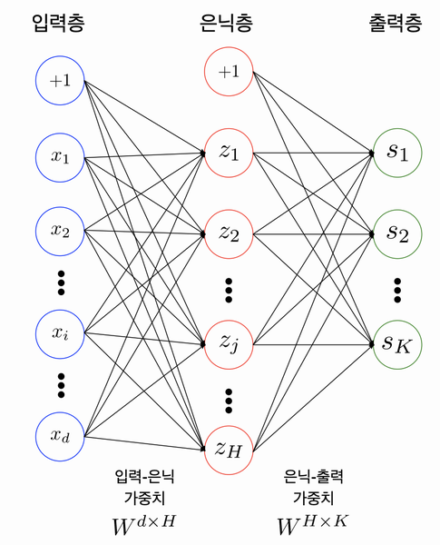

# AIFFEL_24일차 2020.08.26

Tags: AIFFEL_DAILY

### 일정

---

1. LMS F-23
2. 코딩마스터 Session5 ( 프로그래머스 코딩테스트 연습 Heap 문제풀이 ) 마무리

# [F-23] 딥러닝 들여다보기

---

### **학습목표**

---

1. 딥러닝 문제 구성에 대한 기본적인 이해를 높인다.
2. Neural Network에 사용되는 용어들에 대한 이해를 높인다.
3. 딥러닝 프레임워크를 사용하지 않고, Numpy만을 이용해 딥러닝 모델과 훈련 과정을 직접 구현해 본다.

프레임워크 내부에서 일어나는 일을 Numpy를 활용해 직접 구현해 보면서 이해해 보고자 합니다.

### 다층 퍼셉트론(Multi-Layer Perceptron, MLP) Overview

---



---

bias 노드

[https://funnypr.tistory.com/entry/The-Basic-Artificial-Neuron-Bias-neuron](https://funnypr.tistory.com/entry/The-Basic-Artificial-Neuron-Bias-neuron)

역전파 알고리즘은 각 뉴런의 출력 신호를 결정하기 위해서 입력(입력 신호와 연결 무게를 곱하고 나서 모두 합한값)에 활성화 함수(Activation Function)를 적용한다.

- 활성화 함수의 임계값 변동을 흡수하기 위한 가중치를 바이어스(편견)이라고 하며, 항상 1의 값을 가진다.

**바이어스의 중요한 기능은 훈련 가능한 상수 값을 가지는 모든 노드를 제공하는 것이다.**

MLP (Multi-Layer Perceptron) 의 다른말.
Fully-Connnected Nerual Network는 서로 다른 층에 위치한 노드 간에는 연결 관계가
존재하지 않으며, 인접한 층에 위치한 노드들 간의 연결만 존재한다는 의미를 내포

입력값이 100개, **은닉 노드가 20개**라면 사실 이 *입력층-은닉층* 사이에는 **`100x20`**의 형태를 가진 행렬이 존재합니다. 똑같이, MNIST 데이터처럼 10개의 클래스를 맞추는 문제를 풀기 위해 **출력층이 10개의 노드**를 가진다면 *은닉층-출력층* 사이에는 **`20x10`**의 형태를 가진 행렬이 존재하게 됩니다.

이 행렬들을 Parameter 혹은 Weight라고 부릅니다.

두 단어는 보통 같은 뜻으로 사용되지만, 실제로 Parameter에는 위의 참고자료에서 다룬 bias 노드도 포함된다.

이때 인접한 레이어 사이에는 아래와 같은 관계가 성립합니다.

$y = {W}\cdot{X} + b$

```python
# 입력층 데이터의 모양(shape)
print(x_train_reshaped.shape)

# 테스트를 위해 x_train_reshaped의 앞 5개의 데이터를 가져온다.
X = x_train_reshaped[:5]
print(X.shape)

weight_init_std = 0.1
input_size = 784
hidden_size=50

# 인접 레이어간 관계를 나타내는 파라미터 W를 생성하고 random 초기화
W1 = weight_init_std * np.random.randn(input_size, hidden_size)  
# 바이어스 파라미터 b를 생성하고 Zero로 초기화
b1 = np.zeros(hidden_size)

a1 = np.dot(X, W1) + b1   # 은닉층 출력

print(W1.shape)
print(b1.shape)
print(a1.shape)
```

## 활성화 함수

---

활성화 함수는 보통 비선형 함수를 사용.

비선형 함수를 MLP 안에 포함시켜서 모델의 표현력이 좋아짐.

⇒ 비선형 함수가 포함되지 않으면 한 층을 가진 MLP와 다른 점이 없다.

[vanishing gradient]

([https://brunch.co.kr/@chris-song/39](https://brunch.co.kr/@chris-song/39))

[backprop]

([https://ayearofai.com/rohan-lenny-1-neural-networks-the-backpropagation-algorithm-explained-abf4609d4f9d](https://ayearofai.com/rohan-lenny-1-neural-networks-the-backpropagation-algorithm-explained-abf4609d4f9d))

```python
# 단일 레이어 구현 함수
def affine_layer_forward(X, W, b):
    y = np.dot(X, W) + b
    cache = (X, W, b)
    return y, cache

input_size = 784
hidden_size = 50
output_size = 10

W1 = weight_init_std * np.random.randn(input_size, hidden_size)
b1 = np.zeros(hidden_size)
W2 = weight_init_std * np.random.randn(hidden_size, output_size)
b2 = np.zeros(output_size)

a1, cache1 = affine_layer_forward(X, W1, b1)
z1 = sigmoid(a1)
a2, cache2 = affine_layer_forward(z1, W2, b2)    # z1이 다시 두번째 레이어의 입력이 됩니다. 

print(a2[0])  # 최종 출력이 output_size만큼의 벡터가 되었습니다.

def softmax(x):
    if x.ndim == 2:
        x = x.T
        x = x - np.max(x, axis=0)
        y = np.exp(x) / np.sum(np.exp(x), axis=0)
        return y.T 

    x = x - np.max(x) # 오버플로 대책
    return np.exp(x) / np.sum(np.exp(x))

y_hat = softmax(a2)
y_hat[0]  # 10개의 숫자 중 하나일 확률이 되었습니다.
```

## 손실함수 (Loss Functions)

---

원하는 정답과 전달된 신호 정보들 사이의 차이를 계산하고, 이 차이를 줄이기 위해 각 파라미터들을 조정하는 것이 딥러닝의 전체적인 학습 흐름.

차이를 구하는데 사용되는 함수는 손실함수(Loss function) 또는 비용함수(Cost function)

### 교차 엔트로피 (Cross Entropy)

---

Cross Entropy는 두 확률분포 사이의 유사도가 클수록 작아지는 값

$E= -\sum_{i=1}^{n} {t_{i}\log{y_i}}$

[https://curt-park.github.io/2018-09-19/loss-cross-entropy/](https://curt-park.github.io/2018-09-19/loss-cross-entropy/#:~:text=Cross%20Entropy%EB%8A%94%20%EB%91%90%20%EA%B0%9C%EC%9D%98,%EC%A0%95%EB%B3%B4%EB%9F%89%EC%9D%84%20%EA%B3%84%EC%82%B0%ED%95%9C%20%EA%B2%83%EC%9D%B4%EB%8B%A4)

Cross Entropy는 두 개의 확률분포 p와 q에 대해 하나의 사건 X가 갖는 정보량으로 정의된다. 즉, 서로 다른 두 확률분포에 대해 같은 사건이 가지는 정보량을 계산한 것이다. 이는 q에 대한 정보량을 p에 대해서 평균낸 것으로 볼 수 있다

$H_{p,q}(X) = - \sum_{i=1}^N p(x_i) \log q(x_i)$

p는 true probability로써 true label에 대한 분포를, q는 현재 예측모델의 추정값에 대한 분포를 나타낸다.

[https://3months.tistory.com/436](https://3months.tistory.com/436)

entropy 란 불확실성 (uncertainty) 에 대한 척도이다.

결국 예측 모형으로 하고자 하는 것은 불확실성을 제어하고자 하는 것

가방 안에 빨간공만 들어있다고 하자. 이 경우, 불확실성은 없다. 왜냐하면 어떤공을 꺼내도 빨간 공이기 때문이다. 따라서 이 경우 entropy 는 0이다. 우리가 신경써야하는 부분은 가방 안에서 꺼내는 공에 불확실성이 있는 경우이다.

두 색깔의 공만 들어있는 경우, 50:50 으로 들어있을 때, 가장 entropy (불확실성) 이 크다. 이를 직관적으로 이해하면, 우리가 공을 꺼낼 때, 반반으로 들어있다면, 어떤 공이 더 자주 관찰될지 예측할 수 없기 때문에 entropy 가 크다고 이해할 수 있다.

예측 모형은 실제 분포인 q 를 모르고, 모델링을 하여 q 분포를 예측하고자 하는 것이다. 예측 모델링을 통해 구한 분포를 p(x) 라고 해보자. 

실제 분포인 q를 예측하는 p 분포를 만들었을 때, 이 때 cross-entropy 는 아래와 같이 정의된다.

$H_p(q) = -\sum_{c=1}^{C} q(y_c)log(p(y_c))$

q와 p가 모두 식에 들어가기 때문에, cross-entropy 라는 이름이 붙었다고 할 수 있다.

머신러닝을 통한 예측 모형에서 훈련 데이터에서는 실제 분포인 p 를 알 수 있기 때문에 cross-entropy 를 계산할 수 있다.

즉, 훈련 데이터를 사용한 예측 모형에서 cross-entropy 는 실제 값과 예측값의 차이 (dissimilarity) 를 계산하는데 사용할 수 있다는 것이다. 또한, Cross-entropy > entropy 이다.

```python
# 정답 라벨을 One-hot 인코딩하는 함수
def _change_ont_hot_label(X, num_category):
    T = np.zeros((X.size, num_category))
    for idx, row in enumerate(T):
        row[X[idx]] = 1
        
    return T

Y_digit = y_train[:5]
t = _change_ont_hot_label(Y_digit, 10)
t     # 정답 라벨의 One-hot 인코딩
```

```python
def cross_entropy_error(y, t):
    if y.ndim == 1:
        t = t.reshape(1, t.size)
        y = y.reshape(1, y.size)
        
    # 훈련 데이터가 원-핫 벡터라면 정답 레이블의 인덱스로 반환
    if t.size == y.size:
        t = t.argmax(axis=1)
             
    batch_size = y.shape[0]
    return -np.sum(np.log(y[np.arange(batch_size), t])) / batch_size

Loss = cross_entropy_error(y_hat, t)
Loss
```

## Gradient Descent

---

오차를 줄이는 것이 목표

⇒ 손실함수를 통해 구해진 오차를 가지고 각 파라미터들을 조정

```python
batch_num = y_hat.shape[0]
dy = (y_hat - t) / batch_num
dy    # softmax값의 출력으로 Loss를 미분한 값
```

⇒ 관련 자료 : [https://deepnotes.io/softmax-crossentrop](https://deepnotes.io/softmax-crossentropy)

### *Cross Entropy Loss*

Cross entropy indicates the distance between what the model believes the output distribution should be, and what the original distribution really is.

Cross entropy measure is a widely used alternative of squared error. It is used when node activations can be understood as representing the probability that each hypothesis might be true, i.e. when the output is a probability distribution.

일단 dy가 구해지면 다른 기울기들은 chain-rule로 쉽게 구해집니다.

$\frac{\partial Loss}{\partial W2} = \frac{\partial Loss}{\partial y}\frac{\partial y}{\partial W2}$

$y={W2}\cdot{z1}+b2$

$\frac{\partial Loss}{\partial W2} = {dy}\cdot{z1}$

```python
dW2 = np.dot(z1.T, dy)    
dW2

dW2 = np.dot(z1.T, dy)
db2 = np.sum(dy, axis=0)

def sigmoid_grad(x):
    return (1.0 - sigmoid(x)) * sigmoid(x)

dz1 = np.dot(dy, W2.T)
da1 = sigmoid_grad(a1) * dz1
dW1 = np.dot(X.T, da1)
db1 = np.sum(dz1, axis=0)

learning_rate = 0.1

def update_params(W1, b1, W2, b2, dW1, db1, dW2, db2, learning_rate):
    W1 = W1 - learning_rate*dW1
    b1 = b1 - learning_rate*db1
    W2 = W2 - learning_rate*dW2
    b2 = b2 - learning_rate*db2
    return W1, b1, W2, b2
```

---

*데이터 일반화(normalization) vs 표준화(standadization)

[https://skyil.tistory.com/50](https://skyil.tistory.com/50)

Standardization을 위해서 먼저 z-score라는 지표를 계산한다.

$z(x) = \frac{x-m}{\sigma }$

m은 평균, σ은 표준 편차이다. 이렇게 계산된 z-score는 평균에서 크게 벗어난 outlier일수록 큰 절댓값을 갖는다. 이제 이 score가 범위(-2 ~ 2)를 벗어난 값들을 모두 지워주면 된다.

**Normalization**은 값을 0과 1 사이로 모아서 값의 규모(scale)를 줄여준다. min과 max의 편차가 크거나, 다른 열에 비해 데이터가 지나치게 큰 열에 사용한다.

더 작은 scale을 갖는 데이터는 더욱 빠르게 수렴하는 경향이 있어, 머신러닝 학습 성능 향상에 도움을 준다. 특히 MSE와 같이 Cost가 Loss에 비례해 끝없이 커지는 비용 함수에 대해서는, 비용 값이 너무 커서 발생할 수 있는 문제들을 예방할 수 있다. 또한, 여러 입력 데이터의 scale을 비슷하게 맞춰줌으로써 각 데이터가 비슷한 중요도를 갖도록 학습시킬 수 있다.

**Standardization**은 z-score의 절댓값이 2를 넘는 값들을 지워 평균에서 크게 벗어난 outlier를 제거한다. 이는 모델이 대부분의 상황에서 더 높은 precision을 갖게 한다.

IQR 방법도 있다!

---

## Backpropagation (오차역전파)

---

손실함수를 통해 구해진 오차를 가지고 각 파라미터들을 조정하는 것이 경사하강법

그렇다면, 이렇게 구해진 기울기를 입력층까지 어떻게 전달하며 파라미터들을 조정할 것인가?

이 과정에서 쓰이는 것이 backprop!


MLP를 학습시키기 위한 일반적인 알고리즘 중 하나입니다. 이는 출력층의 결과와 내가 뽑고자 하는 target 값과의 차이를 구한 뒤, 그 오차값을 각 레이어들을 지나며 역전파해가며 각 노드가 가지고 있는 변수들을 갱신해 나가는 방식

```python
def affine_layer_backward(dy, cache):
    X, W, b = cache
    dX = np.dot(dy, W.T)
    dW = np.dot(X.T, dy)
    db = np.sum(dy, axis=0)
    return dX, dW, db
```

Forward Propagation과 Backward Propagation이 이루어지는 한 사이클

```python
# 파라미터 초기화
W1 = weight_init_std * np.random.randn(input_size, hidden_size)
b1 = np.zeros(hidden_size)
W2 = weight_init_std * np.random.randn(hidden_size, output_size)
b2 = np.zeros(output_size)

# Forward Propagation
a1, cache1 = affine_layer_forward(X, W1, b1)
z1 = sigmoid(a1)
a2, cache2 = affine_layer_forward(z1, W2, b2)

# 추론과 오차(Loss) 계산
y_hat = softmax(a2)
t = _change_ont_hot_label(Y_digit, 10)   # 정답 One-hot 인코딩
Loss = cross_entropy_error(y_hat, t)

print(y_hat)
print(t)
print('Loss: ', Loss)
        
dy = (y_hat - t) / X.shape[0]
dz1, dW2, db2 = affine_layer_backward(dy, cache2)
da1 = sigmoid_grad(a1) * dz1
dX, dW1, db1 = affine_layer_backward(da1, cache1)

# 경사하강법을 통한 파라미터 업데이트    
learning_rate = 0.1
W1, b1, W2, b2 = update_params(W1, b1, W2, b2, dW1, db1, dW2, db2, learning_rate)
```

## 모델 학습 Step-by-Step

---

```python
W1 = weight_init_std * np.random.randn(input_size, hidden_size)
b1 = np.zeros(hidden_size)
W2 = weight_init_std * np.random.randn(hidden_size, output_size)
b2 = np.zeros(output_size)

def train_step(X, Y, W1, b1, W2, b2, learning_rate=0.1, verbose=False):
    a1, cache1 = affine_layer_forward(X, W1, b1)
    z1 = sigmoid(a1)
    a2, cache2 = affine_layer_forward(z1, W2, b2)
    y_hat = softmax(a2)
    t = _change_ont_hot_label(Y, 10)
    Loss = cross_entropy_error(y_hat, t)

    if verbose:
        print('---------')
        print(y_hat)
        print(t)
        print('Loss: ', Loss)
        
    dy = (y_hat - t) / X.shape[0]
    dz1, dW2, db2 = affine_layer_backward(dy, cache2)
    da1 = sigmoid_grad(a1) * dz1
    dX, dW1, db1 = affine_layer_backward(da1, cache1)
    
    W1, b1, W2, b2 = update_params(W1, b1, W2, b2, dW1, db1, dW2, db2, learning_rate)
    
    return W1, b1, W2, b2, Loss
```

```python
X = x_train_reshaped[:5]
Y = y_train[:5]

# train_step을 다섯 번 반복 돌립니다.
for i in range(5):
    W1, b1, W2, b2, _ = train_step(X, Y, W1, b1, W2, b2, learning_rate=0.1, verbose=True)
```

⇒ 추론한 확률값 y_hat이 정답의 one-hot 인코딩인 t 값에 조금씩 근접. Loss도 점점 감소.

⇒ 경사하강법을 통해 조금씩 파라미터를 제대로 업데이트해가고 있다는 의미!

## 추론 과정 구현과 정확도(Accuracy)계산

---

```python
def predict(W1, b1, W2, b2, X):
    a1 = np.dot(X, W1) + b1
    z1 = sigmoid(a1)
    a2 = np.dot(z1, W2) + b2
    y = softmax(a2)

    return y
```

```python
def accuracy(W1, b1, W2, b2, x, y):
    y_hat = predict(W1, b1, W2, b2, x)
    y_hat = np.argmax(y_hat, axis=1)
   # t = np.argmax(t, axis=1)

    accuracy = np.sum(y_hat == y) / float(x.shape[0])
    return accuracy
```

```python
acc = accuracy(W1, b1, W2, b2, X, Y)

t = _change_ont_hot_label(Y, 10)
print(result[0])
print(t[0])
print(acc)
```

## 전체 학습 사이클 수행

---

```python
def init_params(input_size, hidden_size, output_size, weight_init_std=0.01):

    W1 = weight_init_std * np.random.randn(input_size, hidden_size)
    b1 = np.zeros(hidden_size)
    W2 = weight_init_std * np.random.randn(hidden_size, output_size)
    b2 = np.zeros(output_size)

    print(W1.shape)
    print(b1.shape)
    print(W2.shape)
    print(b2.shape)
    
    return W1, b1, W2, b2
```

```python
# 하이퍼파라미터
iters_num = 50000  # 반복 횟수를 적절히 설정한다.
train_size = x_train.shape[0]
batch_size = 100   # 미니배치 크기
learning_rate = 0.1

train_loss_list = []
train_acc_list = []
test_acc_list = []

# 1에폭당 반복 수
iter_per_epoch = max(train_size / batch_size, 1)

W1, b1, W2, b2 = init_params(784, 50, 10)

for i in range(iters_num):
    # 미니배치 획득
    batch_mask = np.random.choice(train_size, batch_size)
    x_batch = x_train_reshaped[batch_mask]
    y_batch = y_train[batch_mask]
    
    W1, b1, W2, b2, Loss = train_step(x_batch, y_batch, W1, b1, W2, b2, learning_rate=0.1, verbose=False)

    # 학습 경과 기록
    train_loss_list.append(Loss)
    
    # 1에폭당 정확도 계산
    if i % iter_per_epoch == 0:
        print('Loss: ', Loss)
        train_acc = accuracy(W1, b1, W2, b2, x_train_reshaped, y_train)
        test_acc = accuracy(W1, b1, W2, b2, x_test_reshaped, y_test)
        train_acc_list.append(train_acc)
        test_acc_list.append(test_acc)
        print("train acc, test acc | " + str(train_acc) + ", " + str(test_acc))
```

딥러닝 프레임워크가 없이도 Numpy만으로도 딥러닝이 가능하다는 것을 확인했습니다. 물론 아쉽게도 Numpy는 GPU를 지원하지 않으므로, 방금의 딥러닝은 CPU만 사용한 것입니다. 하지만 이로서 우리는 딥러닝 프레임워크 안에서 일어나는 일에 대해 알아볼 수 있다!

```python
from matplotlib.pylab import rcParams
rcParams['figure.figsize'] = 12, 6 

# Accuracy 그래프 그리기
markers = {'train': 'o', 'test': 's'}
x = np.arange(len(train_acc_list))
plt.plot(x, train_acc_list, label='train acc')
plt.plot(x, test_acc_list, label='test acc', linestyle='--')
plt.xlabel("epochs")
plt.ylabel("accuracy")
plt.ylim(0, 1.0)
plt.legend(loc='lower right')
plt.show()
```