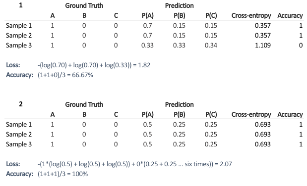

# AIFFEL_27일차 2020.08.31

Tags: AIFFEL_DAILY

### 일정

---

- LMS F-24
- LMS F-25
- 코딩마스터 Session5_Heap

# [F-24] Evaluation Metric

---

### **학습 목표**

---

1. 머신러닝 학습 결과를 평가할 수 있다.
2. Precision과 Recall의 관계를 이해할 수 있다
3. AUC 영역을 통해 모델 간의 퍼포먼스를 비교할 수 있다.

각 머신러닝 문제는 서로 다른 성능평가 척도(Evaluation Metric)를 가지며, 하나의 문제에 대해서도 목적에 따라 여러 가지 척도를 사용할 수 있습니다.

### Ground Truth (실측 정보)

---

***the reality you want your model to predict.***

***Ground truth isn’t true. It’s an ideal expected result (according to the people in charge)***

For example, a set of images might be painstakingly hand-labeled as cat or not-cat according to the opinions of whoever was in charge of the project and those cat/not-cat labels will be called “ground truth” ***for the project.***

프로젝트를 진행하는 사람이 해당 프로젝트가 도출해내길 원하는대로 '실측' 하여 만들어낸 label 들을 ground truth (실측정보) 라고 한다.

the term "ground truth" refers to the accuracy of the training set's classification for supervised learning techniques.

The ground truth is what you measured for your target variable for the training and testing examples.

Nearly all the time you can safely treat this the same as the label.

### Loss vs Metric

---

- Loss : 모델 학습시 **학습데이터(train data)**를 바탕으로 계산되어, **모델의 파라미터 업데이트**에 활용되는 함수
- Metric : 모델 학습 종료 후 **테스트데이터(test data)**를 바탕으로 계산되어, 학습된 모델의 성능을 평가하는데 활용되는 함수

### Cross-Entropy

---

$\text{Cross-entropy} = -\sum_{i=1}^n \sum_{j=1}^m y_{i,j}\log(p_{i,j})$

$y_{i,j}$ 는 true value 를 의미. sample i 가 j class 에 속한다면 1이고 아니라면 0

$p_{i,j}$ 는 모델에 의해 도출된 sample i 가 class j 에 속할 확률.

Q. 왜 굳이 Loss와 Metric을 다르게 적용했을까요? 만약 학습데이터 배치에 대해 모델이 계산한 train accuracy를 Loss로 삼아서 학습을 진행하면 안되는 걸까요?

---

Most of the time you would observe that the accuracy increases with the decrease in loss.

Loss here is a continuous variable i.e. it’s best when predictions are close to 1 (for true labels) and close to 0 (for false ones). While accuracy is kind of discrete.

Loss 는 true label 과 얼마나 가까운지를 나타내는 연속적인 수치, accuracy는(sample 각각에 대한 accuracy) discrete 한 값이다.



train 과정에서는 단순히 맞았다 틀렸다가 중요한 것이 아니라, 얼마나 정답에 가까운지를 파악하고 정답에 더 가까워질 수 있도록 하는 것이 중요하다.

즉, Loss나 Metric으로 어떤 함수를 활용할지는 해결해야 할 Task에 따라 다릅니다. 하지만 우리가 해결해야 할 문제에 어떤 Loss나 Metric이 적당한지를 판단하는 직관력은 정말 중요합니다.

### Confusion Matrix

---

 $정확도(Accuracy) = \frac {TP+TN} {TP+TN+FP+FN}$ 


 $정밀도(Precision) = \frac {TP} {TP+FP}$ 

양성으로 규정한 것이 얼마나 정확한지를 보고 싶은 것입니다. 모델이 음성으로 규정한 것에 대해서는 크게 관심이 없습니다

 $재현율(Recall) = \frac {TP} {TP+FN}$ 

음성 대 양성 데이터 분포가 불균형할 경우 정확도는 모델을 평가하는데 좋은 척도가 되지 못합니다.

### F1 score

---

$F_\beta = (1 + \beta^2) \cdot \frac{\mathrm{precision} \cdot \mathrm{recall}}{(\beta^2 \cdot \mathrm{precision}) + \mathrm{recall}}$

⇒ 해당 F score 에서 $\beta$ 값이 1이 될 때를 의미함.

⇒ Precision과 Recall의 조화평균이 되는 값.

⇒ Precision과 Recall을 둘 다 고려할 수 있어서 분류 모델의 훌륭한 척도가 됨.

Q. F score 에서 $\beta$ 값을 1보다 크게 한다면 어느 값을 더 중요시 하는 것인가?

---

```
아래 경우를 가정해 봅시다. 
- Case 1 : precision = 1, recall = 0.5
- Case 2 : precision = 0.5, recall = 1

beta=1 이라면 F-score는 위 두 경우의 값이 동일합니다. 
beta=2 라면 분자는 동일하지만 Case 1의 분모가 더 커지므로 Case 2의 F score가 더 큽니다. 
이것은 beta가 1보다 클 때 recall이 더 큰 경우를 더 우대한다고 볼 수 있습니다.
```

## Threshold의 변화에 따른 모델 성능

---

우리가 학습시킨 모델의 출력이 일정 이상 기준선(Threshold)를 넘어가면 우리는 양성이라고 분류하게 될 것입니다.

모델의 파라미터 등은 전혀 변한 것이 없는데, 모델의 출력값을 해석하는 방식만 다르게 해도 이 모델은 전혀 다른 성능을 가지게 됩니다. 따라서 이 모델의 성능척도 값도 달라지게 될 것입니다.

모델의 성능이라는 것이 F1 score같은 숫자 하나로만 규정될 수 있는 게 아니라는 것을 의미. (물론 모델 출력의 해석방식이 고정적으로 주어진다면 F1 score는 유효한 Metric이 됩니다.)

### PR(Precision and Recall) , ROC(Receiver Operating Characteristic)

---

Threshold가 달라지는 것을 고려하여 전체적인 모델의 성능을 평가하는 방법으로 PR(Precision and Recall) 커브와 ROC(Receiver Operating Characteristic) 커브를 그려보는 두가지 방법

```python
from sklearn.metrics import confusion_matrix, classification_report

y_pred = classifier.predict(X_test)
conf_mat = confusion_matrix(y_test, y_pred)
print(conf_mat)
rpt_result = classification_report(y_test, y_pred)
print(rpt_result)
```

```python
from sklearn.metrics import confusion_matrix, classification_report

y_pred = classifier.predict(X_test)
conf_mat = confusion_matrix(y_test, y_pred)
print(conf_mat)
rpt_result = classification_report(y_test, y_pred)
print(rpt_result)
```

```python
y_pred_new_threshold = classifier.decision_function(X_test) > -0.1
conf_mat = confusion_matrix(y_test, y_pred_new_threshold)
print(conf_mat)
rpt_result = classification_report(y_test, y_pred_new_threshold)
print(rpt_result)
```

## Precision-Recall 커브, PR 커브

---

```python
from sklearn.metrics import precision_recall_curve
from sklearn.metrics import plot_precision_recall_curve
import matplotlib.pyplot as plt

disp = plot_precision_recall_curve(classifier, X_test, y_test)
disp.ax_.set_title('binary class Precision-Recall curve: '
                   'AP={0:0.2f}'.format(average_precision))
```


물론 우리가 원하는 값은 Precision이든 Recall이든 모두 1에 가깝기를 원합니다. 이상적으로는 그래프가 (1, 1)에 찍히면 좋겠습니다만, 가급적 위 그래프가 (1, 1)에 근접하도록 그려지길 바랍니다.

### AUC

---

Threshold 값에 무관하게 모델의 전체적인 성능을 평가하는 방법으로, 위 PR 커브 아래쪽 면적을 계산하는 방법이 있습니다. 이것을 AUC(Area Under Curve) 값이라고 합니다.

PR AUC를 계산하는 방법으로 다음과 같이 사이킷런에서 제공하는 average_precision_score 함수를 사용합니다.

[https://scikit-learn.org/stable/modules/generated/sklearn.metrics.average_precision_score.html](https://scikit-learn.org/stable/modules/generated/sklearn.metrics.average_precision_score.html)

⇒ $\text{AP} = \sum_n (R_n - R_{n-1}) P_n$

⇒ n 값을 무한히 크게 한다면 아주 작은 Recall 구간에 대해 Pn 값을 적분하는 것과 같게 됩니다. 그러므로 PR 커브의 아래쪽 면적인 PR AUC와 같은 의미가 되겠군요.

- svm 커널을 'poly'로 주었을 때 average_precision_score 값 구해보기

```python
from sklearn.metrics import average_precision_score

# [[YOUR CODE]] 
classifier = svm.SVC(kernel='poly', random_state=random_state)
classifier.fit(X_train, y_train)
y_score = classifier.decision_function(X_test)
average_precision = average_precision_score(y_test, y_score)

print('평균 precision-recall score: {0:0.2f}'.format(
      average_precision))
```

svm + svm 커널 종류에 대한 설명 : [https://scikit-learn.org/stable/modules/generated/sklearn.svm.SVC.html](https://scikit-learn.org/stable/modules/generated/sklearn.svm.SVC.html)

## ROC 커브

---

ROC(Receiver Operating Characteristic Curve) 는 '수신자 조작 특성 곡선'이라는 단어로 표현할 수 있습니다.

Confusion Matrix 수치를 활용해, 분류기의 분류 능력을 그래프로 표현하는 방법

PR 커브와 마찬가지로 분류기의 Threshold 값의 변화에 따라 Confusion Matrix에 생기는 변화로 인해 그려지는 것

### TPR, FPR

---

$TPR (Sensitivity) = \frac {TP} {TP + FN}$

$FPR (1-Specificity) = \frac {FP} {TN + FP}$


*FR Rate

specificity = $\frac {TN} {TN + FP}$

⇒ 실은 음성 샘플에 대한 Recall이라고 볼 수 있습니다.


AUC 예시 영역

영역의 넓이가 넓은 모델일수록, 상대적으로 좋은 성능을 보여준다고 합니다.

```python
from sklearn.metrics import roc_curve, auc

fpr, tpr, _ = roc_curve(y_test, y_score)
roc_auc = auc(fpr, tpr)

plt.figure()
lw = 2
plt.plot(fpr, tpr, color='darkorange',
         lw=lw, label='ROC curve (area = %0.2f)' % roc_auc)
plt.plot([0, 1], [0, 1], color='navy', lw=lw, linestyle='--')
plt.xlim([0.0, 1.0])
plt.ylim([0.0, 1.05])
plt.xlabel('False Positive Rate')
plt.ylabel('True Positive Rate')
plt.title('Receiver operating characteristic example')
plt.legend(loc="lower right")
plt.show()
print(f"auc result:{roc_auc}")
```


아주 이상적으로 Precision과 Recall이 전부 1이 되는 완벽한 모델이라면 ROC 커브에서는 어디에 점이 찍힐까요? 네, 바로 (0, 1)일 것입니다. 양성과 음성에 대한 Recall이 모두 1이 될 테니 TPR은 1, FPR은 0이 될 것입니다.

*극단적인 경우

- 모델이 모든 샘플에 대해 양성이라고 분류한다면 어떨까요? 이땐 이 분류기가 (1, 1)에 찍힐 것입니다. 반대로 모든 샘플에 대해 음성이라고 분류한다면 이 분류기는 (0, 0)에 찍힐 것입니다.
- 이번엔 완벽한 랜덤 분류기를 가정해 봅시다. 이 분류기는 양성이든 음성이든 무관하게 p의 확률로 양성이라고 분류할 것입니다. 이 랜덤분류기의 Recall은 p가 될 것입니다. 음성에 대한 Recall도 p가 될 테니 이 분류기는 (p, 1-p)에 찍힐 것입니다.
- 위 그래프에서 (0, 0)과 (1, 1)을 잇는 파란 점선은 바로 위와 같은 극단적인 경우들만 모아놓은 경우입니다. 그래서 의미있는 분류기라면 적어도 이 파란 점선보다는 위쪽에 그려져야 하며, 가급적 (0, 1)에 가깝게 그려질 수록 우수한 분류기가 됩니다.

## 다양한 머신러닝 모델의 평가척도

---

다루고자 하는 문제의 특성에 따라 이렇게 다양한 평가 척도가 존재할 수 있다는 것을 알아보는 것으로 하겠습니다.

### 회귀 모델의 평가척도

---

회귀 모델은 분류 모델에 비해 평가척도를 다루는 것이 간단합니다. loss 함수가 테스트셋에 적용될 때 그대로 Metric이 되는 경우가 대부분입니다. 그래서 회귀 모델의 경우에는 어떤 loss가 적합한지 그 특성을 알아보는 것이 중요하게 됩니다.

[https://partrita.github.io/posts/regression-error/](https://partrita.github.io/posts/regression-error/)

MSE, RMSE는 오차의 제곱에 비례하여 수치가 늘어나므로, 특이값에 민감하게 반응하며, Outlier가 많은 데이터에 대해 모델이 강건(robust)하지 못하다. MAE, MAPE는 오차의 절대값에 비례해서 수치가 늘어나는데 상대적으로 특이값에 민감하지 않고 Outlier가 많은 데이터에 대해 강건한다.

### 랭킹 모델의 평가척도

---

[https://lamttic.github.io/2020/03/20/01.html](https://lamttic.github.io/2020/03/20/01.html)

추천시스템. 랭킹(우선순위) 개념이 추가. User를 입력으로 했을 때, Item들이 추천할만한지 여부를 분류만 하는 것이 아니라, 얼마나 추천할만 한지 랭킹까지 매겨야 한다는 점입니다.

### MRR(Mean Reciprocal Rank)

---

우선순위를 고려한 평가기준 중 가장 간단한 모델.

1. 각 사용자마다 제공한 추천 컨텐츠 중 관련있는 컨텐츠 중 가장 높은 위치를 역수로 계산(1/k)한다.
2. 사용자마다 계산된 점수를 모아 평균을 계산한다.


MRR은 사용자가 몇 개의 컨텐츠에 관심이 있었는지, 각 관련 컨텐츠는 어느 위치에 있었는지를 고려하지 않는다. 오직, 가장 상위의 관련 컨텐츠의 위치만을 고려하여 점수를 계산함으로써 가장 관련있는 컨텐츠가 얼마나 상위에 올라가 있는지를 평가한다.

### MAP(Mean Average Precision)

---

1. 각 사용자마다 관련된 컨텐츠를 구하여 해당 관련 컨텐츠 위치까지의 목록(sublist)에 대하여 정밀도를 계산한다.
2. 계산된 정밀도 값들에 대하여 사용자별로 평균을 내고, 그 결과를 모두 모아 평균을 계산한다.


### NDCG(Normalized Discounted Cumulative Gain)

---

MAP을 이용하여 얻고자하는 목표는 크게 다르지 않다. 다만 NDCG는 관련 여부에 대해 이분법적으로 구분하는 것이 아니라 더 관련있는 컨텐츠는 무엇인가?에 대해 집중하여 더 관련있는 컨텐츠를 덜 관련있는 컨텐츠보다 더 상위에 노출시키는지에 대해 평가.


1. 모든 추천 컨텐츠들의 관련도를 합하여 CG(cumulative gain)을 구한다.
2. CG에서 추천 컨텐츠들의 관련도를 합하였다면, DCG는 각 추천 컨텐츠의 관련도를 log함수로 나누어 값을 구한다. log함수 특성상 위치 값이 클수록(하위에 있을 수록) DCG의 값을 더 작아지게 함으로써 상위 컨텐츠의 값을 점수에 더 반영할 수 있게 한다.
3. DCG 값에 관련도를 더 강조하고 싶다면, 2^관련도 - 1과 같이 관련도의 영향을 증가시킬 수 있다.
4. 사용자마다 제공되는 추천 컨텐츠의 DCG와는 별개로 IDCG(이상적인 DCG)를 미리 계산해놓는다.
5. 각 사용자의 DCG를 IDCG로 나누어서 사용자별 NDCG를 구한다.
6. 사용자별 NDCG의 평균을 구하여 해당 IR의 NDCG를 구한다.


### **NDCG 장점**

---

1. 기존 방법과는 다르게 다양한 관련도에 대한 평가가 가능하다.
2. 이분법적인 관련도에도 뛰어난 성능을 보인다.
3. log 함수를 이용하여 하위 컨텐츠에 대한 영향을 줄임으로써 좋은 성능을 보인다.
4. 랭킹을 매기기 위해 임의성을 배제하고 모든 콘텐츠 아이템에 대한 관련성을 계산하여 랭킹에 반영한다.

### **NDCG 단점**

---

1. 사용자와의 관련성을 파악하기 어려운 상황에는 문제의 소지가 있다. 사용자가 컨텐츠에 대한 평가를 하지 않는다면(평점을 입력하지 않는 경우) 해당 관련도를 어떻게 처리해야 할지에 대해 정의해야 한다. 0점 처리해도 문제가 될 것이고, 평균 값을 이용해도 문제가 될 수 있다.
2. 사용자의 관련 컨텐츠가 없다고 판단될 경우, 임의로 NDCG를 0으로 설정해주어야 한다.
3. 보통 K개의 NDCG를 가지고 IR을 평가하는데 IR에서 제공한 컨텐츠가 K보다 부족한 경우, 부족한 관련도를 최소 점수로 채워서 계산해야 한다.

NDCG는 특별한 경우가 아니고서는 훌륭한 평가 기준이 될 수 있다. 다만, 특별한 경우에 대해서 예외처리를 해주어야 하고 관련도에 대한 기준을 상황마다 명확하게 세워야 한다. 이런 부분을 감안하더라도 평점 기반의 추천 서비스에서 NDCG를 활용하면 좋은 평가를 할 수 있는 것이라 생각된다.

## 이미지 생성 모델의 평가척도

---

이미지 생성 모델에서 원본 이미지와 새로운 이미지 사이의 거리를 어떻게 측정할 수 있을까요?

[https://medium.com/@datamonsters/a-quick-overview-of-methods-to-measure-the-similarity-between-images-f907166694ee](https://medium.com/@datamonsters/a-quick-overview-of-methods-to-measure-the-similarity-between-images-f907166694ee)

### PSNR (Peak Signal to Noise Ratio)

---

To use this estimator we must transform all values of pixel representation to bit form. If we have 8-bit pixels, then the values of the pixel channels must be from 0 to 255.

RGB color model fits best for the PSNR.

PSNR shows a ratio between the maximum possible power of a signal and the power of corrupting noise that affects the fidelity of its representation.

PSNR is often used to control the quality of digital signal transmission.

***MSE 의 variation 일 뿐이며, pixel by pixel 비교에 집중하는 것은 그대로이다.***

### structural similarity method (SSIM)

---

Instead of using traditional error summation methods, the SSIM models ***image distortion*** as a combination of three factors that are loss of correlation, luminance distortion, and contrast distortion.

⇒ 이미지 왜곡을 모델링한다??

⇒픽셀 단위 비교보다는 이미지 내의 구조적 차이에 집중하는 방식을 쓴다.

## 기계번역 모델의 평가척도

---

영어를 한국어로 번역한 문장이 정답 한국어와 얼마나 비슷한지를 어떻게 측정하면 좋을까요?

[https://donghwa-kim.github.io/BLEU.html](https://donghwa-kim.github.io/BLEU.html)

- n-gram을 통한 순서쌍들이 얼마나 겹치는지 측정(precision)
- 문장길이에 대한 과적합 보정 (Brevity Penalty)
- 같은 단어가 연속적으로 나올때 과적합 되는 것을 보정(Clipping)

$BLEU = min(1, \frac{output \ length(예측 \ 문장)}{reference \ length(실제 \ 문장)})(\prod^{4}_{i=1} precision_i)^{\frac{1}{4}}$

# 코딩마스터 Session5_Heap

---

### 발표자료

[https://blog.naver.com/jjys9047/222075711112](https://blog.naver.com/jjys9047/222075711112)

```python
```
import heapq
x = [6,3,1,6,5,2,4]
heapq.heapify(x)
x
```
output
[1, 3, 2, 6, 5, 6, 4]

# heapify는  heap정렬을 수행한다 라고 보면 될꺼 같습니다
```

```python
heap.remove(max(heap))
# heap 이라는 list 에서 max 값을 찾고 그 값을 heap list 에서 빼고싶다면!
```

```python
heapq._heapify_max(heap)
# 이런식으로 max heap 으로 전환이 가능하다.
# 최대값 구하고자 한다면 그냥 임시로 이렇게 바꾼 후, 다시 min heap 으로 바꾸는 것도 가능.
heapq.heappop(heap)
if heap:
    heapq.heapify(heap)
```

시행착오, 시간측정 추가하시면 좋을 것 같습니다!

[https://github.com/python/cpython/blob/master/Lib/heapq.py](https://github.com/python/cpython/blob/master/Lib/heapq.py)

⇒ heapq 구현을 할 번 살펴봅시다. ( 다음시간에 리뷰 ㅇㅇ )

# [F-25]사이킷런을 활용한 추천 시스템 입문

---

### **학습 목표**

---

- 추천 시스템의 기본 개념에 대해 학습합니다.
- 추천 시스템의 종류에 대해 학습하고 사이킷런을 활용하여 연습해 봅니다.
- 실제 추천 시스템에는 더 많은 기술이 적용됨을 이해합니다.

### 특징

---

- **범주형 데이터를 다룬다.**
    - 액션물, 로맨스물, 스릴러물, 한드, 미드, 일드, 영드 등의 영화 **`item`** 데이터와 A, B, C 같은 **`user`** 데이터를 취급했습니다. 이러한 데이터는 연속적(continuous)이지 않고 이산적(discrete)입니다. 이를 범주형(categorical) 데이터라고 합니다.
- **(숫자 벡터로 변환한 뒤) 유사도를 계산한다.**
    - 범주형 데이터들을 좌표에 나타내었는데, 좌표에 나타내기 위해서는 숫자로 이루어진 벡터(numerical vector)로 변환해야 합니다. 그리고 그 거리를 계산하여 유사도를 계산합니다.

### Cosine Similarity

---

그럼 실제로 어떻게 범주형 데이터들을 벡터로 변환한 뒤 유사도를 계산할 수 있을까요?

유사도를 계산하는 방법 중 가장 잘 알려진 방법은 코사인 유사도(Cosine Similarity)입니다

코사인 유사도는 두 벡터 간의 코사인 값을 이용해 두 벡터의 유사도를 계산합니다.

${\displaystyle {\text{cosine similarity}}=\cos(\theta )={\mathbf {A} \cdot \mathbf {B} \over \|\mathbf {A} \|\|\mathbf {B} \|}={\frac {\sum_{i=1}^n {A_{i}B_{i}}}{{\sqrt {\sum_{i=1}^n{A_{i}^{2}}}}{\sqrt {\sum_{i=1}^n{B_{i}^{2}}}}}}}$

```python
import numpy as np

t1 = np.array([1, 1, 1])
t2 = np.array([2, 0, 1])

from numpy import dot
from numpy.linalg import norm
def cos_sim(A, B):
	return dot(A, B)/(norm(A)*norm(B))

cos_sim(t1, t2)

# sklearn 활용
from sklearn.metrics.pairwise import cosine_similarity

t1 = np.array([[1, 1, 1]])
t2 = np.array([[2, 0, 1]])
cosine_similarity(t1,t2)
```

### 추천시스템의 종류

---

**▶︎ 콘텐츠 기반 필터링(Content Based Filtering)**

**▶︎ 협업 필터링(Collaborative Filtering)**

- 사용자 기반
- 아이템 기반
- 잠재요인 협업 필터링 (latent factor collaborative filtering) → 행렬 인수분해(matrix factorization)

**▶︎ Deep Learning 적용 or Hybrid 방식**

## 콘텐츠 기반 필터링(Content Based Filtering)

---

어떤 사람이 한 영화를 좋아했다면, 비슷한 콘텐츠의 아이템을 추천하는 방식입니다.

쉽게 말하자면, 아이언맨1을 봤으면 아이언맨 2, 아이언맨3을 추천해주고 마블 영화를 추천해 주는 것이죠.

콘텐츠 기반은 순수하게 콘텐츠의 내용만을 비교해서 추천하는 방식.

```python
features = ['keywords','cast','genres','director']
features

def combine_features(row):
    return row['keywords']+" "+row['cast']+" "+row['genres']+" "+row['director']

combine_features(df[:5])

for feature in features:
    df[feature] = df[feature].fillna('')

df["combined_features"] = df.apply(combine_features,axis=1)
df["combined_features"]

cv = CountVectorizer()
count_matrix = cv.fit_transform(df["combined_features"])
print(type(count_matrix)) # csr matrix (저번에 배운거)

# 코사인 유사도 계산
cosine_sim = cosine_similarity(count_matrix)

def get_title_from_index(index):
    return df[df.index == index]["title"].values[0]
def get_index_from_title(title):
    return df[df.title == title]["index"].values[0]

movie_user_likes = "Avatar"
movie_index = get_index_from_title(movie_user_likes)
similar_movies = list(enumerate(cosine_sim[movie_index]))

sorted_similar_movies = sorted(similar_movies,key=lambda x:x[1],reverse=True)[1:]

i=0
print(movie_user_likes+"와 비슷한 영화 3편은 "+"\n")
for item in sorted_similar_movies:
    print(get_title_from_index(item[0]))
    i=i+1
    if i==3:
        break
```

## 협업 필터링

---

***협업 필터링(Collaborative Filtering)***은 과거의 사용자 행동 양식(User Behavior) 데이터를 기반으로 추천하는 방식.

크게 **'사용자 기반'**과 **'아이템 기반'** 그리고 **'잠재요인(latent factor)'** 방식이 있다.

- 사용자 기반, 아이템 기반 : 유사도 계산. 동일한 제품에 대해 평점을 매긴 데이터를 분석하여 추천을 하는 방식.
- 잠재요인 : 행렬 인수분해 (matrix factorization) 를 이용해 잠재요인 분석.
    - 넷플릭스의 추천 시스템에 잠재요인 분석을 사용하여 최근에는 잠재요인을 분석하는 사례가 많아지고 있는 추세입니다.

### interaction matrix, 평점행렬, 평가행렬

---


평점행렬로 변환한 후, 평점행렬의 유사도를 계산하여 추천하는 방식은 사용자 기반과 아이템 기반 방식입니다.

그리고 이 평점행렬을 분해하여 더 많은 정보들을 고려하는 방식이 잠재요인 필터링입니다.

### 사용자 기반

---

당신과 비슷한 고객들이 다음 상품들을 구매했습니다.

### 아이템 기반

---

이 상품을 선택한 다른 고객들은 다음 상품을 구매했습니다.

일반적으로 아이템 기반 방식이 사용자 기반보다 정확도가 더 높다고 함.

### 잠재요인 협업 필터링, 행렬 인수분해

---

행렬 인수분해에는 다음과 같은 기법들이 있습니다.

- SVD(Singular Vector Decomposition)
- ALS(Alternating Least Squares)
- NMF(Non-Negative Factorization)

행렬도 , 일반 인수분해처럼, 곱으로 분해 할 수 있으며, 분해 행렬을 사용하면 원하는 답을 더 쉽게 찾을 수 있습니다. (나중에 이야기 하겠지만, 추천 알고리즘에서 파라미터 수가 줄어 듭니다!)

### SVD

---

**SVD(Singular Vector Decomposition)**는 우리나라 말로 하면 **특잇값 분해**입니다.

**`M X N`** 형태의 행렬 **`A`**을 다음과 같은 형태로 분해하여 나타내는 것입니다.

$A = UΣV^{T}$


[https://angeloyeo.github.io/2019/08/01/SVD.html](https://angeloyeo.github.io/2019/08/01/SVD.html)

***특이값 분해(SVD)가 말하는 것***

직교하는 벡터 집합에 대하여, 선형 변환 후에 그 크기는 변하지만 여전히 직교할 수 있게되는 그 직교 집합은 무엇인가? 그리고 선형 변환 후의 결과는 무엇인가?


*Orthogonal Matrix ( 직교행렬)

$UU^T=U^TU=I$

*Diagonal Matrix (직사각 대각행렬)

$\begin{pmatrix}
 \sigma_1 & 0 \\
 0 & \sigma_2
 \end{pmatrix}$

*부분복원!!


[https://darkpgmr.tistory.com/106](https://darkpgmr.tistory.com/106)

특이값 분해(SVD)는 고유값 분해(eigen decomposition)처럼 행렬을 대각화하는 한 방법

(+ 고유값과 고유벡터 : [https://darkpgmr.tistory.com/105](https://darkpgmr.tistory.com/105) )

Q. SVD를 사용하는 이유??

---

```
"**정보 복원**"을 위해 사용됩니다.

특이값 분해는 분해되는 과정보다는 분해된 행렬을 다시 조합하는 과정에서 그 응용력이 빛을 발한다.

기존의 U,Σ,VTU,Σ,VT로 분해되어 있던 AA행렬을
특이값 p개만을 이용해 A’라는 행렬로 ‘부분 복원’ 시킨 할 수 있다.

위에서 말했던 것 특이값의 크기에 따라 A의 정보량이 결정되기 때문에
값이 큰 몇 개의 특이값들을 가지고도 충분히 유용한 정보를 유지할 수 있다.
...
최대한 중요한 정보들만 부분 복원해서 사용하면 사진의 용량은 줄어들지만
여전히 사진이 보여주고자 하는 내용은 살릴 수 있을 것이다.
```

*Unitary Matrix

---

켤레 전치가 역행렬과 같은 복소수 행렬

...??

```python
import numpy as np
from numpy.linalg import svd

np.random.seed(30)
A = np.random.randint(0, 100, size=(4, 4))
A

U, Sigma, VT = svd(A)

print('U matrix: {}\n'.format(U.shape),U)
print('Sigma: {}\n'.format(Sigma.shape),Sigma)
print('V Transpose matrix: {}\n'.format(VT.shape),VT)
```

복원을 위해서는 U, Σ, VT를 내적합니다. 한 가지 유의할 사항은 Σ는 1차원 이므로 0을 포함한 대각 행렬로 변환한 뒤 내적을 해주어야합니다.

```python
# 대각행렬로 변환하는 diag 라는 함수가 있는듯.
Sigma_mat = np.diag(Sigma)

A_ = np.dot(np.dot(U, Sigma_mat), VT)
A_
```

### Truncated SVD

---

추천 시스템에서의 행렬 인수분해는 SVD 중에서도 Truncated SVD를 사용합니다.

다른 말로 **LSA(Latent semantic analysis),** 잠재 의미 분석 이라고 번역할 수 있습니다.

### 행렬 인수분해와 잠재요인 협업 필터링

---


SVD를 평가행렬에 적용하여 잠재요인을 분석하는 것


- R: 사용자와 아이템 사이의 행렬
- P: 사용자와 잠재요인 사이의 행렬
- Q: 아이템과 잠재요인 사이의 행렬 —> 전치 행렬 형태로 나타냄

⇒ 평가행렬을 사용자x잠재요인 & 아이템 x 잠재요인 두 가지 행렬로 쪼개는 것.

*잠재요인에 대한 생각

사용자가 아이템에 평점을 매기는 요인은 지극히 주관적이다! 사람 마음은 알 수가 없다. 그래서, 사용자가 평점을 매기는 요인을 그냥 '잠재요인'으로 취급한 뒤 그걸 SVD 기법을 이용해 분해 후 다시 합치는 방법으로 영화에 평점을 매긴 이유를 벡터와하여 이를 기반으로 추천!

⇒ 넷플릭스, 왓챠, 유튜브 같은 대기업에서 사용하여 그 효과를 입증해냄.

⇒ 넷플릭스를 예시로 설명 [https://www.youtube.com/watch?time_continue=2&v=ZspR5PZemcs&feature=emb_logo](https://www.youtube.com/watch?time_continue=2&v=ZspR5PZemcs&feature=emb_logo)

(다 보진 않음)

⇒ 잠재요인을 고려하여 행렬을 인수분해하면 파라미터 수가 줄어든다.

## 실제 추천 시스템

---

실제로 YouTube나 Netflix 같은 대형 기업에서는 추천에 더 많은 것들을 고려합니다.

이중에서 가장 중요한 지표가 바로 클릭률입니다. 전문 용어로는 CTR(Click Through Rate)입니다.

A ratio showing how often people who see your ad end up clicking it. Clickthrough rate (CTR) can be used to gauge how well your keywords and ads are performing.

추천 시스템에 머신러닝이 적용될 수도 있는 것이지 머신러닝 안에 추천 시스템이 있는 것은 결코 아닙니다.

[https://www.youtube.com/watch?time_continue=3&v=f8OK1HBEgn0&feature=emb_logo](https://www.youtube.com/watch?time_continue=3&v=f8OK1HBEgn0&feature=emb_logo)

[https://www.youtube.com/watch?v=jT-LJidbG5U&feature=emb_logo](https://www.youtube.com/watch?v=jT-LJidbG5U&feature=emb_logo)

컨텐츠 시장에서 항상 등장하는 문제, 정산의 투명성을 블록체인을 통해 해결하겠다

데이터를 통한 완전한 개인화...