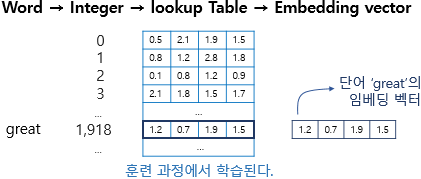

# AIFFEL_28일차 2020.09.01

Tags: AIFFEL_DAILY

### 일정

---

1. LMS E-9
2. cs231n Lecture 10  : RNN 시청, 발표준비(LSTM 부분)
3. 프로그래머스 session 6 완전 탐색 문제풀이

# [E-9] RNN으로 영화 리뷰 감성 분류하기

---

### 학습목표

---

- 텍스트 데이터를 머신러닝 입출력용 수치데이터로 변환하는 과정을 이해한다.
- RNN의 특징을 이해하고 시퀀셜한 데이터를 다루는 방법을 이해한다.
- 1-D CNN으로도 텍스트를 처리할 수 있음을 이해한다.
- IMDB와 네이버 영화리뷰 데이터셋을 이용한 감성분류 실습을 진행한다.

### 딥러닝을 이용한 텍스트 감성분석은 어떤 점에서 유용할까?

---

- 텍스트 데이터만이 가지고 있는 정보적 특성과 가치는 어떤 것일까요?
- 감성분석 등 텍스트 분류 모델이 다른 데이터분석 업무에 어떤 점에서 도움을 주나요?
- 텍스트 데이터 분석의 기술적 어려움은 무엇인가요?
- 텍스트 분류 작업을 하는데 딥러닝이 적용되면 어떤 점에서 유리해질까요?

---

[구매후기 한 줄에 고객의 이런 속마음이]

[https://dbr.donga.com/article/view/1202/article_no/8891/ac/magazine](https://dbr.donga.com/article/view/1202/article_no/8891/ac/magazine)

⇒ 온라인에 문자 형태로 표출된 개인의 '평가'나 '태도' 감성'과 같은 주관적 언어가 사람들의 의사결정에 중요한 정보의 원천이 된다. **실시간 트렌드**를 빠르게 반영하는 데이터이기도 함.

⇒ 특히 소셜데이터는 대중이 '자발적으로 표현한' '가공을 거치지 않은' '날것 그대로의' 정보에 가까워서 소비자의 욕구를 비교적 정확히 파악할 수 있다는 장점이 있다.

⇒ 별점은 종합적인 만족도만 나타내는 반면 문자로 표현된 상품형에는 어떤 속성이 마음에 들고, 어떤 속성이 실망스러운지 등과 같은 상세한 정보까지 포함하다 보니 그 분석의 깊이는 다를 수밖에 없다.

*텍스트 감성분석 접근법 1 : 머신러닝 기반*

⇒ 텍스트는 그 특성상 데이터의 구조가 희소하고, 차원의 수가 크기 때문에 전통적인 지도학습 기법을 적용할 경우 텍스트 처리의 효율성과 분석 성과를 높이기 위한 특성의 추출 및 선택 등의 변수 추출 과정이 매우 중요하다.

*텍스트 감성분석 접근법 2 : 감성사전 기반*

⇒ 그러나 이 과정은 많은 시간과 노력이 소요될 뿐만 아니라 분석의 성과를 어느 이상 높이는 데 한계가 있다는 문제가 있다.

⇒ 분석 대상에 따라 단어의 감성 점수가 달라질 수 있다.

⇒ 단순 긍부정을 넘어선 긍부정의 원인이 되는 대상 속성 기반의 감성 분석이 어려움.

*감성분석 등 텍스트 분류 모델이 다른 데이터분석 업무에 주는 도움*

쉽게 구할 수 있는 비정형데이터인 텍스트에 감성분석 기법을 적용하여 텍스트를 정형데이터로 가공 후 유용한 의사결정 보조자료로 활용 가능.

*딥러닝 접근법*

⇒ 이러한 과정 없이 단어의 특성을 저차원상의 실수 벡터값으로 나타내는 방법인 워드 임베딩 기법이 등장하면서 자연어를 다루는 연구 분야에서 많은 주목을 받고 있음.

⇒ 워드 임베딩 : 단어들의 의미가 유사할 경우 벡터 공간상에 가깝게 배치해 단어들 간의 어휘적 관계를 벡터로 표현하는 효과적인 단어 표현 방법.

⇒ DNN 를 기반으로 감성 분석을 수행할 경우, 기존의 전통적인 기계 학습의 분류기에 입력으로 사용되는 특성들의 차원 수가 많아졌을 때 성능이 저하되는 것을 보완할 수 있을 뿐 아니라 변수 추출 과정 없이 텍스트에서 자동으로 특성을 추출하기 때문에 감성 분석과 관련한 분야에서 활발히 연구되는 중임.

---

## 텍스트 데이터의 특징

---

- 텍스트를 어떻게 숫자 행렬로 표현할 수 있나요?
- 텍스트에는 순서가 중요합니다. 입력데이터의 순서를 인공지능 모델에 어떻게 반영해야 하나요?

### 텍스트를 숫자로 표현하기

---

텍스트의 중요한 특징은 그 자체로는 기호일 뿐이며, 텍스트가 내포하는 의미를 기호가 직접 내포하지 않는다는 점입니다.

```python
index_to_word={}  # 빈 딕셔너리를 만들어서

# 단어들을 하나씩 채워 봅니다. 채우는 순서는 일단 임의로 하였습니다. 그러나 사실 순서는 중요하지 않습니다. 
# <BOS>, <PAD>, <UNK>는 관례적으로 딕셔너리 맨 앞에 넣어줍니다. 
index_to_word[0]='<PAD>'  # 패딩용 단어
index_to_word[1]='<BOS>'  # 문장의 시작지점
index_to_word[2]='<UNK>'  # 사전에 없는(Unknown) 단어
index_to_word[3]='i'
index_to_word[4]='feel'
index_to_word[5]='hungry'
index_to_word[6]='eat'
index_to_word[7]='lunch'
index_to_word[8]='now'
index_to_word[9]='happy'

word_to_index={word:index for index, word in index_to_word.items()}

# 문장 1개를 활용할 딕셔너리와 함께 주면, 단어 인덱스 리스트로 변환해 주는 함수를 만들어 봅시다.
# 단, 모든 문장은 <BOS>로 시작하는 것으로 합니다. 
def get_encoded_sentence(sentence, word_to_index):
    return [word_to_index['<BOS>']]+[word_to_index[word] if word in word_to_index else word_to_index['<UNK>'] for word in sentence.split()]

print(get_encoded_sentence('i eat lunch', word_to_index))

# 여러 개의 문장 리스트를 한꺼번에 숫자 텐서로 encode해 주는 함수입니다. 
def get_encoded_sentences(sentences, word_to_index):
    return [get_encoded_sentence(sentence, word_to_index) for sentence in sentences]

# sentences=['i feel hungry', 'i eat lunch', 'now i feel happy'] 가 아래와 같이 변환됩니다. 
encoded_sentences = get_encoded_sentences(sentences, word_to_index)
print(encoded_sentences)

# 숫자 벡터로 encode된 문장을 원래대로 decode하는 함수입니다. 
def get_decoded_sentence(encoded_sentence, index_to_word):
    return ' '.join(index_to_word[index] if index in index_to_word else '<UNK>' for index in encoded_sentence[1:])  #[1:]를 통해 <BOS>를 제외

print(get_decoded_sentence([1, 3, 4, 5], index_to_word))

# 여러개의 숫자 벡터로 encode된 문장을 한꺼번에 원래대로 decode하는 함수입니다. 
def get_decoded_sentences(encoded_sentences, index_to_word):
    return [get_decoded_sentence(encoded_sentence, index_to_word) for encoded_sentence in encoded_sentences]

# encoded_sentences=[[1, 3, 4, 5], [1, 3, 6, 7], [1, 8, 3, 4, 9]] 가 아래와 같이 변환됩니다.
print(get_decoded_sentences(encoded_sentences, index_to_word))
```

### Embedding 레이어

---

우리가 하려는 것은 단어와, 그 단어의 의미를 나타내는 벡터를 짝짓는 것.

그래서 단어의 의미를 나타내는 벡터를 훈련 가능한 파라미터로 놓고 이를 딥러닝을 통해 학습해서 최적화.

Tensorflow, Pytorch 등의 딥러닝 프레임워크들은 이러한 의미벡터 파라미터를 구현한 Embedding 레이어를 제공



임베딩 레이어를 통해 word가 벡터화되는 과정

*pad_sequences

Tensorflow에서는 keras.preprocessing.sequence.pad_sequences라는 편리한 함수를 통해 문장 벡터 뒤에 패딩(<PAD>)을 추가하여 길이를 일정하게 맞춰주는 기능을 제공.

```python
import numpy as np
import tensorflow as tf

vocab_size = len(word_to_index)  # 위 예시에서 딕셔너리에 포함된 단어 개수는 10
word_vector_dim = 4    # 그림과 같이 4차원의 워드벡터를 가정합니다.

embedding = tf.keras.layers.Embedding(input_dim=vocab_size, output_dim=word_vector_dim, mask_zero=True)

# keras.preprocessing.sequence.pad_sequences를 통해 word vector를 모두 일정길이로 맞춰주어야 
# embedding 레이어의 input이 될 수 있음에 주의해 주세요. 
raw_inputs = np.array(get_encoded_sentences(sentences, word_to_index))
raw_inputs = keras.preprocessing.sequence.pad_sequences(raw_inputs,
                                                       value=word_to_index['<PAD>'],
                                                       padding='post',
                                                       maxlen=5)
output = embedding(raw_inputs)
print(output)
```

## 시퀀스 데이터를 다루는 RNN

---

RNN은 시퀀스(Sequence) 형태의 데이터를 처리하기에 최적인 모델로 알려져 있습니다.

시퀀스 데이터란 바로 입력이 시간축을 따라 발생하는 데이터

[ex] 특정 시점에 'I feel' 까지 입력받은 후, 이후에 어떤 단어가 올지 알 수 없음. hungry, happy, ... RNN이 이런 상황을 묘사하기에 가장 적당한 모델 구조를 가지고 있다!

⇒ RNN은 시간의 흐름에 따라 새롭게 들어오는 입력에 따라 변하는 현재 상태를 묘사하는 state machine으로 설계되었기 때문.


⇒ 직원이 이전 내용을 기억하지 못하여 손님이 계속 덧붙여서 이야기...!

---

[모두의 딥러닝 lecture12 : NN의 꽃 RNN 이야기]

([https://www.youtube.com/watch?time_continue=14&v=-SHPG_KMUkQ&feature=emb_logo](https://www.youtube.com/watch?time_continue=14&v=-SHPG_KMUkQ&feature=emb_logo))

현재 state가 그다음 계산에도 영향을 끼친다. (특정 시점에서 계산할 때, 이전 시점 계산의 영향을 받는다!) 그래서 시퀀셜 데이터 처리에 유리함.


$h_t$: 현재 state 를 계산한거, 다음 state 계산 시 '나 좀 사용해줘~!' 하고 전달되는거.


[ex] 네이버에서 홍콩 입력하면 그 다음 '김성훈' 이 추천되는 그런...

단어가 아닌, 글씨 level에서 예측하는 시스템을 RNN을 통해 구현할 수 있다는거지.


 $h_t = tanh(W_{hh}h_{t-1} + W_{xh}x_t)$

이 식을 풀어서 쓰자면,

1. 전 단계에서 계산된 벡터 값(state) $h_{t-1}$ 에 $W_{hh}$ (학습된 파라미터) 를 곱한 값과
2. 해당 단계의 input $x_t$ 에 $W_{xh}$ 를 곱한 값을 더하여
3. tanh activation function 에 집어넣어서 나온 값을 해당 단계의 결과값(state) $h_t$ 라고 한다.

그리고 이 과정을 반복하다보면, 결국 이전 단계의 state(h) 가 이후 단계에 영향을 끼치는 구조라고 볼 수 있다.

많은 경우에 vanilla RNN 을 쓰지 않고 LSTM 혹은 GRU 모델을 사용한다.

---

```python
vocab_size = 10  # 어휘 사전의 크기입니다(10개의 단어)
word_vector_dim = 4  # 어휘 사전의 크기입니다(10개의 단어)

model = keras.Sequential()
model.add(keras.layers.Embedding(vocab_size, word_vector_dim, input_shape=(None,)))
model.add(keras.layers.LSTM(8))   # 가장 널리 쓰이는 RNN인 LSTM 레이어를 사용하였습니다. 이때 LSTM state 벡터의 차원수는 8로 하였습니다. (변경가능)
model.add(keras.layers.Dense(8, activation='relu'))
model.add(keras.layers.Dense(1, activation='sigmoid'))  # 최종 출력은 긍정/부정을 나타내는 1dim 입니다.

model.summary()

```

### 꼭 RNN이어야 할까?

---

텍스트를 처리하기 위해 RNN이 아니라 1-D Convolution Neural Network(1-D CNN)을 사용할 수도 있습니다.

1-D CNN은 문장 전체를 한꺼번에 한 방향으로 길이 7짜리 필터로 스캐닝하면서 7단어 이내에서 발견되는 특징을 추출하여 그것으로 문장을 분류하는 방식으로 사용됩니다. 이 방식도 텍스트를 처리하는 데 RNN 못지않은 효율을 보여줍니다.

CNN 계열은 RNN 계열보다 병렬처리가 효율적이기 때문에 학습속도도 훨씬 빠르게 진행된다는 장점이 있습니다.

```python
vocab_size = 10  # 어휘 사전의 크기입니다(10개의 단어)
word_vector_dim = 4  # 어휘 사전의 크기입니다(10개의 단어)

model = keras.Sequential()
model.add(keras.layers.Embedding(vocab_size, word_vector_dim, input_shape=(None,)))
model.add(keras.layers.Conv1D(16, 7, activation='relu'))
model.add(keras.layers.MaxPooling1D(5))
model.add(keras.layers.Conv1D(16, 7, activation='relu'))
model.add(keras.layers.GlobalMaxPooling1D())
model.add(keras.layers.Dense(8, activation='relu'))
model.add(keras.layers.Dense(1, activation='sigmoid'))  # 최종 출력은 긍정/부정을 나타내는 1dim 입니다.

model.summary()

```

아주 간단히는 **GlobalMaxPooling1D() 레이어 하나**만 사용하는 방법도 생각해 볼 수 있습니다. 이 방식은 전체 문장 중에서 **단 하나의 가장 중요한 단어만 피처로 추출**하여 그것으로 문장의 긍정/부정을 평가하는 방식이라고 생각할 수 있는데, 의외로 성능이 잘 나올 수도 있습니다.

```python
vocab_size = 10  # 어휘 사전의 크기입니다(10개의 단어)
word_vector_dim = 4  # 어휘 사전의 크기입니다(10개의 단어)

model = keras.Sequential()
model.add(keras.layers.Embedding(vocab_size, word_vector_dim, input_shape=(None,)))
model.add(keras.layers.GlobalMaxPooling1D())
model.add(keras.layers.Dense(8, activation='relu'))
model.add(keras.layers.Dense(1, activation='sigmoid'))  # 최종 출력은 긍정/부정을 나타내는 1dim 입니다.

model.summary()
```

이 외에도 1-D CNN과 RNN 레이어를 섞어 쓴다거나

FFN(FeedForward Network) 레이어만으로 구성하거나,

혹은 최근 각광받고 있는 Transformer 레이어를 쓰는 등 매우 다양한 시도를 해볼 수 있습니다.

## IMDB 영화리뷰 감성분석

---

### 데이터셋 분석

---

```python
from __future__ import absolute_import, division, print_function, unicode_literals
import tensorflow as tf
from tensorflow import keras
import numpy as np

print(tf.__version__)
imdb = keras.datasets.imdb

# IMDB 데이터셋 다운로드 
(x_train, y_train), (x_test, y_test) = imdb.load_data(num_words=10000)
print("훈련 샘플 개수: {}, 테스트 개수: {}".format(len(x_train), len(x_test)))

# 이미 숫자로 encode된 텍스트 데이터
print(x_train[0])  # 1번째 리뷰데이터
print('라벨: ', y_train[0])  # 1번째 리뷰데이터의 라벨
print('1번째 리뷰 문장 길이: ', len(x_train[0]))
print('2번째 리뷰 문장 길이: ', len(x_train[1]))

# encode에 사용한 딕셔너리까지 함께 제공
word_to_index = imdb.get_word_index()
index_to_word = {index:word for word, index in word_to_index.items()}
print(index_to_word[1])     # 'the' 가 출력됩니다. 
print(word_to_index['the'])  # 1 이 출력됩니다.
```

word_to_index, index_to_word 보정 필요

***(PAD, BOS, UNK, UNUSED 키를 넣어줘야함.)***

```python
#실제 인코딩 인덱스는 제공된 word_to_index에서 index 기준으로 3씩 뒤로 밀려 있습니다.  
word_to_index = {k:(v+3) for k,v in word_to_index.items()}

# 처음 몇 개 인덱스는 사전에 정의되어 있습니다
word_to_index["<PAD>"] = 0
word_to_index["<BOS>"] = 1
word_to_index["<UNK>"] = 2  # unknown
word_to_index["<UNUSED>"] = 3

index_to_word[0] = "<PAD>"
index_to_word[1] = "<BOS>"
index_to_word[2] = "<UNK>"
index_to_word[3] = "<UNUSED>"

index_to_word = {index:word for word, index in word_to_index.items()}

print(index_to_word[1])     # '<BOS>' 가 출력됩니다. 
print(word_to_index['the'])  # 4 이 출력됩니다. 
print(index_to_word[4])     # 'the' 가 출력됩니다.
```

```python
# 숫자 벡터로 encode된 문장을 원래대로 decode하는 함수입니다. 
def get_decoded_sentence(encoded_sentence, index_to_word):
    return ' '.join(index_to_word[index] if index in index_to_word else '<UNK>' for index in encoded_sentence[1:])  #[1:]를 통해 <BOS>를 제외
```

encode 된 텍스트 decode 되는지 확인

```python
print(get_decoded_sentence(x_train[0], index_to_word))
print('라벨: ', y_train[0])  # 1번째 리뷰데이터의 라벨
```

문장 최대 길이 ***maxlen***의 값 설정도 전체 모델 성능에 영향을 미치게 됩니다.

이 길이도 적절한 값을 찾기 위해서는 전체 데이터셋의 분포를 확인해 보는 것이 좋습니다.

```python
total_data_text = list(x_train) + list(x_test)
# 텍스트데이터 문장길이의 리스트를 생성한 후
num_tokens = [len(tokens) for tokens in total_data_text]
num_tokens = np.array(num_tokens)
# 문장길이의 평균값, 최대값, 표준편차를 계산해 본다. 
print('문장길이 평균 : ', np.mean(num_tokens))
print('문장길이 최대 : ', np.max(num_tokens))
print('문장길이 표준편차 : ', np.std(num_tokens))

# 예를들어, 최대 길이를 (평균 + 2*표준편차)로 한다면,  
max_tokens = np.mean(num_tokens) + 2 * np.std(num_tokens)
maxlen = int(max_tokens)
print('pad_sequences maxlen : ', maxlen)
print('전체 문장의 {}%가 maxlen 설정값 이내에 포함됩니다. '.format(np.sum(num_tokens < max_tokens) / len(num_tokens)))
```

*유의사항

padding 방식을 문장 뒷쪽('post')과 앞쪽('pre') 중 어느쪽으로 하느냐에 따라 RNN을 이용한 딥러닝 적용 시 성능 차이가 발생한다.

⇒ 따라서, 두 가지 방식을 한번씩 다 적용해서 RNN을 학습시켜 보면서 그 결과를 비교해 보시기 바랍니다.

```python
x_train = keras.preprocessing.sequence.pad_sequences(x_train,
                                                        value=word_to_index["<PAD>"],
                                                        padding='post', # 혹은 'pre'
                                                        maxlen=maxlen)

x_test = keras.preprocessing.sequence.pad_sequences(x_test,
                                                       value=word_to_index["<PAD>"],
                                                       padding='post', # 혹은 'pre'
                                                       maxlen=maxlen)

print(x_train.shape)
```

### pre padding vs post padding in RNN

---

RNN은 입력데이터가 순차적으로 처리되어, 가장 마지막 입력이 최종 state 값에 가장 영향을 많이 미치게 됩니다.

⇒ 그러므로 마지막 입력이 무의미한 padding으로 채워지는 것은 비효율적입니다. 따라서 'pre'가 훨씬 유리하며, 10% 이상의 테스트 성능 차이를 보이게 됩니다.

### 딥러닝 모델 설계와 훈련

---

모델 설계 (이전 스텝 코드 복붙)

```python
vocab_size = 10000    # 어휘 사전의 크기입니다(10,000개의 단어)
word_vector_dim = 16  # 워드 벡터의 차원수 (변경가능한 하이퍼파라미터)

# model 설계 - 딥러닝 모델 코드를 직접 작성해 주세요.
model = keras.Sequential()
# [[YOUR CODE]]

model.add(keras.layers.Embedding(vocab_size, word_vector_dim, input_shape=(None,)))
model.add(keras.layers.LSTM(8))   # 가장 널리 쓰이는 RNN인 LSTM 레이어를 사용하였습니다. 이때 LSTM state 벡터의 차원수는 8로 하였습니다. (변경가능)
model.add(keras.layers.Dense(8, activation='relu'))
model.add(keras.layers.Dense(1, activation='sigmoid'))  # 최종 출력은 긍정/부정을 나타내는 1dim 입니다.

model.summary()
```

데이터 셋 분리 : train, validation

```python
# validation set 10000건 분리
x_val = x_train[:10000]   
y_val = y_train[:10000]

# validation set을 제외한 나머지 15000건
partial_x_train = x_train[10000:]  
partial_y_train = y_train[10000:]

print(partial_x_train.shape)
print(partial_y_train.shape)

model.compile(optimizer='adam',
              loss='binary_crossentropy',
              metrics=['accuracy'])
              
epochs=20  # 몇 epoch를 훈련하면 좋을지 결과를 보면서 바꾸어 봅시다. 

history = model.fit(partial_x_train,
                    partial_y_train,
                    epochs=epochs,
                    batch_size=512,
                    validation_data=(x_val, y_val),
                    verbose=1)
```

test set 으로 평가

```python
results = model.evaluate(x_test,  y_test, verbose=2)

print(results)
```

history 에 저장된 값을 그래프로 그려보고 학습이 잘 되었는지, 오버피팅 혹은 언더피팅 하지 않았는지 등등 파악 가능. 성능을 개선할 수 있는 다양한 아이디어를 얻을 수 있다.

```python
history_dict = history.history
print(history_dict.keys()) # epoch에 따른 그래프를 그려볼 수 있는 항목들

import matplotlib.pyplot as plt

acc = history_dict['accuracy']
val_acc = history_dict['val_accuracy']
loss = history_dict['loss']
val_loss = history_dict['val_loss']

epochs = range(1, len(acc) + 1)

# "bo"는 "파란색 점"입니다
plt.plot(epochs, loss, 'bo', label='Training loss')
# b는 "파란 실선"입니다
plt.plot(epochs, val_loss, 'b', label='Validation loss')
plt.title('Training and validation loss')
plt.xlabel('Epochs')
plt.ylabel('Loss')
plt.legend()

plt.show()
```


loss를 비교한 그래프. 16까지가 적당해보인다.

validation loss의 그래프가 train loss와의 이격이 발생하게 되면 더이상의 트레이닝은 무의미해지게 마련입니다.

Training and validation accuracy를 그려 보아도 유사한 인사이트를 얻을 수 있습니다.

```python
plt.clf()   # 그림을 초기화합니다

plt.plot(epochs, acc, 'bo', label='Training acc')
plt.plot(epochs, val_acc, 'b', label='Validation acc')
plt.title('Training and validation accuracy')
plt.xlabel('Epochs')
plt.ylabel('Accuracy')
plt.legend()

plt.show()
```


accuracy를 비교한 그래프. 역시 16이 적절해보인다.

### Word2Vec의 적용

---

***워드 임베딩(word embedding) 기법***

라벨링 비용이 많이 드는 머신러닝 기반 감성분석의 비용을 절감하면서 정확도를 크게 향상시킬 수  있는 자연어처리 기법으로 단어의 특성을 저차원 벡터값으로 표현할 수 있음.

 

위에서 사용한 Embedding 레이어를 사용했지? 그게 워드 임베딩 사용한거임.

⇒ '우리가 가진 사전의 단어 개수 * 워드벡터' 만큼의 크기를 가진 학습 파라미터.

⇒ 만약 학습이 잘 되었다면, Embedding 레이어에 학습된 워드 벡터들도 의미 공간상에 유의미한 형태로 학습되었을 것.

 *gensim : 워드벡터를 다루는데 유용한 패키지

```python
embedding_layer = model.layers[0]
weights = embedding_layer.get_weights()[0]
print(weights.shape)    # shape: (vocab_size, embedding_dim)

import os

# 학습한 Embedding 파라미터를 파일에 써서 저장합니다. 
word2vec_file_path = os.getenv('HOME')+'/aiffel/sentiment_classification/word2vec.txt'
f = open(word2vec_file_path, 'w')
f.write('{} {}\n'.format(vocab_size-4, word_vector_dim))  # 몇개의 벡터를 얼마 사이즈로 기재할지 타이틀을 씁니다.

# 단어 개수(에서 특수문자 4개는 제외하고)만큼의 워드 벡터를 파일에 기록합니다. 
vectors = model.get_weights()[0]
for i in range(4,vocab_size):
    f.write('{} {}\n'.format(index_to_word[i], ' '.join(map(str, list(vectors[i, :])))))
f.close()
```

gensim에서 제공하는 패키지를 이용해, 위에 남긴 임베딩 파라미터를 읽어서 word vector로 활용할 수 있음.

```python
from gensim.models.keyedvectors import Word2VecKeyedVectors

word_vectors = Word2VecKeyedVectors.load_word2vec_format(word2vec_file_path, binary=False)
vector = word_vectors['computer']
vector
```

워드 벡터가 의미벡터 공간상에 유의미하게 학습되었는지 확인하는 방법 중에, 단어를 하나 주고 그와 가장 유사한 단어와 그 유사도를 확인하는 방법이 있음.

⇒ gensim 패키지 활용하여...

```python
word_vectors.similar_by_word("love")
```

⇒ 별로 안 괜찮아보임

⇒ 그러면, 이미 사전학습된 워드 임베딩 모델을 써보자 (구글 Word2Vec)

---

Q. 사전에 학습된 Word2Vec 등의 임베딩 모델을 활용하는 전이학습(Transfer Learning)이 유리한 이유?

[https://ratsgo.github.io/natural language processing/2019/09/12/embedding/](https://ratsgo.github.io/natural%20language%20processing/2019/09/12/embedding/)

**임베딩(embedding**)

자연어를 숫자의 나열인 벡터로 바꾼 결과 혹은 그 일련의 과정 전체를 가리키는 용어입니다. 단어나 문장 각각을 벡터로 변환해 벡터 공간에 ‘끼워 넣는다(embed)’는 취지에서 임베딩이라는 이름이 붙었습니다. 컴퓨터가 자연어를 처리할 수 있게 하려면 자연어를 계산 가능한 형식인 임베딩으로 바꿔줘야 합니다.

***전이 학습(transfer learning)***

특정 문제를 풀기 위해 학습한 모델을 다른 문제를 푸는 데 재사용하는 기법.

사람은 무언가를 배울 때 제로 베이스에서 시작하지 않습니다.

사람이 새로운 사실을 빠르게 이해할 수 있는 이유는 그가 이해를 하는 데에 평생 쌓아 온 지식을 동원하기 때문입니다.

자연어 처리 모델 역시 제로에서 시작하지 않습니다. 우선 대규모 말뭉치를 학습시켜 임베딩을 미리 만들어 놓습니다(프리트레인).

***이 임베딩에는 의미, 문법 정보가 녹아 있습니다.*** 

이후 임베딩을 포함한 모델 전체를 문서 분류 과제에 맞게 업데이트합니다(파인 튜닝).

이로써 전이 학습 모델은 **제로부터 학습한 모델보다 문서 분류 과제를 빠르게 잘 수행할 수 있음.**

---

Word2Vec에서 제공하는 워드 임베딩 벡터들끼리는 의미적 유사도가 가까운 것이 서로 가깝게 제대로 학습된 것을 확인할 수 있습니다.

```python
vocab_size = 10000    # 어휘 사전의 크기입니다(10,000개의 단어)
word_vector_dim = 300  # 워드 벡터의 차원수 (변경가능한 하이퍼파라미터)

embedding_matrix = np.random.rand(vocab_size, word_vector_dim)

# embedding_matrix에 Word2Vec 워드벡터를 단어 하나씩마다 차례차례 카피한다.
for i in range(4,vocab_size):
    if index_to_word[i] in word2vec:
        embedding_matrix[i] = word2vec[index_to_word[i]]

import tensorflow as tf
from tensorflow import keras
from keras.initializers import Constant

vocab_size = 10000    # 어휘 사전의 크기입니다(10,000개의 단어)
word_vector_dim = 300  # 워드 벡터의 차원수 (변경가능한 하이퍼파라미터)

# 모델 구성
model = keras.Sequential()
model.add(keras.layers.Embedding(vocab_size, 
                                 word_vector_dim, 
                                 embeddings_initializer=Constant(embedding_matrix),  # 카피한 임베딩을 여기서 활용
                                 input_length=maxlen, 
                                 trainable=True))   # trainable을 True로 주면 Fine-tuning
model.add(keras.layers.Conv1D(16, 7, activation='relu'))
model.add(keras.layers.MaxPooling1D(5))
model.add(keras.layers.Conv1D(16, 7, activation='relu'))
model.add(keras.layers.GlobalMaxPooling1D())
model.add(keras.layers.Dense(8, activation='relu'))
model.add(keras.layers.Dense(1, activation='sigmoid')) 

model.summary()

# 학습의 진행
model.compile(optimizer='adam',
              loss='binary_crossentropy',
              metrics=['accuracy'])
              
epochs=20  # 몇 epoch를 훈련하면 좋을지 결과를 보면서 바꾸어 봅시다. 

history = model.fit(partial_x_train,
                    partial_y_train,
                    epochs=epochs,
                    batch_size=512,
                    validation_data=(x_val, y_val),
                    verbose=1)

# 테스트셋을 통한 모델 평가
results = model.evaluate(x_test,  y_test, verbose=2)

print(results)

# 782/782 - 14s - loss: 0.5189 - accuracy: 0.8618
# [0.5188592076301575, 0.861840009689331]
```

⇒ Word2Vec을 정상적으로 잘 활용하면 그렇지 않은 경우보다 5% 이상의 성능향상이 발생

## 프로젝트 : 네이버 영화리뷰 감성분석 도전하기

---

결과물 : [https://github.com/bluecandle/2020_AIFFEL/blob/master/daily_notes/exploration_codes/e9_code/E9.ipynb](https://github.com/bluecandle/2020_AIFFEL/blob/master/daily_notes/exploration_codes/e9_code/E9.ipynb)