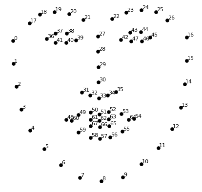

# AIFFEL_30일차 2020.09.03

Tags: AIFFEL_DAILY

### 특이사항

---

출석 사진을 정해진 시간 (과정이 시작되고 끝나는 시간) 마다 카메라에 비치는 본인 얼굴 및 시간이 보이도록 스크린샷을 찍어야함. 업로드하는건 하루 마무리할때 한번에 하더라도 ㅇㅇ

### 일정

---

1. LMS E-10
2. 코딩마스터 Session6 문제풀이

# [E-10]카메라 스티커앱 만들기 첫걸음

---

## 학습 목표

---

1. 카메라앱 만들기를 통해 **동영상 처리, 검출, 키포인트 추정, 추적, 카메라 원근** 의 기술을 다룹니다.
2. 간단한 스티커부터 시작해서 각도 변화가 가능하고 거리 변화에 강건한 스티커 까지 만들 수 있습니다.
3. 얼굴인식 카메라의 흐름을 이해
4. dlib 라이브러리 사용
5. 이미지 배열의 인덱싱 예외 처리

## 사진 준비하기

---

### 랜드마크 , 조정

---

스티커를 세밀하고 자연스럽게 적용하기 위해 눈,코,입,귀와 같은 얼굴 각각의 위치를 아는 것이 중요.

이 위치들을 찾아내는 기술을 랜드마크 또는 조정이라고 함.

두 가지를 포함하는 상위개념으로 ***keypoint detection*** 이라는 개념도 있음.

```python
import os
my_image_path = os.getenv('HOME')+'/aiffel/camera_sticker/images/image.jpeg'
img_bgr = cv2.imread(my_image_path)    #- OpenCV로 이미지를 읽어서
img_bgr = cv2.resize(img_bgr, (640, 360))    # 640x360의 크기로 Resize
img_show = img_bgr.copy()      #- 출력용 이미지 별도 보관
plt.imshow(img_bgr)
plt.show()

# 읽어들이면, 이상하게 파랗게 나옴!
# opencv가 예외적으로 RGB 가 아닌 BGR 로 색 처리를 한다고함 .
# 그래서 색감 바꿔주기 해야함!
# plt.imshow 이전에 RGB 이미지로 바꾸는 것을 잊지마세요. 
img_rgb = cv2.cvtColor(img_bgr, cv2.COLOR_BGR2RGB)
plt.imshow(img_rgb)
plt.show()
```

opencv 란??

아주 강력하고 방대한 기능을 갖춘 컴퓨터 비전 라이브러리입니다. 영상 관련 업계 표준 라이브러리의 지위를 가지고 있다고 할 수 있겠습니다.

## 얼굴 검출 face detection

---

Object detection 기술을 이용해서 얼굴의 위치를 찾겠습니다. 이번 시간에는 빠르게 만들기 위해 학습 없이 공개되어 있는 패키지를 사용하겠습니다.

dlib 의 face detector는 ***HOG(Histogram of Oriented Gradient) feature***를 사용해서 SVM(Support Vector Machine)의 sliding window로 얼굴을 찾습니다.

---

[https://medium.com/@jongdae.lim/기계-학습-machine-learning-은-즐겁다-part-4-63ed781eee3c](https://medium.com/@jongdae.lim/%EA%B8%B0%EA%B3%84-%ED%95%99%EC%8A%B5-machine-learning-%EC%9D%80-%EC%A6%90%EA%B2%81%EB%8B%A4-part-4-63ed781eee3c)

### 얼굴 인식은 일련의 여러가지 관련된 문제들을 해결하는 과정

1. 먼저 사진을 보고 그 안에 있는 모든 얼굴을 찾아야 합니다.

2. 둘째, 각 얼굴에 초점을 맞추고 얼굴이 이상한 방향으로 틀어졌거나 또는 조명이 안좋은 상황이라도, 여전히 같은 사람이라는 것을 이해할 수 있어야 합니다.

3. 셋째, 눈이 얼마나 큰지, 얼굴은 얼마나 긴지 등과 같이 다른 사람들과 구분하는데 사용하는 얼굴의 고유한 특징을 찾아 낼 수 있어야 합니다.

4. 마지막으로, 그 얼굴의 고유한 특징을 기존에 알고 있는 모든 사람들과 비교해서 그 사람의 이름을 결정해야 합니다.

이 모든 과정을 단계별로 수행하는 방법을 가르쳐야 한다!

⇒ 얼굴 인식을 분리해서 각 단계별로 문제를 해결하고, 현 단계의 결과를 다음 단계로 넘겨주는 경로(pipeline)를 만들어야 합니다. 다시 말해서, 몇가지 기계 학습 알고리즘을 함께 연결할 것임!

우리의 목표는 해당 픽셀이 이를 직접 둘러싸고 있는 픽셀들과 비교해서 얼마나 어두운지 알아내는 것입니다. 이를 통해서 이미지가 어두워지는 방향을 나타내는 화살표를 그리고자 합니다.

이미지의 모든 픽셀에 대해 이 프로세스를 반복하면 결국 모든 픽셀이 화살표로 바뀌게 됩니다. 이러한 화살표들을 그래디언트(gradients)라고 부르고, 이를 통해 **전체 이미지에서 밝은 부분으로부터 어두운 부분으로의 흐름**을 알 수 있습니다.

Q. 이미지에서 gradient를 feature로 사용하는 이유?

픽셀을 직접 분석하면, 동일한 사람의 정말 어두운 이미지와 정말 밝은 이미지는 전혀 다른 픽셀값을 갖게 될 것입니다. 그러나 밝기가 변하는 방향 만 고려하면 정말 어두운 이미지와 정말 밝은 이미지에 대한 완전히 동일한 표현(representation)을 얻게 됩니다. 이렇게 하면 문제를 훨씬 더 쉽게 해결할 수 있습니다!

Q. 단일 픽셀의 그래디언트를 사용하지 않고 16x16 의 정사각형을 이용하는 이유는?

든 단일 픽셀에 대해 그래디언트를 저장하면 너무 자세합니다. 이렇게 되면 결국 우리는 나무를 보고 숲을 보지 못하게 됩니다. 이미지의 기본 패턴을 알 수 있도록, 높은 수준에서 밝음/어둠의 기본 흐름만을 보는 것이 더 좋습니다.

---

```python
import dlib
detector_hog = dlib.get_frontal_face_detector()   #- detector 선언

img_rgb = cv2.cvtColor(img_bgr, cv2.COLOR_BGR2RGB)
dlib_rects = detector_hog(img_rgb, 1)   #- (image, num of img pyramid)
# dlib detector 는 dlib.rectangles 타입의 객체를 반환
# dlib.rectangles 는 dlib.rectangle 객체의 배열 형태로 이루어져 있음.
# dlib.rectangle객체는 left(), top(), right(), bottom(), height(), width() 등의 멤버 함수를 포함.
```

dlib.rectangle 참고 링크 : [http://dlib.net/python/index.html#dlib.rectangles](http://dlib.net/python/index.html#dlib.rectangles)

*num of img pyramid??

이미지를 upsampling 방법을 통해 크기를 키우는 것을 이미지 피라미드라고 합니다.

이미지 피라미드에서 얼굴을 다시 검출하면 작게 촬영된 얼굴을 크게 볼 수 있기 때문에 더 정확한 검출이 가능합니다.

관련 링크 : [https://opencv-python.readthedocs.io/en/latest/doc/14.imagePyramid/imagePyramid.html](https://opencv-python.readthedocs.io/en/latest/doc/14.imagePyramid/imagePyramid.html)

일반적으로는 고정된 이미지 사이즈를 작업을 하지만, 때때로 동일한 이미지에 대해서 다양한 사이즈를 가지고 작업을 해야 하는 경우가 있습니다. 만일, 이미지에서 얼굴을 찾을 경우에 얼굴의 사이즈를 확신할 수 없습니다. 이럴 경우에는 원본 이미지에 대한 다양한 사이즈에서 얼굴을 찾는다면 좀더 정확하고 확실한 이미지를 찾을 수 있습니다. 이 처럼 동일 이미지의 서로 다른 사이즈의 set을 Image Pyramids라고 합니다.(가장 아래에 가장 큰 해상도를 놓고 점점 줄여가면서 쌓아가는 형태입니다.)

```python
print(dlib_rects)   # 찾은 얼굴영역 좌표

for dlib_rect in dlib_rects:
    l = dlib_rect.left()
    t = dlib_rect.top()
    r = dlib_rect.right()
    b = dlib_rect.bottom()

    cv2.rectangle(img_show, (l,t), (r,b), (0,255,0), 2, lineType=cv2.LINE_AA)

img_show_rgb =  cv2.cvtColor(img_show, cv2.COLOR_BGR2RGB)
plt.imshow(img_show_rgb)
plt.show()
```

## 얼굴 랜드마크 face landmark

---

이목구비의 위치를 추론하는 것을 face landmark localization 기술.

face landmark는 detection 의 결과물인 bounding box 로 잘라낸(crop) 얼굴 이미지를 이용

(초록색 사각형)

### object keypoint estimation 알고리즘

---

***Face landmark와 같이 객체 내부의 점을 찾는 기술을 object keypoint estimation 이라고 함.***

그리고 크게 두 가지로 나뉨.

1. top-down : bounding box를 찾고 box 내부의 keypoint를 예측 ( 말 그대로 그림 전체에서 세부사항)
2. bottom-up : 이미지 전체의 keypoint를 먼저 찾고 point 관계를 이용해 군집화 해서 box 생성 ( 말 그대로 세부사항에서 그림 전체)

해당 학습 과정에서는 1번 방식.

### Dlib landmark localization

---



Dlib에 사용되는 랜드마크 순서

물론, 점의 개수는 데이터셋과 논문마다 다름.

Dlib은 ibug 300-W 데이터셋([https://ibug.doc.ic.ac.uk/resources/facial-point-annotations/](https://ibug.doc.ic.ac.uk/resources/facial-point-annotations/))

으로 학습한 pretrained model 을 제공

---

⇒ 자세한 내용은 2014년 CVPR (Computer Vision and Pattern Recognition) 에 발표한 논문 'One Millisecond Face Alignment with an Ensemble of Regression Trees'

⇒ [https://www.cv-foundation.org/openaccess/content_cvpr_2014/papers/Kazemi_One_Millisecond_Face_2014_CVPR_paper.pdf](https://www.cv-foundation.org/openaccess/content_cvpr_2014/papers/Kazemi_One_Millisecond_Face_2014_CVPR_paper.pdf)

[Kazemi_One_Millisecond_Face_2014_CVPR_paper.pdf](images/Kazemi_One_Millisecond_Face_2014_CVPR_paper.pdf)

***Abstract***

An ensemble of regression trees can be used to estimate the face’s landmark positions
directly from a sparse subset of pixel intensities, achieving super-realtime performance with high quality predictions.
We present a general framework based on gradient boosting for learning an ensemble of regression trees that optimizes the sum of square error loss and naturally handles missing
or partially labelled data. 
We show how using appropriate priors exploiting the structure of image data helps with ef-
ficient feature selection. Different regularization strategies and its importance to combat overfitting are also investigated.
In addition, we analyse the effect of the quantity of training data on the accuracy of the predictions and explore the effect of data augmentation using synthesized data.

```python
list_landmarks = []
for dlib_rect in dlib_rects:

# landmark_predictor 는 RGB 이미지와 dlib.rectangle을 입력 받아
# dlib.full_object_detection 를 반환.
    points = landmark_predictor(img_rgb, dlib_rect)
# points 는 dlib.full_object_detection 의 객체이기 때문에
# parts()함수로 개별 위치에 접근할 수 있습니다.
		list_points = list(map(lambda p: (p.x, p.y), points.parts()))    
		list_landmarks.append(list_points)

# list_points 는 tuple (x, y) 68개로 이루어진 리스트
print(len(list_landmarks[0]))
```

랜드마크 영상에 출력

```python
for landmark in list_landmarks:
    for idx, point in enumerate(list_points):
        cv2.circle(img_show, point, 2, (0, 255, 255), -1) # yellow

img_show_rgb = cv2.cvtColor(img_show, cv2.COLOR_BGR2RGB)
plt.imshow(img_show_rgb)
plt.show()
```

## 스티커 적용하기

---

중요한 것은 얼굴 위치, 카메라의 거리에 따라 픽셀 **`x`** 가 다르기 때문에 ***비율로 계산***을 해줘야 합니다. 계산할 수치는 두 가지 입니다.

1. 스티커 위치

$\begin{aligned} x &= x_{nose} \\ y &= y_{nose}-\frac{width}{2} \end{aligned}$

2. 스티커 크기

$width=height=width_{bbox}$

우선, 중심점 확인해보기

```python
for dlib_rect, landmark in zip(dlib_rects, list_landmarks):
    print (landmark[30]) # nose center index : 30
    x = landmark[30][0]
    y = landmark[30][1] - dlib_rect.width()//2
    w = dlib_rect.width()
    h = dlib_rect.width()
    print ('(x,y) : (%d,%d)'%(x,y))
    print ('(w,h) : (%d,%d)'%(w,h))
```

스티커(왕관) 이미지 읽기

```python
import os
sticker_path = os.getenv('HOME')+'/aiffel/camera_sticker/images/king.png'
img_sticker = cv2.imread(sticker_path)
img_sticker = cv2.resize(img_sticker, (w,h))
print (img_sticker.shape)
```

원본 이미지에 스티커 이미지를 추가하기 위해 x,y 좌표를 조정

```python
refined_x = x - w // 2  # left
refined_y = y - h       # top
print ('(x,y) : (%d,%d)'%(refined_x, refined_y))
```

⇒ 계산하면 y 좌표가 음수가 나옴!

⇒ 음수는 이미지상으로는 이미지 범위 밖임을 의미!

⇒ 근데, opencv 데이터가 numpy ndarray 형태의 데이터를 사용하고, ndarray는 음수 인덱스에 접근이 불가하기 때문에, 음수에 대한 예외처리가 필요!

`-y` 크기만큼 스티커를 crop 합니다.

```python
img_sticker = img_sticker[-refined_y:]
print (img_sticker.shape)
```

top 의 y 좌표는 원본 이미지의 경계 값으로 수정

```python
refined_y = 0
print ('(x,y) : (%d,%d)'%(refined_x, refined_y))

```

원본 이미지에 스티커를 적용

```python
# sticker_area는 원본이미지에서 스티커를 적용할 위치를 crop한 이미지
sticker_area = img_show[refined_y:img_sticker.shape[0], refined_x:refined_x+img_sticker.shape[1]]
img_show[refined_y:img_sticker.shape[0], refined_x:refined_x+img_sticker.shape[1]] = \
    np.where(img_sticker==0,sticker_area,img_sticker).astype(np.uint8)
```

스티커 이미지에서 사용할 부분은 0 이 아닌 색이 있는 부분을 사용합니다. 따라서 np.where를 통해 img_sticker 가 0 인 부분은 sticker_area를 사용하고 0이 아닌 부분을 img_sticker를 사용하시면 됩니다.

⇒ 이미지에서 스티커가 들어갈 부분의 이미지를 잘라낸 후,

⇒ 해당 영역에 스티커 이미지를 올려본다.

⇒ 각 픽셀에 대해 스티커 이미지 픽셀이 0 (색이 없는 부분) 이면, 원래 이미지의 픽셀을 사용하고, 아니라면 스티커 이미지 픽셀을 넣어서 스티커가 표시되도록 하는것!

이미지 출력

```python
plt.imshow(cv2.cvtColor(img_show, cv2.COLOR_BGR2RGB))
plt.show()
```

boundbox, landmark 제거

---

```python
sticker_area = img_bgr[refined_y:img_sticker.shape[0], refined_x:refined_x+img_sticker.shape[1]]
img_bgr[refined_y:img_sticker.shape[0], refined_x:refined_x+img_sticker.shape[1]] = \
    np.where(img_sticker==0,sticker_area,img_sticker).astype(np.uint8)
plt.imshow(cv2.cvtColor(img_bgr, cv2.COLOR_BGR2RGB))
plt.show()
```

## 프로젝트: 고양이 수염 스티커 만들기

---

결과물 : [https://github.com/bluecandle/2020_AIFFEL/blob/master/daily_notes/exploration_codes/e10_code/E10.ipynb](https://github.com/bluecandle/2020_AIFFEL/blob/master/daily_notes/exploration_codes/e10_code/E10.ipynb)

# 코딩마스터 Session6 문제풀이

---

[https://github.com/bluecandle/2020_AIFFEL/tree/master/coding_master/Session6_Complete_Search](https://github.com/bluecandle/2020_AIFFEL/tree/master/coding_master/Session6_Complete_Search)