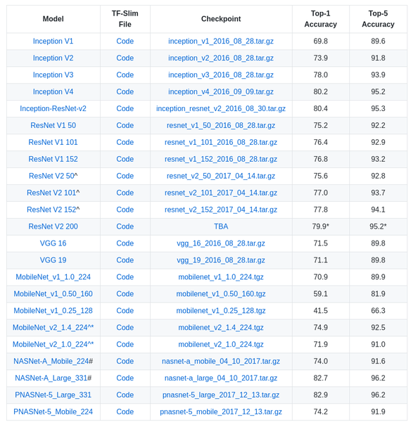

# AIFFEL_31일차 2020.09.04

Tags: AIFFEL_DAILY

### 일정

---

1. LMS F-28
2. 코딩마스터 Sessoin 6 문제풀이 마무리
3. 풀잎글쓰기
4. cs231n lecture 11 듣기

# [F-28] 딥네트워크, 서로 뭐가 다른거죠?

---



Pretrained models

## **실습목표**

---

1. 딥러닝 네트워크들을 동물원 구경하듯 둘러봅니다. (**Model Zoo**라고도 하죠)
2. 딥러닝이 어떻게 시작된 것인지 알아봅니다.
3. ResNet과 VGG는 무엇을 시도했는지 알아봅니다.

## top-5 error, top-1 error

---

[https://bskyvision.com/422](https://bskyvision.com/422)

[ex]
{고양이, 강아지, 집, 축구공, 사자}와 같이 5개의 클래스 라벨을 가지고 훈련된 분류기가 있다고 가정해보자. 새로운 이미지를 이 분류기에 입력해줬는데, 0.1, 0.6, 0.05, 0.05, 0.2와 같은 결과를 냈다.
새로운 이미지가 강아지일 확률이 가장 높다고 판단한 것이다.
이때 top-1 class는 {강아지}가 된다. 그리고 top-2 class는 {강아지, 사자}가 된다.

예측한 클래스, 즉 top-1 class가 실제 클래스와 같다면 이때 top-1 error는 0%가 된다.

분류기가 높은 확률로 예측한 상위 5개의 클래스, 즉 top-5 class 중에 실제 클래스가 있다면, 이때 top-5 error는 0%가 된다.

클래스가 5개밖에 없다면 top-5 error는 무조건 0%일 것.

---

ImageNet 에 대한 이야기

[어떻게 컴퓨터가 사진을 이해하게 되었는가]

[https://www.ted.com/talks/fei_fei_li_how_we_re_teaching_computers_to_understand_pictures?language=ko#t-70215](https://www.ted.com/talks/fei_fei_li_how_we_re_teaching_computers_to_understand_pictures?language=ko#t-70215)

어떤 개인이나 단체가 다 볼 수 없는 규모의 사진과 동영상이 만들어지고 있다.

근데, 아직도 이걸 다 이해하고 관리하는데 문제가 있다!

Even the smarted machines are still blind.

눈에서 시작되지만, 결국 중요한 부분은 뇌 안쪽이다!

알고리즘에 주는 학습 데이터를 아이가 경험하는 것과 같이 만들어보자는 의도! 알고리즘을 더 좋게 만들려고 하지 않고! ⇒ 그래서 2007년에 ImageNet 프로젝트 시작

그리고 그 데이터를 통해 아이가 0세에서 3세로 가는 수준까지 만들었다... 단순히 명사를 뱉어낼 수 있는 수준! ex. 고양이!

⇒ 근데, 이걸 엮어서 문장으로 말하게 하는건 전혀 다른 영역이다!

⇒ 진짜 도전은 3살 에서 13살까지 나아가고, 그 이상으로 나아가는 것!

기계가 진정으로 볼 수 있게 된다면, 의사와 간호사가 쉬지 않는 기계 눈을 이용해 환자를 진단하고 돌볼 수 있게 될 것이다. 재난 지역에서 갇히고 부상당한 사람을 사람뿐만 아니라 기계가 함께 구하게 될 것이고, 새로운 개척지, 새로운 물질을 발견할 수 있을 것이다.

기계를 잘 가르친다면, 인간이 더 잘 볼 수 있도록 도와줄 것이다. 상상치 못했던 방식으로 기계와 협력하게 될 것이다!

---

[LeNet-5]([https://bskyvision.com/418](https://bskyvision.com/418))

⇒ 원래 논문 : Gradient-based learning applied to document recognition

[AlexNet]([https://bskyvision.com/421](https://bskyvision.com/421))

⇒ 원래 논문 : 

[](https://papers.nips.cc/paper/4824-imagenet-classification-with-deep-convolutional-neural-networks.pdf)

AlextNet에서 가장 깊게 실험된 조건은 7개의 CNN과 2개의 FCN을 사용했습니다.
논문의 Table 2.에서 해당 조건을 확인할 수 있는데 7개의 CNN 모델에는 pretraining을 적용했습니다.

overlapping 풀링이 top-1, top-5 에러율을 줄이는데 좀 더 효과가 있다고 한다.

### ***local response normalization (LRN)***

---

신경생물학에는 **lateral inhibition**이라고 불리는 개념이 있다. 활성화된 뉴런이 주변 이웃 뉴런들을 억누르는 현상을 의미한다.

lateral inhibition 현상을 모델링한 것이 바로 local response normalization이다.

강하게 활성화된 뉴런의 주변 이웃들에 대해서 normalization을 실행한다.

주변에 비해 어떤 뉴런이 비교적 강하게 활성화되어 있다면, 그 뉴런의 반응은 더욱더 돋보이게 될 것이다. 반면 강하게 활성화된 뉴런 주변도 모두 강하게 활성화되어 있다면, local response normalization 이후에는 모두 값이 작아질 것이다.

⇒ LRN 은 이후에는 잘 안쓰이게 된 개념! (batch norm 나오면서)

## CNN을 잘쓰자

---

### VGG net

---

[https://bskyvision.com/504](https://bskyvision.com/504)

VGG에서는 3x3 커널을 사용해서 더 많은 레이어를 쌓고 이미지의 비선형적 특성을 더 잘 잡아낼 수 있게 만들었어요.

VGGNet은 사용하기 쉬운 구조와 좋은 성능 덕분에 그 대회에서 우승을 거둔 조금 더 복잡한 형태의 GoogLeNet보다 더 인기를 얻었다. ( VGGNet 은 준우승 )

이 연구의 핵심은 네트워크의 깊이를 깊게 만드는 것이 성능에 어떤 영향을 미치는지를 확인하고자 한 것.


conv1_1, conv1_2와 conv2_1, conv2_2등으로 표현한 이유는 해상도를 줄여주는 최대 풀링 전까지의 층등을 한 모듈로 볼 수 있기 때문이다.

**14) 14층(fc1):** 7 x 7 x 512의 특성맵을 flatten 해준다. flatten이라는 것은 전 층의 출력을 받아서 단순히 1차원의 벡터로 펼쳐주는 것을 의미한다. 결과적으로 7 x 7 x 512 = 25088개의 뉴런이 되고, fc1층의 4096개의 뉴런과 fully connected 된다. 훈련시 dropout이 적용된다.

## Vanishing Gradient, Exploding Gradient

---

멀리서 말하는 사람의 목소리가 안 들리듯, 모델이 깊어질수록 모델의 학습을 위한 Gradient가 사라지는 현상이 발생.

우리의 네트워크는 Gradient descent를 통해서 기울기를 학습하는데 깊은 레이어에는 데이터에 따른 차이가 충분하게 반영되지 못합니다.

Gradient vanishing 또는 exploding의 문제가 발생하는 원인은, 레이어가 깊어지면서 Gradient가 매우 커지거나 작아지기 때문입니다.

레이어의 가중치가 반복되서 곱해지면, 1보다 작을 때에는 0에 너무 가까워져 버리고, 1보다 클 때에는 그 값이 기하급수적으로 커지게 됩니다.

활성함수를 변경하거나 가중치 초기화 방법을 통해 Gradient vanishing 해결이 가능하기도 하다 ㅇㅇ

[Vanishing/Exploding Gradients, Andrew Ng]

([https://www.youtube.com/watch?time_continue=5&v=qhXZsFVxGKo&feature=emb_logo&ab_channel=Deeplearning.ai](https://www.youtube.com/watch?time_continue=5&v=qhXZsFVxGKo&feature=emb_logo&ab_channel=Deeplearning.ai))

## ResNet

---

참고자료

[https://datascienceschool.net/view-notebook/958022040c544257aa7ba88643d6c032/](https://datascienceschool.net/view-notebook/958022040c544257aa7ba88643d6c032/)

지름길을 만들어주자!

Skip Connection은 아래처럼 레이어의 입력을 다른 곳에 이어서 Gradient가 깊은 곳까지 이어지도록 합니다. 아래 그림처럼 레이어와 Skip Connection이 있는 블록을 Residual Block이라고 합니다.

main path 를 따르는 대신 short cut( skip connection )을 통해 원래 input 이 지나갈 수 있는 길을 만들어준다.


residual block을 통해 더 깊은 네트워크를 학습시킬 수 있다는 것을 발견함!


⇒ 원래 층을 많이 쌓을수록 더 좋은 성능을 내는 것이 이론상 맞는데! 실제로 그냥 쌓아올리기만 하면, 오히려 성능이 더 떨어진다 ( train error 마저도 점점 상승함)

⇒ 근데, ResNet 구조를 사용하면 지속적으로 train error가 감소하더라.

### Why ResNets Work

---

[https://www.youtube.com/watch?v=RYth6EbBUqM&ab_channel=Deeplearning.ai](https://www.youtube.com/watch?v=RYth6EbBUqM&ab_channel=Deeplearning.ai)

훈련세트를 잘 다루는 것은 테스트나 다른 어떤 것에서 효과적이기 위한 전제 조건!

그런 맥락에서 ResNet을 훈련시켜 훈련 세트를 잘 다루는 것은 좋은 출발!


⇒ 밑에 수식을 잘 살펴보자!

## Model API (Tensorflow, Keras)

---

Tensorflow의 사전학습 모델(pre-trained model)들은 slim이라는 고수준 API로 구현되어있습니다.

[https://github.com/tensorflow/models](https://github.com/tensorflow/models)

[https://www.tensorflow.org/api_docs/python/tf/keras/applications](https://www.tensorflow.org/api_docs/python/tf/keras/applications)

[https://github.com/keras-team/keras-applications](https://github.com/keras-team/keras-applications)

Tensorflow가 편한 분들은 Tensorflow 구현으로 진행하셔도 무방합니다. 다만 Keras의 모델 구현이 간결해 초심자에게 유용하니 Keras로 프로젝트를 진행하는 것을 추천드립니다.

[https://github.com/tensorflow/tensorflow/blob/v2.2.0/tensorflow/python/keras/applications/vgg16.py#L39-L216](https://github.com/tensorflow/tensorflow/blob/v2.2.0/tensorflow/python/keras/applications/vgg16.py#L39-L216)

[https://github.com/tensorflow/tensorflow/blob/v2.2.0/tensorflow/python/keras/applications/resnet.py#L444-L463](https://github.com/tensorflow/tensorflow/blob/v2.2.0/tensorflow/python/keras/applications/resnet.py#L444-L463)

### VGG-16, ResNet

---

keras 구현 따라해보기

[https://github.com/keras-team/keras-applications/blob/master/keras_applications/vgg16.py](https://github.com/keras-team/keras-applications/blob/master/keras_applications/vgg16.py)

[https://github.com/keras-team/keras-applications/blob/master/keras_applications/resnet50.py](https://github.com/keras-team/keras-applications/blob/master/keras_applications/resnet50.py)


ResNet의 구조를 보면 색깔이 서로 다른 블록들이 있습니다. 이는 블록마다 feature의 크기가 서로 다르기 때문인데요.

```python
x = layers.add([x, input_tensor])
x = layers.Activation('relu')(x)

# input 을 그대로 더해주는 모습을 이렇게 구현했구나
# skip connection!
```

## 정리

---

사실 이 Project는 이렇게 복잡하지 않더라도 엄청난 효과를 가져올 수 있는 모델을 여러분도 직접 만들 수 있다는 자신감을 드리기 위해서 구성했습니다.

예를 들어, **skip connection이 분리되었다가 다시 합쳐지는 단순한 아이디어**는 구현도 간단합니다. 여러분도 생각한 아이디어를 모델에 추가하는데 도전해보시기 바랍니다.

# 코딩마스터 Sessoin 6 문제풀이 마무리

---

[https://github.com/bluecandle/2020_AIFFEL/tree/master/coding_master/Session6_Complete_Search](https://github.com/bluecandle/2020_AIFFEL/tree/master/coding_master/Session6_Complete_Search)

# cs231n lecture11

---

[CS231n 2017 lecture11 _ Detection and Segmentation](https://www.notion.so/CS231n-2017-lecture11-_-Detection-and-Segmentation-932114dfcb6d46d68b38129f209e2bd8)

# 풀잎글쓰기

---

[재택학습 정착기 : 뽀모도로 타이머, 듀얼모니터](https://www.notion.so/f2023f96457941da8ac4f4811fc27f6a)