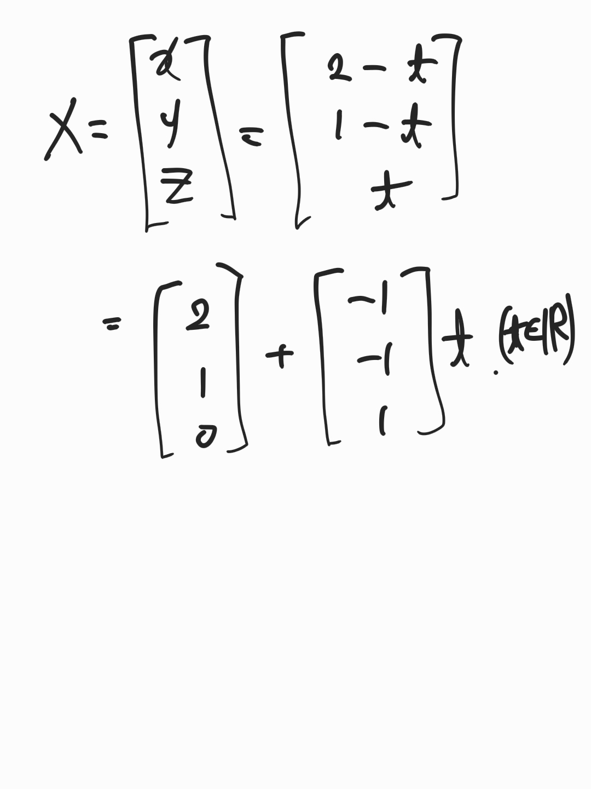
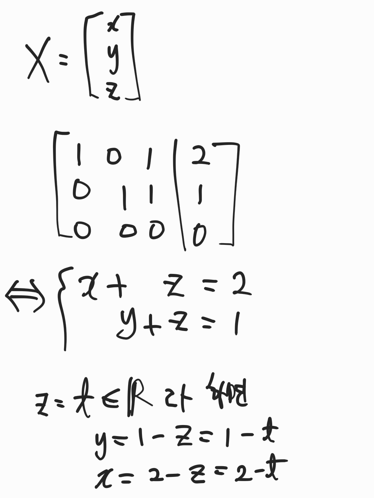
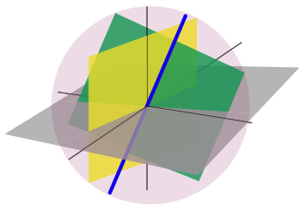

# AIFFEL_32일차 2020.09.07

Tags: AIFFEL_DAILY

### 일정

---

1. 풀잎스쿨 코딩마스터 Session6 : 완전탐색
2. LMS F-29
3. 데이콘 LGMB Bagging 앙상블 시도

# 풀잎스쿨 코딩마스터 Session6: 완전탐색

---

### defaultdict 사용해보기

```python
>>> from collections import defaultdict
>>> count = defaultdict(int)
>>> count
defaultdict(<class 'int'>, {})
>>> count[1]+=1
>>> count
defaultdict(<class 'int'>, {1: 1})
```

### timeit 다르게 사용해보기

```python
%timeit solution(~~)
```

### index 함수 더 잘 사용해보기

```python
i = somelist.index(x) if x in somelist else None
```

⇒ 이렇게 하면 찾고자 하는 요소가 없어도 에러를 발생시키지 않고, None 을 값으로 받을 수 있다

(그냥 index 함수 사용시에 찾고자 하는 요소가 없으면 에러가 발생되잖아)

### 에라토스테네스의 체

[https://ko.wikipedia.org/wiki/에라토스테네스의_체](https://ko.wikipedia.org/wiki/%EC%97%90%EB%9D%BC%ED%86%A0%EC%8A%A4%ED%85%8C%EB%84%A4%EC%8A%A4%EC%9D%98_%EC%B2%B4)

```python
def prime_list(n):
    # 에라토스테네스의 체 초기화: n개 요소에 True 설정(소수로 간주)
    sieve = [True] * n

    # n의 최대 약수가 sqrt(n) 이하이므로 i=sqrt(n)까지 검사
    m = int(n ** 0.5)
    for i in range(2, m + 1):
        if sieve[i] == True:           # i가 소수인 경우
            for j in range(i+i, n, i): # i이후 i의 배수들을 False 판정
                sieve[j] = False

    # 소수 목록 산출
    return [i for i in range(2, n) if sieve[i] == True]
```

### 백트래킹

---

절대로 안될것 같은 부분을 마주쳤을 때, 그 부분은 제외하고(즉, 가지치기를 하고) 문제를 푸는 것.

⇒ 무식하게 모든 경우의 수를 다 해보는 알고리즘과는 다르게 꽤 많은 불필요한 중복 탐색을 제거하게 됨.

### 다음 주 발표 해야함

주제 : 그리디 알고리즘

# [F-29] 선형대수 기초

---

대수학 : 간단히 말하자면 구조를 공부하는 학문. 구조...??

선형대수는 간단히 말하면 '행렬'에 대해 공부하는 학문.

그리고 행렬은 연립방적식을 푸는 과정에서 등장했다.

즉, m×n matrix는 $R^n$을 $R^m$으로 보내는 함수로 이해할 수 있어요.

이런 함수를 **일차변환**(Linear transformation)이라고 하구요.

$\begin{aligned}A: R^n &\to R^m\\x &\mapsto Ax\end{aligned}$

## **학습 목표**

---

### **선형대수**

1. 가우스 소거법을 이해하고 계산할 수 있다.
2. 벡터공간의 개념을 이해하고, 기저의 개념을 이해하고 계산할 수 있다.벡터공간의 대표적 예인 영공간, 열공간, 행공간의 개념을 이해할 수 있다.
3. 내적공간의 개념을 이해하고, 정규직교 기저를 계산할 수 있다.벡터를 부분공간에 정사영 시킨 벡터를 구할 수 있다.
4. 행렬식의 개념을 이해하고 계산할 수 있다.고윳값과 고유벡터를 이해하고 계산할 수 있다.고윳값분해를 확장시킨 특이값분해를 이해하고 계산할수 있다.

### **미적분학**

1. 합성함수 미분법을 이해하고 계산할 수 있다.
2. 그래디언트 벡터를 이용해 방향도함수를 계산할수 있다. 또한 그래디언트 벡터가 레벨셋과 수직임을 이해한다.

## 가우스 소거법

---

역행렬을 구하는 가장 실질적인 방법 중 하나.

가우스 소거법을 행렬분해로 나타낸 것이 LDU 분해(LDU factorization)

$\hspace{8mm} -x_2 -x_3  =-1  \hspace{5mm}\cdots\hspace{5mm}(1)
\\-x_1 +2x_2  +x_3  =0  \hspace{5mm}\cdots\hspace{5mm}(2)
\\3x_1 -x_2  +2x_3  = 5  \hspace{5mm}\cdots\hspace{5mm}(3)$

위 연립방정식에 대응하는 첨가행렬(Augmented matrix)은 다음과 같다.

$\left[\begin{matrix}0 & -1 & -1\\-1 & 2 & 1\\3 & -1 & 2\end{matrix}\left|\,\begin{matrix}-1\\0\\5\end{matrix}\right.\right]$

1. 첫 방적식을 $x_1$ 의 계수가 0이 아닌 것으로 택한다. 만약 0이면, 아닌 방정식을 찾아 위치를 교환. 그리고 상수배를 해주어 $x_1$ 의 계수를 1로 만든다. 이 계수를 ***피봇(pivot, leading 1)이라 한다.*** 만약 모든 방정식의 $x_1$ 의 계수가 0이면 다음 미지수로 넘어간다.
2. 첫 번째 방정식의 0 아닌 적당한 상수배를 아래 식들에 더해주어 아래 식들의 $x_1$ 계수를 0으로 만든다.
3. 첫 번째 식을 제외한 나머지 식을 가지고 1단계와 2단계를 모두 변수에 대해 반복 수행한다. 이때, 한 미지수의 계수가 나머지 모든 방정식에서 0이면 다음 미지수로 넘어간다.

$\left[\begin{matrix}1 & -2 & -1\\0 & 1 & 1\\0 & 0 & 0\end{matrix}\left|\,\begin{matrix}0\\1\\0\end{matrix}\right.\right]$

⇒ 이 과정을 통해 얻어진 상삼각행렬에 가까운 형태의 행렬을 ***사다리꼴 행렬(Row echolon form) 이라고*** 한다. 여기까지의 과정을 ***전진소거법(Forward elimination)*** 이라고 한다.

4. 아래 식을 위 식에 (위의 예에서는 중간 열을 맨 위 열에) 대입하여 피봇에 해당하는 변수에 대해 첨자가 큰 순서로 해를 찾아간다. 즉, 피봇에 해당하는 열에는 피봇을 제외한 모든 숫자가 0이 되도록 위쪽 방정식들의 계수를 0으로 만든다. 이 과정을 ***후진대입법(Backward substitution)***이라 한다.

$\left[\begin{matrix}1 & 0 & 1\\0 & 1 & 1\\0 & 0 & 0\end{matrix}\left|\,\begin{matrix}2\\1\\0\end{matrix}\right.\right]$

$\left\{
x=\begin{bmatrix}2\\1\\0\end{bmatrix}+\begin{bmatrix}-1\\-1\\1\end{bmatrix}t ~|~ t \in R
\right\}$ 에 대한 설명





피봇이 있는 열(위의 예에서는 맨 위 열)에 해당하는 변수를 **기본변수(Basic variable)**, 그렇지 않은 변수를 **자유변수(Free variable)**이라고 한다.

자유변수는 말 그대로 임의의 실수를 자유롭게 움직일 수 있고, 기본변수는 자유변수들에 의존.

[ A | I ]와 같이 왼쪽에 A, 오른쪽에 I를 둔 행렬을 만들고 두 행렬에 같은 기본행연산을 수행하여 왼쪽의 A를 I로 만들면 오른쪽의 I가 $A^{-1}$가 되고요.

즉, [ A | I ]가 [ I | $A^{-1}$]로 바뀌는 거죠.

$A=\begin{bmatrix}1 & 2 & 3\\2 & 3 & 5\\1 & 0 & 2\end{bmatrix}$

$A^{-1}=\begin{bmatrix}-6 & 4 & -1\\-1 & 1 & -1\\3 & -2 & 1\end{bmatrix}$

```python
import numpy as np

A = np.array([[1,2,3],[2,3,5],[1,0,2]])
np.linalg.inv(A)
```

## 벡터공간과 기저

---

### 벡터공간(Vector Space)

---

"벡터는 크기와 방향을 가진 양"

벡터들이 모여있는 공간을 벡터공간(Vector Space)라고 하는 것!

***가장 대표적인 예로는 n차원 유클리드 공간(Euclidean space) $R^n$ 이 있다.***

근데, 이 정의로 다룰 수 있는 벡터의 종류가 너무 한정되어 있다!

그래서 수학자들은 반대의 정의를 한다. 공간이 무엇인지를 추상적인 방법으로 정의하고 그 안의 원소들을 벡터라고 정의!

⇒ 이렇게 정의했을 때의 장점??

- 같은 선형대수 이론으로 $R^n$ 안의 벡터뿐만 아니라 $\cos x$, $\sin x$ 와 같은 함수들도 다룰 수 있게 된다.즉, 적당한 함수들을 모아놓은 공간도 벡터공간의 예가 된다

얼핏 보기에는 전혀 다른 대상인 것 같지만 만족하는 성질들 사이에는 어떤 공통점들이 있는데 이 성질들을 만족하는 집합이 주어졌을 때, 그 집합을 벡터공간이라고 부른다.

덧셈(Addition)과 상수곱(Scalar multiplication)이 있는 어떤 집합 V가 좋은 성질들을 만족할 때, V 를 벡터공간이라고 합니다.

원래 벡터공간은 어떤 스칼라(F)를 사용하느냐에 따라 여러가지가 있으나, 여러분들이 꼭 아셔야 할 만한 것 2개를 꼽자면 F=R 또는$F=\mathbb{C}$ 가 있고, 각각의 경우에 V를 **실(real) 벡터공간**, **복소(complex) 벡터공간** 이라고 부릅니다.

1. 덧셈이 있다는 말은 V의 두 벡터를 더하면, 다시 V의 벡터가 된다는 말이예요.
2. 상수곱이 있다는 말은 F 안의 스칼라와 V 안의 벡터를 곱하면, 다시 V의 벡터가 된다는 말이고요.

$\begin{aligned}
+: V\times V &\to V\\
(u, v) &\mapsto u+v
\end{aligned}$

$\begin{aligned}
\cdot: F \times V &\to V\\
(c, v) &\mapsto cv
\end{aligned}$

우리가 많이 다루면서도 $R^n$이 아닌 벡터공간에는 어떤 것들이 있을까요? 예를 들어 3차원 공간 $R^3$ 안에 있는 원점을 지나는 직선이나 평면도 벡터공간이 돼요.중요한 것은 반드시 원점을 지나야 한다는 거예요.



## 기저(Basis)

---

1. n의 벡터 $v_1, \cdots, v_n$ 가 V를 생성(Span, Generate)한다는 것:
    1.  V 안의 임의의 벡터 x를 $v_1, \cdots, v_n$ 의 일차결합(Linear combination), 즉 $x = c_1 v_1 + \cdots + c_n v_n$ 과 같은 형태로 나타낼 수 있다는 의미.
2. n개의 벡터 $v_1, \cdots, v_n$ 이 서로 (일차) 독립(Linearly independent)이라는 것:
    1. 비자명한(nontrivial) 일차결합으로는 절대 영벡터를 만들어낼수 없다는 의미.
    2. 즉, $c_i$ 중 하나라도 0이 아니라면 $c_1 v_1 + \cdots + c_n v_n \ne 0$ 이다.
    3. $c_1 v_1 + \cdots + c_n v_n =0 \qquad \Rightarrow \qquad c_i=0 \quad \forall i=0, \cdots, n$
3. n 개의 벡터 $v_1, \cdots, v_n$ 이 서로 독립이 아닐때, 종속(Linearly dependent)라고 해요.

### 정의 1

---

n개의 벡터 $v_1, \cdots, v_n$ (혹은 그 집합)가 ***V를 생성하면서 서로 독립***일때, 이를 **기저(Basis)**라고 한다.

[ex]

$V:=\{(x, y, z) \in R^3 ~|~ x-y-z=0\}$

집합 V의 기저는?

$(v_1, v_2)=((1, 1, 0), (1, 0, 1))$

**[생성]**

모든 (x,y,z)∈V에 대해 (x,y,z)=(y+z,y,z)=y(1,1,0)+z(1,0,1)=yv1+zv2 

**[독립]**

a(1,1,0)+b(1,0,1)=(a+b,a,b)=(0,0,0) 에서 (a,b)=(0,0).

### 정의 2

---

벡터공간 V의 **기저**는 매우 많을 수 있지만, 그중 **하나라도 유한집합**이라면 모든 기저의 원소 개수는 같고 이를 V의 차원(Dimension)이라 하며, 기호로는 **dim V**으로 나타낸다.

정리 1 : 서로 독립인 벡터들이 주어지면, 그 벡터들을 포함하는 기저가 존재한다.

정리 2 : 서로 종속인 벡터들이 주어지면, 그중 몇 개를 제거하여 기저로 만들 수 있다.

## 영공간, 열공간, 행공간

---

m x n 행렬 A에 대한 영공간, 열공간, 행공간.

수학에서는 주로 벡터를 행렬로 간주할 때, 행벡터가 아니라 열벡터로 간주한다.

$x=(x_1, \cdots, x_n) \in R$ 를 1 x n 행렬(행벡터) $\begin{bmatrix} x_1 \cdots x_n \end{bmatrix}$ 이 아니라,

n x 1 행렬(열벡터) $\begin{bmatrix}x_1 \\ \vdots \\ x_n\end{bmatrix}$ 로 본다는 것!

### 열공간

---

행렬 A의 열벡터들도 생성되는 $R^m$ 의 부분공간으로 정의된다.

$A=\begin{bmatrix}a_{11} & a_{12} & \cdots & a_{1n}\\
a_{21} & a_{22} & \cdots & a_{2n}\\
& & \ddots & \\
a_{m1} & a_{m2}& \cdots & a_{mn}\\
\end{bmatrix} = \begin{bmatrix} a_1 & a_2 & \cdots & a_n \end{bmatrix}$

와 같이 A의 열벡터들을 $a_j(1\le j \le n)$ 라고 놓으면

$Ax = \begin{bmatrix} a_1 & a_2 & \cdots & a_n \end{bmatrix} \begin{bmatrix} x_1 \\ x_2 \\ \vdots \\ x_n \end{bmatrix}
= x_1 a_1 + x_2 a_2 + \cdots + x_n a_n$

과 같이 표현되므로, 열공간은

$C(A) := \{ Ax \in R^m ~|~ x \in R \}$

이렇게 표현할 수 있다.

### 행공간

---

A의 행벡터들로 생성되는 $R^n$ 의 부분공간을 의미. 행을 열로 바꾸어준 전치행렬을 이용해서 표현해보면

$R(A) := C(A^T)$

이렇게 표현된다.

행공간과 열공간은 일반적으로 전혀 다르지만, 차원이 같다는 것을 증명할 수 있음.

이 값을 A의 랭크(Rank)라고 한다.

$rank A := \dim R(A) = \dim C(A)$

### 영공간

---

$N(A) := \{ x \in R ~|~ Ax=0 \}$

A를 $R^n$ 에서 $R^m$ 으로 가는 일차변환으로 봤을 때 상(image)이 영벡터가 되는 모든 벡터를 모아놓은 $R^n$ 의 부분공간이라는 의미.

어떤 벡터들이 서로 독립이냐 여부를 판별하는 것은 굉장히 중요한 문제!

열벡터 $a_1, \cdots, a_n$ 이 서로 독립인 것은 이것들을 모아 만든 행렬의 영공간이 자명(trivial)한 것과 동치가 된다.

## 내적공간

---

벡터공간에 추가적으로 내적(Inner product)이라 불리는 다음과 같은 성질을 만족하는 함수 

$<,> : V\times V \to R$ 가 존재.


우리가 잘 아는 내적 : $R^n$ 의 (standard) dot product

$<x, y> := x_1 y_1 + \cdots + x_n y_n$

⇒ 사실 $R^n$ 에 바로 이 내적이 주어졌을 때만 우리가 유클리드 공간이라고 부르는 것.

$R^n$ 의 일반적인 내적은 양의 정부호 행렬 (Positive definite matrix) A에 대해 

$<x, y>:= x^T A y$ 의 형태로 주어진다.

dot product는 A = I 인 특별한 경우.

### 그렇다면 내적의 의미는??

---

벡터들 사이의 ***거리*** 와 ***각도*** 를 재주는 역할을 하는 도구.

1. 거리
    1. 내적이 주어지면
    2. $|x|:=<x, x>$ 와 같이 정의할 수 있다.
2. 각도
    1. $\cos \theta := \frac{<x, y>}{|x||y|}$
    2. 두 벡터의 내적이 0이면 두 벡터는 서로 수직(orthogonal)이라고 한다.

### 정의 3

---

길이가 1이고 서로 수직인 벡터들로 이루어진 기저 ${u_1, \cdots, u_n}$ 를 ***정규직교(orthonormal) 기저*** 라고함.

⇒ 정규직교 기저는 중요한 역할을 한다!

**정리 3** : ${u_1, \cdots, u_n}$ 를 내적공간 V의 부분공간 U의 정규직교 기저라 하면, 임의의 $x \in U$ 에 대해 다음이 성립한다.

---

$x = <u_1, x>u_1 + \cdots + <u_k, x>u_k$

**정리 3-1** : 그람-슈미트 정규화(Gram-Schmidt Orthonormalization)

---

내적공간 V의 임의의 기저 ${x_1, \cdots, x_n}$ 가 주어졌을 때, 아래와 같은 작업을 수행하면 정규직교 기저 

${u_1, \cdots, u_n}$ 를 얻을 수 있다.

$\begin{aligned}&u_1 := \frac{x_1}{|x_1|}\\&u_k := \frac{x_k - < u_1, x_k >u_1 + \cdots + < u_{k-1}, x_k >u_{k-1}}{|x_k - < u_1, x_k >u_1 + \cdots + < u_{k-1}, x_k >u_{k-1}|}\\&(k=2, \cdots, n)\end{aligned}$

Q. 행렬 A에 대하여 열공간 C(A)의 정규직교 기저 3개를 각각 구해보세요

$A=\begin{bmatrix}1 & 1 & 2\\1 & 2 & 2\\1 & 0 & 4\\1 & 1 & 0\end{bmatrix}$

[정답]

$u_1 = \frac{1}{2}(1, 1, 1, 1) ,~   u_2 = \frac{1}{\sqrt{2}}(0, 1, -1, 0) ,~  u_3 = \frac{1}{\sqrt{6}}(0, 1, 1, -2)$


**정리 3-2**

---

${u_1, \cdots, u_k}$ 를 내적공간 V의 부분공간 U의 정규직교 기저라 하면, 임의의 $x \in V$ 에 대해 x를 U에 **정사영 (Orthogonal projection)**한 벡터 $Proj_U(x)$ 는 다음과 같이 나타낼 수 있다.

$Proj_U(x) = ~ < u_1, x >u_1 + \cdots + < u_k, x >u_k$

즉, 정사영하는 일차변환은 다음과 같다.

$Proj_U = u_1 u_1^T +\cdots + u_k u_k^T$

$Proj_U(x)$ 는 U에 있는 벡터 중에서 x에 가장 가까운 벡터라는 것이 중요하다.

Q. W를 $w_1=(1, 1, 2), w_2=(1, 1, -1)$ 로 생성된 $R^3$ 의 부분공간이라고 할 때, $x=(1, 3, -2)$ 에 대해 $x=(1, 3, -2)$ 를 구해보세요.

[답]

$Proj_W(x) = (2, 2, -2)$

[해설]

$u_1 = \frac{1}{\sqrt{6}}(1, 1, 2),~ u_2 = \frac{1}{\sqrt{3}}(1, 1, -1)$

$Proj_W(x) = ~ < u_1, x >u_1 + < u_2, x >u_2 = (2, 2, -2)$

## 행렬식

---

$A= \begin{bmatrix} a & b \\ c & d \end{bmatrix}$ 가 ***가역행렬이 되는 필요충분조건***이 $ad-bc\ne 0$ 임은 어렵지 않게 알 수 있다. 이 값을 A의 ***행렬식*** 이라고 부른다. $\det A=ad-bc$ 이렇게 나타냄.

행렬식의 의미??

기하학적 의미 : 부호가 있는 측도(signed measure)

$R^2$ 의 기본 단위벡터 $e_1 = (1,0), e_2 = (0,1)$ 를 일차변환 A로 옮기면 열벡터에 해당하는 $a_1 = (a,c), a_2 = (b,d)$ 가 된다.

$e_1, e_2$ 를 두 변으로 하는 정사각형의 넓이는 1이다.

$a_1, a_2$ 를 두 변으로 하는 평행사변형의 넓이가 $|\det A| = |ad-bc|$ 가 된다.

일반적으로 크기가 n인 정사각행렬 A의 행렬식의 값에 절댓값을 취하면 열벡터(혹은 행벡터)를 n개의 변으로 하는 일반화된 평행육면체(Generalized parallelopiped)의 일반화된 부피인 ***측도(Measure)***가 돼요.

Q. "크기가 n인 정사각행렬 A가 가역행렬이 되는 필요충분조건이 $\det A \ne 0$이 되도록 하는 A의 성분들의 다항식 $\det A$를 찾을 수 있겠는가?"

### 여인수 전개 (Cofactor expansion) 공식 : 행렬식을 구하는 방법.

---

$A_{ij}$ 라는 행렬은 원래의 행렬에서 i행, j열을 제거하고 얻어진 행렬을 뜻한다.

크기가 n 인 정사각행렬 $A = (a_{ij})$ 에 대해서,

$\det A = a_{11} \det A_{11} - a_{12} \det A_{12} + \cdots + a_{1n} \det A_{1n}$

이 식을 시그마 기호로 나타내면,

$\det A = \sum_{j=1}^n (-1)^{1+j} a_{1j} \det A_{1j} \cdots (a)$

⇒ 1행에 대한 여인수 전개이지만 일반적으로 아무 행이나 열에 대해서 해도 같은 결과를 얻는다.

Q.왜 여인수 전개라고 부르나?

A의 (i,j) 여인수(Cofactor)가 $C_{ij} = (-1)^{i+j} det A_{ij}$ 로 정의되기 때문.

⇒ 즉, (a) 식을 다시 적으면 $\det A = \sum_{j=1}^n a_{1j} C_{1j}$ 가 된다.

실제로 행렬식 값을 구할 때 가능한 0이 많은 행이나 열을 택해서 여인수 전개로 계산량을 줄일 수 있음.

기본행연산(혹은 기본열연산) 중 행교체(혹은 열교체)는 행렬식 값을 변화시키지 않는다는 사실을 이용해 의도적으로 0을 늘리는 작업을 한다.

추가적으로, 정사각행렬 A가 삼각행렬(Triangular matrix)이면 행렬식 값은 주대각선 상의 원소들의 곱과 같다.

## 고윳값과 고유벡터, 그리고 대각화

---

### 고윳값과 고유벡터

---

크기가 n인 정사각행렬 A가 있다고 해보자.

영벡터가 아닌 $x \in R^n$ 에 대해서

$Ax = \lambda x, \lambda \in R$

이 성립하면 $\lambda$ 를 고윳값(Eigenvalue)이라 하고, 벡터 x를 $\lambda$ 에 대응하는 A의 고유벡터(Eigenvector)라고 한다.

고유벡터의 기하학적 의미는 A를 일차변환으로 봤을 때 옮겨지기 전과 후가 서로 평행해지는 벡터를 의미.

고윳값은 축소되거나 확대되는 정도를 나타냄.


$f_A(\lambda):=\det(A-\lambda I)=0$ 를 A의 특성방정식이라고 부른다.

정사각행렬 A가 대각화 가능(Diagonalizable)하다는 것은 $A=QDQ^{-1}$ 가 되는 가역행렬 Q가 존재한다는 뜻.

Q. $A = \begin{bmatrix}1 & -3 & 3\\0 & -5 & 6\\0 & -3 & 4\end{bmatrix}$ 의 대각화?

[답]

$A = QDQ^{-1} = \begin{bmatrix}1 & 0 & 1\\0 & 1 & 2\\0 & 1 & 1\end{bmatrix}\begin{bmatrix}1 & 0 & 0\\0 & 1 & 0\\0 & 0 & -2\end{bmatrix}\begin{bmatrix}1 & -1 & 1\\0 & -1 & 2\\0 & 1 & -1\end{bmatrix}$

[해설]


## 고윳값 분해와 특잇값 분해의 관계

---

### 특잇값 분해(SVD, Singular Value Decomposition)

---

고윳값 분해의 두 가지 문제점

1. 정사각행렬에 대해서만 시도 가능
2. 모든 정사각행렬조차 고윳값 분해가 가능하지 않다.

⇒ 이를 극복하기 위해 임의의 m x n 복소행렬 A에 대해서도 할 수 있는 방법이 없을까 고민하다가 나온 것이 바로 특잇값 분해.

```python
import numpy as np

A = np.array([[1.2, 0.9, -4],[1.6,1.2, 3]])
print(np.linalg.svd(A))
print('----------')
print(np.linalg.svd(A, full_matrices=False)) # 축약형을 나타냄
```

## 미적분학

---

함수 f,g가 각각의 정의역에서 미분 가능하고 g의 정의역에 있는 임의의 x에 대하여 g(x)가 f의 정의역에 속한다고 하면 함성함수 f∘g는 미분 가능하고, 그 도함수는

$(f\circ g)^{'}(x) = f'(g(x))g'(x)$

$\frac{dy}{dx} = \frac{dy}{dt} \frac{dt}{dx}$ 처럼 쓸 수도 있지


이를 다변수 함수에 대해 확장한 것을 **합성함수 미분법 혹은 연쇄법칙(Chain rule)**이라 해요.


## 그래디언트 벡터와 방향도함수

---


$z=f(x, y)$ 의 편도함수(Partial derivative) $f_x, f_y$ (또는 다른 기호로 $\frac{\partial z}{\partial x}, \frac{\partial z}{\partial y}$ ) 는 간단히 말하면 각각 y와 x를 상수 취급하고 x와 y에 대해 미분한 것을 말함.

편도함수는 $u=e_1, e_2$ 인 경우의 방향도함수의 특별한 경우에 지나지 않는다.

그리고 이 값들을 모아놓은 벡터를 그래디언트(Gradient) 벡터라고 한다.

$\nabla f := (fx, fy)$

함수가 충분히 좋으면 이 두 편도함수들의 일차결합만으로도 모든 편도함수들을 표현할 수 있는데요.

함수가 충분히 좋다는 말은 구체적으로 두 번 ***"미분"***가능하고, 모든 두 번째 이계도 함수들이 연속일 경우라고 인지하면 될 거예요. 식으로 나타내면 다음과 같습니다.

$D_u f = \nabla f \cdot u = u_1 f_x + u_2 f_y$

그래디언트 방향은 함수가 가장 빠르게 증가하는 방향이고,

거꾸로 음의 그래디언트 방향은 함수가 가장 빠르게 감소하는 방향이에요.

그래디언트에 수직인 방향으로 움직이면 높이에 변화가 안 생기고요.


함수의 그래프를 그리면 3차원에 나타나지만, 정의역인 2차원에 있는 수학적 대상이다!

n변수 함수 $y = f(x_1, \cdots, x_n)$ 의 경우에 등고선을 확장한 개념이 바로 레벨셋(Level set) 이다. n=2일 때가 등고선(level curve)가 된다.

합성함수의 미분을 이용하면 그래디언트 벡터는 항상 레벨셋에 수직이라는 것을 증명 가능.


Q. 타원 $\frac{x^2}{4} + y^2 = 2$ 위의 점 (-2,1) 에서의 접선의 방정식을 그래디언트 벡터를 이용해 구한다면?

[답]

x-2y+4=0

[해설]

