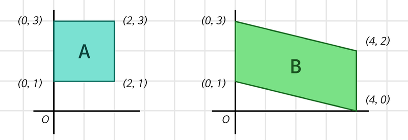

# AIFFEL_33일차 2020.09.08

Tags: AIFFEL_DAILY

### 일정

---

1. Dacon 작업 ⇒ 4시 회의
2. LMS F-30
3. LMS E-11
4. 수요일 풀잎 준비 (LSTM 발표 못 끝낸 부분 복기 및 내용 추가,정리)

# Dacon 작업

---

1. ~~bagging 이후에 평균으로 구현하지 않고... 다른 방법을 사용해보아야 할 것 같은데?~~

~~⇒ 가장 많이 예측된 결과를 고르는걸로.~~

2. train 데이터 임의 추가는 어떨까?  좌우반전한 데이터를 한 세트씩 넣어주는건?

- 숫자만 분리한 결과를 좌우반전하고
- 문자만 분리한 결과를 좌우반전하고
- 원본도 좌우반전하고
- 결과적으로 train 데이터가 2배가 되도록 해본다.

~~3. 일단 기존 3채널 데이터로 bagging 해서 결과 만들어보고~~

~~4. train 데이터 임의 추가한 데이터로 bagging 해서 결과 만들어보자.~~

5. 그냥 좌우반전 데이터 한 세트씩 넣어보자.

6. 그리고 좌우반전 데이터를 통해 만들어진 데이터를 LGBM으로 학습 시킬 때 bagging으로 앙상블?!

# [F-30] 딥러닝 레이어의 이해 (1)Linear, Convolution

---

## **학습 목표**

---

1. 레이어의 개념을 이해한다.
2. 딥러닝 모델 속 각 레이어(Linear, Convolution)의 동작 방식을 이해한다.
3. 데이터의 특성을 고려한 레이어를 설계하고, 이를 *Tensorflow*로 정의하는 법을 배운다.

***미싱 링크(missing link)***

### 데이터의 형태

---

(1920, 1080, 3) 의 매트릭스 (W, H, C) 와 같이 표기 (C : Channel)

### 레이어?

---

하나의 물체가 여러개의 논리적인 객체들로 구성되어 있는 경우, 이러한 각각의 객체를 하나의 레이어라 한다.

신경망이라는 물체를 구성하는 여러 개의 논리적인 레이어들을 이해하는 것은 곧 신경망 그 자체를 이해하는 것과 같다. Weight 라는 것은 정확히는 레이어의 Weight! 신경망은 레이어들의 각기 다른 Weight, 그것들이 유기적으로 연결되어 이뤄내는 하나의 결과물.

## Linear 레이어

---

Fully Connected Layer, Feedforward Neural Network, Multilayer Perceptrons, Dense Layer… 등 다양한 이름으로 불리지만 그 모든 것들은 결국 Linear 레이어에 해당하며 그런 이유에서 필자는 Linear 레이어라고 칭하는 것을 선호합니다.

선형대수학에서 쓰이는 용어 중 **선형 변환(Linear Transform)**이 있는데, **그것과 완전히 동일한 기능**을 하는 레이어입니다.

### 선형 변환, 직관적인 이해

---

[https://www.youtube.com/watch?v=vVvjYzFBUVk&feature=youtu.be&ab_channel=수학노트상우쌤의](https://www.youtube.com/watch?v=vVvjYzFBUVk&feature=youtu.be&ab_channel=%EC%88%98%ED%95%99%EB%85%B8%ED%8A%B8%EC%83%81%EC%9A%B0%EC%8C%A4%EC%9D%98)

행렬을 이용하여 기존의 좌표에서 새로운 좌표를 만든다.

모든 점들에 동일한 행렬을 적용하면 확대나 축소 등을 할 수 있다.

새로운 좌표를 만들어내는 함수와 같은 것.

행렬에 의해 변형된 공간에서 직선들을 평행을 유지하게 되는데, 이것은 유클리드기하에서 다루는 기하학적 구조. 선형대수란 행렬을 이용하여 이러한 구조를 대수적으로 계산하고 분석하는 학문

### 선형 변환, 자세한 설명

---

[https://www.youtube.com/watch?v=kYB8IZa5AuE&feature=youtu.be&ab_channel=3Blue1Brown](https://www.youtube.com/watch?v=kYB8IZa5AuE&feature=youtu.be&ab_channel=3Blue1Brown)

Linear 레이어는 선형 변환을 활용해 데이터를 특정 차원으로 변환하는 기능을 합니다.

[ex]



위 그림의 두 사각형은 모두 (x, y) 2차원의 점 4개로 표현 가능하므로, 각각 (4, 2) 형태의 데이터로 표현할 수 있습니다. 우리는 두 사각형을 각각 어떤 하나의 정수로 표현하고자 합니다. 실은 이 정수는 우리가 구분하고자 하는 사각형의 종류(class)를 의미합니다.이를 위해, 데이터를 어떻게 집약시킬지 구상해보겠습니다.

### 데이터 집약

---

***<식1>***

*1단계: **(4, 2) x [2 x 1 행렬] = (4, )***

*2단계: **(4, ) x [4 x 1 행렬] = (1, )***

위 단계를 사용하면 각각의 사각형을, 정보가 집약된 하나의 정수로 표현할 수 있습니다. 2차원을 1차원으로 변환하는 데에 2 x 1 행렬이 하나 선언되고, 4차원을 1차원으로 변환하는 데에 4 x 1 행렬이 하나 선언됨에 유의합시다.

여기서 각각의 행렬들이 Weight입니다. Linear 레이어는 (입력의 차원, 출력의 차원)에 해당하는 Weight를 가지는 특성을 가지고 있습니다.


두 사각형에 대해 1단계를 거치고 난 결과가 동일하군요.

렇게 되면 <식 1>의 2단계 입력이 동일해지니 두 번째 4 x 1 Weight를 거치는 것이 의미가 없어집니다.

여기서 모든 Weight의 모든 요소를 ***Parameter***라고 합니다.

총 6개 (위 그림에서는 2개)의 Parameter로 이 문제를 해결하기엔 역부족이었던 것 같습니다

```python
import tensorflow as tf

batch_size = 64
boxes = tf.zeros((batch_size, 4, 2))     # Tensorflow는 Batch를 기반으로 동작하기에,
                                         # 우리는 사각형 2개 세트를 batch_size개만큼
                                         # 만든 후 처리를 하게 됩니다.
print("1단계 연산 준비:", boxes.shape)

first_linear = tf.keras.layers.Dense(units=1, use_bias=False) 
# units은 출력 차원 수를 의미합니다.
# Weight 행렬 속 실수를 인간의 뇌 속 하나의 뉴런 '유닛' 취급을 하는 거죠!

first_out = first_linear(boxes)
first_out = tf.squeeze(first_out, axis=-1) # (4, 1)을 (4,)로 변환해줍니다.
                                           # (불필요한 차원 축소)

print("1단계 연산 결과:", first_out.shape)
print("1단계 Linear Layer의 Weight 형태:", first_linear.weights[0].shape)

print("\n2단계 연산 준비:", first_out.shape)

second_linear = tf.keras.layers.Dense(units=1, use_bias=False)
second_out = second_linear(first_out)
second_out = tf.squeeze(second_out, axis=-1)

print("2단계 연산 결과:", second_out.shape)
print("2단계 Linear Layer의 Weight 형태:", second_linear.weights[0].shape)
```

### 데이터를 더 풍부하게

---

***<식2>***

*1단계: **(4, 2) x [2 x 3 행렬] = (4, 3)***

*2단계: **(4, 3) x [3 x 1 행렬] = (4, )***

*3단계: **(4, ) x [4 x 1 행렬] = (1, )***


⇒ 1단계의 결과로 각 사각형에 대해 독립적인 정보가 생겨나기 시작

```python
import tensorflow as tf

batch_size = 64
boxes = tf.zeros((batch_size, 4, 2))     # Tensorflow는 Batch를 기반으로 동작하기에,
                                         # 우리는 사각형 2개 세트를 batch_size개만큼
                                         # 만든 후 처리를 하게 됩니다.
print("1단계 연산 준비:", boxes.shape)

first_linear = tf.keras.layers.Dense(units=3, use_bias=False)
first_out = first_linear(boxes)

print("1단계 연산 결과:", first_out.shape)
print("1단계 Linear Layer의 Weight 형태:", first_linear.weights[0].shape)

print("\n2단계 연산 준비:", first_out.shape)

second_linear = tf.keras.layers.Dense(units=1, use_bias=False)
second_out = second_linear(first_out)
second_out = tf.squeeze(second_out, axis=-1)

print("2단계 연산 결과:", second_out.shape)
print("2단계 Linear Layer의 Weight 형태:", second_linear.weights[0].shape)

print("\n3단계 연산 준비:", second_out.shape)

third_linear = tf.keras.layers.Dense(units=1, use_bias=False)
third_out = third_linear(second_out)
third_out = tf.squeeze(third_out, axis=-1)

print("3단계 연산 결과:", third_out.shape)
print("3단계 Linear Layer의 Weight 형태:", third_linear.weights[0].shape)

total_params = \
first_linear.count_params() + \
second_linear.count_params() + \
third_linear.count_params()

print("총 Parameters:", total_params)
```

param이 지나치게 많다면, 정답만 외운 학생과 같은 것! 실제 시험에서는 좋은 성적을 거두지 못한다.

### 편향(Bias)

---


두 데이터가 비슷하게 생겼지만, 원점을 건들지 않고 둘을 일치시키기는 어려워 보이죠?

편향이 없다면 파라미터를 아무리 돌리고 늘리고 해도 정확하게 근사할 수 없음을 보여주는 예.

단순히 생각해서 원점을 평행이동하는 것만으로도 해결할 수 있기 때문에 실제로 편향은 선형변환된 값에 편향 파라미터 b를 더해주는 것으로 표현해요.

## Convolution Layer : 정보를 집약시키자

---


convolution 연산 예시

진을 선명하게 하는 필터와 흐리게 하는 필터 등 다양한 필터들이 Convolution을 위한 행렬로 정의되어 있답니다 😉

***필터는 다른 말로 커널***이라고 부르기도 해요! 이미지를 필터로 훑을 때, 한 칸씩 이동하며 훑을 수도 있지만, **두 칸, 세 칸씩 이동하며 훑을 수도 있습니다**. 그것을 **결정하는 값을 Stride**라고 칭합니다.

Convolution 연산은 입력의 형태를 변형시킨다

⇒ 이를 방지하기 위한 개념이 Padding

필터가 어떤 목적을 가질 수 있다면**, 손을 찾는 데에 적합한 필터**도 존재할 수 있지 않을까요?

목적에 도움이 되는 정보는 선명하게, 그렇지 않은 정보는 흐리게 만드는 필터를 상상할 수 있겠군요!

그런 멋진 필터를 훈련을 통해 찾아주는 것이 바로 Convolution 레이어가 하는 일입니다.

목적에 맞는 필터를 훈련을 통해 찾아주는 것이 바로 Convolution 레이어가 하는 일

심지어는 단 하나의 필터가 아닌 **수십 개의 필터**를 중첩해서요


***<식 4>***

*1단계: **(1920, 1080, 3) x [3 x 16 x 5 x 5 Weight & Stride 5] = (384, 216, 16)***

*2단계: **(384, 216, 16) → (384 x 216 x 16, )***

*3단계: **(1327104, ) x [1327104 x 1 Weight] = (1, )***

Q. 위의 그림과 식에서 발생할 수 있는 문제를 찾는다면? (필터와 관련하여)

---

필터의 크기가 손(대상)을 판별하기에는 작을 수 있고, 필터의 크기와 stride가 같으면 손(대상)이 필터의 경계선에 걸리는 경우, 정상적으로 인식하지 못할 수 있다. (stride를 줄이는 것이 좋아보인다.)

```python
import tensorflow as tf

batch_size = 64
pic = tf.zeros((batch_size, 1920, 1080, 3))

print("입력 이미지 데이터:", pic.shape)
conv_layer = tf.keras.layers.Conv2D(filters=16,
                                    kernel_size=(5, 5),
                                    strides=5,
                                    use_bias=False)
conv_out = conv_layer(pic)

print("\nConvolution 결과:", conv_out.shape)
print("Convolution Layer의 Parameter 수:", conv_layer.count_params())

flatten_out = tf.keras.layers.Flatten()(conv_out)
print("\n1차원으로 펼친 데이터:", flatten_out.shape)

linear_layer = tf.keras.layers.Dense(units=1, use_bias=False)
linear_out = linear_layer(flatten_out)

print("\nLinear 결과:", linear_out.shape)
print("Linear Layer의 Parameter 수:", linear_layer.count_params())
```

Linear 레이어는 입력 피처 전체가 매 출력에 미치는 영향의 가중치를 모든 입력 피처 사이에 전부 고려합니다.
이미지처럼 지역성(Locality) 그 자체가 엄청나게 중요한 정보가 되는 경우, Linear 레이어는 그 중요한 정보가 모두 소실된 채 엄청나게 큰 파라미터 속에서 입력과 출력 사이의 관계 가중치를 찾아내야 하는 어려운 문제를 풀어야 합니다.
그러나 Convolution 레이어는 필터 구조 안에 Locality 정보가 온전히 보존됩니다. 인접한 픽셀들 사이에서의 패턴만 추출할 수 있다는 것 자체만으로도 불필요한 파라미터 및 연산량을 제거하고 훨씬 정확하고 효율적으로 정보를 집약시킬 수 있게 됩니다.

## Pooling 레이어 : 핵심만 추려서 더 넓게!

---

만약 극단적으로 필터 사이즈를 이미지 사이즈와 동일하게 한다면 어떤 일이 생길까요?

그 순간 우리의 Convolution 레이어는 완벽하게 Linear 레이어와 같아지게 됩니다.

필터 사이즈를 키우게 되면 파라미터 사이즈와 연산량이 커질 뿐 아니라, Accuracy도 떨어지게 될 가능성이 높습니다.

### Receptive Field

---

입력 데이터의 Receptive Field가 충분히 커서 그 안에 detect해야 할 ***object의 특성이 충분히 포함***되어 있어야 정확한 detection이 가능하게 됩니다.

### Max Pooling 레이어의 의미

---

Max Pooling 레이어를 통해 효과적으로 Receptive Field를 키우고, 정보 집약 효과를 극대화할 수 있었습니다. 이러는 동안 늘어난 파라미터 사이즈는 얼마일까요? 네 정확히 0입니다.

**기껏 Convolution 레이어에서 힘들게 연산한 결과의 3/4를 그냥 버리는 것**입니다. 왜 이런 낭비를 하게 되는 것일까요? 그리고 **이런 정보 손실이 가져오는 Accuracy 저하 효과는 없는 것일까요?**

Q.그리고 왜 이게 효과가 있는 것인가?? 명확한 설명은 없지만...몇 가지 설명이 있긴 하다.

1. **translational invariance 효과**

이미지는 약간의 상하좌우 시프트가 생긴다고 해도 내용상 동일한 특징이 있는데, Max Pooling을 통해 인접한 영역 중 가장 특징이 두드러진 영역 하나를 뽑는 것은 오히려 약간의 시프트 효과에도 불구하고 동일한 특징을 안정적으로 잡아낼 수 있는 긍정적 효과가 있어서 오히려 object 위치에 대한 오버피팅을 방지하고 안정적인 특징 추출 효과를 가져온다고 합니다.

2. **Non-linear 함수와 동일한 피처 추출 효과**

Relu와 같은 **Non-linear 함수도 마찬가지로 많은 하위 레이어의 연산 결과를 무시하는 효과 (0미만 버려!)** 를 발생시키지만, 그 결과 **중요한 피처만을 상위 레이어로 추출해서 올려줌**으로써 결과적으로 분류기의 성능을 증진시키는 효과를 가집니다. Min/Max Pooling도 이와 동일한 효과를 가지게 됩니다.

3. **Receptive Field 극대화 효과**

Max Pooling이 없이도 Receptive Field를 크게 하려면 Convolutional 레이어를 아주 많이 쌓아야 합니다. 그 결과 큰 파라미터 사이즈로 인한 오버피팅, 연산량 증가, Gradient Vanishing 등의 문제를 감수해야 합니다. 이런 문제를 효과적으로 해결하는 방법으로 꼽히는 두가지 중 하나가 Max Pooling 레이어 사용입니다. 다른 하나로는 Dilated Convolution이 있습니다.

(참조 : [https://m.blog.naver.com/sogangori/220952339643](https://m.blog.naver.com/sogangori/220952339643))

## Deconvolution 레이어 : 집약된 정보의 복원!

---

onvolution의 결과를 역재생해서 원본 이미지와 최대한 유사한 정보를 복원해 내는 Auto Encoder에 대해 알아보려고 합니다.

```python
import numpy as np
from tensorflow.python.keras.layers import Input, Dense, Conv2D, MaxPooling2D, UpSampling2D
from tensorflow.python.keras.models import Model
from tensorflow.python.keras.datasets import mnist
import json
import matplotlib.pyplot as plt #for plotting

# MNIST 데이터 로딩
(x_train, _), (x_test, _) = mnist.load_data()    # y_train, y_test는 사용하지 않습니다.

x_train = np.expand_dims(x_train, axis=3)
x_test = np.expand_dims(x_test, axis=3)

x_train = x_train.astype('float32') / 255.
x_test = x_test.astype('float32') / 255.
```

얼핏 봐서는 그동안 많이 수행해 보셨을 MNIST 데이터셋 로딩 절차입니다.

그러나 잘 보시면 y_train, y_test를 사용하지 않는다는 것을 알 수 있습니다.

왜일까요? **AutoEncoder가 수행하는 Image Reconstruction Task는 x_train의 라벨이 바로 x_train 자신이 되기 때문입니다.**

```python
# AutoEncoder 모델 구성 - Input 부분
input_shape = x_train.shape[1:]
input_img = Input(shape=input_shape)

# AutoEncoder 모델 구성 - Encoder 부분
encode_conv_layer_1 = Conv2D(16, (3, 3), activation='relu', padding='same')
encode_pool_layer_1 = MaxPooling2D((2, 2), padding='same')
encode_conv_layer_2 = Conv2D(8, (3, 3), activation='relu', padding='same')
encode_pool_layer_2 = MaxPooling2D((2, 2), padding='same')
encode_conv_layer_3 = Conv2D(4, (3, 3), activation='relu', padding='same')
encode_pool_layer_3 = MaxPooling2D((2, 2), padding='same')

encoded = encode_conv_layer_1(input_img)
encoded = encode_pool_layer_1(encoded)
encoded = encode_conv_layer_2(encoded)
encoded = encode_pool_layer_2(encoded)
encoded = encode_conv_layer_3(encoded)
encoded = encode_pool_layer_3(encoded)

# Encoder 통과 직후의 Output은 4x4의 형태. 

# AutoEncoder 모델 구성 - Decoder 부분
decode_conv_layer_1 = Conv2D(4, (3, 3), activation='relu', padding='same')
decode_upsample_layer_1 = UpSampling2D((2, 2))
decode_conv_layer_2 = Conv2D(8, (3, 3), activation='relu', padding='same')
decode_upsample_layer_2 = UpSampling2D((2, 2))
decode_conv_layer_3 = Conv2D(16, (3, 3), activation='relu')
decode_upsample_layer_3 = UpSampling2D((2, 2))
decode_conv_layer_4 = Conv2D(1, (3, 3), activation='sigmoid', padding='same')

decoded = decode_conv_layer_1(encoded)   # Decoder는 Encoder의 출력을 입력으로 받습니다.
decoded = decode_upsample_layer_1(decoded)
decoded = decode_conv_layer_2(decoded)
decoded = decode_upsample_layer_2(decoded)
decoded = decode_conv_layer_3(decoded)
decoded = decode_upsample_layer_3(decoded)
decoded = decode_conv_layer_4(decoded)

# AutoEncoder 모델 정의
autoencoder=Model(input_img, decoded)
autoencoder.summary()

autoencoder.compile(optimizer='adadelta', loss='binary_crossentropy')

autoencoder.fit(x_train, x_train,
                epochs=50,
                batch_size=256,
                shuffle=True,
                validation_data=(x_test, x_test))

x_test_10 = x_test[:10]       # 테스트 데이터셋에서 10개만 골라서
x_test_hat = autoencoder.predict(x_test_10)    # AutoEncoder 모델의 이미지 복원생성
x_test_imgs = x_test_10.reshape(-1, 28, 28)
x_test_hat_imgs = x_test_hat.reshape(-1, 28, 28)

plt.figure(figsize=(12,5))  # 이미지 사이즈 지정
for i in range(10):  
    # 원본이미지 출력
    plt.subplot(2, 10, i+1)
    plt.imshow(x_test_imgs[i])
    # 생성된 이미지 출력
    plt.subplot(2, 10, i+11)
    plt.imshow(x_test_hat_imgs[i])
```

여기서 주의할 점은 Conv2D 레이어는 shape를 변화시키지 않고 있다는 점입니다.

Output shape를 변화시키는 것은 오롯이 MaxPooling2D 레이어의 역할.

### Decoder Layers for Reconstruction

---

AutoEncoder 구조가 얼마나 정보손실 없이 원본 데이터를 잘 압축하고 있느냐에 따라 Decoder가 뽑아낼 수 있는 최종적인 이미지의 퀄리티가 결정됩니다.

Image Reconstruction을 위해서 일반적으로 많이 사용하는 Transposed Convolution을 방금 활용한 것은 아닙니다. 오히려 방금은 Convolution 레이어를 활용해서 Transposed Convolution를 흉내낸 것에 불과합니다.

### Upsampling 레이어

---

- Nearest Neighbor : 복원해야 할 값을 가까운 값으로 복제한다.
- Bed of Nails : 복원해야 할 값을 0으로 처리한다.
- Max Unpooling : Max Pooling 때 버린 값을 실은 따로 기억해 두었다가 그 값으로 복원한다.

```python
from tensorflow.python.keras.layers import Conv2DTranspose
# Conv2DTranspose를 활용한  AutoEncoder 모델
# AutoEncoder 모델 구성 - Input 부분
input_shape = x_train.shape[1:]
input_img = Input(shape=input_shape)

# AutoEncoder 모델 구성 - Encoder 부분
encode_conv_layer_1 = Conv2D(16, (3, 3), activation='relu')
encode_pool_layer_1 = MaxPooling2D((2, 2))
encode_conv_layer_2 = Conv2D(8, (3, 3), activation='relu')
encode_pool_layer_2 = MaxPooling2D((2, 2))
encode_conv_layer_3 = Conv2D(4, (3, 3), activation='relu')

encoded = encode_conv_layer_1(input_img)
encoded = encode_pool_layer_1(encoded)
encoded = encode_conv_layer_2(encoded)
encoded = encode_pool_layer_2(encoded)
encoded = encode_conv_layer_3(encoded)

# AutoEncoder 모델 구성 - Decoder 부분  - 
decode_conv_layer_1 = Conv2DTranspose(4, (3, 3), activation='relu', padding='same')
decode_upsample_layer_1 = UpSampling2D((2, 2))
decode_conv_layer_2 = Conv2DTranspose(8, (3, 3), activation='relu', padding='same')
decode_upsample_layer_2 = UpSampling2D((2, 2))
decode_conv_layer_3 = Conv2DTranspose(16, (3, 3), activation='relu')
decode_upsample_layer_3 = UpSampling2D((2, 2))
decode_conv_layer_4 = Conv2DTranspose(1, (3, 3), activation='sigmoid', padding='same')

decoded = decode_conv_layer_1(encoded)   # Decoder는 Encoder의 출력을 입력으로 받습니다.
decoded = decode_upsample_layer_1(decoded)
decoded = decode_conv_layer_2(decoded)
decoded = decode_upsample_layer_2(decoded)
decoded = decode_conv_layer_3(decoded)
decoded = decode_upsample_layer_3(decoded)
decoded = decode_conv_layer_4(decoded)

# AutoEncoder 모델 정의
autoencoder=Model(input_img, decoded)
autoencoder.summary()

autoencoder.compile(optimizer='adadelta', loss='binary_crossentropy')

autoencoder.fit(x_train, x_train,
                epochs=50,
                batch_size=256,
                shuffle=True,
                validation_data=(x_test, x_test))

x_test_10 = x_test[:10]       # 테스트 데이터셋에서 10개만 골라서
x_test_hat = autoencoder.predict(x_test_10)    # AutoEncoder 모델의 이미지 복원생성
x_test_imgs = x_test_10.reshape(-1, 28, 28)
x_test_hat_imgs = x_test_hat.reshape(-1, 28, 28)

plt.figure(figsize=(12,5))  # 이미지 사이즈 지정
for i in range(10):  
    # 원본이미지 출력
    plt.subplot(2, 10, i+1)
    plt.imshow(x_test_imgs[i])
    # 생성된 이미지 출력
    plt.subplot(2, 10, i+11)
    plt.imshow(x_test_hat_imgs[i])
```

### **Up-sampling with Transposed Convolution**

---

[https://zzsza.github.io/data/2018/06/25/upsampling-with-transposed-convolution/](https://zzsza.github.io/data/2018/06/25/upsampling-with-transposed-convolution/)

3x3 커널은 input matrix의 9개의 값을 output matrix 1개의 값에 연결할 때 사용됩니다. convolution 연산은 many-to-one 관계를 형성합니다.

matrix의 값 1개를 다른 matrix의 값 9개와 연결하려고 합니다. 이는 **one-to-many** 관계입니다. convolution 연산을 반대로 하는 것과 같으며, transposed convolution의 핵심 개념


⇒ 이런 연살을 어떻게 하는가? ***transposed convolution matrix***

convolution matrix는 kernel weights의 재배치일 뿐이고 convolution 연산은 convolution matrix를 사용해 표현할 수 있습니다.

Transposed convolution 연산은 일반적인 convolution 연산과 동일한 연결성을 형성하지만 반대 방향으로 연결

흠... 완전히 이해는 x

---

# [E-11] 작사가 인공지능 만들기

---

## **목차**

---

- 시퀀스? 스퀀스!
- I 다음 am을 쓰면 반 이상은 맞더라
- 실습1) 데이터 다듬기2) 인공지능 학습시키기3) 잘 만들어졌는지 평가하기
- 프로젝트 : 멋진 작사가 만들기

## 시퀀스? 스퀀스!

---

데이터를 순서대로 하나씩 나열하여 나타낸 데이터 구조, 특정 위치의 데이터를 가키킬 수 있다.

신문기사, 시, 소설 등 우리 주변의 모든 텍스트는 전부 시퀀스 데이터입니다.
텍스트가 아니더라도, 월별 상품 판매량 변화, 일별 주식 시황 데이터 등의 시계열 수치 데이터도 시퀀스 데이터로 볼 수 있습니다.

시퀀스 데이터가 곧 각 요소들의 연관성을 의미하는 것은 아니지만, 우리(인공지능)가 예측을 하려면 어느 정도는 연관성이 있어줘야 합니다. 예를 들어, [ 18.01.01, 18.01.02, 18.01.03, **?** ] 의 **"?"** 부분을 맞추기 위해선 정답이 18.01.04 여야만 합니다. 정답이 "오리"라면 난감하다는 거죠!

문법을 인공지능이 그대로 배워서 문장 데이터를 예측하기는 어렵다. 조금 더 단순한 접근 방법인 '통계에 기반한 방법' 이 필요하다.

### I 다음 am을 쓰면 반 이상은 맞더라.

---

통계라는 단어에서 거부감이 느껴지는 분들이 분명 계실 거라 생각해요. 적어도 이번 스텝에서는 쓸 수 있는 꿀팁을 전수해드리면 "통계" → "대체로~" 라고 바꿔 읽으시면 좋습니다.

인공지능이 글을 이해하게 하는 방식도 위와 같습니다. 어떤 문법적인 원리를 통해서가 아니고, **수많은 글을 읽게 함으로써 나는 , 밥을, 그 다음이 먹는다 라는 사실을 알게 하는 거죠.**

⇒ 많은 데이터가 곧 좋은 결과를 만들어냅니다.

이 방식을 가장 잘 처리하는 인공지능 중 하나가 **순환신경망(RNN)** 입니다.

<start> 라는 특수한 토큰을 맨 앞에 추가해준다. 인공지능에게 "자, 이제 어떤 문장이든 생성해봐!" 라는 사인을 주는 셈인거죠. <start> 를 입력으로 받은 순환신경망은 다음 단어로 나는 을 생성하고, ***생성한 단어를 다시 입력으로 사용*** 합니다. 이 순환적인 특성을 살려 순환신경망이라고 이름을 붙인 것!

그리고 문장을 다 생성하면 <end> 라는 특수한 토큰을 생성.

즉, 우리는 **<start> 가 문장의 시작에 더해진 입력 데이터(문제지)**와, **<end> 가 문장의 끝에 더해진 출력 데이터(답안지)**가 필요하며, 이는 문장 데이터만 있으면 만들어낼 수 있다는 것 또한 알 수 있습니다.

```python
sentence = " 나는 밥을 먹었다 "

source_sentence = "<start>" + sentence
target_sentence = sentence + "<end>"

print("Source 문장:", source_sentence)
print("Target 문장:", target_sentence)
```

### 언어 모델 (Language Model)

---

이걸 좀더 확률적으로 표현해 보겠습니다. '나는 밥을' 다음에 '먹었다' 가 나올 확률을$p(먹었다 | 나는, 밥을)$ 라고 해보자.

그렇다면, 이 확률은 '나는' 뒤에 '밥이' 가 나올 확률인 $p(밥을|나는)$ 보다는 높게 나올 것.

아마 $p(먹었다 | 나는, 밥을, 맛있게)$ 의 확률값은 더 높아질거고.

***어떤 문구 뒤에 다음 단어가 나올 확률이 높다는 것은 그 다음 단어가 나오는 것이 보다 자연스럽다는 뜻***

n-1개의 단어 시퀀스 $w_1 , \cdots , w_{n-1}$ 가 주어졌을 때, ***n 번째 단어 $w_n$ 으로 무엇이 올지를 예측하는 확률 모델을 '언어 모델(Language Model)이라고 부른다.*** 

$P(w_n | w_1, …, w_{n-1};\theta )$

어떤 텍스트도 언어 모델의 학습 데이터가 될 수 있습니다. n-1번째까지의 단어 시퀀스가 x_train이 되고 n번째 단어가 y_train이 되는 데이터셋은 무궁무진하게 만들 수 있으니까요.

이렇게 학습된 언어 모델을 학습 모드가 아닌 테스트 모드로 가동하면 어떤 일이 벌어질까요? 네, 이 모델은 일정한 단어 시퀀스가 주어진다면 다음 단어, 그 다음 단어를 계속해서 예측해 낼 것입니다. 이게 바로 텍스트 생성이고 작문 아니겠습니까? 잘 학습된 언어 모델은 훌륭한 문장 생성기로 동작하게 됩니다.

## 실습 (1) 데이터 다듬기

---

```python
for idx, sentence in enumerate(raw_corpus):
    if len(sentence) == 0: continue   # 길이가 0인 문장은 건너뜁니다.
    if sentence[-1] == ":": continue  # 문장의 끝이 : 인 문장은 건너뜁니다.

    if idx > 9: break   # 일단 문장 10개만 확인해 볼 겁니다.
        
    print(sentence)
```

### 토큰화(Tokenize)

---

텍스트 생성 모델에서도 단어 사전을 만든다. 문장을 일정한 기준으로 쪼개야 한다. 그 과정을 토큰화.

가장 간단한 방법은 띄어쓰기 기준. 하지만 문제점 존재.

1. Hi, my name is John. *("Hi," "my", …, "john." 으로 분리됨) - 문장부호
2. First, open the first chapter. *(First와 first를 다른 단어로 인식) - 대소문자
3. He is a ten-year-old boy. *(ten-year-old를 한 단어로 인식) - 특수문자

"1." 을 막기 위해 문장 부호 양쪽에 공백을 추가 할 거고요, 

"2." 를 막기 위해 모든 문자들을 소문자로 변환할 겁니다.

"3." 을 막기 위해 특수문자들은 모두 제거하도록 하죠!

### 정규표현식을 이용한 필터링 ( corpus 생성 )

---

```python
def preprocess_sentence(sentence):
    sentence = sentence.lower().strip()       # 소문자로 바꾸고 양쪽 공백을 삭제
  
    # 아래 3단계를 거쳐 sentence는 스페이스 1개를 delimeter로 하는 소문자 단어 시퀀스로 바뀝니다.
    sentence = re.sub(r"([?.!,¿])", r" \1 ", sentence)        # 패턴의 특수문자를 만나면 특수문자 양쪽에 공백을 추가
    sentence = re.sub(r'[" "]+', " ", sentence)                  # 공백 패턴을 만나면 스페이스 1개로 치환
    sentence = re.sub(r"[^a-zA-Z?.!,¿]+", " ", sentence)  # a-zA-Z?.!,¿ 패턴을 제외한 모든 문자(공백문자까지도)를 스페이스 1개로 치환

    sentence = sentence.strip()

    sentence = '<start> ' + sentence + ' <end>'      # 이전 스텝에서 본 것처럼 문장 앞뒤로 <start>와 <end>를 단어처럼 붙여 줍니다
    
    return sentence

print(preprocess_sentence("This @_is ;;;sample        sentence."))   # 이 문장이 어떻게 필터링되는지 확인해 보세요.
```

자연어처리 분야에서 모델의 입력이 되는 문장을 **소스 문장(Source Sentence),** 정답 역할을 하게 될 모델의 출력 문장을 **타겟 문장(Target Sentence)**라고 관례적으로 부릅니다. 각각 X_train, y_train 에 해당한다고 할 수 있겠죠?

⇒ 정제 함수를 통해 만든 데이터셋에서 토큰화를 진행한 후 끝 단어 를 없애면 소스 문장, 첫 단어 를 없애면 타겟 문장이 되겠죠?

```python
corpus = []

for sentence in raw_corpus:
    if len(sentence) == 0: continue
    if sentence[-1] == ":": continue
        
    corpus.append(preprocess_sentence(sentence))
        
corpus[:10]
```

영어를 처음 배울 때를 생각해보면... 한국어 해석을 보면서 공부했잖아?

인공지능도 배우고자 하는 언어 를 모국어로 표현 을 해야 공부를 할 수 있어요.

⇒ 인공지능의 모국어는 숫자! (표현이 좋다!)

⇒ 가르칠 언어(데이터)를 숫자로 변환해서 인공지능에게 줄 겁니다. 이에 필요한 것은 사전!

### 벡터화, 텐서

---

`tf.keras.preprocessing.text.Tokenizer` 패키지는 정제된 데이터를 토큰화하고, 단어 사전(vocabulary 또는 dictionary라고 칭함)을 만들어주며, 데이터를 숫자로 변환까지 한 방에 해줍니다.

⇒ 이 과정을 벡터화(vectorize) 라고 하며, 숫자로 변환된 데이터를 텐서(tensor) 라고 칭한다.

### 텐서?? 간단한 설명

---

[https://rekt77.tistory.com/102](https://rekt77.tistory.com/102)

데이터의 배열

텐서의 Rank는 간단히 말해서 몇 차원 배열인가를 의미


**1. Tensor는 배열의 집합이다.**

**2. 차원의 수는 Rank와 같은말이다.**

**3. 배열의 차원에따라 불리는 이름이 달라진다.**

### 텐서 생성

---

```python
def tokenize(corpus):
    # 텐서플로우에서 제공하는 Tokenizer 패키지를 생성
    tokenizer = tf.keras.preprocessing.text.Tokenizer(
        num_words=7000,  # 전체 단어의 개수 
        filters=' ',    # 별도로 전처리 로직을 추가할 수 있습니다. 이번에는 사용하지 않겠습니다.
        oov_token="<unk>"  # out-of-vocabulary, 사전에 없었던 단어는 어떤 토큰으로 대체할지
    )
    tokenizer.fit_on_texts(corpus)   # 우리가 구축한 corpus로부터 Tokenizer가 사전을 자동구축하게 됩니다.

    # 이후 tokenizer를 활용하여 모델에 입력할 데이터셋을 구축하게 됩니다.
    tensor = tokenizer.texts_to_sequences(corpus)   # tokenizer는 구축한 사전으로부터 corpus를 해석해 Tensor로 변환합니다.

    # 입력 데이터의 시퀀스 길이를 일정하게 맞추기 위한 padding  메소드를 제공합니다.
    # maxlen의 디폴트값은 None입니다. 이 경우 corpus의 가장 긴 문장을 기준으로 시퀀스 길이가 맞춰집니다.
    tensor = tf.keras.preprocessing.sequence.pad_sequences(tensor, padding='post')  

    print(tensor,tokenizer)
    return tensor, tokenizer

tensor, tokenizer = tokenize(corpus)
```

생성된 텐서를 소스와 타겟으로 분리.

```python
src_input = tensor[:, :-1]  # tensor에서 마지막 토큰을 잘라내서 소스 문장을 생성합니다. 마지막 토큰은 <END>가 아니라 <pad>일 가능성이 높습니다.
tgt_input = tensor[:, 1:]    # tensor에서 <START>를 잘라내서 타겟 문장을 생성합니다.

print(src_input[0])
print(tgt_input[0])
```

### 데이터셋 객체 생성

---

그동안 model.fit(xtrain, ytrain, …) 형태로 Numpy Array 데이터셋을 생성하여 model에 제공하는 형태의 학습을 많이 진행해 왔습니다.

그러나 텐서플로우를 활용할 경우 텐서로 생성된 데이터를 이용해 `tf.data.Dataset` 객체를 생성하는 방법을 흔히 사용.

`tf.data.Dataset` 객체는 텐서플로우에서 사용할 경우 데이터 입력 파이프라인을 통한 속도 개선 및 각종 편의기능을 제공하므로 꼭 사용법을 알아 두시기를 권합니다.

```python
BUFFER_SIZE = len(src_input)
BATCH_SIZE = 256
steps_per_epoch = len(src_input) // BATCH_SIZE

VOCAB_SIZE = tokenizer.num_words + 1    # tokenizer가 구축한 단어사전 내 7000개와, 여기 포함되지 않은 0:<pad>를 포함하여 7001개

dataset = tf.data.Dataset.from_tensor_slices((src_input, tgt_input)).shuffle(BUFFER_SIZE)
dataset = dataset.batch(BATCH_SIZE, drop_remainder=True)
dataset
```

여기까지 과정 (데이터 전처리)

---

- 정규표현식을 이용한 corpus 생성
- **`tf.keras.preprocessing.text.Tokenizer`**를 이용해 corpus를 텐서로 변환
- **`tf.data.Dataset.from_tensor_slices()`**를 이용해 corpus 텐서를 **`tf.data.Dataset`** 로 변환

## 실습(2) 인공지능 학습시키기

---


여기서 만들 모델의 구조도

### 우선, Embedding 레이어

---

```python
class TextGenerator(tf.keras.Model):
    def __init__(self, vocab_size, embedding_size, hidden_size):
        super(TextGenerator, self).__init__()
        
        self.embedding = tf.keras.layers.Embedding(vocab_size, embedding_size)
        self.rnn_1 = tf.keras.layers.LSTM(hidden_size, return_sequences=True)
        self.rnn_2 = tf.keras.layers.LSTM(hidden_size, return_sequences=True)
        self.linear = tf.keras.layers.Dense(vocab_size)
        
    def call(self, x):
        out = self.embedding(x)
        out = self.rnn_1(out)
        out = self.rnn_2(out)
        out = self.linear(out)
        
        return out
    
embedding_size = 256
hidden_size = 1024
model = TextGenerator(tokenizer.num_words + 1, embedding_size , hidden_size)
```

입력 텐서에 들어있는 단어 사전의 인덱스 값을 해당 인덱스 번째의 워드 벡터로 변환.

위 코드에서 **`embedding_size`** 는 워드 벡터의 차원수, 즉 **단어가 추상적으로 표현되는 크기**입니다. 만약 그 크기가 2라면 예를 들어

- 차갑다: [0.0, 1.0]
- 뜨겁다: [1.0, 0.0]
- 미지근하다: [0.5, 0.5]

값이 커질수록 단어의 추상적인 특징들을 더 잡아낼 수 있지만, 그만큼 충분한 데이터가 주어지지 않으면 오히려 혼란만을 야기할 수 있습니다.

LSTM 레이어의 hidden state 의 차원수인 hidden_size 도 같은 맥락입니다. hidden_size 는 **모델에 얼마나 많은 일꾼**을 둘 것인가? 로 이해해도 크게 엇나가지 않습니다.

그 일꾼들은 모두 같은 데이터를 보고 **각자의 생각**을 가지는데, 역시 충**분한 데이터가 주어지면 올바른 결정을 내리겠지만 그렇지 않으면 배가 산으로 갈 뿐** 입니다.

우리의 model은 아직 제대로 build되지 않았습니다. model.compile()을 호출한 적도 없고, 아직 model의 입력 텐서가 무엇인지 제대로 지정해 주지도 않았기 때문입니다.

그런 경우 아래와 같이 model에 데이터를 아주 조금 태워 보는 것도 방법입니다. model의 input shape가 결정되면서 model.build()가 자동으로 호출됩니다.

```python
for src_sample, tgt_sample in dataset.take(1): break
model(src_sample)

# <tf.Tensor: shape=(256, 20, 7001), dtype=float32, numpy= array(~~) >
```

7001은 Dense 레이어의 출력 차원수입니다. 7001개의 단어 중 어느 단어의 확률이 가장 높을지를 모델링해야 하기 때문입니다.

256은 이전 스텝에서 지정한 배치 사이즈입니다.

```
dataset.take(1)
```

를 통해서 1개의 배치, 즉 256개의 문장 데이터를 가져온 것입니다.

그렇다면 20은 무엇을 의미할까요?

비밀은 바로 `tf.keras.layers.LSTM(hidden_size, return_sequences=True)`로 호출한 LSTM 레이어에서 `return_sequences=True`이라고 지정한 부분에 있습니다. 즉, LSTM은 자신에게 입력된 시퀀스의 길이만큼 동일한 길이의 시퀀스를 출력한다는 의미입니다.

`return_sequences=False`였다면 LSTM 레이어는 1개의 벡터만 출력했을 것

***그런데 문제는*** 

우리의 모델은 입력 데이터의 시퀀스 길이가 얼마인지 모른다는 점입니다.

모델을 만들면서 알려준 적도 없습니다. 그럼 20은 언제 알게된 것일까요? 네, 그렇습니다. 데이터를 입력받으면서 비로소 알게 된 것입니다. 우리 데이터셋의 max_len이 20으로 맞춰져 있었던 것입니다.

```python
model.summary()
```

Output Shape를 정확하게 알려주지 않습니다. 바로 위에서 설명한 이유 때문입니다. 우리의 모델은 입력 시퀀스의 길이를 모르기 때문에 Output Shape를 특정할 수 없는 것입니다.

loss 측정

```python
optimizer = tf.keras.optimizers.Adam()
loss = tf.keras.losses.SparseCategoricalCrossentropy(
    from_logits=True,
    reduction='none'
)

model.compile(loss=loss, optimizer=optimizer)
model.fit(dataset, epochs=30)
```

## 모델 평가하기

---

작문 모델을 평가하는 가장 확실한 방법은 작문을 시켜보고 직접 평가하는 겁니다.

```python
def generate_text(model, tokenizer, init_sentence="<start>", max_len=20):
    # 테스트를 위해서 입력받은 init_sentence도 일단 텐서로 변환합니다.
    test_input = tokenizer.texts_to_sequences([init_sentence])
    test_tensor = tf.convert_to_tensor(test_input, dtype=tf.int64)
    end_token = tokenizer.word_index["<end>"]

    # 텍스트를 실제로 생성할때는 루프를 돌면서 단어 하나씩 생성해야 합니다. 
    while True:
        predict = model(test_tensor)  # 입력받은 문장의 텐서를 입력합니다. 
        predict_word = tf.argmax(tf.nn.softmax(predict, axis=-1), axis=-1)[:, -1]   # 우리 모델이 예측한 마지막 단어가 바로 새롭게 생성한 단어가 됩니다. 

        # 우리 모델이 새롭게 예측한 단어를 입력 문장의 뒤에 붙여 줍니다. 
        test_tensor = tf.concat([test_tensor, 
																 tf.expand_dims(predict_word, axis=0)], axis=-1)

        # 우리 모델이 <END>를 예측했거나, max_len에 도달하지 않았다면  while 루프를 또 돌면서 다음 단어를 예측해야 합니다.
        if predict_word.numpy()[0] == end_token: break
        if test_tensor.shape[1] >= max_len: break

    generated = ""
    # 생성된 tensor 안에 있는 word index를 tokenizer.index_word 사전을 통해 실제 단어로 하나씩 변환합니다. 
    for word_index in test_tensor[0].numpy():
        generated += tokenizer.index_word[word_index] + " "

    return generated   # 이것이 최종적으로 모델이 생성한 자연어 문장입니다.
```

⇒ 텍스트를 실제로 생성해야 하는 시점에서, 우리에게는 2가지가 없습니다. 하나는 타겟 문장입니다. 또하나는 무엇이냐 하면, 소스 문장입니다. 생각해 보면 우리는 텍스트 생성 태스크를 위해 테스트 데이터셋을 따로 생성한 적이 없습니다.

generate_text() 함수에서 init_sentence를 인자로 받고는 있습니다. 이렇게 받은 인자를 일단 텐서로 만들고 있습니다. 디폴트로는 단어 하나만 받는군요.

- while의 첫번째 루프에서 test_tensor에 **`<START>`** 하나만 들어갔다고 합시다. 우리의 모델이 출력으로 7001개의 단어 중 **`A`**를 골랐다고 합시다.
- while의 두번째 루프에서 test_tensor에는 **`<START> A`**가 들어갑니다. 그래서 우리의 모델이 그다음 **`B`**를 골랐다고 합시다.
- while의 세번째 루프에서 test_tensor에는 **`<START> A B`**가 들어갑니다. 그래서….. (이하 후략)

```python
generate_text(model, tokenizer, init_sentence="<start> he")
```

## 프로젝트: 멋진 작사가 만들기

---

glob 모듈을 사용하면 파일을 읽어오는 작업을 하기가 아주 용이해요. glob 를 활용하여 모든 txt 파일을 읽어온 후, raw_corpus 리스트에 문장 단위로 저장하도록 할게요!

```python
import glob
import os

txt_file_path = os.getenv('HOME')+'/aiffel//lyricist/data/lyrics/*'

txt_list = glob.glob(txt_file_path)

raw_corpus = []

# 여러개의 txt 파일을 모두 읽어서 raw_corpus 에 담습니다.
for txt_file in txt_list:
    with open(txt_file, "r") as f:
        raw = f.read().splitlines()
        raw_corpus.extend(raw)

print("데이터 크기:", len(raw_corpus))
print("Examples:\n", raw_corpus[:3])
```

이후 이번 과정에서 했던 내용 진행

```python
loss = tf.keras.losses.SparseCategoricalCrossentropy(
    from_logits=True, reduction='none')
```

⇒ 해당 loss를 사용하여 val_loss 값을 2.2수준으로 줄여보자

```python
generate_text(lyricist, tokenizer, init_sentence="<start> i love", max_len=20)
```

결과물 : [https://github.com/bluecandle/2020_AIFFEL/blob/master/daily_notes/exploration_codes/e11_code/E11.ipynb](https://github.com/bluecandle/2020_AIFFEL/blob/master/daily_notes/exploration_codes/e11_code/E11.ipynb)