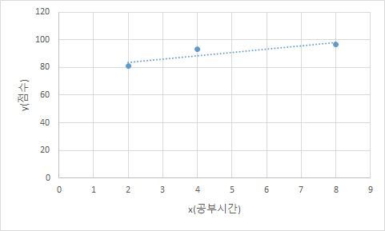

# AIFFEL_34일차 2020.09.09

Tags: AIFFEL_DAILY

### 일정

---

- [x]  Dacon 작업, 풀잎 발표준비
- [x]  풀잎스쿨 cs231n lecture 11 , 저번시간 LSTM 설명 마무리
- [x]  LMS F-31
- [x]  LMS F-32
- [x]  코딩마스터 Session7 준비 (발표자료 준비 및 문제풀이)

# Dacon 작업

---

1. ~~src > choose_your_model > get_stacking 함수 내 model checkpoint 이름 불일치~~
2. ~~GridSearch 진행~~

# 풀잎 발표준비 & 풀잎

---

[CS231n 2017 lecture10 _ RNN](https://www.notion.so/CS231n-2017-lecture10-_-RNN-2a2dd09971224c63bceb6b5d5847ee16)

[CS231n 2017 lecture11 _ Detection and Segmentation](https://www.notion.so/CS231n-2017-lecture11-_-Detection-and-Segmentation-932114dfcb6d46d68b38129f209e2bd8)

# [F-31]선형회귀와 경사하강법

---

## **학습 목표**

---

1. 일차 연립방정식의 근사해를 구하는 2가지 방법 중 **최소제곱법과 선형회귀의 차이점**을 이해한다.
2. 대표적인 지도학습인 선형회귀의 경우에 경사하강법이 어떻게 사용되는지 이해한다.
3. 경사하강법의 단점을 극복하기 위한 다양한 옵티마이저의 원리를 이해한다.

### 배울 내용

---

- 최소제곱해(Least square solution)
- 정규방정식(Normal equation)
- 선형회귀(Linear Regression)
- 경사하강법(Gradient descent)
- 여러가지 옵티마이저(Optimizer)

## 연립방정식의 근사해

---

$ax+by=p\hspace{5mm}(1)\\cx+dy=q\hspace{5mm}(2)$

⇒ 직선 (1),(2)가 일치하면 해가 무수히 많고 평행하면 해가 존재하지 않음.

⇒ 해가 무수히 많은 경우는 신경 x 해가 존재하지 않는 경우를 고려해보자!

$\begin{aligned}a_{11}x_1+\cdots + a_{1n}x_n = y_1\\a_{21}x_1+\cdots + a_{2n}x_n = y_2\\\vdots \hspace{22mm}\\a_{m1}x_1+\cdots + a_{mn}x_n = y_m\end{aligned}$

예를 들어 $y_i$ 들을 여러과목의 성적,  $x_i$들을 그 과목들의 성적에 영향을 미치는 요인들이라고 하면, 실제로는 저런 선형관계가 성립할 리가 없는데 너무 간단한 선형모델을 가정했기 때문에 해가 없는 경우가 대부분이겠죠. 특히 m>n 인 경우라면 더 그렇구요.

(우리가 살고있는 세계는 굉장히 복잡한 세계인데, 일차형식으로 쓸수없다라고 받아 들이시면 됩니다.)



이런 상황이라면, 모든 점을 지나는 직선을 그을 수 없음! 즉, 연립방적식이 해를 갖지 않는다.

⇒ 근데, 그냥 못 풀고 말 수는 없잖아! ㅋㅋㅋ

⇒ 방법 1. 최소제곱법을 통한 근사해

⇒ 방법 2. 선형회귀를 이용한 근사해

## 최소제곱해와 정규방정식

---

[예시]

$\begin{array}{|c|c|}\hline~x(공부시간)~~~~~ & ~y(성적)~~~~\\ \hline2 & 81\\4 & 93\\8 & 97\\ \hline\end{array}$

```python
import numpy as np
import matplotlib.pyplot as plt
%matplotlib inline

x = np.array([2, 4, 8])
A = np.array([[1]*len(x), x]).T
y = np.array([81, 93, 97])

c, m = np.linalg.lstsq(A, y, rcond=None)[0]
print(m, c)

plt.plot(x, y, 'o', label='Original data', markersize=10)
plt.plot(x, m*x + c, 'r', label='Fitted line')
plt.legend()
plt.show()
```

y가 $x_1, \cdots , x_n$ 의 일차식으로 표현된다는(굉장히 까다로운)가정을 해보면

$y = w_0 + w_1*x_1 + w_2*x_2 + \cdots + w_n*x_n$

⇒ n개의 변수(혹은 feature)를 가진 선형 회귀 모델

앞의 계수(혹은 weight)들을 결정하기 위해 우리가 m번의 관찰을 해서 데이터를 수집했다고 하면

$\begin{bmatrix}1 & x_{12} & \cdots & x_{1n}\\1 & x_{22} & \cdots & x_{2n}\\\vdots & \vdots & \ddots & \vdots\\1 & x_{m1} & \cdots & x_{mn}\end{bmatrix}\begin{bmatrix}w_0\\w_1\\\vdots\\w_n\end{bmatrix}=\begin{bmatrix}y_1\\y_2\\\vdots\\y_m\end{bmatrix}$

이런 행렬 표현이 가능하다.

$x_{ij}$ 는 i번째 피쳐인 $x_i$ 의 j번째 관찰값, $y_j$ 는 j번째 관찰값을 의미. 행렬 A의 크기는 bias때문에 m x (n+1) 이 된다.

$\begin{bmatrix}1 & 2\\1 & 4\\1 & 8\end{bmatrix}\begin{bmatrix}w_0\\w_1\end{bmatrix}=\begin{bmatrix}81\\93\\97\end{bmatrix}$

위에 예시로 놓은 표를 이렇게 나타낼 수 있다.

x 를 $\begin{bmatrix}w_0\\w_1\\\vdots\\w_n\end{bmatrix}$ 라고 생각하고, b를 $\begin{bmatrix}y_1\\y_2\\\vdots\\y_m\end{bmatrix}$ 라고 생각하자.

일반적으로 연립 일차방정식 Ax = b 가 주어져있을때 ( 여기서 A는 위의 예시에서 w 열벡터 앞에 곱해진 weight 행렬), 근사해인 **최소제곱해**를 구하는 방법은 양변에 $A^T$ 를 곱한 $A^T Ax=A^T b$ 를 푸는 것!

⇒ 이 방정식을 **정규방정식(Normal equation)** 이라고 부른다.

Ax = b의 해가 없는 경우라도 정규방정식의 해는 항상 존재하게 된다!

⇒ 조금 더 수학적으로 표현하자면... $b \not\in C(A)$ 일 수도 있지만 $A^T b \in C(A^T A)$ 는 항상 성립한다.

Ax=b 라는 말과 $b \in C(A)$ 는 같은 말.

⇒ [설명] A의 모든 열의 선형결합의 모든 경우의 집합인 C(A)에 Ax가 포함되는 것은 자명하니, 어떤 b가 Ax의 형태가 될 수 있다는 말은 $b \in C(A)$ 과 같은 말.

### 기하학적 의미

---

정규방정식의 해를 $\hat{x}$ 이라 하면 $b \not\in C(A)$ 이므로 $b \not= A\hat{x}$ 이긴 하지만, $b_c := A\hat{x}$ 이 $Proj_{C(A)}b$ 가 되어 열공간에 있는 벡터들 중 b와의 거리가 최소가 된다는 것.


C(A)는 $a_1,a_2$ 벡터들의 선형결합으로 이루어진 평면이 된다. 이때 이 그림의 기하학적 의미는?

$A\hat{x}$ 가 b의 C(A) 위로의 정사영이다. $\iff$$A^T(b-A\hat{x})=0 \iff A^T A\hat{x}=A^T b$

### 정규방정식의 해로 표현하면?

---

rank(A) = n+1, full rank인 경우로 한정지어 설명한다.

그리고 대부분의 경우에 A는 full rank를 갖는다.

feature가 서로 독립이면 무조건 그렇고, 그렇지 않더라도 feature engineering(유사한 feature 제거, PCA등의 차원축소 등)을 거치면 대부분 그렇게 된다.

[https://scikit-learn.org/stable/modules/generated/sklearn.decomposition.PCA.html](https://scikit-learn.org/stable/modules/generated/sklearn.decomposition.PCA.html)

[https://darkpgmr.tistory.com/106](https://darkpgmr.tistory.com/106)

* Principal component analysis (PCA).
주성분 분석, 고차원의 데이터를 저차원의 데이터로 환원시키는 기법.

Linear dimensionality reduction using Singular Value Decomposition of the data to project it to a lower-dimensional space. The input data is centered but not scaled for each feature before applying the SVD.

* SVD (특잇값 분해)
In linear algebra, the singular value decomposition (SVD) is a factorization of a real or complex matrix that generalizes the eigendecomposition of a square normal matrix to any $m \times n$ matrix via an extension of the polar decomposition.

특이값 분해(SVD)는 고유값 분해(eigendecomposition)처럼 행렬을 대각화하는 한 방법이다. 그런데, 특이값 분해가 유용한 이유는 행렬이 정방행렬이든 아니든 관계없이 모든 m x n 행렬에 대해 적용 가능하기 때문.

이 경우에 $A^TA$ 의 역행렬이 존재하기 때문에 (원래 $A^T Ax=A^T b$ 이런 모양을 풀고자 했던거잖아?)

$x = (A^T A)^{-1} A^T b$ 이렇게 최소제곱해를 얻을 수 있다.

---

[https://blog.naver.com/PostView.nhn?blogId=sw4r&logNo=221416614473&redirect=Dlog&widgetTypeCall=true&directAccess=false](https://blog.naver.com/PostView.nhn?blogId=sw4r&logNo=221416614473&redirect=Dlog&widgetTypeCall=true&directAccess=false)

*Full Rank

Full Rank는 한 행에서 전부 다 선형 독립이거나, 또는 한 열에서 전부 다 선형 독립인 벡터 기저들을 가진 경우라고 볼 수 있겠다.

[ex]


위의 행렬의 경우 랭크는 2이다. 왜냐하면, 첫 번째와 두 번째 열은 서로 선형 독립 관계에 있다고 볼 수 있다. 하지만, 세 번째 열의 경우에는 첫 번째 열에서 두 번째 열을 빼주게 되면 세 번째 열이 된다. 즉, 선형적으로 의존적인 관계가 성립한다. 따라서, 이 행렬의 Rank는 2가 된다.

*그니까 선형 독립이라는게 별다른게 아니라... 하나의 행렬 (열벡터, 행벡터도 포함) 을 스칼라 곱을 해서 다른 하나의 행렬의 형태로 만들 수 있다면, 선형적으로 의존적이라는거고, 같은 평면 상에 놓여있다고 볼 수 있는거네.

***핵심을 정리하자면***

행렬의 랭크는 행렬이 나타낼 수 있는 벡터 공간에서 기저의 개수를 의미하고, 이 기저는 서로 독립인 행 또는 열의 벡터의 개수에 의해서 결정된다. 열과 행의 랭크는 서로 같은 값을 가지므로, 행렬의 랭크를 구할 때에는 한쪽의 랭크만 계산하면 되고, 서로 선형 독립인 벡터가 몇 개가 되는지만 확인하면 된다.

---

```python
import numpy as np

x = np.array([2, 4, 8])
A = np.array([[1]*len(x), x]).T
y = np.array([81, 93, 97])

print(np.matmul(A.T, A))
print(np.matmul(A.T, y))
print(np.linalg.inv(np.matmul(A.T, A)))
# [ 3/2, -1/4]
# [-1/4, 3/56]
print(np.matmul(np.linalg.inv(np.matmul(A.T, A)), np.matmul(A.T, y)))
# (79, 17/7)
```

x 와 y 사이에는 대략적으로 $y=\frac{17}{7}x + 79$ 의 관계가 있음을 알 수 있다.

즉, 위의 예시 $\begin{bmatrix}1 & 2\\1 & 4\\1 & 8\end{bmatrix}\begin{bmatrix}w_0\\w_1\end{bmatrix}=\begin{bmatrix}81\\93\\97\end{bmatrix}$ 에서 최소제곱해는 $\hat{x}=(w_0, w_1)=\left(79, \frac{17}{7}\right)$

$b_c=A\hat{x}=\left(83\frac{6}{7}, 88\frac{5}{7}, 98\frac{3}{7}\right)$ 가 b에서 가장 가까운 벡터, 즉, 회귀의 결과로 나오는 점수!

## 선형회귀

---

gradient descent 쌩으로 구현

```python
import numpy as np

# 관측된 x, y를 데이터로 삼습니다.
x_train = np.array([2, 4, 8])
y_train = np.array([81, 93, 97])

# 학습해야 할 파라미터 W, b를 놓고
W, b = np.array([0.0, 0.0])
n_data = len(x_train)
epochs = 2000
learning_rate = 0.01

# 루프를 돌면서 
for i in range(epochs):
    hypothesis = x_train * W + b
    cost = np.sum((hypothesis - y_train) ** 2) / n_data
    # gradient를 계산하여
    gradient_w = np.sum((W * x_train - y_train + b) * 2 * x_train) / n_data
    gradient_b = np.sum((W * x_train - y_train + b) * 2) / n_data

    if i % 100 == 0:
        print('Epoch ({:10d}/{:10d}) cost: {:10f}, W: {:10f}, b:{:10f}'.format(i, epochs, cost, W, b))

    # 그래디언트 반대 방향으로 파라미터를 업데이트합니다. 
    W -= learning_rate * gradient_w
    b -= learning_rate * gradient_b

print('W: {:10f}'.format(W))
print('b: {:10f}'.format(b))
print('result : ', x_train * W + b)
```

```
W:   2.430785
b:  78.986821
result :  [83.848391   88.70996105 98.43310117]
```

W=2.43,b=78.99 로 참값(최소제곱해) 과 상당히 유사하다는 걸 확인할수 있죠.(물론 여기서 (w0,w1)=(b,W) 입니다.)

## 경사하강법

---

[https://www.youtube.com/watch?v=IHZwWFHWa-w&feature=emb_logo](https://www.youtube.com/watch?v=IHZwWFHWa-w&feature=emb_logo)

뉴럴넷의 weight들을 모아놓은 벡터를 w 라고 했을 때, 뉴럴넷에서 내놓는 결과값과 실제 결과값 사이의 차이를 정의하는 손실함수 C(w) 의 값을 최소화하기 위해 gradient의 반대 방향으로 일정 크기만큼 이동해내는 것을 반복하여 손실함수의 값을 최소화하는 w 의 값을 찾는 알고리즘을 경사하강법(GD)라고 해요.

일반적인 신경망의 경우 학습을 시키기 위해서는 손실함수(Loss function)을 정의하고 그 최솟값을 찾는 작업을 해야한다. 이를 위해 경사하강법이 필요함.

그래디언트 벡터는 레벨셋에 수직이고 그래디언트 방향이 함수가 가장 급하게 증가하는 방향

⇒ 순간순간 그래디언트 벡터의 반대(음의 그래디언트) 방향으로 이동하며 최솟값을 찾아가는 방법.


점프하는 정도를 조절하는 하이퍼파라미터(Hyperparameter)가 학습률(Learning rate)

경사하강법이 갖는 문제점 중 하나는 컨벡스 문제(Convex problem)이 아닌 경우, 즉, 손실함수가 볼록이 아닐 경우,

최솟값(Global minimum)이 아니라 극솟값(Local minimum)으로 수렴할수 있다는 겁니다.


local minima 문제를 언급하긴 했지만 실제 뉴럴넷에서는 local minima에 빠질 확률이 별로 없다고 봐도 됩니다. 위 그림은 weight가 한개뿐일 경우이지만 실제로는 weight의 엄청나게 많기 때문에 그렇게 쉽지 않죠.

오히려 아래 그림과 같이 평지(Plateau, 수학적으로는 ***saddle point***에 해당)가 생겨서 **weight 업데이트가 거의 일어나지 않는 현상이 훨씬 문제**가 됩니다.


⇒ 이런 문제들을 해결하기 위한 것이 옵티마이저(Optimizer) 알고리즘들

## 여러가지 옵티마이저

---

Gradient Descent 한 iteration에서의 변화 식은 다음과 같다.

$w_{t+1}=w_t−\eta\nabla_{w_t} C(w_t)$

이때, $\eta$ 가 미리 정해진 걸음의 크기(step size)로서, 학습률.

### SGD, Stochastic Gradient Descent, 확률적 경사하강법

---

GD에서 한 번 step을 딛을 때마다 전체 훈련 데이터에 대해 손실함수를 계산해야 함. 너무 많은 계산량이 필요해서 엄청 느리다! 이를 방지하기 위해 보통은 확률적 경사하강법(SGD)라는 방법을 사용.

전체 데이터(total batch) 대신 일부 조그마한 데이터의 모음(mini-batch)에 대해서만 손실함수를 계산하기 대문에 GD보다 다소 부정확할 수는 있지만, 훨씬 계산 속도가 빠르기 때문에 같은 시간에 더 많은 step을 갈 수 있으며 여러 번 반복할 경우 보통 batch의 결과와 유사한 결과로 수렴해요.

GD에 비해 빠르다는거지 앞으로 소개할 방법들에 비하면 굉장히 느리다.

SGD가 baseline 정도로 사용된다.


위의 방법들 중 파란색 화살표로 연결된 것들은 **Momentum 계열**로 **속도를 최대한 빠르게** 하는데 중점을 두고 있고, 빨간색 화살표로 연결된 것들은 **Adaptive 계열**로 **방향을 최대한 일직선**으로 하는데 중점.

### 모멘텀(Momentum)

---

SGD를 통해 이동하는 과정에 일종의 '관성'을 주는 것.

현재 gradient를 통해 이동하는 방향과는 별개로, 과거에 이동했던 방식을 기억하면서 그 방향으로 일정 정도를 추가적으로 이동.

$v_{t+1} = m v_t + \eta \nabla_{w_t} C(w_t)$

$w_t=w_{t-1}−v_t$

$v_t$ 가 time step t에서의 이동 벡터를 나타냄.

m 은 얼마나 momentum을 줄 것인지에 대한 관성항 값.

대표적인 장점은 관성 효과로 인해 양(+) 방향, 음(-) 방향 순차적으로 일어나는 지그재그 현상이 줄어든다.


### 아다그래드(Adagrad)

---

변수들을 업데이트할 때 각각의 변수마다 step size를 다르게 설정해서 이동하는 방식.

지금까지 많이 변화하지 않은 변수들은 step size를 크게 하고, 지금까지 많이 변화했던 변수들은 step size를 작게 하자

자주 등장하거나 변화를 많이 한 변수들의 경우 optimum에 가까이 있을 확률이 높기 때문에 작은 크기로 이동하면서 세밀한 값을 조정, 적게 변화한 변수들은 optimum 값에 도달하기 위해 많이 이동해야할 확률이 높기 때문에 먼저 빠르게 loss 값을 줄이는 방향으로 이동하려는 방식.

특히 word2vec이나 GloVe 같이 word representation을 학습시킬 경우 단어의 등장 확률에 따라 variable의 사용 비율이 확연하게 차이나기 때문에 Adagrad와 같은 학습 방식을 이용하면 훨씬 더 좋은 성능을 거둘 수 있어요.

$G_{t+1} = G_t + (\nabla_{w_t} C(w_t))^2$

$w_{t+1} = w_t - \frac{\eta}{\sqrt{G_t+\epsilon}} \cdot \nabla_{w_t} C(w_t)$

⇒ 제곱은 element-wise 제곱을 의미하며, $\cdot$ 은 element-wise 한 연산을 의미한다.

⇒ weight 가 k개라고 할 때, $G_t$ 는 k차원 벡터이다.

⇒ $G_t$ 는 time step t 까지 각 변수가 이동한 gradient의 sum of squares 를 저장한다.

⇒ $w_{t+1}$  을 업데이트 하는 식에서 기존 **step size $\eta$ 에 $G_{t}$ 의 루트값에 반비례한 크기**로 이동을 진행하여 **지금까지 많이 변화한 변수일수록 적게 이동하고 적게 변화한 변수일 수록 많이 이동하도록** 한다.

⇒ $\epsilon$ 은 0으로 나누는 것을 방지하기 위한 $10^{-4}$ ~ $10^{-8}$ 정도의 작은 값.

Adagrad는 학습을 진행하면서 굳이 step size decay 등을 신경써주지 않아도 된다는 장점 존재.

보통 step size 0.01 정도 사용하고, 그 이후로 바꾸지 않는다.

단, Adagrad 에서 step size가 너무 줄어든다는 문제점 존재. G에는 계속 제곱한 값을 넣어주기 때문에 G의 값들은 계속해서 증가. 학습이 오래 진행되면 step size가 너무 작아져서 결국 거의 움직이지 않게 됨.

($\frac{\eta}{\sqrt{G_t+\epsilon}}$ 이 모양으로 계산을 하니까! 분모인 $G_t$ 가 계속 커지면 결국 전체 값은 작아지기만 하겠지)

⇒ 이를 보완한 것이 RMSProp

### RMSProp

---

Adagrad의 식에서 gradient의 제곱값을 더해나가면서 구한 $G_t$ 부분을 합이 아니라 지수평균(Exponential Average)으로 바꾸어서 대체한 방법.

이렇게 대체를 하면 Adagrad처럼 $G_t$ 가 무한정 커지지는 않으면서 최근 변화량의 변수간 상대적인 크기 차이는 유지할 수 있음.

$G_{t+1} = \gamma G_t + (1-\gamma)(\nabla_{w_t} C(w_t))^2$

$w_{t+1} = w_t - \frac{\eta}{\sqrt{G_t+\epsilon}} \cdot \nabla_{w_t} C(w_t)$

### Adam

---

RMSProp과 Momentum 방식을 합친 것 같은 알고리즘

Momentum 방식과 유사하게 지금까지 계산해온 기울기의 지수평균을 저장.

RMSProp과 유사하게 기울기의 제곱값의 지수평균을 저장.

$m_{t+1} = \beta_1 m_t + (1-\beta_1)\nabla_{w_t} C(w_t)$

$v_{t+1} = \beta_2 v_t + (1-\beta_2)(\nabla_{w_t} C(w_t))^2$

m와 v가 처음에 0으로 초기화되어 있기 때문에 학습의 초반부에서는 $m_t$ , $v_t$ 가 0에 가깝게 bias 되어있을 것이라고 판단하여 이를 unbiased 하게 만들어주는 작업을 거친다.

보통 $\beta_1 = 0.9,\beta_2 = 0.999,  \epsilon = 10^{-8}$ 정도의 값을 사용.

추가 읽을거리

[https://ratsgo.github.io/deep learning/2017/09/25/gradient/](https://ratsgo.github.io/deep%20learning/2017/09/25/gradient/)

[http://shuuki4.github.io/deep learning/2016/05/20/Gradient-Descent-Algorithm-Overview.html](http://shuuki4.github.io/deep%20learning/2016/05/20/Gradient-Descent-Algorithm-Overview.html)

# [F-32] 딥러닝 레이어의 이해(2) Embedding, Recurrent

---

## **학습 목표**

---

1. 레이어의 개념을 이해한다.
2. 딥러닝 모델 속 각 레이어(Embedding, RNN, LSTM)의 동작 방식을 이해한다.
3. 데이터의 특성을 고려한 레이어를 설계하고, 이를 *Tensorflow*로 정의하는 법을 배운다.

## 분포가설과 분산표현

---

Q.컴퓨터에게 단어를 가르치기??

### 희소 표현

---

이런 방법은 어떨까요? 단 하나의 정수로 단어를 표현하는 대신, 2차원 이상의 벡터로 단어를 표현하는 거죠! 위의 과일 친구들은 사과: [ 0, 0 ] , 바나나: [ 1, 1 ] , 배: [ 0, 1 ] 정도로 표현할 수 있겠네요. 첫 번째 요소는 모양을 나타내고, 두 번째 요소는 색상을 나타내는 거죠! 배는 모양 기준으로는 사과와 가깝고, 색상 기준으로는 바나나와 가깝다는 것이 아주 잘 표현되고 있습니다.

우리가 이런 방식으로 모든 단어를 표현하려고 한다면 도대체 몇 차원의 벡터가 필요한 걸까요? **모양과 색상 말고도 세상에는 수많은 의미 범주**가 있습니다. 단어 벡터의 각 차원마다 고유의 의미를 부여하는 방식으로는 오래지 않아 한계에 부딪히게 됩니다.

벡터의 특정 차원에 단어 혹은 의미를 직접 매핑하는 방식 : **희소 표현(Sparse Representation)**

### 분산 표현(Distributed Representation)

---

모든 단어를 고정 차원(예를 들어 256차원)의 벡터로 표현

그러나 어떤 차원이 특정한 의미를 가진다고 가정하지 않을 것

단지 이런 가정을 할 것입니다. **"유사한 맥락에서 나타나는 단어는 그 의미도 비슷하다"**

⇒ ***분포 가설! (distribution hypothesis)***

유사한 맥락에 나타난 단어들끼리는 두 단어 벡터 사이의 거리를 가깝게 하고, 그렇지 않은 단어들끼리는 멀어지도록 조금씩 조정해 주는 것.

이런 방식으로 얻어지는 단어 벡터를 **단어의 분산 표현(Distributed Representation**) 이라고 함.

벡터의 특정 차원이 특정 의미를 담고 있는 것이 아니라 의미가 벡터의 여러 차원에 분산되어 있으리라고 여기게 됩니다.

분산 표현을 사용하면 희소 표현과는 다르게 ***단어간의 유사도를 계산으로 구할 수 있다***는 장점이 있습니다!

그리고, Embedding 레이어라는 것은 단어의 분산 표현을 구현하기 위한 레이어!

⇒ ***컴퓨터용 단어 사전***

⇒ "단어 n개 쓸거야. k 차원으로 표현해줘!" 라고 전달, 컴퓨터가 [ n x k ] 형태의 분산 표현 사전을 만듦.

⇒ 이것이 곧 weight (= 파라미터) 가 된다.

⇒ 그리고 다른 레이어에서 그랬듯, 데이터를 집어넣어서 적합한 파라미터 찾아가기 시작.

그리고, 꼭 단어 표현하는 것에만 사용되지 않고, 의미적 유사성을 가지는 여러가지 것들을 컴퓨터에게 가르치는 방법으로 두루 활용됨.

*Word2vec

Word2vec is a technique for natural language processing. The word2vec algorithm uses a neural network model to **learn word associations from a large corpus of text.** Once trained, such a model can detect synonymous words or suggest additional words for a partial sentence. As the name implies, word2vec r**epresents each distinct word with a particular list of numbers called a vector.** The vectors are chosen carefully such that a simple mathematical function (the cosine similarity between the vectors) indicates the level of semantic similarity between the words represented by those vectors.

## Embedding 레이어 : 단어를 부탁해!

---


Embedding 레이어는 입력으로 들어온 단어를 분산 표현으로 연결해 주는 역할을 하는데 그것이 **Weight에서 특정 행을 읽어오는 것과 같아** 이 레이어를 **룩업 테이블(Lookup Table)**이라고 부르기도 합니다.

*one-hot encoding

---

[https://www.kakaobrain.com/blog/6](https://www.kakaobrain.com/blog/6)

수학적으로 보자면, 원-핫 벡터들은 딱 하나의 요소만 1이고 나머지는 모두 0인 희소 벡터(sparse vector) 형태를 띤다. 이런 경우 두 단어 벡터의 내적(inner product)은 0으로 직교(orthogonal)를 이룬다. 이는 단어 간 존재하는 유의어, 반의어와 같은 특정한 관계나 의미를 전혀 담지 못한 채 서로 독립적(independent)으로만 존재함을 의미한다.

‘차원의 저주(curse of dimensionality)’ 문제도 발생한다. 하나의 단어를 표현하기 위해 말뭉치(corpus)에 존재하는 수만큼의 차원을 가지게 되면 계산 복잡성이 기하급수적으로 늘어난다. 예를 들어, 40만 개의 고유의 언어 데이터 셋을 활용해 원-핫 인코딩 배열을 구성한다면 그 차원 수는 40만에 이르게 된다.

⇒ 그래서 생겨난 것이 단어 임베딩

---

본질적으로 원-핫 인코딩 그 자체는 단어에 순번(인덱스)을 매겨서 표현하는 방식에 지나지 않습니다.

하지만, 이 방식이 오늘 다룰 Embedding 레이어와 결합하여 매우 유용하게 사용될 수 있다!

원-핫 인코딩에 Linear 레이어를 적용하면 어떻게 될까요? 단 하나의 인덱스만 1이고 나머지가 모두 0인 극단적인 벡터지만 어쨌건 고차원 벡터이니 적용해볼 수 있잖아요!

```python
import tensorflow as tf

vocab = {      # 사용할 단어 사전 정의
    "i": 0,
    "need": 1,
    "some": 2,
    "more": 3,
    "coffee": 4,
    "cake": 5,
    "cat": 6,
    "dog": 7
}

sentence = "i i i i need some more coffee coffee coffee"
# 위 sentence
_input = [vocab[w] for w in sentence.split()]  # [0, 0, 0, 0, 1, 2, 3, 4, 4, 4]

vocab_size = len(vocab)   # 8

one_hot = tf.one_hot(_input, vocab_size)
print(one_hot.numpy())    # 원-핫 인코딩 벡터를 출력해 봅시다.
```

```
[[1. 0. 0. 0. 0. 0. 0. 0.]
 [1. 0. 0. 0. 0. 0. 0. 0.]
 [1. 0. 0. 0. 0. 0. 0. 0.]
 [1. 0. 0. 0. 0. 0. 0. 0.]
 [0. 1. 0. 0. 0. 0. 0. 0.]
 [0. 0. 1. 0. 0. 0. 0. 0.]
 [0. 0. 0. 1. 0. 0. 0. 0.]
 [0. 0. 0. 0. 1. 0. 0. 0.]
 [0. 0. 0. 0. 1. 0. 0. 0.]
 [0. 0. 0. 0. 1. 0. 0. 0.]]
```

```python
distribution_size = 2   # 보기 좋게 2차원으로 분산 표현하도록 하죠!
linear = tf.keras.layers.Dense(units=distribution_size, use_bias=False)
one_hot_linear = linear(one_hot)

print("Linear Weight")
print(linear.weights[0].numpy())

print("\nOne-Hot Linear Result")
print(one_hot_linear.numpy())
```

```
Linear Weight
[[ 0.44140244 -0.3437536 ]
 [-0.13690436 -0.5014184 ]
 [ 0.2586304  -0.33642817]
 [ 0.76303744  0.21146268]
 [ 0.47991705 -0.14629751]
 [ 0.1025753   0.7609867 ]
 [-0.01324695  0.5977262 ]
 [-0.18514031  0.07292998]]

One-Hot Linear Result
[[ 0.44140244 -0.3437536 ]
 [ 0.44140244 -0.3437536 ]
 [ 0.44140244 -0.3437536 ]
 [ 0.44140244 -0.3437536 ]
 [-0.13690436 -0.5014184 ]
 [ 0.2586304  -0.33642817]
 [ 0.76303744  0.21146268]
 [ 0.47991705 -0.14629751]
 [ 0.47991705 -0.14629751]
 [ 0.47991705 -0.14629751]]
```

원-핫 벡터에 Linear 레이어를 적용하니 Linear 레이어의 Weight에서 단어 인덱스 배열 [ 0, 0, 0, 0, 1, 2, 3, 4, 4, 4 ] 에 해당하는 행만 읽어오는 효과가 있네요!


이 그림을 다시 생각해보자.

⇒ 각 단어를 원-핫 인코딩해서 Linear 연산을 하는 것이 바로 파란 선의 정체!

원-핫 인코딩을 위한 **단어 사전을 구축**하고 **단어를 사전의 인덱스로 변환**만 해주면 Embedding 레이어를 완벽하게 사용할 수 있다는 겁니다.

많은 자연어처리 모델에서 **문장 데이터 속 단어들을 단어 사전의 인덱스 숫자로 표현**했다가 **모델에 입력**하게 되는 것을 보게 되는데, 사실은 이렇게 ***인덱스를 원-핫 임베딩으로 변환한 후 Embedding 레이어의 입력으로 넣어주는 처리를 하고 있는 것***입니다.

***인덱스를 원-핫 임베딩으로 변환한 후 Embedding 레이어의 입력으로 넣어주는 처리를 하고 있는 것***

### Tensorflow 에서 Embedding 레이어 사용

---

```python
some_words = tf.constant([[3, 57, 35]])
# 3번 단어 / 57번 단어 / 35번 단어로 이루어진 한 문장입니다.

print("Embedding을 진행할 문장:", some_words.shape)
embedding_layer = tf.keras.layers.Embedding(input_dim=64, output_dim=100)
# 총 64개의 단어를 포함한 Embedding 레이어를 선언할 것이고,
# 각 단어는 100차원으로 분산표현 할 것입니다.

print("Embedding된 문장:", embedding_layer(some_words).shape)
print("Embedding Layer의 Weight 형태:", embedding_layer.weights[0].shape)
```

Embedding 레이어는 아주 쉽지만 주의사항이 하나 있습니다.

기본적으로 딥러닝은 미분을 기반으로 동작하는데, Embedding 레이어는 그저 단어를 대응시켜 줄 뿐이니 미분이 불가능합니다. 따라서 신경망 설계를 할 때, **어떤 연산 결과를 Embedding 레이어에 연결시키는 것은 불가능**합니다.

Embedding 레이어는 입력에 직접 연결되게 사용해야 한다는 것을 꼭 기억

## Recurrent 레이어 : 순차적인 데이터!

---

### Sequential

---

문장이나 영상, 음성 등의 데이터는 한 장의 이미지 데이터와는 사뭇 다른 특성을 가집니다. 바로 **순차적인(Sequential)** 특성. ("시간" 의 개념과 함께 생각하자)

[EX]

`나는 밥을 는다.`라는 예문을 봅시다. 빈 칸에 들어갈 말이 `먹`이라는 것은 다들 아실 겁니다. 그 근거는 아마도 `먹`이 등장하기 전 시점의 `밥`이라는 단어 때문이겠죠? 생각해보면 `는`이라는 말도 `나`가 먼저 등장한 후에 결정된 단어일 것입니다.

같은 맥락으로 영상 데이터도 뜬금없는 이미지의 나열이 아닙니다. 모두 순차적인 특성을 가지고 있죠!

데이터의 나열 사이에 연관성이 없다고 해서 순차적인 데이터가 아니라고 할 수는 없습니다. [1, 2, 3, 오리, baby, 0.7] 라는 데이터도 요소들 간의 연관성이 없지만 시퀀스 데이터라고 칭합니다.

***하지만, 딥러닝에서 말하는 시퀀스 데이터는 순차적인 특성을 필수로 갖는다***

**인공지능이 예측을 하기 위해선 요소 간의 연관성**이 있어야만 합니다. 따라서 ***딥러닝에서 말하는 시퀀스 데이터는 순차적인 특성을 필수로 갖는다***고 할 수 있습니다.

그리고, 이런 순차 데이터를 처리하기 위해 고안된 것이 바로 **Recurrent Neural Network 또는 Recurrent 레이어(이하 RNN)** 

[https://easyai.tech/en/ai-definition/rnn/](https://easyai.tech/en/ai-definition/rnn/)


RNN은 스스로를 반복하면서 이전 단계에서 얻은 정보가 지속되도록 한다.


첫 입력인 What의 정보가 마지막 입력인 ?에 다다라서는 거의 희석된 모습.

앞 부분이 뒤로 갈 수록 옅어져 손실이 발생합니다. 이를 기울기 소실(Vanishing Gradient) 문제라고 합니다. (이를 해결하기 위한 것 : LSTM)

RNN의 입력으로 들어가는 모든 단어만큼 Weight를 만드는 게 아님에 유의합니다. **(입력의 차원, 출력의 차원)에 해당하는 단 하나의 Weight를 순차적으로 업데이트하는 것**이 RNN

```python
sentence = "What time is it ?"
dic = {
    "is": 0,
    "it": 1,
    "What": 2,
    "time": 3,
    "?": 4
}

print("RNN에 입력할 문장:", sentence)

sentence_tensor = tf.constant([[dic[word] for word in sentence.split()]])

print("Embedding을 위해 단어 매핑:", sentence_tensor.numpy())
print("입력 문장 데이터 형태:", sentence_tensor.shape)

embedding_layer = tf.keras.layers.Embedding(input_dim=len(dic), output_dim=100)
emb_out = embedding_layer(sentence_tensor)

print("\nEmbedding 결과:", emb_out.shape)
print("Embedding Layer의 Weight 형태:", embedding_layer.weights[0].shape)

# 모든 스텝에 대한 output이 필요하기 때문에 return_sequences 값을 True로 놓는다.
rnn_seq_layer = \
tf.keras.layers.SimpleRNN(units=64, return_sequences=True, use_bias=False)
rnn_seq_out = rnn_seq_layer(emb_out)

print("\nRNN 결과 (모든 Step Output):", rnn_seq_out.shape)
print("RNN Layer의 Weight 형태:", rnn_seq_layer.weights[0].shape)

rnn_fin_layer = tf.keras.layers.SimpleRNN(units=64, use_bias=False)
rnn_fin_out = rnn_fin_layer(emb_out)

print("\nRNN 결과 (최종 Step Output):", rnn_fin_out.shape)
print("RNN Layer의 Weight 형태:", rnn_fin_layer.weights[0].shape)
```

어떤 문장이 긍정인지 부정인지 나누기 위해서라면 문장을 모두 읽은 후, 최종 Step의 Output만 확인해도 판단이 가능합니다. 하지만 문장을 생성하는 경우라면 이전 단어를 입력으로 받아 생성된 모든 다음 단어, 즉 모든 Step에 대한 Output이 필요하죠. 그것은 위 코드에서 `tf.keras.layers.SimpleRNN` 레이어의 `return_sequences` 인자를 조절함으로써 조절할 수 있습니다!


***[(좌) 모든 Step에 대한 Output이 필요한 경우 (return_sequences=True)***

***(우) 최종 Step에 대한 Output만 필요한 경우 (return_sequences=False)]***

## LSTM

---

기본적인 바닐라(Simple) RNN보다 4배나 큰 Weight를 가지고 있음을 이전 스텝에서 확인했죠? 4배 깊은 RNN이라고 표현하기 보다, 4종류의 서로 다른 Weight를 가진 RNN이라고 이해하시는 것이 좋습니다.

각 Weight들은 Gate라는 구조에 포함되어 어떤 정보를 기억하고, 어떤 정보를 다음 스텝에 전달할지 등을 결정

---

[https://dgkim5360.tistory.com/entry/understanding-long-short-term-memory-lstm-kr](https://dgkim5360.tistory.com/entry/understanding-long-short-term-memory-lstm-kr)

### **LSTM의 핵심 아이디어**


LSTM의 핵심은 **cell state**인데, 모듈 그림에서 수평으로 그어진 윗 선에 해당한다.

Cell state는 **컨베이어 벨트**와 같아서, 작은 linear interaction만을 적용시키면서 전체 체인을 계속 구동시킨다. 정보가 전혀 바뀌지 않고 그대로 흐르게만 하는 것은 매우 쉽게 할 수 있다.

### LSTM 변형모델 : 엿보기 구멍(peephole connection) 추가

Gate layer들이 cell state를 쳐다보게 만드는 모델이기 때문에 이런 이름이 붙여졌다.


위 그림에서는 모든 gate마다 엿보기 구멍을 달아놨는데, 논문마다 어디에는 엿보기 구멍을 달고 어디에는 안 달고 할 수가 있다.

기존에는 LSTM의 Gate들이 input와 hidden state만을 참조하여 값을 경정하였는데, peephole을 통해  cell state를 함께 쳐다보게 만드는 것

### LSTM 변형모델 : GRU (Gated Recurrent Unit)

이 모델은 forget gate와 input gate를 하나의 "update gate"로 합쳤고, cell state와 hidden state를 합쳤고, 또 다른 여러 변경점이 있다. 결과적으로 GRU는 기존 LSTM보다 단순한 구조를 가진다.


[https://yjjo.tistory.com/18](https://yjjo.tistory.com/18)

1. Reset Gate

    

    1. 과거의 정보를 적당히 리셋시키는게 목적
    2. $r^{(t)}=\sigma\left(W_{r}h^{(t-1)}+U_{r}x^{(t)}\right)$
2. Update gate

    

    1. forget gate + input gate : ***과거와 현재 정보의 최신화 비율 결정***
    2. $u^{(t)}=\sigma\left(W_{u}h^{(t-1)}+U_{u}x^{(t)}\right)$
3. Candidate

    

    1. 현 시점의 정보 후보군을 계산하는 단계
    2. **과거 은닉층의 정보를 그대로 이용하지 않고 리셋 게이트의 결과를 곱하여 이용**
    3. $\tilde{h}^{(t)}=\tau\left(Wh^{(t-1)}*r^{(t)}+Ux^{(t)}\right)$
4. 은닉층 계산

    

    1. update gate 결과와 candidate 결과를 결합하여 현시점의 은닉층 계산
    2. $h^{(t)}=(1-u^{(t)})*h^{(t-1)}+u^{(t)}*\tilde{h}^{(t)}$

LSTM 과 GRU 는 비슷한 성능을 보이지만, GRU의 장점이라고 꼽히는 부분 : 학습할 가중치가 더 적다.

⇒ LSTM은 GRU에 비해 Weight가 많기 때문에 충분한 데이터가 있는 상황에 적합하고, 반대로 GRU는 적은 데이터에도 웬만한 학습 성능을 보여준다.

### 양방향(Bidirectional) RNN

---

진행 방향에 변화를 준 RNN

*필요성 예시

`날이 너무 [] 에어컨을 켰다` 라는 예문이 있다면, 빈칸에 들어갈 말이 `더워서` 인 것은 어렵지 않게 유추할 수 있습니다. 그 근거는 아마도 `에어컨을 켰다` 는 말 때문이겠죠? 하지만 우리가 지금까지 배운 RNN은 모두 순방향이었기 때문에 `에어컨` 이라는 정보가 없는 채로 빈칸에 들어갈 단어를 생성해야 합니다. 자칫하면 `날이 너무 추워서 에어컨을 켰다` 는 이상한 문장이 생성될지도 몰라요!


문장 분석이나 생성보다는 주로 기계번역 같은 태스크에 유리

문장을 번역하려면 일단은 번역해야 할 문장 전체를 끝까지 분석한 후 번역을 시도하는 것이 훨씬 유리

⇒ 번역기를 만들때 양방향(Bidirectional) RNN 계열의 네트워크, 혹은 동일한 효과를 내는 Transformer 네트워크를 주로 사용하게 될 것.

*tf 구현

```python
import tensorflow as tf

sentence = "What time is it ?"
dic = {
    "is": 0,
    "it": 1,
    "What": 2,
    "time": 3,
    "?": 4
}

sentence_tensor = tf.constant([[dic[word] for word in sentence.split()]])

embedding_layer = tf.keras.layers.Embedding(input_dim=len(dic), output_dim=100)
emb_out = embedding_layer(sentence_tensor)

print("입력 문장 데이터 형태:", emb_out.shape)

# tf.keras.layers.Bidirectional() 로 감싸준다.
bi_rnn = \
**tf.keras.layers.Bidirectional**(
    tf.keras.layers.SimpleRNN(units=64, use_bias=False, return_sequences=True)
)
bi_out = bi_rnn(emb_out)

print("Bidirectional RNN 결과 (최종 Step Output):", bi_out.shape)
```

Bidirectional RNN은 순방향 Weight와 역방향 Weight를 각각 정의하므로 우리가 앞에서 배운 RNN의 2배 크기 Weight가 정의됩니다.

# 코딩마스터 Session7 준비

---

[Greedy Algorithm](https://www.notion.so/Greedy-Algorithm-3686a3c4a5e440c4a4aa64c1e25dce13)