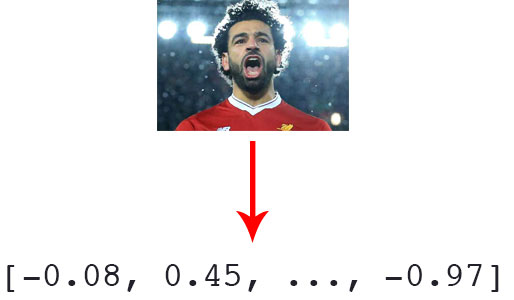

# AIFFEL_35일차 2020.09.10

Tags: AIFFEL_DAILY

### 일정


- [x]  LMS E-12
- [x]  다익스트라 알고리즘 다시 정리
- [x]  코딩마스터 Session7 문제풀이
- [x]  Dacon 처음부터 다시

# [E-12]나랑 닮은 연예인은 누구?


## **실습목표**

---

1. 임베딩에 대해 이해하고 얼굴의 임베딩 벡터를 추출합니다.
2. 얼굴의 임베딩 벡터로 닮은 꼴인 얼굴을 찾습니다.
3. 나와 가까운 연예인을 찾아냅니다.

# 임베딩

---

### 임베딩이란?

---

0과 1밖에 알지 못하는 컴퓨터에게 **다양한 형태의 정보를 표현하기** 위해 **벡터 공간에** 우리가 표현하고자 하는 정보를 **사상(mapping)하는 방법**.
고차원 벡터를 저차원으로 변환하면서 필요한 정보를 보존한다.

무언가를 벡터로 표현하면 원점에서 출발한 벡터공간상의 한 점.

⇒ 두 점 사이의 관계를 따지고 싶은 것으로 귀결된다.

즉, '두 얼굴이 얼마나 닮았나'? 라는 문제도 결국 '***두 얼굴 벡터 사이의 거리가 얼마나 되나?***' 의 문제임.

너무 차원수가 높은 공간에서의 비교는 사실상 무의미해집니다. 이 문제를 해결하기 위해서 얼굴을 표현하는 이미지 벡터를 **더 작은 차원**으로 줄일 수 있지 않을까요? . 이렇게 고차원 정보를 저차원으로 변환하면서 필요한 정보를 보존하는 것이 임베딩



우리가 가지고 있는 모든 정보는 상대적입니다. A는 B에 비해 C에 더 가깝다라는 상대적인 비교수치 말고는 우리가 컴퓨터에게 넘겨줄 수 있는 정보가 없습니다.

---

[https://cloud.google.com/solutions/machine-learning/overview-extracting-and-serving-feature-embeddings-for-machine-learning?hl=ko](https://cloud.google.com/solutions/machine-learning/overview-extracting-and-serving-feature-embeddings-for-machine-learning?hl=ko)

임베딩은 고차원 벡터를 저차원 공간으로 변환하는 것입니다. 이상적으로, 임베딩은 임베딩 공간에서 의미적으로 비슷한 입력 사항들을 가깝게 배치함으로써 입력에 포함된 의미 중 일부를 포착합니다.

임베딩은 협업 필터링(CF) 작업에서 비롯되었습니다.

Q. 임베딩 기법을 이용하여 표현할 수 있는 데이터??

텍스트 임베딩, 이미지 임베딩

텍스트(단어, 문장, 전체 문서), 이미지, 오디오 등과 같은 구조화되지 않은 데이터

Q. 임베딩 사용 사례?? 

예를 들어 의류를 쇼핑 중인 고객에게 패션 아이템을 추천하는 시스템에서는 색상, 치수, 가격, 유형, 하위유형을 비롯한 개별 항목을 기술하는 속성이 사용될 수 있습니다.

협업 필터링 및 임베딩

사용자의 시청 기록을 기준으로 서로 유사한 영화를 확인하려고 합니다. 이를 위해서는 특정 사용자가 시청한 영화는 '영화 선호도' 공간(임베딩)에서 가까이 배치되는 저차원적인 공간으로 영화를 임베딩하면 됩니다.

**패션 아이템, 영화, 휴양지, 뉴스 기사**와 같은 항목을 주요 특성이 인코딩된 간결하고 실제 값으로 표현된 특징 벡터(임베딩)로 나타내면 흥미로운 사용 시나리오를 다양하게 지원할 수 있습니다.

유사성 분석, 검색, trasfer learning

(텍스트, 이미지 또는 다른 유형의 입력 데이터를 특징 벡터로 인코딩하기 위해 선행 학습된 임베딩을 사용하는 것을 전이 학습이라고 부릅니다.)

---

## 얼굴임베딩 만들기(1): 얼굴인식

---

우리가 오늘 사용해 볼 얼굴 인식 라이브러리는 `dlib`을 사용해서 만들어진 Face Recognition 라이브러리입니다. `dlib`은 아주 널리 쓰이는 Object Detection 패키지입니다.

`dlib`에는 이미 HOG(Histogram of Oriented Gradient) feature를 사용해서 SVM(Support Vector Machine)의 sliding window로 얼굴을 찾는 face detector 기능을 제공하고 있습니다. 아래 그림에서도 보다시피 `dlib`의 얼굴 인식 정확도는 99.38%에 달한다고 합니다.

```python
wget [https://aiffelstaticprd.blob.core.windows.net/media/documents/biden.jpg](https://aiffelstaticprd.blob.core.windows.net/media/documents/biden.jpg) &&
wget [https://aiffelstaticprd.blob.core.windows.net/media/documents/bush.jpeg](https://aiffelstaticprd.blob.core.windows.net/media/documents/bush.jpeg) &&
wget [https://aiffelstaticprd.blob.core.windows.net/media/documents/clinton.jpeg](https://aiffelstaticprd.blob.core.windows.net/media/documents/clinton.jpeg) &&
wget [https://aiffelstaticprd.blob.core.windows.net/media/documents/obama.jpg](https://aiffelstaticprd.blob.core.windows.net/media/documents/obama.jpg) &&
wget [https://aiffelstaticprd.blob.core.windows.net/media/documents/trump.jpg](https://aiffelstaticprd.blob.core.windows.net/media/documents/trump.jpg) &&
mv biden.jpg bush.jpeg clinton.jpeg obama.jpg trump.jpg ~/aiffel/face_embedding/images
```

*얼굴만 잘라내기

```python
import face_recognition
import os

def get_gropped_face(image_file):
  
  face_locations = face_recognition.face_locations(image)

  #print(face_locations)  # 이미지에서 얼굴 영역의 좌표를 출력합니다.

  a, b, c, d = face_locations[0]
  cropped_face = image[a:c,d:b,:]
    
  return cropped_face
```

## 얼굴임베딩 만들기(2) FaceNet

---


얼굴의 특징을 추출하고 적은 차원의 벡터로 만들기 위해서 저희는 딥러닝을 사용합니다. 그렇다면 딥러닝 모델이 얼굴의 특징을 잘 비교할 수 있는 모델이 되도록 학습하려면 어떻게 해야 할까요?

⇒ 2015년 구글에서 발표한 FaceNet을 통해 배워보자.

(L2 Norm 을 거치고 Triplet Loss 를 사용함에 주목)

### L2 Normalization

---

모델 결과물의 L2 Distance를 구한 후에 이것으로 결과물을 나눠주어 Normalization을 해주는 과정

L2 Normalization 레이어를 거쳐나온 임베딩 벡터는 벡터의 크기가 1로 맞춰질 것이므로, 128차원의 공간상에 반지름이 1인 구가 있다고 할때, 구의 표면상의 한 점을 가리키는 벡터처럼 분포될 것

이렇게 제약조건을 주면 이후 두 점 사이의 거리를 계산할 때 두 벡터의 **절대적 크기에 무관**하게 두 벡터 사이의 각도에만 영향을 받게 될 것

*L2 loss

- L2 loss는 MSE(Mean Square Error)를 안다면 아주 익숙한 개념으로 target value인 실제값 와 예측값  사이의 오차를 제곱한 값들을 모두 합하여 loss로 계산한다.
- Least square error, LSE라고도 한다.


### Triplet loss

---


세 개의 데이터 쌍을 이용해 계산하는 손실함수

중심점(Anchor)를 기준으로 Positive 가 더 가깝게, Negative는 더 멀게 만드는 것!

임베딩 벡터 안에 보존되어야 할 정보는 **A는 B에 비해 C에 더 가깝다**라는 **상대적인** 비교수치

⇒ 이 아이디어를 Triplet loss 가 잘 반영하고 있다.

[Triplet Loss 설명영상]

[https://www.youtube.com/watch?v=d2XB5-tuCWU&ab_channel=Deeplearning.ai](https://www.youtube.com/watch?v=d2XB5-tuCWU&ab_channel=Deeplearning.ai)

```python
image_file = os.path.join(dir_path, 'obama.jpg')
face = get_gropped_face(image_file)   # 얼굴 영역을 구하는 함수(이전 스텝에서 구현)

# 얼굴 영역을 가지고 얼굴 임베딩 벡터를 구하는 함수
def get_face_embedding(face):
    return face_recognition.face_encodings(face)

embedding = get_face_embedding(face)  
embedding
```

```python
def get_face_embedding_dict(dir_path):
    file_list = os.listdir(dir_path)
    embedding_dict = {}
    
    for file in file_list:
       img_path = os.path.join(dir_path, file)
       face = get_gropped_face(img_path)
       embedding = get_face_embedding(face)
       if len(embedding) > 0:  # 얼굴영역 face가 제대로 detect되지 않으면  len(embedding)==0인 경우가 발생하므로 
                    # os.path.splitext(file)[0]에는 이미지파일명에서 확장자를 제거한 이름이 담깁니다. 
            embedding_dict[os.path.splitext(file)[0]] = embedding[0]
        
    return embedding_dict
```

## 얼굴임베딩 사이의 거리측정

---


각 128차원의 벡터는 넘파이(Numpy)로 연산을 하기위해서 리스트(list)에서 넘파이 배열(Numpy Array)로 변환해 줍니다. 그리고 각 벡터간의 거리를 numpy.linalg.norm를 활용하여 L2 Norm Distance로 계산합니다.

임베딩 벡터의 거리가 가까운 얼굴일수록 닮았다고 볼 수 있을 것입니다.

### L1 방식과 비교

---

L1을 쓰면 전체적인 distance 값의 분포가 커진다.

### **L1 loss**

- L1 loss를 보면, 식처럼 실제 값 와 예측값  사이의 차이값에 절댓값을 취해 그 오차 합을 최소화하는 방향으로 loss를 구한다.
- Least Absolute Deviations, LAD라고도 한다.


### L1 loss와 L2 loss의 비교

1. Robustness : L1>L2

Robustness는 outlier, 즉 이상치가 등장했을 때 loss function이 얼마나 영향을 받는지를 뜻하는 용어

2. Stability : L1<L2

Stability는 모델이 비슷한 데이터에 대해 얼마나 일관적인 예측을 할 수 있는가로 생각하면 된다.

얼굴 임베딩간 거리 구하기 함수. (L2 Norm)

```python
def get_distance(name1, name2):
    return np.linalg.norm(embedding_dict[name1]-embedding_dict[name2], ord=2)

get_distance('obama', 'trump')
```

## 얼굴임베딩 공간의 시각화

---

고차원 데이터를 저차원으로 바꾼 임베딩처럼 이런 다차원 벡터를 시각화하기 위해서 차원축소를 하는 방법들이 있습니다.예를 들어 PCA, T-SNE

tf의 Projector에서 고차원 벡터를 차원 축소 기법을 사용하여 눈으로 확인할 수 있도록 해준다.

[https://huyhoang17.github.io/128D-Facenet-LFW-Embedding-Visualisation/](https://huyhoang17.github.io/128D-Facenet-LFW-Embedding-Visualisation/)

⇒ 시각화 자료

- **PCA** 는 주성분 분석이라는 방법으로 *Principal Component Analysys* 의 준말입니다. 이 방법은 모든 차원의 축에 따른 값의 변화도인 분산(Variance)를 확인한 뒤 그 중 변화가 가장 큰 주요한 축을 남기는 방법입니다.
    - ⇒ 참고자료 : [https://bcho.tistory.com/1209?category=555440](https://bcho.tistory.com/1209?category=555440)

    

    

- **T-SNE** 는 고차원 상에서 먼 거리를 저차원 상에서도 멀리 배치되도록 차원을 축소하는 방식입니다. 먼저 random하게 목표하는 차원에 데이터들을 배치한 후 각 데이터들을 고차원 상에서의 배치와 비교를 하면서 위치를 변경해 주는 알고리즘으로 이해하시면 됩니다.
    - ⇒ 참고자료: [https://www.youtube.com/watch?v=NEaUSP4YerM&ab_channel=StatQuestwithJoshStarmer](https://www.youtube.com/watch?v=NEaUSP4YerM&ab_channel=StatQuestwithJoshStarmer)

PCA에서는 모든 차원이 잘 반영되지 않는 반면 T-SNE는 Iteration을 거칠 수록 가까운 벡터들이 잘 군집한 형태로 차원 축소가 되는 것을 볼 수 있습니다.

## 가장 닮은꼴 얼굴 찾아보기

---

```python
# name1과 name2의 거리를 비교하는 함수를 생성하되, name1은 미리 지정하고, name2는 호출시에 인자로 받도록 합니다.
def get_sort_key_func(name1):
    def get_distance_from_name1(name2):
        return get_distance(name1, name2)
    return get_distance_from_name1

sort_key_func = get_sort_key_func('trump')   
# 이렇게 생성된 함수 sort_key_func는 sort_key_func('obama') 라고 호출할 때 trump와 obama 사이의 임베딩 벡터 거리를 계산합니다.
```

embedding_dict 오름차순 정렬, 단, 정렬 기준은 trump 와의 임베딩 벡터 거리 함수.

```python
sorted(embedding_dict.items(), key=lambda x:sort_key_func(x[0]))
```

입력받은 임의의 이름에 대해 다른 이미지의 임베딩 거리를 정렬하여 출력.

```python
def get_nearest_face(name, top=5):
		
    
# 이렇게 생성된 함수 sort_key_func는 sort_key_func('obama') 라고 호출할 때 'name' input과 obama 사이의 임베딩 벡터 거리를 계산

	sort_key_func = get_sort_key_func(name)
	sorted_faces = sorted(embedding_dict.items(), key=lambda x:sort_key_func(x[0]))

  for i in range(top+1):
      if i == 0 :   # 첫번째로 나오는 이름은 자기 자신일 것이므로 제외합시다. 
          continue
      if sorted_faces[i]:
          print('순위 {} : 이름({}), 거리({})'.format(i, sorted_faces[i][0], sort_key_func(sorted_faces[i][0])))
```

## 프로젝트: 나랑 닮은 연예인을 찾아보자

---

결과물 : [https://github.com/bluecandle/2020_AIFFEL/blob/master/daily_notes/exploration_codes/e12_code/E12.ipynb](https://github.com/bluecandle/2020_AIFFEL/blob/master/daily_notes/exploration_codes/e12_code/E12.ipynb)

# 코딩마스터 Session7 문제풀이

---

[https://github.com/bluecandle/2020_AIFFEL/tree/master/coding_master/Session7_Greedy](https://github.com/bluecandle/2020_AIFFEL/tree/master/coding_master/Session7_Greedy)