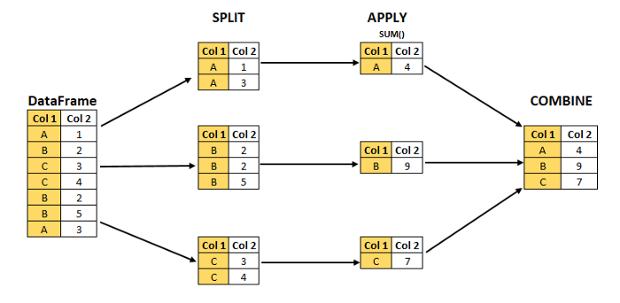

# AIFFEL_36일차 2020.09.11

Tags: AIFFEL_DAILY

### 일정


- [x]  LMS F-33
- [x]  코드마스터 session7 문제풀이

# [F-33] 맵리듀스로 그리는 빅데이터 지도


## **학습 목표**

---

- 분산환경에서 빅데이터를 처리하는 기본 패턴을 이해합니다.
- 맵리듀스의 기본 로직에 대해 이해합니다.
- 맵리듀스가 적용된 하둡, 스파크의 개요를 알아봅니다.
- 함수형 프로그래밍을 통한 맵리듀스 실행 모델 구동을 실습합니다.

## **학습 내용**

---

- 빅데이터의 기본패턴
- 분산환경의 개념
- Split-Apply-Combine 전략
- 맵리듀스(MapReduce)
- 하둡과 스파크
- 맵리듀스 실행 모델
- 파이썬 함수형 프로그래밍
- 맵리듀스 WordCount 예제 실습

## 빅데이터 처리의 기본 패턴

---

### 맵리듀스(Mapreduce)

---

하둡, 스파크 등 빅데이터를 다루는 솔루션들의 가장 근간이 되는 프로그래밍 모델.

처리해야할 데이터가 많으면 어떻게 할 것인가?

1. 많은 것을 잘게 나누어서
2. 각각을 처리한 후에
3. 처리한 것들을 모아서 통합 결과물을 낸다.

⇒ 이게 일반적으로 하는 사고방식! 그리고 이게 맵리듀스 개념의 전부.

### 비유 : 어느 만석꾼 부자집 이야기

---

쌀 한가마니는 대략 4000그릇이라고 합니다. 아까 방법으로 모래를 골라냈다가는… 대략 2400시간, 딱 100일 동안 밥을 못먹겠군요.

- 1) 한가마니의 쌀을 100등분으로 **잘게 나누어서**
- 2) 한명당 그 1/100을 가져가 **각각 처리**(한알씩 골라내기)를 열심히 한 후에
- 3) 각자가 분리해 낸 깨끗한 쌀을 **한데 모아** 다시 한가마니를 만들어 냈습니다.

일꾼 혼자서는 처리할 수 없는 일거리를 여럿이 나눠서 처리하는 것!

⇒ 데이터 분석의 Split-Apply-Combine Strategy라고 한다.

⇒ Mapreduce는 이런 모델의 한 특수한 형태라고 할 수 있음.

## Split-Apply-Combine

---

[https://medium.com/analytics-vidhya/split-apply-combine-strategy-for-data-mining-4fd6e2a0cc99](https://medium.com/analytics-vidhya/split-apply-combine-strategy-for-data-mining-4fd6e2a0cc99)

break up a big problem into small manageable pieces (Split), operate on each piece independently (Apply) and then put all the pieces back together (Combine).



Split ⇒ It creates the GroupBy object as a result

Apply ⇒ **Aggregation, Transformation, Filtering**

Combine ⇒ combine the result to get a new object

[EX] SQL 의 GroupBy문, R의 plyr 함수

---

[MapReduce: Simplified Data Processing on Large Clusters]

[https://static.googleusercontent.com/media/research.google.com/ko//archive/mapreduce-osdi04.pdf](https://static.googleusercontent.com/media/research.google.com/ko//archive/mapreduce-osdi04.pdf)

⇒ 구글에서 발표한 맵리듀스를 최초로 제안한 공식 자료


map 이 일을 할당하는 의미에서 map ⇒ 할당된 일을 수행하는 역할이라고 한다!

reduce가 처리된 일을 합치는 의미에서 reduce 이렇게 쓰인 것 같다?

- **`map()`** 함수는 Split된 부분 데이터를 가져다가 어떤 특별한 조작을 가하는, **`Apply`** 역할을 하는 함수입니다. 일꾼 비유에서 본다면, **모래섞인 쌀을 가져다가 한알 한알 쌀과 모래로 분리하고 있는 친구**가 이 **`map()`** 함수 역할을 하고 있습니다.
- **`reduce()`** 함수는 **`map()`** 함수가 만들어낸 **결과물을 어떤 기준에 따라 한군데로 다시 모아내는, `Combine` 역할을 하는 함수**입니다. 일꾼 비유에서 본다면, 친구들이 분리해 놓은 쌀과 모래들을 가져다가 쌀만 한 가마니에 모아담는 일꾼이 **`reduce()`** 함수 역할을 하고 있습니다.

## 맵리듀스의 원리

---

하나의 컴퓨터에서 하던 작업을 여러 개의 컴퓨터에서 처리하도록 분산싴키는 프로그래밍 모델.

MapReduce에서 map과 reduce 두 가지만 강조하고 있는 것 같지만, Split 단계를 전제!

(map 함수의 param에 `in_key` 가 들어온다.)

`map`함수는 Split된 데이터를 가져다가 `out_key`와 `intermediate_value`의 리스트로 변환합니다. out_key는 **map함수가 결과물을 구분하는 기준 키값**입니다. 일꾼 예제라면 0:쌀, 1:모래 같은 형태가 되겠죠.

그래서 일꾼 예제의 map 친구들은 길이 2인 list에 각각 깨끗한 쌀과 모래를 담아서 리턴할 것입니다.

`recuce` 함수는 `out_key` 기준으로 sum을 할 것입니다.

그리고 최종적으로 `out_value` 의 list를 출력함. ⇒ [ex] 전체 쌀과 전체 모래를 모아놓은 길이 2의 list가 최종 출력됨.


M이 Input을 입력받아 `Intermediate`로, R이 Intermediate를 `Out_key`기준으로 `Grouping`한 것을 입력으로 받아 Output을 출력하는 구조

### 약점??

---

reduce 함수는 모든 map 함수가 중간 결과물을 리턴할 때까지 기다렸다가 한꺼번에 그룹핑한 결과가 나올때까지 기다린다.

[ex] 한 친구의 작업이 끝날 때까지 한없이 기다려야 하는 것. ( 기다리는 동안 다른 일을 할 수도 있는건데!)

 

## 분산환경의 빅데이터 처리

---


## 병렬, 분산, 클러스터 컴퓨팅

---

### 병렬 컴퓨팅

---

한 대의 컴퓨터 안에서 CPU 코어를 여러 개 사용하여

***'한 대의 컴퓨터가 처리하는 데이터의 총량과 처리속도를 증가시키자'***

⇒ 멀티 프로세스, 멀티 쓰레드

### 분산 컴퓨팅

---

여러 대의 컴퓨터가 네트워크로 연결된 상황을 전제로 함.

⇒ P2P, HTTP, Network

### 클러스터 컴퓨팅

---

***여러 대의 컴퓨터들이 연결되어 하나의 시스템처럼 동작하는 컴퓨터들의 집합***

보통 노드와 관리자로 구성된다.

- 클러스터 노드 : 프로세싱 **자원**을 제공하는 시스템
- 클러스터 관리자 : 노드를 서로 **연결**하여 단일 시스템처럼 보이게 만드는 로직 제공

대표적 기술 : 병렬 컴퓨팅, 분산 컴퓨팅, 클라우드 컴퓨팅

응용의 주안점에 따라 위에 언급한 병렬 컴퓨팅, 분산 컴퓨팅, 클라우드 컴퓨팅도 있고, 클러스터에서 어떻게 데이터를 교환할 것인지에 대한 부분, 그리고 데이터 서버를 클러스터로 관리한다면 파일 시스템을 어떻게 연결할지에 대한 부분 등 다양한 분야에서 연구가 이루어지고 있습니다.

분야가 방대하지만 지금은 기본적으로 클러스터란 여러 대의 컴퓨터를 묶여서 하나의 시스템처럼 사용하는 것이라는 것만 이해하시면 됩니다.

## 하둡과 스파크

---

하둡 : ***대용량 데이터를 분산 처리할 수 있는 자바 기반의 오픈소스 프레임워크***

**GFS(Google File System)**이라는 구글의 분산 파일 시스템이 나오면서 이미 천문학적인 크기가 된 인터넷 검색 데이터를 분산처리하는 기술을 통해 구글이 기술적 우위를 공고히 하게 됩니다. 특히 GFS는 구글에서 공개를 하지 않았습니다.

이에 아파치 재단(Apache Foundation)에서는 구글의 맵리듀스 및 GFS에 해당하는 **HDFS(Hadoop File system)**를 포함하는 **하둡(Hadoop)**이라는 오픈소스 프로젝트를 2006년 4월에 발표하게 됩니다.

근데, 하둡의 약점! (Mapreduce의 문제이기도 하다) map 함수가 모두 종료해야 reduce 함수가 실행됨.

⇒ 하둡이 실시간 서비스 제공을 불가능하게 하는 요소

⇒ 그래서, 빅데이터 기반의 배치성 통계작업에만 주로 사용되었음.

***하둡의 단점을 극복하게 만든 것이 스파크!***

스파크(Spark)는 종래의 Mapreduce 기능에서 Map함수가 전부 종료되지 않았더라도 Map의 결과를 스트리밍하는 방식으로, Map의 결과가 다 나와야만 Reduce를 수행한다는 전제를 깨버리게 됩니다.

Mapreduce를 다시 살펴봅시다.


1. map 함수이 결과가 디스크에 저장되고, 그걸 reduce 함수가 다시 읽어와야한다.
2. 이로 인한 성능상의 손실이 크다!
3. 그래서, 스파크는 인메모리 데이터 엔진을 통해 초기 맵리듀스의 성능상 한계를 크게 극복
4. 실제로 하둡 대비 10배에 달하는 속도 우위 

***단, 스파크가 하둡에 절대 우위는 아니다.***

하둡은 스파크가 제공하지 않는 HDFS 같은 분산 파일 시스템을 제공한다.

그리고 스파크 자체가 하둡 기잔으로 구동하는 것을 목적으로 만들어졌다!

***그렇지만, 간과할 수 없는 스파크의 특징***

1. 자바, 스칼라, 파이썬, R 프로그래밍 언어를 위한 네이티브 바인딩 제공
2. SQL, 스트리밍 데이터, 머신러닝, 그래프 프로세싱 지원

[ex] csv 파일을 Pandas로 읽어 DataFrame으로 분석하는 것처럼, 내 컴퓨터에 저장도 하기 힘들만큼 많은 데이터를 DataFrame으로 처리 가능하다.

즉, 사용자 입장에서는 스파크 뒤에 있는 수많은 컴퓨터들에 분산저장되어 있는 거대한 데이터가 전부 내가 쓰고 있는 컴퓨터 한 대에 들어있는 것처럼 착각하게 만드는 클러스터 컴퓨터를 갖게 되는 것.

그리고, 파이썬을 통해 다룰 수 있다는 것이 무엇보다도 두드러진 장점이 아닐까요?

## 함수, 파이썬의 1급 시민

---

***함수형 프로그래밍의 중요성에 관한 내용, 파이썬을 이용한 맵리듀스 프로그래밍에 중요한 부분.***

파이썬에서 함수가 매우 특별하다. 이 특징이 파이썬에서 맵리듀스를 활용하는 것을 매우 강력하게 한다.

- 함수는 다른 함수의 인자로 전달될 수 있다. (= 인자(매개변수)로 전달이 가능)
- 함수는 변수에 할당될 수 있다.
- 함수는 다른 함수의 결과로서 반환될 수 있다. (=다른 함수의 반환값)

### 함수는 다른 함수의 인자로 전달될 수 있다.

---

```python
#에러메세지를 출력하는 함수
def errormessage(format_func, msg):
    print(format_func(msg))

#단어의 첫글자만 대문자로 만드는 함수
def to_upper(msg):
    t = msg.split(" ")
    T = []
    for i in t:
        i = i[0].upper() + i[1:]
        T.append(i)
    T = " ".join(T)
    return T

print("슝=3")

msg = "you have limited access"
errormessage(to_upper, msg)

# >> You Have Limited Access
```

### 함수는 변수에 할당될 수 있다

---

매개변수로 전달될 수 있다는 의미는 변수로써 할당이 가능하다는 뜻입니다.

```python
def france():
    print('bonjour')

def italy():
    print('ciao')

hello = france
print(hello)
# >> <function france at 0x7f807c703200>

hello()
# >> bonjour

print(type(hello))
# >> <class 'function'>
```

### 함수는 다른 함수의 결과로서 반환될 수 있다.

---

```python
def func1(x):
    return x**2

def func2():
    return func1

print(func1(3))
print(func2()(3))

# >> 9
# >> 9
```

### ***함수형 프로그래밍 철학***

---

1. 변경 가능한 상태를 불변의 상태(Immutab)로 만들어 에러를 없애자.
2. 모든 것은 객체이다.
3. 코드를 간결하게 하고 가독성을 높여 구현할 로직에 집중한다.
4. 보다 효율적인 동시성 작업

## 함수형 프로그래밍과 맵리듀스

---

파이썬 자료 구조 중에 `List, Tuple, Dictionary, Set`와 같은 형태의 자료형을 컬렉션(`Collection`) 이라고 하기도 합니다. 다른 말로는 컨테이너(`Container`)라고 부르기도 해요.


collections 모듈에서 제공하는 데이터 컬렉션 ( List, Tuple, Dict, Set 외에 collections 모듈에서 제공하는것들 )

[https://docs.python.org/3.8/library/collections.html](https://docs.python.org/3.8/library/collections.html)

⇒  deque, namedtuple(), defaultdict 는 한 번씩 읽어보자

### namedtuple()

---

`collections.**namedtuple**`(*typename*, *field_names*, **, *rename=False*, *defaults=None*, *module=None*)

Returns a new tuple subclass named *typename*.

```python
>>> # Basic example
>>> Point = namedtuple('Point', ['x', 'y'])
>>> p = Point(11, y=22)     # instantiate with positional or keyword arguments
>>> p[0] + p[1]             # indexable like the plain tuple (11, 22)
33
>>> x, y = p                # unpack like a regular tuple
>>> x, y
(11, 22)
>>> p.x + p.y               # fields also accessible by name
33
>>> p                       # readable __repr__ with a name=value style
Point(x=11, y=22)
```


namedtuple 객체를 호출하면 '__repr__' 함수를 통해 해당 객체가 어떤 객체인지 표현된다는 의미군.

*`_make() 함수`* 주어진 데이터로 새로운 namedtuple 만들기


*`_asdict() 함수`* dict형태로 변환하기


`*_replace() 함수`* 원래 tuple 변환 안되잖아? 변경 가능하게 해놓음


`*getatter() 함수 활용` nametuple 객체의 값을 key 값으로 빼올 수 있다. (dict 에서 접근하는 것처럼!)*


### deque

---

`class collections.deque([iterable[, maxlen]])`

Returns a new deque object initialized left-to-right (using append()) with data from iterable. If iterable is not specified, the new deque is empty.

Deques are a generalization of stacks and queues (the name is **pronounced** “**deck**” and is short for “**double-ended queue**”).

Deques support thread-safe, memory efficient appends, and pops from either side of the deque with approximately the same O(1) performance in either direction.

***list 와의 차이점!***

Though list objects support similar operations, they are optimized for fast fixed-length operations and incur O(n) memory movement costs for pop(0) and insert(0, v) operations which change both the size and position of the underlying data representation.

⇒ list는 fixed size에서 유리하다!

⇒ list에서 pop,insert를 하고자 한다면, 사이즈를 바꾸는 작업이 동반되기 때문에, O(n)의 시간이 걸리지만, deque 는 O(1) 의 시간을 보장한다는 이야기.

`maxlen` 값을 통해 길이를 제한할 수 있지만, 지정해주지 않으면 무한정 커진다!

Once a bounded length deque is full, when new items are added, a corresponding number of items are discarded from the opposite end.

⇒ 제한된 deque의 경우, 길이 넘어서 값이 들어오면, 새로운 값이 들어온 반대쪽에 있는 값들이 빠져나옴.

***`append()`*** 오른쪽에 새로운 값을 집어넣는게 기본이다.

***`appendleft()`*** 왼쪽에 새로운 값을 집어넣기.

`count()` 갯수세기

`insert(i,x)` i 자리에 x 넣기

`pop(), popleft()` 오른쪽, 왼쪽에서 빼기. 단, 하나도 없으면 IndexError 발생한다.

`remove(v)` 처음으로 v 값이 나타나는 지점의 v를 없앤다. 안찾아지면 ValueError

```python
>>> from collections import deque
>>> d = deque('ghi')                 # make a new deque with three items
>>> for elem in d:                   # iterate over the deque's elements
...     print(elem.upper())
G
H
I

>>> d.append('j')                    # add a new entry to the right side
>>> d.appendleft('f')                # add a new entry to the left side
>>> d                                # show the representation of the deque
deque(['f', 'g', 'h', 'i', 'j'])

>>> d.pop()                          # return and remove the rightmost item
'j'
>>> d.popleft()                      # return and remove the leftmost item
'f'
>>> list(d)                          # list the contents of the deque
['g', 'h', 'i']
>>> d[0]                             # peek at leftmost item
'g'
>>> d[-1]                            # peek at rightmost item
'i'

>>> list(reversed(d))                # list the contents of a deque in reverse
['i', 'h', 'g']
>>> 'h' in d                         # search the deque
True
>>> d.extend('jkl')                  # add multiple elements at once
>>> d
deque(['g', 'h', 'i', 'j', 'k', 'l'])
>>> d.rotate(1)                      # right rotation
>>> d
deque(['l', 'g', 'h', 'i', 'j', 'k'])
>>> d.rotate(-1)                     # left rotation
>>> d
deque(['g', 'h', 'i', 'j', 'k', 'l'])

>>> deque(reversed(d))               # make a new deque in reverse order
deque(['l', 'k', 'j', 'i', 'h', 'g'])
>>> d.clear()                        # empty the deque
>>> d.pop()                          # cannot pop from an empty deque
Traceback (most recent call last):
    File "<pyshell#6>", line 1, in -toplevel-
        d.pop()
IndexError: pop from an empty deque

>>> d.extendleft('abc')              # extendleft() reverses the input order
>>> d
deque(['c', 'b', 'a'])
```

### defaultdict

---

`class collections.defaultdict([default_factory[, ...]])`

Returns a new dictionary-like object. defaultdict is a subclass of the built-in dict class.

```python
# (1)
s = [('yellow', 1), ('blue', 2), ('yellow', 3), ('blue', 4), ('red', 1)]
d = defaultdict(list)
for k, v in s:
    d[k].append(v)

sorted(d.items())
[('blue', [2, 4]), ('red', [1]), ('yellow', [1, 3])]
```


```python
# (2)
d = {}
for k, v in s:
    d.setdefault(k, []).append(v)

sorted(d.items())
[('blue', [2, 4]), ('red', [1]), ('yellow', [1, 3])]
```

비어있는 dict 를 setdefault() 함수를 통해 defaultdict로 간주하고 (2) 의 방식대로 하는 것도 가능하다.


하지만, (1)의 방법이 더 간단하다!

빅데이터에서도 key, value 등의 기본적인 철학을 공유하는 경우가 많으니 친해질 필요가 있다!

### 맵리듀스 기본 함수 알아보기

---

파이썬에서 함수를 데이터 컬렉션에 적용하는 3가지 패턴

- map
- filter
- reduce

### map

---


컬렉션의 모든 요소에 함수를 적용(=매핑)한다.

함수 $M(x)$ 를 컬렉션 C의 항목에 매핑하는 함수를 수식으로 나타내면

⇒  $M(x) : x \in C$

```python
mynum = ['1','2','3','4']
mynum_int = list(map(int, mynum))  # mynum의 각 원소에 int 함수를 적용
print(mynum_int)

mynum_square = list(map(lambda x : x*x, mynum_int))  # mynum_int의 각 원소 x에 lambda x : x*x 함수를 적용
print(mynum_square)

>>> [1, 2, 3, 4]
>>> [1, 4, 9, 16]
```

### filtering

---


컬렉션 내의 요소를 선택(=필터링)한다.

컬렉션 C의 요소 x에 대해서 조건 F(x) 에 부합하는 x만을 필터링 하는 수식

⇒ $x : x \in C, ifF(x)$

```python
mynum = range(-5, 5)  
mynum_plus = list(filter(lambda x: x > 0, mynum)) # mynum의 각 원소 x에 대해 lambda x: x > 0 인지 체크하는 필터를 적용
print(mynum_plus)

>> [1,2,3,4]
```

### reducing

---

컬렉션을 축약(=리듀싱)한다. 가장 일반적인 요소는 시그마 연산.

${\displaystyle \sum _{x\in C}x}$

```python
from functools import reduce
mynum = [1, 2, 3, 4, 5]
add = reduce(lambda x, y: x + y, mynum)  # reduce는 내부에 관리하는 x 변수에 mynum의 각 원소 y를 차례차례 더하여 x에 반영한다.

print(add)
>> 15
```

Mapreduce는 map과 reduce만으로 이루어져 있는 보편적인 프로그래밍 모델입니다.

이 모델이 보편성을 유지하려면 **map이 적용되는 방식과 reduce가 적용되는 방식이 미리 정해져 있으면 안됩니다**. 위와 같이 ***map과 reduce가 적용되는 방식을 규정한 함수를 인자로 받는 함수형 프로그래밍이 가능하다는*** 것은 Mapreduce 프로그래밍 모델을 매우 **유연하고 강력하**게 만들어 주게 됩니다.

map, reduce 라는 것은 주어진 것을 매핑한다 , 축소한다는 구조적인 기능을 하는 것.

그리고 무엇을, 어떻게 매핑하고 축소할 것인지는 input 데이터와 함수로 들어오게 된다!

근데 '어떻게'의 부분을 함수로 받을 수 있다는 것이 함수형 프로그래밍의 큰 장점이 되는 것!

## 맵리듀스 예제

---


output은 각각의 키-밸류 쌍으로 존재.

### 예제 : 알파벳 수 찾기

---


**1. 입력 데이터**

- hello python

**2. Split**

- h,e,l,l,o,(공백),p,y,t,h,o,n

**3. Map**

- (h:1, e:1, l:1, l:1, o:1, ' ':1, …)

**4. Reduce**

- (h:1, e:1, l:2…)

```python
# Mapper: 입력데이터를 나누고 매핑한다.
 
#input data
text = 'hello python'

def mapper(text):
    split = []
    for i in text:
        split.append((i, 1))
    return split
mapper('123')
>> [('1', 1), ('2', 1), ('3', 1)]
# (char,1) 이런 형태로 tuple을 집어넣는다.
```

```python
# Reducer: 매퍼에서 입력받은 값 중 같은 항목은 합칩니다.
def reducer(split):
    out = {}
    for i in split:
# out dict 에 포함되어있지 않다면, 추가해주고, 이미 포함되어있다면 값 1 더해주기.
        if i[0] not in out.keys():
            out[i[0]] = 1
        else:
            out[i[0]] += 1
    return out
```

```python
# MapReduce: 출력
reducer(mapper(text))
>> {'h': 2, 'e': 1, 'l': 2, 'o': 2, ' ': 1, 'p': 1, 'y': 1, 't': 1, 'n': 1}
```

# 코드마스터 Session7 문제풀이


[https://github.com/bluecandle/2020_AIFFEL/tree/master/coding_master/Session7_Greedy](https://github.com/bluecandle/2020_AIFFEL/tree/master/coding_master/Session7_Greedy)