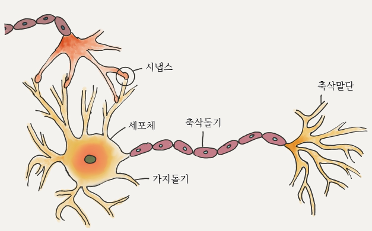

# AIFFEL_37일차 2020.09.14

Tags: AIFFEL_DAILY

### 일정


- [x]  풀잎 codingmaster session7 greedy algorithm 발표 및 진행
- [x]  LMS F34
- [x]  LMS F35 ⇒ OpenCV 부분 이어서 해야함.

# [F-34] 활성화 함수의 이해


## **목차**

---

- 활성화 함수
    - 퍼셉트론
        - 신경세포의 구조
        - 퍼셉트론의 구조
    - 활성화 함수
- 선형과 비선형
    - 선형
    - 비선형
    - 비선형 함수를 쓰는 이유
        - 그렇다면..(비선형 함수를 쓴다면?)
- 활성화 함수의 종류
    - 이진 계단 함수
        - 이진 계단 함수의 한계
    - 선형 활성화 함수
        - 선형 활성화 함수의 한계
    - 비선형 활성화 함수
        - 시그모이드/로지스틱
            - Softmax는 뭔가요?
        - 하이퍼볼릭 탄젠트
        - ReLU
        - ReLU의 단점을 극복하기 위한 시도들

## 활성화 함수

---

딥러닝에서 활성화 함수를 쓰는 결정적 이유??

딥러닝 모델의 ***표현력*** 을 향상시켜주기 위함!

⇒ 모델의 representation capacity 혹은 expressivity 를 향상시킨다.

⇒ why? 활성화함수는 왜 모델의 표현력을 향상시켜주는것일까??

### [예시]

$f(x)=xw_1+b_1$ 이런 모양의 모델을 가정.

이 모델로 $x^2, x^5, sin(x)$  등으로 표현되는 데이터를 학습할 수 있을까? ***그럴 수 없다!***

⇒ why? $w_1, b_1$ 값을 아무리 바꿔도 $x^2,x^5,sin(x)$ 와 같은 함수는 전혀 표현할 수 없다.

근데, 딥러닝 모델의 파라미터들은 입력값 x와 선형관계임! $w \times x + b$ 이런식으로 표현되는, 즉 곱하고 더하는 연산만 하면서 그 다음 layer로 전달되기 때문.

⇒ 이런 상태로 두면 아무리 레이어를 쌓아봐야 선형(직선)관계이다.

⇒ 근데, 이미지 데이터처럼 무수히 많고 복잡한 특징을 가진 비선형 데이터를 표현하기 위해서는 딥러닝 모델도 비선형성을 지니고 있어야함! ⇒ 이를 위해 활성화 함수가 필요하다!

## 퍼셉트론

---

딥러닝 모델에서 하나의 층을 가져와 다시 쪼개면 '노드'라는 것으로 쪼개짐. 이거 하나가 퍼셉트론

퍼셉트론을 쌓으면 단층 퍼셉트론, 단층 퍼셉트론을 쌓으면 다층 퍼셉트론



- 가지돌기
    - 세포로 전달되는 신호를 받아들이는 부분입니다.
- 축삭돌기
    - 세포에서 다른 세포로 신호를 전달하는 부분입니다.
- 시냅스
    - 가지돌기와 축삭돌기 사이에 있는 부분으로 신호 전달의 세기를 담당하며 시냅스의 발달 정도에 따라 같은 신호도 강하게 전달되거나 약하게 전달됩니다. 시냅스는 사용 빈도에 따라 커지거나 작아지며 심지어 시냅스 자체가 사라지기도 합니다.
- 세포체
    - 세포체는 각 가지돌기로 부터 들어온 신호들로 부터 자신의 출력 신호를 만들고 이를 다음 세포에 전송합니다. 이때의 출력 신호는 단순히 입력신호들의 합이 아닌 비선형 방식으로 결정됩니다. 즉, 합이 일정 수준 이하이면 비활성 상태가 되어 신호를 무시하고, 일정 수준을 넘게되면 활성 상태가 되어 신호를 다음 세포로 전송합니다.

### 퍼셉트론의 구조

---


- 퍼셉트론에 주어지는 입력은 신경세포에서 가지돌기로 받아들이는 신호에 해당합니다.
- 각 입력 항에 곱해지는 가중치는 신경 세포들의 연결 부위에 형성된 **시냅스의 발달 정도**에 해당합니다.
- $x_i w_i$ 값들은 각 가지돌기에서 시냅스를 거쳐서 오는 신호들에 해당되며 세포체에서 이 신호들은 합쳐(Σ)집니다.
- 실제 신경세포에는 없지만 퍼셉트론에선 추가로 편향이라고 불리는 b 라는 신호 또한 합산에 포함됩니다.
- 합쳐진 신호는 세포체에서 신호를 처리하는 방식과 비슷하게 적절한 **활성화 함수(activation function)(f)** 를 거쳐 출력이 결정됩니다.

$X = \sum_{i=1}^n x_i w_i + b
\\
Y = f(X)$

### 활성화 함수

---

활성화 함수는 신경 세포로 치면 **세포체**에서 일어나는 일을 맡고있음.

⇒ 들어온 신호가 특정 임계점을 넘으면 출력을 하고, 넘지 못하면 무시

⇒ 또한, 활성화 함수는 신호를 '전달'해주기 때문에, Transfer function으로도 알려져 있음.

## 선형과 비선형

---

### 선형

---

[https://www.youtube.com/watch?time_continue=1&v=kYB8IZa5AuE&feature=emb_logo&ab_channel=3Blue1Brown](https://www.youtube.com/watch?time_continue=1&v=kYB8IZa5AuE&feature=emb_logo&ab_channel=3Blue1Brown)

A great way to understand functions of vectors is to use movement.

---

***선형 변환*** 이란 '선형'이라는 규칙을 지키며 V 공간상의 벡터를 W 공간상의 벡터로 바꿔주는 역할을 합니다.

V 와 W 가 어떤 (1)벡터 공간이고 둘 모두 (2)실수 집합 (3)상에 있다고 가정하겠습니다. 이 때 함수 (4)

$\mathcal{T}: V \rightarrow W$ 가 다음 두 조건을 만족할 때,

- 가산성(Additivity) : 모든 x,y∈V 에 대해, $\mathcal{T}(x+y) = \mathcal{T}(x)+ \mathcal{T}(y)$
- 동차성(Homogeneity) : 모든 x∈V,c∈R 에 대해, $\mathcal{T}(cx) = c\mathcal{T}(x)$

우리는 함수 T 를 **선형 변환(linear transformation)** 이라고 부릅니다.

(1) 간단하게 말해서 벡터를 그릴 수 있는 공간입니다. 영상에서의 좌표 평면이라고 생각하시면 됩니다.

(2) 정확히 표현하면 같은 **체(field)에 속해 있다**고 해야 하나, 이 글에선 실수만 다루기 때문에 실수 집합 상에 있다고 표현했습니다. 체의 예로는 실수 집합 R, 유리수 집합 Q, 복소수 집합 C 등이 있습니다.

(3) **실수 집합 상에 있다**는 말은 V 를 이루는 **원소들이 실수**라는 의미입니다. 예를 들어 실수 집합 상의 V가 어떤 벡터들의 집합 이라고 했을 때, 그 백터는 실수 벡터(벡터의 각 원소가 실수)가 됩니다.

(4) 정의역(domain)이 V 이고 공역(codomain)이 W 인 함수 T 라는 의미입니다.


⇒ T는 선형이다.

T가 선형이라면 다음과 같은 성질을 가집니다.

- T(0)=0.
- 모든 x,y∈V와 c∈R 에 대해 다음 식과 동치입니다.
    - $\mathcal{T}(cx+y)=c\mathcal{T}(x)+\mathcal{T}(y)$
- 모든 x,y∈V에 대해 T(x−y)=T(x)−T(y)
- x1,x2,…,xn∈V 과 a1,a2,…,an∈R 에 대해 다음의 식와 동치입니다.
    - $\mathcal{T} \biggl(\sum_{i=1}^n a_ix_i \biggl) =  \sum_{i=1}^n a_i\mathcal{T}(x_i)$

일반적으로 주어진 함수가 선형인지 확인해 볼때는 2번째 성질을 이용합니다.

$\mathcal{T}(cx+y)=c\mathcal{T}(x)+\mathcal{T}(y)$

### [예시]

아래와 같이 정의된 함수 $\mathcal{T} : R^2 \rightarrow R^2$ 는 선형일까요?

$\mathcal{T}(a_1,a_2) = (a_1+2a_2, a_2)$

$c \in \Bbb{R}$ 이고 $(x_1, x_2), (y_1, y_2) \in \Bbb{R}^2$ 라고 하겠습니다. 그럼,

$c(x_1,x_2)+(y_1,y_2)=(cx_1+y_1, cx_2+y_2)$ 이므로, 이를 이용해서 $\mathcal{T}(c(x_1,x_2)+(y_1,y_2))$ 를 구하면 다음과 같다.

$\begin{aligned}
\mathcal{T}(c(x_1,x_2)+(y_1,y_2)) & = \mathcal{T}(cx_1+y_1, cx_2+y_2) \\
& = (cx_1+y_1 + 2(cx_2+y_2), cx_2+y_2)
\end{aligned}$

(위에서 T 함수가 정의된대로 대입한거임)

또한,

$\begin{aligned}
c\mathcal{T}(x_1,x_2)+\mathcal{T}(y_1,y_2) & = c(x_1+2x_2,x_2)+(y_1+2y_2,y_2)\\
& = (cx_1+2cx_2+y_1+2y_2, cx_2+y_2)\\
& = (cx_1+y_1 + 2(cx_2+y_2),cx_2+y_2)
\end{aligned}$

(2번째 성질을 이용하여 계산해본거임)

두 값이 같다! $\mathcal{T}(c(x_1,x_2)+(y_1,y_2))=c\mathcal{T}(x_1,x_2)+\mathcal{T}(y_1,y_2)$

그래서, 2번째 성질에 의해  $\mathcal{T}$ 는 **선형**이다.

## 비선형 함수를 쓰는 이유

---

한 문장으로 요약하자면, ' ***딥러닝 모델의 표현력을 향상시키기 위해서***  '

그렇다면, 레이어를 충분히 쌓는다면 선형 활성화 함수를 사용한 모델의 표현력을 상승시키는건 안되나??

[예시]


$y = f(w_3f(w_2f(w_1x)))$

bias는 편의상 0으로 둔다.

여기서, f가 선형이라면?

f가 선형이기 때문에 선형 함수의 정의에 의해 $f(w_1x) = w_1f(x)$ 로 쓸 수 있기 때문에 이를 적용시키면 $w_1, w_2, w_3$ 을 아래의 식과 같이 합칠 수 있다.

$\begin{aligned}
y = f(w_3f(w_2f(w_1x))) & = f(w_3f(f(w_1w_2x)))\\
& = f(f(f(w_1w_2w_3x)))\\
& = f(f(f(Wx)))\\
\end{aligned}$

$W = w_1w_2w_3$


$w_i$ 가 서로 자리를 바꿀 수 있는 이유는 $w_i$ 가 스칼라이기 때문.

⇒ 자리를 바꿀 수 있다는 의미는 가중치 업데이트가 $w_1,w_2,w_3$ 셋 전부에서 일어날 필요가 없다는 것.

선형함수들의 함성함수도 선형인가? 선형이지!

⇒ 3개의 선형함수로 나누지 않고 하나의 다른 선형함수로 표현해도 전혀 다르지 않다는 것!

⇒ 선형 활성화 함수를 사용한다면, 노드의 개수를 아무리 많이 붙여도 결국 하나의 노드를 사용하는 것과 차이가 없습니다.

⇒ ax 에서 a값만 바꾸어 $x^2$ 을 만드는 것은 불가능하잖아

### 그렇다면, 단일 노드가 아닌, layer들로 구성되어 있는 상황에서도?

---

결론적으로, layer를 쌓아도 활성화 함수가 선형이라면 모델의 표현력은 증가하지 않는다!


activation value 표현


 

 $w_n^{l,m}$ 

$\begin{aligned}& l :layer ~index \\& m:l번째 ~layer의 ~node~index \\& n : (l-1)~번째~layer의~node~index\end{aligned}$

( 그림기준으로 오른쪽이 l 번째 layer, 오른쪽 중간에 있는 노드가 ㅣ 번째 layer의 m 번째 node )

$a_j^l ~~ or ~~  a_j^{l-1}$

l : layer index

j : l 번째 layer의 node index (그림에서는 m,n)

$a_1^3=f(\Sigma_jf(\Sigma_ix_iw_i^{2,j})w_j^{3,1}) - (3)$

$\begin{aligned}a_2^2&=f(\Sigma_ix_iw_I^{2,3}) \\&=f(x_1)w_1^{2,2}+f(x_2)w_2^{2,2}+...-(4)\end{aligned}$

⇒ 두 식에서 공통점?? input data의 $x_1,x_2,x_3$ 에 대해 항들이 **독립적으로 분리** 되었다.


### 그렇다면, layer마다 비선형 함수가 있다면?

---


$a_1^3=f(\Sigma_jf(\Sigma_ix_iw_i^{2,j})w_j^{3,1})$

이 식을

$a_1^3=f(f(x_1))(\Sigma_jw_1^{2,j}w_j^{3,1})+f(f(x_2))(\Sigma_jw_2^{2,j}w_j^{3,1})+...$ 이렇게 표현할 수 없다.

## 활성화 함수의 종류 (1) 이진 계단 함수

---

단층 퍼셉트론(노드의 갯수가 1개)이라는 초기의 신경망에서 자주 사용되었음.


⇒ 이러한 신경망은 선형적으로 구분가능한(linearly separable) 문제를 구현할 수 있음.

⇒ 하나의 선으로 구분할 수 있는 문제를 풀 수 있음.

⇒ AND, OR gate를 구현할 수 있다.

⇒ 하지만, XOR gate는 구현할 수 없지! ( 하나의 선으로 구분할 수 없기때문 )

⇒ 이런 문제를 해결하기 위해 여러 층을 쌓는 다층 퍼셉트론(MLP) 를 사용.

(노드의 갯수가 2개 이상)

⇒ 다층 퍼셉트론을 사용하면 이진 계단 함수로도 비선형 데이터를 예측할 수 있다는 의미

⇒ 하지만, 큰 단점들 존재

1. Backprop을 사용하지 못한다!

(0에서 미분이 되지 않고, 0인 부분을 제외하고 미분을 하더라도 다 0이 나옴, 즉, 가중치 업데이트가 안됨.)

2. 다중 출력은 할 수 없다.

(1 또는 0으로만 출력이 가능하기 때문)

그냥 초창기에 이런 것도 있었구나 정도만 알고 넘어가자.

## 활성화 함수의 종류 (2) 선형 활성화 함수

---

대표적인 선형 함수로는 $f(x)=x$가 있습니다. 즉, 신호를 받은 그대로 출력하는 것이죠.

선형 활성화 함수로는 비선형 데이터를 처리할 수 없다!

층을 쌓는다고 해도 불가능하다! (XOR gate를 표현할 수 없다.)

⇒ 선형 활성화 함수를 사용하면 아무리 층을 쌓아도 결국 하나의 노드를 쓰는 것과 같다는 증명을 위에 함.

## 활성화 함수의 종류 (3) 비선형 활성화 함수 - 시그모이드, Softmax

---

비선형 활성화 함수를 사용한 모델은 역전파 알고리즘 사용 가능.

다중 출력도 가능.

비선형적 특성을 지닌 데이터도 예측 가능.

⇒ 앞서 언급된 활성된 함수들의 문제점들을 다 해결해준다고 보면 된다!

### 시그모이드

---

$\sigma(x) = \frac{1}{1+e^{-x}}$

시그모이드 함수의 치역은 (0,1) ⇒  $0<\sigma(x)<1$

시그모이드 함수의 미분

$\begin{aligned}
\frac{d \sigma(x)}{dx} &= \frac{e^{-x}}{(1+e^{-x})^2}\\
& = \frac{1}{1+e^{-x}}\frac{e^{-x}}{1+e^{-x}} \\
& = \frac{1}{1+e^{-x}}\biggl(\frac{1+e^{-x}}{1+e^{-x}}-\frac{1}{1+e^{-x}}\biggr)\\
& =\sigma(x)(1-\sigma(x))
\end{aligned}$

수치미분과 해석미분의 차이

```python
# 수치 미분
def num_derivative(x, function):
    h = 1e-15 # 이 값을 바꾸어 가며 그래프를 확인해 보세요
    numerator = function(x+h)-function(x)
    return numerator/h

# 두 그래프의 차이
diff_X = [-5+x/100 for x in range(1001)]
dev_y = np.array([dev_sigmoid(x) for x in diff_X])
num_dev_y = np.array([num_derivative(x, sigmoid) for x in diff_X])

diff_y = dev_y - num_dev_y
plt.plot(diff_X, num_dev_y, label='numerical')
plt.plot(diff_X, dev_y, label='analytic')
plt.plot(diff_X, diff_y, label='differnce')
plt.legend()

plt.show()
```


시그모이드 함수의 단점

1. 0또는 1에서 포화(saturate) 된다. 기울기 변화가 없다는거지!

역전파에서 이 0 과 가까워진 그래디언트는 앞에서 온 역전파 값에 곱해지게 되는데 그렇게 되면 그 이후로 전파되는 모든 역전파 값이 0 에 근접하게 되어 사실상 가중치 업데이트가 일어나지 않게 됩니다. 이것을

**'그래디언트를 죽인다(kill the gradient)'**

라고 표현합니다. 극단적인 예로 만약 어떤 모델의 초기 가중치 값들을 아주 크게 잡아 포화상태를 만들면 역전파때 그래디언트가 죽기 때문에 아무리 많이 에포크를 돌려도 훈련이 거의 되지 않습니다.

2. 출력이 zero-centered 가 아니다!

이로인해 훈련의 시간이 오래 걸리게 된다!

입력값으로 들어오는 데이터의 값이 모두 양수라고 가정하고 모델에 있는 한 노드의 출력 값이$\sigma(\sum_i w_i x_i + b)$ 라고 해보자. 그럼 이 노드의 가중치 업데이트를 위해 구해야하는 그래디언트는 아래와 같다.

$\begin{aligned}
    \frac{\partial L}{\partial w} = ~&  
    \frac{\partial}{\partial w}\biggl(\sigma(\sum_i w_i x_i +b)\biggr) \times \text{upstream gradient}
    \\
    =~& \sigma(\sum_i w_i x_i +b)(1-\sigma(\sum_i w_i x_i +b))\frac{\partial}{\partial w}\biggl(\sum_i w_i x_i +b\biggr) \\
    & \times \text{upstream gradients}\\
    =~& \sigma(\sum_i w_i x_i +b)(1-\sigma(\sum_i w_i x_i +b))x \times \text{upstream gradient}
    \end{aligned}$

$\sigma(\sum_i w_i x_i +b)(1-\sigma(\sum_i w_i x_i +b))x$ 의 $\sigma(1-\sigma)$ 와 x가 모두 양수이기 때문에 결국 

$\frac{\partial L}{\partial w}$ 의 부호는 upstream gradient가 정하게 된다. 즉, upstream gradient의 부호에 따라 이 노드의 가중치는 모두 양의 방향으로 업데이트되거나 모두 음의 방향으로 업데이트가 된다.


### 하이퍼볼릭탄젠트

---

하이퍼볼릭 탄젠트(tanh, Hyperbolic tangent) 함수는 쌍곡선 함수 중 하나입니다.

$\tanh(x) = \frac{e^x-e^{-x}}{e^x+e^{-x}}$

tanh 함수의 치역은 (-1,1), 그리고 zero-centered

⇒ sigmoid를 사용한 모델보다 더 빠르게 훈련됨.

tanh를 시그모이드 함수를 이용해서도 표현 가능.

$\begin{aligned}
\tanh(x) 
& = \frac{e^x-e^{-x}}{e^x+e^{-x}}\\
& = \frac{1-e^{-2x}}{1+e^{-2x}}\\
& = \frac{2}{1+e^{-2x}}-\frac{1+e^{-2x}}{1+e^{-2x}} \\
& = \frac{2}{1+e^{-2x}}-1 \\
& = 2\sigma(2x)-1
\end{aligned}$

tanh 함수의 미분

$\begin{aligned}
\frac{d}{dx}\tanh(x) & = \frac{d}{dx} \biggl(\frac{e^x-e^{-x}}{e^x+e^{-x}}\biggr) \\
& = -\frac{(e^x-e^{-x})^2 - (e^x+e^{-x})^2}{(e^x+e^{-x})^2} \\
& = 1 - \tanh^2(x)
\end{aligned}$

단점 : -1 또는 1에서 포화됨.

## 활성화 함수의 종류 (5) 비선형 활성화 함수-ReLU

---

$f(x) = \max(0,x)$

ReLU 함수의 치역은 $[0, \infty)$

0에서 미분 불가

$f(x) = max(0,x)\\
f'_+(0) = \lim_{h\rightarrow0+}\frac{f(0+h)-f(0)}{h} = \lim_{h\rightarrow0+}\frac{h}{h} = 1 \\
f'_-(0) =  \lim_{h\rightarrow0-}\frac{f(0+h)-f(0)}{h} = \lim_{h\rightarrow0-}\frac{0}{h} = 0$

⇒ ReLU 함수의 그래디언트를 구하는 과정에서 0 값이 주어진다면? 일반적으로 무작위하게 0또는 1 출력.

함수 f 에 대한 주어진 값(weight)의 gradient를 구하는 것이니까.

(주어진 값=weight 이 error에 얼만큼 기여를 했느냐)

그래서... ReLU 함수로 $f(x) = x^2$ 같은 함수를 표현할 수 있는가? 표현할 수 있다!

⇒ [https://arxiv.org/abs/1807.03973](https://arxiv.org/abs/1807.03973)

파라미터 수가 같음에도 불구하고 노드를 병렬로 쌓은 것이 직렬로 쌓은 것보다 더 좋은 결과를 낸 것을 확인할 수 있었습니다.(병렬 쌓기와 직렬 쌓기가 각각이 어떤 의미를 담고 있는지 좀 더 연구해보면 좋을 듯 합니다.)

### ReLU의 단점

---

1. not zero centered
2. dying ReLU ⇒ 모델에서 ReLU를 사용한 노드가 비활성화 되며 출력을 0으로만 하게되는 것.

가중치 업데이트를 위해 구해야하는 그래디언트를 나타낸 식

$\begin{aligned}
\frac{\partial L}{\partial w} = ~&  
\frac{\partial}{\partial w}\biggl(\max(0, \sum_i w_i x_i + b)\biggr) \times \text{upstream gradient}
\\
=~& \begin{cases}
0 & \text{if }\sum_i w_i x_i + b<0 \\
\text{upstream gradient}& \text{if }\sum_i w_i x_i + b>0
\end{cases}
\end{aligned}$

만약, 이전 훈련 스탭에서 이 노드의 가중치가 업데이트 되어$\sum_i w_i x_i + b$ 가 가중치 w값에 의해 입력값 x에 상관없이 0 이하로 나오게 되었다면, 이 이후의 업데이트에서는 그래디언트가 항상 0이 되어 가중치 업데이트가 일어나지 않게된다. ***노드의 출력값과 그래디언트가 0이 되어 노드가 죽어버린다!***

## 활성화 함수의 종류 (6) 비선형 활성화 함수-ReLU의 단점을 극복하기 위한 시도들

---

### Leaky ReLU

---

$f(x) = \max(0.01x,x)$

Dying ReLU를 해결하기 위한 시도 중 하나.

### PReLU

---

$f(x) = \max(\alpha x,x)$

기울기가 훈련되도록.

### ELU

---

$f(x)=
\begin{cases}
x & \text{if }x>0 \\
\alpha(e^x-1) & \text{if }x\leq0
\end{cases}$

$f'(x)=
\begin{cases}
1 & \text{if }x>0 \\
f(x)+\alpha & \text{if }x\leq0
\end{cases}$

# [F-35] 파이썬으로 이미지 파일 다루기


색상 히스토그램을 기반으로 주어진 이미지들 중 비슷한 색상 분포를 가지고 있는 이미지를 찾아주는 기능을 구현 해 보겠습니다.

## **학습 목표**

---

- 컴퓨터에서 이미지가 표현되는 방식을 이해한다.
- Pillow와 OpenCV로 Python에서 이미지 파일을 열고 정보를 추출할 수 있다.
- CIFAR-100에서 히스토그램을 기반으로 유사한 이미지를 골라낼 수 있다.

## 디지털 이미지

---

### 저장 방식 : 래스터(비트맵) , 벡터

---

래스터(raster) 또는 비트맵(bitmap) 방식의 이미지 : 각 점 하나하나의 색상 값을 저장하는 방식입니다. 

우리가 주로 다루는 파일들 중에는 사진 파일들이 래스터 방식이며,

확대 축소가 자유로이 가능한 글꼴들이 주로 벡터 방식입니다.


### 컬러 스페이스 : HSV, RGB, CMYK

---

디지털 화면에서 색감을 수치적으로 조작할 때 조금 더 직관적으로 이해할 수 있는 **HSV(Hue 색상, Saturation 채도, Value 명도)**도 자주 사용됩니다.

인쇄 매체 : RGB가 아닌 CMYK(Cyan, Magenta, Yellow, Black) 네 가지 색상을 사용.

색을 표현하는 다양한 방식을 각각 **컬러 스페이스**(color space, 색 공간)라고 하며, 각 컬러 스페이스를 구성하는 단일 축(RGB에서의 각각 R, G, B)을 **채널**(channel)이라고 합니다.

### 저장 포맷 : JPEG, PNG, GIF

---

하지만 이러한 색상 정보를 그대로 저장하기에는 생각보다 많은 용량을 차지합니다. 따라서 사진 저장에 흔히 쓰이는 JPEG 이미지 형식의 경우 근처에 있는 화소들을 묶어, 비슷한 색들을 뭉뚱그리는 방식으로 이미지를 압축합니다.

이러한 방식에는 색상 정보의 손실이 있기에, 저장할 때 압축률을 높이거나, 여러번 다시 저장하는 등 재압축이 일어나게 될 경우, 흔히 디지털 풍화라고 불리는 색상이 지저분해지는 현상을 볼 수 있습니다.

스크린샷 등에 많이 사용되는 **PNG** 이미지 형식의 경우 색상의 손실 없이 이미지를 압축하는데, 이미지에 사용된 색상을 미리 정의해두고 그를 참조하는 팔렛트 방식을 사용할 수 있기에, 사용된 색상이 적은 단순한 이미지의 경우 동일한 해상도의 JPEG 파일보다도 용량이 작을 수 있지만, 사진과 같이 이미지에 사용된 색상이 많아지면 JPEG 파일보다 쉽게 더 많은 용량을 차지합니다.

이외에 움짤로 익숙한 **GIF** 형식의 이미지는 이미지 내에 여러 프레임을 두어 이를 움직이게 만들 수 있고, 또한 색상 정보를 손실 없이 저장하나, 256개의 색상만 기억할 수 있는 팔렛트 방식으로 제한됨.

## Pillow 사용법

---

PIL 은 2011년 이후 개발 중단됨.

PIL을 계승하여 Pillow가 이어지는중. 간단한 이미지 작업에는 Pillow를 Numpy와 결합하여 간편하게 사용 가능. 단, 이번 내용에서 중심으로 다룰것은 OpenCV

 

```python
import numpy as np
from PIL import Image

#- 문제 3 -# 
# [[YOUR CODE]]
resized_image = img.resize((100,200))
resized_image.show()

resized_image_path = os.getenv('HOME')+'/aiffel/python_image_proc/pillow_practice_resized.png'
resized_image.save(resized_image_path)

#- 문제 4 -#
# [[YOUR CODE]]

crop_image = img.crop([300,100,600,400])
crop_image.show()

crop_image_path = os.getenv('HOME')+'/aiffel/python_image_proc/pillow_practice_crop.png'
crop_image.save(crop_image_path)
```

## Pillow를 활용한 데이터 전처리

CIFAR-100 데이터를 받아 개별 이미지 파일로 추출하기

---

```python
import os
import pickle

dir_path = os.getenv('HOME')+'/aiffel/python_image_proc/cifar-100-python'
train_file_path = os.path.join(dir_path, 'train')

with open(train_file_path, 'rb') as f:
    train = pickle.load(f, encoding='bytes')

type(train)

train.keys()

>> dict_keys([b'filenames', b'batch_label', b'fine_labels', b'coarse_labels', b'data'])
```

특이사항으로는 각 키들이 문자열(str)이 아닌 b로 시작하는 bytes로 되어있다는 점입니다.

```python
type(train[b'filenames'])
>> list
```

```python
train[b'data'][0].shape
>> (3072,)
```

이 숫자와 위 본문을 보니, 3072라는 숫자는 빨강 초록 파랑 3채널 X 1024(=32 * 32)씩 각 화소에 해당하는 것 같습니다. 그렇다면 이 Numpy 배열을 잘 reshape하면 이미지 파일 원본이 복구된다는 뜻입니다.

1024를 32X32에 채우는 것을 3번 반복하는 방식의 reshape여야 합니다. 이렇게 앞선 차원부터 데이터를 채우는 방식의 reshape를 위해 np.reshape에는 order라는 인자가 있습니다. 이 값을 'F'로 주면 원하는 형태로 진행됩니다.

```python
image_data = train[b'data'][0].reshape([32, 32, 3], order='F')   # order를 주의하세요!!
image = Image.fromarray(image_data)    # Pillow를 사용하여 Numpy 배열을 Image객체로 만들어서
image.show()    # 화면에 띄워 봅시다!!
```

X,Y 축이 뒤집어져서 나온다! 축을 바꿔주어야함.

```python
image_data = image_data.swapaxes(0, 1)
image = Image.fromarray(image_data)
image.show()
```

차례차례 Numpy 배열로 읽어서 이미지 파일로 저장해주기.

(참고) tqdm을 사용하면 반복작업의 진행상황을 시각화해서 체크해 볼 수 있습니다.

```python
import os
import pickle
from PIL import Image
import numpy
from tqdm import tqdm

dir_path = os.getenv('HOME')+'/aiffel/python_image_proc/cifar-100-python'
train_file_path = os.path.join(dir_path, 'train')

# image를 저장할 cifar-100-python의 하위 디렉토리(images)를 생성합니다. 
images_dir_path = os.path.join(dir_path, 'images')
if not os.path.exists(images_dir_path):
    os.mkdir(images_dir_path)  # images 디렉토리 생성

# 32X32의 이미지 파일 50000개를 생성합니다. 
with open(train_file_path, 'rb') as f:
    train = pickle.load(f, encoding='bytes')
    for i in tqdm(range(len(train[b'filenames']))):
        # [[YOUR CODE]]
        filename = train[b'filenames'][i].decode()
        data = train[b'data'][i].reshape([32, 32, 3], order='F')
        image = Image.fromarray(data.swapaxes(0, 1))
        image.save(os.path.join(images_dir_path, filename))
```

## OpenCV (1)

---