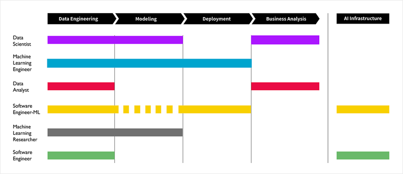

# AIFFEL_38일차 2020.09.15

Tags: AIFFEL_DAILY

### 일정


- [x]  LMS F-35 마무리
- [x]  LMS E-13
- [x]  cs231n lecture 12 Visualizing and Understanding

# [F-35] 파이썬으로 이미지 파일 다루기


어제 내용에 이어서 진행

## OpenCV (1),(2)

---

이미지는 결국 [너비, 높이, 채널] 형태를 가지는 배열이고, 컴퓨터 비전이란 결국 이러한 배열 형태의 데이터를 처리하는 것이 중요한 분야.

[https://docs.opencv.org/4.3.0/d8/dfe/classcv_1_1VideoCapture.html#aabce0d83aa0da9af802455e8cf5fd181](https://docs.opencv.org/4.3.0/d8/dfe/classcv_1_1VideoCapture.html#aabce0d83aa0da9af802455e8cf5fd181)

`cap = cv.VideoCapture(0)`

⇒ Opens a camera for video capturing.

사실 알고 보면 OpenCV는 Python 전용으로 개발된 것이 아니라 C++, Java, Matlab 등에서 함께 사용이 가능하도록 만들어졌는데요. 모든 언어에 대해 문서화를 하나로 통합하여 제공하여 문서화가 복잡...

_의 경우 안 쓰고 버릴 값을 받는 관습(convention) 상의 변수

```python
import cv2 as cv
import numpy as np

cap = cv.VideoCapture(0)

while(1):

    # Take each frame
    _, frame = cap.read()

    # Convert BGR to HSV
    hsv = cv.cvtColor(frame, cv.COLOR_BGR2HSV)

    # define range of blue color in HSV
    lower_blue = np.array([110,50,50])
    upper_blue = np.array([130,255,255])

    # Threshold the HSV image to get only blue colors
    mask = cv.inRange(hsv, lower_blue, upper_blue)

    # Bitwise-AND mask and original image
    res = cv.bitwise_and(frame,frame, mask= mask)
    cv.imshow('frame',frame)
    cv.imshow('mask',mask)
    cv.imshow('res',res)
    k = cv.waitKey(5) & 0xFF
    if k == 27:
        break

cv.destroyAllWindows()
cap.release()
```

`lower_blue, upper_blue`

숫자로 파란색이라는 부분을 정의하고, 이 값들을 기준으로 이미지에서 마스크를 생성하는 과정입니다. 여기서 마스크란 수채화를 그리거나 인테리어 공사 중 실리콘을 바를 때 사용하는 마스킹 테이프의 역할과 동일합니다. 우리가 원하는 부분만을 떼어낼 수 있도록 하는 역할입니다.

Q. `& 0xFF` 는 무슨 역할을 하는 코드일까?

⇒ Numlock을 제거

[https://stackoverflow.com/a/39201163](https://stackoverflow.com/a/39201163)

## 실습: 비슷한 이미지 찾아내기

---

우리가 사용할 OpenCV 자체는 C++로 구현되어있고, 이를 파이썬에서 불러쓸 수 있도록 하는 패키지인 opencv-python를 설치해야 합니다.

```python
# 파일명을 인자로 받아 해당 이미지 파일과 히스토그램을 출력해 주는 함수
def draw_color_histogram_from_image(file_name):
    image_path = os.path.join(images_dir_path, file_name)
    # 이미지 열기
    img = Image.open(image_path)
    cv_image = cv2.imread(image_path)

    # Image와 Histogram 그려보기
    f=plt.figure(figsize=(10,3))
    im1 = f.add_subplot(1,2,1)
    im1.imshow(img)
    im1.set_title("Image")

    im2 = f.add_subplot(1,2,2)
    color = ('b','g','r')
    for i,col in enumerate(color):
        # image에서 i번째 채널의 히스토그램을 뽑아서(0:blue, 1:green, 2:red)
        histr = cv2.calcHist([cv_image],[i],None,[256],[0,256])   
        im2.plot(histr,color = col)   # 그래프를 그릴때 채널 색상과 맞춰서 그립니다.
    im2.set_title("Histogram")
```

1. '비슷한 이미지' 라는 개념을 어떻게 컴퓨터가 이해하도록 표현할 것인가?

⇒ 이번 예제에서는 히스토그램 개념을 통해 해볼거임. 

⇒ 히스토그램을 만들어주는 함수 cv2.calcHist()와 마찬가지로, 히스토그램끼리의 유사성을 계산해주는 기능 역시 OpenCV에서 제공해주는 cv2.compareHist()라는 함수를 사용해서 해결할 겁니다.

- 프로그램이 실행된다.
- **`build_histogram_db()`**
    - CIFAR-100 이미지들을 불러온다.
    - CIFAR-100 이미지들을 하나하나 히스토그램으로 만든다.
    - **이미지 이름을 키로 하고, 히스토그램을 값으로 하는 딕셔너리 `histogram_db`를 반환한다.**
- **CIFAR-100 히스토그램 중 입력된 이미지 이름에 해당하는 히스토그램을 입력 이미지로 선택하여 `target_histogram`이라는 변수명으로 지정한다.**
- **`search()`**
    - **입력 이미지 히스토그램 `target_histogram`와 전체 검색 대상 이미지들의 히스토그램을 가진 딕셔너리 `histogram_db`를 입력으로 받는다.**
    - **OpenCV의 `compareHist()` 함수를 사용하여 입력 이미지와 검색 대상 이미지 하나하나의 히스토그램 간 유사도를 계산한다. 결과는 `result`라는 이름의 딕셔너리로, 키는 이미지 이름, 값은 유사도로 한다.**
    - 계산된 유사도를 기준으로 정렬하여 순서를 매긴다.
    - **유사도 순서 상으로 상위 5개 이미지만 골라서 `result`에 남긴다.**
- 고른 이미지들을 표시한다.
- 프로그램이 종료된다.

```python
def get_histogram(image):
    histogram = []

    # Create histograms per channels, in 4 bins each.
    for i in range(3):
        # [[YOUR CODE]]
        channel_histogram = cv2.calcHist(images=[image],
                                         channels=[i],
                                         mask=None,
                                         # 단순화의 측면에서 4개 구간
                                         histSize=[4],  # 히스토그램 구간을 4개로 한다.
                                         ranges=[0, 256])
        histogram.append(channel_histogram)  

    histogram = np.concatenate(histogram)
    histogram = cv2.normalize(histogram, histogram)

    return histogram
```

```python
import os
import pickle
import cv2
import numpy as np
from matplotlib import pyplot as plt
from tqdm import tqdm

def build_histogram_db():
    histogram_db = {}

    #디렉토리에 모아 둔 이미지 파일들을 전부 리스트업합니다. 
    path = images_dir_path
    file_list = os.listdir(images_dir_path)

    # [[YOUR CODE]]
    for file_name in tqdm(file_list):
      file_path = os.path.join(images_dir_path, file_name)
      image = cv2.imread(file_path)

      histogram = get_histogram(image)

      histogram_db[file_name] = histogram

    return histogram_db
```

```python
def get_target_histogram():
    filename = input("이미지 파일명을 입력하세요: ")
    if filename not in histogram_db:
        print('유효하지 않은 이미지 파일명입니다.')
        return None
    return histogram_db[filename]
```

search 함수

⇒ 입력 이미지 히스토그램 `target_histogram` 와 전체 검색 대상 이미지들의 히스토그램을 가진 딕셔너리 `histogram_db`를 입력으로 받는다. 

```python
def search(histogram_db, target_histogram, top_k=5):
    results = {}

    # Calculate similarity distance by comparing histograms.
    # [[YOUR CODE]]
    for file_name, histogram in tqdm(histogram_db.items()):\
# opencv 기능 사용
        distance = cv2.compareHist(H1=target_histogram,
                                   H2=histogram,
                                   method=cv2.HISTCMP_CHISQR)

        results[file_name] = distance

    results = dict(sorted(results.items(), key=lambda item: item[1])[:top_k])

    return results
```

```python
def show_result(result):
    f=plt.figure(figsize=(10,3))
    for idx, filename in enumerate(result.keys()):    
        # [[YOUR CODE]]
        img_path = os.path.join(images_dir_path, filename)
        im = f.add_subplot(1,len(result),idx+1)
        img = Image.open(img_path)
        im.imshow(img)
```

```python
target_histogram = get_target_histogram()
result = search(histogram_db, target_histogram)
show_result(result)
```

# [E-13] Face2Emoji 모바일 웹앱 만들기





머신러닝 시스템도 결국 소프트웨어. 하나의 추론 모델이 시장에서 가치를 만들어내는 서비스가 되기까지 다양한 사람들의 협업이 필요하며, 실제로 사용되고 있는 머신러닝 시스템의 전체 코드에서 머신러닝이 차지하는 비중은 사실 생각보다 크지 않습니다.

## **실습목표**

---

- 웹과 HTML, 자바스크립트의 기본 개념을 이해하고, 이를 활용하여 노트북 또는 스마트폰의 카메라에서 영상을 가져옵니다.
- TensorFlow.js를 사용해 웹 브라우저에서 MobileNet을 구동합니다.
- 사진에서 표정을 읽어 해당하는 이모티콘을 표시하는 간단한 웹 어플리케이션을 만듭니다.
- 완성된 웹 어플리케이션을 GitHub Pages를 통해 인터넷에 올립니다.

## TensorFlow js 맛보기

---

머신러닝 프레임워크로서 TensorFlow의 장점 중 하나는 **다양한 서비스 플랫폼**을 지원한다는 점입니다. 파이썬 외에도 C++, Java 등 주요 언어별 **TensforFlow API**를 제공함과 더불어, Raspberry Pi 등 임베디드 기기에서 작동하는 TensorFlow Lite, 그리고 웹에서 자바스크립트 기반으로 동작하는 TensorFlow.js 등, 다양한 환경 사이에 강력한 호환성을 제공합니다.

특히 **TensorFlow.js 는** 서버에 별도로 요청을 보낼 필요 없이 웹 브라우저 내에서 **WebGL** 을 통해 가속된 추론을 할 수 있습니다.

웹 브라우저에서 실행하면 별도로 서버에 인풋 파일을 보내고, 서버에서 머신러닝 모델과 서버 로직을 실행한 뒤, 서버에서 출력값을 받는 등 서버와 통신하는 과정을 생략할 수 있기에 낮은 지연성을 가집니다. 또, 데스크탑이나 모바일 기기에 관련 없이 동일한 코드로 통일된 경험을 제공할 수 있다는 장점을 가집니다. 마지막으로 자바스크립트라는 언어의 특성 상 웹 개발에 적합하므로, 빠른 프로토타입 개발에도 용이합니다.

근데, 아무리 그래도 무거운 모델을 웹 브라우저 내에서 돌리기에는 무리임. 그래서 이번 예제에서는 **MobileNet**을 모델로 사용한다.

⇒ 기존 이미지 백본 모델에 여러 가지 기법을 적용해 정확도를 조금 희생하고, 연산량과 연산 시간을 획기적으로 줄인 네트워크입니다.

```html
<head>
    <title>Demo</title>
		<script src="https://cdn.jsdelivr.net/npm/@tensorflow/tfjs@1.0.1"></script>
</head>
```

## 로컬 이미지를 MobileNet으로 추론하기

---

Egyptian cat: 0.5538077354431152

`tf.image.resizeBilinear()` ⇒ 이미지 크기 재조정.

## 실시간 카메라 영상 가져오기

---

### WebRTC

---

카메라 드라이버나 모바일 앱 개발에 대해 하나도 몰라도, 우리는 웹 브라우저의 힘을 빌어 (사용자의 허락 하에) 노트북 또는 스마트폰 카메라의 영상을 실시간으로 가져올 수 있습니다. 바로 웹에서 화상통화 등 실시간 통신을 구현하기 위해 만들어진 **WebRTC**라는 **표준 기술**을 통해서입니다.

- ***`<video>`**: 비디오를 담는 태그로서, 카메라에서 받아오는 실시간 영상을 표시할 공간입니다. 보통 속성과 값을 모두 지정해 주었던 다른 속성들과는 다르게, **`playsinline`** 및 **`autoplay`**는 값이 없는 속성 그 자체로 동작하는데, 모바일 환경에서도 전체 환경으로 재생하지 말 것, 그리고 영상이 주어지면 바로 재생을 실행할 것을 지시합니다.*
- ***`<canvas>`**: 그림을 담는 공간으로서, 이미지 파일을 불러와 표시하는 **``** 태그와는 다르게 웹 브라우저 상에서 직접 그림을 그릴 수 있습니다. "Take snapshot" 버튼을 누르면 카메라의 현재 화면을 표시할 공간입니다.*

- canvas의 `.getContext()` 메서드는 그림을 그릴 수 있는 2차원 또는 3차원 객체를 가져오고, 여기에 `.drawImage()`를 통해 직접 이미지를 그릴 수 있습니다. 모두 w3schools의 설명에 나와있습니다.

⇒ [https://www.w3schools.com/tags/ref_canvas.asp](https://www.w3schools.com/tags/ref_canvas.asp)

- `navigator.mediaDevices.getUserMedia()`가 바로 WebRTC 기술의 일부인, 사용자 기기의 카메라를 가져오는 마법입니다. `constraints`라는 매개변수에는 영상과 음성을 각각 활성화할지에 대한 설정을 넘길 수 있습니다. 비동기 함수이기에, `.then()`으로 콜백 함수를 던져줍니다. `.catch()`는 이 비동기 함수가 실패할 경우 실행될 콜백 함수입니다.
- 콜백 함수인 `handleSuccess()`는 실시간 영상을 입력으로 받아 `stream`이라는 변수로 사용합니다. 이후 편의를 위해 자바스크립트 콘솔에서 접근할 수 있도록 전역 객체인 `window`에 묶어준 뒤, 마지막으로 `<video>`에서 재생되도록 `video.srcObject` 속성에 연결합니다.

그럼 이제 사용자의 화면에서 불러온 영상을 어떻게 MobileNet 모델에 전달할 수 있을까요? 다시 MobileNet의 GitHub 프로젝트를 가서 README.md의 설명을 찾아보면, `HTMLCanvasElement`를 입력으로 받는 것을 알 수 있습니다. 아까 영상에서 사진을 딴 그 <canvas> 태그가 맞습니다.

```html
<html>

  <head>
    <meta charset="utf-8">
    <meta name="viewport" content="width=device-width, user-scalable=yes, initial-scale=1, maximum-scale=1">
    <title>Demo</title>
	
    <script src="https://cdn.jsdelivr.net/npm/@tensorflow/tfjs@1.0.1"></script>
    <script src="https://cdn.jsdelivr.net/npm/@tensorflow-models/mobilenet@1.0.0"></script>
  </head>

  <body>
    <video playsinline autoplay></video>
<button>Take snapshot</button>
<canvas></canvas>
  </body>

	<script>
		
		video = document.querySelector('video');
		canvas = document.querySelector('canvas');
		button = document.querySelector('button');

		button.onclick = function() {
		  canvas.width = video.videoWidth;
		  canvas.height = video.videoHeight;
		  canvas.getContext('2d').drawImage(video, 0, 0, video.videoWidth, video.videoHeight);
		    mobilenet.load().then(model => {
		      model.classify(canvas).then(predictions => {
			alert(predictions[0].className + ': ' + predictions[0].probability);
			console.log(predictions);
		      });
		    });
		};

		constraints = {
		  audio: false,
		  video: true
		};

		function handleSuccess(stream) {
		  video.srcObject = stream;
		}

		function handleError(error) {
		  alert('navigator.MediaDevices.getUserMedia error: ' + error.message + error.name);
		}

		navigator.mediaDevices.getUserMedia(constraints).then(handleSuccess).catch(handleError);

    	</script>

</html>
```

## 프로젝트 : Face2Emoji 모바일 웹앱

---

[https://keras.io/api/applications](https://keras.io/api/applications/#mobilenetv2)/

⇒ keras 에서 제공하는 model api 목록 확인용

해당 프로젝트에서는 mobileNet2 사용

저장한 모델을 TensorFlow.js로 변환하는 작업은 간단합니다. 터미널에서 tensorflowjs_converter 명령어만 실행하면 됩니다. 보다 상세한 내용은 아래 GitHub 프로젝트를 참고합시다.

[https://github.com/tensorflow/tfjs/tree/master/tfjs-converter](https://github.com/tensorflow/tfjs/tree/master/tfjs-converter)

```bash
tensorflowjs_converter --input_format=keras model.h5 model
```

### 중간에 tf 오류남....

---

그래서 2.3 버전으로 강제 업데이트 했음. (그냥 2.2로 재설치나 할걸...)

그리고 그에 맞춰서 tensorflow_estimator, tensorflow_gpu 도 2.3 으로 재설치 (gpu 버전은 이번에 새로 설치했는데, 2.3 업데이트하면서 신규 설치 이후 바로 재설치)

결과물 : [https://github.com/bluecandle/2020_AIFFEL/blob/master/daily_notes/exploration_codes/e13_code/E13.ipynb](https://github.com/bluecandle/2020_AIFFEL/blob/master/daily_notes/exploration_codes/e13_code/E13.ipynb)

# CS231n lecture12


[CS231n 2017 lecture12 _ Visualizing and Understanding](https://www.notion.so/CS231n-2017-lecture12-_-Visualizing-and-Understanding-2dbac4c4a89f404295a8d0259568870a)