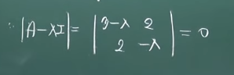

# AIFFEL_39일차 2020.09.16

Tags: AIFFEL_DAILY

### 일정


- [x]  cs231n lecture12 마저듣기
- [x]  LMS F-36
- [x]  LMS F-37

# [F-36] PCA는 내 친구


고유값(Eigenvalue)와 고유벡터(Eigenvector)

그런데 '어떤 값이 고유하다', '어떤 벡터가 고유하다'라는 게 도대체 무슨 뜻일까요?

의미를 파악하면 고유값과 고유벡터를 데이터 분석, 영상처리 또는 데이터 전처리 등에 쓰실 수 있게 되는데, 그 때 사용하는 방법을 **주성분 분석(Principle Component Analysis)**라고 합니다.

## **배울 내용**

---

- 복습 : 고유값 분해
- 왜 고유(Eigen)하다고 하는 걸까요?
- 주성분 분석
- 실습 : 영상 잡음 제거
- 미니 프로젝트 : 영상 압축

## 복습 : 고유값 분해

---

### 고유값, 고유벡터

---

 ${\bf A x}= \lambda \bf x$

이 수식을 만족하는 $\lambda$ 를 고유값(Eigenvalue), x 를 고유벡터(Eigenvector) 라고 부른다.

[https://www.youtube.com/watch?time_continue=1&v=V7a86NUYjhY&feature=emb_logo&ab_channel=장황수학](https://www.youtube.com/watch?time_continue=1&v=V7a86NUYjhY&feature=emb_logo&ab_channel=%EC%9E%A5%ED%99%A9%EC%88%98%ED%95%99)

처음~8:45

$(A-\lambda I)V = 0$ 형태로 변환이 되는데, V 는 0이 아닌 벡터이기 때문에, $A-\lambda I$ 는 역행렬이 존재할 수 없다! 존재하면 $V = (A-\lambda I)^{-1} * 0$ 이 되어서 V가 0 벡터가 되어버리기 때문에.

따라서, $|A-\lambda I | =0$ 이 된다 ⇒ 이게 고유방정식(특성방정식)

(혹은 $|\lambda I - A| =0$ )

$\begin{pmatrix} 3 & 2\\ 2 & 0 \end{pmatrix}$ 의 고유치, 고유벡터를 구해보자.

 $A = \begin{pmatrix} 3 & 2\\ 2 & 0 \end{pmatrix}$



여기서 ad - bc = 0 을 하면,


고유치는 4,-1

1) $\lambda = 4$


$\begin{pmatrix} -1 & 2\\ 2 &4 \end{pmatrix}
\begin{pmatrix} x\\ y \end{pmatrix} = \begin{pmatrix} 0\\ 0\end{pmatrix}$

$-x + 2y = 0 \\2x-4y = 0$

위 식을 만족하는 (0,0) 이 아닌 x,y 의 조합이 고유벡터

$V = \begin{pmatrix} 2\\ 1 \end{pmatrix}$

2) $\lambda = -1$

$4x + 2y = 0 \\2x+y = 0$

  $V = \begin{pmatrix} 1\\ -2 \end{pmatrix}$

### 고유값 분해

---

보통 행렬 A는 여러 개의 고유값($\lambda$ )과 고유벡터(e)를 가집니다. 그래서 각각을 $\lambda_1, \lambda_2, … {\bf e}_1, {\bf e}_2, …$처럼 표현하곤 합니다.

만약 행렬 A의 크기가 $n \times n$이라면, 일반적으로 n개의 고유값과 고유벡터가 나오게 됩니다.

우리는 이렇게 여러개의 고유값과 고유벡터를 보다 간단하게 표현할 수 있는데, 그 방법이 행렬을 이용하는 것입니다. 이걸 **matrix form으로 나타낸다**고 해요.

그리고 matrix form으로 나타내는 것을 **고유값 분해(Eigenvalue Decomposition, EVD)**

[https://www.youtube.com/watch?v=j2Zxmt5SRmo&feature=emb_logo&ab_channel=SeungilKim](https://www.youtube.com/watch?v=j2Zxmt5SRmo&feature=emb_logo&ab_channel=SeungilKim)


A 라는 행렬을 eigen vector 행렬이랑 eigen value 행렬로 decompose 했다

⇒ eigenvalue decomposition

$A = A^T$ 라면, $E^{-1} = E^T$ 이다.

⇒ 그렇다면, 위에서 나온 결론에 의하여  $A = E \lambda E^T$

${\bf A}={\bf E \Lambda E^{-1}}=\begin{bmatrix}1 & 1\\1 & -1\end{bmatrix}\begin{bmatrix}
3 & 0\\
0 & -1
\end{bmatrix}
\begin{bmatrix}
1 & 1\\
1 & -1
\end{bmatrix}^{-1}$

## 왜 고유(Eigen)하다고 하는걸까?

---


어떤 시스템 A가 있다고 가정해보자.

가정한 시스템 A 에서, 어떤 신기한 입력 x를 넣었더니 쌩뚱맞은 값이 출력으로 나오는게 아니라, $\lambda x$처럼 입력이 그대로 나오는데 조금 커지거나 작아져서 나온다?!

⇒ 이런 신기한 입력벡터를 ***고유벡터***라고 한다.

이 예시에서 입력 x는 시스템 A에만 딱 맞는 **고유한** 입력벡터임.

(A로부터 고유벡터 유도했으니 ㅇㅇ)

그리고, 고유한 입력벡터 x가 시스템 A에 의해 얼마나 증폭 또는 감소되어 나오는지를 알려주는 값이 $\lambda$ !

이 $\lambda$ 를 통해 시스템을 분석할 수 있다.

시스템이 입력을 얼마나 증폭시키는지, 감소시키는지, 당연히 $\lambda$ 도 A로부터 유도되었기 때문에 시스템 A의 **고유한** 값이다.


A 로부터 유도된 x, $\lambda$


(1) 입력으로 고유벡터 x를 준비합니다.

(2) 시스템 A로 입력 x가 들어가요.

(3) 출력으로 입력과 똑같은 고유벡터 x가 나오네요?

(4) 그런데 그게 λ만큼 커지거나 작아져서 나와요.

그래서 고유벡터, 고유치는 어떤 시스템 A를 분석하는데 엄청 유용합니다.

y=Ax 에서..


[다른 예시] 마법모자

제가 모자에 오렌지를 1개 넣고 외칩니다. "아브라카다브라!" 그랬더니 바나나 쥬스가 나왔어요.

우와 신기하네요. 이번에는 모자에 아이패드 프로를 넣었어요. "아브라카다브라!" 오마이갓… 이번에는 연필이 나왔어요. 망했네요. 🙄 이 모자를 그래도 좀 분석을 하고 싶은데… 어떻게 방법이 없을까요?

어느날 우연히 모자에 천원권 지폐를 한 장 넣었더니 천원권 지폐가 5장이 나왔어요. 우와!

이번에는 모자에 만원권 지폐를 5장 넣었더니 만원권 지폐가 10장이 나왔어요. 우와!

이번에는 모자에 5만원권 지폐를 2장 넣었더니 5만원권 지폐가 1장이 나왔어요. 헉… 😱

이런 게 고유값과 고유벡터를 가지고 하는 분석이라고 생각할 수 있습니다. 심지어 우리는 우연히 고유벡터를 발견하지 않아도 돼요. Quiz 1에서 풀었던 것처럼 여러분들은 이미 고유벡터를 구하는 법을 알고 있습니다.

***그렇다면, 고유값, 고유벡터를 시스템 분석하는 데 사용하는 게 아니라 데이터를 분석하는 데는 사용할 수는 없을까요?***

## 주성분 분석(PCA)

---

모자가 데이터라는 것은 무슨 의미일까요? 데이터가 입력과 출력이 있나요? 없죠.

탁자에 마법의 모자가 2개 놓여 있어요. 첫 번째 모자는 황금 90%와 동 10%로 만들어진 모자예요. 두 번째 모자는 황금 20%와 동 80%로 만들어진 모자네요.


고유값과 고유벡터는 모자의 고유한 특징을 표현할 수 있어요. 여기서 데이터는 모자의 재료를 의미합니다.

어떤 데이터로 모자를 만들었냐에 따라 모자의 특성이 바뀌고, 고유값과 고유벡터는 데이터가 반영된 모자의 특성을 분석해 낼 수 있어요.


1990년대, 2000년대 아파트 값 데이터 (임의로 만든거임)

그림 (a)는 1990년대 아파트 값 데이터를 찍어 보았습니다. (네, 첫 번째 모자의 재료들이죠!) 20평대 초반 아파트의 가격이 대략 1억 정도, 30평대 후반 아파트 가격이 4.5억 정도 했네요. 소형 평수와 대형 평수 간의 가격 차이가 3.5억 정도로 많이 나네요. 다들 대형 평수를 선호했던 시기인 것 같습니다.

이번에는 그림 (b)를 살펴보죠. 20평대 초반 아파트가 3억 정도로 많이 올랐네요. 반면, 30평대 후반 아파트 가격은 대략 4.5억 정도로 거의 오르지 않았네요. 1인 가족 증가 및 출산율 저하 등으로 인해 가족의 규모가 작아져 대형 평수의 인기가 급락하고 있음을 알 수 있습니다.

이런 데이터들을 손쉽게 볼 수 있는 방법 중 하나는 고유벡터를 활용하는 것인데요. 각 데이터 분포를 가장 잘 표현할 수 있는 장축(빨간색 화살표)을 바로 고유벡터로부터 구할 수 있습니다.

정확하게는 가장 큰 고유값 $\lambda_{max}$ 에 해당하는 고유벡터 $e_{max}$ 이며, 이 때 고유값은 축의 길이에 해당합니다. (두 번째로 큰 고유값에 해당하는 고유벡터가 초록색 화살표입니다.) 그래서 고유벡터의 기울기만 봐도 이 현상을 바로 알아낼 수 있는 것이지요.

## 두 가지 궁금증

---

*(1) 왜 가장 큰 고유값에 해당하는 고유벡터가 빨간색 화살표(데이터를 가장 잘 표현해 낼 수 있는 장축)가 되나요?*

*(2) 모자 A로 부터 고유벡터를 구할 수 있다는 것은 알겠어요. 그런데, 데이터는 모자를 만드는 재료라면서요? 도대체 재료를 가지고 그 모자를 어떻게 만드나요?*

---

[주성분분석(Principal Component Analysis)]([https://ratsgo.github.io/machinelearning/2017/04/24/PCA/](https://ratsgo.github.io/machine%20learning/2017/04/24/PCA/))

PCA는 데이터의 분산(variance)을 최대한 보존하면서 서로 직교하는 새 기저(축)를 찾아, 고차원 공간의 표본들을 선형 연관성이 없는 저차원 공간으로 변환하는 기법입니다. 이를 그림(출처)으로 나타내면 아래와 같습니다.

[http://imgur.com/Uv2dlsH](http://imgur.com/Uv2dlsH)

2차원 공간에 있는 데이터들이 하나의 주성분(PC1)을 새로운 기저로 선형변환된 걸 확인할 수 있습니다. 여기에서 핑크색 표시가 돼 있는 사선축이 원 데이터의 분산을 최대한 보존하는(=데이터가 가장 많이 흩뿌려져 있는) 새 기저입니다. PCA의 목적은 바로 이런 축을 찾는 데 있습니다.

---

원점을 중심으로 빙글빙글 돌고 있는 검은색 축이 하나 있어요. 이 축의 기저 벡터(basis vector)를 라고 표현해 볼게요. 그림에서는 파란색 점으로 표시된 데이터를 검은색 축에 **사영(projection, 빨간색 선)**하고 있는데요.

사영된 후의 데이터는 빨간색 점으로 보여지고 있습니다.

그러면 2차원의 데이터(파란색 점)가 검은색 축위의 1차원의 데이터(빨간색 점)이 되는 것을 알 수 있어요.

검은색 축이 핑크색 선과 만나는 지점 = 1차원 데이터만으로 나타내도 원래의 데이터를 가장 잘 표현하는 지점

⇒ 그리고 그 지점이 빨간색 점이 제일 많이 퍼져있는(분산이 가장 큰) 지점이기도 하죠!

### 주성분분석 유도하기

---

[https://www.youtube.com/watch?v=_5Khg7NH0bs&feature=emb_logo&ab_channel=SeungilKim](https://www.youtube.com/watch?v=_5Khg7NH0bs&feature=emb_logo&ab_channel=SeungilKim)


구하고자 하는 값 $e^{T} \sum e$

$e^{T} \sum e - \lambda(e^{T}e-1)$

⇒ 미분 값이 0 나와야 함.


결국, $\sum e - \lambda e = 0$

$\sum e = \lambda e$ ( $Ax = \lambda x$ 와 유사한 형태 )

즉, e : 고유 vetor, $\lambda$ : 고유 value.

근데, 각각의 최대값은?? 즉, 이제 최대값을 구하는 과정이 필요.


분산을 나타내는게 $\lambda$, 근데 $\lambda_{max} = \lambda_1$ 이고, max일 때 분산이 최대라는 의미.

그리고  $\lambda_{max}$  일 때 고유벡터는 $e_{max}$ !

⇒ "왜 가장 큰 고유값($\lambda_{max}$)에 해당하는 고유벡터가 빨간색 화살표(데이터를 가장 잘 표현해 낼 수 있는 장축)이 되나요?" 에 대한 답이 됩니다.

그럼 두 번째 문제

Q. "모자 𝐀로 부터 고유벡터를 구할 수 있다는 것은 알겠어요. 그런데, 데이터는 모자를 만드는 재료라면서요? 도대체 재료를 가지고 그 모자를 어떻게 만드나요?"

에 대한 답은 뭘까요?

그 답은 "**데이터를 가지고 공분산 행렬 을 만든다.**" 입니다.

결국 우리는 어떤 행렬(시스템, 모자)로 부터 고유벡터를 구하는지만 보면 됩니다. 네! 맞아요! 공분산 행렬 Σ 로 부터 구합니다.

1. 즉, 데이터 x라는 재료를 가지고 공분산 행렬 Σ 라는 모자(공분산 행렬은 정방행렬입니다!)를 만들고
2. 그 모자를 고유값, 고유벡터로 분석해냅니다. 

자 그러면 제가 왜 데이터가 모자를 만드는 재료라고 했는지 이해하시겠죠? :)

***이 과정을 주성분 분석(Principle Component Analysis)이라고 합니다.***

## 실습: 영상 잡음 제거

---

64 pixel의 이미지 데이터셋을 주성분 분석(PCA)하면, 총 64개의 고유값과 고유벡터를 얻게 됩니다.

그 중 비교적 큰 고유값에 해당하는 고유벡터는 주축(principle axis)에 해당하여 주로 원본 손글씨 이미지 데이터를 잘 표현할 수 있는 기저벡터가 됩니다.

반면, 비교적 작은 고유값에 해당하는 고유벡터는 원본 손글씨 이미지에서는 잘 나오지 않는 데이터이거나 잡음이 주로 표시될 수 있는 기저벡터가 됩니다. (잡음의 크기가 원래 이미지보다 작다고 가정합니다.)

따라서 비교적 큰 고유값에 해당하는 기저벡터만으로 데이터를 복원하면 잡음이 제거된 손글씨 이미지를 얻을 수 있습니다.

```python
from sklearn.decomposition import PCA
from sklearn.datasets import load_digits
from matplotlib import pyplot as plt
import numpy as np

digits = load_digits()
print("손글씨 이미지의 크기는",digits.data.shape[1],"픽셀 입니다.")

import matplotlib.pyplot as plt

def plot_digits(data):
    fig, axes = plt.subplots(4, 10, figsize=(10, 4),
                             subplot_kw={'xticks':[], 'yticks':[]},
                             gridspec_kw=dict(hspace=0.1, wspace=0.1))
    for i, ax in enumerate(axes.flat):
        ax.imshow(data[i].reshape(8, 8),
                  cmap='binary', interpolation='nearest',
                  clim=(0, 16))
plot_digits(digits.data) # 원본 손글씨 이미지 출력

np.random.seed(42)
noisy = np.random.normal(digits.data, 4)
plot_digits(noisy) # 잡음이 섞인 손글씨 이미지 출력

pca = PCA(0.50).fit(noisy) #데이터의 50% 수준(분산 기준)를 표현할 수 있는PCA 기저벡터의 수는?
print("데이터의 50% 수준(분산 기준)까지 복원 가능한 PCA 기저벡터의 수는",pca.n_components_,"개 입니다")

components = pca.transform(noisy)
filtered = pca.inverse_transform(components)
plot_digits(filtered) # 복원된 손글씨 이미지
```

## 미니 프로젝트: 영상 압축

---

64 pixel로 구성된 손글씨 이미지를 압축했다 복원하는 알고리즘

```python
from sklearn.decomposition import PCA
from sklearn.datasets import load_digits

digits = load_digits()
print("손글씨 이미지의 크기는",digits.data.shape[1],"픽셀 입니다.")

def plot_digits(data):
    fig, axes = plt.subplots(4, 10, figsize=(10, 4),
                             subplot_kw={'xticks':[], 'yticks':[]},
                             gridspec_kw=dict(hspace=0.1, wspace=0.1))
    for i, ax in enumerate(axes.flat):
        ax.imshow(data[i].reshape(8, 8),
                  cmap='binary', interpolation='nearest',
                  clim=(0, 16))
plot_digits(digits.data) # 원본 이미지 출력

pca = PCA(0.90).fit(digits.data) #데이터의 90% 수준까지 복원 가능한 PCA 기저벡터의 수는?
print("데이터의 90% 수준까지 복원 가능한 PCA 기저벡터의 수는",pca.n_components_,"개 입니다")

# (참고) 압축률 : (64-N)/64 * 100(%) 로 계산
compression_ratio=(digits.data.shape[1]-pca.n_components_)/digits.data.shape[1]*100
print("압축률은",compression_ratio,"% 입니다.")

components = pca.transform(digits.data)
filtered = pca.inverse_transform(components)
plot_digits(filtered) #복원된 이미지
```

# [F-37] 차원축소와 시각화


그동안 우리는 분류, 회귀 등 다양한 머신러닝 모델에 대해 배워 왔습니다. 이 모델들은 어떤 입력 데이터 X와 그것의 라벨 y 사이의 **관계**를 정확하게 모델링하는데 초점이 맞춰져 있습니다.

**차원축소 알고리즘**들은 두 변수 X-y 사이의 관계를 직접 모델링하지는 않으므로 일반적인 머신러닝 모델은 아닙니다

차원축소 모델에 어떤 X를 입력하면 훨씬 적은 차원으로 변환되었지만 그럼에도 불구하고 X의 특성을 유지하고 있는 X'를 출력하게 됩니다.

그러나 이렇게 차원이 축소된 X'가 매우 유용한 역할을 할때가 있습니다 .X의 특성을 잘 보존하고 있다는 전제 하에 그 자체로 X'는 X의 좋은 feature 역할을 하게 됩니다. 뿐만 아니라 시각화 기법으로도 아주 유용합니다.

오늘 우리는 **PCA(Principal Component Analysis)**와 **T-SNE(T-Stochastic Neighbor Embedding)**라는 대표적인 차원축소 알고리즘에 대해 알아보고, 이들이 각각 어떤 상황에서 유용한지를 그 특성에 따라 살펴보고자 합니다.

### **학습목표**

---

1. 차원축소의 의미와 목적을 이해한다.
2. 머신러닝에서 차원축소가 필요한 상황을 학습한다.
3. 상황에 맞는 차원축소 알고리즘을 학습한다.

## 차원축소의 세계

---

'벡터 데이터의 차원을 축소한다' 가 무슨 말인가??

⇒ 예시 : '1600x1600 픽셀' 이미지는 학습에 사용하기에 너무 크기에 '100x100 픽셀' 사이즈로 축소시켰다.

### 차원의 저주 - 차원축소는 왜 필요할까?

---


그림에 있는 점들을 데이터라고 보았을 때, 차원이 늘어날수록 데이터 간 거리가 멀어지게 되어(밀도가 낮아지게 되어), 초록 영역에 해당하는 데이터가 부족해집니다.

⇒ 만약, 머신러닝 모델을 학습하기 위한 데이터로 위와 같은 데이터를 사용한다면 차원에 비해 데이터가 부족하여 학습이 제대로 이루어지지 않을 수 있습니다.

⇒ 이렇게 차원이 하나 늘어날 때마다, 학습에 필요해지는 데이터의 밀도가 기하급수적으로 높아지는 것을 차원의 저주라고 합니다.

### 그렇다면, 애초에 차원이 많아지는 이유가 무엇일까?

---


위 그림은 카카오 서비스에서 사용자가 클릭할 만한 광고를 추천하기 위해 사용하는 Feature라고 합니다. 세로축은 사용자들을 표현하고, 가로축은 이 사용자들을 표현하기 위한 다양한 Feature들에 해당합니다.

- '어느 카카오 서비스를 이용하는지'
- '어떤 카카오 채널을 구독하고 있는지'
- '소비 규모는 어떻게 되는지'

뿐만 아니라 자료에는 생략된 다양한 데이터가 Feature로 사용될 것입니다. 위에 나열한 항목 중 '카카오 채널의 수'만 Feature로 사용하더라도 사용자 하나를 표현하는 Feature 벡터가 10만 차원이 훌쩍 넘어버리니, 차원이 늘어나는 게 얼마나 쉽게 발생할 수 있는 일인지 실감이 되시나요?

차원이 많아지면, 차원의 저주뿐만 아니라 다양한 부작용을 불러 일으킬 수 있습니다. 대표적인 문제점을 정리하면 다음과 같습니다.

1. 차원이 많아질수록 영역 표현에 많은 데이터가 필요함
2. 결과에 크게 영향을 미치지 못하는 불필요한 차원들이 발생할 수 있음
3. 늘어나는 차원만큼 계산량도 늘어나, 실시간 추천 모델 등에서 해당 데이터를 즉시 적용하기 어려운 속도 이슈가 발생

### 여기서 고민할 지점

---

1. 과연 모든 feature를 개별적인 차원으로 사용하는 것이, 머신러닝 모델이 데이터를 이해하는 가장 좋은 방법일까요?
2. 차원의 정보를 최대한 유지한 채, 차원을 축소시키면서 필요한 데이터의 수도 줄일 수 있는 마법같은 방법은 없을까요?

그에 대한 해답을 차원축소 알고리즘에서 찾아보도록 하겠습니다.

## 차원축소 알고리즘 알아보기 (1) PCA

---

차원의 저주를 피하고자 특정 차원 전체를 없애버리면, 해당 차원의 정보가 손실되는 문제가 생깁니다.

그래서 차원축소는 그렇게 단순하게 없애버리는 그런 내용이 아님.

**PCA** 에서는 차원축소에 대한 다음과 같은 이점을 얻을 수 있습니다.

1. 데이터 결핍에 따른 모델 성능 하락을 막으며
2. 모델이 필요로하는 feature의 수는 줄이되, 정보량은 최대한 유지하여 학습속도 및 성능에 도움을 줌

PCA는 모든 차원에 대한 데이터의 분포를 파악하여, 1개의 차원으로 투영(projection) 하였을 때 가장 큰 분산을 가지는 축 순서로 중심축(차원)으로 삼아 차원을 축소하는 방식

다시 말해 **차원을 축소**하지만, **축소된 차원에 정보를 최대한 보존**하여 투영한다고 볼 수 있습니다.

---

[투영과 최소자승법]

([https://bskyvision.com/236](https://bskyvision.com/236))

### 투영이란?


만약 태양의 위치에서 주황색 막대를 본다면 그림자와 같은 길이로 보일 것이다.

이것을 벡터와 관련지어서 생각해보자. 아래와 같은 서로 다른 두 벡터 a, b가 있다(그림2).


벡터b를 벡터a로 투영시키면 투영벡터p가 생긴다.

***벡터p는 벡터b를 벡터a를 이용해서 나타낼 수 있는 최선의 결과라고 볼 수 있다.***

왜냐하면 벡터a 하나만으로는 완벽하게 벡터b를 설명해낼 수 없기 때문이다. 벡터a에 어떠한 수x를 곱하더라도 ax = b 는 불가능하다. 벡터a의 크기만 달라질 뿐 방향이 달라지지는 않기 때문이다.

반면 투영벡터p는 벡터a에 어떤 계수를 곱하는 것으로 표현할 수 있다

$p = \hat x a$

그러면 $\hat x$를 어떻게 계산할 수 있을까?

***에러벡터e와 벡터a가 서로 수직관계에 있다는 것을 이용한다.***

그림 2에서, 에러벡터 e가 $e = b-p = b - \hat x a$ 임을 알 수 있다.

벡터 a와 벡터 e가 수직이므로

$a^Te = a^T(b-\hat xa) = 0$  이 성립해야 한다.

이를 계산하면,

$a^Tb - \hat x a^Ta = 0 \\
\hat x a^Ta = a^Tb \\
\hat x = \frac {a^Tb}{a^Ta}$

즉, 계수 $\hat x$ 는 벡터 a와 벡터 b를 이용해서 나타낼 수 있다!

그렇다면 투영벡터에 관한 공식을 다시 쓰면

$p = \hat x a = \frac {a^Ta}{a^Ta} a$

### 최소자승법이란?

---

$2x =4 \\ 3x = 5 \\ 4x = 9$

첫번째에서 x=2 , 이것을 두번째, 세번째 식들에 대입하면 성립이 안됨.

⇒ 완벽한 답을 구할 수 없어도 최선의 답을 구하기 위해 노력해야 하는 상황.

모든 사람을 만족시킬 수는 없지만 최대한 많은 사람들을 만족시키기 위해서 타협하는 것과 같은 이치다.

그 최선의 해를 $\hat x$라고 표기한다. 그러면 $\hat x$를 어떻게 구할까?

우선 각 방정식에서의 에러의 제곱을 다 더한다: 


그 다음에 이것이 최소가 되게 하는 x값을 구한다. 그것이 바로 최적해 $\hat x$이 되는 것이다.

**그러니까 최소자승법을 통해서 찾아낸 해 $\hat x$는 사실상 투영벡터p를 계산하기 위해 벡터a에 곱해주는 계수를 찾아내는 것과 동일한 것이다.**

---

---

[주성분분석(PCA)의 이해와 활용] ([https://darkpgmr.tistory.com/110](https://darkpgmr.tistory.com/110))

주성분 분석(PCA)은 사실 선형대수학이라기 보다는 선형대수학의 활용적인 측면이 강하며 영상인식, 통계 데이터 분석(주성분 찾기), 데이터 압축(차원감소), 노이즈 제거 등 다양한 활용을 갖는다.


PCA는 데이터 하나 하나에 대한 성분을 분석하는 것이 아니라, 여러 데이터들이 모여 하나의 분포를 이룰 때 이 분포의 주 성분을 분석해 주는 방법이다.

여기서 주성분이라 함은 그 방향으로 데이터들의 분산이 가장 큰 방향벡터를 의미한다. <그림 1>에서 e1 방향을 따라 데이터들의 분산(흩어진 정도)이 가장 크다. 그리고 e1에 수직이면서 그 다음으로 데이터들의 분산이 가장 큰 방향은 e2이다.

PCA는 2차원 데이터 집합에 대해 PCA를 수행하면 2개의 서로 수직인 주성분 벡터를 반환하고, 3차원 점들에 대해 PCA를 수행하면 3개의 서로 수직인 주성분 벡터들을 반환한다. 예를 들어 3차원 데이터의 경우는 아래 그림과 같이 3개의 서로 수직인 주성분 벡터를 찾아준다.

**eigenface와 영상인식 응용**

PCA가 영상인식에 활용되는 대표적인 예는 얼굴인식(face recognition)이다. 그리고 이와 관련된 개념 혹은 용어로서 eigenface(아이겐페이스)라는게 있다.

뒷부분의 주성분 벡터들은 데이터 분포에 포함된 노이즈(noise)성 정보를 나타내기 때문에 뒷부분은 버리고 **전반부 k개의 주성분 벡터**들만을 가지고 원래 데이터를 표현하면 노이즈가 제거된 데이터를 얻을 수 있다. 즉, 원래의 x가 x = c1e1 + c2e2 + ... + cnen일 때 xk = c1e1 + ... +ckek로 x를 근사하는 것이다. 위 얼굴 이미지들에 대해 전반부의 일부(k = 20, 10, 5, 2) eigenface들만을 이용한 근사 이미지들은 아래 그림.


그림에서 볼 수 있듯이 많은 수의 eigenface를 이용하면 원본 얼굴과 거의 유사한 근사(복원) 결과를 볼 수 있지만 k가 작아질수록 개인 고유의 얼굴 특성은 사라지고 공통의 얼굴 특성이 남게 된다 (k=20인 경우 원래 얼굴이 그대로 살아나지만 k=2인 경우 개인간의 구분이 거의 사라짐을 볼 수 있다).

PCA 를 이용한 얼굴 인식, 안경 제거 예시 있음. (읽진않음)

---

Q. PCA 알고리즘에서 정보량을 최대한 보존한 채, 차원을 축소하는 핵심 아이디어는 무엇일까요?

PCA 알고리즘은 차원별로 데이터를 나눠보는 것이 아니라, '**모든 차원**'을 사용해 **전체 데이터가 분포된 상태**에서 **분산이 가장 큰 방향벡터**를 '**주성분**'으로 사용하여 **축을 새로 만드는 아이디어**를 가지고 차원을 축소합니다.

## 차원축소 알고리즘 알아보기 (2) T-SNE

---

T-SNE(T-Stochastic Neighbor Embedding)

⇒ 시각화에 많이 쓰이는 알고리즘!

이 시각화도 PCA로 다 되는거 아니야? 라고 생각하실 수 있지만, 차원축소를 하는 목적에 따라 데이터의 정보를 가장 잘 보존해주는 알고리즘이 따로 있습니다.

예를 들어, **PCA는 주로 선형적인 데이터의 분포(키와 몸무게 등)**를 가지고 있을 때, **정보가 가장 잘 보존**됩니다.


위의 이미지처럼 방사형적, 비선형적 데이터에서는 많은 정보량을 담기 위한 주성분(Principal Component)으로 잡을 선형적인 축을 찾기 어렵습니다.

따라서, 위 데이터를 PCA를 이용해 2차원으로 표현한다면, 멀리 있는 데이터가 가까이 있도록 차원축소가 이루어질 것입니다. 시각화하여 데이터를 이해한다는 목적과는 잘 맞지 않는 것이죠.

T-SNE 는 기존 차원의 공간에서 가까운 점들은, 차원축소된 공간에서도 여전히 가깝게 유지 되는 것을 목표로 하고있습니다.

---

[t-Stochastic Neighbor Embedding (t-SNE) 와 perplexity]

([https://lovit.github.io/nlp/representation/2018/09/28/tsne/](https://lovit.github.io/nlp/representation/2018/09/28/tsne/))

이렇게 다양한 알고리즘들이 제안된 이유는 각 알고리즘마다 보존하려는 정보가 다르기 때문입니다. 한 공간에서 다른 공간으로 변환을 하기 때문에 어떤 정보는 부각되고, 어떤 정보는 줄어듭니다. 특히 시각화를 위하여 차원을 매우 크게 줄인다면 넓은 공간에 존재하였던 정보 중 일부는 손실 될 수 있습니다. 여러 알고리즘들은 각자가 선택적으로 보존하고 싶은 정보가 다릅니다.

고차원의 원 공간에서 저차원의 임베딩 공간으로 데이터의 공간을 변환하기 위해서 t-SNE 는 원 공간에서의 데이터 간 유사도 $p_{ij}$ 와 임베딩 공간에서의 데이터 간 유사도 $q_{ij}$를 정의합니다.

$p_{ij} = \frac{exp(- \vert x_i - x_j \vert^2 / 2 \sigma^2)}{\sum_{k \neq l} exp(- \vert x_k - x_l \vert^2 / 2 \sigma^2)}$

본래 SNE 라는 알고리즘이 있었습니다. 점들 간의 유사도를 stochastic probability 로 정의하는 이 연구에서 임베딩 공간의 점들 간 유사도 분포를 t-distribution 으로 바꿈으로써 더 안정적인 학습 결과를 얻어낸 알고리즘이 t-SNE 입니다.

이번에도 모든 점들 간의 $(1+|y_k−y_l|^2)^{−1}$의 합으로 나눠줌으로써 전체의 합이 1 이 되도록 하였습니다.

$q_{ij} = \frac{ \left( 1 + \vert y_i - y_j \vert^2 \right)^{-1} }{\sum_{k \neq l} \left( 1 + \vert y_k - y_l \vert^2 \right)^{-1} }$

리고 t-SNE 는 $p_{ij}$ 에 가장 가깝도록 $q_{ij}$ 를 학습합니다. 정확히는 $q_{ij}$ 를 정의하는 $y_i,y_j$ 를 학습합니다. 이는 정답지 $p_{ij}$ 를 보면서 $y_i,y_j$ 의 위치를 이동하는 것과 같습니다.

학습에는 gradient descent 를 이용합니다. 현재 공간 y에서의 좌표값으로부터 만든 q가 p 와 다르다면 더 비슷할 수 있는 방향으로 y 의 점들을 이동합니다. 그 이동정도는 아래와 같습니다.

$\frac{\delta C}{\delta y_i} = \sum_j (p_{ij} - q_{ij})(y_i - y_j)\frac{1}{1 + \vert y_i - y_j \vert^2}$

만약 $p_{ij}$ 와 $q_{ij}$ 가 비슷하면 이동하지 않습니다. 그러나 원 공간에서 $x_i$  가 $x_j$ 에 가까웠다면 $y_i$ 를 $y_j$ 방향으로 이동시킵니다. 한 점 $y_i$ 에 대하여 자신이 이동해야 할 공간으로 이동하고, 다음 점도 자신이 있어야할 자리를 찾아 조금씩 이동합니다. **모든 점들이 순차적으로 자신이 가야할 곳으로 이동하는 것을 반복**하면 원 공간에서 가까운 점들이 임베딩 공간에서도 가깝게 됩니다.

---

**Q2. T-SNE는 데이터간 거리를 최대한 보존하기 위해 어떤 아이디어를 사용하는지 이해한 내용을 이야기해봅시다. 또, PCA와는 어떤 관점에서 차원축소 결과가 다르게 나오는지 설명해 봅시다.**

[내 답]임베딩 공간의 점들 간 유사도 분포를 t-distribution 으로 변환하여 더욱 안정적인 결과를 낸다. 즉, standardization 같은 효과인거지. PCA 는 주어진 데이터가 갖는 분포를 그대로 사용하여 펼치는 느낌!

[예시 답] T-SNE는 벡터상 거리가 비슷한 데이터끼리 가깝게, 먼 데이터는 멀게 분포시키며 차원을 축소시키는 아이디어를 사용합니다. PCA의 차원축소와 다른 점은, **데이터의 공분산이 작아 PC축(주성분 방향)에 포함되지 않는 축의 거리도 점간의 거리가 충분히 반영된다는 것**입니다. 하지만 PCA에서는 두 점간의 거리가 PC축 방향이 아닌 다른 방향으로 나 있으면 결과적으로 그 거리를 무시해 버리므로, 시각화 결과가 두 점 사이의 거리를 제대로 반영하지 못하게 됩니다.

## MNIST 데이터 차원축소 실습 (1) 데이터 준비

---

```python
print("실행 중입니다... 시간이 다소 걸릴 수 있어요. :)\n===")

from sklearn.datasets import fetch_openml

# 784 pixel로 이뤄진 mnist 이미지 데이터 호출
mnist = fetch_openml("mnist_784",version=1)

X = mnist.data / 255.0
y = mnist.target
print("X shape: ",X.shape)
print("Y shape: ",y.shape)

n_image = X.shape[0]
n_image_pixel = X.shape[1]

pixel_columns = [ f"pixel{i}" for i in range(n_image_pixel) ] #  픽셀정보가 있는 칼럼의 이름을 담은 목록
len(pixel_columns)

# 사용하기 쉽도록 판다스 데이터프레임으로 변경
import pandas as pd

df = pd.DataFrame(X,columns=pixel_columns)
df['y'] = y
df['label'] = df['y'].apply(lambda i: str(i)) # 숫자 라벨을 스트링으로 만드는 함수를 파이썬 람다 문법으로 전체 데이터에 적용합니다.
X, y = None, None

#7만 개의 이미지 데이터 중 1만 개를 랜덤샘플링

# 결과가 재생산 가능하도록 랜덤 시드를 지정합니다.
np.random.seed(30)

# 이미지 데이터의 순서를 랜덤으로 뒤바꾼(permutation) 배열을 담습니다.
rndperm = np.random.permutation(n_image)

# 랜덤으로 섞은 이미지 중 10,000개를 뽑고, df_subset에 담습니다.
n_image_sample = 10000
random_idx = rndperm[:n_image_sample]
df_subset = df.loc[rndperm[:n_image_sample],:].copy()
df_subset.shape

# 확인

%matplotlib inline
import seaborn as sns
import matplotlib.pyplot as plt

plt.gray()
fig = plt.figure( figsize=(10,6) )
n_img_sample = 15
width,height = 28,28

# 15개 샘플을 시각화해 봅니다. 
for i in range(0,n_img_sample):
    row = df_subset.iloc[i]
    ax = fig.add_subplot(3,5,i+1, title=f"Digit: {row['label']}")
    ax.matshow(row[pixel_columns]
               .values.reshape((width,height))
               .astype(float))

plt.show()
```

## MNIST 데이터 차원축소 실습 (2) PCA로 차원축소

---

```python
from sklearn.decomposition import PCA

print("df_subset의 shape: {}".format(df_subset.shape))

n_dimension = 2 # 축소시킬 목표 차원의 수
pca = PCA(n_components=n_dimension)

pca_result = pca.fit_transform(df_subset[pixel_columns].values) # 차원을 축소한 결과
df_subset['pca-one'] = pca_result[:,0] # 축소한 결과의 첫 번째 차원 값
df_subset['pca-two'] = pca_result[:,1] # 축소한 결과의 두 번째 차원 값

print("pca_result의 shape: {}".format(pca_result.shape))

# 
```

### Principal Component 별로 보존하는 정보량을 확인

---

- 차원을 축소한 댓가로 차원의 정보량 중 일부만 남게 됩니다.
- sklearn의 PCA 모듈은 **`PC 축`** 마다 **보존하는 정보량의 비율을** 제시해 줍니다.

```python
print(f"pca-1: {round(pca.explained_variance_ratio_[0],3)*100}%")
print(f"pca-2: {round(pca.explained_variance_ratio_[1],3)*100}%")

>> pca-1: 9.6%
>> pca-2: 7.3%
```

⇒ 784차원을 2차원으로 차원축소 하였을 때, 정보량이 전체의 16.9%가 남게 됩니다.

```python
plt.figure(figsize=(10,6))
sns.scatterplot(
    x="pca-one", y="pca-two",
    hue="y",
    palette=sns.color_palette("hls", 10),
    data=df_subset,   # 2개의 PC축만 남은 데이터프레임 df_subset 을 시각화해 보자.
    legend="full",
    alpha=0.4
)
```


- PCA로 **`784차원`**을 **`2차원`**으로 줄인 결과 벡터를 **`Scatter 그래프`**로 그려보았습니다
- 같거나 모양이 비슷한 숫자 이미지가 **`유사한 벡터값`**을 갖는것을 **색상**으로 확인할 수 있습니다.

Principal Component를 3개로 늘려보자.

```python
n_dimension = 3 # 축소시킬 목표 차원의 수
pca = PCA(n_components=n_dimension)

# 3차원 축소 후 남은 정보량 계산하기
pca_result = pca.fit_transform(df_subset[pixel_columns].values) # 차원을 축소한 결과
df_subset['pca-one'] = pca_result[:,0] # 축소한 결과의 첫 번째 차원 값
df_subset['pca-two'] = pca_result[:,1] # 축소한 결과의 두 번째 차원 값
df_subset['pca-three'] = pca_result[:,2] # 축소한 결과의 세 번째 차원 값

print("pca_result의 shape: {}".format(pca_result.shape))

print(f"pca-1: {round(pca.explained_variance_ratio_[0],3)*100}%")
print(f"pca-2: {round(pca.explained_variance_ratio_[1],3)*100}%")
print(f"pca-3: {round(pca.explained_variance_ratio_[2],3)*100}%")

# 3차원으로 시각화하기
fig = plt.figure()
ax = plt.figure(figsize=(10,6)).gca(projection='3d')
ax.scatter(
    xs=df_subset["pca-one"], 
    ys=df_subset["pca-two"], 
    zs=df_subset["pca-three"], 
    c=df_subset["label"].map(lambda x : int(x)), 
    cmap=plt.cm.get_cmap('rainbow', 10)
)
plt.show()
```


## MNIST 데이터 차원축소 실습 (3) T-SNE로 차원축소

---

```python
from sklearn.manifold import TSNE

print("df_subset의 shape: {}".format(df_subset.shape))

data_subset = df_subset[pixel_columns].values
n_dimension = 2
tsne = TSNE(n_components=n_dimension)
tsne_results = tsne.fit_transform(data_subset)

print("tsne_results의 shape: {}".format(tsne_results.shape))

>> df_subset의 shape: (10000, 789)
>> tsne_results의 shape: (10000, 2)

# tsne 결과를 차원별로 추가합니다.
df_subset['tsne-2d-one'] = tsne_results[:,0]
df_subset['tsne-2d-two'] = tsne_results[:,1]

# 시각화해 봅니다.
plt.figure(figsize=(16,10))
sns.scatterplot(
    x="tsne-2d-one", y="tsne-2d-two",
    hue="y",
    palette=sns.color_palette("hls", 10),
    data=df_subset,
    legend="full",
    alpha=0.3
)
```


PCA로 축소해 시각화한 결과와 차이가 존재한다.

기존 차원의 공간에서 가까운 점들은, 차원축소된 공간에서도 여전히 가깝게 유지 되는 것을 목표로 하고있습니다. 이 특징 덕분에, 이후 실습에서 MNIST의 784차원의 숫자 이미지를 2차원으로 시각화하여도, 같은 숫자의 이미지끼리 유사한 거리에 놓이는 것을 확인할 수 있을 겁니다.

이것은 PCA와 구분되는 T-SNE의 뚜렷한 특징입니다. **PCA를 통해 차원축소를 하면서 발생하는 정보 손실의 과정 중에는 두 점 사이의 거리라는 중요한 정보가 함께 손실되는 측면이 있습니다.**

만약 두 점의 거리가 PCA의 PC축을 따라 발생한 거리라면 유지가 되겠지만, 그렇지 않다면 PCA 과정을 통해 두 점 사이의 거리가 소거되고, 실제로는 먼 거리의 점들이 아주 가까운 점으로 투영될 가능성 있음.

그 결과로 이전 스텝에서 PCA의 시각화 화면을 보면 다른 숫자들 사이의 경계가 불분명할 정도로 분포가 뒤섞여 있는 것을 확인할 수 있습니다.

반면에, T-SNE에서는 고차원에서 먼 거리의 두 점은 저차원에서도 먼 거리에 있어야 합니다.

그러므로 결과적으로 T-SNE를 시각화하면 **숫자들 사이의 경계가 뚜렷이 나타나는 장점**이 있습니다. 위에서 T-SNE를 훈련시켰을 때 label 정보를 전혀 참조하지 않고 df_subset[pixel_columns] 정보만 참고하여 얻은 결과라는 점에 주목해 주십시오.

***그래서 T-SNE는 분류기의 Feature Extractor 모델이 카테고리간 분류 경계선을 뚜렷하게 유지하고 있는지를 확인하는 용도로 자주 쓰입니다.***

그러면 T-SNE는 PCA보다 우월한 차원축소 기법일까요? 그렇지 않습니다.

T-SNE의 두 차원은 물리적 의미를 가지지 않습니다.

PCA는 정보 손실을 최소화하려는 관점을 가지고 있으므로, 그 결과 추출된 PC축은 주성분이라는 물리적 의미를 유지하고 있으며, 공분산을 통해 원본 데이터를 일정 부분 복원할 수 있는 가능성을 가지고 있습니다. ***그러나 T-SNE는 정보 손실량에 주목하지 않으며, 그 결과 저차원 축이 아무런 물리적 의미를 가지지 못합니다. 오직 시각화에만 유리할 뿐입니다.***

## Word2Vec 데이터 차원축소 실습

---

```python
import os
import pandas as pd
import numpy as np
from gensim.models import Word2Vec

# 다운로드받은 Word2vec 파일을 gensim Word2Vec 모델로 읽어들입니다.
word2vec_path = os.getenv('HOME')+'/aiffel/dimensionality_reduction/ko.bin'
word2vec = Word2Vec.load(word2vec_path)

# word vector 부분을 모아서 Numpy Array로 만들어 줍니다. 
X = np.array([word2vec.wv[word] for word in word2vec.wv.vocab])
print("X shape: ",X.shape)

n_word2vec = X.shape[0]
n_word2vec_dim = X.shape[1]

vector_cols = [ f"wv_{i}" for i in range(n_word2vec_dim) ] #  word vector 각 칼럼의 이름을 담은 목록
print(len(vector_cols))
vector_cols[:5]
```

### matplotlib 한글 annotation 사용 위한 font 구성

---

D2Coding 폰트 설치

```bash
$ mkdir -p ~/.local/share/fonts
$ cd ~/.local/share/fonts
$ wget https://github.com/naver/d2codingfont/releases/download/VER1.3.2/D2Coding-Ver1.3.2-20180524.zip
$ unzip D2Coding-Ver1.3.2-20180524.zip
$ fc-cache -f -v
$ fc-list | grep "D2Coding"    # font 설치 확인
```

Word Embedding의 개념과 T-SNE의 아이디어는 다소 유사한 측면이 있습니다.

무언가를 어떤 벡터 공간에 임베딩한다는 측면에서 같습니다. 이때, 임베딩해야 할 두 원본이 의미적으로 가까우면 임베딩 벡터도 가깝게 만들고, 의미적으로 멀면 임베딩 벡터도 멀게 만든다는 점도 유사합니다.

하지만 뚜렷한 차이도 존재하는데요, T-SNE의 경우 고차원의 원본 임베딩이 존재하지만 Word2Vec의 경우에는 원본 데이터인 단어가 벡터 공간에 있지 않다는 점입니다.

오늘 우리는 학습된 Word Embedding을 고차원 원본 임베딩으로 삼아 다시 2차원의 타겟 임베딩을 뽑아내는 T-SNE 학습을 진행해 볼 예정입니다. 물론 PCA 차원축소도 해볼 것입니다. 이러한 차원축소 기반의 시각화를 통해 원본 워드 임베딩이 얼마나 의미적으로 유사한 단어들이 가까이 배치되고 있는지를 시각적으로 확인해볼 수도 있을 것입니다.

Word Embedding ⇒ 차원 축소 ⇒ 2차원 타겟 임베딩

```python
import pandas as pd

word2vec_df = pd.DataFrame(X,columns=vector_cols)
word2vec_df['word'] = word2vec.wv.vocab
```

```python
# PCA 알고리즘을 사용하여 200차원의 벡터를 2차원으로 축소시켜보기

from sklearn.decomposition import PCA
n_dimension = 2 # 축소시킬 차원의 수
pca = PCA(n_components=n_dimension)
pca_result = pca.fit_transform(word2vec_df[vector_cols].values)
word2vec_df['pca-one'] = pca_result[:,0]
word2vec_df['pca-two'] = pca_result[:,1]
```

```python
# matplot 으로 시각화 하여 결과를 어떤 단어들이 가까이 존재하는지 확인하기

# 여기에 코드를 작성하세요.
import matplotlib.pyplot as plt
import seaborn as sns
import matplotlib.font_manager as fm

plt.rc('font', family='NanumGothic') 
plt.rcParams['axes.unicode_minus'] = False

# 한글폰트 생성
#font_path = os.getenv('HOME')+'/.local/share/fonts/D2Coding-Ver1.3.2-20180524.ttf'
#fontprop = fm.FontProperties(fname=font_path, size=12)

# matplot 으로 시각화 하여 결과를 어떤 단어들이 가까이 존재하는지 확인하기
plt.figure(figsize=(16,10))
for i, label in enumerate(word2vec_df["word"][:1000]): 
    if len(word2vec_df["word"][i])==1:
        continue
    x= word2vec_df["pca-one"][i] 
    y = word2vec_df["pca-two"][i] 
    plt.scatter(x, y) 
    plt.annotate(label, 
                 xy=(x, y), xytext=(5, 2), 
                 textcoords='offset points', 
                 ha='right', va='bottom', 
                 #fontproperties=fontprop   # 한글폰트 적용
                ) 
plt.show()
```


### T-SNE 알고리즘으로 차원축소하기

---

```python
# T-SNE 알고리즘을 사용하여 200차원의 벡터를 2차원으로 축소시켜보기

# 여기에 코드를 작성하세요.
from sklearn.manifold import TSNE
data_subset = word2vec_df[vector_cols].values
n_dimension = 2
tsne = TSNE(n_components=n_dimension)
tsne_results = tsne.fit_transform(data_subset)
word2vec_df['tsne-2d-one'] = tsne_results[:,0]
word2vec_df['tsne-2d-two'] = tsne_results[:,1]
```

```python
# `matplotlib` 로 시각화하여 결과에서 어떤 단어들이 가까이 존재하는지 확인하기

# 여기에 코드를 작성하세요.
plt.figure(figsize=(16,10))
for i, label in enumerate(word2vec_df["word"][:1000]): 
    if len(word2vec_df["word"][i])==1:
        continue
    x= word2vec_df["tsne-2d-one"][i] 
    y = word2vec_df["tsne-2d-two"][i] 
    plt.scatter(x, y) 
    plt.annotate(label, 
                 xy=(x, y), xytext=(5, 2), 
                 textcoords='offset points', 
                 ha='right', va='bottom',
                 # fontproperties=fontprop )   # 한글폰트 적용
                ) 
plt.show()
```


### PCA 와 T-SNE의 결과 비교

---

PCA로 축소한 결과를 보면 유사한 의미 label의 데이터는 선형적으로 분포하여 표현되며,

T-SNE로 축소한 결과를 보면 유사한 데이터는 원형적 데이터(군집을 이루는 형태)로 분포하여 표현됩니다.