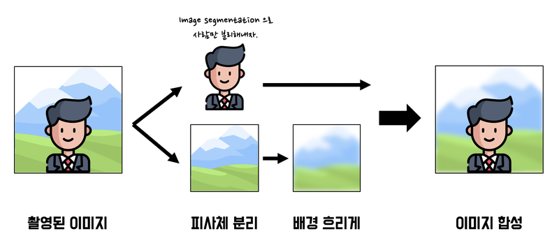

# AIFFEL_40일차 2020.09.17

Tags: AIFFEL_DAILY

### 일정


- [x]  LMS E-14
- [x]  코딩마스터 Session8 문제풀이 (DFS,BFS)

# [E-14]인물사진을 만들어보자


### **인물사진 모드에서 사용되는 용어**

한국에서는 배경을 흐리게 하는 기술을 주로 '아웃포커싱'이라고 표현합니다. 하지만 아웃포커싱은 한국에서만 사용하는 용어이고 정확한 영어 표현은 **얕은 피사계 심도(shallow depth of field)** 또는 **셸로우 포커스(shallow focus)** 라고 합니다.

## 셸로우 포커스 만들기

---



두 개의 렌즈가 맡은 역할을 하나의 렌즈에서 구현해야 합니다. 이미지 세그멘테이션(image segmentation) 기술을 이용하면 하나의 이미지에서 배경과 사람을 분리할 수 있습니다.

분리된 배경을 블러(blur) 처리 후 사람 이미지와 다시 합하면 아웃포커싱 효과를 적용한 인물 사진을 얻을 수 있습니다.

1. 배경이 있는 셀카를 촬영합니다. (배경과 사람의 거리가 약간 멀리 있으면 좋습니다.)
2. 시멘틱 세그멘테이션(Semantic segmentation)으로 피사체(사람)와 배경을 분리합니다.
3. 블러링(blurring) 기술로 배경을 흐리게 합니다.
4. 피사체를 배경의 원래 위치에 합성 합니다.

### 세그멘테이션

---

이미지에서 픽셀 단위로 관심 객체를 추출하는 방법을 **이미지 세그멘테이션(image segmentation)**

이미지 세그멘테이션은 모든 픽셀에 라벨(label)을 할당하고 같은 라벨은 "공통적인 특징"을 가진다고 가정합니다.

### 시멘틱 세그멘테이션

---

세그멘테이션 중에서도 특히 우리가 인식하는 세계처럼 물리적 의미 단위로 인식하는 세그멘테이션을 시맨틱 세그멘테이션 이라고 합니다. 쉽게 설명하면 이미지에서 픽셀을 사람, 자동차, 비행기 등의 물리적 단위로 분류(classification)하는 방법이라고 이해하시면 됩니다.

### 인스턴스 세그멘테이션

---

시맨틱 세그멘테이션은 '사람'이라는 추상적인 정보를 이미지에서 추출해내는 방법입니다. 그래서 사람이 누구인지 관계없이 같은 라벨로 표현이 됩니다.

더 나아가서 인스턴스 세그멘테이션은 사람 개개인 별로 다른 라벨을 가지게 합니다. 여러 사람이 한 이미지에 등장할 때 각 객체를 분할해서 인식하자는 것이 목표입니다.

Q2. 인스턴스 세그멘테이션 데이터셋과 라벨이 존재하면 시맨틱 세그멘테이션을 학습시킬 수 있을까요?

⇒ 인스턴스의 id 뿐만이 아닌 클래스 라벨이 존재해야 시맨틱 세그멘테이션으로 학습이 가능합니다. 근본적으로는 다른 개념이지만 대부분의 데이터셋은 인스턴스 라벨이 있는 경우 클래스 라벨도 함께 존재합니다.

⇒ 그치? 'Richard' 라는 라벨이 있다면, 그게 사람인지 뭐 강아지인지 클래스 라벨도 있는게 자연스럽...?

### 간단한 이미지 세그멘테이션 알고리즘 : 워터쉐드 세그멘테이션

(watershed segmentation)

---

이미지에서 영역을 분할하는 가장 간단한 방법은 물체의 '경계'를 나누는 것입니다.

그럼 경계는 어떻게 나눌 수 있을까요? 이미지는 그레이스케일(grayscale)로 변환하면 0~255의 값을 가집니다. 픽셀 값을 이용해서 각 위치의 높고 낮음을 구분할 수 있는데요.

낮은 부분부터 서서히 '물'을 채워 나간다고 생각할 때 각 영역에서 점점 물이 차오르다가 넘치는 시점이 생기게 됩니다. 그 부분을 경계선으로 만들면 물체를 서로 구분할 수 있게 됩니다.

### 시맨틱 세그멘테이션 다뤄보기

---

세그멘테이션 문제에는 FCN, SegNet, U-Net 등 많은 모델이 사용됩니다.

DeepLab이라는 세그멘테이션 모델을 만들고 모델에 이미지를 입력하겠습니다.

DeepLab 알고리즘(DeepLab v3+)은 세그멘테이션 모델 중에서도 성능이 매우 좋아 최근까지도 많이 사용되고 있습니다.

---

자세한 설명 : [https://blog.lunit.io/2018/07/02/deeplab-v3-encoder-decoder-with-atrous-separable-convolution-for-semantic-image-segmentation/](https://blog.lunit.io/2018/07/02/deeplab-v3-encoder-decoder-with-atrous-separable-convolution-for-semantic-image-segmentation/)

전체적으로 DeepLab은 semantic segmentaion을 잘 해결하기 위한 방법으로 atrous convolution을 적극적으로 활용할 것을 제안하고 있습니다.

### Atrous Convolution


Atrous convolution은 기존 convolution과 다르게, 필터 내부에 빈 공간을 둔 채로 작동하게 됩니다. 위 예시에서, 얼마나 빈 공간을 둘 지 결정하는 파라미터인 rate r=1일 경우, 기존 convolution과 동일하고, r이 커질 수록, 빈 공간이 넓어지게 됩니다.

Atrous convolution을 활용함으로써 얻을 수 있는 이점은, 기존 convolution과 동일한 양의 파라미터와 계산량을 유지하면서도, field of view (한 픽셀이 볼 수 있는 영역) 를 크게 가져갈 수 있게 됩니다.

보통 semantic segmentation에서 높은 성능을 내기 위해서는 convolutional neural network의 마지막에 존재하는 한 픽셀이 입력값에서 어느 크기의 영역을 커버할 수 있는지를 결정하는 receptive field 크기가 중요하게 작용합니다.

Atrous convolution을 활용하면 파라미터 수를 늘리지 않으면서도 receptive field를 크게 키울 수 있기 때문에 DeepLab series에서는 이를 적극적으로 활용하려 노력합니다.

### Spatial Pyramid Pooling

---


Semantic segmentaion의 성능을 높이기 위한 방법 중 하나로, spatial pyramid pooling 기법이 자주 활용되고 있는 추세입니다.

### Encoder-Decoder

---


Encoder-decoder 구조 또한 semantic segmentation을 위한 CNN 구조로 자주 활용되고 있습니다.

특히, U-Net이라 불리는 encoder-decoder 구조는 정교한 픽셀 단위의 segmentation이 요구되는 biomedical image segmentation task의 핵심 요소로 자리잡고 있습니다.

왼쪽의 encoder 부분에서는 점진적으로 spatial dimension을 줄여가면서 고차원의 semantic 정보를 convolution filter가 추출해낼 수 있게 됩니다.

이후 오른쪽의 decoder 부분에서는 encoder에서 spatial dimension 축소로 인해 손실된 spatial 정보를 점진적으로 복원하여 보다 정교한 boundary segmentation을 완성하게 됩니다.

(max pool 전에 있는 형태로 계산한 내용들을 다 저장!)

U-Net이 여타 encoder-decoder 구조와 다른 점은, 위 그림에서 가운데 놓인 회색 선입니다. Spatial 정보를 복원하는 과정에서 이전 encoder feature map 중 동일한 크기를 지닌 feature map을 가져 와 prior로 활용함으로써 더 정확한 boundary segmentation이 가능하게 만듭니다.

### Depthwise Separable Convolution

---


(1) depthwise convolution


(2)depthwise separable convolution

(1) Convolution 연산에서 channel 축을 filter가 한 번에 연산하는 대신에, 위 그림과 같이 입력 영상의 channel 축을 모두 분리시킨 뒤, channel 축 길이를 항상 1로 가지는 여러 개의 convolution 필터로 대체시킨 연산을 depthwise convolution이라고 합니다.

(2) 이제, 위의 depthwise convolution으로 나온 결과에 대해, 1×1×C 크기의 convolution filter를 적용한 것을 depthwise separable convolution 이라 합니다. 이처럼 복잡한 연산을 수행하는 이유는 기존 convolution과 유사한 성능을 보이면서도 사용되는 파라미터 수와 연산량을 획기적으로 줄일 수 있기 때문입니다.

픽셀 각각에 대해서 label을 예측해야 하는 semantic segmentation은 난이도가 높은 편에 속하기 때문에 CNN 구조가 깊어지고 receptive field를 넓히기 위해 더 **많은 파라미터**들을 사용하게 되는 상황에서, separable convolution을 잘 활용할 경우 **모델에 필요한 parameter 수를 대폭 줄일 수 있게 되므로** 보다 **깊은 구조로 확장하여 성능 향상**을 꾀하거나, **기존 대비 메모리 사용량 감소와 속도 향상**을 기대할 수 있습니다.

Depthwise Separable Convolution 이 처음 제안된 논문 : [https://arxiv.org/abs/1610.02357](https://arxiv.org/abs/1610.02357)

### 그래서... DeepLab V3+ 의 모양

---


설명은 읽어보진 않음.

---

deeplab demo : [https://github.com/tensorflow/models/blob/master/research/deeplab/deeplab_demo.ipynb](https://github.com/tensorflow/models/blob/master/research/deeplab/deeplab_demo.ipynb)

```python
class DeepLabModel(object):
    INPUT_TENSOR_NAME = 'ImageTensor:0'
    OUTPUT_TENSOR_NAME = 'SemanticPredictions:0'
    INPUT_SIZE = 513
    FROZEN_GRAPH_NAME = 'frozen_inference_graph'

    # __init__()에서 모델 구조를 직접 구현하는 대신, tar file에서 읽어들인 그래프구조 graph_def를 
    # tf.compat.v1.import_graph_def를 통해 불러들여 활용하게 됩니다. 
    def __init__(self, tarball_path):
        self.graph = tf.Graph()
        graph_def = None
        tar_file = tarfile.open(tarball_path)
        for tar_info in tar_file.getmembers():
            if self.FROZEN_GRAPH_NAME in os.path.basename(tar_info.name):
                file_handle = tar_file.extractfile(tar_info)
                graph_def = tf.compat.v1.GraphDef.FromString(file_handle.read())
                break
        tar_file.close()

        with self.graph.as_default():
    	    tf.compat.v1.import_graph_def(graph_def, name='')

        self.sess = tf.compat.v1.Session(graph=self.graph)

    # 이미지를 전처리하여 Tensorflow 입력으로 사용 가능한 shape의 Numpy Array로 변환합니다.
    def preprocess(self, img_orig):
        height, width = img_orig.shape[:2]
        resize_ratio = 1.0 * self.INPUT_SIZE / max(width, height)
        target_size = (int(resize_ratio * width), int(resize_ratio * height))
        resized_image = cv2.resize(img_orig, target_size)
        resized_rgb = cv2.cvtColor(resized_image, cv2.COLOR_BGR2RGB)
        img_input = resized_rgb
        return img_input
        
    def run(self, image):
        img_input = self.preprocess(image)

        # Tensorflow V1에서는 model(input) 방식이 아니라 sess.run(feed_dict={input...}) 방식을 활용합니다.
        batch_seg_map = self.sess.run(
            self.OUTPUT_TENSOR_NAME,
            feed_dict={self.INPUT_TENSOR_NAME: [img_input]})

        seg_map = batch_seg_map[0]
        return cv2.cvtColor(img_input, cv2.COLOR_RGB2BGR), seg_map
```

(tensorflow V1 이 사용된 코드)

(Tensorflow V1에서 작성된 수많은 레거시 코드들을 활용하려면 어떻게 해야 하는지를 학습하는 의미에서 Tensorflow V2 코드와 비교해 가면서 보기를 바랍니다.)

preprocess()는 전처리, run()은 실제로 세그멘테이션을 하는 함수입니다.

먼저 input tensor를 만들기 위해 preprocess() 함수에서 이미지를 전처리 합니다.

모델이 받는 입력 크기가 정해져 있으므로 이에 따라 적절한 크기로 resize 하고, OpenCV의 디폴트 BGR 채널 순서를 텐서플로우에 맞는 RGB로 수정합니다.

전처리된 이미지는 run() 함수에서 입력값으로 사용되는 것을 볼 수 있습니다.

사전 학습된 가중치 다운로드

```python
# define model and download & load pretrained weight
_DOWNLOAD_URL_PREFIX = 'http://download.tensorflow.org/models/'

model_dir = '~/aiffel/human_segmentation/models'
tf.io.gfile.makedirs(model_dir)

print ('temp directory:', model_dir)

download_path = os.path.join(model_dir, 'deeplab_model.tar.gz')
if not os.path.exists(download_path):
    urllib.request.urlretrieve(_DOWNLOAD_URL_PREFIX + 'deeplabv3_mnv2_pascal_train_aug_2018_01_29.tar.gz',
                   download_path)

MODEL = DeepLabModel(download_path)
print('model loaded successfully!')
```

```python
img_show = img_resized.copy()
seg_map = np.where(seg_map == 15, 15, 0) # 예측 중 사람만 추출
img_mask = seg_map * (255/seg_map.max()) # 255 normalization
img_mask = img_mask.astype(np.uint8)
color_mask = cv2.applyColorMap(img_mask, cv2.COLORMAP_JET)
img_show = cv2.addWeighted(img_show, 0.6, color_mask, 0.35, 0.0)

plt.imshow(cv2.cvtColor(img_show, cv2.COLOR_BGR2RGB))
plt.show()
```

사람을 뜻하는 15 외 예측은 0으로 만들었습니다.

그럼 예측된 세그멘테이션 이미지(map)는 최대값이 15가 됩니다.

일반 이미지는 0부터 255 까지의 값을 사용해 픽셀을 표현하므로, 세그멘테이션 맵에 표현된 값을 원본 이미지에 그림 형태로 출력하기 위해 255로 정규화 합니다. applyColorMap() 함수로 색을 적용하고 이미지를 화면에 출력합니다.

### 세그멘테이션 결과를 원래 크기로 복원하기

---

```python
img_mask_up = cv2.resize(img_mask, img_orig.shape[:2][::-1], interpolation=cv2.INTER_LINEAR)
_, img_mask_up = cv2.threshold(img_mask_up, 128, 255, cv2.THRESH_BINARY)

ax = plt.subplot(1,2,1)
plt.imshow(img_mask_up, cmap=plt.cm.binary_r)
ax.set_title('Original Size Mask')

ax = plt.subplot(1,2,2)
plt.imshow(img_mask, cmap=plt.cm.binary_r)
ax.set_title('DeepLab Model Mask')

plt.show()
```

cv2.resize() 함수를 이용합니다. 크기를 키울 때 **보간(interpolation)** 을 고려해야 하는데요, cv2.INTER_NEAREST를 이용해서 깔끔하게 처리할 수 있지만 더 정확히 확대하기 위해 cv2.INTER_LINEAR 를 사용합니다.

여기서 **보간법(interpolation**)은 **이미지의 크기를 변경(scaling)하는 과정에서 컴퓨터가 사이사이 픽셀값을 채우는 방법**입니다.


두 이미지의 좌표축을 살펴보면, 차이가 있는걸 알 수 있다!

결과적으로 img_mask_up 은 경계가 블러된 픽셀값 0~255의 이미지를 얻습니다. 확실한 경계를 다시 정하기 위해 중간값인 128을 기준으로 임계값(threshold)을 설정합니다. 128 이하의 값은 0으로 128 이상의 값은 255로 만드는 방법입니다.

### 배경 흐리게 하기

---

세그멘테이셔 마스크를 이용하여 배경만 추출!

```python
img_mask_color = cv2.cvtColor(img_mask_up, cv2.COLOR_GRAY2BGR)
img_bg_mask = cv2.bitwise_not(img_mask_color)
img_bg = cv2.bitwise_and(img_orig, img_bg_mask)
plt.imshow(img_bg)
plt.show()
```

`bitwise_not` 함수를 이용하면 이미지가 반전됩니다. 배경은 255 사람은 0이 되겠죠? 반전된 세그멘테이션 결과를 이용해서 이미지와 `bitwise_and` 연산을 수행하면 배경만 있는 영상을 얻을 수 있습니다.

⇒ 참고 : [https://stackoverflow.com/questions/32774956/explain-arguments-meaning-in-res-cv2-bitwise-andimg-img-mask-mask](https://stackoverflow.com/questions/32774956/explain-arguments-meaning-in-res-cv2-bitwise-andimg-img-mask-mask)

이 이미지를 블러(blur)하면 배경이 흐리게 처리된 영상을 얻을 수 있습니다.

```python
img_bg_blur = cv2.blur(img_bg, (13,13))
plt.imshow(cv2.cvtColor(img_bg_blur, cv2.COLOR_BGR2RGB))
plt.show()
```


### 흐린 배경과 원본 영상 합성

---

```python
img_concat = np.where(img_mask_color==255, img_orig, img_bg_blur)
plt.imshow(cv2.cvtColor(img_concat, cv2.COLOR_BGR2RGB))
plt.show()
```

세그멘테이션 마스크가 255인 부분만 원본 영상을 가지고 오고 반대인 영역은 블러된 미지 값을 사용합니다. ( numpy.where 사용 )


## 프로젝트: 인물 모드 문제점 찾기

---

결과물 : [https://github.com/bluecandle/2020_AIFFEL/blob/master/daily_notes/exploration_codes/e14_code/E14.ipynb](https://github.com/bluecandle/2020_AIFFEL/blob/master/daily_notes/exploration_codes/e14_code/E14.ipynb)

# [코딩마스터]Session8 문제풀이


[BFS(Breadth-First Search)](https://www.notion.so/BFS-Breadth-First-Search-0ee42b081d85410286c458afa355939d)

[DFS(Depth First Search)](https://www.notion.so/DFS-Depth-First-Search-880f37d582904d828f2222488ce19c9d)

[https://github.com/bluecandle/2020_AIFFEL/tree/master/coding_master/Session8_BFS_DFS](https://github.com/bluecandle/2020_AIFFEL/tree/master/coding_master/Session8_BFS_DFS)