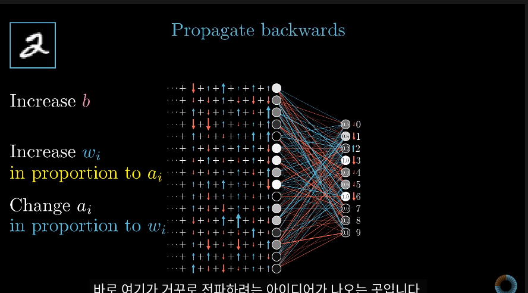
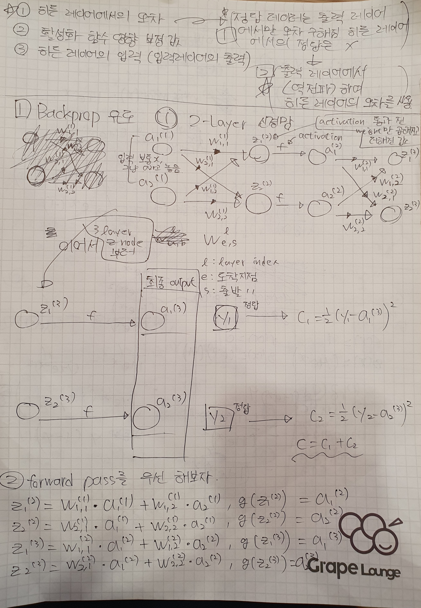
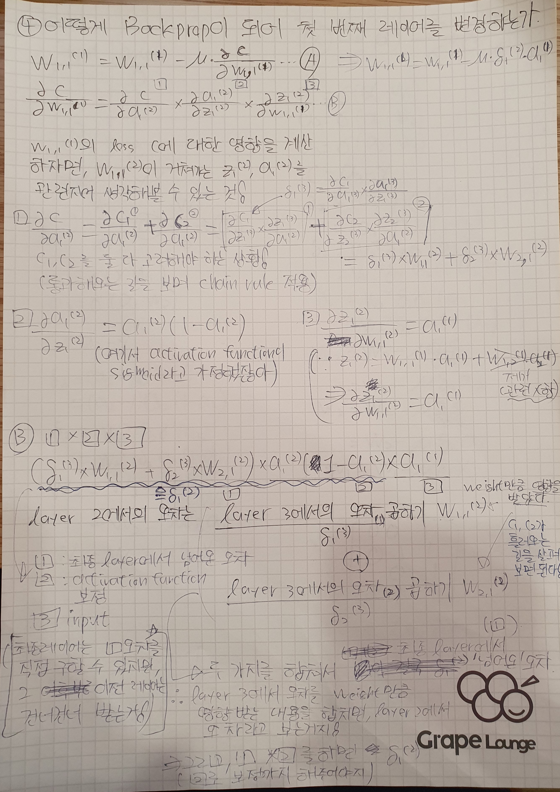

# AIFFEL_41일차 2020.09.18

Tags: AIFFEL_DAILY

### 일정


- [x]  LMS F-38
- [x]  자소서 작성
- [x]  코딩마스터 문제풀이 session8

# [F-38]흐르는 tensor를 거꾸로 거슬러 오르는 w처럼

(backprop 원리 이해하기)


[3Blue1Brown Intro]

[https://www.youtube.com/watch?v=Ilg3gGewQ5U&feature=youtu.be](https://www.youtube.com/watch?v=Ilg3gGewQ5U&feature=youtu.be)

각각의 출력 뉴런이 이전 레이어에서 발생하기를 원하는 desire 를 다 합치면!

backward 로 propagate 한다는 idea가 나오게 된다.



즉, 마지막 층에 영향을 주는 마지막 층 이전 층에서 일어나길 원하는 변화(뉘앙스) 가 얻어지고,

그 뉘앙스가 동일하게 재귀적으로 이전 층들에 전달되는것.


Backprop은 하나의 훈련 예가 가중치와 편향을 조금씩 어떻게 움직이기를 원하는지를 결정하기 위함 ( rapid decrease to the cost 의 방향으로 )

추가 자료 (수학적 설명)

[https://www.youtube.com/watch?v=tIeHLnjs5U8&ab_channel=3Blue1Brown](https://www.youtube.com/watch?v=tIeHLnjs5U8&ab_channel=3Blue1Brown)

---

### **학습 목표**

---

1. 합성함수 미분법(chain rule)을 이용해 역전파의 수학적 원리를 이해한다.
2. 간단한 뉴럴넷(neural network)에서의 역전파를 구현할 수 있다.

## 역전파 개념의 이해

---

[ex] 2 layer neural network 예시


출력값을 $f(a, w, g())$ 이렇게 표현할 수 있다.

w : 출력 레이어의 가중치

g() : 활성화 함수


$\hat y$ 는 추정치(prediction)를 나타내는데 쓰이고 그냥 $y$ 는 true value 를 나타내는데 쓰이는거구나!
일반적으로 hat 기호가 어느 상황에서 쓰이는지에 대해 고민 안해도 될듯.

원래 정답은 (1,0)이어야 하는데, 첫 번째 출력값($\hat y_1$)은 0.8만큼 틀렸고, 두 번째 출력값($\hat y_2$)은 -0.1만큼 틀렸네요. ( 각각의 Loss 값 : 0.8,0.1)

### 가중치 업데이트

---

어머낫! 첫 번째 출력값은 $\hat y_1$은 너무 많이 틀렸군요. **첫 번째 출력값을 이렇게 잘못 추정하게 만든 가중치, w1와 w2는 혼나야겠네요! 따라서 가중치 w1와 w2를 원래 값에서 많이 바꿔 업데이트해 줍니다. (잘했다면, 값을 거의 변화시키지 않았겠죠.)**

⇒ 이런 방식을 어디서 본 거 같죠? 네, 맞습니다. 경사하강법(gradient descent)이 이런 방식이었지요.

***역전파(backpropagation) 기법도 기본적으로 경사하강법을 기반으로 합니다.***

근데, 그렇다면, 여기서 드는 질문은... 얼마나 패널티를 줘야하냐는거지!

업데이트 되는 양(패널티를 주는 정도)를 그냥 출력 오차( 위의 예에서는 0.8 ) 만으로 결정하는 것은 ㄴㄴ.

⇒ why? ***출력값을 내는데 가중치만 사용한 것이 아니라, 히든 레이어의 입력과 활성화 함수도 관여함.***

즉, 가중치 w를 업데이트 할 때는

- 오차
- 활성화 함수 영향을 보정한 값(=활성화 함수를 미분한 값)
- 출력 레이어의 입력(히든 레이어의 출력)

이 세 가지를 모두 고려해서 업데이트를 해야한다.

⇒ how? 이 세 가지 값을 모두 곱해주면 된다!

가중치 업데이트 했으니...

### 그러면 이제 히든레이어 업데이트 해야지

---


기본적으로 위의 예시인 출력 레이어에서 경사하강법을 했던 것과 똑같다.

- (히든 레이어에서의)오차
- 활성화 함수 영향을 보정한 값
- 히든 레이어의 입력(=입력 레이어의 출력=입력 데이터 x)

이 세 가지를 모두 고려해서 업데이트를 해주면 된다! 

근데, 여기서! 오차는 오차인데 ***히든 레이어의 오차*** 라는 부분을 살펴보자.

우리가 가진 정답 데이터(labeled data)는 출력 레이어에서만 오차를 구할 수 있게 되어 있어요. 히든 레이어에서의 정답을 알고 있지 않죠. 그래서 이 히든 레이어에서의 오차를 출력 레이어에서 **역.전.파** 하여 사용하게 됩니다.

위 그림에서 보면, 히든 레이어의 첫 번째 노드 $a_1$ 은 $\hat y_1  와 \hat y_2$  오차에 모두 영향을 주었다.

그래서, 반대로 히든 레이어의 첫 번째 노드 $a_1$ 에서의 오차 역시 **출력 레이어의 오차 두 개를 조합**해서 가져온다. 어떻게 조합을 하는가? ***바로 $w_1, w_3$ 만큼!***

그리고 여기서 오차는 출력 레이어 오차(0.8, -0.1)만 고려하는 것이 아닌, (출력 레이어 오차 x 활성화 함수 영향을 보정한 값) = $\delta$ 을 모두 고려합니다.

히든 레이어의 첫 번째 노드 $a_1$  에서의 오차는 대충... $w_1*\delta_1 + w\_3*\delta_2$ 이런 수식으로 표현된다.

(엄격한 의미는 빼고! 그냥 개념적으로 접근하자면)

즉, (히든 레이어에서의) 오차에

- 활성화 함수 영향을 보정한 값
- 입력 레이어의 입력

을 곱한 값만큼 페널티를 주면(바꾸어 주면) $w_a, w_b$ 를 업데이트 할 수 있다!

## 역전파의 수학적 원리(1) 2-Layer 신경망

---

우리는 2개의 레이어, 각 레이어별 2개의 노드, 그리고 최소 자승 오차(Mean Squared Error)를 손실 함수(Loss Function)으로 가지는 신경망에 대해 역전파 학습방법을 유도해 나갈 것입니다. 또한 이 네트워크의 활성화 함수(Activation Function)는 시그모이드(Sigmoid) 함수를 사용합니다.



## 역전파의 수학적 원리(2) 출력 레이어 학습

---

우리는 경사 하강법(Gradient Descent Method)를 이용하여, 네트워크를 학습 시킬 것입니다. 그러기 위해서는 손실 함수(Loss Function)를 미분한 값이 학습에 사용됩니다.


## 역전파의 수학적 원리(3) 은닉 레이어 학습

---

왜 역(back)으로 전파(propagate) 된다고 말하는지 그 이유가 여기에 설명됩니다



이걸 보다 많은 가중치(weight), 보다 많은 레이어(layer)로 확장하려면 이제 벡터의 개념을 사용해야 합니다. 벡터로 유도하는 것은 한단계 더 어렵습니다만, 여기까지 이해하는데 무리가 없었다고 생각하시는 분은 한번 도전해 보셔도 좋을 것 같네요.

⇒ [https://sudeepraja.github.io/Neural/](https://sudeepraja.github.io/Neural/)

⇒ [https://medium.com/@hindsellouk13/matrix-based-back-propagation-fe143ce2b2df](https://medium.com/@hindsellouk13/matrix-based-back-propagation-fe143ce2b2df)

## 실습: 11줄로 역전파 알고리즘 구현하기

---

[http://iamtrask.github.io/2015/07/12/basic-python-network/?fbclid=IwAR1YY4-2okQ8a2d4NsYGWy3t4ggnwa58Xm5HfzHuKxUQ7rCVuZ_vjo1HeIQ](http://iamtrask.github.io/2015/07/12/basic-python-network/?fbclid=IwAR1YY4-2okQ8a2d4NsYGWy3t4ggnwa58Xm5HfzHuKxUQ7rCVuZ_vjo1HeIQ)

위 링크의 저자는 딱 11줄의 코드로 깔끔하게 2 layer 신경망에서의 역전파를 구현하였습니다. 입력 레이어 노드는 3개, 히든 레이어 노드는 4개, 출력 레이어 노드는 1개, 그리고 데이터의 개수는 4개입니다.


```python
import numpy as np

X = np.array([ [0,0,1],[0,1,1],[1,0,1],[1,1,1] ])
y = np.array([[0,1,1,0]]).T
W1 = 2*np.random.random((3,4)) - 1
W2 = 2*np.random.random((4,1)) - 1
for j in range(60000):
    a1 = 1/(1+np.exp(-(np.dot(X,W1))))         # (1)
    a2 = 1/(1+np.exp(-(np.dot(a1,W2))))       # (2)
    a2_delta = (a2-y)*(a2*(1-a2))                  # (3)
    a1_delta = a2_delta.dot(W2.T) * (a1 * (1-a1))       # (4)
    W2 -= a1.T.dot(a2_delta)       # (5)
    W1 -= X.T.dot(a1_delta)         # (6)

print(a2)
```

## 미니 프로젝트: 3 Layer 신경망에서의 역전파 알고리즘 구현하기

---

3-4-4-1 구조의 3 layer 신경망을 만들고 학습된 결과를 출력하기


```python
import numpy as np

X = np.array([ [0,0,1],[0,1,1],[1,0,1],[1,1,1] ])
y = np.array([[0,1,1,0]]).T
# [[YOUR CODE]]
W1 = 2*np.random.random((3,4)) - 1
W2 = 2*np.random.random((4,4)) - 1 # 이 부분을 놓쳤네. 처음에 shape (3,4) 로 넣었음.
# X 가 (4,3) shape이고 W1이 (3,4) shape 니까 X x W1 은 (4,4) shape가 나오고,
# 그걸 다시 W2와 곱한 형태가 (x,4) 형태로 나와야 W3 에서 (4,1)과 연산이 가능하다.
# 따라서 W2의 형태는 (4,4)
W3 = 2*np.random.random((4,1)) - 1
for j in range(60000):
    a1 = 1/(1+np.exp(-(np.dot(X,W1))))
    a2 = 1/(1+np.exp(-(np.dot(a1,W2))))
    a3 = 1/(1+np.exp(-(np.dot(a2,W3))))    
    a3_delta = (a3-y)*(a3*(1-a3))
    a2_delta = a3_delta.dot(W3.T) * (a2 * (1-a2))
    a1_delta = a2_delta.dot(W2.T)*(a1*(1-a1))
    W3 -= a2.T.dot(a3_delta)
    W2 -= a1.T.dot(a2_delta)
    W1 -= X.T.dot(a1_delta)

print(a3)
```

# 코딩마스터 session8


[https://github.com/bluecandle/2020_AIFFEL/tree/master/coding_master/Session8_BFS_DFS](https://github.com/bluecandle/2020_AIFFEL/tree/master/coding_master/Session8_BFS_DFS)