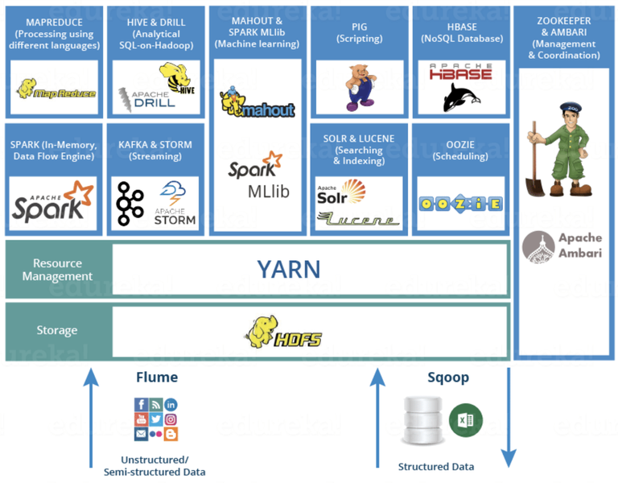

# AIFFEL_42일차 2020.09.21

Tags: AIFFEL_DAILY

### 일정


- [x]  풀잎스쿨 코딩마스터 session8
- [x]  LMS F-39
- [x]  LMS F-40

# 풀잎스쿨 코딩마스터 session8


[https://github.com/bluecandle/2020_AIFFEL/tree/master/coding_master/Session8_BFS_DFS](https://github.com/bluecandle/2020_AIFFEL/tree/master/coding_master/Session8_BFS_DFS)

```python
from itertools import product
### product를 이용한 숫자조합으로 풀 수도 있다.

num_list = [(x, -x) for x in numbers]

    cnt = 0
    for i in list(product(*num_list)):
# [(1, 2, 3, 4, 5), (1, 2, 3, 4, -5), (1, 2, 3, -4, 5), (1, 2, 3, -4, -5), (1, 2, -3, 4, 5), (1, 2, -3, 4, -5), (1, 2, -3, -4, 5), (1, 2, -3, -4, -5), (1, -2, 3, 4, 5), (1, -2, 3, 4, -5), (1, -2, 3, -4, 5), (1, -2, 3, -4, -5), (1, -2, -3, 4, 5), (1, -2, -3, 4, -5), (1, -2, -3, -4, 5), (1, -2, -3, -4, -5), (-1, 2, 3, 4, 5), (-1, 2, 3, 4, -5), (-1, 2, 3, -4, 5), (-1, 2, 3, -4, -5), (-1, 2, -3, 4, 5), (-1, 2, -3, 4, -5), (-1, 2, -3, -4, 5), (-1, 2, -3, -4, -5), (-1, -2, 3, 4, 5), (-1, -2, 3, 4, -5), (-1, -2, 3, -4, 5), (-1, -2, 3, -4, -5), (-1, -2, -3, 4, 5), (-1, -2, -3, 4, -5), (-1, -2, -3, -4, 5), (-1, -2, -3, -4, -5)]
        if sum(i) == target:
            cnt += 1

    return cnt

###### numpy를 이용한 풀이
import numpy as np
def solution(numbers, target):
    answer = np.zeros([1])
    for n in numbers:
        answer = np.concatenate((answer + n, answer -n), axis = 0)
    return np.count_nonzero(answer == target)
```

끝 ⇒ [https://github.com/bluecandle/2020_AIFFEL/tree/master/coding_master/Session8_BFS_DFS](https://github.com/bluecandle/2020_AIFFEL/tree/master/coding_master/Session8_BFS_DFS)

level, next level 이라는 구조를 생각하게 된다면, 그냥 queue나 stack을 사용하여 자연스럽게 층이 나뉘는 구조를 생각하는 것이 구현도 간단하고 효율적이다!

# [F-39]빅데이터 생태계


## **학습 목표**

---

- 하둡과 스파크의 에코시스템을 통해 빅데이터를 구성하는 기술들에 대해 학습해 봅니다.
- 스파크의 개요와 특징에 대해 알아보고, PySpark를 이용해 빅데이터 툴을 다루어 봅니다.

## 빅데이터 연대기

---

### MapReduce

---

GFS와 같은 분산 처리 파일 시스템에 적용하기 쉬운 프로그래밍 모델입니다.

데이터관련 작업을 맵(map) 함수와 리듀스(reduce) 함수의 2가지 작업으로 나누어 처리하는 것으로, 맵 함수에서는 키-값 쌍을 처리해 중간의 키-값 쌍을 생성하고 리듀스 함수는 동일한 키와 연관된 모든 중간의 값들을 병합하는 함수 였습니다.

### 하둡

---

[https://brunch.co.kr/@hvnpoet/98](https://brunch.co.kr/@hvnpoet/98)

### Spark

---

하둡에도 한가지 단점이 있는데요 이는 바로 하드디스크에 파일을 처리하는 점입니다. 물론 하드디스크가 값도 싸고 보존에도 용이하다는 장점이 있지만 간혹 고속으로 데이터를 처리할 때, 메모리에 올려서 처리해야 할 때도 있습니다. 이러한 니즈(Needs)가 점점 생겨나면서 메모리 기반(In-Memory)의 데이터 처리 방법에 대해 고민하게 됩니다.

하둡과 똑같은 맵리듀스 개념을 사용하지만 데이터 처리 방법과 Task 정리 방법을 개선하여 **RDD(Resilient Distributed Dataset)**를 이용하는 스파크란 프로그램을 발표.

RDD를 한국어로 "탄력적 분산 데이터셋"으로 번역 하기도 합니다.

[https://www.youtube.com/watch?time_continue=8&v=p8FGC49N-zM&feature=emb_logo&ab_channel=Databricks](https://www.youtube.com/watch?time_continue=8&v=p8FGC49N-zM&feature=emb_logo&ab_channel=Databricks)

## 빅데이터 양대산맥(1) Hadoop Ecosystem

---



역할에 따른 재정렬


### **데이터 수집(Data Ingestion)**

- 스쿱(Sqoop) : RDBMS(오라클, MySQL등..)와 하둡 사이의 데이터를 이동시켜줍니다.
- 플럼(Flume) : 분산환경에서 대량의 로그데이터를 효과적으로 수집하여 합친 후 다른 곳으로 전송 합니다.

### **데이터 처리(Data Processing)**

- 하둡 분산파일시스템(HDFS): 하둡의 분산 처리 파일 시스템
- 맵리듀스(MapReduce): Java기반의 맵리듀스 프로그래밍 모델 입니다.
- 얀(Yarn): 하둡 클러스터의 자원(Resource)를 관리
- 스파크(Spark): In-memory기반의 클러스터 컴퓨팅 데이터 처리 입니다. 스파크 안에도 스파크 코어, 스파크SQ, Milib, GraphX과 같은 컴포넌트가 있습니다.

### **데이터 분석(Data Analysis)**

- 피그(Pig): 맵리듀스로 실행하기 어려운 데이터 관련 작업, filter, join, query와 같은 작업을 실행 합니다.
- 임팔라(Impala): 고성능의 SQL 엔진
- 하이브(Hive): 임팔라와 유사한 SQL 관련 기능을 제공합니다.

### **데이터 검색(Data Exploration)**

- 클라우데라 서치(Cloudera Search): real-time으로 데이터에 검색이 가능합니다.
- 휴(Hue): 웹 인터페이스 제공

### **기타**

- 우지(Oozie): 워크플로우 관리, Job 스케쥴러
- HBase: NoSQL기반으로 HDFS에 의해 처리된 데이터를 저장합니다.
- 제플린(Zeppelin): 데이터 시각화
- SparkMLlib, 머하웃(mahout): 머신러닝 관련 라이브러리

## 빅데이터 양대산맥 (2) Spark Ecosystem

---

스파크 안에도 Spark SQL, Spark Streaming, MiLib과 같은 라이브러리가 있으며, 스파크 관점에서 빅데이터 생태계를 아래 그림과 같이 재구성해 볼 수 있습니다.


### **프로그래밍 언어: Scala, Java, Python, R, SQL**

스파크가 지원하는 프로그래밍 언어로는 Scala, Java, Python, R 이 있습니다. 위 그림에는 없지만 SQL역시 지원하고 있습니다.

### **스파크 라이브러리**

각각의 라이브러리는 다음과 같은 역할을 합니다.

- Spark SQL: SQL 관련 작업
- Streaming: Streaming 데이터 처리
- MLlib: Machine Learning 관련 라이브러리
- GraphX: Graph Processing

데이터 저장(Storage)은 Local FS(File System)이나 하둡의 HDFS를 이용하거나 AWS의 S3 인스턴스를 이용하기도 합니다. (주로 Amazon S3를 많이 사용합니다. ) 그리고 기존의 RDBMS나 NoSQL을 사용하는 경우도 있습니다.

하둡의 HDFS같이 스파크의 전용 분산 데이터 저장 시스템을 별도로 가지고 있지 않다는 점에서, 스파크의 에코시스템이 가지는 **유연한 확장성**이 강조된 설계 사상을 확인할 수 있습니다.

### Hadoop과 Spark비교

---

[https://www.youtube.com/watch?v=xDpvyu0w0C8&feature=emb_logo&ab_channel=edureka!](https://www.youtube.com/watch?v=xDpvyu0w0C8&feature=emb_logo&ab_channel=edureka%21)

Spark : in-memory cluster computing, RDD

In-memory processing 을 통한 real-time분석.


spark는 동작 방식덕분에 당연히 메모리 요구량이 크다

단, 필요한 시스템의 갯수 자체는 적음.


Hadoop , Spark Batch 처리, Stream 처리


Hadoop은 하나만 틀려도 다시 해야하는건가?


하둡은 Batch-processing에 유용하게 사용될 수 있고, Spark는 real-time 상황에 유용하게 사용가능.

## Spark 데이터 처리: RDD

---

스파크는 **RDD(Resilient Distributed Dataset)를 구현하기 위한 프로그램**입니다.
RDD를 스파크라는 프로그램을 통해 실행 시키므로써 메모리기반의 대량의 데이터 연산이 가능하게 되었고 이는 하둡보다 100배는 빠른 연산을 가능하게 해 주었습니다.

### RDD 등장배경

---


하둡은 파일을 디스크에 저장한뒤 그걸 불러와 연산(주로 맵리듀스연산)하고 다시 디스크에 저장하면서 파일 처리 작업을 수행합니다. 모든 연산마다 디스크에 파일을 읽고 불러오니 디스크에서 파일을 읽고 쓰는데 시간이 너무 오래 걸립니다. 조금 전문적으로 이야기하면 **I/O 바운드가 하둡의 주요 병목현상**입니다.

스파크는 하드디스크에서 파일을 읽어온 뒤 연산 단계에는 데이터를 메모리에 저장하자는 아이디어를 생각해 냈습니다. 그랬더니 속도가 매우 빨라졌습니다. 그런데 메모리는 태생이 비휘발성 입니다.

뭔가 **메모리에 적재하기 좋은 새로운 형태**의 추상화작업(abstraction)이 필요합니다. 그렇게 고안된 것이 바로 **RDD(Resilient Distributed Dataset), "탄력적 분산 데이터셋"**입니다.

정리하면, 탄력적 분산 데이터셋 (RDD: Resilient Distributed Dataset)는 스파크에서 사용하는 기본 추상개념으로 **클러스터의 머신(노드)의 여러 메모리에 분산하여 저장할 수 있는 데이터의 집합**을 의미합니다.

### RDD의 특징

---

메모리에 저장된 데이터가 중간에 데이터가 유실되면 어떻게 할까요? 다시 말해, 결함(fault)이 생기면 어떻게 할까요? 스파크는 새로운 방법을 고안합니다.

메모리의 데이터를 읽기 전용(Read-Only, 변경 불가)로 만듭니다. 그리고 **데이터를 만드는 방법을 기록**하고 있다가 **데이터가 유실되면 다시 만드는 방법을 사용**합니다. 즉, 계보(Lineage)를 저장합니다.

RDD의 특징을 단어로 표현하면 다음과 같습니다.

- In-Memory
- Fault Tolerance
- Immutable(Read-Only)
- Partition [파티션]

각 파티션은 RDD의 전체 데이터중 일부를 나타냅니다. 스파크는 데이터를 여러대의 머신에 분할해서 저장하며, Chunk, 혹은 파티션으로 분할되어 저장합니다. 파티션을 RDD데이터의 부분을 표현하는 단위 정도로 이해하시면 좋습니다.

## RDD의 생성과 동작

---

RDD를 만드는 방법에는 2가지가 있습니다.

- 내부에서 만들어진 데이터 집합을 병렬화 하는 방법: **`parallelize()`**함수 사용
- 외부의 파일을 로드하는 방법: **`.textFile()`** 함수 사용

RDD의 동작은 크게 Transformations과 Actions 2가지 입니다.

- Transformations
- Actions


RDD는 immutable(불변)하다고 하였습니다.

따라서 연산 수행에 있어 기존의 방식과는 다르게 수행 된다. Transformations은 RDD에게 **변형방법(연산로직, 계보, lineage)**을 **알려주고** **새로운 RDD**를 만듭니다. 그러나 실제 연산의 수행은 Actions을 통해 행해 집니다.


도식화


rdd의 생성, transformations동작, actions동작 도식화.


1. sc.textFile()을 통해 rdd 생성
2. 단, 이 작업은 실제로는 rdd의 lineage(계보)를 만드는데 지나지 않음.
3. 실제 객체 생성은 되지않음.
4. 그리고 transformations함수 중 하나인 filter()를 만든다.
5. 이것도 lineage(계보)를 만드는 일에 지나지 않음.
6. 실제 rdd가 생성되는 시점은 Actions 함수인 counts()를 실행할 때임.

⇒ 결과값이 필요할 때까지 계산을 늦추다가 정말 필요한 시기에 계산을 수행하는 방법  : ***Lazy evaluation***

# PySpark 사용해보기

---

## SparkContext를 통한 스파크 초기화

---

분산환경에서 운영되는 스파크는 driver프로그램을 구동시킬 때 SparkContext라는 특수 객체를 만들게 됩니다. 스파크는 이 **SparkContext 객체**를 통해 스파크의 모든 기능에 접근.

이 객체는 **스파크 프로그램당 한번**만 실행할 수 있고 사용후에는 종료 해야 합니다. 따라서 SparkContext를 다른 말로 스파크의 "엔트리 포인트(entry point)"라고도 하고, SparkContext를 생성하는 것을 "스파크를 초기화한다(Initializing Spark)" 라고 합니다.


그러니깐 사실 PySpark는 **Python으로 코딩을 하긴 하지만 실제 동작은 JVM에의해 행해지고 있습니다.**

[예시]

```python
from pyspark import SparkConf, SparkContext

#예시 1
sc = SparkContext()
sc

#예시 2
sc = SparkContext(master='local', appName='PySpark Basic')
sc

sc.getConf().getAll()

#예시 3
conf = SparkConf().setAppName('PySpark Basic').setMaster('local')
sc = SparkContext(conf=conf)
sc
```

## RDD Creation

---

### 내부 데이터 집합 병렬화: parallelize()

---

```python
rdd = sc.parallelize([1,2,3])
rdd
```

rdd는 생성과 transformations 연산을 바로 수행하지 않는다. 계보만 만들어놓고 actions 동작을 할 때 rdd가 비로소 만들어진다.(lazy evaluation)

### 외부 파일 로드: textFile()

---

```python
rdd2 = sc.textFile(file_path)
print(rdd2)
print(type(rdd2))
# => ['0','1','2']
```

숫자를 입력했는데 문자열의 list를 얻었네?

spark가 `.textFile()` 을 통해 얻어온 데이터 타입을 무조건 string으로 처리하기 때문.

⇒ 이걸 숫자로 변환하려면 Transformation같은 RDD Operation이 필요한 것.

## RDD Operation (1) Transformations

---

자주 쓰이는 함수

- map()
- filter()
- flatmap()

```python
nums = sc.parallelize([1, 2, 3])
squares = nums.map(lambda x: x*x)
print(squares.collect())
# => [1,4,9]
```

```python
text = sc.parallelize(['a', 'b', 'c', 'd'])
capital = text.map(lambda x: x.upper())
A = capital.filter(lambda x: 'A' in x)
print(text.collect())
print(A.collect())
# => ['A']
```


FlatMap은 RDD의 원소에 map연산을 수행하고 원소의 갯수를 증가시키기도 합니다. 원소의 갯수는 꼭 동일하게 증가시키지 않아도 됩니다.

```python
x = sc.parallelize([1,2,3])
y = x.flatMap(lambda x: (x, x*10, 30))
print(x.collect())
print(y.collect())
```

### CSV 파일 읽어와보기

```python
# 비어있는 라인은 제외하고, delimeter인 ,로 line을 분리해 줍니다. 
csv_data_1 = csv_data_0.filter(lambda line: len(line)>1).map(lambda line: line.split(","))   
csv_data_1.take(5)
```

```python
# 첫번째 컬럼이 숫자인 것만 필터링
csv_data_2 = csv_data_1.filter(lambda line: line[0].isdecimal())
csv_data_2.take(5)
```

```python
csv_data_3 = csv_data_2.map(lambda line: [(columns[0][i], linedata) for i, linedata in enumerate(line)])
csv_data_3.take(5)
```

### csv 파일을 DataFrame으로 읽어들이기

---

```python
from pyspark import SparkConf, SparkContext, SQLContext

url = 'https://storage.googleapis.com/tf-datasets/titanic/train.csv'
from pyspark import SparkFiles
sc.addFile(url)
sqlContext = SQLContext(sc)

df = sqlContext.read.csv(SparkFiles.get("train.csv"), header=True, inferSchema= True)
df.show(5, truncate = False)
```

지금까지 우리가 사용했던 SparkContext를 한번 더 가공한 **`SQLContext`**에서 제공하는 `read.csv()` 함수를 이용하면 스파크의 DataFrame을 얻을 수 있습니다.

이것은 우리에게 익숙한 Pandas의 DataFrame을 떠올리게 합니다. 아주 똑같은 것은 아닙니다. 그러나 아주 유사하게 이용할 수 있습니다. 실제로 SQLContext에는 RDD를 이용해 데이터를 분석하는 것보다 훨씬 편리하고 강력한 기능들을 많이 제공하고 있습니다.

## RDD Operations (2) Actions

---

- collect()
    - RDD 내의 모든 값을 리턴합니다. 주의하세요! 정말 빅데이터를 다루고 있다면 함부로 호출하지 않는게 좋습니다.
- take()
    - RDD에서 앞쪽 n개의 데이터의 list를 리턴합니다. collect()보다는 안전하게 데이터를 확인해 볼 수 있습니다.
- count()
    - RDD에 포함된 데이터 개수를 리턴합니다.
- reduce()
    - MapReduce의 그 reduce에 해당합니다.
    - MapReduce를 스파크에서 어떻게 구현했는지 알 수 있습니다. Map은 Transformation 함수로, Reduce는 Action 함수로 구현했습니다. Reduce할 데이터가 RDD로 메모리 상에 존재하므로 이전의 다른 구현체보다 훨씬 빠르게 MapReduce 를 실행할 수 있겠습니다.
- saveAsTextFile()
    - RDD 데이터를 파일로 저장합니다.
    - 디렉토리 타입으로 생성. 그 안에 들어가면 실제 기록하고 싶은 내용들이 파일로 저장되어있음.
    - 우리가 다루고 있는 스파크가 바로 분산형 빅데이터 시스템이라는 것을 잊어서는 안됩니다. 스파크가 다룰 파일 사이즈는 하드디스크 하나에 다 담지 못할 만큼 큰 경우일 수도 있습니다.

## RDD Operation (3) 실습: MapReduce

---

```python
text = sc.parallelize('hello python')

# map 함수를 적용한 RDD 구하기
# [[YOUR CODE]]
temp = text.filter(lambda x : x!=' ')
y = temp.map(lambda x: (x,1))
print(y.collect())

#reduceByKey 함수를 적용한 Word Counter 출력
# [[YOUR CODE]]
z = y.reduceByKey(lambda  key,val : key+val)
z.collect()
```

```python
# 이전 스텝에서 CSV 파일을 로딩했던 내역입니다. 
csv_path = os.getenv('HOME')+'/aiffel/bigdata_ecosystem/train.csv'
csv_data_0 = sc.textFile(csv_path)
csv_data_1 = csv_data_0.filter(lambda line: len(line)>1).map(lambda line: line.split(","))   
columns = csv_data_1.take(1)
csv_data_2 = csv_data_1.filter(lambda line: line[0].isdecimal())
csv_data_3 = csv_data_2.map(lambda line: [(columns[0][i], linedata) for i, linedata in enumerate(line)])

csv_data_3.take(3)

# csv_data_3를 가공하여 생존자, 사망자의 연령 총합과 사람 수를 각각 구해 봅시다. 
# 이후 각각의 데이터로부터 생존자와 사망자의 평균 연령을 구할 수 있습니다. 

# [[YOUR CODE]]

# 생존자와 사망자의 연령 총합 구하기
csv_data_4 = csv_data_3.map(lambda line:(line[0][1], line[2][1]))
# (생존여부, 연령)
age_sum_data = csv_data_4.reduceByKey(lambda accum, age: float(accum) + float(age))  
age_sum = age_sum_data.collect()

# 생존자와 사망자의 사람 수 구하기
csv_data_5 = csv_data_3.map(lambda line:(line[0][1], 1)) # survived 여부에 따라 1값 넣기.
survived_data = csv_data_5.reduceByKey(lambda accum, count: int(accum) + int(count)) 
survived_count = survived_data.collect()

age_sum_dict = dict(age_sum)
survived_dict = dict(survived_count)
avg_age_survived = age_sum_dict['1']/survived_dict['1']
print('생존자 평균 연령:' ,avg_age_survived)
avg_age_died = age_sum_dict['0']/survived_dict['0']
print('사망자 평균 연령:' ,avg_age_died)
```

# [F-40]정보이론 톺아보기


## **학습 목표**

---

머신러닝이론의 이론적 토대를 이루는 가장 중요한 이론 중 하나인 **정보이론(Information Theory)**에 대해 알아보고, 머신러닝에서 많이 사용되는 **Entropy, Cross Entropy, KL divergence** 등의 개념을 파악한다. 그리고 이런 개념이 **머신러닝 이론과 어떻게 연결되는지**의 사례를 파악해 본다.

정보 이론(information theory)이란, 추상적인 '정보'라는 개념을 정량화하고 정보의 저장과 통신을 연구하는 분야입니다.

## Information Content

---


공을 꺼낼 때 우리가 얻을 수 있는 정보의 양은 왼쪽이 더 많습니다. 오른쪽 주머니에서는 공을 꺼내봤자 어차피 파란색이니 별다른 정보가 없는 것이죠. 오늘 아침에 해가 동쪽에서 떴다는 이야기가 뉴스거리가 되지 못하는 것과 같은 이유입니다.

파란색 공 999개와 빨간색 공 1개가 들어있는 주머니가 있다고 합시다. 어떤 사람이 공을 하나 꺼내고 다시 넣는 실험을 반복합니다. 이 사람은 주머니에 어떤 색깔의 공이 몇 개씩 들어 있는지 모르기 때문에, 공을 하나씩 뽑을 때마다 이 사람이 추측하는 확률 분포가 업데이트됩니다. 파란색 공을 처음 몇 번 뽑았을 때, 파란색 공을 뽑는 사건은 정보량이 높습니다. 하지만 파란색 공만 수십, 수백 번 뽑고 나서는 파란색 공을 뽑는 사건은 확률이 1에 가깝기 때문에 큰 의미를 주지 못합니다. **그러다가 만약에 하나 있는 빨간색 공을 뽑는다면,** 이 사건은 정보량이 엄청나게 높을 것입니다. **빨간색 공을 뽑기 전까지 관찰된 파란색 공의 수가 많을수록(= 빨간색 공이 뽑힐 확률이 낮을수록) 빨간색 공을 뽑는 사건의 정보량은 높아집니다.**

1. 일어날 가능성이 높은 사건은 정보량이 낮고, 반드시 일어나는 사건에는 정보가 없는 것이나 마찬가지입니다.
2. 일어날 가능성이 낮은 사건은 정보량이 높습니다.
3. 두 개의 독립적인 사건이 있을 때, 전체 정보량은 각각의 정보량을 더한 것과 같습니다.

사건 x가 일어날 확률을 $P(X=x)$ 라고 할 때, 사건의 정보량(information content) $I(x)$ 는 다음과 같이 정의된다.

$I(x)=- \log_b P(x)$


P(x) 의 값이 작을수록 (확률이 희박할 수록) 정보량이 더 많아진다 ⇒ 아래 코드에서 구현해놓은 내용봐도 좋음ㅇㅇ

로그의 밑 b 값이 2인 경우, 정보량은 정보를 나타내기 위해 필요한 비트의 개수과 같다.

(위 그래프는 밑이 e)

```python
import numpy as np
import math
import random

# 주머니 속에 들어있는 공의 개수입니다. 숫자를 바꾸면서 실험해보세요!
total = 100000

#---------------#

count = 1   # 실험이 끝날 때까지 꺼낸 공의 개수

# 1부터 total까지의 정수 중에서 하나를 뽑고 total과 같으면 실험 종료
# total=1000인 경우 1~999: blue / 1000: red
while True:
    sample = random.randrange(1,total+1)
    if sample == total:
        break
    count += 1

print('number of blue samples: '+str(count-1))
print('information content: '+str(-math.log(1/count)))
```

파란색 공 n개와 빨간색 공 1개가 있을 때 빨간색 공을 뽑는 사건의 정보량을 코드로 계산해 보겠습니다. 빨간색 공이 뽑힐 때까지 공을 꺼내는 시뮬레이션이 반복됩니다. 전체 공의 개수가 많을수록 1개 있는 빨간색 공이 뽑힐 확률은 작아지고, 평균적으로 계산되는 정보량이 커집니다.

## Entropy

---

정보량은 한 가지 사건에 대한 값입니다. 예를 들면 주사위를 던졌을 때 1이 나오는 사건, 여러 색깔의 공이 들어있는 주머니에서 빨간색 공을 꺼내는 사건 등이죠.

그러면 **여러 가지 경우의 수가 존재하는 실험의 정보량**도 구할 수 있을까요? 직관적으로, 확률 변수가 가지는 모든 경우의 수에 대해 정보량을 구하고 평균을 내면 **확률 변수의 평균적인 정보량**을 구할 수 있을 것입니다. 특정 확률분포를 따르는 사건들의 **정보량 기댓값**을 **엔트로피(entropy)**라고 합니다.

### For Discrete Random Variables

---

이상 확률 변수 X가 $x_1,x_2,\cdots, x_n$ 중 하나의 값을 가진다고 가정.

엔트로피는 각각의 경우의 수가 가지는 정보량에 확률을 곱하고 모두 더한 값

$H(X)=\mathbb{E}_{X \sim P}[I(x)]=-\sum_{i=1}^{n} p_i \log p_i \quad (p_i:=P(X=x_i))$


여러가지 색깔의 공이 들어있을 때 엔트로피가 높고, 같은 색깔의 공이 많이 들어있을 때 엔트로피가 낮습니다. 주머니에 공 10개가 있을 때, 10개가 모두 다른 색깔인 경우 엔트로피는 $-(0.1 \log 0.1) \times 10 \approx 2.3$ 으로 최댓값. 

이러한 사실은 엔트로피의 직관적인 개념인 **무질서도, 불확실성**과도 비슷합니다.


확률 변수가 가질 수 있는 값의 가짓수가 같을 때(여기에서는 빨간색/파란색), 사건들의 확률이 균등(여기서는 빨강, 파랑 공의 갯수가 비슷할수록)할수록 엔트로피 값은 증가합니다.

### For Continuous Random Variables

---

X가 이산 확률 변수일 때, 엔트로피는 정보량에 확률을 각각 곱해서 모두 더한 값으로 정의됨.

X가 연속적인 값을 갖는 연속 확률 변수일 때는 유한합 대신 적분의 형태로 정의됨.

확률 변수 X의 확률 밀도 함수가 p(x)일 때, 엔트로피는 다음과 같다.

$h(X)=-\int p(x) \log p(x)dx$

연속 확률 변수의 엔트로피를 이산 확률 변수와 구분하여 **미분 엔트로피(differential entropy)**라고 부르기도 합니다.

## Kullback Leibler Divergence

---

머신러닝의 목표는 새로운 입력 데이터가 들어와도 예측이 잘 되도록 모델이 나타내는 확률 분포를 데이터의 실제 확률 분포에 가깝게 만드는 것입니다.

### 머신러닝 모델의 두 가지 갈래

---

- 결정 모델(discriminative model):  데이터의 실제 분포를 모델링하지 않고 결정 경계(decision boundary)만을 학습.
- 생성 모델(generative model): 데이터와 모델로부터 도출할 수 있는 여러 확률 분포와 베이즈 이론을 이용해서 데이터의 실제 분포를 간접적으로 모델링.
    - 따라서, 생성 모델을 학습시킬 때는 두 확률 분포의 차이를 나타내는 지표가 필요함.
    - ***대표적인 예가 쿨백-라이블러 발산(Kullback-Leibler divergence, KL divergence)***

데이터가 따르는 실제 확률 분포를 P(x), 모델이 나타내는 확률 분포를 Q(x)라고 해보자.

두 확률 분포의 KL Divergence는

- P(x)를 **기준으로** 계산된 Q(x)의 평균 정보량과,
- P(x)를 **기준으로** 계산된 P(x)의 평균 정보량의 차이로 정의된다.

실제 확률 분포 P(x) 대신 **근사적인 분포 Q(x)를 사용했을 때 발생하는 엔트로피의 변화량을** 나타내는 값.

$D_{KL}(P||Q)=\mathbb{E}_{X\sim P}[-\log Q(x)]-\mathbb{E}_{X\sim P}[-\log P(x)]=\sum P(x)\log \left(\frac{P(x)}{Q(x)}\right)$

연속 확률 변수의 경우에는 이렇게 정의된다.

$D_{KL}(P||Q)=\int P(x)\log \left(\frac{P(x)}{Q(x)}\right)$

KL divergence는 **두 확률 분포의 차이**를 나타내는 값이기 때문에 **거리 함수와 비슷한 성질**을 가지고 있습니다. 다만 KL divergence의 식에는 **기준이 되는 확률 분포 (P(x), 데이터의 실제 분포)**가 존재하기 때문에 $D_{KL}(P||Q)$ 와 $D_{KL}(Q||P)$ 의 값은 같지 않습니다.


머신러닝 문제에서는 두 확률 분포의 차이를 줄여야 하므로 $D_{KL}(P||Q)$ 를 최소화하는 방법으로 모델을 학습시킨다.


P(x)는 데이터의 실제 분포이므로, 우리가 바꿀 수 없는 고정된 값임.

(위의 식에서 오른쪽의 파란색 부분은 모델을 아무리 잘 만들어도 값을 줄일 수 없다.)

바꿀 수 있는 부분은 Q(x)에 관한 부분!

KL divergence를 최소화하는 문제는 곧 **빨간색 부분**을 최소화하는 문제가 된다.

그리고, 이 부분은 **P(x)를 기준으로 계산한 Q(x)의 엔트로피**, 즉 **P(x)에 대한 Q(x)의 교차 엔트로피(cross entropy)**이다.

## Cross-Entropy

---

P(x)에 대한 Q(x)의 교차 엔트로피 식을 다시 적으면

$H(P,Q)=-\mathbb{E}_{X\sim P}[\log Q(x)]=-\sum P(x)\log Q(x)$ 이렇게 된다.

KL divergence의 계산식으로부터 엔트로피와 교차 엔트로피, KL divergence 사이의 관계식을 얻을 수 있습니다.


$H(P,Q)=H(P)+D_{KL}(P||Q)$

정답셋의 확률분포 P와 우리 모델의 추론 결과의 확률분포 Q 의 차이 KL divergence를 최소화하는 것, 즉 우리 모델의 추론 결과가 정답셋과 최대한 유사하게 하는 것과 교차 엔트로피(Cross Entropy)를 최소화하는 것이 수학적으로 같다는 것을 확인한것!

## Cross-Entropy Loss

---

그렇다면, Cross entropy가 머신러닝에서 어떻게 분류모델의 loss 함수 역할을 하게 되는가?!

엔트로피 증가가 정보 손실량이라고 정의한다고 볼 수 있다.

분류 문제에서는 데이터의 확률 분포가 위와 같이 one-hot vector로 표현되기 때문에, P(x)와 Q(x) 의 차이를 cross entropy로 계산할 경우 계산이 간단해진다는 장점이 있습니다.


$H(P,Q)\\ = -\sum P(x)\log Q(x) \\
= -\left(0\cdot\log 0.2+1\cdot\log 0.7+0\cdot\log 0.1\right) \\
= -\log 0.7 \approx 0.357$

P(x) 분포가 랜덤하게 생성되었을 때 Q(x)를 변형시키면서 cross entropy를 계산해보기.

```python
import numpy as np
import random

# generate random output
#-----------------#
# can be modified
class_num = 4
#-----------------#
q_vector = []
total = 1

for i in range(class_num-1):
    q = random.uniform(0,total)
    q_vector.append(round(q,3))
    total = total - q

q_vector.append(total)
softmax_output = np.array(q_vector)

print(softmax_output)

#-----------------#
# can be modified
class_index = 1
#-----------------#

p_vector = np.zeros(class_num)
p_vector[class_index-1] = 1

cross_entropy = -np.sum(np.multiply(p_vector, np.log(softmax_output)))

print('model prediction: '+str(softmax_output))
print('data label: '+str(p_vector))
print('cross entropy: '+str(round(cross_entropy,4)))
```

### Cross-Entropy와 Likelihood의 관계

---

모델의 파라미터를 $\theta$ 로 놓으면, 모델이 표현하는 확률 분포는 $Q(\mathbf{y}|X,\theta)$ 로, 데이터의 실제 분포는 $P(\mathbf{y}|X)$ 로 나타낼 수 있습니다. 그런데 $Q(\mathbf{y}|X,\theta)$ 는 데이터셋과 파라미터가 주어졌을 때 예측값의 분포를 나타내므로 모델의 likelihood와 같습니다.

$H(P,Q) \\= -\sum P(\mathbf{y}|X)\log Q(\mathbf{y}|X,\theta) \\
= \sum P(\mathbf{y}|X)\left(-\log Q(\mathbf{y}|X,\theta)\right)$

X와 y는 데이터셋에 의해 결정되는 값이기 때문에 모델의 식이 바뀌어도 변하지 않음. 바꿀 수 있는 부분은 $-\log Q(\mathbf{y}|X,\theta)$ 뿐. 그러므로 **cross entropy를 최소화하는 파라미터 값을 구하는 것은 negative log likelihood를 최소화하는 파라미터를 구하는 것과 결국 같다고 할 수 있습니다.**

## Decision Tree와 Entropy

---

엔트로피 개념이 활발히 쓰이는 분야 하나 더! 의사결정나무 계열의 모델

의사결정 트리는, 가지고 있는 데이터에서 어떤 기준으로 전체 데이터를 나눴을 때 나누기 전보다 엔트로피가 감소하는지를 따져서, 엔트로피가 감소하면 그만큼 모델 내부에 정보 이득(Information Gain)을 얻었다고 보는 관점입니다.

(엔트로피가 감소하면, 정보의 불확실성이 감소했다는 의미니까?! 그만큼 gain을 얻었다고 보는건가?)

엔트로피 증가가 정보 손실량이라고 정의하는 것의 반대 관점이죠.

$IG(S, F) = e(S) - \sum_{f \in F} \dfrac{|S_f|}{|S|} e(S_f)$

- S : 전체사건의 집합
- F : 분류 기준으로 고려되는 속성(feature)의 집합
- f∈F : f는 F 에 속하는 속성 (예를 들어 F가 Outlook일 때, f는 Sunny, Overcast, Rainy 중 하나가 될 수 있다. )
- $S_f$: f 속성을 가진 S의 부분집합
- |X| : 집합 X의 크기(원소의 갯수)
- e(X) : X라는 사건 집합이 지닌 엔트로피

위 수식 $IG(S, F)$ 는 F라는 분류기준을 선택했을 때의 엔트로피를 전체사건의 엔트로피에 빼준 값, **분류기준 채택을 통해 얻은 정보이득의 양**을 말한다.

[예시]

먼저 e(S). 전체 14가지 중 play하는 경우가 9번, 하지 않는 경우가 5번.

$e(S) = -(\dfrac{9}{14} \log_2 \frac{9}{14} + \dfrac{5}{14} \log_2 \frac{5}{14} ) = 0.94$

F가 Outlook일 때, 즉 f는 Sunny,Overcast,Rainy 중 하나일 때의 엔트로피

$\begin{aligned}  
e(S_{\text{Sunny}}) &= -( \dfrac{2}{5} \log_2 \dfrac{2}{5} + \dfrac{3}{5} \log_2 \dfrac{3}{5}) = 0.97 \\  
e(S_{\text{Overcast}}) & = 0 \\  
e((S_{\text{Rain}}) & =  -( \dfrac{3}{5} \log_2 \dfrac{3}{5} + \dfrac{2}{5} \log_2 \dfrac{2}{5}) = 0.97 
\end{aligned}$

⇒ 이 때의 정보이득은?

$\sum_{f \in F} \dfrac{|S_f|}{|S|} e(S_f) = \dfrac{5}{14}e(S_{\text{Sunny}}) + \dfrac{4}{14}e(S_{\text{Overcast}}) + \dfrac{5}{14}e(S_{\text{Rain}}) = \dfrac{5}{14}0.97 + \dfrac{4}{14}0 + \dfrac{5}{14}0.97 = 0.69$

그리고, 이제 합치면

$IG(S, F) = e(S) - \sum_{f \in F} \dfrac{|S_f|}{|S|} e(S_f) = 0.94 - 0.69 = 0.25$

가능한 모든 분류기준 F에 대해서 정보이득을 계산해서, 가장 정보이득이 큰 순서대로 전체 사건 2등분.

그 후 다시 다른 분류기준으로 위에서 했던것과 동일하게, 첫번째로 사용했던 기준으로 나뉜 절반의 사건집합 안에서의 정보이득을 계산하는 방식으로 **세부 분류 기준을 계속 찾아나감.**

사건의 분류기준을 세워나가다 보면 전체 사건 분류 기준이 트리 구조가 되기 때문에 이를 의사결정나무(Decision Tree)라 부르게 됨.

근데...그러면 엔트로피 낮은 쪽으로만 가면 무조건 정교한 분류가 가능한가??

```python
import pandas as pd
import numpy as np
from sklearn.tree import DecisionTreeClassifier 
from sklearn.model_selection import train_test_split 
from sklearn import metrics

import os
csv_path = os.getenv('HOME')+'/aiffel/information_theory/diabetes.csv'

col_names = ['pregnant', 'glucose', 'bp', 'skin', 'insulin', 'bmi', 'pedigree', 'age', 'label']
# load dataset
df = pd.read_csv(csv_path, header=0, names=col_names)
df.head()

# 데이터셋 준비
feature_cols = ['pregnant', 'insulin', 'bmi', 'age','glucose','bp','pedigree']
X = df[feature_cols] # Features
y = df.label # Target variable

# Split dataset into training set and test set
X_train, X_test, y_train, y_test = train_test_split(X, y, test_size=0.3, random_state=1)

# Decision Tree  모델 학습
# Create Decision Tree classifer object
clf = DecisionTreeClassifier()

# Train Decision Tree Classifer
clf = clf.fit(X_train,y_train)

#Predict the response for test dataset
y_pred = clf.predict(X_test)

print("Accuracy:",metrics.accuracy_score(y_test, y_pred))
# 약 70% (제약없이 했을때)

from sklearn.tree import export_graphviz
from six import StringIO  
from IPython.display import Image  
import pydotplus

dot_data = StringIO()
export_graphviz(clf, out_file=dot_data,  
                filled=True, rounded=True,
                special_characters=True,feature_names = feature_cols,class_names=['0','1'])
graph = pydotplus.graph_from_dot_data(dot_data.getvalue())  
graph.write_png('diabetes.png')
Image(graph.create_png())

# 정보이득이 되지 않고 남은 Impurity  총량 측정
ccp_path1 = clf.cost_complexity_pruning_path(X_train,y_train)
ccp_path2 = clf.cost_complexity_pruning_path(X_test,y_test)
print(np.mean(ccp_path1.impurities))
print(np.mean(ccp_path2.impurities))

# 0.15538793631294812
# 0.15262527466137116
```


시각화해 본 결과, 우리가 학습시킨 Decision Tree 는 정보이득을 최대화할 수 있는 지점까지 극한적으로 많은 분류기준을 적용한 경우임을 알 수 있었습니다. (제약없이 한거지! 그리고 이렇게 하니 정확도 70%정도 )

그런데 이것이 과연 타당할까요?

비교실험 : 3depth까지만

```python

clf = DecisionTreeClassifier(criterion="entropy", max_depth=3)

# Train Decision Tree Classifer
clf = clf.fit(X_train,y_train)

#Predict the response for test dataset
y_pred = clf.predict(X_test)

# Model Accuracy, how often is the classifier correct?
print("Accuracy:",metrics.accuracy_score(y_test, y_pred))
# 77%가량 나옴! 오히려 높아짐!

dot_data = StringIO()
export_graphviz(clf, out_file=dot_data,  
                filled=True, rounded=True,
                special_characters=True,feature_names = feature_cols,class_names=['0','1'])
graph = pydotplus.graph_from_dot_data(dot_data.getvalue())  
graph.write_png('diabetes.png')
Image(graph.create_png())

# 정보이득이 되지 않고 남은 Impurity  총량 측정
ccp_path1 = clf.cost_complexity_pruning_path(X_train,y_train)
ccp_path2 = clf.cost_complexity_pruning_path(X_test,y_test)
print(np.mean(ccp_path1.impurities))
print(np.mean(ccp_path2.impurities))

# 0.7474881472739515
# 0.6878691771636323
```


정보이득되지 않은 남은 엔트로피(Impurity) 총량을 따지면,

위의 경우보다 아래의 경우(제한을 둔 경우)가 훨씬 많다

⇒ 엔트로피 기준으로는 더욱 정보이득을 얻을 수 있는 상황!

⇒ 하지만, 분류기준을 더 세우지 않는 것이 모델의 정확도 향상에는 더 나은 상황!

⇒ 왜냐하면, Decision Tree 의 분류기준은 사실 임의로 정한 것이기 때문입니다. 무한정 기준을 쪼개서 엔트로피를 떨어뜨릴 수 있지만, 그것은 Overfitting의 결과를 낳게 됩니다. 시각화된 결과를 통해 이를 확인해 보면 좋습니다.

다만, 양한 분류 기준을 가진 Decision Tree 여러개를 앙상블한 Random Forest 모델은 이러한 문제점을 극복하고 훌륭한 성능을 보일 수 있다.