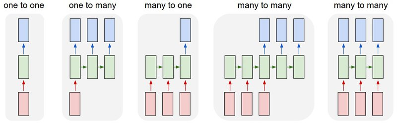

# AIFFEL_43일차 2020.09.22

Tags: AIFFEL_DAILY

### 일정


- [x]  LMS E-15
- [x]  cs231n lecture13 : Generative Model 듣기

# [E-15]번역기를 만들어보자


sequence-to-sequence(seq2seq이라고 많이 부릅니다) 모델은 이러한 뉴럴 기계번역의 가능성을 한층 앞당긴 기념비적인 모델이라 할 수 있습니다. 물론 지금 엄청난 성능을 내고 있는 기계번역 모델에 사용되고 있지는 않습니다. 앞으로 배우게 될 최신 모델들에 비하면 seq2seq은 고전적이라고 할 수 있겠습니다만, **지금의 번역기 모델의 근간을 이루고 있는 중요한 아이디어**를 제공하고 있습니다.

## **학습 목표**

---

1. 다양한 RNN의 구성을 알아보기
2. 인코더와 디코더 구조의 필요성 이해하기
3. 교사 강요(teacher forcing)의 원리 알기
4. 훈련 단계와 추론 단계(inference)의 차이 알기

## 기계 번역 이야기

---

규칙 기반 ⇒ 통계 기반 ⇒ 신경망 기계 번역

## 시퀀스 처리하는 RNN

---



- 1번 one-to-one은 순환하지 않으므로 일반적인 피드 포워드 신경망입니다.
- 2번 one-to-many는 순환을 하기 시작하니까 본격적인 RNN이네요. 하나의 입력으로부터 다수의 출력을 내는 경우인데, 예를 들어 하나의 이미지를 받아서 이미지의 제목. 다시 말해 단어 시퀀스를 출력하는 이미지 캡셔닝(image captioning) 작업이 이에 속합니다.
- 3번 many-to-one은 시퀀스를 입력받아서 하나의 결과를 내는 RNN으로 텍스트 분류(text classification)에 사용할 수 있습니다. 가령, 스팸 메일 분류기라고 하면 메일을 입력받아서 이 메일이 '정상 메일'인지 '스팸 메일'인지를 결과를 알 수 있겠죠.
- 5번 many-to-many는 시퀀스를 입력받아 시퀀스를 출력하는데, 매 time step마다 바로 출력을 하는 구조에요. 이 구조는 입력 문장의 각 단어가 무엇인지를 알려주는 개체명 인식이나 품사 태깅에 사용할 수 있습니다.
- 이제 4번을 볼까요? many-to-many이지만 5번이랑 달라요. 입력을 받는 동안 출력을 내지 않다가 **어느 time step부터 출력을 시작**합니다. 아마 어떤 기준이 있는 모양이에요. 구현하기가 5번보다는 까다로울 것 같다는 생각이 듭니다.

⇒ 기계 번역기 구현은 기본적으로 4번을 활용해야 한다.

⇒ **'사람 말은 끝까지 들어봐야한다.'** ㅋㅋㅋㅋㅋ

⇒ 번역 또는 통역이라고 하는 것이 전체 문장을 모두 읽거나 듣고나서야 할 수 있는 것이기 때문!

## seq2seq

---

### seq2seq의 인코더-디코더 구조

위에서 설명한 4번 구조보다는 조금 더 복잡하다.


seq2seq는 두 개의 RNN 아키텍처를 연결한 구조.

입력 문장을 받는 RNN을 **인코더**라고 하고, 두번째 RNN을 **디코더**라고 한다.

### 일반적인 Encoder, Decoder

Encoder ; Feature Extractor의 역할

⇒ 데이터 X를 해석하기 위한 저차원의 feature vector z를 만들어냄.

Decoder : 복원의 역할

⇒  저차원의 Feature vector z로부터 정보를 복원하여 다시 어떤 데이터 X' 을 만든다.


seq2seq 모델에서는 일반적인 Encoder,Decoder 구조에서 두 가지가 모두 RNN인 경우.

근데, seq2seq의 feature vector는 무엇?

⇒ 인코더 RNN이 입력문장을 해석해서 만들어낸 hidden state 벡터.

즉, A언어의 문장 X를 z라는 hidden state로 해석한 후, z를 다시 B 언어의 문장 Y로 재생성하는 구조.

⇒ 그러므로 인코더에서 필요한 것은 인코더의 마지막 time step의 hidden state.

⇒ 그리고 그것(인코더 마지막 time step의 hidden state)을 두 번째 RNN인 디코더에 전달.

### Conditional Language Model (조건적 언어모델)

---

**언어 모델**이란 n-1개의 단어 시퀀스 $w_1, \cdots, w_{n-1}$ 가 주어졌을 때, n번째 단어 $w_n$ 으로 무엇이 올지를 예측하는 확률 모델. 파라미터 $\theta$ 로 모델링하는 언어 모델을 다음과 같이 표현할 수 있다.

$P(w_n | w_1, …, w_{n-1};\theta )$

⇒ RNN 계열의 모델들이 이러한 언어 모델을 구현하기에 적합하다.

그런데, 언어모델에 기반한 문장 생성기의 한가지 문제점

⇒ ***어떤 말을 만들고 싶은지를 제어할 수 없다***

RNN 모델이 확률적으로 다음 나올 단어들을 순차적으로 만드는데, 그 단어들을 상황에 맞게 제어할 수 있다면 매우 유용할 것! 

⇒ 그래서, 위 언어모델을 확장하여 조건적 언어모델의 개념을 생각하게 됨.

$P(w_n | w_1, …, w_{n-1}, c;\theta )$

⇒ c를 이용해 기계에게 '아무 문장이나 만들지 말고 c에 적합한 문장을 만들어달라' 라고 주문하는 것.

[ex]

X라는 영어 문장을 Y라는 프랑스어 문장으로 번역하라는 것은

⇒ 프랑스어 문장 Y를 만드는 대신, 그 문장의 의미는 영어로 X라는 뜻이어야 한다.

⇒ 이 조건은 어떻게 문장생성기에 넣는가??

⇒ 문장 X를 해석해서 c로 만드는 인코더를 또다른 RNN으로 만든다!

***그리고 그렇게 만든 c를 다시 문장생성기인 디코더 RNN에 입력으로 넣어주는 모델을 만든 것이 seq2seq***

## 교사 강요(teacher forcing)

---

***seq2seq는 훈련 과정과 테스트 과정에서의 동장 방식이 다르다.***


디코더 RNN은 이전 time step의 출력을 현재 time step의 입력으로 사용한다는 특징을 가지고 있습니다. 그런데 이는 테스트 과정에서의 이야기이고, 훈련 과정은 조금 다른 방식을 사용합니다.

그 이유는 훈련 과정에서 이전 time step이 잘못된 예측을 한다면 이를 입력으로 한 현재 time step의 예측도 잘못될 수 있기 때문입니다. 이런 상황이 반복되면 훈련 시간이 굉장히 늘어나게 됩니다.

훈련 과정에서는 **실제 정답 시퀀스**를 알고있기 때문에, 이전 time step의 예측 값을 현재 time step의 입력으로 사용하지 않고, 이전 time step의 실제값(실제 정답)으로 사용할 수 있다.

⇒ 이 작업을 ***교사 강요(teacher forcing)*** 이라고 함. 

seq2seq 뿐만 아니라, sequence 데이터의 생성모델에서 일반적으로 사용되는 기법.

물론, 모델이 훈련 데이터 외의 결과를 생성해내는 능력을 기르는데에 방해가 될 수도 있다는 단점도 존재.

## 단어 수준 vs 문자 수준

---

seq2seq는 단어 수준(word level) 또는 문자 수준(character level) 두 가지 방법으로 구현할 수 있습니다. 단어 수준이라고 함은 각 RNN의 time step의 입출력 단위가 단어 수준이라는 의미이고,

문자 수준이라 함은 RNN의 time step의 입출력 단위가 문자 수준.(영어에서는 알파벳 단위)

실제 구현 자체는 문자 수준이 좀 더 쉬운데, 그 이유는 단어 수준 seq2seq의 경우 매 time step에서 디코더 RNN이 출력을 결정할 때, 훈련 데이터에 있는 전체 단어 집합의 수가 30만개라면 30만개 중 하나를 선택해야 하므로 출력층의 크기가 무려 30만이어야 합니다.

하지만 문자 수준으로 구현하면 영문자 알파벳은 26개에 불과하므로 출력층의 크기가 굉장히 작아집니다. 여기에 대, 소문자를 구분하지 않고 특수문자를 포함한다고 하더라도 출력층의 크기는 100을 넘지 않음.

그렇다면 단어 수준의 번역과 문자 수준의 번역 둘 중 어느 쪽이 더 유리할까요?

두 방법에는 장단점이 있습니다. 그리고 그 장단점은 **서로 trade-off 관계**이기도 합니다.

***단어 수준의 단점***

먹다, 먹는다, 먹고, 먹지, 먹을까…..

⇒ '먹다'의 많은 변종들! 의미가 아주 약간 다르다. 각각 하나씩 사전에 넣는다면 엄청 큰 사전이 필요.

그리고, 띄어쓰기도 문제가 됨

***문자 수준의 단점***

단어를 문자 수준으로 쪼갠다는 것은 단어 안에 내재된 정보가 소실된다는 것을 의미합니다. 즉, 기계가 데이터를 통해 글자가 단어를 이루는 패턴까지 학습해 내야 한다는 것입니다. 그래서 충분한 데이터가 확보되지 않았다면 일반적으로 문자 수준의 번역이 단어 수준의 번역보다 품질이 떨어집니다.

***그렇다면 최신 동향은?***

단어 수준이나 문자 수준의 번역이 아닌, 그 사이의 subword 기반의 번역이 주를 이루고 있습니다. 나중에 더 자세히 다룸 ㄱㄱ 이번 챕터에서 연습에서는 문자 수준으로 구현.

## 번역기 만들기(1) 데이터 전처리

---

데이터 출처 : [https://www.manythings.org/anki/](https://www.manythings.org/anki/)

seq2seq 동작을 위해서 디코더의 입력과 예측에는 시작 토큰 <sos>와 종료 토큰 <eos>가 필요합니다. 이번에는 각각 \t와 \n을 사용하겠습니다.

```python
# 시작 토큰과 종료 토큰 추가
sos_token = '\t'
eos_token = '\n'
lines.fra = lines.fra.apply(lambda x : '\t '+ x + ' \n')
print('전체 샘플의 수 :',len(lines))
lines.sample(5)
```

이제 단어장(vocabulary)을 만들고, 각 단어에 부여된 고유한 정수로 텍스트 시퀀스를 정수 시퀀스로 변환하는 정수 인코딩 과정을 거치겠습니다. 이때 영어와 프랑스어는 사용하는 언어가 다르므로 단어장을 별도로 만들어줍니다. 그리고 정상적으로 정수 시퀀스로 변환되었는지 3개의 행을 출력합니다.

```python
eng_tokenizer = Tokenizer(char_level=True)   # 문자 단위로 Tokenizer를 생성합니다. 
eng_tokenizer.fit_on_texts(lines.eng)               # 50000개의 행을 가진 eng의 각 행에 토큰화를 수행
input_text = eng_tokenizer.texts_to_sequences(lines.eng)    # 단어를 숫자값 인덱스로 변환하여 저장
input_text[:3]
```

⇒ 근데 문자 단위로 Tokenizer를 생성한느데, 그걸 통해서 나오는 결과물은 왜 단어를 숫자값으로 변환한 형태인거지??...

단어장의 크기 저장. 0번 토큰을 고려하여 1을 더하고 저장.

```python
eng_vocab_size = len(eng_tokenizer.word_index) + 1
fra_vocab_size = len(fra_tokenizer.word_index) + 1
print('영어 단어장의 크기 :', eng_vocab_size)
print('프랑스어 단어장의 크기 :', fra_vocab_size)
```

### 패딩(<pad>)을 위해 영어, 프랑스어 데이터 최대 길이 구하기

---

```python
max_eng_seq_len = max([len(line) for line in input_text])
max_fra_seq_len = max([len(line) for line in target_text])
print('영어 시퀀스의 최대 길이', max_eng_seq_len)
print('프랑스어 시퀀스의 최대 길이', max_fra_seq_len)

print('전체 샘플의 수 :',len(lines))
print('영어 단어장의 크기 :', eng_vocab_size)
print('프랑스어 단어장의 크기 :', fra_vocab_size)
print('영어 시퀀스의 최대 길이', max_eng_seq_len)
print('프랑스어 시퀀스의 최대 길이', max_fra_seq_len)
```

### 프랑스어 시퀀스 2개 버전 준비

---

인코더의 입력으로 사용되는 영어 시퀀스와 달리, 프랑스어 시퀀스는 2가지 버전으로 나누어 준비해야함.

- 하나는 디코더의 출력과 비교해야 할 **정답 데이터**로 사용해야 할 원래 목적에 따른 것입니다.
- 하나는 이전 스텝에서 언급했던 **교사 강요(Teacher forcing)을 위해** **디코더의 입력**으로 사용하기 위한 것입니다.

⇒ 디코더의 입력으로 사용할 시퀀스는 < eos >토큰이 필요가 없고, 디코더의 출력과 비교할 시퀀스는 < sos >가 필요가 없기 때문입니다.

**[EX]**

영어로 'I am a person'이라는 문장을 프랑스어 'Je suis une personne'로 번역하는 번역기를 만든다고 해봅시다. 훈련 과정에서 디코더는 '< sos > Je suis une personne'를 입력받아서 'Je suis une personne < eos >'를 예측하도록 훈련되므로, 이런 방식으로 생성된 두가지 버전의 시퀀스를 준비해야 합니다.

```python
encoder_input = input_text
# 종료 토큰 제거 ( 교사 강요를 위해 decoder input으로 들어가는거니까 )
decoder_input = [[ char for char in line if char != fra_tokenizer.word_index[eos_token] ] for line in target_text] 
# 시작 토큰 제거 ( decoder 출력과 비교하는 값이니까 )
decoder_target = [[ char for char in line if char != fra_tokenizer.word_index[sos_token] ] for line in target_text]
```

```python
# from tensorflow.keras.preprocessing.sequence import pad_sequences
encoder_input = pad_sequences(encoder_input, maxlen = max_eng_seq_len, padding='post')
decoder_input = pad_sequences(decoder_input, maxlen = max_fra_seq_len, padding='post')
decoder_target = pad_sequences(decoder_target, maxlen = max_fra_seq_len, padding='post')
print('영어 데이터의 크기(shape) :',np.shape(encoder_input))
print('프랑스어 입력데이터의 크기(shape) :',np.shape(decoder_input))
print('프랑스어 출력데이터의 크기(shape) :',np.shape(decoder_target))
```

그리고 one_hot_encoding

```python
encoder_input = to_categorical(encoder_input)
decoder_input = to_categorical(decoder_input)
decoder_target = to_categorical(decoder_target)
print('영어 데이터의 크기(shape) :',np.shape(encoder_input))
print('프랑스어 입력데이터의 크기(shape) :',np.shape(decoder_input))
print('프랑스어 출력데이터의 크기(shape) :',np.shape(decoder_target))
```

```
영어 데이터의 크기(shape) : (50000, 23, 51)
프랑스어 입력데이터의 크기(shape) : (50000, 76, 73)
프랑스어 출력데이터의 크기(shape) : (50000, 76, 73)
```

원-핫 인코딩을 하고나서의 데이터의 크기는 (샘플의 수 × 샘플의 길이 × 단어장의 크기)가 됩니다.

원-핫 인코딩은 **각 정수를 단어장의 크기를 가지는 원-핫 벡터로 인코딩하는 과정**이기 때문입니다.

50,000건 중 3,000건만 검증데이터. 나머지는 학습데이터.

```python
n_of_val = 3000

encoder_input_train = encoder_input[:-n_of_val]
decoder_input_train = decoder_input[:-n_of_val]
decoder_target_train = decoder_target[:-n_of_val]

encoder_input_test = encoder_input[-n_of_val:]
decoder_input_test = decoder_input[-n_of_val:]
decoder_target_test = decoder_target[-n_of_val:]

print('영어 학습데이터의 크기(shape) :',np.shape(encoder_input_train))
print('프랑스어 학습 입력데이터의 크기(shape) :',np.shape(decoder_input_train))
print('프랑스어 학습 출력데이터의 크기(shape) :',np.shape(decoder_target_train))
```

## 번역기 만들기(2) 모델 훈련하기

---

### 인코더 생성

```python
from tensorflow.keras.layers import Input, LSTM, Embedding, Dense
from tensorflow.keras.models import Model

# 입력 텐서 생성.
encoder_inputs = Input(shape=(None, eng_vocab_size))
# hidden size가 256인 인코더의 LSTM 셀 생성
encoder_lstm = LSTM(units = 256, return_state = True)
# 디코더로 전달할 hidden state, cell state를 리턴. encoder_outputs은 여기서는 불필요.
encoder_outputs, state_h, state_c = encoder_lstm(encoder_inputs)
# hidden state와 cell state를 다음 time step으로 전달하기 위해서 별도 저장.
encoder_states = [state_h, state_c]
```

- 첫번째 줄 : 우선 LSTM의 입력 텐서를 정의해줍니다. 입력 문장을 저장하게 될 변수 텐서입니다.
- 두번째 줄 : 256의 hidden_size를 가지는 LSTM 셀을 만들어줍니다. LSTM의 수용력(capacity)를 의미합니다. return_state = True를 해서 hidden state와 cell state를 리턴받을 수 있도록 합니다.
- 세번째 줄 : 입력 텐서를 입력으로 마지막 time step의 hidden state와 cell state를 결과로 받습니다.
- 네번째 줄 : 마지막 time step의 hidden state와 cell state를 encoder_states라는 하나의 변수에 저장해뒀습니다. 이를 디코더에 전달하면 되겠네요.

### 디코더 생성

---

```python
# 입력 텐서 생성.
decoder_inputs = Input(shape=(None, fra_vocab_size))
# hidden size가 256인 인코더의 LSTM 셀 생성
decoder_lstm = LSTM(units = 256, return_sequences = True, return_state=True)
# decoder_outputs는 모든 time step의 hidden state
decoder_outputs, _, _= decoder_lstm(decoder_inputs, initial_state = encoder_states)
```

세번째 줄을 보면 디코더의 인자로 initial_state가 추가되었는데요.

LSTM 셀의 초기 상태를 정의해줄 수 있는 인자입니다. 여기서는 이전에 저장한 인코더의 마지막 time step의 hidden state와 cell state를 사용하였습니다.

그리고 디코터 출력층 설계

```python
decoder_softmax_layer = Dense(fra_vocab_size, activation='softmax')
decoder_outputs = decoder_softmax_layer(decoder_outputs)
```

매 time step마다의 **다중 클래스 분류 문제**이므로 **프랑스어 단어장으로부터 한 가지 문자만 선택하도록** 합니다. Dense의 인자로 프랑스어 단어장의 크기를 기재하고, 활성화 함수로 소프트맥스 함수를 사용.

최종적으로 인코더와 디코더를 연결해서 하나의 모델로 만들어줍니다.

```python
model = Model([encoder_inputs, decoder_inputs], decoder_outputs)
model.compile(optimizer="rmsprop", loss="categorical_crossentropy")
```

## 번역기 만들기(3) 모델 테스트하기

---

seq2seq는 훈련할 때와 테스트 단계의 동작이 다릅니다. 이를 위해서 테스트 단계의 디코더 모델은 설계를 다시 해줄 필요가 있습니다. 물론 이전에 학습된 디코더 모델의 레이어는 그대로 사용합니다.

why??

훈련시에는 학습해야 할 타겟 문장을 디코더 모델의 입력, 출력 시퀀스로 넣어 주고, 디코더 모델이 타겟 문장을 한꺼번에 출력하게 할 수 있습니다. 그러나 테스트 단계에서는 그럴 수가 없습니다. 하나의 문장을 만들어 내기 위해 루프를 돌면서 단어를 하나씩 차례차례 예측해서, 예측한 단어가 다시 다음 단어를 예측할 때 사용되는 입력으로 재사용되는 과정이 진행되기 때문입니다.

정리하면, **테스트 단계에서의 디코더의 동작 순서**는 아래와 같습니다.

1. 인코더에 입력 문장을 넣어 마지막 time step의 hidden, cell state를 얻는다.
2. 토큰인 '\t'를 디코더에 입력한다.
3. 이전 time step의 출력층의 예측 결과를 현재 time step의 입력으로 한다.
4. 3을 반복하다가 토큰인 '\n'가 예측되면 이를 중단한다.

이를 구현하기 위해서 훈련 과정에서와의 차이점은

이전 time step의 출력층의 예측 결과를 현재 time step의 입력으로 사용하는 단계를 추가하기 위해서

루프를 돌며 디코더의 LSTM 셀을 마치 수동 제어하는 느낌으로 설계해야 합니다.

우선, 인코더는 이전에 정의한대로 사용

```python
encoder_model = Model(inputs = encoder_inputs, outputs = encoder_states)
encoder_model.summary()
```

이제 디코더 설계

```python
# 이전 time step의 hidden state를 저장하는 텐서
decoder_state_input_h = Input(shape=(256,))
# 이전 time step의 cell state를 저장하는 텐서
decoder_state_input_c = Input(shape=(256,))
# 이전 time step의 hidden state와 cell state를 하나의 변수에 저장
decoder_states_inputs = [decoder_state_input_h, decoder_state_input_c]

#### decoder_states_inputs를 현재 time step의 초기 상태로 사용.(initial_state로 들어가잖아) #####
# 구체적인 동작 자체는 def decode_sequence()에 구현.
decoder_outputs, state_h, state_c = decoder_lstm(decoder_inputs, initial_state = decoder_states_inputs)
# 현재 time step의 hidden state와 cell state를 하나의 변수에 저장.
decoder_states = [state_h, state_c]
```

이전 time step의 출력 결과를 현재 time step의 입력으로 사용하기 위해 디코더 LSTM 셀의 동작을 좀 더 세분화하여 구현.

디코더 출력층 재설계

```python
decoder_outputs = decoder_softmax_layer(decoder_outputs)
decoder_model = Model(inputs=[decoder_inputs] + decoder_states_inputs, outputs=[decoder_outputs] + decoder_states)
decoder_model.summary()
```

단어에서 정수로, 정수에서 단어로 바꾸는 사전(dictionary)을 준비해 둡니다.

```python
eng2idx = eng_tokenizer.word_index
fra2idx = fra_tokenizer.word_index
idx2eng = eng_tokenizer.index_word
idx2fra = fra_tokenizer.index_word
```

예측 과정을 위한 함수 `decode_sequence()`를 구현

1. 입력 : 번역하고자 하는 문장의 정수 시퀀스
2. 내부에 인코더를 구현한 encoder_model이 있어서 번역하고자 하는 모델의 정수 시퀀스 `input_seq` 를 입력하면, encoder_model은 마지막 시점의 hidden_state 리턴

```python
states_value = encoder_model.predict(input_seq)
```

3. 이 hidden_state는 디코더의 첫번째 시점의 hidden state가 된다.

4. 그리고 디코더는 번역 문장을 완성하기 위한 예측 과정 진행

5. 예측 과정에서는, 이전 시점에서 예측한 단어를 디코더의 현재 시점의 입력으로 넣는다.

6. 그리고 종료 토큰을 만나거나 주어진 최대 길이를 넘을 때까지 5번을 반복.

```python
def decode_sequence(input_seq):
    # 입력으로부터 인코더의 상태를 얻음
    states_value = encoder_model.predict(input_seq)

    # <SOS>에 해당하는 원-핫 벡터 생성
    target_seq = np.zeros((1, 1, fra_vocab_size))
    target_seq[0, 0, fra2idx['\t']] = 1.

    stop_condition = False
    decoded_sentence = ""

    # stop_condition이 True가 될 때까지 루프 반복
    while not stop_condition:
        # 이점 시점의 상태 states_value를 현 시점의 초기 상태로 사용
        output_tokens, h, c = decoder_model.predict([target_seq] + states_value)

        # 예측 결과를 문자로 변환
        sampled_token_index = np.argmax(output_tokens[0, -1, :])
        sampled_char = idx2fra[sampled_token_index]

        # 현재 시점의 예측 문자를 예측 문장에 추가
        decoded_sentence += sampled_char

        # <eos>에 도달하거나 최대 길이를 넘으면 중단.
        if (sampled_char == '\n' or
           len(decoded_sentence) > max_fra_seq_len):
            stop_condition = True

        # 현재 시점의 예측 결과를 다음 시점의 입력으로 사용하기 위해 저장
        target_seq = np.zeros((1, 1, fra_vocab_size))
        target_seq[0, 0, sampled_token_index] = 1.

        # 현재 시점의 상태를 다음 시점의 상태로 사용하기 위해 저장
        states_value = [h, c]

    return decoded_sentence
```

```python
import numpy as np
for seq_index in [3,50,100,300,1001]: # 입력 문장의 인덱스 (자유롭게 선택해 보세요)
    input_seq = encoder_input[seq_index: seq_index + 1]
    decoded_sentence = decode_sequence(input_seq)
    print(35 * "-")
    print('입력 문장:', lines.eng[seq_index])
    print('정답 문장:', lines.fra[seq_index][1:len(lines.fra[seq_index])-1]) # '\t'와 '\n'을 빼고 출력
    print('번역기가 번역한 문장:', decoded_sentence[:len(decoded_sentence)-1]) # '\n'을 빼고 출력
```

⇒ 근데, 위의 decode_sequence 함수에서, sampled_token_index 가 0이 나오면서 오류가 뜬다. idx2fra 에는 0에 해당하는 값이 없는데...?

## 프로젝트: 단어 level로 번역기 업그레이드하기

---

하지만, 단어 단위로 할 경우에는 단어의 개수가 글자 단위로 했을 경우와 비교하여 단어장의 크기(Vocabulary) 크기도 커지고, 학습 속도도 좀 더 느려집니다. 학습과 테스트 시의 원활한 진행을 위해서 **데이터에서 상위 33,000개의 샘플만 사용해주세요.**

**33000개 중 3000개는 테스트 데이터로 분리하여 모델을 학습한 후에 번역을 테스트 하는 용도로 사용합니다.**

⇒ 결과물 : [https://github.com/bluecandle/2020_AIFFEL/blob/master/daily_notes/exploration_codes/e15_code/E15.ipynb](https://github.com/bluecandle/2020_AIFFEL/blob/master/daily_notes/exploration_codes/e15_code/E15.ipynb)