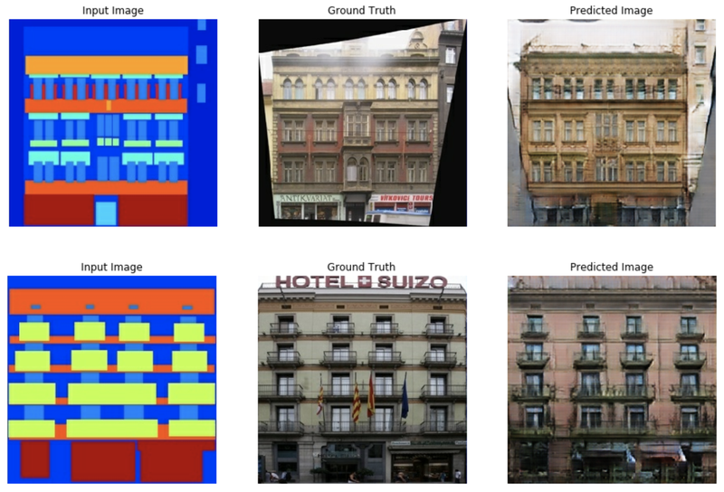
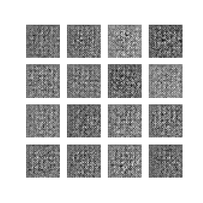

# AIFFEL_49일차 2020.10.05

Tags: AIFFEL_DAILY

### 일정


- [x]  LMS E-16
- [x]  영배스 준비

# [E-16]인공지능으로 세상에 없던 새로운 패션만들기


## **학습 목표**

---

- 생성 모델링 개념을 이해하며 판별 모델링과의 차이 알기
- Pix2Pix, CycleGAN 등의 이미지 관련 다양한 생성 모델링의 응용을 접하며 흥미 가지기
- Fashion MNIST 데이터셋의 의미를 알기
- 생성적 적대 신경망(GAN)의 구조와 원리를 이해하기
- 텐서플로우로 짠 DCGAN 학습 코드를 익히며 응용하기

## 생성 모델링 (Generative Modeling)

---

- **판별 모델(Discriminative Modeling)** : 입력된 데이터셋을 특정 기준에 따라 분류하거나, 특정 값을 맞추는 모델
- **생성 모델** : 학습한 데이터셋과 비슷하면서도 기존에는 없던 새로운 데이터셋을 생성하는 모델

### AWS의 DeepComposer 시연 영상

[https://www.youtube.com/watch?time_continue=9&v=XH2EbK9dQlg&feature=emb_logo&ab_channel=AmazonWebServices](https://www.youtube.com/watch?time_continue=9&v=XH2EbK9dQlg&feature=emb_logo&ab_channel=AmazonWebServices)

conncet the dots and take the next 'creative' step.

건축 부품, 안테나 디자인, 우주 탐사, 치아 보철물

generator, discriminator models

연주자, 지휘자

## 여러 가지 생성 모델링 기법과 친해지기

---

### Pix2Pix

Pix2Pix는 간단한 이미지를 입력할 경우 실제 사진처럼 보이도록 바꿔줄 때 많이 사용되는 모델입니다.



### CycleGAN

이 모델은 한 이미지와 다른 이미지를 번갈아가며 Cyclic하게 변환시킬 수 있습니다.

CycleGAN은 양방향으로의 이미지 변환이 가능합니다. 즉, 실사 이미지를 그림으로 바꾸는 것과 그림을 실사 이미지로 바꾸는 것 두 가지가 모두 가능한 거죠.


그림과 사진의 쌍으로 이루어진 데이터셋이 필요했던 Pix2Pix와 달리, CycleGAN은 쌍이 필요없습니다.

모델이 스스로 얼룩말과 말 데이터에서 각각의 스타일을 학습해서 새로운 이미지에 그 스타일을 입힐 수 있도록 설계되었기 때문이죠. 딥러닝에서 쌍으로 된 데이터(paired data)가 필요없다는 것은 데이터를 구하기 훨씬 쉽고, 라벨을 붙이는 주석(annotation) 비용이 필요없다는 것을 뜻하니, 굉장히 큰 장점이라고 할 수 있겠죠!

### Neural Style Transfer

전체 이미지의 구성을 유지하고 싶은 Base Image와 입히고 싶은 스타일이 담긴 Style Image 두 장을 활용해 새로운 이미지를 만들어 내는 것이죠.


Base Image의 건물, 강, 하늘과 같은 내용은 유지하면서, Style Image의 스타일이 잘 입혀진 것을 확인할 수 있습니다. 즉, Base Image에서는 Content(내용)만, 그리고 Style Image에서는 Style(스타일)만 추출해서 합친 결과물이죠.

## 패션을 디자인하려면? 먼저 패션을 배워야지!

---

[https://github.com/zalandoresearch/fashion-mnist](https://github.com/zalandoresearch/fashion-mnist)

In fact, MNIST is often the first dataset researchers try. "If it doesn't work on MNIST, it won't work at all", they said. "Well, if it does work on MNIST, it may still fail on others."


```python
plt.figure(figsize=(10, 5))

for i in range(10):
    plt.subplot(2, 5, i+1)
    plt.imshow(train_x[i].reshape(28, 28), cmap='gray')
    plt.title(f'index: {i}')
    plt.axis('off')
plt.show()

plt.figure(figsize=(10, 12))

for i in range(25):
    # [[YOUR CODE]]
    plt.subplot(5, 5, i+1)
    idx = np.random.randint(i,59999)
    plt.imshow(train_x[idx].reshape(28, 28), cmap='gray')
    plt.title(f'index: {idx}')
    plt.axis('off')

plt.show()
```

`Batch Size` 는 모델이 한 번에 학습할 데이터의 양입니다.

너무 많은 양을 한 번에 학습시키면 메모리 활용 면에서도 비효율적이고, 한 번 학습을 하는 데에도 오래 걸리므로 적절한 사이즈로 잘라서 학습을 진행합니다. 이러한 방식을 **미니배치 학습**이라고 합니다.

```python
train_dataset = tf.data.Dataset.from_tensor_slices(train_x).shuffle(BUFFER_SIZE).batch(BATCH_SIZE)
```

`tf.data.Dataset` 모듈의 `from_tensor_slices()` 함수를 사용하면 리스트, 넘파이, 또는 텐서플로우의 텐서 자료형에서 데이터셋을 만들 수 있습니다.

데이터가 잘 섞이게 하기 위해서는 버퍼 사이즈를 총 데이터 사이즈와 같거나 크게 설정하는 것이 좋습니다.

## 그림을 만들어내는 화가 생성자, 그리고 평가하는 비평가 판별자

---

### GAN 이해하기

- **`생성자(Generator)`**는 아무 의미 없는 랜덤 노이즈로부터 신경망에서의 연산을 통해 이미지 형상의 벡터를 생성해 냅니다. 즉, 무에서 유를 창조하는 것과 같은 역할을 합니다.
- **`판별자(Discriminator)`**는 기존에 있던 진짜 이미지와 생성자가 만들어낸 이미지를 입력받아 각 이미지가 Real인지, Fake인지에 대한 판단 정도를 실수값으로 출력합니다.

The generative model can be thought of as analogous to a team of counterfeiters, trying to produce fake currency and use it without detection, while the discriminative model is analogous to the police, trying to detect the counterfeit currency.
Competition in this game drives both teams to improve their methods until the counterfeits are indistiguishable from the genuine articles.


[https://openai.com/blog/generative-models/](https://openai.com/blog/generative-models/)

***DCGAN은 무엇을 입력 받아 무엇을 출력하나요?***

정규분포를 따르는 100개의 임의의 숫자, 이미지 출력

the goal is to find **a set of these parameters that make samples generated from random codes look like the training data.** Or to put it another way, we want the model distribution to match the true data distribution in the space of images.

### 생성자 구현하기

이후 발표된 수많은 GAN 기반 이미지 생성모델들은 대부분 DCGAN 모델을 발전시킨 형태라고 할 수 있으므로, 그 구조를 상세히 살펴보고 구현 연습을 해보는 것은 매우 의미있다고 생각됩니다.

```python
def make_generator_model():

    # Start
# 먼저 tf.keras.Sequential()로 모델을 시작한 후 레이어를 차곡차곡 쌓아줍니다.
    model = tf.keras.Sequential()

    # First: Dense layer
    model.add(layers.Dense(7*7*256, use_bias=False, input_shape=(100,)))
    model.add(layers.BatchNormalization())
    model.add(layers.LeakyReLU())

    # Second: Reshape layer
    model.add(layers.Reshape((7, 7, 256)))

# 여기에서 가장 중요한 레이어는 바로 Conv2DTranspose 레이어입니다.
# Conv2DTranspose 층은 일반적인 Conv2D와 반대로 이미지 사이즈를 넓혀주는 층입니다.
# 이 모델에서는 세 번의 Conv2DTranspose 층을 이용해
# (7, 7, 256) → (14, 14, 64) → (28, 28, 1) 순으로 이미지를 키워나갑니다.
    # Third: Conv2DTranspose layer
    model.add(layers.Conv2DTranspose(128, kernel_size=(5, 5), strides=(1, 1), padding='same', use_bias=False))
    model.add(layers.BatchNormalization())
    model.add(layers.LeakyReLU())

    # Fourth: Conv2DTranspose layer
    model.add(layers.Conv2DTranspose(64, kernel_size=(5, 5), strides=(2, 2), padding='same', use_bias=False))
    model.add(layers.BatchNormalization())
    model.add(layers.LeakyReLU())

    # Fifth: Conv2DTranspose layer
# 다만 마지막 층에는 활성화 함수로 tanh를 사용하는데,\
# 이는 우리가 -1 ~ 1 이내의 값으로 픽셀값을 정규화 시켰던 데이터셋과 동일하게 하기 위함입니다.
    model.add(layers.Conv2DTranspose(1, kernel_size=(5, 5), strides=(2, 2), padding='same', use_bias=False, \
                                     activation='tanh'))

    return model
```

***생성자의 입력 벡터는 어떤 형태입니까?***

(batch_size, 100)

***처음 입력된 벡터는 어떤 레이어를 지나며, 첫 레이어를 지난 후의 shape는 어떤 형태입니까?***

Dense Layer
(batch_size, 7**7**256)

⇒ batch_size 라는 부분을 간과했음. 모델에 batch 하나씩 들어올테니 그걸 고려해야함.

***첫 번째 레이어를 지난 후 벡터는 어떤 층을 지나게 됩니까? 이 레이어는 왜 필요합니까?***

Reshape Layer
이미지 형태로 복원하기 위해
이후의 Layer에서 Convolutional 연산을 할 수 있도록 1차원 벡터를 (7, 7, 256) 형상의 3차원 벡터로 변환시키는 작업입니다.

---

***[복습]Transposed convolutional layer***

[https://towardsdatascience.com/what-is-transposed-convolutional-layer-40e5e6e31c11](https://towardsdatascience.com/what-is-transposed-convolutional-layer-40e5e6e31c11)

Transposed convolutional layer on the other hand is usually carried out for upsampling i.e. to generate an output feature map which has a spatial dimension greater than that of the input feature map.


input feature map 픽셀 사이사이에 0을 집어넣고, 둘레에 zero padding을 더한다. 그리고 그 상태에서 convolution 진행

⇒ 즉, zero padding을 사이사이, 그리고 일반적으로 주변에 두르는 것.

---

텐서플로우 2.0 버전에서는 레이어와 모델에 call 메소드를 구현해 놓기 때문에, 방금 만들어진 생성자 모델에 입력값으로 노이즈를 넣고 바로 모델을 호출하면 간단히 결과 이미지가 생성됩니다 (***내부적으로는 생성자의 call 함수가 호출됩니다***).

```python
generated_image = generator(noise, training=False)
generated_image.shape

# => TensorShape([1, 28, 28, 1])
# 첫 번째 1은 1개(batch_size=1)라는 뜻을,
# 그 뒤로는 (28, 28, 1) 사이즈 이미지가 생성되었다는 뜻을 가집니다.
```

단, 지금은 학습하는 중이 아니니 training=False를 설정해 주어야 합니다!

***Batch Normalization 레이어는 훈련 시기와 추론(infernce) 시기의 행동이 다르기 때문에 training=False을 주어야 올바른 결과를 얻을 수 있습니다.***

```python
# 시각화해보면, 그냥 의미없는 노이즈임! (아직 학습을 안했으니)
plt.imshow(generated_image[0, :, :, 0], cmap='gray')
plt.colorbar()
plt.show()plt.imshow(generated_image[0, :, :, 0], cmap='gray')
plt.colorbar()
plt.show()
```

### 판별자 구현하기

판별자는 앞서 알아봤듯 가짜 이미지와 진짜 이미지를 입력받으면 각 이미지 별로 '***진짜라고 판단하는 정도'***값을 출력해야 합니다.

```python
def make_discriminator_model():

    # Start
    model = tf.keras.Sequential()
# 첫 번째 Conv2D 층에서 입력된 [28, 28, 1] 사이즈의 이미지는 다음 층을 거치며
# (28, 28, 1) → (14, 14, 64) → (7, 7, 128)까지 줄어들게 됩니다.
    # First: Conv2D Layer
    model.add(layers.Conv2D(64, (5, 5), strides=(2, 2), padding='same', input_shape=[28, 28, 1]))
    model.add(layers.LeakyReLU())
    model.add(layers.Dropout(0.3))

    # Second: Conv2D Layer
    model.add(layers.Conv2D(128, (5, 5), strides=(2, 2), padding='same'))
    model.add(layers.LeakyReLU())
    model.add(layers.Dropout(0.3))

# 마지막에는 Flatten 층을 사용해 3차원 이미지를 1차원으로 쭉 펴서
# 7x7x128=6272, 즉 (1, 6272) 형상의 벡터로 변환합니다.
    # Third: Flatten Layer
    model.add(layers.Flatten())

# 1차원 벡터로 변환한 후에는 마지막 Dense Layer를 거쳐 단 하나의 값을 출력하게 됩니다.
    # Fourth: Dense Layer
    model.add(layers.Dense(1))

    return model
```

## 생성 모델이 똑똑해지기 위한 기나긴 여정

---

이제 생성자와 판별자 두 가지 네트워크가 모두 준비되었으니 모델을 학습시키는 일만 남았습니다.

### 손실함수

판별자는 한 개의 이미지가 가짜인지 진짜인지 나타내는 2개 클래스 간 분류 문제를 풀어야 하므로, 이진 교차 엔트로피(binary cross entropy)를 사용할 것입니다.

- 생성자: 판별자가 Fake Image에 대해 판별한 값, 즉 **`D(fake_image)`** 값이 **`1`**에 가까워지는 것
- 판별자: Real Image 판별값, 즉 **`D(real_image)`**는 **`1`**에, Fake Image 판별값, 즉 **`D(fake_image)`**는 **`0`**에 가까워지는 것

⇒ 결***국 생성자든 판별자든, 결국 손실함수에 들어가는 값은 모두 판별자의 판별값***

판별자 모델의 맨 마지막 Layer에는 값을 정규화 시키는 sigmoid나 tanh 함수와 같은 활성화 함수가 없었습니다. 즉, ***판별자가 출력하는 값은 범위가 정해지지 않아 모든 실수값을 가질 수 있죠.***

그런데 `tf.keras.losses`의 `BinaryCrossEntropy` 클래스는 기본적으로 본인에게 들어오는 인풋값이 0-1 사이에 분포하는 확률값이라고 가정합니다

따라서 `from_logits`를 `True`로 설정해 주어야 `BinaryCrossEntropy`에 입력된 값을 함수 내부에서 sigmoid 함수를 사용해 0~1 사이의 값으로 정규화 한 후 알맞게 계산할 수 있습니다.

그럼, 이제 **`cross_entropy`**를 활용해 계산할 loss들은 **`fake_output`**와 **`real_output`**, 두 가지를 활용합니다.

- **`fake_output`** : 생성자가 생성한 Fake Image를 구분자에 입력시켜서 판별된 값, 즉 **`D(fake_image)`**
- **`real_output`** : 기존에 있던 Real Image를 구분자에 입력시켜서 판별된 값, 즉 **`D(real_image)`**

`tf.ones_like()` , `tf.zeros_like()` 를 활용하여 fake_output 과 real_output을 각각 1, 0에 비교

```python
vector = [[1, 2, 3],
          [4, 5, 6]]

tf.ones_like(vector)

=> 
#<tf.Tensor: shape=(2, 3), dtype=int32, numpy=
# array([[1, 1, 1],
#       [1, 1, 1]], dtype=int32)>
```

**generator_loss**

```python
# 생성자는 fake_output이 1에 가까워지기를 원함. 
# 아래와 같은 코드는 fake_output 값이 1에 가까울수록 작은 값을 산출하도록 하는 것!
def generator_loss(fake_output):
    return cross_entropy(tf.ones_like(fake_output), fake_output)
```

**discriminator_loss**

```python
# 판별자는 fake_output 은 0 , real_output 은 1 에 가까워지기를 원하기 때문에, 둘 다 계산
def discriminator_loss(real_output, fake_output):
    real_loss = cross_entropy(tf.ones_like(real_output), real_output)
    fake_loss = cross_entropy(tf.zeros_like(fake_output), fake_output)
    total_loss = real_loss + fake_loss
    return total_loss
```

**discriminator accuracy**

한편, 판별자가 real output, fake output을 얼마나 정확히 판별하는지의 accuracy를 계산해 보는 것도 GAN의 학습에서 매우 중요합니다. 특히 두 accuracy를 따로 계산해서 비교해 보는 것이 매우 유용합니다.

만약 판별자가 real output과 fake output을 accuracy가 1.0에 가까울 정도로 정확하게 판별해 낸다면 좋은 것일까요? 그렇지 않습니다. 이 경우 생성자가 만들어내는 fake output이 real output과 차이가 많이 나기 때문에 판별자가 매우 쉽게 판별해 내고 있다는 뜻입니다.

그래서, real accuracy와 fake accuracy는 초반에는 1.0에 가깝게 나오다가, 서서히 낮아져서 둘 다 0.5에 가까워지는 것이 이상적입니다. **fake accuracy가 1.0에 더 가깝다면 아직은 생성자가 판별자를 충분히 잘 속이지 못하고 있다는 뜻입니다.**

```python
def discriminator_accuracy(real_output, fake_output):
    real_accuracy = tf.reduce_mean(tf.cast(tf.math.greater_equal(real_output, tf.constant([0.5])), tf.float32))
    fake_accuracy = tf.reduce_mean(tf.cast(tf.math.less(fake_output, tf.constant([0.5])), tf.float32))
    return real_accuracy, fake_accuracy
```

ex.) real_output = tf.Tensor([0.2, 0.4, 0.7, 0.9]) 라면,

- (1) tf.math.greater_equal(real_output, tf.constant([0.5]) : real_output의 각 원소가 0.5 이상인지 True, False로 판별
    - **`>> tf.Tensor([False, False, True, True])`**
- (2) tf.cast( (1), tf.float32) : (1)의 결과가 True이면 1.0, False이면 0.0으로 변환
    - **`>> tf.Tensor([0.0, 0.0, 1.0, 1.0])`**
- (3) tf.reduce_mean( (2)) : (2)의 결과를 평균내어 이번 배치의 정확도(accuracy)를 계산
    - **`>> 0.5`**

### 최적화 함수

중요한 점 한 가지는 생성자와 구분자는 따로따로 학습을 진행하는 개별 네트워크이기 때문에 optimizer를 따로 만들어주어야 한다는 점입니다.

생성자가 생성한 샘플을 확인할 것입니다.

샘플은 한 번에 16장을 생성하도록 하겠습니다.생성할 샘플은 매번 같은 노이즈로 생성해야 그에 대한 진전 과정을 확인할 수 있으므로, **고정된 seed 노이즈**를 만들어두어야 합니다.즉, 100차원의 노이즈를 총 16개, **`(16, 100)`** 형상의 벡터를 만들어 두도록 하겠습니다.

```python
noise_dim = 100
num_examples_to_generate = 16

seed = tf.random.normal([num_examples_to_generate, noise_dim])
seed.shape
```

### 훈련과정 설계

`@tf.funtion`

⇒ Compiles a function into a callable TensorFlow graph

`@tf.function` 데코레이터가 사용된 함수에 입력된 입력은 Tensorflow의 graph 노드가 될 수 있는 타입으로 자동변환됩니다. 알아두면 향후 Tensorflow 모델 구현에 매우 편리하게 사용할 수 있을 것 같습니다.

```python
@tf.function
def train_step(images):  #(1) 입력데이터
    noise = tf.random.normal([BATCH_SIZE, noise_dim])  #(2) 생성자 입력 노이즈

    with tf.GradientTape() as gen_tape, tf.GradientTape() as disc_tape:  #(3) tf.GradientTape() 오픈
        generated_images = generator(noise, training=True)  #(4) generated_images 생성

        #(5) discriminator 판별
        real_output = discriminator(images, training=True)
        fake_output = discriminator(generated_images, training=True)

        #(6) loss 계산
        gen_loss = generator_loss(fake_output)
        disc_loss = discriminator_loss(real_output, fake_output)

        #(7) accuracy 계산
        real_accuracy, fake_accuracy = discriminator_accuracy(real_output, fake_output) 
    
    #(8) gradient 계산
    gradients_of_generator = gen_tape.gradient(gen_loss, generator.trainable_variables)
    gradients_of_discriminator = disc_tape.gradient(disc_loss, discriminator.trainable_variables)

    #(9) 모델 학습
    generator_optimizer.apply_gradients(zip(gradients_of_generator, generator.trainable_variables))
    discriminator_optimizer.apply_gradients(zip(gradients_of_discriminator, discriminator.trainable_variables))

    return gen_loss, disc_loss, real_accuracy, fake_accuracy  #(10) 리턴값
```

- (1) 입력데이터: Real Image 역할을 할 **`images`** 한 세트를 입력으로 받음
- (2) 생성자 입력 노이즈 : generator가 FAKE IMAGE를 생성하기 위한 **`noise`**를 **`images`** 한 세트와 같은 크기인 **`BATCH_SIZE`** 만큼 생성함
- (3) **`tf.GradientTape()`**는 가중치 갱신을 위한 Gradient를 자동미분으로 계산하기 위해 **`with`** 구문 열기
- (4) generated_images 생성 : generator가 **`noise`**를 입력받은 후 **`generated_images`** 생성
- (5) discriminator 판별 : discriminator가 Real Image인 **`images`**와 Fake Image인 **`generated_images`**를 각각 입력받은 후 **`real_output`**, **`fake_output`** 출력
- (6) loss 계산 : **`fake_output`**, **`real_output`**으로 generator와 discriminator 각각의 loss 계산
- (7) accuracy 계산 : **`fake_output`**, **`real_output`**으로 discriminator가 정확히 맞추는 정도 계산
- (8) gradient 계산 : **`gen_tape`**와 **`disc_tape`**를 활용해 gradient를 자동으로 계산
- (9) 모델 학습 : 계산된 gradient를 optimizer에 입력해 가중치 갱신
- (10) 리턴값 : 이번 스텝에 계산된 loss와 accuracy를 리턴

```python
def generate_and_save_images(model, epoch, it, sample_seeds):

    predictions = model(sample_seeds, training=False)

    fig = plt.figure(figsize=(4, 4))
    for i in range(predictions.shape[0]):
        plt.subplot(4, 4, i+1)
        plt.imshow(predictions[i, :, :, 0], cmap='gray')
        plt.axis('off')

    plt.savefig('{}/aiffel/dcgan_newimage/fashion/generated_samples/sample_epoch_{:04d}_iter_{:03d}.png'
                    .format(os.getenv('HOME'), epoch, it))

    plt.show()
```

⇒ 고정된 seed에 대한 결과물이 얼마나 나아지고 있는지 확인 가능한 샘플 생성 함수

학습과정을 체크하기 위해 시각화해 보아야 할 중요한 것으로 loss와 accuracy 그래프를 빼놓을 수 없겠습니다.

```python
from matplotlib.pylab import rcParams
rcParams['figure.figsize'] = 15, 6    # matlab 차트의 기본 크기를 15,6으로 지정해 줍니다.

def draw_train_history(history, epoch):
    # summarize history for loss  
    plt.subplot(211)  
    plt.plot(history['gen_loss'])  
    plt.plot(history['disc_loss'])  
    plt.title('model loss')  
    plt.ylabel('loss')  
    plt.xlabel('batch iters')  
    plt.legend(['gen_loss', 'disc_loss'], loc='upper left')  

    # summarize history for accuracy  
    plt.subplot(212)  
    plt.plot(history['fake_accuracy'])  
    plt.plot(history['real_accuracy'])  
    plt.title('discriminator accuracy')  
    plt.ylabel('accuracy')  
    plt.xlabel('batch iters')  
    plt.legend(['fake_accuracy', 'real_accuracy'], loc='upper left')  
    
    # training_history 디렉토리에 epoch별로 그래프를 이미지 파일로 저장합니다.
    plt.savefig('{}/aiffel/dcgan_newimage/fashion/training_history/train_history_{:04d}.png'
                    .format(os.getenv('HOME'), epoch))
    plt.show()
```

***[중요] 다음은 정기적으로 모델을 저장하기 위한 checkpoint를 만들어줍니다.***

`tf.train.Checkpoint`를 활용하면 매번 모델을 직접 저장해주지 않아도, 코드 한 줄로 빠르고 편하게 버전 관리를 할 수 있습니다.

모델이 복잡해지고 학습 속도가 오래 걸릴수록, 모델에 대한 저장 및 버전 관리는 필수적입니다. 아주 오랜 시간동안 학습을 시켰는데 네트워크가 끊긴다거나, 예상치 못한 문제로 인해 모델을 잃어버린다면 그보다 끔찍한 일은 없을 테니까요..!

checkpoint에는 optimizer와 생성자, 구분자를 모두 넣어 저장합니다. 정확히는 생성자와 구분자가 학습한 모델 가중치를 저장하는 것이죠. 게임의 체크포인트처럼 우리의 학습 환경과 학습한 내용을 저장해 둡니다.

```python
checkpoint_dir = os.getenv('HOME')+'/aiffel/dcgan_newimage/fashion/training_checkpoints'

checkpoint_prefix = os.path.join(checkpoint_dir, "ckpt")
checkpoint = tf.train.Checkpoint(generator_optimizer=generator_optimizer,
                                 discriminator_optimizer=discriminator_optimizer,
                                 generator=generator,
                                 discriminator=discriminator)
```

### 학습 시키기

```python
def train(dataset, epochs, save_every):
    start = time.time()
# 훈련 히스토리 기록
    history = {'gen_loss':[], 'disc_loss':[], 'real_accuracy':[], 'fake_accuracy':[]}

    for epoch in range(epochs):
        epoch_start = time.time()
        for it, image_batch in enumerate(dataset):
            gen_loss, disc_loss, real_accuracy, fake_accuracy = train_step(image_batch)
            history['gen_loss'].append(gen_loss)
            history['disc_loss'].append(disc_loss)
            history['real_accuracy'].append(real_accuracy)
            history['fake_accuracy'].append(fake_accuracy)

            if it % 50 == 0:
                display.clear_output(wait=True)
                generate_and_save_images(generator, epoch+1, it+1, seed)
                print('Epoch {} | iter {}'.format(epoch+1, it+1))
                print('Time for epoch {} : {} sec'.format(epoch+1, int(time.time()-epoch_start)))

        if (epoch + 1) % save_every == 0:
# 위에서 생성한 checkpoint 객체 활용
            checkpoint.save(file_prefix=checkpoint_prefix)

        display.clear_output(wait=True)
        generate_and_save_images(generator, epochs, it, seed)
        print('Time for training : {} sec'.format(int(time.time()-start)))

        draw_train_history(history, epoch)
```

지금까지 한 단계를 학습하는 `train_step`, 샘플 이미지를 생성하고 저장하기 위한 `generate_and_save_images`(), 학습과정을 시각화하는 `draw_train_history`(), 그리고 모델까지 저장하기 위한 `checkpoint`까지 모두 준비가 되었으니 이것들을 한 곳에 합치기만 하면 됩니다.

***학습과정 시각화***

```python
anim_file = os.getenv('HOME')+'/aiffel/dcgan_newimage/fashion/fashion_mnist_dcgan.gif'

with imageio.get_writer(anim_file, mode='I') as writer:
    filenames = glob.glob('{}/aiffel/dcgan_newimage/fashion/generated_samples/sample*.png'.format(os.getenv('HOME')))
    filenames = sorted(filenames)
    last = -1
    for i, filename in enumerate(filenames):
        frame = 2*(i**0.5)
        if round(frame) > round(last):
            last = frame
        else:
            continue
        image = imageio.imread(filename)
        writer.append_data(image)
    image = imageio.imread(filename)
    writer.append_data(image)

!ls -l ~/aiffel/dcgan_newimage/fashion/fashion_mnist_dcgan.gif
```



## 프로젝트: CIFAR-10 이미지 생성하기

---

GAN을 학습하는 과정은 보기보다 까다롭습니다. 모델 구조, learning_rate, 파라미터 초기화, 생성자와 판별자의 경쟁관계, 데이터의 특성 등 고려해야 할 것이 참 많습니다.

[https://github.com/bluecandle/2020_AIFFEL/blob/master/daily_notes/exploration_codes/e16_code/E16.ipynb](https://github.com/bluecandle/2020_AIFFEL/blob/master/daily_notes/exploration_codes/e16_code/E16.ipynb)

# 영배스 준비 : 보이저엑스(voyagerx)


[영배스2: 보이저엑스(voyagerx)](https://www.notion.so/2-voyagerx-d789b1701ebe4129a4f89c777b4732cc)