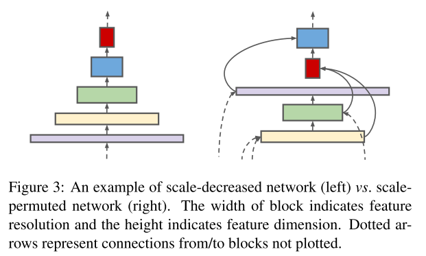

# AIFFEL_51일차 2020.10.07

Tags: AIFFEL_DAILY

### 일정


- [x]  GD lec1 마무리 (마지막 논문 탐색 및 정리 부분)
- [x]  GD lec1 마무리한 내용 토대로 연구계획서 보강
- [x]  LMS E-17

# Going Deeper Lecture1


논문 찾아서 읽고 정리.

paperswithcode 에서 찾은 상단에 위치한 논문들

### Object Detection

- CSPNet ⇒ CSPNet: A new backbone that can enhance learning capability of CNN
- SpineNet ⇒ Rethinking Pre-training and Self-training

### Semantic Segmentation

- HRNet-OCR ⇒ HIERARCHICAL MULTI-SCALE ATTENTION FOR SEMANTIC SEGMENTATION
- EfficientNet-L2 ⇒ Rethinking Pre-training and Self-training

이 중에서, CSPNET, SpineNet에 관한 원래 논문, HRNet에 관한 원래 논문을 읽어봐야겠다

[CSPNET: A NEW BACKBONE THAT CAN ENHANCE LEARNING.pdf](images/CSPNET_A_NEW_BACKBONE_THAT_CAN_ENHANCE_LEARNING.pdf)

[SpineNet: Learning Scale-Permuted Backbone for Recognition and Localization.pdf](images/SpineNet_Learning_Scale-Permuted_Backbone_for_Recognition_and_Localization.pdf)

[HRNet:Deep High-Resolution Representation Learning.pdf](images/HRNetDeep_High-Resolution_Representation_Learning.pdf)

각각을 두 줄로 요약해보자 (해결하고자 하는 것, 적용한 방법)

### CSPNet

해결하고자 하는 것 : 신경망 학습을 위해 많은 컴퓨팅 자원이 필요해왔음. 따라서, 해당 조건을 충분히 갖추지 못한 사람들이 어려움을 겪는 것을 해결하고자 한다.

적용한 방법 : 네트워크 최적화 과정에서 중복되는 가중치 정보가 문제라고 생각함. 네트워크 시작과 끝에서 feature map 을 통합하여 가중치의 가변성을 'respect'한다. 반영한다는 그런 의미인가?

효과 : 그렇게 하다보니 ImageNet 데이터에 대해서 동일하거나 더 높은 정확도를 보여주면서도 연산을 20%가량 줄일 수 있었다고 함. 그리고 MS COCO object detection 데이터셋에서는 SOTA의  $AP_{50}$ 점수를 상당한 수준으로 상회하기까지 했다. 

### SpineNet

해결하고자 하는 것: scale-decreased model 이 classification에는 좋을지 몰라도, simultaneous recognition, and localization 을 위해 '좋은' backbone architecture 이 아니라고 생각. spatial information 이 사라지니까!

적용한 방법: 그래서, scale-permuted model 라는 meta-architecture 제안. 1) feature map 의 scale이 언제든 증가하거나 감소할 수 있도록 ⇒ spatial information 을 다시 획득 2) feature map 사이 연결이 feature scales 를 'go across' 하여 multi-scale feature fusion 을 가능하도록 한다. 여기서 go across 는 말 그대로 건너간다는 의미인듯?



### HRNet

해결하고자 하는 것: high-resolution representation 이 semantic segmentation, object detection 처럼 position 이 중요한 작업에서 필요하다. 근데 , 기존 SOTA는 low-resolution output 에서 high-resolution으로 recover 하는 것에 집중하였는데, 우리는 다른 방법을 제시하고자 한다.

적용한 방법 : high-resolution representation을 전체 과정동안 유지하도록 한다. high-resolution convolution stream 에서 시작하여, 점진적으로 high-to-low resolution convolution stream 을 하나씩 더한다. 그리고 multi-resolution stream을 병렬로 연결한다.

# [E-17]문자를 읽을 수 있는 딥러닝


***OCR(Optical Character Recognition, 광학 문자 인식)***

[https://blog.naver.com/kpostbank/221343765011](https://blog.naver.com/kpostbank/221343765011)

컨테이너에 기재된 일련번호를 OCR로 읽어내는 이른바 ‘스마트선박’시대가 열린 것이다.

## 학**습목표**

---

1. OCR의 과정을 이해합니다.
2. 문자 인식결과의 표현방식을 이해합니다.
3. 파이썬을 통해 OCR을 사용할 수 있습니다.

## 기계가 읽을 수 있나요?

---

문자의 존재를 1)Detection 어떤 문자인지 판독하는 2)Recognition 으로 나눌 수 있을 것입니다.

### Google Vision API

```python
def detect_text(path):
    """Detects text in the file."""
    from google.cloud import vision
    import io
    client = vision.ImageAnnotatorClient()

    with io.open(path, 'rb') as image_file:
        content = image_file.read()
        
    image = vision.Image(content=content)

    response = client.text_detection(image=image)
    texts = response.text_annotations
    print('Texts:')

    for text in texts:
       print('\n"{}"'.format(text.description))

    vertices = (['({},{})'.format(vertex.x, vertex.y)
                 for vertex in text.bounding_poly.vertices])

    print('bounds: {}'.format(','.join(vertices)))

    if response.error.message:
        raise Exception(
            '{}\nFor more info on error messages, check: '
            'https://cloud.google.com/apis/design/errors'.format(
                response.error.message))

# 다운받은 인증키 경로가 정확하게 지정되어 있어야 합니다. 
!ls -l $GOOGLE_APPLICATION_CREDENTIALS
import os
# 입력 이미지 경로를 지정해 주세요.
# [[YOUR IMAGE FILE PATH]]   ex.) '~/aiffel/ocr_python/test_image.png'
path =os.getenv('HOME')+'/aiffel/ocr_python/test_image.jpg'
# 위에서 정의한 OCR API 이용 함수를 호출해 봅시다.
detect_text(path)
```

## 어떤 과정으로 읽을까요?

---

구글 API가 이미지에 박스를 친 다음 박스별 텍스트의 내용을 알려준 것처럼, 문자 모델은 보통 두 단계로 이뤄집니다. 먼저 입력받은 사진 속에서 문자의 위치를 찾아냅니다.

1. 문자 검출 : 입력받은 사진 속에서 문자의 위치를 찾아낸다
2. 문자 인식 : 찾은 문자 영역으로부터 문자를 읽어낸다.

문자의 영역을 표현하는 방법으로 사각형의 네 꼭지점 좌표를 알려주는 방법의 예시


사각형 말고도 다른 도형이나 표현 방법을 사용할 수도 있을 것임!

[예시들]

Axis-aligned bounding box
oriented bounding box
quadrangles
text polygons
pixel mask

## 딥러닝 문자인식의 시작

---

LeNet 같은 단순한 분류 모델로는 복잡한 결과를 얻을 수 없다!

넓고 복잡한 이미지에서 글자 영역을 찾을 수 없을 뿐더러, 글자를 영역별로 잘라서 넣더라도 우리가 인식하기를 원하는 사진은 여러 글자가 모여있기 때문에 단순한 분류 문제로 표현이 불가능하지요.

### 모델 강건성 _ Model Robustness to Noise

왜곡된 input이 들어오더라도 원하는 결과를 도출해낼 수 있는 모델이 robust 하다고 볼 수 있다.

애초에 모델을 학습할 때, 학습 데이터셋에 noise를 추가하여 model의 robustness를 증진시킬 수 있지 않을까? 모델이 바라보는 세상의 지평을 넓혀주는것.

## 사진 속 문자 찾아내기 - Detection

---

이미지 속에서 물체를 찾아내는 딥러닝 모델을 문자를 찾도록 학습을 시킨 것이지요.

Object Detection : 객체 검출이라고 번역하셨군. (아래 참고자료에서는 객체 탐지)

### 회귀(regression) 방식과 세그멘테이션(segmentation) 방식이 있다.

**회귀 방식**은 기준으로 하는 박스에 대비 **문자의 박스가 얼마나 차이**가 나는지를 학습합니다.

세그멘테이션 방식은 픽셀단위로 **해당 픽셀이 문자를 표현하는지를 분류하는 문제(pixel-wise classification)**로 푼다고 볼 수 있습니다.

참고자료 : [https://blogs.sas.com/content/saskorea/2018/12/21/딥러닝을-활용한-객체-탐지-알고리즘-이해하기/](https://blogs.sas.com/content/saskorea/2018/12/21/%EB%94%A5%EB%9F%AC%EB%8B%9D%EC%9D%84-%ED%99%9C%EC%9A%A9%ED%95%9C-%EA%B0%9D%EC%B2%B4-%ED%83%90%EC%A7%80-%EC%95%8C%EA%B3%A0%EB%A6%AC%EC%A6%98-%EC%9D%B4%ED%95%B4%ED%95%98%EA%B8%B0/)

- 일반적인 객체는 물체에 따라서 크기가 일정한 특징을 가집니다. 하지만 문자는 영역과 배치가 자유로워 문자를 검출하기 위한 설정이 필요합니다.
- 또한 객체는 물체간 거리가 충분히 확보되는데에 반해 글자는 매우 촘촘하게 배치되어 있습니다.

## 사진 속 문자 읽어내기 - Recognition

---

문자 인식 모델은 이렇게 작게 잘린 이미지가 들어오면 이미지 속에 어떤 단어가 포함됐는지 찾아내지요.

사실 이 과정은 이미지 문제보다는 자연어처리에서 많은 영감을 받았습니다.

이미지 내의 문자 인식 모델의 기본적인 방법 중 하나가 바로 CNN과 RNN을 결합한 CRNN 모델입니다

이미지 내의 **(a)텍스트와 연관된 특징**을 **(1)CNN을 통해 추출**한 후에 **(b)스텝 단위의 문자 정보**를 **(2)RNN**으로 인식하는 것이지요.


글자읽는 AI: 밑바닥부터 외국어 정복까지

[https://tv.naver.com/v/4578167](https://tv.naver.com/v/4578167)

글자 찾기 , 글자 인식 = OCR

OCR 정복을...  만 6개월만에?!

네이버 핵심 공통 기술 ⇒ Papago, smartLens, Remember 서비스에서도 OCR 사용중

그리고 네이버 내부적으로도 신분증, 상버자 등록증, 영수증 등을 인식해달라는 요구가 많았다.

tesseract.js 로 단어들 찾아보라고 하니... 못찾았는데! 개발한 딥러닝 모델로 해보니 잘 인식하더라.

일본어와 영어를 동시에 파악! 신기하다


사진 속 글자 읽기, OCR (Optical character recognition)

[https://www.youtube.com/watch?v=ckRFBl_XWFg&ab_channel=TerryTaeWoongUm](https://www.youtube.com/watch?v=ckRFBl_XWFg&ab_channel=TerryTaeWoongUm)

***OCR 정복 1단계: 기술 트렌드 파악***

딥러닝이 급격한 성능 향상을 보이는 것을 파악하고, 논문 스터디 시작.

82편의 논문을 최대 2슬라이드로 빠른 요약

36편의 논문을 최대 10슬라이드로 세부 리뷰

1) 기술 분류 : 글자 찾기

글자 영역 표현 방법에도 여러가지 있더라! 직사각형, 틀어진 직사각형, 그냥 사각형, 폴리곤, 마스크.

## Keras-OCR 써보기

---

`keras_ocr.pipeline.Pipeline()` 는 인식을 위한 파이프라인을 생성하는데 이때 초기화 과정에서 미리 학습된 모델의 가중치(weight)를 불러오게 됩니다. 검출기와 인식기를 위한 가중치 하나씩을 불러오겠지요.

```python
import matplotlib.pyplot as plt
import keras_ocr

# keras-ocr이 detector과 recognizer를 위한 모델을 자동으로 다운로드받게 됩니다. 
pipeline = keras_ocr.pipeline.Pipeline()

# 테스트에 사용할 이미지 url을 모아 봅니다. 추가로 더 모아볼 수도 있습니다. 
image_urls = [
        'https://upload.wikimedia.org/wikipedia/commons/b/bd/Army_Reserves_Recruitment_Banner_MOD_45156284.jpg',
        'https://upload.wikimedia.org/wikipedia/commons/e/e8/FseeG2QeLXo.jpg',
        'https://upload.wikimedia.org/wikipedia/commons/b/b4/EUBanana-500x112.jpg'
    ]

images = [ keras_ocr.tools.read(url) for url in image_urls]
prediction_groups = [pipeline.recognize([url]) for url in image_urls]

# 인식 결과 시각화
# Plot the predictions
fig, axs = plt.subplots(nrows=len(images), figsize=(20, 20))
for idx, ax in enumerate(axs):
    keras_ocr.tools.drawAnnotations(image=images[idx], 
                                    predictions=prediction_groups[idx][0], ax=ax)
```

⇒ recognize() : 검출기와 인식기를 두고, 검출기로 bounding box(문자가 있는 영역) 검출, 인식기가 각 박스로부터 문자를 인식.

참고 : [https://github.com/faustomorales/keras-ocr/blob/master/keras_ocr/pipeline.py](https://github.com/faustomorales/keras-ocr/blob/master/keras_ocr/pipeline.py)

## 테서랙트 써보기

---

테서랙트는 구글에서 후원하는 OCR 오픈소스 라이브러리로 현재는 버전 4와 Tessearct.js등으로 확장되는 등 많은 곳에서 사용되고 있습니다.

테서랙트를 사용하면 한 번에 이미지 내의 문자 검출과 인식을 할 수 있다.

```python
import os
import pytesseract
from PIL import Image
from pytesseract import Output
import matplotlib.pyplot as plt

# OCR Engine modes(–oem):
# 0 - Legacy engine only.
# 1 - Neural nets LSTM engine only.
# 2 - Legacy + LSTM engines.
# 3 - Default, based on what is available.

# Page segmentation modes(–psm):
# 0 - Orientation and script detection (OSD) only.
# 1 - Automatic page segmentation with OSD.
# 2 - Automatic page segmentation, but no OSD, or OCR.
# 3 - Fully automatic page segmentation, but no OSD. (Default)
# 4 - Assume a single column of text of variable sizes.
# 5 - Assume a single uniform block of vertically aligned text.
# 6 - Assume a single uniform block of text.
# 7 - Treat the image as a single text line.
# 8 - Treat the image as a single word.
# 9 - Treat the image as a single word in a circle.
# 10 - Treat the image as a single character.
# 11 - Sparse text. Find as much text as possible in no particular order.
# 12 - Sparse text with OSD.
# 13 - Raw line. Treat the image as a single text line, bypassing hacks that are Tesseract-specific.

def crop_word_regions(image_path='./images/sample.png', output_path='./output'):
    if not os.path.exists(output_path):
        os.mkdir(output_path)
    custom_oem_psm_config = r'--oem 3 --psm 3'
    image = Image.open(image_path)

# pytesseract 의 Output 을 사용해서 결과값의 형식을 딕셔너리(DICT) 형식으로 설정해주게 됩니다.
    recognized_data = pytesseract.image_to_data(
        image, lang='eng',    # 한국어라면 lang='kor'
        config=custom_oem_psm_config,
        output_type=Output.DICT
    )
    
    top_level = max(recognized_data['level'])
    index = 0
    cropped_image_path_list = []
    for i in range(len(recognized_data['level'])):
        level = recognized_data['level'][i]
    
        if level == top_level:
            left = recognized_data['left'][i]
            top = recognized_data['top'][i]
            width = recognized_data['width'][i]
            height = recognized_data['height'][i]
            
            output_img_path = os.path.join(output_path, f"{str(index).zfill(4)}.png")
            print(output_img_path)
            cropped_image = image.crop((
                left,
                top,
                left+width,
                top+height
            ))
            cropped_image.save(output_img_path)
            cropped_image_path_list.append(output_img_path)
            index += 1
    return cropped_image_path_list

work_dir = os.getenv('HOME')+'/aiffel/ocr_python'
img_file_path = work_dir + '/test_image.jpg'   #테스트용 이미지 경로입니다. 본인이 선택한 파일명으로 바꿔주세요. 

cropped_image_path_list = crop_word_regions(img_file_path, work_dir)
```

⇒ 테스트 이미지를 받아서, 문자 검출을 진행한 후, 검출된 문자 영역을 crop한 이미지로 만들어 그 파일들의 list를 리턴하는 함수.

위에서 영어말고 한국어 사용하려면 언어팩 설치해야함.

```python
sudo apt install tesseract-ocr-kor
```

위 코드로 자른 이미지에서 단어 인식하기

```python
def recognize_images(cropped_image_path_list):
    custom_oem_psm_config = r'--oem 3 --psm 7'
    
    for image_path in cropped_image_path_list:
        image = Image.open(image_path)
        recognized_data = pytesseract.image_to_string(
            image, lang='eng',    # 한국어라면 lang='kor'
            config=custom_oem_psm_config,
            output_type=Output.DICT
        )
        print(recognized_data['text'])
    print("Done")

# 위에서 준비한 문자 영역 파일들을 인식하여 얻어진 텍스트를 출력합니다.
recognize_images(cropped_image_path_list)
```

⇒ 인식 결과가...좀 부실하다.

## 프로젝트: 다양한 OCR 모델 비교하기

---

OCR 기술들이 실용적인 수준까지 꽤 발전했지만 그럼에도 불구하고 아직 완전한 수준은 아닙니다. 용도에 맞게 적절한 것을 선택하는 것도 중요한 일입니다.

여러분은 OCR 기능을 활용한 서비스를 **빠르게** 개발해야 하는 임무를 맡은 엔지니어가 되어, ***어떤 모듈을 도입하면 좋을지 기술검증을 하는 역할***을 맡게 되었다고 가정합니다.

⇒ 있을만한 상황이지 ㅇㅇ

결과물 : [https://github.com/bluecandle/2020_AIFFEL/blob/master/daily_notes/exploration_codes/e17_code/E17.ipynb](https://github.com/bluecandle/2020_AIFFEL/blob/master/daily_notes/exploration_codes/e17_code/E17.ipynb)