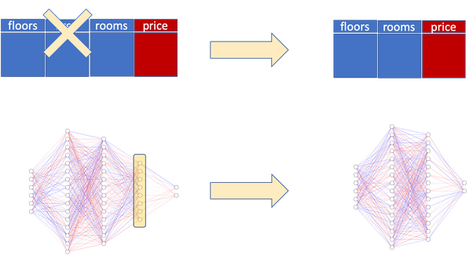

# AIFFEL_52일차 2020.10.08

Tags: AIFFEL_DAILY

### 일정


- [x]  LMS E-17 마무리
- [x]  보이저엑스 강연 듣기
- [x]  GD Proj1

# LMS E-17 마무리


[https://github.com/bluecandle/2020_AIFFEL/blob/master/daily_notes/exploration_codes/e17_code/E17.ipynb](https://github.com/bluecandle/2020_AIFFEL/blob/master/daily_notes/exploration_codes/e17_code/E17.ipynb)

# 보이저엑스 강연

2020.10.08 1500-1600 남세동 대표님


딥러닝을 통해서 해결이 가능해진 문제를 대상으로 삼고 프로젝트를 진행한다.

***Vrew***

기존 고착화되어있는 동영상 편집 방법을 갖춘 제품(오븐) 을 핵심 기능만 간추린 제품으로 (에어프라이어)

동영상 편집을 하는데 프레임당 편집을 하는건... 웹 개발을 하는데 어셈블리로 개발을 하는 것과 같은 것 아니냐는 비유가 인상깊었다.

굳이 프레임단위 편집을 할 필요가 없는 대부분의 영상들에게 유용하게 쓰일 수 있는 제품인듯!

***vFlat***

구부러져있는 책을 스캔한다는 점이 차별점!

- 학습에 사용할 데이터 만들기
- 학습된 모델을 모바일 환경에서 실시간으로 추론하기 ( < 40ms ) : inference 를 하는데 40ms 미만으로 해야함. 하드웨어 가속 기능들을 사용했음
- 다양한 기기에서 안정적으로 동작하게 만들기
- 구부러진 책을 스캔한다는 기술을 잘 전달할 UX ( Boundary를 보여주는 것으로 시작하였다 )

 2D ⇒ 3D 로 바꾸는 모델의 학습 데이터를 어떻게 구했을까??

Q. 내부적으로 데이터를 어떻게 모으시나요?

데이터를 모으는 노하우가 내부적으로 생기고나면, 크라우드소싱을 하거나 

알고리즘 고민하고 파라미터 튜닝할 시간에... 차라리 이틀동안 데이터를 이틀동안 모으는게 더 낫다..ㅋㅋ

Q. 수익구조 계획은 어떻게되시나? 

10명한테 물어봐서 10명이 다 좋다고 하면, 있으면 좋은 뻔한 아이디어... 10명 중 3~5명만 동의하는 프로젝트에 대해 진행 가능성을 검토한다.

흠...그리고 vFlat, Vrew가 지금은 키보드도 없고 화면도 작은 아이폰3G 같은 느낌일거고! 나중에는 결국 시장에서 

온글잎: 1인 1폰트라는 시장을 개척하고 있다고 보면 된다.

# Going Deeper Proj1


## **실습목표**

---

1. 직접 ResNet 구현하기
2. 모델을 config에 따라서 변경가능하도록 만들기
3. 직접 실험해서 성능 비교하기

## Ablation Study _ 제거 연구

---

[https://www.quora.com/In-the-context-of-deep-learning-what-is-an-ablation-study](https://www.quora.com/In-the-context-of-deep-learning-what-is-an-ablation-study)



In the context of machine learning, we can define ablation study as “a scientific **examination** of a machine learning system by removing its building blocks in order to gain insight on their effects on its overall performance”

레이어를 없애보면서 변화를 관찰하는 방법이라는거네?

제안한 방법들의 유효함을 증명하기 위해서 보통 딥러닝 논문에서는 해당 방법을 "제거"한 모델로 수행한 실험과, 해당 방법을 추가한 모델로 수행한 실험의 결과를 비교합니다. 애블레이션 연구란 이처럼 "아이디어를 제거해 봄으로써" 제안한 방법이 어떻게 성능이나 문제에 해결에 효과를 주는지 확인하는 실험입니다.


residual connection의 ablation 연구

Top-1 error rate을 지표로 사용해 residual connection이 없는 일반 네트워크(plain net)와 ResNet을 비교

## Ablation Study 실습(1) CIFAR-10 데이터셋 준비

---

ResNet이 막 공개된 시점으로 돌아갔다고 생각해 봅시다. 우리는 이 방법이 논문으로는 유효하다고 들었지만 직접 실험을 해 성능을 평가하고, 다른 실험에 적용해 보기로 합니다.

⇒ ***그치! 논문에서 좋다고 이야기 하더라도, 한 번쯤 직접 확인해보는 것이 좋다고 생각한다. (간단한 데이터셋으로)***

논문과 동일한 데이터셋으로 하면 더 좋겠지만, 컴퓨팅 자원이 부족하므로 적당한 크기의 CIFAR-10 데이터셋으로 평가해보도록 하는 것도 좋은 접근이다.

***CIFAR-10에 대해 일반 네트워크와 ResNet을 구현해서 이 둘을 비교하여 ResNet 및 residual connection의 유효성을 확인***

데이터셋이 준비되면 클래스의 수와 클래스에 따른 이름을 볼 수 있습니다. `DatasetBuilder`의 `info`를 통해 정보를 확인해 보세요.

`tfds.load()`는 기본적으로 `~/tensorflow_datasets` 경로에 데이터셋을 다운로드합니다. 데이터셋 크기가 커서 하나의 폴더에 모아놓고 사용하는 것도 좋은 방법이므로, ~/aiffel 프로젝트 폴더가 아닌 기본 경로에 다운 받아 사용하시면 됩니다. 혹시 데이터셋 경로를 바꾸고 싶으시다면, `data_dir` 인자를 사용하세요.

### Input Normalization

이미지의 표현이 0과 1 사이로 들어오도록 만들어줍니다.

```python
def normalize_and_resize_img(image, label):
    """Normalizes images: `uint8` -> `float32`."""
    # image = tf.image.resize(image, [32, 32])
    return tf.cast(image, tf.float32) / 255., label

def apply_normalize_on_dataset(ds, is_test=False, batch_size=16):
    ds = ds.map(
        normalize_and_resize_img, 
        num_parallel_calls=1
    )
    ds = ds.batch(batch_size)
    if not is_test:
        ds = ds.repeat()
        ds = ds.shuffle(200)
    ds = ds.prefetch(tf.data.experimental.AUTOTUNE)
    return ds

ds_info.features["label"].num_classes
ds_info.features["label"].names
fig = tfds.show_examples(ds_train, ds_info)
```

## Ablation Study 실습(2) 블록 구성하기

---

**블록 :** 주요 구조를 모듈화 시켜 조금씩 바꾸어 쓸 수 있는 단위

텐서플로우, 케라스에서 제공하는 레이어 위 단계인 '블록'을 단위로 모델을 만들 수 있어야 한다!

### VGG 기본 블록 만들기로 연습

블록 구조 : CNN 레이어 여러 개와 Max pooling 레이어 한 개. CNN 레이어의 수와 채널을 조절할 수 있어야 함.

```python
# function for building VGG Block

# block_num : 레이어 이름 붙이기 위해
# input_shape : summary를 출력하기 위해
def build_vgg_block(input_layer,
                    num_cnn=3, 
                    channel=64,
                    block_num=1,
                   ):
    # 입력 레이어
    x = input_layer

    # CNN 레이어
		# 선언 이후 뒤에 (x) 로 이렇게 콜을 해서 이어붙이는듯!
    for cnn_num in range(num_cnn):
        x = keras.layers.Conv2D(
            filters=channel,
            kernel_size=(3,3),
            activation='relu',
            kernel_initializer='he_normal',
            padding='same',
            name=f'block{block_num}_conv{cnn_num}'
        )(x)    

    # Max Pooling 레이어
    x = keras.layers.MaxPooling2D(
        pool_size=(2, 2),
        strides=2,
        name=f'block{block_num}_pooling'
    )(x)

    return x
```

input_layer에 추가해보기.

```python
vgg_input_layer = keras.layers.Input(shape=(32,32,3))   # 입력 레이어 생성
vgg_block_output = build_vgg_block(vgg_input_layer)    # VGG 블록 생성
```

```python
# 블록 1개짜리 model 생성
model = keras.Model(inputs=vgg_input_layer, outputs=vgg_block_output)  

model.summary()
```

## Ablation Study 실습(3) VGG Complete Model

---

```python
# VGG 모델 자체를 생성하는 함수입니다.
def build_vgg(input_shape=(32,32,3),
              num_cnn_list=[2,2,3,3,3],
              channel_list=[64,128,256,512,512],
              num_classes=10):
    
    assert len(num_cnn_list) == len(channel_list) #모델을 만들기 전에 config list들이 같은 길이인지 확인합니다.
    
    input_layer = keras.layers.Input(shape=input_shape)  # input layer를 만들어둡니다.
    output = input_layer
    
    # config list들의 길이만큼 반복해서 블록을 생성합니다.
    for i, (num_cnn, channel) in enumerate(zip(num_cnn_list, channel_list)):
        output = build_vgg_block(
            output,
            num_cnn=num_cnn, 
            channel=channel,
            block_num=i
        )
       
		# 선언 이후 뒤에 (x) 로 이렇게 콜을 해서 이어붙이는듯!
    output = keras.layers.Flatten(name='flatten')(output)
    output = keras.layers.Dense(4096, activation='relu', name='fc1')(output)
    output = keras.layers.Dense(4096, activation='relu', name='fc2')(output)
    output = keras.layers.Dense(num_classes, activation='softmax', name='predictions')(output)
    
    model = keras.Model(
        inputs=input_layer, 
        outputs=output
    )
    return model
```

### VGG-16

```python
# 기본값을 그대로 사용해서 VGG 모델을 만들면 VGG-16이 됩니다.
vgg_16 = build_vgg()

vgg_16.summary()
```

### VGG-19

```python
# 원하는 블록의 설계에 따라 매개변수로 리스트를 전달해 줍니다.
vgg_19 = build_vgg(
    num_cnn_list=[2,2,4,4,4],
    channel_list=[64,128,256,512,512]
)

vgg_19.summary()
```

## Ablation Study 실습(4) VGG-16 vs VGG-19

---

데이터셋 준비 (미리 준비해놓은 CIFAR-10 사용)

```python
BATCH_SIZE = 256
EPOCH = 20

(ds_train, ds_test), ds_info = tfds.load(
    'cifar10',
    split=['train', 'test'],
    as_supervised=True,
    shuffle_files=True,
    with_info=True,
)
ds_train = apply_normalize_on_dataset(ds_train, batch_size=BATCH_SIZE)
ds_test = apply_normalize_on_dataset(ds_test, batch_size=BATCH_SIZE)
```

VGG-16 모델 생성하고 만들고 훈련

```python
vgg_16.compile(
    loss='sparse_categorical_crossentropy',
    optimizer=tf.keras.optimizers.SGD(lr=0.01, clipnorm=1.),
    metrics=['accuracy'],
)

history_16 = vgg_16.fit(
    ds_train,
    steps_per_epoch=int(ds_info.splits['train'].num_examples/BATCH_SIZE),
    validation_steps=int(ds_info.splits['test'].num_examples/BATCH_SIZE),
    epochs=EPOCH,
    validation_data=ds_test,
    verbose=1,
    use_multiprocessing=True,
)
```

VGG-19 모델 생성하고 만들고 훈련

```python
vgg_19.compile(
    loss='sparse_categorical_crossentropy',
    optimizer=tf.keras.optimizers.SGD(lr=0.01, clipnorm=1.),
    metrics=['accuracy'],
)

history_19 = vgg_19.fit(
    ds_train,
    steps_per_epoch=int(ds_info.splits['train'].num_examples/BATCH_SIZE),
    validation_steps=int(ds_info.splits['test'].num_examples/BATCH_SIZE),
    epochs=EPOCH,
    validation_data=ds_test,
    verbose=1,
    use_multiprocessing=True,
)
```

### VGG-16, VGG-19 그래프 그려서 비교

training loss

```python
import matplotlib.pyplot as plt

plt.plot(history_16.history['loss'], 'r')
plt.plot(history_19.history['loss'], 'b')
plt.title('Model training loss')
plt.ylabel('Loss')
plt.xlabel('Epoch')
plt.legend(['vgg_16', 'vgg_19'], loc='upper left')
plt.show()
```


validation accuracy

```python
plt.plot(history_16.history['val_accuracy'], 'r')
plt.plot(history_19.history['val_accuracy'], 'b')
plt.title('Model validation accuracy')
plt.ylabel('Accuracy')
plt.xlabel('Epoch')
plt.legend(['vgg_16', 'vgg_19'], loc='upper left')
plt.show()
```


비슷비슷한데 오히려 VGG-16이 조금 더 높네?

## 프로젝트: ResNet Ablation Study

---

VGGNet 했던 것처럼, ResNet을 만들어보자! ResNet-34, ResNet-50


 Q. ResNet논문에 소개된 위 표에서, ResNet 34와 50에서 사용된 블록들의 공통점과 차이점을 비교해보고 그 특징을 정리해봅시다.

처음 conv1 layer는 공통이고 conv2 layer 처음에 max pool 공통적으로 있음.

3x3 conv filter 공통적으로 들어간다.

하나의 블록 안에 

50-layer 는 앞뒤로 bottleneck layer 가 존재하고 3x3 conv filter 수가 다르다.

34 : 2개씩 3,4,6,3

50 : 1개씩 3,4,6,3

ResNet-34와 ResNet-50은 모두 conv block이라고 불리는 블록 구조를 각각 3, 4, 6, 3개씩 반복해서 쌓은 형태라는 공통점을 가지고 있습니다.
그러나 ResNet-34와 ResNet-50의 블록 내부 구성은 약간 다릅니다. ResNet-34의 경우 Block은 3x3 kernel인 Convolution layer로만 구성되어있지만, ResNet-50은 1x1 Convolution이 앞뒤로 붙어 더 많은 레이어를 한 블록 내에 가지게 됩니다.

결과물 : [https://github.com/bluecandle/2020_AIFFEL/blob/master/daily_notes/going_deeper_codes/GD1_code/GD1.ipynb](https://github.com/bluecandle/2020_AIFFEL/blob/master/daily_notes/going_deeper_codes/GD1_code/GD1.ipynb)