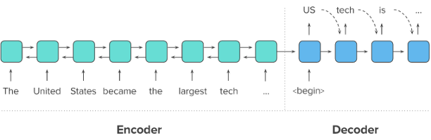

# AIFFEL_53일차 2020.10.12

Tags: AIFFEL_DAILY

### 일정


- [x]  GD Proj1 마무리 및 제출
- [x]  슬로우페이퍼 1회차
- [ ]  LMS E-18

# [슬로우페이퍼 1회차]


[ResNet](https://www.notion.so/ResNet-78ceb67d87d347feb61777050fb84fea)

기업에서 원하는 사항 : 논문을 읽고 , 이해하여 코드로 구현할 수 있으면 좋다.

참고자료(정리내용): [http://blog.naver.com/PostView.nhn?blogId=laonple&logNo=220761052425&categoryNo=0&parentCategoryNo=0&viewDate=&currentPage=1&postListTopCurrentPage=1&from=postView](http://blog.naver.com/PostView.nhn?blogId=laonple&logNo=220761052425&categoryNo=0&parentCategoryNo=0&viewDate=&currentPage=1&postListTopCurrentPage=1&from=postView)

# [E-18] 뉴스 요약봇 만들기


## **학습 목표**

---

- Extractive/Abstractive summarization 이해하기
- 단어장 크기를 줄이는 다양한 text normalization 적용해보기
- seq2seq의 성능을 Up시키는 Attention Mechanism 적용하기

## 텍스트 요약(Text Summarization) 이란?

---

긴 길이의 문서(Document) 원문을 핵심 주제만으로 구성된 짧은 요약(Summary) 문장들로 변환하는 것.

[EX] 상대적으로 큰 텍스트인 **뉴스 기사**로 작은 텍스트인 **뉴스 제목**을 만들어내는 것이 텍스트 요약의 대표적인 예라고 할 수 있어요.

⇒ 이 때 중요한 것은 요약 전후에 정보 손실 발생이 최소화되어야 한다는 점

방법은 크게 두 가지로 나뉜다.

1. 추출적 요약(Extractive Summarization)
2. 추상적 요약(Abstractive Summarization)

### 추출적 요약

원문에서 문장들을 추출해서 요약하는 방식.

딥러닝보다는 주로 전통적인 머신 러닝 방식에 속하는 텍스트랭크(TextRank)와 같은 알고리즘을 사용해서 이 방법을 사용한다고 해요.

([https://www.aclweb.org/anthology/W04-3252.pdf](https://www.aclweb.org/anthology/W04-3252.pdf))

TextRank – a graph-based ranking model for text processing

[ex] 네이버 뉴스 요약봇 (제목 우하단)

원문을 구성하는 문장 중 어느 것이 요약문에 들어갈 핵심문장인지를 판별한다는 점에서 문장 분류(Text Classification) 문제로 볼 수 있을 것

### 추상적 요약

원문으로부터 내용이 요약된 **새로운 문장**을 생성해내는 것

자연어 처리 분야 중 자연어 생성(Natural Language Generation, NLG)의 영역인 셈

***long term dependencies***

[https://zdnet.co.kr/view/?no=20160905114833](https://zdnet.co.kr/view/?no=20160905114833)

방법1. 역문서빈도(IDF) 같은 지표를 활용해 문서 안에서 중요해 보이는 부분 **추출**하기.

⇒ 발췌 방식은 어색하거나 문법적으로 이상한 결과물을 만든다.

방법2. 추상적 요약

seq2seq : 구글이 메일서비스에 적용한 자동 회신(Smart Reply) 기능을 만든 것과 비슷한 딥러닝 기법이기도 한 인코더와 디코더의 구조로 구성된 이 딥 러닝 아키텍처.

## 인공 신경망으로 텍스트 요약 훈련시키기

---

seq2seq 모델을 통해서 추상적 요약 방식의 텍스트 용약기를 만들어보자.

주로 뉴럴 기계번역에 사용되는 이 모델이 텍스트 요약에도 사용될 수 있을지 갸우뚱하실 수도 있겠지만, **원문을 요약문으로 번역한다**고 생각한다면 전혀 무리가 없겠죠?



seq2seq를 이용한 텍스트 요약. 번역과 모양은 똑같다!

원문을 첫번째 RNN인 인코더로 입력하면, 인코더는 이를 하나의 고정된 벡터로 변환해요. 이 벡터를 문맥 정보를 가지고 있는 벡터라고 하여 **컨텍스트 벡터(context vector)**라고 합니다. 두번째 RNN인 디코더는 이 컨텍스트 벡터를 전달받아 한 단어씩 생성해내서 요약 문장을 완성하는거죠.

원문 ⇒ 인코더 RNN ⇒ context vector ⇒ 디코더 RNN ⇒ 요약 문장 완성.

### 이번 구현에서는 바닐라 RNN 말고 LSTM 사용

### 어텐션 메커니즘을 통한 새로운 컨텍스트 벡터 사용하기


기존 컨텍스트 벡터보다 인코더의 정보를 적극적으로 활용하여 성능을 끌어올리는 어텐션 메커니즘.

기존의 seq2seq는 인코더의 마지막 time step의 hidden state를 컨텍스트 벡터로 사용.

하지만 RNN 계열의 인공 신경망(바닐라 RNN, LSTM, GRU)의 한계로 인해 이 컨텍스트 정보에는 이미 입력 시퀀스의 많은 정보가 손실이 된 상태

⇒ 이게 ***long term dependencies*** 인가??

***어텐션 메커니즘***

위의 문제를 해결하기 위해 모든 step의 hidden state의 정보가 컨텍스트 벡터에 전부 반영되도록 한다. 단, 인코더의 모든 hidden state가 동일한 비중으로 반영되는 것이 아니라, **디코더가 현재 time step의 예측($\hat h^d_2$)에 인코더의 각 step이 얼마나 영향을 미치는지에 따른 가중합으로** 계산하는 방식.

[EX]

위 그림의 예로 들자면, seq2seq 모델이라면 디코더로 전달되는 인코더의 컨텍스트 벡터는 인코더의 마지막 스텝의 hidden state인 $h_5$가 되겠지만, 어텐션 메커니즘이 적용된 seq2seq인 Attentional seq2seq이라면 인코더의 컨텍스트 벡터는 예를 들어 0.2$h_1$+0.3$h_2$+0.1$h_3$+0.15$h_4$+0.25$h_5$ 가 될 수도 있다.

컨텍스트 벡터를 구성하기 위한 인코더 hidden state의 가중치 값은 **디코더의 현재 스텝이 어디냐**에 따라 계속 달라진다.

⇒ 즉, 디코더의 현재 문장 생성 부위가 주어부인지 술어부인지 목적어인지 등에 따라 인코더가 입력 데이터를 해석한 컨텍스트 벡터가 다른 값이 된다.

( 기본적인 seq2seq 모델에서는 컨텍스트 벡터가 고정되어있는 것과 다르다!)

간단히 정리하자면...

1. seq2seq를 사용합니다.
2. RNN 계열 중 LSTM을 사용하므로 hidden state뿐만 아니라 cell state도 사용해야 합니다.
3. 디코더의 예측 시퀀스에는 시작 토큰 SOS와 예측 토큰 EOS를 시퀀스의 앞, 뒤로 붙입니다.
4. seq2seq를 구동시키면 디코더는 시작 토큰을 입력받아 예측을 시작합니다.
5. seq2seq 기본 모델과 달리, 어텐션 메커니즘을 이용해 인코더의 hidden state의 중요도를 취합한 컨텍스트 벡터를 디코더 스텝별로 계산합니다.
6. 계산된 컨텍스트 벡터를 이용해서 디코더는 다음 등장할 단어를 예측합니다.

## 데이터 준비하기

---

캐글 아마존 리뷰 데이터셋

[https://www.kaggle.com/snap/amazon-fine-food-reviews](https://www.kaggle.com/snap/amazon-fine-food-reviews)

NLTK(Natural Language Toolkit)의 불용어(stopwords)를 사용

```python
import nltk
nltk.download('stopwords')

import numpy as np
import pandas as pd
import os
import re
import matplotlib.pyplot as plt
from nltk.corpus import stopwords
from bs4 import BeautifulSoup 
from tensorflow.keras.preprocessing.text import Tokenizer 
from tensorflow.keras.preprocessing.sequence import pad_sequences
import urllib.request
```

샘플 10만개만 사용하자

```python
data = pd.read_csv(os.getenv("HOME")+"/aiffel/news_summarization/data/Reviews.csv", nrows = 100000)
print('전체 샘플수 :',(len(data)))
```

summary , text column만 훈련에 사용할거라, 두 개만 빼자.

```python
data = data[['Text','Summary']]
data.head()

#랜덤한 3개 샘플 출력
data.sample(15)
```

Text 열의 내용을 요약한 것이 Summary 열이에요. 여기서는 인공 신경망을 통해 Text 시퀀스를 입력받으면, Summary 시퀀스를 예측하도록 인공 신경망을 훈련시킬 거에요.

## 데이터 전처리(1) 데이터 정리

---

- 빈칸으로 존재하는 null 데이터
- 의미는 같지만 다른 식으로 작성된 글 같은 중복 항목
- 텍스트 정규화 불용어 제거

### 중복 샘플 및 NULL 값 존재하는 샘플 제거

일단 확인

```python
print('Text 열에서 중복을 배제한 유일한 샘플의 수 :', data['Text'].nunique())
print('Summary 열에서 중복을 배제한 유일한 샘플의 수 :', data['Summary'].nunique())
```

이 데이터의 Summary는 'Smelly'나 'Good Product'와 같이 아주 간단한 요약들도 많아서 Text가 달라도 Summary는 동일할 수 있다. ( *이 점을 파악하는 것도 중요하다! 다른 거 할때! 이런식으로 데이터의 특징을 파악할 수 있어야 함.*)  하지만 Text 자체가 중복이 된 경우는 중복 샘플이므로 제거한다.

`drop_duplicates` 를 활용한 중복 샘플 제거

```python
data.drop_duplicates(subset = ['Text'], inplace = True)
print('전체 샘플수 :',(len(data)))
```

만약 데이터 Null값을 가지는 샘플이 있었다면, drop_duplicates()가 중복된 Null들을 지워주기는 하겠지만, 여전히 Null값 한개가 어딘가 남아있을 수 있어요. 데이터에 Null 값이 남아있는지 볼게요.

```python
print(data.isnull().sum())
```

`dropna` 를 사용하여 summary 에 있는 하나의 null 값 제거

```python
data.dropna(axis = 0, inplace = True)
print('전체 샘플수:',(len(data)))

>> 전체 샘플수: 88425
>> 10만개 중 약 1만개 제거됨
```

### 텍스트 정규화와 불용어 제거

단어들 중에서는 같은 의미인데도 다른 표현으로 쓰여 마치 다른 단어들처럼 간주되는 경우가 있다.

[ex] It'll 은 It will과 같고, mustn 과 must not 은 같은 표현

이런 경우들은 기계 학습 전에 미리 같은 표현으로 통일시켜주는 것이 기계의 연산량을 줄일 수 있다.

⇒ 이게 텍스트 정규화 (normalization), 흠... 표준화가 더 맞는거 아닌가? regularization이 정규화로 더 잘 쓰이지 않나.

정규화 사전

[https://stackoverflow.com/questions/19790188/expanding-english-language-contractions-in-python](https://stackoverflow.com/questions/19790188/expanding-english-language-contractions-in-python)

```python
contractions = {"ain't": "is not", "aren't": "are not","can't": "cannot", "'cause": "because", "could've": "could have", "couldn't": "could not",
                           "didn't": "did not",  "doesn't": "does not", "don't": "do not", "hadn't": "had not", "hasn't": "has not", "haven't": "have not",
                           "he'd": "he would","he'll": "he will", "he's": "he is", "how'd": "how did", "how'd'y": "how do you", "how'll": "how will", "how's": "how is",
                           "I'd": "I would", "I'd've": "I would have", "I'll": "I will", "I'll've": "I will have","I'm": "I am", "I've": "I have", "i'd": "i would",
                           "i'd've": "i would have", "i'll": "i will",  "i'll've": "i will have","i'm": "i am", "i've": "i have", "isn't": "is not", "it'd": "it would",
                           "it'd've": "it would have", "it'll": "it will", "it'll've": "it will have","it's": "it is", "let's": "let us", "ma'am": "madam",
                           "mayn't": "may not", "might've": "might have","mightn't": "might not","mightn't've": "might not have", "must've": "must have",
                           "mustn't": "must not", "mustn't've": "must not have", "needn't": "need not", "needn't've": "need not have","o'clock": "of the clock",
                           "oughtn't": "ought not", "oughtn't've": "ought not have", "shan't": "shall not", "sha'n't": "shall not", "shan't've": "shall not have",
                           "she'd": "she would", "she'd've": "she would have", "she'll": "she will", "she'll've": "she will have", "she's": "she is",
                           "should've": "should have", "shouldn't": "should not", "shouldn't've": "should not have", "so've": "so have","so's": "so as",
                           "this's": "this is","that'd": "that would", "that'd've": "that would have", "that's": "that is", "there'd": "there would",
                           "there'd've": "there would have", "there's": "there is", "here's": "here is","they'd": "they would", "they'd've": "they would have",
                           "they'll": "they will", "they'll've": "they will have", "they're": "they are", "they've": "they have", "to've": "to have",
                           "wasn't": "was not", "we'd": "we would", "we'd've": "we would have", "we'll": "we will", "we'll've": "we will have", "we're": "we are",
                           "we've": "we have", "weren't": "were not", "what'll": "what will", "what'll've": "what will have", "what're": "what are",
                           "what's": "what is", "what've": "what have", "when's": "when is", "when've": "when have", "where'd": "where did", "where's": "where is",
                           "where've": "where have", "who'll": "who will", "who'll've": "who will have", "who's": "who is", "who've": "who have",
                           "why's": "why is", "why've": "why have", "will've": "will have", "won't": "will not", "won't've": "will not have",
                           "would've": "would have", "wouldn't": "would not", "wouldn't've": "would not have", "y'all": "you all",
                           "y'all'd": "you all would","y'all'd've": "you all would have","y'all're": "you all are","y'all've": "you all have",
                           "you'd": "you would", "you'd've": "you would have", "you'll": "you will", "you'll've": "you will have",
                           "you're": "you are", "you've": "you have"}

print("정규화 사전의 수: ",len(contractions))
```

불용어 제거

```python
print('불용어 개수 :', len(stopwords.words('english') ))
print(stopwords.words('english'))
```

이 작업 외에도

- 모든 영어문자는 소문자로 만들고
- 섞여있는 html 태그를 제거하고
- 정규 표현식을 통해 각종 특수문자를 제거

```python
#데이터 전처리 함수
def preprocess_sentence(sentence, remove_stopwords=True):
    sentence = sentence.lower() # 텍스트 소문자화
    sentence = BeautifulSoup(sentence, "lxml").text # <br />, <a href = ...> 등의 html 태그 제거
    sentence = re.sub(r'\([^)]*\)', '', sentence) # 괄호로 닫힌 문자열 (...) 제거 Ex) my husband (and myself!) for => my husband for
    sentence = re.sub('"','', sentence) # 쌍따옴표 " 제거
    sentence = ' '.join([contractions[t] if t in contractions else t for t in sentence.split(" ")]) # 약어 정규화
    sentence = re.sub(r"'s\b","",sentence) # 소유격 제거. Ex) roland's -> roland
    sentence = re.sub("[^a-zA-Z]", " ", sentence) # 영어 외 문자(숫자, 특수문자 등) 공백으로 변환
    sentence = re.sub('[m]{2,}', 'mm', sentence) # m이 3개 이상이면 2개로 변경. Ex) ummmmmmm yeah -> umm yeah
    
    # 불용어 제거 (Text)
    if remove_stopwords:
        tokens = ' '.join(word for word in sentence.split() if not word in stopwords.words('english') if len(word) > 1)
    # 불용어 미제거 (Summary)
    else:
        tokens = ' '.join(word for word in sentence.split() if len(word) > 1)
    return tokens
```

⇒ 불용어 제거는 Text 전처리 시에서만 호출하고 이미 상대적으로 문장 길이가 짧은 Summary 전처리할 때는 호출하지 않는다. ⇒ 추상적 요약이기 때문에, 길이가 비교적 짧은 Summary 에는 불용어들이 남아있는게 더 자연스러운 문장 생성에 도움이 될듯함.

훈련 데이터 전체에 대해서 전처리를 수행 _ text

```python
clean_text = []

# 전체 Text 데이터에 대한 전처리 : 10분 이상 시간이 걸릴 수 있습니다. 
for s in data['Text']:
    clean_text.append(preprocess_sentence(s))

# 전처리 후 출력
clean_text[:5]
```

훈련 데이터 전체에 대해서 전처리를 수행 _ summary

```python
clean_summary = []

# 전체 Summary 데이터에 대한 전처리 : 5분 이상 시간이 걸릴 수 있습니다. 
for s in data['Summary']:
    clean_summary.append(preprocess_sentence(s, False))

clean_summary[:5]
```

이렇게 텍스트 **정제의 과정을 거친 후에는 다시 한번 빈(empty) 샘플이 생겼는지 확인해보는 것이 좋아요.** 정제 전에는 데이터가 존재했지만, 정제 과정에서 문장의 모든 단어가 사라지는 경우가 있을 수 있어요.

```python
data['Text'] = clean_text
data['Summary'] = clean_summary

# 빈 값을 Null 값으로 변환
data.replace('', np.nan, inplace=True)
```

Null 값 확인

```python
data.isnull().sum()
```

Summary 열에서 Null 값이 생겨서, 해당 샘플 제거

```python
data.dropna(axis=0, inplace=True)
print('전체 샘플수 :',(len(data)))#데이터 전처리 함수
```

## 데이터 전처리하기(2) 훈련 데이터와 테스트 데이터 나누기

---

### 샘플 최대 길이 정하기

```python
# 길이 분포 출력
import matplotlib.pyplot as plt

text_len = [len(s.split()) for s in data['Text']]
summary_len = [len(s.split()) for s in data['Summary']]

print('텍스트의 최소 길이 : {}'.format(np.min(text_len)))
print('텍스트의 최대 길이 : {}'.format(np.max(text_len)))
print('텍스트의 평균 길이 : {}'.format(np.mean(text_len)))
print('요약의 최소 길이 : {}'.format(np.min(summary_len)))
print('요약의 최대 길이 : {}'.format(np.max(summary_len)))
print('요약의 평균 길이 : {}'.format(np.mean(summary_len)))

plt.subplot(1,2,1)
plt.boxplot(summary_len)
plt.title('Summary')
plt.subplot(1,2,2)
plt.boxplot(text_len)
plt.title('Text')
plt.tight_layout()
plt.show()

plt.title('Summary')
plt.hist(summary_len, bins = 40)
plt.xlabel('length of samples')
plt.ylabel('number of samples')
plt.show()

plt.title('Text')
plt.hist(text_len, bins = 40)
plt.xlabel('length of samples')
plt.ylabel('number of samples')
plt.show()
```

임의로 정해보기

```python
text_max_len = 50
summary_max_len = 8
```

이 길이를 선택했을 때, 얼마나 많은 샘플들을 자르지 않고 포함할 수 있는지 통계로 확인 ⇒ 함수로 만들자

```python
def below_threshold_len(max_len, nested_list):
  cnt = 0
  for s in nested_list:
    if(len(s.split()) <= max_len):
        cnt = cnt + 1
  print('전체 샘플 중 길이가 %s 이하인 샘플의 비율: %s'%(max_len, (cnt / len(nested_list))))
```

```python
below_threshold_len(text_max_len, data['Text'])
below_threshold_len(summary_max_len,  data['Summary'])

>> 전체 샘플 중 길이가 50 이하인 샘플의 비율: 0.7745119121724859
>> 전체 샘플 중 길이가 8 이하인 샘플의 비율: 0.9424593967517402
```

⇒ 각각 50,8로 패딩을 하게되면, text는 약 23%가 망가지고, summary는 약 5%가 망가짐.

자르지 않고, 정해진 길이보다 길면 제외하는 방법으로 진행한다.

```python
data = data[data['Text'].apply(lambda x: len(x.split()) <= text_max_len)]
data = data[data['Summary'].apply(lambda x: len(x.split()) <= summary_max_len)]
print('전체 샘플수 :',(len(data)))
>> 전체 샘플수 : 65818
```

### 시작 토큰과 종료 토큰 추가하기

시작 토큰은 'sostoken', 종료 토큰은 'eostoken'이라 임의로 명명

디코더의 입력에 해당하면서 시작 토큰이 맨 앞에 있는 문장의 이름을 **decoder_input**

디코더의 출력 또는 레이블에 해당되면서 종료 토큰이 맨 뒤에 붙는 문장의 이름을 **decoder_target**

```python
#요약 데이터에는 시작 토큰과 종료 토큰을 추가한다.
data['decoder_input'] = data['Summary'].apply(lambda x : 'sostoken '+ x)
data['decoder_target'] = data['Summary'].apply(lambda x : x + ' eostoken')
data.head()
```

```python
encoder_input = np.array(data['Text']) # 인코더의 입력
decoder_input = np.array(data['decoder_input']) # 디코더의 입력
decoder_target = np.array(data['decoder_target']) # 디코더의 레이블
```

### 데이터 분리 (분리 패키지 이용말고, 직접 해보자)

```python
indices = np.arange(encoder_input.shape[0])
np.random.shuffle(indices)
print(indices)
```

이 정수 시퀀스를 이용해 다시 데이터의 샘플 순서를 정의해주면 잘 섞인 샘플이 된다.

```python
encoder_input = encoder_input[indices]
decoder_input = decoder_input[indices]
decoder_target = decoder_target[indices]
```

8:2 비율로 나누기

```python
n_of_val = int(len(encoder_input)*0.2)
print('테스트 데이터의 수 :',n_of_val)
```

전체 데이터 양분하기

```python
# n_of_val = int(len(encoder_input)*0.8) 로 놓고,
# encoder_input_train = encoder_input[:n_of_val]
# encoder_input_test = encoder_input[n_of_val:]
# 이렇게 하는거랑 같음.

encoder_input_train = encoder_input[:-n_of_val]
decoder_input_train = decoder_input[:-n_of_val]
decoder_target_train = decoder_target[:-n_of_val]

encoder_input_test = encoder_input[-n_of_val:]
decoder_input_test = decoder_input[-n_of_val:]
decoder_target_test = decoder_target[-n_of_val:]

print('훈련 데이터의 개수 :', len(encoder_input_train))
print('훈련 레이블의 개수 :',len(decoder_input_train))
print('테스트 데이터의 개수 :',len(encoder_input_test))
print('테스트 레이블의 개수 :',len(decoder_input_test))
```

## 데이터 전처리하기(3) 정수 인코딩

---

### 단어 집합(vocaburary) 만들기 및 정수 인코딩

기계가 텍스트를 숫자로 처리할 수 있도록 훈련 데이터와 테스트 데이터의 단어들을 모두 정수로 바꾼다.

각 단어에 고유한 정수를 맵핑하는 작업이 필요해요. 이 과정을 **단어 집합(vocaburary)**을 만든다고 표현

keras 토크나이저 사용하여 단어집합 만들기

```python
src_tokenizer = Tokenizer() # 토크나이저 정의
src_tokenizer.fit_on_texts(encoder_input_train) # 입력된 데이터로부터 단어 집합 생성
```

`src_tokenizer.word_index` 에 생성된 단어 집합 들어있음.

단어 집합에 있는 모든 단어를 사용하지 않고, 빈도수가 낮은 단어들은 훈련 데이터에서 제외하고 진행.

등장 빈도수가 7회 미만인 단어들이 데이터에서 얼마만큼의 비중을 차지하는지 확인해보자.

`src_tokenizer.word_counts.items()` 에 각 단어 등장 빈도수가 저장되어있음.

```python
threshold = 7
total_cnt = len(src_tokenizer.word_index) # 단어의 수
rare_cnt = 0 # 등장 빈도수가 threshold보다 작은 단어의 개수를 카운트
total_freq = 0 # 훈련 데이터의 전체 단어 빈도수 총 합
rare_freq = 0 # 등장 빈도수가 threshold보다 작은 단어의 등장 빈도수의 총 합

# 단어와 빈도수의 쌍(pair)을 key와 value로 받는다.
for key, value in src_tokenizer.word_counts.items():
    total_freq = total_freq + value

    # 단어의 등장 빈도수가 threshold보다 작으면
    if(value < threshold):
        rare_cnt = rare_cnt + 1
        rare_freq = rare_freq + value

print('단어 집합(vocabulary)의 크기 :',total_cnt)
print('등장 빈도가 %s번 이하인 희귀 단어의 수: %s'%(threshold - 1, rare_cnt))
print('단어 집합에서 희귀 단어를 제외시킬 경우의 단어 집합의 크기 %s'%(total_cnt - rare_cnt))
print("단어 집합에서 희귀 단어의 비율:", (rare_cnt / total_cnt)*100)
print("전체 등장 빈도에서 희귀 단어 등장 빈도 비율:", (rare_freq / total_freq)*100)
```

단어 집합(vocabulary)의 크기 : 32004
등장 빈도가 6번 이하인 희귀 단어의 수: 23766
단어 집합에서 희귀 단어를 제외시킬 경우의 단어 집합의 크기 8238
단어 집합에서 희귀 단어의 비율: 74.25946756655418
전체 등장 빈도에서 희귀 단어 등장 빈도 비율: 3.3851316960194215

등장 빈도가 7회 미만인 '희귀 단어'의 경우 단어 집합에서 차지하는 비중이 74%정도에 달하지만, 전체 데이터에서 희귀 단어가 등장하는 빈도는 약 3.39% 밖에 되지 않음.

8238을 어림잡아 8000으로 놓고 진행.

```python
src_vocab = 8000
src_tokenizer = Tokenizer(num_words = src_vocab) # 단어 집합의 크기를 8,000으로 제한
src_tokenizer.fit_on_texts(encoder_input_train) # 단어 집합 재생성.
```

`texts_to_sequences()` 을 통해 생성된 단어 집합에 기반하여 입력에 주어진 텍스트 데이터의 단어들을 모두 정수로 변환하는 정수 인코딩 수행. 

```python
# 텍스트 시퀀스를 정수 시퀀스로 변환
encoder_input_train = src_tokenizer.texts_to_sequences(encoder_input_train) 
encoder_input_test = src_tokenizer.texts_to_sequences(encoder_input_test)

#잘 진행되었는지 샘플 출력
print(encoder_input_train[:3])

# Summary 데이터에 대해서도 적용.
tar_tokenizer = Tokenizer()
tar_tokenizer.fit_on_texts(decoder_input_train)
```

이제 단어 집합이 생성되는 동시에 각 단어에 고유한 정수가 부여되었어요. 이는`tar_tokenizer.word_index`에 저장되어있어요. `tar_tokenizer.word_counts.items()`에는 단어와 각 단어의 등장 빈도수가 저장되어져 있는데, 이를 통해서 통계적인 정보를 얻어서, 등장 빈도수가 6회 미만인 단어들이 이 데이터에서 얼만큼의 비중을 차지하는지 확인해볼게요.

```python
threshold = 6
total_cnt = len(tar_tokenizer.word_index) # 단어의 수
rare_cnt = 0 # 등장 빈도수가 threshold보다 작은 단어의 개수를 카운트
total_freq = 0 # 훈련 데이터의 전체 단어 빈도수 총 합
rare_freq = 0 # 등장 빈도수가 threshold보다 작은 단어의 등장 빈도수의 총 합

# 단어와 빈도수의 쌍(pair)을 key와 value로 받는다.
for key, value in tar_tokenizer.word_counts.items():
    total_freq = total_freq + value

    # 단어의 등장 빈도수가 threshold보다 작으면
    if(value < threshold):
        rare_cnt = rare_cnt + 1
        rare_freq = rare_freq + value

print('단어 집합(vocabulary)의 크기 :',total_cnt)
print('등장 빈도가 %s번 이하인 희귀 단어의 수: %s'%(threshold - 1, rare_cnt))
print('단어 집합에서 희귀 단어를 제외시킬 경우의 단어 집합의 크기 %s'%(total_cnt - rare_cnt))
print("단어 집합에서 희귀 단어의 비율:", (rare_cnt / total_cnt)*100)
print("전체 등장 빈도에서 희귀 단어 등장 빈도 비율:", (rare_freq / total_freq)*100)
```

단어 집합(vocabulary)의 크기 : 10471
등장 빈도가 5번 이하인 희귀 단어의 수: 8082
단어 집합에서 희귀 단어를 제외시킬 경우의 단어 집합의 크기 2389
단어 집합에서 희귀 단어의 비율: 77.18460509979944
전체 등장 빈도에서 희귀 단어 등장 빈도 비율: 5.881618327842732

등장빈도 5회 이하 단어들이 단어 집합에서 약 77% 차지. 하지만, 전체 훈련 데이터에서 차지하는 비율은 약 5.88% ⇒ 2389에서 어림잡아 2000을 단어 집합의 크기로 제한.

```python
tar_vocab = 2000
tar_tokenizer = Tokenizer(num_words = tar_vocab) 
tar_tokenizer.fit_on_texts(decoder_input_train)
tar_tokenizer.fit_on_texts(decoder_target_train)

# 텍스트 시퀀스를 정수 시퀀스로 변환
decoder_input_train = tar_tokenizer.texts_to_sequences(decoder_input_train) 
decoder_target_train = tar_tokenizer.texts_to_sequences(decoder_target_train)
decoder_input_test = tar_tokenizer.texts_to_sequences(decoder_input_test)
decoder_target_test = tar_tokenizer.texts_to_sequences(decoder_target_test)

#잘 변환되었는지 확인
print('input')
print('input ',decoder_input_train[:5])
print('target')
print('decoder ',decoder_target_train[:5])
```

전체 데이터에서 빈도수가 낮은 단어가 삭제되었다는 것은 빈도수가 낮은 단어만으로 구성되었던 샘플들은 이제 빈(empty) 샘플이 되었을 가능성이 있어요. 이 현상은 길이가 상대적으로 길었던 원문(Text)의 경우에는 문제가 별로 없겠지만, 애초에 평균 길이가 4밖에 되지 않았던 요약문(Summary)의 경우에는 이 현상이 굉장히 두드러졌을 가능성이 높겠죠.

여기서 주의할 점은 요약문인 **`decoder_input`**에는 **`sostoken`** 또는 **`decoder_target`**에는 **`eostoken`**이 추가된 상태이고, 이 두 토큰은 모든 샘플에서 등장하므로 빈도수가 샘플수와 동일하게 매우 높으므로 단어 집합 제한에도 삭제 되지 않아요. 그래서 이제 길이가 0이 된 요약문의 실제길이는 1로 나올거에요. 길이 0이 된 **`decoder_input`**에는 **`sostoken`**, **`decoder_target`**에는 **`eostoken`**만 남아 있을테니까요.

훈련 데이터와 테스트 데이터에 대해서 요약문의 길이가 1인 경우의 인덱스를 각각 **`drop_train`**과 **`drop_test`**에 라는 변수에 저장해볼게요. 이 샘플들은 모두 삭제할거에요.

```python
drop_train = [index for index, sentence in enumerate(decoder_input_train) if len(sentence) == 1]
drop_test = [index for index, sentence in enumerate(decoder_input_test) if len(sentence) == 1]

print('삭제할 훈련 데이터의 개수 :',len(drop_train))
print('삭제할 테스트 데이터의 개수 :',len(drop_test))

encoder_input_train = np.delete(encoder_input_train, drop_train, axis=0)
decoder_input_train = np.delete(decoder_input_train, drop_train, axis=0)
decoder_target_train = np.delete(decoder_target_train, drop_train, axis=0)

encoder_input_test = np.delete(encoder_input_test, drop_test, axis=0)
decoder_input_test = np.delete(decoder_input_test, drop_test, axis=0)
decoder_target_test = np.delete(decoder_target_test, drop_test, axis=0)

print('훈련 데이터의 개수 :', len(encoder_input_train))
print('훈련 레이블의 개수 :',len(decoder_input_train))
print('테스트 데이터의 개수 :',len(encoder_input_test))
print('테스트 레이블의 개수 :',len(decoder_input_test))
```

### 패딩하기

서로 다른 길이의 샘플을 병렬 처리하기 위해 같은 길이로 맞춰주는 패딩 작업이 필요 ⇒ 아까 지정한 최대 길이로 패딩한다. 최대 길이보다 짧은 데이터들은 뒤의 공간에(post) 숫자 0을 넣어 최대 길이로 길이 맞춤.

```python
encoder_input_train = pad_sequences(encoder_input_train, maxlen = text_max_len, padding='post')
encoder_input_test = pad_sequences(encoder_input_test, maxlen = text_max_len, padding='post')
decoder_input_train = pad_sequences(decoder_input_train, maxlen = summary_max_len, padding='post')
decoder_target_train = pad_sequences(decoder_target_train, maxlen = summary_max_len, padding='post')
decoder_input_test = pad_sequences(decoder_input_test, maxlen = summary_max_len, padding='post')
decoder_target_test = pad_sequences(decoder_target_test, maxlen = summary_max_len, padding='post')
```

## 모델 설계하기

---

```python
from tensorflow.keras.layers import Input, LSTM, Embedding, Dense, Concatenate
from tensorflow.keras.models import Model
from tensorflow.keras.callbacks import EarlyStopping, ModelCheckpoint

# 인코더 설계 시작
embedding_dim = 128
hidden_size = 256

# 인코더
encoder_inputs = Input(shape=(text_max_len,))

# 인코더의 임베딩 층
enc_emb = Embedding(src_vocab, embedding_dim)(encoder_inputs)

# 인코더의 LSTM 1
encoder_lstm1 = LSTM(hidden_size, return_sequences=True, return_state=True ,dropout = 0.4, recurrent_dropout = 0.4)
encoder_output1, state_h1, state_c1 = encoder_lstm1(enc_emb)

# 인코더의 LSTM 2
encoder_lstm2 = LSTM(hidden_size, return_sequences=True, return_state=True, dropout=0.4, recurrent_dropout=0.4)
encoder_output2, state_h2, state_c2 = encoder_lstm2(encoder_output1)

# 인코더의 LSTM 3
encoder_lstm3 = LSTM(hidden_size, return_state=True, return_sequences=True, dropout=0.4, recurrent_dropout=0.4)
encoder_outputs, state_h, state_c= encoder_lstm3(encoder_output2)
```

임베딩 벡터의 차원(`embedding_dim`)은 128로 정의하고, hidden state의 크기(`hidden_size`)를 256으로 정의.

hidden state는 LSTM에서 얼만큼의 수용력(capacity)를 가질지를 정하는 파라미터.

(LSTM의 용량의 크기나, LSTM에서의 뉴론의 갯수라고 이해)

⇒ 무조건 용량을 많이 준다고 해서 성능이 반드시 올라가는 것은 아니다.

hidden state의 크기를 늘리는 것이 LSTM 층 1개의 용량을 늘린다면, 3개의 층을 사용하는 것은 모델의 용량을 늘린다고 볼 수 있다.

3개의 층을 지나서 인코더에서 나온 출력을 디코더로 보내야 한다! 디코더 설계 ㄱㄱ

디코더는 LSTM의 입력을 정의할 때, `initial_state`의 인자값으로 인코더의 `hidden state`와 `cell state`의 값을 넣어줘야 한다.

```python
# 디코더 설계
decoder_inputs = Input(shape=(None,))

# 디코더의 임베딩 층
dec_emb_layer = Embedding(tar_vocab, embedding_dim)
dec_emb = dec_emb_layer(decoder_inputs)

# 디코더의 LSTM
decoder_lstm = LSTM(hidden_size, return_sequences = True, return_state = True, dropout = 0.4, recurrent_dropout=0.2)
# state_h, state_c 는 인코더에서 나온 hidden state와 cell state를 의미한다.
decoder_outputs, _, _ = decoder_lstm(dec_emb, initial_state = [state_h, state_c])
```

```python
# 디코더의 출력층
# tar_vocab : 단어 집합 2000개로 제한 걸었잖아 위에서.
decoder_softmax_layer = Dense(tar_vocab, activation = 'softmax')
decoder_softmax_outputs = decoder_softmax_layer(decoder_outputs) 

# 모델 정의
model = Model([encoder_inputs, decoder_inputs], decoder_softmax_outputs)
model.summary()
```

디코더의 출력층에서는 Summary의 단어장인 `tar_vocab`의 수많은 선택지 중 하나의 단어를 선택하는 **다중 클래스 분류 문제**를 풀어야 해요. 그렇기 때문에 Dense의 인자로 tar_vocab을 주고, 활성화 함수로 소프트맥스 함수를 사용하고 있어요.

⇒ 여기까지는 기본적인 seq2seq . 인코더의 hidden state와 cell state를 디코더의 초기 state로 사용하고 있기 때문에!

⇒ 디코더 출력층의 설계를 조금 바꿔서 성능을 높이는 방법 : ***어텐션 메커니즘***

## 어텐션 매커니즘

어텐션 메커니즘을 수행하는 어텐션 함수를 설계하는 것은 또 다른 새로운 신경망을 설계해야한다는 뜻.

어텐션 함수를 설계해보는 것은 다음 기회로 미루기로 하고, 여기서는 이미 구현된 어텐션 함수를 가져와서 디코더의 출력층에 결합해보는걸로!

어텐션 함수 다운로드

```python
urllib.request.urlretrieve("https://raw.githubusercontent.com/thushv89/attention_keras/master/src/layers/attention.py", filename="attention.py")
from attention import AttentionLayer
```

디코더 출력층 수정

```python
# 어텐션 층(어텐션 함수)
attn_layer = AttentionLayer(name='attention_layer')
# 인코더와 디코더의 모든 time step의 hidden state를 어텐션 층에 전달하고 결과를 리턴
attn_out, attn_states = attn_layer([encoder_outputs, decoder_outputs])

# 어텐션의 결과와 디코더의 hidden state들을 연결
decoder_concat_input = Concatenate(axis = -1, name='concat_layer')([decoder_outputs, attn_out])

# 디코더의 출력층
decoder_softmax_layer = Dense(tar_vocab, activation='softmax')
decoder_softmax_outputs = decoder_softmax_layer(decoder_concat_input)

# 모델 정의
model = Model([encoder_inputs, decoder_inputs], decoder_softmax_outputs)
model.summary()
```

위의 코드는 인코더의 hidden state들과 디코더의 hidden state들을 어텐션 함수의 입력으로 사용하고, 어텐션 함수가 리턴한 값을 예측 시에 디코더의 hidden state와 함께 활용하는 형태

## 모델 훈련하기

---

설계한 모델로 훈련을 진행해보자

```python
model.compile(optimizer='rmsprop', loss='sparse_categorical_crossentropy')
es = EarlyStopping(monitor='val_loss', mode='min', verbose=1, patience = 2)
history = model.fit(x = [encoder_input_train, decoder_input_train], y = decoder_target_train, \
          validation_data = ([encoder_input_test, decoder_input_test], decoder_target_test),
          batch_size = 256, callbacks=[es], epochs = 50)
```

***EarlyStopping***

여기서는, `val_loss`을 모니터링 하면서, 검증 데이터의 손실이 줄어들지 않고 증가하는 현상이 `patience = 2` 2회 관측되면 학습을 멈추도록 설정되어있다.

training loss 와 validation loss 가 줄어드는 과정 시각화

```python
plt.plot(history.history['loss'], label='train')
plt.plot(history.history['val_loss'], label='test')
plt.legend()
plt.show()
```


## 인퍼런스 모델 구현하기 ( 실제 동작 모델 ) ↔ 훈련 모델

어렵구만...

---

정수 인덱스 행렬로 존재하던 텍스트 데이터를 실제 데이터로 복원해야 테스트 단계에서 사용 가능.

따라서, 필요한 3개의 사전을 준비한다.

```python
src_index_to_word = src_tokenizer.index_word # 원문 단어 집합에서 정수 -> 단어를 얻음
tar_word_to_index = tar_tokenizer.word_index # 요약 단어 집합에서 단어 -> 정수를 얻음
tar_index_to_word = tar_tokenizer.index_word # 요약 단어 집합에서 정수 -> 단어를 얻음
```

**seq2seq는 훈련할 때와 실제 동작할 때(인퍼런스 단계)의 방식이 다르다!**

⇒ 그에 맞게 모델 설계를 별개로 진행해야 한다는 것, 알고 계시나요?

**훈련 단계**에서는 디코더의 입력부에 정답이 되는 문장 전체를 한꺼번에 넣고 디코더의 출력과 한번에 비교할 수 있으므로, 인코더와 디코더를 엮은 통짜 모델 하나만 준비했습니다.

그러나 정답 문장이 없는 인퍼런스 단계에서는 **만들어야 할 문장의 길이만큼 디코더가 반복 구조로 동작**해야 하기 때문에 부득이하게 인퍼런스를 위한 모델 설계를 별도로 해주어야 합니다. 이때는 인코더 모델과 디코더 모델을 분리해서 설계합니다.

우선, 인코더 설계

```python
# 인코더 설계
encoder_model = Model(inputs=encoder_inputs, outputs=[encoder_outputs, state_h, state_c])

# 이전 시점의 상태들을 저장하는 텐서
decoder_state_input_h = Input(shape=(hidden_size,))
decoder_state_input_c = Input(shape=(hidden_size,))

# 디코더 임베딩 레이어2
dec_emb2 = dec_emb_layer(decoder_inputs)
# 문장의 다음 단어를 예측하기 위해서 ***초기 상태(initial_state)를 이전 시점의 상태로 사용***
# 이는 뒤의 함수 decode_sequence()에 구현
# 훈련 과정에서와 달리 LSTM의 리턴하는 은닉 상태와 셀 상태인 state_h와 state_c를 버리지 않음.
# 훈련 과정에서는 _ 로 버렸었음.
decoder_outputs2, state_h2, state_c2 = decoder_lstm(dec_emb2, initial_state=[decoder_state_input_h, decoder_state_input_c])
```

어텐션 메커니즘을 사용하는 출력층

```python
# 어텐션 함수
decoder_hidden_state_input = Input(shape=(text_max_len, hidden_size))
attn_out_inf, attn_states_inf = attn_layer([decoder_hidden_state_input, decoder_outputs2])
decoder_inf_concat = Concatenate(axis=-1, name='concat')([decoder_outputs2, attn_out_inf])

# 디코더의 출력층
decoder_outputs2 = decoder_softmax_layer(decoder_inf_concat) 

# 최종 디코더 모델
decoder_model = Model(
    [decoder_inputs] + [decoder_hidden_state_input,decoder_state_input_h, decoder_state_input_c],
    [decoder_outputs2] + [state_h2, state_c2])
```

인퍼런스 단계에서 단어 시퀀스를 완성하는 함수

```python
def decode_sequence(input_seq):
    # 입력으로부터 인코더의 상태를 얻음
    e_out, e_h, e_c = encoder_model.predict(input_seq)

     # <SOS>에 해당하는 토큰 생성
    target_seq = np.zeros((1,1))
    target_seq[0, 0] = tar_word_to_index['sostoken']

    stop_condition = False
    decoded_sentence = ''
    while not stop_condition: # stop_condition이 True가 될 때까지 루프 반복

        output_tokens, h, c = decoder_model.predict([target_seq] + [e_out, e_h, e_c])
        sampled_token_index = np.argmax(output_tokens[0, -1, :])
        sampled_token = tar_index_to_word[sampled_token_index]

        if(sampled_token!='eostoken'):
            decoded_sentence += ' '+sampled_token

        #  <eos>에 도달하거나 최대 길이를 넘으면 중단.
        if (sampled_token == 'eostoken'  or len(decoded_sentence.split()) >= (summary_max_len-1)):
            stop_condition = True

        # 길이가 1인 타겟 시퀀스를 업데이트
        target_seq = np.zeros((1,1))
        target_seq[0, 0] = sampled_token_index

        # 상태를 업데이트 합니다.
        e_h, e_c = h, c

    return decoded_sentence
```

## 모델 테스트하기

---

테스트 단계에서는 정수 시퀀스를 텍스트 시퀀스로 변환하여 결과를 확인하는 것이 편하다.

주어진 정수 시퀀스를 텍스트 시퀀스로 변환하는 함수를 만들어놓자.

단, Text의 정수 시퀀스에서는 패딩을 위해 사용되는 숫자 0을 제외하고,

Summary의 정수 시퀀스에서는 숫자 0, 시작 토큰의 인덱스, 종료 토큰의 인덱스를 출력에서 제외하도록.

```python
# 원문의 정수 시퀀스를 텍스트 시퀀스로 변환
def seq2text(input_seq):
    temp=''
    for i in input_seq:
# padding에 해당하는 0 제외
        if(i!=0):
            temp = temp + src_index_to_word[i]+' '
    return temp

# 요약문의 정수 시퀀스를 텍스트 시퀀스로 변환
def seq2summary(input_seq):
    temp=''
    for i in input_seq:
# padding에 해당하는 0, 시작 토큰 인덱스, 종료 토큰 인덱스 출력에서 제외.
        if((i!=0 and i!=tar_word_to_index['sostoken']) and i!=tar_word_to_index['eostoken']):
            temp = temp + tar_index_to_word[i] + ' '
    return temp
```

성능을 개선하기 위해서는 **seq2seq와 어텐션의 자체의 조합**을 좀 더 좋게 수정하는 방법도 있고, **빔 서치(beam search)**, **사전 훈련된 워드 임베딩(pre-trained word embedding)**, 또는 **인코더 - 디코더 자체의 구조를 새로이 변경한 하는 트랜스포머(Transformer)**와 같은 여러 개선 방안들이 존재.

⇒ 이런건 나중에 보자.

## 추출적 요약 해보기

---

위에서 추상적 요약만 했으니까, 추출적 요약도 잠깐 해보자.

패키지 `Summa`에서는 추출적 요약을 위한 모듈인 summarize를 제공하고 있어 아주 간단하게 실습을 해볼 수 있어요.

매트릭스 시놉시스로 해보자.

```python
import requests
from summa.summarizer import summarize
```

```python
text = requests.get('http://rare-technologies.com/the_matrix_synopsis.txt').text
```

```python
print(text[:1500])
```

summarize의 인자들

- text (str) : 요약할 테스트
- ratio (float, optional) : 요약문에서 원본에서 선택되는 문장 비율. 0~1 사이값
- words (int or None, optional) : 출력에 포함할 단어 수. 만약, ratio와 함께 두 파라미터가 모두 제공되는 경우 ratio는 무시한다.
- split (bool, optional) : True면 문장 list / False는 조인(join)된 문자열을 반환

Summa의 summarize는 문장 토큰화를 별도로 하지 않더라도 내부적으로 문장 토큰화를 수행

```python
# 원문의 0.005% 만을 출력해보자.
print('Summary:')
print(summarize(text, ratio=0.005))

# list 로 출력 받아보기
print('Summary:')
print(summarize(text, ratio=0.005, split=True))

# ratio 대신 문자 수로 제한도 가능
print('Summary:')
print(summarize(text, words=50))
```

## 프로젝트: 뉴스기사 요약해보기

---

결과물 : [https://github.com/bluecandle/2020_AIFFEL/blob/master/daily_notes/exploration_codes/e18_code/E18.ipynb](https://github.com/bluecandle/2020_AIFFEL/blob/master/daily_notes/exploration_codes/e18_code/E18.ipynb)