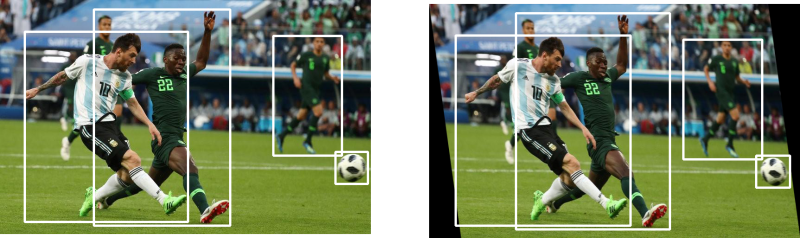

# AIFFEL_54일차 2020.10.13

Tags: AIFFEL_DAILY

### 일정


- [x]  LMS E-18 마무리
- [x]  GD Lec2
- [ ]  영배스3 준비

# [E-18] 텍스트 요약


마무리하기

결과물 : [https://github.com/bluecandle/2020_AIFFEL/blob/master/daily_notes/exploration_codes/e18_code/E18.ipynb](https://github.com/bluecandle/2020_AIFFEL/blob/master/daily_notes/exploration_codes/e18_code/E18.ipynb)

# Going Deeper Lec2

잘 만든 Augmentation, 이미지 100장 안 부럽다.


## **실습목표**

---

1. Augmentation을 하는 이유를 알아갑니다.
2. 여러 가지 Augmentation 방법을 알아둡니다.
3. 학습에 Augmentation을 적용할때 **주의해야 할 점**을 숙지합니다.

### 예시를 한 번 생각해보자

사진을 보고 시내의 유명한 카페를 분류하는 모델을 만들어야하는 프로젝트.

강남의 카페를 조사하기 위해서 인스타그램(Instagram)을 크롤링해 20여 개 카페의 사진 약 2,500장을 얻을 수 있었다고 상상해 봅시다.

처음 크롤링할 때는 많았으나 내부 인테리어 사진으로 카페를 구분하기 위해서 음식 사진, 사람 사진을 제외하고 나니 많은 수가 줄어든다 ⇒ 만 장 단위로 수집하는 것이 사실상 너무 어렵다!

⇒ ***현실의 문제를 해결하기 위해 필요한 데이터는 충분히 모으기도 쉽지 않고 고품질로 정제하는 것도 쉽지 않다!***

## Data Augmentation이란? (1)개요

---

***갖고 있는 데이터셋을 여러 가지 방법으로 증강시켜(augment) 실질적인 학습 데이터셋의 규모를 키울 수 있는 방법***

- 데이터가 많아진다는 것은 과적합(overfitting)을 줄일 수 있다는 것을 의미
- 가지고 있는 데이터셋이 실제 상황에서의 입력값과 다를 경우, augmentation을 통해서 실제 입력값과 비슷한 데이터 분포를 만들어 낼 수 있음.
    - [EX] 학습한 데이터는 노이즈가 많이 없는 사진이지만 테스트 이미지는 다양한 노이즈가 있는 경우 테스트에서 좋은 성능을 내기 위해서는 이러한 노이즈의 분포를 예측하고 학습 데이터에 노이즈를 삽입해 **모델이 이런 노이즈에 잘 대응**할 수 있도록 해야함.
    - 즉, data augmentation은 데이터를 늘릴 뿐만 아니라 모델이 실제 테스트 환경에서 잘 동작할 수 있도록 도와주기도 한다.

---

[C4W2L10 Data Augmentation]

[https://www.youtube.com/watch?v=JI8saFjK84o&feature=emb_logo&ab_channel=Deeplearning.ai](https://www.youtube.com/watch?v=JI8saFjK84o&feature=emb_logo&ab_channel=Deeplearning.ai)

1. Mirroring : 좌우반전
2. Random Cropping : 임의로 잘라내기
3. Rotation
4. Shearing
    1. Shearing, is another bounding box transformation, that can be done with the help of the transformation matrix. The effect that shearing produces looks like.

    

    2. In shearing, we turn the rectangular image into ... umm...sort of a parallelogrammed image?

    3. bounding box 를 변경하는 방법인데, 약간 평행사변형처럼 만드는 그런 방법인듯.

    4. 원래 shear 라는 단어 이미가 (털을)깎다 , (압력을 못 이겨)부러지다 이런 뜻인데, 찌그러뜨리고 자르는 그런 이미지를 상상하면 될 것 같다.

5. Local warping
    1. 내가 아는 warping은 이미지를 같은 차원으로 변경하는 것을 의미하는데...
    2. 그게 아니라, 그냥 input image, input feature 를 '변형' 하는 그 자체를 의미하는듯. local warping은 이미지 내 특정한 영역의 pixel 을 변형시키는 그런 것을 의미하지 않을까? 
6. Color shifting , 'PCA color augmentation'


***Implementing distortions during training***

hard disk ⇒ load ⇒ distortion at cpu ⇒ mini-batch in memory ⇒ cpu or gpu training


마지막에 training 과정은 병렬로 진행되는 경우가 많다 ㅇㅇ

---

### Image data augmentation

카메라 앱에서 사용할 수 있는 기능들과 비슷한 면들이 많다.

색상 필터, 좌우 대칭, 상하 반전, 기울이기, 잘라내기 등등

## Data Augmentation이란? (2) 다양한 Image Augmentation 방법

---

### Flipping

이미지 대칭

분류 문제에서는 문제가 없을 수 있지만 , 물체 탐지(detection), 세그멘테이션(segmentation) 문제 등 **정확한 정답 영역이 존재하는 문제에** 적용할 때에는 **라벨도 같이 좌우 반전**을 해주어야 합니다.

⇒ 만약 숫자나 알파벳 문자를 인식(recognition)하는 문제에 적용할 때도 주의해야 할 것입니다. 상하나 좌우가 반정될 경우 다른 글자가 될 가능성이 있으니까요.

⇒ ***데이터의 특성, 풀고자 하는 문제에 따라 augmentation 방법을 적용하는 것에 주의해야한다!*** 

### Gray scale

Gray scale은 3가지 채널(channel)을 가진 RGB 이미지를 하나의 채널을 가지도록 한다.

흑백 대신 다른 색상으로 이미지를 표현한 예시.

### Saturation

RGB 이미지를 HSV(Hue(색조), Saturation(채도), Value(명도)의 3가지 성분으로 색을 표현) 이미지로 변경하고 S(saturation) 채널에 오프셋(offset)을 적용, 조금 더 이미지를 선명하게 만들어 줍니다

참고자료 : [https://darkpgmr.tistory.com/66](https://darkpgmr.tistory.com/66)


**HSV 모델**은 Hue(색조), Saturation(채도), Value(명도)의 3가지 성분으로 색을 표현한다. Hue는 색조(예: 붉은색 계열인지 푸른색 계열인지, ...)를, Saturation은 그 색이 얼마나 선명한(순수한) 색인지를, Value는 밝기(intensity)를 나타낸다. HSV 모델은 우리가 색을 가장 직관적으로 표현할 수 있는 모델이며 또한 머리속에서 상상하는 색을 가장 쉽게 만들어낼 수 있는 모델이다.

H 값은 색의 종류를 나타내기 때문에 크기는 의미가 없으며 단순한 인덱스(index)를 나타낸다. S 값은 0이면 무채색(gray 색), 255면 가장 선명한(순수한) 색임을 나타낸다. V 값은 작을수록 어둡고 클수록 밝은 색임을 나타낸다.

### Brightness

RGB 채널에서 값을 더하면 밝아지고, 빼주면 어두워진다.

### Rotation

각도 변경.

90도 단위는 직사각형 형태가 유지되어, 크기만 조절하면 사용 가능.

하지만, 90도 단위로 돌리지 않는 경우 직사각형 형태에서 기존 이미지로 채우지 못하는 영역을 어떻게 처리할 것인지 유의해야함.

### Center Crop

이미지 중앙을 기준으로 확대. 너무 작게 center crop 하지 않도록 주의!

적어도 원래 이미지가 가진 특징을 인식할 수 있을 수준으로만 작게 crop 해야함.

동물 (고양이 , 개 등등) 이미지에서, 털만 보이도록 아주 작은 영역을 떼어내면 그건 아니라는거지.

그 외에도

- Gaussian noise
- Contrast change
- Sharpen
- Affine transformation
- Padding
- Blurring

⇒ [https://github.com/aleju/imgaug](https://github.com/aleju/imgaug)

## 텐서플로우를 사용한 Image Augmentation (1) Flip

---

```python
import tensorflow as tf
from PIL import Image
import matplotlib.pyplot as plt
import os

sample_img_path = os.getenv('HOME')+'/aiffel/data_augmentation/images/mycat.jpg'
sample_img_path
```

이미지 불러와 리사이징

```python
image = Image.open(sample_img_path).resize((500, 400)) # 이미지에 따라 숫자를 바꾸어 보세요.
image_tensor = tf.keras.preprocessing.image.img_to_array(image)

image
```

### Flip 해보기

```python
flip_lr_tensor = tf.image.flip_left_right(image_tensor)
flip_ud_tensor = tf.image.flip_up_down(image_tensor)
flip_lr_image = tf.keras.preprocessing.image.array_to_img(flip_lr_tensor)
flip_ud_image = tf.keras.preprocessing.image.array_to_img(flip_ud_tensor)

plt.figure(figsize=(15, 15))

plt.subplot(1,3,1)
plt.title('Original image')
plt.imshow(image)

plt.subplot(1,3,2)
plt.title('flip_left_right')
plt.imshow(flip_lr_image)

plt.subplot(1,3,3)
plt.title('flip_up_down')
plt.imshow(flip_ud_image)
```

확률에 따라 좌우 혹은 상하 반전이 이루어지도록 하여, 반전이 되지 않은 원본 데이터를 활용할 수 있도록 한다.⇒ 이를 위해 `random_flip_left_right`와 `random_flip_up_down` 함수 사용.

```python
plt.figure(figsize=(10, 10))

row = 4
for i in range(row):
    flip_lr_tensor = tf.image.random_flip_left_right(image_tensor)
    flip_ud_tensor = tf.image.random_flip_up_down(image_tensor)
    flip_lr_image = tf.keras.preprocessing.image.array_to_img(flip_lr_tensor)
    flip_ud_image = tf.keras.preprocessing.image.array_to_img(flip_ud_tensor)
    
    plt.subplot(4,3,i*3+1)
    plt.title('Original image')
    plt.imshow(image)

    plt.subplot(4,3,i*3+2)
    plt.title('flip_left_right')
    plt.imshow(flip_lr_image)

    plt.subplot(4,3,i*3+3)
    plt.title('flip_up_down')
    plt.imshow(flip_ud_image)
```

## 텐서플로우를 사용한 Image Augmentation (2) Center Crop

---

`central_fraction` : 얼마나 확대를 할지를 조절하는 매개변수

1.0인 경우는 원본 이미지와 같습니다. 그러나 예를 들어 고양이 이미지를 확대하면 0.5까지는 보일 수 있지만 0.25 수준으로 내려가면 털만 보이고 고양이의 형상을 찾기 어려울 수 있습니다.

⇒ `central_fraction`의 범위를 문제가 생기지 않는 범위에서 랜덤하게 조절

```python
plt.figure(figsize=(15, 15))

central_fractions = [1.0, 0.75, 0.5, 0.25, 0.1]
col = len(central_fractions)
for i, frac in enumerate(central_fractions):
    cropped_tensor = tf.image.central_crop(image_tensor, frac)
    cropped_img = tf.keras.preprocessing.image.array_to_img(cropped_tensor)
    
    plt.subplot(1,col+1,i+1)
    plt.title(f'Center crop: {frac}')
    plt.imshow(cropped_img)
```

center 비중을 랜덤하게 하는 함수가 없어서, 임의로 만들어서 사용한다.

```python
def random_central_crop(image_tensor, range=(0, 1)):
    central_fraction = tf.random.uniform([1], minval=range[0], maxval=range[1], dtype=tf.float32)
    cropped_tensor = tf.image.central_crop(image_tensor, central_fraction)
    return cropped_tensor
```

```python
plt.figure(figsize=(15, 15))

col = 5
for i, frac in enumerate(central_fractions):
    cropped_tensor =random_central_crop(image_tensor)
    cropped_img = tf.keras.preprocessing.image.array_to_img(cropped_tensor)
    
    plt.subplot(1,col+1,i+1)
    plt.imshow(cropped_img)
```

## 텐서플로우를 사용한 Image Augmentation (3) 직접 해보기

---

### tf.image.random_crop()

이미지 내에서 원하는 크기만큼의 임의 영역 잘라내기

```python
import tensorflow as tf
from PIL import Image
import matplotlib.pyplot as plt
import os

sample_img_path = os.getenv('HOME')+'/aiffel/data_augmentation/images/mycat.jpg'

image = Image.open(sample_img_path).resize((500, 400)) # 이미지에 따라 숫자를 바꾸어 보세요.
image_tensor = tf.keras.preprocessing.image.img_to_array(image)

# apply random_crop on cat image
# 여기에 코드를 입력해 주세요.

# tf.image.random_crop(
#    value, size, seed=None, name=None
# )

img_random_crop = tf.image.random_crop(image_tensor,[200,200,3] ,seed=2020, name = 'cat_random_crop')

random_cropped_cat_img = tf.keras.preprocessing.image.array_to_img(img_random_crop)
plt.imshow(random_cropped_cat_img)

# display 5 random cropped images
# 여기에 코드를 입력해 주세요.

col = 5
for idx in range(5):
  img_random_crop = tf.image.random_crop(image_tensor,[200,200,3] ,seed=2020, name = 'cat_random_crop')

  random_cropped_cat_img = tf.keras.preprocessing.image.array_to_img(img_random_crop)
  plt.subplot(1,col+1,idx+1)
  plt.imshow(random_cropped_cat_img)
```

### tf.image.random_brightness()

```python
# apply random_brightness on cat image
# 여기에 코드를 입력해 주세요.

# tf.image.random_brightness(
#    image, max_delta, seed=None
#)

img_random_brightness = tf.image.random_brightness(image_tensor,0.37,seed=2020)

# random_brightness_cat_img = tf.keras.preprocessing.image.array_to_img(img_random_crop)
plt.imshow(img_random_brightness)

col = 5
for idx in range(5):
  img_random_brightness = tf.image.random_brightness(image_tensor,370,seed=2020)
  plt.subplot(1,col+1,idx+1)
  plt.imshow(img_random_brightness)
```

## imgaug 라이브러리

---

augmentation만을 모아서 제공하는 전문 라이브러리들 중 **imgaug**

[https://github.com/aleju/imgaug](https://github.com/aleju/imgaug)


이미지에 augmentation을 적용할 때는 정답(ground truth 또는 gt)이 되는 데이터에도 augmentation이 동일하게 적용.

- "Image" 컬럼은 각 원본 이미지들이고
- "Heatmaps", "Seg. Maps"(Segmentation Maps), "Keypoints", "Bouding Boxes, Polygons" 컬럼은 해당 원본 데이터에 대해 각 이미지 태스크에 따른 정답 데이터

imgaug 에서는 배열을 이미지의 기본 형태로 사용. PIL 이미지를 numpy 배열로 변환하여 사용.

```python
import numpy as np
import imgaug.augmenters as iaa

image_arr = np.array(image)
```

### augmentation 기법들 사용해보기

**iaa.Affine()**

아핀 변환(Affine transform) : 2D 변환의 일종인 아핀 변환은 이미지의 스케일(scale)을 조절하거나 평행이동, 또는 회전 등의 변환이 가능.

---

참고자료 [2D 변환] [https://darkpgmr.tistory.com/79](https://darkpgmr.tistory.com/79)

2D 변환은 detection 또는 tracking 문제에 있어서 아래 그림과 같이 두 이미지 사이의 매칭(matching) 관계를 이미지 평면에서 직접 모델링할때 사용되는 방법입니다.


이러한 2D 변환 관계를 모델링 할때, **어떤 변환 모델**을 사용할지는 문제에 따라 다를 것입니다. **회전변화**만을 허용할지, **스케일 변화**까지 고려할지, 아니면 **affine** 또는 **원근(perspective) 변화**까지 고려할지를 잘 선택해야 합니다. 물론 **perspective 변환**을 사용하는 경우가 가장 일반적이긴 하지만 그만큼 자유도가 높기 때문에 잘못된 결과를 낼 가능성도 높습니다.

---

-25~25 도 랜덤하게 각도 변환

```python
images = [image_arr, image_arr, image_arr, image_arr]
rotate = iaa.Affine(rotate=(-25, 25))
images_aug = rotate(images=images)
plt.figure(figsize=(13,13))
plt.imshow(np.hstack(images_aug))
```

**iaa.Crop()**

crop 하려는 원본 이미지의 비율을 매개변수로 사용하여 이미지 생성.

```python
images = [image_arr, image_arr, image_arr, image_arr]
crop = iaa.Crop(percent=(0, 0.2))
images_aug = crop(images=images)
plt.figure(figsize=(13,13))
plt.imshow(np.hstack(images_aug))
```

**iaa.Sequential()**

하나하나 적용하지 않고... 'augmentation 기법들을 한 번에 조합하여 사용할 수는 없을까??'

`iaa.Sequential`를 사용해서 여러 가지의 augmentation 기법을 순차적으로 적용할 수 있다!

```python
images = [image_arr, image_arr, image_arr, image_arr]
rotate_crop = iaa.Sequential([
    iaa.Affine(rotate=(-25, 25)),
    iaa.Crop(percent=(0, 0.2))
])
images_aug = rotate_crop(images=images)
plt.figure(figsize=(13,13))
plt.imshow(np.hstack(images_aug))
```

⇒ 이렇게 하면 affine, crop 순서로 고정이 된다.

⇒근데 random으로 기법들의 순서를 바꾸어 사용할 수도 있다!

[https://imgaug.readthedocs.io/en/latest/source/overview/meta.html#sequential](https://imgaug.readthedocs.io/en/latest/source/overview/meta.html#sequential)

**iaa.OneOf()**

여러 augmentation 중 하나를 선택하도록 하기!

예를 들어 색상에 변화를 줄 때 여러 변환이 불필요한 경우 선택지 중 하나의 기법만 적용되도록 할 수 있다.

```python
images = [image_arr, image_arr, image_arr, image_arr]
seq = iaa.OneOf([
     iaa.Grayscale(alpha=(0.0, 1.0)),
     iaa.AddToSaturation((-50, 50))
])
images_aug = seq(images=images)
plt.figure(figsize=(13,13))
plt.imshow(np.hstack(images_aug))
```

**iaa.Sometimes()**

augmentation들이 일정 확률로 선택이 되게 하는 기능을 제공.

```python
# Use various techniques and functions in imgaug library. Make at least 1,024 images and show 100 images.

# 1024 = 2 ** 10
seq = iaa.Sequential([
  iaa.OneOf([
       	iaa.Sometimes(0.5, iaa.Crop(percent=(0, 0.2))),
      	iaa.Sometimes(0.5, iaa.Affine(rotate=(-25, 25))),
  		iaa.Sometimes(0.5, iaa.AddToSaturation((-50, 50))),
  		iaa.Sometimes(0.5,iaa.Grayscale(alpha=(0.0, 1.0)))       
  ]),
  	# => 2**5
  iaa.Sequential([
  		iaa.Sometimes(0.5,iaa.Crop(percent=(0, 0.2))),
      	iaa.Sometimes(0.5, iaa.Affine(rotate=(-25, 25))),
  		iaa.Sometimes(0.5, iaa.AddToSaturation((-50, 50))),
  		iaa.Sometimes(0.5,iaa.Grayscale(alpha=(0.0, 1.0)))   
  	],random_order = True)
  # => 2**5  
])

plt.figure(figsize=(20, 50))
for i in range(20):
    images = [image_arr, image_arr, image_arr, image_arr, image_arr]
    images_aug = seq(images=images)
    plt.subplot(20,1,i+1)
    plt.imshow(np.hstack(images_aug))

plt.show()
```

## 더 나아간 기법들

---

위에서 사용한 방법들은 일정한 수학적 알고리즘을 적용한 방법들!

근데, data augmentation에도 딥러닝을 활용하는 방식이 개발되고있다!

⇒ 대표적으로, GAN을 data augmentation에 활용할 수 있음.

전통적인 augmentation 방법과 GAN을 활용한 augmentation을 적용하여 효과를 실험한 논문

[The Effectiveness of Data Augmentation in Image Classification using Deep
Learning](images/The_Effectiveness_of_Data_Augmentation_in_Image_Classification_using_Deep_Learning.txt)

(여기서 등장하는 간단한 예시 하나 들자면, 그냥 위에서 한 것 같은 색상 변환 대신, GAN을 이용한 스타일 트랜스퍼 모델을 적용해볼 수도 있음!)

⇒ 논문의 출발점 : 비구조화된 데이터들 속에서 적합한 데이터를 찾아내는 일에 집중할 것이 아니라, 목적에 맞는 약간의 데이터를 가져온 이후 그 데이터를 질 변형시켜서 사용하는건 어떨까?! ( 사실 이게 data augmentation 방법론에 대해 연구가 시작된 지점이겠지. 이 논문은 그 흐름을 이어서 더 좋은 방법을 찾아냐기 위해 노력한 내용일거고)

# 영배스3 준비


[김봉진대표 인터뷰]

[https://www.youtube.com/watch?v=e4lctv5VFuQ](https://www.youtube.com/watch?v=e4lctv5VFuQ)

'규율' : 기업이 오랫동안 혁신을 이어나갈 수 있도록 하는 중요한 요소.

고객을 창출하면 이익은 따라오게 된다. '고객에게 어떤 가치를 제공할 수 있을까?'

'내가 전화하면서 주문하는 것이 이렇게 불편했구나!' 를 깨닫게 만든 것.

중간에 있는 주체들과의 밸런스 : 고객, 주주, 관계자들

⇒ 모든 주체들에게 이득을 골고루 줄 수 있도록.

기존 홍보 매체인 상가 전단 등보다 더 높은 효율을 냈기 때문에 자리를 잡을 수 있었다.

⇒ 기존의 자리를 대체하기 위해 풀어야 하는 과제

일본 진출

- 안정적으로 오랫동안 투자할 수 있는 상황을 만들지 못했던 아쉬움이 있다.
- 실패 이후에도 구성원들을 관리할 수 있는 방법에 대한 고민 필요함을 느낌.

단기적인 미래는 부정적으로 장기적인 미래는 긍정적으로 바라보자!

[배민커넥트 이야기]

[https://www.youtube.com/watch?v=RyWljWCt1Wk](https://www.youtube.com/watch?v=RyWljWCt1Wk)

배민 커넥트 생각보다 배달료가 쎄구나!

배달 콜에 경매 시스템을 붙여서... 사람들이 안가는 지역은 점점 가격이 올라가는 형태.

여러 프로모션!

꾸준히 하는 사람들에게 더 이익이 가도록 해주는 구조... 안정적인 배달을 위해. (날이 안좋을 때도 안정적으로 배달이 가능해야하니까)

[배민매각]

[https://www.youtube.com/watch?v=BUnw7NRMicQ](https://www.youtube.com/watch?v=BUnw7NRMicQ)

김봉진 대표 및 운영진이 보유한 지분은 추후 딜리버리 히어로 지분과 swap 되는 형태로 진행될 예정

우아한 형제들에 투자했던 투자자들의 지분이 매각이 되는거라고 생각하면 됨.

딜리버리 히어로가 배민, 요기요, 배달통 세 가지를 다 소유하면... 시장 점유율 약 95% 정도네 ㄷㄷ

우리나라 배달 시장이 2019년 기준 약 7~8조 정도 되는데, 우리나라보다 더 큰 시장의 기회들이 열리는 중! (대표적으로 중국, 미국, 그리고 유럽, 심지어 동남아에서도 빠르게 성장중임)

딜리버리 히어로가 독일 회사이기 때문에 유럽에서만 흥한 회사라기 보다는, 전 세계적으로 점유율이 높다!

이런 상황에서, 배민이 국내 점유율 절반 이상을 갖고 있기는 하지만, 앞으로 딜리버리히어로와 경쟁하여 이길 수 있는 힘을 갖춘 스타트업이라고 생각되지는 않음.

⇒ 해외 시장 진출에 있어서도 힘이 있겠지..! (일본 진출 실패 경험으로 인해 더 그런 탓도 있을듯)

딜리버리 히어로 본사 대주주가 되고, 딜리버리 히어로의 아시아 책임자가 되었다.

[개발자인터뷰, 지방대 개발 비전공자가 배달의민족 리드 개발자가 되기까지]

[https://www.youtube.com/watch?v=V9AGvwPmnZU](https://www.youtube.com/watch?v=V9AGvwPmnZU)

꾸준함의 중요성!

새로운 기술, 새로운 그림으로 해결해야 하는 상황이었음.

칼들고 활 쏘면서 싸우는 상황에서 전투기 날아다니고 미사일 날아다니는 상황에 대응하기 위해 개인 공부를 꾸준히 해야하더라.

빠르게 성장하는 회사에서 일을 하다보면, 달리는 자동차의 바퀴를 갈아끼우는 정도가 아니라 자동차에서 비행기로 변신 시키는 일을 하게된다...

개발 실력이 좋다? 

[1] 사냥개와 같은 집요함. 결국 어떻게든 해결해온다. 확신!

[2] 글 잘 쓰는 사람처럼 코드를 쓰는 사람. 진짜 누구나 이해할 수 있게 코드를 작성하는 사람.

일 혼자 하는거 아니잖아. 같이 일 하려면 두 가지가 가장 중요하다! 문제 해결력도 중요하지만!

눈이 쌓이듯이...! 학생때 공부하던 생각인데...

눈이 쌓이는게 보이진 않지만, 자고 일어나면 소복히 쌓여있더라. 

[입사후기]

[https://www.youtube.com/watch?v=-P-BGT-dgwM](https://www.youtube.com/watch?v=-P-BGT-dgwM)

??...걍 회사 내부 촬영

[영배스3: 우아한형제들, 에자일소다](https://www.notion.so/3-5f626406989e4e6f977ce9b41efdce69)