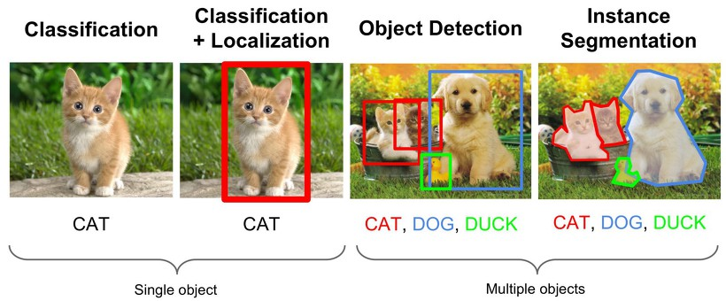

# AIFFEL_58일차 2020.10.19

Tags: AIFFEL_DAILY

### 일정

- [x]  GD 3 lecture : object detection
- [x]  GD 1 proj : Resnet 구현 수정내용 반영하여 다시 학습하고 결과 확인하기

# GD 3 lecture

object detection

Object detection이란 이미지 내에서 물체의 위치와 그 종류를 찾아내는 것.

## **학습 목표**

---

1. 딥러닝 기반의 Object detection 기법을 배워갑니다.
2. Anchor box의 개념에 대해 이해합니다.
3. single stage detection model과 two stage detection 모델의 차이를 이해합니다.

***용어 정리를 다시 한 번 하는 노드!***

## 용어 정리

---

Object detection은 물체의 클래스를 `분류(classification)`할 뿐만 아니라 `위치 측정 (localization)`까지 함께 수행하는 작업.

`Localization`이란 이미지 내에 하나의 물체(Object)가 있을 때 그 물체의 위치를 특정하는 것인데, `Detection`이라 함은 **다수의 물체(Object)**가 존재할 때 **각 Object의 존재 여부를 파악**하고 **위치를 특정하며 클래스 분류(Classification)까지 수행**하는 것.

참고자료

[https://light-tree.tistory.com/75](https://light-tree.tistory.com/75)

[https://medium.com/zylapp/review-of-deep-learning-algorithms-for-object-detection-c1f3d437b852](https://medium.com/zylapp/review-of-deep-learning-algorithms-for-object-detection-c1f3d437b852)

### **Object Detection**

객체 검출 Object detection이란 보편적으로 Classification 과 Localization 이 동시에 수행되는 것을 의미한다. 모델의 학습 목적에 따라서 특정 Object 만 Detection 하는 경우(이 경우 학습시 검출하고자 하는 Object 에 대한 학습정보만 입력한다.)도 있고, 여러개의 객체를 검출하는 Multi object detection 모델을 만들기도 한다. 종종 object deteciton 은 localization 의 의미로만 사용되는 경우도 있다. 이 경우**는 이미지 위에 모델이 학습한 object 위치만 bounding box 로 표현**되고 class 종류는 구분하지 않는 경우이다.

### **Object Recognition**

Object recognition이란 대개의 경우 Object detection 과 같은 의미로 쓰인다. 그러나 detection 은 object 의 존재 유무만 의미하고 recognition 이 object 의 종류를 아는 것이라고 해석하여 object detection 이 object recognition 보다 더 작은 의미로 해석되는 경우도 종종 있다.

### **Semantic Segmentation**

Semantic segmentation이란 Object segmentation 을 하되 같은 class 인 object 들은 같은 영역 혹은 색으로 분할하는 것이다.

⇒ 상의, 하의는 하나씩만 입는다는 가정 하에, 상의, 하의 class 에 해당하는 객체들을 구분해주기.

### **Instance Segmentation**

Instance segmentation이란 semantic segmentation 에서 한발 더 나아가서, 같은 class 이더라도 서로 다른 instance 들을 구분해주는 것이다. [5] 이미지의 네번째 경우와 같이 같은 의자 class 이지만 각각의 의자들이 서로 다른 색으로 segmentation 된 출력을 볼 수 있다.

### 즉, 이미지 위치를 표현하는 두 가지 큰 방법

Bounding Box로 표현하거나, Object Mask로 표현하는 방법이 있습니다.

Detection, Segmentation

### 바운딩 박스

바운딩 박스(Bounding box)는 이미지 내에서 물체의 위치를 사각형으로 감싼 형태의 도형으로 정의하고 이를 꼭지점의 좌표로 표현하는 방식

### 바운딩 박스의 성능 평가 척도

바운딩 박스가 있을 때 우리가 만든 localization 모델이 인식한 결과를 평가하려면 **어떤 지표(metric)를 사용해야할까요?** 각 좌표값의 차이를 **L1이나 L2**로 정의할 수도 있겠지만 이는 박스가 크면 그 값이 커지고 작아지면 그 값이 작아져 **크기에 따라 달라지는 문제**가 생깁니다.

⇒ 면적의 절대적인 값에 영향을 받지 않도록 두 개 박스의 차이를 사앧적으로 평가하기 위한 방법 중 하나가  ***IoU(Intersection over Union)***

⇒ 말 그대로, 교차하는 영역을 합친 영역으로 나눈 값.

빨간색 영역(Prediction과 GT이 겹치는 영역) / 회색 영역 (Prediction과 GT를 합친 영역)

 

## Localization

---

### Target Label

localization을 위해 박스의 위치를 표현할 output 노드 4개를 convolution layer로 구성된 백본 네트워크 다음에 추가해야 합니다.

$p_c$ 는 물체가 있을 확률. 물체가 있을 때 $c_1 \cdot c_2 \cdot c_3$ 는 각각 클래스 1,2,3 에 속할 확률.

$p_c$ 가 0일 경우는 배경인 경우를 말하는 것.

필요에 따라 $c_1 \cdot c_2 \cdot c_3$ 와 $p_c$ 를 분리하여 다른 활성화 함수를 적용하고 손실을 계산할 수 있음.

그리고 Bbox를 정의하기 위한 4개의 노드가 추가됨. Bbox 좌측 상단의 점의 위치와 Bbox 폭과 높이로 박스를 표현. 따라서 $b_x,b_y$ 는 좌측상단의 점을 표현하는 x축과 y축의 좌표. $b_h$ 와 $b_w$ 는 바운딩 박스의 높이와 폭이 된다.

단, b 값들은 모두 입력 이미지의 너비, 높이로 각각 Normalize 된 상대적인 좌표와 높이,폭으로 표시된다.

참고자료 : [https://www.youtube.com/watch?v=GSwYGkTfOKk&feature=youtu.be](https://www.youtube.com/watch?v=GSwYGkTfOKk&feature=youtu.be)

$[1, x_1/w, y_1/h, (y_1-y_2)/h, (x_2-x_1)/w]$

## Detection (1) 슬라이딩 윈도, 컨볼루션

---

### 슬라이딩 윈도우(Sliding Window)

전체 이미지를 적당한 크기의 영역으로 나눈 후에, 각각의 영역에 대해 이전 스텝에서 만든 Localization network를 반복 적용해 보는 방식.

마치 컨볼루션(Convolution)의 커널이 슬라이딩하는 것처럼 이해

[https://www.youtube.com/watch?v=5e5pjeojznk&feature=emb_logo&ab_channel=Deeplearning.ai](https://www.youtube.com/watch?v=5e5pjeojznk&feature=emb_logo&ab_channel=Deeplearning.ai)

### 컨볼루션(Convolution)

Sliding window의 단점인 연산량과 속도를 개선하기 위한 방법 중 하나는 Sliding window 대신 **convolution**을 사용하는 것.

위 그림에서 14X14 크기의 입력에 대해 convolution을 수행했을 때 최종적으로 얻어지는 1X1 사이즈의 출력을 sliding window 영역의 localization 결과라고 해석한다면, 거꾸로 14X14 크기의 receptive field가 바로 sliding window 영역이 되는 효과가 있다.

그러나 sling window에 localization을 수행하는 방식처럼 순차적으로 연산이 실행되는 게 아니라 병렬적으로 동시에 진행되므로 convolution은 속도면에서 훨씬 효율적.

결과적으로 Sliding window를 한번에 Convolution으로 연산을 할 수 있음.

이전 스텝에서 localization을 위한 output이 flat vector 형태로 생성되었다면, convolution의 결과로 얻어지는 1x1 형태의 output도 동일하게 localization 결과로 대체될 수 있을 것.

Q. 16x16의 input image를 생각할 때 output에서는 4개의 Bounding box를 얻게 됩니다. 이때 각각의 Bounding box의 좌표는 모두 같은 원점을 기준으로한 것일까?

내 답 : 아니다. 처음 conv가 이루어지는 각 지점이 있기 때문에, 다를 것이다.

***예시답안***

- 서로 다른 원점을 기준으로 좌표가 학습됩니다.Window가 sliding함에 따라서 window 내에서 물체의 위치는 바뀌게 됩니다.
- 이때 물체를 표기 하기 위한 bounding box의 원점은 window의 좌측 상단이 원점이 됩니다.

***참고자료***

[https://www.youtube.com/watch?v=XdsmlBGOK-k&feature=emb_logo](https://www.youtube.com/watch?v=XdsmlBGOK-k&feature=emb_logo)