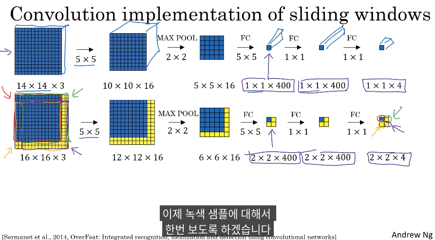

# AIFFEL_59일차 2020.10.20

Tags: AIFFEL_DAILY

### 일정


- [x]  GD3 Lecture 마저 끝내기
- [x]  영배스4 준비
- [x]  LMS E-20

# GD3 Lecture

Object Detection


### Convolution

***참고자료***

[https://www.youtube.com/watch?v=XdsmlBGOK-k&feature=emb_logo](https://www.youtube.com/watch?v=XdsmlBGOK-k&feature=emb_logo)

turning FC layer into convolutional layers

convolution implementation of sliding windows



2x2x400 feature map 에서, 왼쪽 상단은 왼쪽 상단 꼭지점쪽에서 14x14 영역을 대표하는 것.

네 가지 입력 이미지에 대해서 독립적인 forward pass를 하는 것이 아니라,

네 가지 경우를 한 가지 계산으로 통합하고 14x14 이미지의 공통 영역에 대한 계산을 공유하는 것.


슬라이딩 윈도우를 사용한다면 순차적으로 14x14 영역을 지나가면서 확인해야겠지만,

convolution을 사용하여 동시에 모든 window 영역에 대한 예측값을 계산할 수 있다!

## Detection(2) 앵커 박스, NMS

---


차 사이에 사람!

한칸에 한가지 물체를 감지하기 때문에 만약 모두 차를 잡게된다면 사람을 놓칠 수 밖에 없습니다.

⇒ 이 상황을 대응하기 위한 것이 ***앵커 박스***

일반적으로 사람은 위아래로 길쭉하고 차는 좌우로 넓다는 특징을 활용하여, 그 특징을 닮은 가상의 박스를 정의한다! ⇒ 데이터의 특성을 활용하여 문제를 해결한다는 발상에서 기반한듯.

차와 사람 클래스에 대해서 물체를 감지하기 위해서는 한 개의 그리드 셀에 대한 결과값 벡터가 물체가 있을 확률, 2개의 클래스, 그리고 바운딩 박스 4개로 총 7개의 차원을 가지게 될 것

따라서 입력값이 16x16일때, 이 그림을 2x2로 총 4칸의 그리드로 나누었다고 하면, 결과값의 형태는 7개의 채널을 가져 2x2x7이 됩니다.

이때 7개의 차원을 한 벌 더 늘려주어 한 개의 물체의 수를 늘려줍니다. 앵커 박스가 두 개가 된다면 결과값의 형태는 2x2x14가 됩니다.

⇒ 잉?? 배경 클래스를 추가해서 2x2x8x2 아닌가??

⇒ 배경을 가정하지 않으면 그냥 2x2x7x2 이니까, 노드 설명에서는 배경 없이 설명한걸로 이해하면 될듯!

참고 자료: [https://www.youtube.com/watch?v=RTlwl2bv0Tg&feature=emb_logo&ab_channel=Deeplearning.ai](https://www.youtube.com/watch?v=RTlwl2bv0Tg&feature=emb_logo&ab_channel=Deeplearning.ai)

n 개의 앵커 박스로 예측을 결합하는 것.

앵커 박스들 중 어떤 앵커 박스가 가장 높은 IOU를 갖는지 확인한다.


앵커 박스는 두 물체가 한 격자 셀에 나타날 경우를 다루는 방법!

앵커 박스가 주는 더 좋은 결과는 learning 알고리즘을 더 전문화 시키는 것.

데이터셋에 길쭉한 물체, 넓적한 물체를 포함한다면, 그런 특징을 가진 이미지를 잘 포착하도록 하는 것!

앵커 박스를 어떻게 고를 것인가?

사람이 직접? 음...ㄴㄴ

YOLO 논문에서는 K-means 알고리즘을 이용하여 그룹짓고 그 그룹을 대표하는 앵커 박스를 구함.


y 의 라벨을 보면 앵커 박스가 2개가 됨에 따라서 output dimension이 두 배가 된 것을 볼 수 있습니다.

그리고 각각은 정해진 Anchor box(차, 사람)에 매칭된 물체를 책임지게 됩니다.

- *바운딩 박스 : 네트워크가 predict한 object의 위치가 표현된 박스로서, 네트워크의 **출력**이다.*
- *앵커 박스 : 네트워크가 detect해야 할 object의 shape에 대한 **가정(assumption**)으로서, 네트워크의 **입력**이다.*

### NMS(Non-Max Suppression)

[https://www.youtube.com/watch?v=VAo84c1hQX8&feature=emb_logo&ab_channel=Deeplearning.ai](https://www.youtube.com/watch?v=VAo84c1hQX8&feature=emb_logo&ab_channel=Deeplearning.ai)

어떤 문제를 한 번이 아니라 여러번 감지할 수도 있는데, NMS 알고리즘이 각 물체를 한 번씩만 감지하게 보장하도록 해준다!

NMS가 감지된 것들을 정리하여 하나의 감지만 남도록 하는 것!

threshold 보다 확률이 낮은 detection을 버린다. 이후, 버려지지 않고 남은 박스들 중 가장 높은 확률을 갖는 박스를 예측 기준으로 정한다. 정해진 예측 기준의 IOU를 기준으로 다른 박스들을 discard 한다. 

각각의 타겟 클래스에 대해서 NMS를 진행해야함.

겹친 여러 개의 박스를 하나로 줄여줄 수 있는 방법 중 하나가 ***NMS(non-max suppression)***

NMS는 겹친 박스들이 있을 경우 **가장 확률이 높은 박스**를 기준으로 IoU 를 측정하여, threshold 이상인 것들을 없앱니다. 이때 IoU를 기준으로 없애는 이유는 **어느 정도 겹치더라도 다른 물체가 있는 경우가 있을 수 있기 때문**입니다. 이때 Non-max suppression은 같은 class인 물체를 대상으로 적용하게 됩니다.

IOU 값이 더 크다 : 더 많이 겹쳐있다는 의미 ⇒ IOU 임계값을 더 높게 잡을수록, 더 많은 박스가 살아남게 된다. 겹침의 가능성을 더 열어준거니까!

## Detection Architecture

---

딥러닝 기반의 Object Detection 모델은 크게 **Single stage detector**와 **Two stage detector**


- Many Stage : 물체가 있을 법한 위치의 후보를 뽑아내고, 이후 실제로 물체가 있는지 구분, 그리고 정확한 Bbox 구하는 단계가 분리되어있음.
- One state : 객체 검출, 분류, Bbox 구하기까지 한 번에 다 하기. 한꺼번에 다 하니까 속도 측면에서 더 빠르겠지?

대표적인 Two-stage detector인 Fast R-CNN => Faster R-CNN의 변천사와 One-stage detector인 YOLO 및 SSD를 살펴보도록 하겠습니다.

region proposal 자체는 CV 에서 굉장히 중요하고, 자주 사용되는 개념! 근데, ANdrew Ng 교수님 개인적 견해로는 YOLO 같은 모든 계산을 한 번에 처리하는 것이 더 방향성이 맞지 않나?! 라는 의견.

### Two-state Detector

[Region Proposals]

[https://www.youtube.com/watch?v=6ykvU9WuIws&feature=emb_logo&ab_channel=Deeplearning.ai](https://www.youtube.com/watch?v=6ykvU9WuIws&feature=emb_logo&ab_channel=Deeplearning.ai)

Fast R-CNN 은 R-CNN 에 sliding window을 convolution으로 구현한 아이디어를 적용한 것.

Faster R-CNN은 proposal을 만드는 것 자체에 convolution을 사용.

***R-CNN***


R-CNN은 물체가 있을 법한 **후보 영역을 뽑아내는 "Region proposal"** 알고리즘과 **후보 영역을 분류하는 CNN**을 사용.

R-CNN의 경우 region proposal을 selective search로 수행한 뒤 약 2,000개에 달하는 **후보 이미지 각각에 대해서 컨볼루션 연산을 수행**하게 됩니다. 이 경우 한 이미지에서 특성을 반복해서 추출하기 때문에 비효율적이고 느리다는 단점

***Fast R-CNN***


후보 영역의 classification과 바운딩 박스 regression을 위한 특성을 한 번에 추출하여 사용

이미지를 잘라내는 것이 아니라 해당 부분을 CNN을 거친 특성 맵(Feature Map)에 투영해, 특성 맵을 잘라낸다.

이미지를 잘라 개별로 CNN을 연산하던 R-CNN과는 달리 한 번의 CNN을 거쳐 그 결과물을 재활용할 수 있으므로 연산 수를 줄일 수 있다.

이때 잘라낸 특성 맵의 영역은 여러 가지 모양과 크기를 가지므로, 해당 영역이 어떤 클래스에 속하는지 분류하기 위해 사용하는 fully-connected layer에 배치(batch) 입력값을 사용하려면 **영역의 모양과 크기를 맞추어 주어야 하는 문제**가 생깁니다. 논문에서는 **RoI(Region of Interest) pooling**이라는 방법을 제안해서 **후보 영역에 해당하는 특성을 원하는 크기가 되도록 pooling하여 사용.**


***Faster R-CNN***


Fast R-CNN은 반복되는 CNN 연산을 크게 줄여냈지만 **region proposal 알고리즘이 병목**

Faster R-CNN은 Fast R-CNN구조에서 conv feature map과 RoI Pooling사이에 RoI를 생성하는

Region Proposal Network가 추가된 구조

기존의 Fast R-CNN을 더 빠르게 만들기 위해서 region proposal 과정에서 RPN(Region Proposal Network)라고 불리는 신경망 네트워크를 사용

이미지 모델을 해석하기 위해 많이 사용하는 **CAM(Classification Activation Map)**에서는 물체를 분류하는 태스크만으로도 활성화 정도를 통해 물체를 어느 정도 찾을 수 있습니다. 이처럼 먼저 이미지에 CNN을 적용해 특성을 뽑아내면, 특성 맵만을 보고 물체가 있는지 알아낼 수 있습니다. 이때 **특성맵을 보고 후보 영역들을 얻어내는 네트워크가 RPN**입니다. 후보 영역을 얻어낸 다음은 Fast R-CNN과 동일.

Q. Faster R-CNN은 Regrion proposal network를 통해 (1) 정확도는 낮지만 많은 candidate box들을 얻어냅니다. 그리고 (2) 이를 고정된 크기로 만들어서 Box head의 classifier나 regressor를 통해 물체의 class를 판별하고 더 나은 box를 만들어내는데요. (3) 이때 다양한 candidate box들을 **고정된 크기로 만들어줄 때 어떤 연산을 사용하게** 될까요? 그리고 해당 연산이 어떻게 고정된 크기의 feature를 만들어내는지 설명해주세요.

이때 사용하는 방법은 **RoI Pooling**입니다. RoI pooling은 **미리 정해둔 크기가 나올 때까지 pooling연산을 수행하는** 방법입니다. 이를 통해서 다양한 크기의 candidate box를 feature map에서 잘라내어 같은 크기로 만들어낼 수 있게 됩니다.

### One-Stage Detector


YOLO는 이미지를 그리드로 나누고, 슬라이딩 윈도 기법을 컨볼루션 연산으로 대체해 Fully Convolutional Network 연산을 통해 그리드 셀 별로 바운딩 박스를 얻어낸 뒤 바운딩 박스들에 대해 NMS(Non-Max Suppression)를 한 방식.

참고 자료

[YOLO Algorithm]

[https://www.youtube.com/watch?v=9s_FpMpdYW8&feature=emb_logo&ab_channel=Deeplearning.ai](https://www.youtube.com/watch?v=9s_FpMpdYW8&feature=emb_logo&ab_channel=Deeplearning.ai)

conv 이후 NMS 적용


Q. YOLO의 output은 7x7x30의 크기를 가집니다. 앞서 확인한 바와 같이 7x7은 grid의 크기를 의미하게 됩니다. 그렇다면 30은 어떻게 만들어진 숫자??


Bounding box를 표현하는데에는 object가 있을 확률과 x,y,w,h 4개로 총 5의 크기를 갖습니다. **이러한 Box를 두개( grid 마다 2개잖아 ㅇㅇ)** 를 인식하므로 Box를 예측하는데에 10의 크기를 가집니다. 나머지는 20가지의 Class를 의미합니다**. Grid cell이 어떤 class의 물체가 포함된 영역인지 예측할때 20가지의 class 중에서 classification하는 문제로 풀게 됩니다.**

SSD(Single-Shot Multibox Detector)


CNN에서 뽑은 특성 맵의 한 칸은 생각보다 큰 영역의 정보를 담게 됩니다. 여러 컨볼루션 레이어와 pooling을 거치기 때문에 한 특성 맵의 한 칸은 최초 입력 이미지의 넓은 영역을 볼 수 있게 되는데요.

YOLO의 경우 이 특성이 담고 있는 정보가 넓은 영역을 커버하기 때문에 **작은 물체를 잡기에 적합하지 않습니다.** 이러한 **단점을 해결하고 다양한 크기의 특성 맵을 활용하고자 한 것**이 **SSD**

SSD는 위의 모델 아키텍쳐에서 볼 수 있듯이 다양한 크기의 특성 맵으로부터 classification과 바운딩 박스 regression을 수행.

[https://yeomko.tistory.com/20](https://yeomko.tistory.com/20)

**Fully Convolution Network에서 처럼 앞단 컨볼루션 피쳐맵을 끌어와 사용하여 detail을 잡아내고**

**Faster RCNN의 anchor 개념을 가져와 다양한 형태의 object들도 잡아낼 수 있도록 한다.**


SSD는 Yolo와 달리 컨볼루션 과정을 거치는 중간 중간 피쳐맵들에서 모두 Object Detection을 수행

SSD는 먼저 300x300 크기의 이미지를 입력받아서 이미지 넷으로 pretrained된 VGG의 Conv5_3층까지 통과하며 피쳐를 추출합니다. 그 다음 이렇게 추출된 피쳐맵을 컨볼루션을 거쳐 그 다음 층에 넘겨주는 동시에 Object Detection을 수행.


VGG 통과하며 얻은 피쳐맵을 대상으로 쭉쭉 컨볼루션을 진행하여 최종적으로는 1x1 크기의 피쳐맵까지 뽑습니다. 그리고 각 단계별로 추출된 피쳐맵은 Detector & Classifier를 통과시켜 Object Detection을 수행.

가장 큰 차이는 여러 Feature map에서 detection을 위한 classification과 regression을 수행하는 점입니다. 이를 통해 앞단에서 Low level Feature를 활용하여 작은 물체를 잡아낼 수 있고 뒷단에서는 좀더 큰 영역을 볼 수 있게 됩니다.

## Anchor

---

### Matching

YOLO와 Faster-RCNN에서 Anchor를 기반으로 Loss를 계산하는 방식에는 두가지 Intersection over Union(IoU)를 threshold로 사용합니다. 하나는 **Background IoU threshold** 그리고 다른 하나는 **Foreground IoU threshold**

객체와의 IoU가 0.7이상일 경우 Foreground로 할당하고 0.3 이하일 경우는 배경으로 할당.

0.3과 0.7 중간인 Anchor들은 어떻게 될까요? 이러한 Anchor는 불분명한 영역으로 학습에 활용 안함.

탐지하고자 하는 물체에 따라서 Anchor box의 크기나 aspect ratio를 조정해주어야 합니다.

만약 세로로 긴 물체를 주로 탐지해야 하면 세로로 긴 Anchor box를 많이 만들고 Matching되는 box를 늘려야 학습이 잘될 수 있습니다.

***Anchor가 더 많을수록 항상 좋은건가??***

Anchor를 많이 둘 수록 더 많은 Anchor가 물체를 Detection하도록 동작하므로 더 좋은 Recall을 얻을 수 있습니다. 하지만 적절하지 않은 Anchor는 틀린 Detection 결과를 만들어낼 수 있고 이는 전체적인 성능을 낮출 수 있습니다. 또한 Anchor가 늘어나면 그만큼 더 많은 메모리와 연산을 필요로 하기 때문에 적절한 Anchor의 선정이 필요합니다.

### ***Bounding Box Regression***


Anchor box는 물체를 예측하기 위한 기준이되는 Box.

그럼 Anchor box에서 Bounding box는 어떤 식으로 계산??

YOLO의 접근 방식을 기준으로 설명.

각 Anchor Box에 대응되는 network는 $t_w,t_y,t_w,t_h$ 의 output으로 bounding box를 regression해서 정확한 box를 표현함. 기존의 Anchor box의 좌측 상단이 $c_x,c_y$ 이고 width, height가 $p_w,p_h$  임.

이를 얼마나 x축 또는 y축 방향으로 옮길지 그리고 크기를 얼마나 조절해야하는지를 예측하여 물체의 bounding box를 추론하게 됨.

# 영배스4 준비: 뱅크샐러드


[영배스4: 뱅크샐러드](https://www.notion.so/4-e1cf3105c5b14c0d9146d81f1082c235)

# [E-20] 어라, 이 시계열 데이터 이상한데?

***Anomaly Detection***

시계열 데이터에서 이상한 부분을 찾아내는 이상치 탐색(Anomaly Detection)


## **학습 목표**

---

- 시계열 데이터의 이상치의 개념을 이해한다
- 다양한 방법으로 이상치를 탐색해본다
- 발견한 이상치를 처리하는 방법을 알아본다.

머신러닝 분야에는 "Garbage in, Garbage out"이라는 말이 있어요. 엉망인 데이터로 모델을 만들면 엉망인 결과가 나온다는 뜻으로, 분석 데이터가 얼마나 중요한지 알려주는 격언.

시계열 데이터 속에서 (1)**이상치의 의미**를 파악하고, **(2)똑똑하게 찾아내는 방법**을 알아보고 (3)**이상치를 처리하는 방법**

## 이상한 데이터는 어떻게 생겨났을까?

---

만약 빨간 사람은 존재하지않고 단순한 데이터 오류라면, 모델은 빨간 사람 데이터를 학습하지 않는 편이 더 좋을거에요. 한번이라도 빨간 사람을 학습하면, 특정 경우에는 사람의 색깔이 빨간색이라고 예측할 수 있고, 그건 늘 틀린 답일테니까요.


### 데이터를 100% 믿어서는 안된다!

[1] 생성, 측정 단계

- 관측자의 실수 (휴먼에러)
- 측정 장비의 오류

[2] 수집, 전달 단계

- 데이터 수집 프로그램의 오류 (버그)
- 데이터 관리자의 실수 (휴먼에러)
- 데이터 전달 프로그램의 오류 (Open API)

***실무에서 가장 흔한 데이터 오염은 데이터 관리자에 의해 발생한다!***

⇒ 직접 raw 데이터부터 DB까지 뜯어보며 해결할 수 있는 문제가 아니라면 해결하기도 가장 까다로운 문제

모든 위험을 벗어나도 Open API 설계에 오류가 있다면, 우리가 수집한 데이터에는 이상한 값이 들어있을 거에요. (Open API는 null 값을 0으로 반환하는 버그가 가장 흔해요.)

### 그러면, 이상한 데이터는 어떻게 찾아내는가?? Anomaly Detection

위에 제시된 오류들을 막기 위해 데이터 파이프라인 관리자들이 노력한다.

> 대부분의 데이터는 참이고, 이상한 데이터는 극히 일부일 것이다.

이런 전제를 세워볼 수 있음.

어떻게 이상한 데이터를 찾나? 세 가지 큰 흐름

- 다시 측정한다
- 같은 데이터의 다른 출처를 찾아서 비교한다 (Supervised)
- 데이터 스스로의 특징을 활용해서 찾아낸다 (Unsupervised)

대부분의 경우에는, 다른 출처가 없어서, Unsupervised 방법을 쓰게 될 거에요. 대부분의 데이터는 참이라는 전제하에 이상한 데이터를 찾아내는 거지요.

1. 데이터 스스로의 특징을 분석해요.
2. 특정 기준보다 '더 이상한' 데이터를 이상치로 분류해요.

## 신입 데이터 분석가가 되어보자

---

```python
import requests
import os

# 아래 url은 yahoo finance 서버에 우리나라 코스피 데이터를 요청하는 주소입니다.
url = "https://query1.finance.yahoo.com/v7/finance/download/%5EKS11?period1=867715200&period2=1597276800&interval=1d&events=history"

# 데이터를 요청하고 그 결과를 response로 받습니다.
response = requests.get(url)

csv_file = os.getenv('HOME')+'/aiffel/anomaly_detection/kospi/kospi.csv'

# response 의 컨텐츠를 csv로 저장합니다.
with open(csv_file, "w") as fp:  
    fp.write(response.text)
```

```python
# 저장한 csv를 읽어옵니다.
import pandas as pd
df = pd.read_csv(csv_file)
df.head(2)
```

```python
# 날짜데이터를 Datetime 형식으로 바꿔줍니다.
df.loc[:,'Date'] = pd.to_datetime(df.Date)

# 데이터의 정합성을 확인합니다
df.isna().sum()
```

⇒ 결측치가 150개 있더라!

- 결측치 주변의 데이터를 이용하여 보간(interpolation)
- 삭제하는 방법
- 평균값 등 통계치를 이용한 방법
- 다른 분포를 통해 예측하는 방법
- 등등...

일단 삭제 ㄱㄱ

```python
print("삭제 전 데이터 길이(일자수):",len(df))
df = df.dropna(axis=0).reset_index(drop=True)

print("삭제 후 데이터 길이(일자수):",len(df))
df.isna().sum()
```

```python
import matplotlib.pyplot as plt
from matplotlib.pylab import rcParams

plt.rcParams["figure.figsize"] = (12,5)
# Line Graph by matplotlib with wide-form DataFrame

plt.plot(df.Date, df.Close, marker='s', color='r')
plt.plot(df.Date, df.High, marker='o', color='g')
plt.plot(df.Date, df.Low, marker='*', color='b')
plt.plot(df.Date, df.Open, marker='+', color='y')

plt.title('KOSPI ', fontsize=20) 
plt.ylabel('Stock', fontsize=14)
plt.xlabel('Date', fontsize=14)
plt.legend(['Close', 'High', 'Low', 'Open'], fontsize=12, loc='best')

plt.show()
```

데이터를 한 번 그려보니, 이상한 데이터가 들어가있는 부분이 있다!


spike를 관찰할 수 있다. (음푹 꺼진 부분은 dip)

## Outlier/Novelties 구분하기

---

### Outlier 극단치

통계적 자료분석의 결과를 왜곡시키거나, 재료분석의 적절성을 위협하는 변수값 또는 사례

***일반적으로 단변량 분석의 결과로 찾아낼 수 있으며, 교정하지 않으면 자료분석에 방해가 된다!***

특히, 비정삭적인 데이터 수집과정에 의한 극단치는 원본 데이터를 교정하여 없애는걸 권장.

- 참값으로 대체하거나
- 보간으로 대체하거나
- 삭제해야 합니다.

위의 KOSPI 지수 예시에서는 다른 IT업체에서 제공하는 데이터를 통해 검증하고 대체 가능.

### Novelties, 특이치

정상적인 수집과정에 의한 이상치. 이전까지는 보지못한 패턴이나 데이터

이치는 우리가 모르는 도메인의 변화를 시사해요. 특이치는 일반적으로 다변량 분석의 결과로 탐색가능.

특이치는 극단치와 다르게 원본 데이터를 수정하지 않습니다.

나중에 특이치가 또 발생하면 모델이 대처해야하거든요!


하얀 호랑이라는 것이 아무리 처음 관찰되었다고 해도, 호랑이의 범주에 들어가기 때문에 특이치로 취급되어야 한다!

***간단 요약***

- 이상치Anomailies = 극단치Outlier + 특이치Novelites
- 극단치는 제거해야 모형에 좋습니다.
- 특이치는 남겨둬야 모형에 좋습니다.

***극단치와 특이치의 구분은 같은 방법으로 하는가?***

분석자의 주관이나 데이터의 도메인(분야)에 따라 조금씩 달라요. 결국 그 데이터 범주의 경계선을 어디에 그었느냐의 문제가 귀결될 것이기 때문에, 해당 도메인의 지식이 중요하게 취급된다.

⇒ [ex]우리가 다뤘던 주식데이터에서도 만약 Open/Low/Close/High 등 데이터의 의미를 모르고 분석했다면 2020-05-06일 이상치를 찾아낼 수 있었을까요??

참고자료 : [https://hoya012.github.io/blog/anomaly-detection-overview-1/](https://hoya012.github.io/blog/anomaly-detection-overview-1/)

## 전통적인 방법으로 이상데이터를 찾아보자!

---


데이터가 '정규분포'를 따를 때 사용가능한 신뢰구간으로 이상치를 탐색해보자.

데이터가 정규분포를 따를 때, 표준편차($\sigma$) 의 배수로 신뢰구간의 상한과 하한을 결정한다.

신뢰구간을 벗어나는 데이터는 일반적인 분포에서 벗어나는 '이상치'로 의심할 수 있다.

- (2σ를 기준으로 판단하면) 95.5%는 정상데이터, 4.5%는 이상치,
- (3σ를 기준으로 판단하면) 99.7%는 정상데이터, 0.27%는 이상치로 분류할 수 있어요

신뢰구간 분석을 통해 이상치를 찾아내는 방법은 데이터가 정규분포를 따를 때만 쓸 수 있는 것은 아니랍니다. 데이터가 t-분포 등 **특정 확률분포에 피팅이 된다면 그 확률분포의 신뢰구간 결정방법을 적용**할 수 있다.

- 정규분포를 따르는지 확인하는 방법 : z-test
- 시계열 데이터 중에서 정규분포에 가까운 데이터를 뽑아내는 방법 : Time series decomposition

```python
from statsmodels.stats.weightstats import ztest
_, p = ztest(df.Close)
print(p)
```

0.0나옴...

⇒ p가 0.05 이하로 나왔으면 normal distribution과 거리가 멀다는 뜻

⇒ '정규분포'를 가정한 통계적 추정이 어렵다!

### Time Series Decomposition : 시계열 데이터 중에서 정규분포에 가까운 데이터를 뽑아내는 방법

Time series decomposition을 통해 시계열 데이터는 3가지 성분으로 분리되고, 그중 Residual 데이터는 Stationary에 가까운 형태를 가져요.

그리고 Stationary(정상성)에 가까운 데이터는 정규분포를 따르지요! 우리는 이 Residual 데이터를 사용해서 신뢰구간을 구할 수 있어요.

참고자료: [https://rfriend.tistory.com/510](https://rfriend.tistory.com/510)

**시계열 분해(time series decomposition)** 를 통해 시계열 자료를 추세(순환)(Trend), 계절성(Seasonality), 잔차(Residual)로 분해

시계열 분해 후에 추세와 계절성을 제외한 잔차(residual, random/irregular factor)가 특정 패턴 없이 무작위 분포를 띠고 작은 값이면 추세와 계절성으로 모형화가 잘 되는 것. 시계열 자료의 특성을 이해하고 예측하는데 활용할 수 있다. 만약 시계열 분해 후의 잔차에 특정 패턴 (가령, 주기적인 파동을 그린다거나, 분산이 점점 커진다거나 등..) 이 존재한다면 잔차에 대해서만 다른 모형을 추가로 적합할 수도 있다.

코스피 데이터 가져와서 보여보기.

```python
from statsmodels.tsa.seasonal import seasonal_decompose
result = seasonal_decompose(df.Close, model='additive', two_sided=True, 
                            period=50, extrapolate_trend='freq') # 계절적 성분 50일로 가정
result.plot()
plt.show()
```

```python
#그래프가 너무 작아서 안보인다면

fig, axes = plt.subplots(ncols=1, nrows=4, sharex=True, figsize=(12,9))
result.observed.plot(ax=axes[0], legend=False)
axes[0].set_ylabel('Observed')
result.trend.plot(ax=axes[1], legend=False)
axes[1].set_ylabel('Trend')
result.seasonal.plot(ax=axes[2], legend=False)
axes[2].set_ylabel('Seasonal')
result.resid.plot(ax=axes[3], legend=False)
axes[3].set_ylabel('Residual')
plt.show()
```


```python
# seasonal 성분은 너무 빼곡하게 보이네요. 다시 확인해보겠습니다.
result.seasonal[:100].plot()
#-8 에서 10 사이를 주기적으로 반복하는게 보이네요.
```


### Time series decompose 결과에서 무엇을 알 수 있는가?

- 우리는 정규분포에서 표준편차를 이용한 이상치 인식을 사용하고 싶었어요
- 추세Trend 와 계절적 성분Seasonal을 뽑아내고 남은 잔차Residual를 볼까요?
- 잔차는 평균 0을 기준으로 분포하고 있어요!
- ***잔차가 큰 날은 뭔가 일반적인 추세나 계절성에서 벗어난 날로 해석***되겠죠?
- 그럼 Residual의 분포를 그려보자!

```python
fig, ax = plt.subplots(figsize=(9,6))
_ = plt.hist(result.resid, 100, density=True, alpha=0.75)
```


오.. 뭔가 정규분포처럼 생겼다!

```python
r = result.resid.values
st, p = ztest(r)
print(st,p)
```

⇒ 0.6804023554131795 0.4962497300226193

***p-value가 0.05 이상으로 아주 강하게 나타난다! 즉, 데이터 분포가 정규분포를 잘 따르고 있다!***

Q. time series decompose 에서 two_sided 인자의 의미

The moving average method used in filtering. If True (default), a centered moving average is computed using the filt. If False, the filter coefficients are for past values only.

Trend 성분을 만들기 위해 freq 길이에 해당하는 샘플이 필요합니다. 이걸 rolling window로 만들어냅니다.
우리의 예제에서는 period=50 이기 때문에
two_sided=True라면 049번째 데이터로 25번째 Trend값을, 150번째 데이터로 26번째 Trend값을 생성합니다
two_sided=False라면 049번째 데이터로 50번째 Trend값을, 150번째 데이터로 51번째 Trend값을 생성합니다.

Q. . time series decompose 에서 extrapolate_trend 인자의 의미

If set to > 0, the trend resulting from the convolution is linear least-squares extrapolated on both ends (or the single one if two_sided is False) considering this many (+1) closest points. If set to ‘freq’, use freq closest points. Setting this parameter results in no NaN values in trend or resid components.

위의 Trend 성분을 만들기 위한 rolling window 때문에 필연적으로 trend, resid에는 Nan 값이 발생합니다
우리의 예제에서는 period=50 이기 때문에 two_sided=True라면 맨앞에서 25개, 맨뒤에서 25개가 Nan이고, two_sided=False라면 맨앞에서 50개가 Nan입니다. **이렇게 발생하는 Nan 값을 채워주는 옵션이 extraplate_trend** 입니다 이 옵션을 빼면 Trend와 Resid에 Nan 값들이 생깁니다.

Additive decompose 는 Observed[t] = trend[t] + seasonal[t] + resid[t] 이다.

multiplicative decompose 는 trend[t] * seasonal[t] * resid[t] 이다. (여기에 로그를 취하면 결과적으로 additive와 동일한 결과를 얻을 수 있다.)

### **3σ 기준 신뢰구간으로 이상치 찾기**

```python
# 평균과 표준편차 출력
mu, std = result.resid.mean(), result.resid.std()
print("평균:", mu, "표준편차:", std)

# 3-sigma(표준편차)를 기준으로 이상치 판단
print("이상치 갯수:", len(result.resid[(result.resid>mu+3*std)|(result.resid<mu-3*std)]))

df.Date[result.resid[
    (result.resid>mu+3*std)|(result.resid<mu-3*std)].index]
```

⇒ 2008년 금융위기 때와 2020년 코로나 위기가 있던 시기가 많이 잡힌다!

⇒ 이렇게 발견된 이상치는 특이치(novelty)라고 볼 수 있을 것 같다.

근데, 위에서 이상치를 찾아본건, 종가 기준으로만 찾아본거! 다른 기준으로 찾아보면 또 다른 내용을 발견할 수 있을 것이다!

다양한 데이터로 더 그럴싸한 Anomalies를 찾아낸 다음, 노가다를 최소한으로 하는 방법을 **Multi-variable Anomaly Detection**

- Clustering : 클러스터링으로 묶으면 정상인 데이터끼리 이상한 애들끼리 그룹핑되니 이상한 그룹을 찾는다.
- Forecasting : 시계열 예측모델을 만들어서, 예측오차가 크게 발생하는 지점은 이상한 상황이다. 일반적으로 Auto-Encoder로 탐색한다.

## 클러스터링으로 이상치 찾기 : K-means와 DBSCAN

---

Trend, Seasonal 성분을 제거해야 정말 '튀어나오는' 데이터를 찾아낼 수 있다.

Open, High, Low, Close, Volume 5가지 데이터를 모두 전처리를 해주자! (time series decompose)

```python
# 데이터 전처리
def my_decompose(df, features, freq=50):
    trend = pd.DataFrame()
    seasonal = pd.DataFrame()
    resid = pd.DataFrame()
    
    # 사용할 feature 마다 decompose 를 수행합니다.
    for f in features:
        result = seasonal_decompose(df[f], 
                                    model='additive', period=freq, extrapolate_trend=freq)
        trend[f] = result.trend.values
        seasonal[f] = result.seasonal.values
        resid[f] = result.resid.values
        
    return trend, seasonal, resid

# 각 변수별 트렌드/계절적/잔차
tdf, sdf, rdf = my_decompose(df, features=['Open','High','Low','Close','Volume'])
tdf.describe()
```

```python
rdf.describe()
```

⇒ 수치 확인해보면 Volume 혼자서 너무 숫자가 크다!

⇒ 그냥 이 상태로 사용하면, Volume이 가장 중요하게 반영되겠지!

⇒ 이렇게 한쪽에 쏠리는 것을 제외하기 위해 각 변수를 표준정규화 해주자!

```python
# 표준정규화
from sklearn.preprocessing import StandardScaler

scaler = StandardScaler()
scaler.fit(rdf)
print(scaler.mean_)
norm_rdf = scaler.transform(rdf)
norm_rdf
```

### **K-means 와 DBSCAN**

- k-means 와 DBSCAN 은 대표적인 unsupervised clustering 알고리즘이에요.
- 입력된 데이터들을 유사한 몇개의 그룹으로 분류해줍니다.
- k-means 은 몇개의 그룹으로 묶는지 지정할 수 있는 반면, DBSCAN은 지정할 수 없어요.

### k-means로 이상치 탐색

그룹을 2개로 지정해서 정상 데이터그룹과 이상치 데이터그룹으로 나누어본다.

```python
from sklearn.cluster import KMeans

kmeans = KMeans(n_clusters=2, random_state=0).fit(norm_rdf)
print(kmeans.labels_) # 분류된 라벨은 이렇게 kemans.labels_ 로 확인합니다.
```

```python
# 라벨은 몇번 그룹인지 뜻합니다. 
# return_counts=True 를 해서 몇개의 샘플이 몇번 그룹에 할당되었는지 확인해요
lbl, cnt = np.unique(kmeans.labels_,return_counts=True) 
print(lbl) # 0번 그룹, 1번 그룹으로 나뉘어졌네요
print(cnt)
```

⇒ 분석 결과 0번그룹은 2401개의 샘플, 1번그룹은 3291개의 샘플로 분류됐어요.

⇒ 한쪽을 이상치 그룹이라고 선택하기에는 너무 많이 분류됐다!

그룹의 수를 늘려서 진행해보자!

```python
from sklearn.cluster import KMeans

kmeans = KMeans(n_clusters=15, random_state=0).fit(norm_rdf)
lbl, cnt = np.unique(kmeans.labels_,return_counts=True,)
['group:{}-count:{}'.format(group, count) for group, count in zip(lbl, cnt)]
```

```python
['group:0-count:1069',
 'group:1-count:300',
 'group:2-count:210',
 'group:3-count:2',
 'group:4-count:539',
 'group:5-count:1011',
 'group:6-count:831',
 'group:7-count:851',
 'group:8-count:46',
 'group:9-count:8',
 'group:10-count:2',
 'group:11-count:573',
 'group:12-count:128',
 'group:13-count:67',
 'group:14-count:55']
```

⇒ 3, 9,10 그룹이 그룹 내 count가 10개 밑인 매우 특이한 그룹!

⇒ 이렇게 특이하게 분류된 그룹에 속한 데이터는 유사한 날이 거의 없다는 의미!

⇒ 이상치로 추정할 수 있다. 따라서, 해당 그룹들을 살펴보자

1. 어떤 날들이 분류된건지
2. 각 그룹은 어떤 특징을 갖고 있는지
3. 왜 이상치로 분류된걸까?

1. 어떤 날들이 분류된 것인가?

```python
# 꼭 여러분들의 분류 결과에서 특이 그룹으로 분류된 그룹 번호로 바꿔 주세요. 
df[(kmeans.labels_==3)|(kmeans.labels_==9)|(kmeans.labels_==10)]
```

```python
df.describe()
```

```python
# 2004-04-14 주변 정황
df.iloc[1660:1670]
```

2. 각 그룹은 어떤 특징을 갖고 있는지

```python
# 각 그룹의 중심부는 어떤 값을 가지고 있는지 확인해보겠습니다.
pd.DataFrame(kmeans.cluster_centers_, columns=['Open','High','Low','Close','Volume'])
```

- 다른 그룹들은 거래량 값이 매우 작지만, 2개 그룹의 거래량 수치가 유독 큽니다. 저의 경우 3,10번 그룹이 이 경우입니다.
- 그리고 Open, High, Low, Close의 값이 유독 낮은 그룹이 하나 있습니다. 저의 경우 9번 그룹이 이 경우입니다.

3. 왜 이상치로 분류된걸까?

- 우선, 3번과 10번 그룹의 거래량이 비정상적이다!

그런데 3번 10번 그룹은 거래량이 250,000,000 이상으로 평균 대비 60배 이상 많아요.

3번 10번 그룹의 거래량은 나누기 1000을 해야 정상적인 값이 됩니다.

9번 그룹은 코로나 폭락장으로 인한 이상치!


***여기까지 한 내용 (K-means clustering)***

1. 소수그룹이 형성될 만큼 충분한 그룹수로 클러스터링 한다
2. 소수그룹의 특징을 분석한다
3. 해당 소수그룹들이 이상치인지 추론해본다.

### DBSCAN 으로 이상치 찾기

Density Based Spatial Clustering of Applications with Noise

DBSCAN 알고리즘은 핵심벡터와 일정 거리 ϵ 이내인 데이터 벡터들이 군집(Cluster)을 이루게 하는데, 그러한 군집들과 거리상 동떨어져 군집에 들지 못하는 특이한 데이터들을 노이즈(Noise) 벡터라고 부릅니다.

DBSCAN을 통해 이상치를 찾는 것은 바로 이러한 노이즈 벡터를 찾는 것과 같다.

참고자료 : [https://gentlej90.tistory.com/29](https://gentlej90.tistory.com/29)

K-means 처럼 데이터의 분포를 통해 군집을 정하지 않고, 데이터들의 밀도를 이용한다.

같은 군집내의 데이터들을 밀도가 높게 위치해 있을 것이라는 가정!

두 가지 파라미터 정의가 필요.

(1) 주변 공간에 대한 정의 (2) 그 주변 공간에 몇개의 데이터가 존재해야 군집으로 설정할 것인가

```python
from sklearn.cluster import DBSCAN
clustering = DBSCAN(eps=0.7, min_samples=2).fit(norm_rdf)

# 분류된 라벨들은 이렇게 확인할 수 있어요
print(clustering.labels_)

lbl, cnt = np.unique(clustering.labels_,return_counts=True)
['group:{}-count:{}'.format(group, count) for group, count in zip(lbl, cnt)]
```

```python
['group:-1-count:41',
 'group:0-count:5646',
 'group:1-count:3',
 'group:2-count:2']
```

그룹 -1,1,2 는 소수그룹이라고 볼 수 있다!

## Auto-Encoder를 이용한 이상치 탐색

---

위에서 진행한 방법들의 로직!

1. Time series decomposition 을 이용해 Trend/Seasonal/Residual 값으로 분리한다
2. **Residual 값의 분포**를 이용해서 이상치를 탐지해낸다

### **통계적 방법과 Unsupervised Clustering 기법의 장점**

1. 적은 샘플 수로도 분석이 가능하다 (샘플 수가 50개 이상이면 적용 가능)
2. 하드웨어 제약이 거의 없다

### **통계적 방법과 Unsupervised Clustering 기법의 단점**

1. Time series decomposition에 의존해야한다는 점
2. 분석자의 주관이 필요하다는 단점이 있었습니다.(통계기법:몇 배수의 표준편차?, k-means:몇개 그룹으로 클러스터링?, Time Series decompose: freq는 몇으로?)

***그렇다면 이상치 탐색에 딥러닝을 적용하면 어떻게 될까?!***

### **딥러닝 이상치 탐색의 장점**

1. Time series decompostion 없이 분석 수행이 가능하다
2. Trend, Seasonal 데이터를 포함하고 있기 때문에 Trend, Seasonal의 변화도 이상치로써 탐색이 가능하다.

### **딥러닝 이상치 탐색의 단점**

1. 분석자의 주관이 어느정도 필요하긴 하다 (Threshold, window)
2. 학습에 활용할 만큼 **충분한 데이터가 확보**되어야한다.


### Auto encoder란?

---

- 오토인코더는 인코더와 디코더로 구성됩니다.
- 인코더는 입력데이터로부터 중요한 정보(Compressed Feature Vector)를 뽑아냅니다
- 이 과정에서 입력데이터보다 압축된 형태의 데이터를 얻습니다.
- 디코더는 중요한 정보로 입력데이터와 유사한 형태를 재생성(Generate)합니다.

인코더가 중요한 정보를 '잘'뽑아내면, 디코더는 입력데이터를 거의 똑같이 생성해낼수 있겠죠?

비정상적인 데이터들은 디코더가 똑같이 생성하기 어려울거고!

그래서, 오토인코더를 Anomaly Detection에 사용한다!

즉, 쓰레기를 주면 이상한걸 만들어버리고, 좋은 재료를 줘야만 좋은 결과(원래 재료와 비슷한 결과)를 낼테니... 그 현상을 이용해서 ***Anomaly Detection!***

```python
# 필요한 라이브러리를 불러옵니다

import tensorflow as tf
from tensorflow.keras.preprocessing.sequence import TimeseriesGenerator
from tensorflow.keras.models import Sequential
from tensorflow.keras.layers import Dense, Dropout, LSTM, RepeatVector, TimeDistributed
from tensorflow.keras.losses import Huber
from tensorflow.keras.callbacks import ModelCheckpoint, EarlyStopping

# 모델 재현성을 위해 난수 시드설정을 해줍니다
tf.random.set_seed(777)
np.random.seed(777)
```

### LSTM을 이용한 오토인코더 모델 만들기

일단, 표준정규분포로 데이터 전처리 (StandardScaler 사용)

```python
from sklearn.preprocessing import StandardScaler

# 데이터 전처리 - 하이퍼 파라미터
window_size = 10
batch_size = 32
features = ['Open','High','Low','Close','Volume']
n_features = len(features)
TRAIN_SIZE = int(len(df)*0.7)

# 데이터 전처리
# 표준정규분포화합니다.

scaler = StandardScaler()
scaler = scaler.fit(df.loc[:TRAIN_SIZE,features].values)
scaled = scaler.transform(df[features].values)
```

`keras TimeseriesGenerator` 를 이용해서 간편하게 데이터 셋을 만듭니다

- data : 입력데이터(x)를 넣어줍니다. 우리는 'Open','High','Low','Close','Volume' 5가지 인풋을 사용합니다.
- targets : 출력데이터를 넣어줍니다. 우리는 5가지 인풋 그대로 예측하기 때문에 data와 동일한걸 넣어줍니다.
- length : 몇개의 time_step을 참고할지 입력합니다.
- stride : time_step 사이즈를 결정합니다.

```python
# keras TimeseriesGenerator 를 이용해서 간편하게 데이터 셋을 만듭니다

train_gen = TimeseriesGenerator(
    data = scaled,
    targets = scaled,
    length = window_size,
    stride=1,
    sampling_rate=1,
    batch_size= batch_size,
    shuffle=False,
    start_index=0,
    end_index=None,
)

valid_gen = TimeseriesGenerator(
    data = scaled,
    targets = scaled,
    length = window_size,
    stride=1,
    sampling_rate=1,
    batch_size=batch_size,
    shuffle=False,
    start_index=TRAIN_SIZE,
    end_index=None,
)

print(train_gen[0][0].shape)
print(train_gen[0][1].shape)
```

***모델 만들기***

2개 층의 LSTM으로 인코더 만든다

RepeatVector는 input을 window_size 만큼 복사.

```python
model = Sequential([
    # >> 인코더 시작
    LSTM(64, activation='relu', return_sequences=True, 
         input_shape=(window_size, n_features)),
    LSTM(16, activation='relu', return_sequences=False),
    ## << 인코더 끝
    ## >> Bottleneck
    RepeatVector(window_size),
    ## << Bottleneck
    ## >> 디코더 시작
    LSTM(16, activation='relu', return_sequences=True),
    LSTM(64, activation='relu', return_sequences=False),
    Dense(n_features)
    ## << 디코더 끝
])

model.summary()
```

⇒ 주석을 >>, << 이런식으로 열고 닫는 내용을 보여주는 것이 좋네!

```python
# 체크포인트
# 학습을 진행하며 validation 결과가 가장 좋은 모델을 저장해둠
import os

checkpoint_path = os.getenv('HOME')+'/aiffel/anomaly_detection/kospi/mymodel.ckpt'
checkpoint = ModelCheckpoint(checkpoint_path, 
                             save_weights_only=True, 
                             save_best_only=True, 
                             monitor='val_loss',
                             verbose=1)

# 얼리스탑
# 학습을 진행하며 validation 결과가 나빠지면 스톱. patience 횟수만큼은 참고 지켜본다

early_stop = EarlyStopping(monitor='val_loss', patience=5)

model.compile(loss='mae', optimizer='adam',metrics=["mae"])
```

모델 학습 및 히스토리 저장

```python
hist = model.fit(train_gen, 
          validation_data=valid_gen,
          steps_per_epoch=len(train_gen),
          validation_steps=len(valid_gen),
					verbose = 2,
          epochs=50, 
          callbacks=[checkpoint, early_stop])
```

가중치 가져오기

```python
model.load_weights(checkpoint_path)
```

학습과정 확인

```python
fig = plt.figure(figsize=(12,8))
plt.plot(hist.history['loss'], label='Training')
plt.plot(hist.history['val_loss'], label='Validation')
plt.legend()
```


분석시 주의사항!

- 우리는 시계열 데이터를 window_size 만큼 밀어가면서 예측하는 모델을 만들었어요.
- 그래서 train_gen의 길이는 원본 df의 길이보다 window_size 만큼 짧습니다.
- 예측결과와 비교할때는 scaled의 앞에서 window_size 만큼을 건너 뛰어해야해요.

```python
# 예측 결과를 pred 로, 실적 데이터를 real로 받습니다
pred = model.predict(train_gen)
# scaled 의 앞에서 window_size만큼 건너뛰어서 예측 결과와 비교!
real = scaled[window_size:]

# 예측과 실제의 mean absolute error 계산
mae_loss = np.mean(np.abs(pred-real), axis=1)

# 샘플 개수가 많기 때문에 y축을 로그 스케일로 그립니다
fig, ax = plt.subplots(figsize=(9,6))
_ = plt.hist(mae_loss, 100, density=True, alpha=0.75, log=True)
```


### MAE_loss 가 3 이상으로 동떨어진 샘플이 보이는데??

그 값들이 이상치아닐까?! 생각해볼만한다.

단, scaled 데이터는 스케일링 조정되어있기 때문에 원본 데이터인 df로 비교해야함. 

기존의 df와 mae_loss까지 합쳐서 분석하기 위한 데이터프레임을 새로 하나 만든다

```python
import copy

test_df = copy.deepcopy(df.loc[window_size:]).reset_index(drop=True)
test_df['Loss'] = mae_loss

threshold = 3
test_df.loc[test_df.Loss>threshold]
```

⇒ Clustering으로 찾았던 Volume 이상치 4개를 찾을 수 있었다!

```python
threshold = 0.3
test_df.loc[test_df.Loss>threshold]
```

### **그래프로 그려서 이상치를 찾아봐요**

- Open, Close, Low , High 같은 데이터는 스케일이 비슷하니 한번에 그려도 좋을거에요
- 하지만 Volume과 loss는 스케일이 다르니 각각 그래프를 그려봐요
- 기준치로 분류해낸 이상치들은 붉은 점으로 그려서 나타내요

```python
fig = plt.figure(figsize=(12,15))

# 가격들 그래프입니다
ax = fig.add_subplot(311)
ax.set_title('Open/Close')
plt.plot(test_df.Date, test_df.Close, linewidth=0.5, alpha=0.75, label='Close')
plt.plot(test_df.Date, test_df.Open, linewidth=0.5, alpha=0.75, label='Open')
plt.plot(test_df.Date, test_df.Close, 'or', markevery=[mae_loss>threshold])

# 거래량 그래프입니다
ax = fig.add_subplot(312)
ax.set_title('Volume')
plt.plot(test_df.Date, test_df.Volume, linewidth=0.5, alpha=0.75, label='Volume')
plt.plot(test_df.Date, test_df.Volume, 'or', markevery=[mae_loss>threshold])

# 오차율 그래프입니다
ax = fig.add_subplot(313)
ax.set_title('Loss')
plt.plot(test_df.Date, test_df.Loss, linewidth=0.5, alpha=0.75, label='Loss')
plt.plot(test_df.Date, test_df.Loss, 'or', markevery=[mae_loss>threshold])
```


## 프로젝트 : 다른 시계열 데이터에서 이상치를 찾아보자

---

결과물 : [https://github.com/bluecandle/2020_AIFFEL/blob/master/daily_notes/exploration_codes/e20_code/E20.ipynb](https://github.com/bluecandle/2020_AIFFEL/blob/master/daily_notes/exploration_codes/e20_code/E20.ipynb)