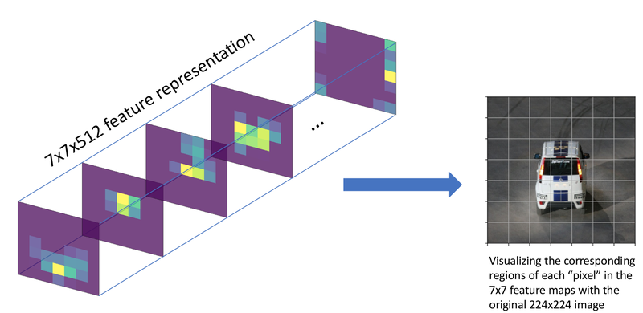

# AIFFEL_60일차 2020.10.21

Tags: AIFFEL_DAILY

### 일정


- [x]  LMS E-20 마무리
- [x]  영배스4
- [x]  GD3 Proj

# LMS E-20 마무리


[https://github.com/bluecandle/2020_AIFFEL/blob/master/daily_notes/exploration_codes/e20_code/E20.ipynb](https://github.com/bluecandle/2020_AIFFEL/blob/master/daily_notes/exploration_codes/e20_code/E20.ipynb)

# 영배스 4


[영배스4: 뱅크샐러드, 뤼이드](https://www.notion.so/4-e1cf3105c5b14c0d9146d81f1082c235)

# GD3 Proj


Detection 모델을 학습시키기 위한 전체 파이프라인을 직접 제작하기에는 많은 시간이 들기 때문에 RetinaNet이라는 1-stage detector를 미리 학습시킨 라이브러리를 활용하도록 하겠습니다.

## **실습 목표**

---

1. 바운딩 박스(bounding box) 데이터셋을 전처리할 수 있습니다.
2. Object detection 모델을 학습할 수 있습니다.
3. Detection 모델을 활용한 시스템을 만들 수 있습니다.

```bash
$ git clone https://github.com/fizyr/keras-retinanet.git
$ cd keras-retinanet && python setup.py build_ext --inplace

$ pip install -r requirements.txt
$ pip install .
```

⇒ 이런거 하기 전에 pip freeze 해서 기존 설치 환경 저장해놓고 진행하는게 좋을듯!

## 자율주행 보조장치 (1) KITTI 데이터셋

---

***자율주행 보조장치 object detection 요구사항***

*1) 사람이 카메라에 감지되면 정지*

*2) 차량이 일정 크기 이상으로 감지되면 정지*

```python
# TensorFlow and tf.keras
import tensorflow as tf
from tensorflow import keras

# Helper libraries
import pandas as pd
import numpy as np
import matplotlib.pyplot as plt
from tqdm import tqdm

import tensorflow_datasets as tfds

import copy
import cv2
from PIL import Image, ImageDraw

# 다운로드에 매우 긴 시간이 소요됩니다. 
import urllib3
urllib3.disable_warnings()
(ds_train, ds_test), ds_info = tfds.load(
    'kitti',
    split=['train', 'test'],
    shuffle_files=True,
    with_info=True,
)

fig = tfds.show_examples(ds_train, ds_info)
```

## 자율주행 보조장치 (2) 데이터 직접 확인하기

---

`ds_train.take(1)`을 통해서 데이터셋을 하나씩 뽑아볼 수 있는 `TakeDataset`을 얻을 수 있습니다.

```python
TakeDataset = ds_train.take(1)
```

```python
for example in TakeDataset:  
    print('--Example--')
    print(list(example.keys())) # example is `{'image': tf.Tensor, 'label': tf.Tensor}`
    image = example["image"]
    filename = example["image/file_name"].numpy().decode('utf-8')
    objects = example["objects"]

print('--objects--')
print(objects)
img = Image.fromarray(image.numpy())
img
```

⇒ 이미지와 라벨을 얻을 수 있군!

위에서 얻은 이미지의 bbox 확인은 어떻게 할까??

우선, KITTI에서 제공하는 데이터셋에 대한 설명

```python
데이터셋 이해를 위한 예시
Values    Name      Description
----------------------------------------------------------------------------
   1    type         Describes the type of object: 'Car', 'Van', 'Truck',
                     'Pedestrian', 'Person_sitting', 'Cyclist', 'Tram',
                     'Misc' or 'DontCare'
   1    truncated    Float from 0 (non-truncated) to 1 (truncated), where
                     truncated refers to the object leaving image boundaries
   1    occluded     Integer (0,1,2,3) indicating occlusion state:
                     0 = fully visible, 1 = partly occluded
                     2 = largely occluded, 3 = unknown
   1    alpha        Observation angle of object, ranging [-pi..pi]
   4    bbox         2D bounding box of object in the image (0-based index):
                     contains left, top, right, bottom pixel coordinates
   3    dimensions   3D object dimensions: height, width, length (in meters)
   3    location     3D object location x,y,z in camera coordinates (in meters)
   1    rotation_y   Rotation ry around Y-axis in camera coordinates [-pi..pi]
   1    score        Only for results: Float, indicating confidence in
                     detection, needed for p/r curves, higher is better.
```

bbox 구현해보기

```python
# 이미지 위에 바운딩 박스를 그려 화면에 표시해 주세요.
def visualize_bbox(input_image, object_bbox):
    input_image = copy.deepcopy(input_image)
    draw = ImageDraw.Draw(input_image)

    # 바운딩 박스 좌표(x_min, x_max, y_min, y_max) 구하기
    width, height = input_image.size
    # [[YOUR CODE]]
    print(object_bbox)
    # object_bbox 여러개가 각각 [x_min,x_max,y_min,_y_max] 
    # 형태로 list에 담겨있다. 
    # objects['bbox'] 자체는 (n,4) 형태의 tensorflow tensor임!
    # 근데, 아래 함수 호출할 때, numpy() 로 변경해서 들어온거.
    
    print(object_bbox[:,1])
    
    x_min = object_bbox[:,1] * width
    x_max = object_bbox[:,3] * width
    y_min = height - object_bbox[:,0] * height
    y_max = height - object_bbox[:,2] * height
    
    # 바운딩 박스 그리기
    # [[YOUR CODE]]
    
    bbox = np.stack([x_min, y_min, x_max, y_max], axis=1)
    print(bbox)
    for _bbox in bbox:
        print(_bbox)
        draw.rectangle(_bbox, outline=(255,0,0), width=2)
    print(input_image)
    return input_image
    
visualize_bbox(img, objects['bbox'].numpy())
```

## RetinaNet

---

참고자료들

[https://arxiv.org/pdf/1708.02002.pdf](https://arxiv.org/pdf/1708.02002.pdf)

[https://kimcando94.tistory.com/115](https://kimcando94.tistory.com/115)

[https://www.slideshare.net/ssuser06e0c5/focal-loss-detection-classification](https://www.slideshare.net/ssuser06e0c5/focal-loss-detection-classification)

RetinaNet은 <Focal Loss for Dense Object Detection> 논문을 통해 공개된 detection 모델.

1-stage detector 모델인 YOLO와 SSD는 2-stage detector인 Faster-RCNN 등보다 속도는 빠르지만 성능이 낮은 문제를 가지고 있었습니다. 이를 해결하기 위해서 RetinaNet에서는 **focal loss**와 **FPN(Feature Pyramid Network)** 를 적용한 네트워크를 사용.

⇒ 오호... FPN은 몇 번 들어봤는데 이번 노드에서 배울 수 있겠군.

### Focal Loss

기존의 1-stage detection 모델들(YOLO, SSD)이 물체 전경과 배경을 담고 있는 모든 그리드(grid)에 대해 한 번에 학습됨으로 인해서 생기는 **클래스 간의 불균형**을 해결하고자 도입.



그림 왼쪽 7x7 feature level에서는 한 픽셀이고, 오른쪽의 image level(자동차 사진)에서 보이는 그리드는 각 픽셀의 receptive field.

위 이미지에서도 알 수 있는 것처럼, 우리가 사용하는 이미지는 물체보다는 많은 배경을 학습하게 됩니다. 논문에서는 이를 해결하기 위해서 Loss를 개선하여 정확도를 높였다.


'We propose a novel loss we term the *Focal Loss* that adds a factor *$(1-p_t)^\gamma$* to the standard cross-entropy criterion.'

CE$(p_t)$ 앞에 $(1-p_t)^\gamma$ 라는 modulating factor를 붙여준 것이 전부이다!

CE가 계산되는 양상을 생가해보면, GT class에 대한 확률이 높으면 잘 분류된 것으로 판단하잖아? 근데, 학률이 매우 1에 가깝지 않으면 상당히 큰 손실로 나타나게 된다는 특징이 있음!

⇒ 지속적으로 1에 다가가기 위해 노력하는 그런 특징이겠지?

⇒ 이건 물체 검출 모델을 학습시키는 과정에서 문제가 될 수 있다!

대부분의 이미지에는 물체보다 배경이 많음.

따라서, 이미지는 극단적으로 배경의 class 가 많은 class imbalanced data라고 볼 수 있음.

즉, 너무 많은 배경 class 에 압도되지 않도록 modulating factor로 손실을 조절하는 것!

$\gamma$ 를 0으로 설정하면 modulating factor 가 1이 되어 일반적인 교차 엔트로피가 된다.

$\gamma$  가 커질수록 modulating이 강하게 적용된다.

 

### FPN(Feature Pyramid Network)


간단히 말해서 Feature를 피라미드처럼 쌓아서 사용하는 방식!

CNN 백본네트워크에서는 다양한 레이어의 결과값을 feature map 으로 사용할 수 있엄.

Convolution 연산 자체가 커널을 통해 일정 영역을 보고 몇 개의 숫자를 요약해내는거잖아??

입력 이미지를 기준으로 생각하면 입력 이미지와 먼 모델의 뒷쪽의 특성 맵일수록 하나의 'cell'이 넓은 이미지 영역의 정보를 담고 있고, 입력 이미지와 가까운 앞쪽 레이어의 특성 맵일수록 하나의 'cell'이 좁은 이미지 영역의 정보를 담고 있다 ⇒ 이 개념이 receptive field

레이어가 깊어질수록 pooling을 거쳐 넓은 범위의 정보(input image에서 넓은 영역, 넓은 receptive field)를 갖게 된다.

FPN은 백본의 여러 레이어를 한꺼번에 사용하겠다는 것에 의의가 있음.

SSD가 각 레이어의 특성 맵에서 다양한 크기에 대한 결과를 얻는 방식을 취했지 ㅇㅇ

***RetinaNet에서는 receptive field가 넓은 뒷쪽의 특성 맵을 upsampling(확대) 하여, 앞단의 특성 맵과 더해서 사용***

⇒ 넓게 보는 것(뒷단 feature map) 좁게 보는 것(앞단 feature map)을 함께 보겠다는 목적!


RetinaNet 논문에서 FPN 구조가 어떻게 적용되었는지를 설명하는 그림

## keras-retinanet 실습 (1) 데이터 포맷 변경

---

참고자료

[https://github.com/fizyr/keras-retinanet](https://github.com/fizyr/keras-retinanet)

Keras RetinaNet 에서 아직 커스텀 데이터셋을 학습하는 방법을 공식 문서로 제시하지 않고 있다고 한다.

tensorflow_dataset의 데이터셋을 그대로 사용해서 Keras RetinaNet을 학습시키기 위해서는 라이브러리 수정이 필요. 근데, 그거보다 더 쉽게 하려면! 모델을 훈련할 수 있는 공통된 데이터셋 포맷인 CSV 형태로 데이터 변경해주면 됨.

### 클래스 바운딩 박스 정보 추출

API를 활용하여 데이터를 추출, 이를 포맷팅 하여 CSV 형태로 한 줄씩 저장해보자.

```python
# 데이터셋 형식
path/to/image.jpg,x1,y1,x2,y2,class_name

# Example
/data/imgs/img_001.jpg,837,346,981,456,cow
/data/imgs/img_002.jpg,215,312,279,391,cat
/data/imgs/img_002.jpg,22,5,89,84,bird
/data/imgs/img_003.jpg,,,,,

# 데이터셋 저장 시 참고
df_test = parse_dataset(ds_test, total=ds_info.splits['test'].num_examples)
df_test.to_csv('./kitti_test.csv', sep=',',index = False, header=False)
```

tqdm은 루프문의 상태에 따라 콘솔에 진행 상황 바를 표시할 수 있는 라이브러리

parse_dataset 함수 구현하기 ( API를 활용해 추출한 데이터를 포맷팅하여 CSV 형태로 한 줄씩 저장)

```python
import os
data_dir = os.getenv('HOME')+'/aiffel/object_detection/data'
img_dir = os.getenv('HOME')+'/kitti_images'

# parse_dataset 함수를 구현해 주세요.
def parse_dataset(dataset, img_dir="kitti_images", total=0):
    if not os.path.exists(img_dir):
        os.mkdir(img_dir)

    type_class_map = {
        0: "car",
        1: "car",
        2: "car",
        3: "person",
        4: "person",
        5: "person",
    }

    df = pd.DataFrame(columns=["img_path", "x1", "y1", "x2", "y2", "class_name"])
    for item in tqdm(dataset, total=total):
        # 코드 구현
        # img 파일 저장
        filename = item['image/file_name'].numpy().decode('utf-8')
        img_path = os.path.join(img_dir, filename)
        img = Image.fromarray(item['image'].numpy())
        img.save(img_path)
        
        # bbox, type 추출
        object_bbox = item['objects']['bbox']
        object_type = item['objects']['type'].numpy()
        width, height = img.size

        # tf.dataset의 bbox좌표가 0과 1사이로 normalize된 좌표이므로 이를 pixel좌표로 변환합니다.        
        # img 에 들어있는 bbox 들의 목록이니까, [:~] 이런 형태인거.
        x_min = object_bbox[:,1] * width
        x_max = object_bbox[:,3] * width
        y_min = height - object_bbox[:,2] * height
        y_max = height - object_bbox[:,0] * height

        # 한 이미지에 있는 여러 Object들을 한 줄씩 pandas.DataFrame에 append합니다.
        rects = np.stack([x_min, y_min, x_max, y_max], axis=1).astype(np.int)
        for i, _rect in enumerate(rects):
            _type = object_type[i]
            if _type not in type_class_map.keys():
                continue
            df = df.append({
                "img_path": img_path,
                "x1": _rect[0],
                "y1": _rect[1],
                "x2": _rect[2],
                "y2": _rect[3],
                "class_name": type_class_map[_type]
            }, ignore_index=True)
            break
            
    return df
```

```python
train_csv_path = data_dir + '/kitti_train.csv'

df_train = parse_dataset(ds_train, img_dir, total=ds_info.splits['train'].num_examples)
df_train.to_csv(train_csv_path, sep=',',index = False, header=False)
```

```python
test_csv_path = data_dir + '/kitti_test.csv'

df_test = parse_dataset(ds_test, img_dir, total=ds_info.splits['test'].num_examples)
df_test.to_csv(test_csv_path, sep=',',index = False, header=False)
```

### 클래스 매핑

데이터셋에서 클래스를 문자열로 표시하지만, 모델에게 데이터를 알려줄 때는 숫자를 이용해야지 ㅇㅇ

어떤 클래스가 있고 각 클래스가 어떤 인덱스(index)에 맵핑(mapping)될지 미리 정하고 저장해 두어야 학습을 한 후 추론(inference)을 할 때에도 숫자 인덱스로 나온 정보를 클래스 이름으로 바꾸어 해석할 수 있습니다.

클래스 매핑 함수 구현

```python
class_txt_path = data_dir + '/classes.txt'

def save_class_format(path="./classes.txt"):
    # 코드 구현
    class_type_map = {
        "car" : 0,
        "person": 1
    }
    with open(path, mode='w', encoding='utf-8') as f:
        for k, v in class_type_map.items():
            f.write(f"{k},{v}\n")

save_class_format(class_txt_path)
```

## keras-retinanet 실습 (2) 셋팅

---

```bash
# RetinaNet 훈련이 시작됩니다!! 50epoch 훈련에 1시간 이상 소요될 수 있습니다. 
# !python ~/aiffel/object_detection/keras-retinanet/keras_retinanet/bin/train.py --gpu 0 --multiprocessing --workers 4 --batch-size 2 --epochs 50 --steps 195 csv ~/aiffel/object_detection/data/kitti_train.csv ~/aiffel/object_detection/data/classes.txt

# 터미널에서 별도 진행
# tf.config.list_physical_devices('GPU')
# 학습이 너무 느려서 확인해보니 GPU가 안잡혀서 CPU가 잡힌 상태로 돌고 있더라!확인하자!

# 터미널에서 별도 진행
# !python ~/aiffel/object_detection/keras-retinanet/keras_retinanet/bin/convert_model.py ./snapshots/resnet50_csv_50.h5 ./snapshots/resnet50_csv_50_infer.h5
```

## keras-retinanet 실습 (3) 시각화

---

변환한 모델 load

```python
%matplotlib inline

# automatically reload modules when they have changed
%load_ext autoreload
%autoreload 2

# import keras
import keras

# import keras_retinanet
from keras_retinanet import models
from keras_retinanet.models import load_model
from keras_retinanet.utils.image import read_image_bgr, preprocess_image, resize_image
from keras_retinanet.utils.visualization import draw_box, draw_caption
from keras_retinanet.utils.colors import label_color
from keras_retinanet.utils.gpu import setup_gpu

# import miscellaneous modules
import matplotlib.pyplot as plt
import cv2
import os
import numpy as np
import time

gpu = '0'
setup_gpu(gpu)

model_path = os.path.join('.', 'snapshots', 'resnet50_csv_50_infer.h5')
model = load_model(model_path, backbone_name='resnet50')
```

추론 및 시각화

일정 점수 이하의 경우는 제거.

```python
import os
img_path = os.getenv('HOME')+'/aiffel/object_detection/test_set/go_1.png'

# inference_on_image 함수를 구현해 주세요.
def inference_on_image(model, img_path="./test_set/go_0.png", visualize=True):
    image = read_image_bgr(img_path)

    # copy to draw on
    draw = image.copy()
		# opencv를 통해 불러온 이미지의는 BGR 컬러값을 사용하니까, RGB로 전환
    draw = cv2.cvtColor(draw, cv2.COLOR_BGR2RGB)

		# 박스 색깔 미리 정해놓기
    color_map = {
        0: (0, 0, 255), # blue
        1: (255, 0, 0) # red
    }

    # preprocess image for network
		# kreas_retinanet image util에 포함되어있음 ( preprocess_image, resize_image)
    image = preprocess_image(image)
    image, scale = resize_image(image)

    # process image
		# 추론 진행
    boxes, scores, labels = model.predict_on_batch(np.expand_dims(image, axis=0))

    # correct for image scale
		# 크기 조정
    boxes /= scale

    # display images
    if  visualize:
      for box, score, label in zip(boxes[0], scores[0], labels[0]):
        print(box)
        if score < 0.5:
          break
          b = box.astype(int)
          draw_box(draw, b, color=color_map[label])

          caption = "{:.3f}".format(score)
          draw_caption(draw, b, caption)

          plt.figure(figsize=(15, 15))
          plt.axis('off')
          plt.imshow(draw)
          plt.show()      

inference_on_image(model, img_path=img_path)
```

```python
img_path = os.getenv('HOME')+'/aiffel/object_detection/test_set/stop_1.png'
inference_on_image(model, img_path=img_path)
```