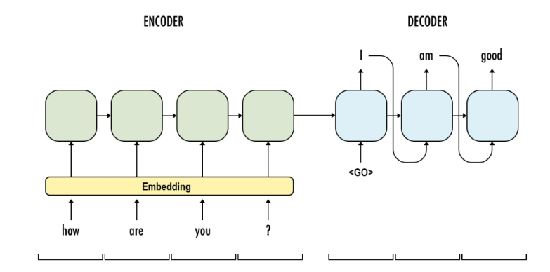

# AIFFEL_61일차 2020.10.22

Tags: AIFFEL_DAILY

### 일정


- [x]  GD3 Proj 마무리
- [x]  LMS E-21

# GD3 Proj 마무리


## 프로젝트: 자율주행 보조 시스템 만들기

결과물 : [https://github.com/bluecandle/2020_AIFFEL/blob/master/daily_notes/going_deeper_codes/GD3_code/GD3.ipynb](https://github.com/bluecandle/2020_AIFFEL/blob/master/daily_notes/going_deeper_codes/GD3_code/GD3.ipynb)

# [E-21] 트랜스포머로 만드는 대화형 챗봇


참고자료 [챗봇 5가지 유형]

[https://tonyaround.com/챗봇-기획-단계-챗봇의-5가지-대표-유형-종류/](https://tonyaround.com/%ec%b1%97%eb%b4%87-%ea%b8%b0%ed%9a%8d-%eb%8b%a8%ea%b3%84-%ec%b1%97%eb%b4%87%ec%9d%98-5%ea%b0%80%ec%a7%80-%eb%8c%80%ed%91%9c-%ec%9c%a0%ed%98%95-%ec%a2%85%eb%a5%98/)

대화형을 제외하면 사실상 챗봇은 대화형 UX를 가졌지만 본질적으로는 검색엔진이거나, 혹은 음성ARS를 대화형 UX에 옮겨놓은 것. 대화형 챗봇이 아니라면 챗봇이 가지는 한계는 명확.

***진정한 챗봇의 가치는 사용자가 어떤 말을 하더라도 알아듣고 적절히 대응할 수 있는 자유도에 있기 때문***

참고자료 [챗봇 역사의 모든 것]

[https://blog.performars.com/인공지능-챗봇chatbot-챗봇-역사의-모든-것](https://blog.performars.com/%EC%9D%B8%EA%B3%B5%EC%A7%80%EB%8A%A5-%EC%B1%97%EB%B4%87chatbot-%EC%B1%97%EB%B4%87-%EC%97%AD%EC%82%AC%EC%9D%98-%EB%AA%A8%EB%93%A0-%EA%B2%83)

BERT, ALBERT 등은 모두 트랜스포머(Transformer)라는 모델을 활용하여 pretrain을 적용한 것.

## **학습목표**

---

1. 트랜스포머의 인코더 디코더 구조 이해하기
2. 내부 단어 토크나이저 사용하기
3. 셀프 어텐션 이해하기
4. 한국어에도 적용해보기

## 트랜스포머와 인코더 디코더

---

### 인코더, 디코더 구조 복습



인코더에 입력 문장, 디코더는 이에 상승하는 출력 문장 생성.

훈련은 결국 입력 문장과 출력 문장 두 가지 병렬 구조로 구성된 데이터셋을 훈련한다는 의미.

***훈련 데이터셋 구성 예시***

- 입력 문장 : '저는 학생입니다.'
- 출력 문장 : 'I am a student'

***인코더-디코더 구조를 챗봇 훈련에 적용한다면?***

- 입력 문장 : '오늘의 날씨는 어때?'
- 출력 문장 : '오늘은 매우 화창한 날씨야'

### 그렇다면, 트랜스포머의 인코더와 디코더는?


이 그림에서, 파란색으로 가려져있은 트랜스포머의 내부를 열어보자.


- 왼쪽 초록색이 인코더층
- 오른쪽 핑크색이 디코더층
- 인코더 : 누적으로 쌓아올린 인코더층을 통해 입력 문장에서 정보를 뽑아낸다.
- 디코더 : 누적으로 쌓아올린 디코더층을 통해 출력 문장의 단어를 하나씩 만든다.

조금 더 자세히 표현하자면!


- self-attention
- add & normalize
- feed forward x 2
- add & normalize

## 트랜스포머의 입력 이해하기

---

```python
import tensorflow as tf
import tensorflow_datasets as tfds
import os
import re
import numpy as np
import matplotlib.pyplot as plt
print("슝=3")
```


텍스트 문장을 입력으로 받기 전에 단어를 임베딩 벡터로 변환하는 '***벡터화 과정'*** 을 대부분 자연어 처리 모델에서 거침. 트랜스포머 모델도 다르지 않음 ㅇㅇ

근데, 트랜스포머는 일반 RNN 계열 모델들과 다른 점이 하나 있다.

***⇒ 임베딩 벡터에 어떤 값을 더해준 뒤에 입력으로 사용한다는 점!***

위 그림에서 'Positional Encoding' 이라고 표시되어있는 부분!


인코더 입력 부분을 조금 더 확대해본다면 이런 느낌. 포지셔널 인코딩 , positional encoding

왜 이러는걸까요?

트랜스포머는 입력 받을 때 문장에 있는 모든 단어를 한꺼번에 받기 때문! (1개씩 받는게 아니라)

***⇒ 이게 바로 트랜스포머가 RNN 계열과 결정적으로 다른 점***

RNN 에서는 단어가 순차적으로 들어가니까, 순차 정보를 알려줄 필요가 없었는데, 트랜스포머는 그게 아님! 'I ate Lunch' 가 'Lunch ate I'와 같게 판단될 수 있다는 이야기...ㅋㅋㅋㅋ

⇒ 그래서, 단어가 문장의 몇 번째로 입력되었는지를 알려주기 위해, 단어 임베딩 벡터에 위치 정보를 가진 벡터(positional encoding) 값을 더해서 모델의 입력으로 사용하는 것.

그리고 positional encoding의 벡터값은 아래 수식에 의해 정해짐.


근데, 임베딩 벡터와 positional encoding 의 합은 사실 임베딩 벡터가 모여 만들어진 문장 벡터 행렬과 positional encoding 행렬의 덧셈 연산을 통해 이루어진다.


이렇게 행렬 덧셈 연산!

그래서, $d_{model}$ 은 임베딩 벡터의 차원을 의미. pos는 입력 문장에서의 임베딩 벡터의 위치를 나타냄. i는 임베딩 벡터 내의 차원의 인덱스를 의미.

positional encoding 구현!

```python
# 포지셔널 인코딩 레이어
class PositionalEncoding(tf.keras.layers.Layer):

  def __init__(self, position, d_model):
    super(PositionalEncoding, self).__init__()
    self.pos_encoding = self.positional_encoding(position, d_model)

  def get_angles(self, position, i, d_model):
    angles = 1 / tf.pow(10000, (2 * (i // 2)) / tf.cast(d_model, tf.float32))
    return position * angles

  def positional_encoding(self, position, d_model):
    angle_rads = self.get_angles(
        position=tf.range(position, dtype=tf.float32)[:, tf.newaxis],
        i=tf.range(d_model, dtype=tf.float32)[tf.newaxis, :],
        d_model=d_model)
    # 배열의 짝수 인덱스에는 sin 함수 적용
    sines = tf.math.sin(angle_rads[:, 0::2])
    # 배열의 홀수 인덱스에는 cosine 함수 적용
    cosines = tf.math.cos(angle_rads[:, 1::2])

    pos_encoding = tf.concat([sines, cosines], axis=-1)
    pos_encoding = pos_encoding[tf.newaxis, ...]
    return tf.cast(pos_encoding, tf.float32)

  def call(self, inputs):
    return inputs + self.pos_encoding[:, :tf.shape(inputs)[1], :]
print("슝=3")
```

행의 크기가 50, 열의 크기가 512인 행렬을 그려봅시다. 이를 테면, 최대 문장의 길이가 50이고 워드 임베딩 차원을 512로 하는 모델의 입력벡터 모양이 이와 같을 것

```python
sample_pos_encoding = PositionalEncoding(50, 512)

plt.pcolormesh(sample_pos_encoding.pos_encoding.numpy()[0], cmap='RdBu')
plt.xlabel('Depth')
plt.xlim((0, 512))
plt.ylabel('Position')
plt.colorbar()
plt.show()
```


PositionalEncoding 논문 표현


음... 논문에서는 무슨 이상한 기호로 input Embedding과 더해주는(행렬 덧셈 연산)것을 표현했네.

## 어텐션!

---

### 어텐션 메커니즘 복습


어텐션 함수는

[1] 주어진 '쿼리'에 대해서 모든 '키'와의 유사도를 **각각** 구한다.

[2] 구해낸 유사도를 키와 매핑되어있는 각각의 '값'에 반영.

[3] 유사도가 반영된 '값'을 모두 더해서 뭉치면 최종 결과인 '어텐션 값'이 나온다.

### 트랜스포머에서 사용된 어텐션 메커니즘


1. 인코더 셀프 어텐션 : 인코더에서 이루어짐
2. 디코더 셀프 어텐션 : 디코더에서 이루어짐
3. 인코더-디코더 어텐션 : 디코더에서 이루어짐.


트랜스포머 전체 아키텍처에서 어텐션 메커니즘이 위치한 곳을 표시한 그림

트랜스포머 어텐션 함수에 사용되는 Query, Key, Value는 기본적으로 **'단어 (정보를 함축한) 벡터'** 이다.

여기서 **'단어 벡터'** 란, 초기 입력으로 사용된 임베딩 벡터가 아니고, 트랜스포머의 연산을 거친 후의 단어 벡터를 의미.

그럼, 각각의 어텐션이 하는 일은??

- **인코더 셀프 어텐션** : 인코더의 입력으로 들어간 문장 내 단어들이 서로 **유사도를** 구한다.
- **디코더 셀프 어텐션** : 단어를 1개씩 생성하는 디코더가 이미 생성된 **앞 단어들과의 유사도**를 구한다.
- **인코더-디코더 어텐션** : 디코더가 잘! 예측하기 위해서 **인코더에 입력된 단어들과 유사도**를 구한다.

유사도를 구하는거네 결국. 애초에 어텐션 메커니즘의 목적 자체가

'주어진 '쿼리'에 대해서 모든 '키'와의 유사도를 **각각** 구한다.' 이기 때문이겠지??

근데, 그럼 '셀프 어텐션'은 구체적으로 무엇인지 살펴보자.

### 셀프 어텐션

유사도를 구하는 대상이 다른 문장의 단어가 아니라, **현재 문장 내의 단어들**이 서로 유사도를 구하는 경우를 의미함! ( 그니까 같은 문장 안에 있는 단어들간의 유사도를 구한다! )

인코더-디코더 어텐션은 그 반대로 서로 다른 단어 목록(인코더 내 단어와 디코더 내 단어) 사이에서 유사도를 구하는 것. 따라서 셀프 어텐션이 아니다.


위의 input 문장 '그 동물은 길을 건너지 않았다, 왜냐하면 그것(그 동물)은 너무 피곤하였기 때문.'

에서, 그것이 동물이라는 점을 사람은 간단히 파악할 수 있지만, 기계는 그렇지 않다!

하지만, 셀프 어텐션을 사용하면 문장 내 단어들끼리 유사도를 구하여 그것(it)이 동물과 관련되었을 가능성이 높다는 것을 찾아낸다! (animal 단어가 더 짙게 표시되어있는 것을 알 수 있다.)

그렇다면, '유사도'를 어떻게 구하는걸까??

## 스케일드 닷 프로덕트 어텐션

---

트랜스포에서 어텐션 값을 구하는데 사용된 방법(수식)

$Attention(Q,K,V) = softmax \left( \frac {QK^T} {\sqrt{d_k}} \right) V$

Q : Query

K : Key

V : Value

자, 어텐션 메커니즘이 하는 일을 다시 한 번 생각해보자!

'쿼리'에 대해서 모든 '키'와의 **유사도를** 각각 구하고, 그 유사도를 각 키와 매핑되어있는 '값'에 반영한다!
그리고 유사도가 반영된 '값'들을 모두 더한 최종 결과를 **어텐션 밸류(Attention Value)**라고 한다.

위의 정의와 함께 알아둘 3가지 내용.

1. **Q, K, V**는 단어 벡터를 행으로 하는 문장 행렬이다.
2. 벡터의 **내적(dot product)**은 벡터의 **유사도**를 의미한다.
3. 특정값을 분모로 사용하는 것은 값의 크기를 조절하는 스케일링(Scaling)을 위함이다.


Q와 K 전치 행렬의 곱을 구하는 것 표현

그림의 초록색 행렬이 의미하는 값을 무엇인가?

[EX] 'am' 행과 'student'열의 값은 Q 행렬에 있던 'am' 벡터와 K 행렬에 있던 'student 벡터'의 내적값을 의미함! ⇒ 결국, 초록색 행렬은 각 단어 벡터의 유사도가 모두 기록된 유사도 행렬이 되는 것!

***그리고, 이제 이 유사도 값을 스케일링 해주어야함!***

스케일링 해주기 위해, 행렬 전체를 특정값($\sqrt{d_k}$)으로 나누어준다.

유사도를 0과 1사이의 값으로 Normalize 시키기 위해서 소프트맥스 함수를 사용.

여기까지가 Q와 K의 유사도를 구하는 과정.

거기다가 문장 행렬 V와 곱하면 어탠션 값(Attention Value)을 얻을 수 있다!


[1] 스케일링을 위해 Q와 K 전치행렬의 곱을 특정값으로 나누고 [2] 0과 1사이의 값으로 normalize 시키기 위해 소프트맥스 함수 적용 [3] 문장 행렬 V와 곱해준다.

그래서, 결국 위에서 봤던 식이 나오는 것!

$Attention(Q,K,V) = softmax \left( \frac {QK^T} {\sqrt{d_k}} \right) V$

⇒ 내적을 통해 단어 벡터간 유사도를 구한 후에, 특정값을 분모로 나누는 방식으로 Q와 V의 유사도를 구하였다고 하여 '스케일드 닷 프로덕트 어텐션(Scaled Dot Product Attention)'이라고 이름지어짐!

특정값을 나누는 부분을 사용하지 않았다면?? 그냥 닷 프로덕트 어텐션이겠지.

### 그럼, 구현해보자!

```python
# 스케일드 닷 프로덕트 어텐션 함수
def scaled_dot_product_attention(query, key, value, mask):
  """어텐션 가중치를 계산. """
  matmul_qk = tf.matmul(query, key, transpose_b=True)

  # scale matmul_qk
  depth = tf.cast(tf.shape(key)[-1], tf.float32)
  logits = matmul_qk / tf.math.sqrt(depth)

  # add the mask to zero out padding tokens
  if mask is not None:
    logits += (mask * -1e9)

  # softmax is normalized on the last axis (seq_len_k)
  attention_weights = tf.nn.softmax(logits, axis=-1)

  output = tf.matmul(attention_weights, value)

  return output
print("슝=3")
```

이제 트랜스포머 내에서 '어텐션'을 수행한다고하면, 스케일드 닷 프로덕트 어텐션을 수행한다는 의미!

## 머리가 여러 개인 어텐션

---

굉장히 어려운 시험을 푸는데, 누가 옆에서 같이 풀어준다면 좋을텐데?? 기계가 이렇게 할 수 있도록 하자

### 병렬로 어텐션 수행하기

트랜스포머에서 `num_heads` 라는 변수는 기계가 몇 개의 똑똑한 머리를 사용할지, 즉 병렬적으로 몇 개의 어텐션 연산을 수행할지 결정하는 하이퍼파라미터


num_heads 가 8일 때, 8로 나누어 쪼개서 어텐션 수행하고 concatenate 하는 예시.

결국 트랜스포머의 초기 입력인 문장 행렬의 크기는

- 행 : 문자의 길이
- 열 : 임베딩 벡터의 차원 ( $d_{model}$ )

트랜스포머는 입력된 문장 행렬을 `num_heads` 의 수만큼 쪼개서 어텐션을 수행하고, 얻은 `num_heads`의 개수만큼의 어텐션 값 행렬을 다시 하나로 concatenate 한다.

⇒ 전체 문체를 `num_heads` 구역으로 나누어 풀고, 결과를 합친다고 보면 된다!

### 멀티-헤드 어텐션 (어텐션 병렬로 수행하는것을 이렇게 부름)

이렇게 병렬로 어텐션 연산을 하면 무엇을 얻을 수 있을까?? 결국 똑같은거 아닌가??


[예시] num_heads 8일때, 병렬로 수행되는 어텐션이 서로 다른 셀프 어텐션 결과를 얻을 수 있음을 보여준다.

***8개의 머리는 각각 다른 관점에서 어텐션을 수행한다!***

⇒ 하나의 머리에서만 수행했다면 놓칠 수 있는 정보를 캐치 가능함.

⇒ 위의 그림의 예시를 참고하자면, it_ 이라는 토큰이 animal_ 과 유사하다고 보는 관점과 street_ 과 유사하다고 보는 관점이 한꺼번에 표현이 가능하다.

### 멀티-헤드 어텐션 구현

```python
class MultiHeadAttention(tf.keras.layers.Layer):

  def __init__(self, d_model, num_heads, name="multi_head_attention"):
    super(MultiHeadAttention, self).__init__(name=name)
    self.num_heads = num_heads
    self.d_model = d_model

    assert d_model % self.num_heads == 0

    self.depth = d_model // self.num_heads

    self.query_dense = tf.keras.layers.Dense(units=d_model)
    self.key_dense = tf.keras.layers.Dense(units=d_model)
    self.value_dense = tf.keras.layers.Dense(units=d_model)

    self.dense = tf.keras.layers.Dense(units=d_model)

  def split_heads(self, inputs, batch_size):
    inputs = tf.reshape(
        inputs, shape=(batch_size, -1, self.num_heads, self.depth))
    return tf.transpose(inputs, perm=[0, 2, 1, 3])

  def call(self, inputs):
    query, key, value, mask = inputs['query'], inputs['key'], inputs[
        'value'], inputs['mask']
    batch_size = tf.shape(query)[0]

    # linear layers
    query = self.query_dense(query)
    key = self.key_dense(key)
    value = self.value_dense(value)

    # 병렬 연산을 위한 머리를 여러 개 만듭니다.
    query = self.split_heads(query, batch_size)
    key = self.split_heads(key, batch_size)
    value = self.split_heads(value, batch_size)

    # 스케일드 닷-프로덕트 어텐션 함수
    scaled_attention = scaled_dot_product_attention(query, key, value, mask)

    scaled_attention = tf.transpose(scaled_attention, perm=[0, 2, 1, 3])

    # 어텐션 연산 후에 각 결과를 다시 연결(concatenate)합니다.
    concat_attention = tf.reshape(scaled_attention,
                                  (batch_size, -1, self.d_model))

    # final linear layer
    outputs = self.dense(concat_attention)

    return outputs
print("슝=3")
```

## 마스킹

---

특정 값들을 가려서 실제 연산에 방해가 되지 않도록 하는 기법

트랜스포머에서는 어텐션을 위해 크게 두 가지 마스킹을 사용한다.

### 1. 패딩 마스킹(Padding Masking)

패딩 토큰을 이용한 padding masking


***패딩이 뭔지는 기억나지??***

문장 길이 다를때 최대 길이에 맞춰서 짧은 문장에 빈 값을 채워넣는거!

근데, 위처럼 주어진 숫자 0은 실제로 의미있는 단어가 아니기 때문에, 실제 어텐션 등의 연산에서 제외할 필요가 있음!

***패딩 마스킹은 이를 위해 숫자 0의 위치를 체크한다!***

```python
# 패딩 마스킹 구현 함수
def create_padding_mask(x):
# 정수 시퀀스 x 안에서 0과 동일한 element 들을 체크.
  mask = tf.cast(tf.math.equal(x, 0), tf.float32)
  # (batch_size, 1, 1, sequence length)
  return mask[:, tf.newaxis, tf.newaxis, :]
print("슝=3")
```

⇒ 정수 시퀀스 입력, 숫자가 0인 부분을 체크한 벡터 리턴.

실험해보자.

```python
print(create_padding_mask(tf.constant([[1, 2, 0, 3, 0], [0, 0, 0, 4, 5]])))
```

```python
tf.Tensor(
[[[[0. 0. 1. 0. 1.]]]

 [[[1. 1. 1. 0. 0.]]]], shape=(2, 1, 1, 5), dtype=float32)
```

⇒ 두 정수 시퀀스에 대하여, 숫자가 0인 위치에서는 1이 나오고 아닌 위치에서는 숫자 0이 나오는 벡터출력

### 2. 룩 어헤드 마스킹(Look-ahead masking) : 다음 단어 가리기

RNN과 트랜스포머는 문장 입력받는 방법이 전혀 다르다는거 기억하지??!

RNN은 step 이라는 개념이 존재해서, 각 step 마다 단어가 순서대로 입력으로 들어가는 구조.

트랜스포머는 문장 행렬을 만들어 한 번에 행렬 형태로 입력으로 들어간다는 특징.

⇒ 이 트랜스포머의 특징때문에 추가적인 마스킹이 필요!

***일단, RNN을 복습좀 해보자***


RNN으로 디코더를 구현했을 때

RNN은 구조상, 다음 단어를 만들어 갈 때, 자신보다 앞에 있는 단어만 참고해서 다음 단어 예측!

위의 예시를 가져와서 살펴보자면!

- **첫번째 step**현재까지의 입력 : what → 출력 : is
- **두번째 step**현재까지의 입력 : what is → 출력 : the
- **세번째 step**현재까지의 입력 : what is the → 출력 problem

***그럼, 트랜스포머는 어떻게 동작하는가??***

트랜스포머는 전체 문장이 한 번에 들어가기 때문에, 모든 단어를 참고해서 다음 단어를 예측할 수 있다!

근데, 우리가 원하는건 이전 단어로부터 다음 단어를 예측하는 훈련을 제대로 하는거잖아???

따라서, 이 문제를 해결하기 위해 자신보다 다음에 나올 단어를 참고하지 않도록 가리는거!

⇒ 수학 문제집 답안지 참고할 때, 풀이 일부만 보고 다음 풀이는 가려놓고 혼자 해보는거 하듯이.


어텐션 수행 시, Query 단어 뒤에 나오는 key 단어들에 대해서 마스킹 처리! ( 빨간부분 )

⇒ 빨간색이 마스크, 즉 가리는 역할, 실제 어텐션 연산에서 현재 단어를 기준으로 이전 단어들하고만 유사도를 구한다!

구현해보자!

```python
def create_look_ahead_mask(x):
  seq_len = tf.shape(x)[1]
  look_ahead_mask = 1 - tf.linalg.band_part(tf.ones((seq_len, seq_len)), -1, 0)
  padding_mask = create_padding_mask(x)
  return tf.maximum(look_ahead_mask, padding_mask)
print("슝=3")
```

테스트

```python
print(create_look_ahead_mask(tf.constant([[1, 2, 3, 4, 5]])))
```

```python
tf.Tensor(
[[[[0. 1. 1. 1. 1.]
   [0. 0. 1. 1. 1.]
   [0. 0. 0. 1. 1.]
   [0. 0. 0. 0. 1.]
   [0. 0. 0. 0. 0.]]]], shape=(1, 1, 5, 5), dtype=float32)
```

근데, 룩어헤드 마스킹과 패딩 마스킹은 별개이다.

따라서, 룩어헤드 마스킹을 수행할 때 만약에 숫자 0인 단어가 있다면, 그 또한 패딩을 해야해서 룩어헤드 마스킹 함수 안에 패딩 마스킹도 호출중이다.

숫자 0이 포함된 경우도 테스트

```python
print(create_look_ahead_mask(tf.constant([[0, 5, 1, 5, 5]])))
```

```python
tf.Tensor(
[[[[1. 1. 1. 1. 1.]
   [1. 0. 1. 1. 1.]
   [1. 0. 0. 1. 1.]
   [1. 0. 0. 0. 1.]
   [1. 0. 0. 0. 0.]]]], shape=(1, 1, 5, 5), dtype=float32)
```

첫 번째에 있는 숫자가 0이잖아, 그래서 모든 행의 첫자리에 1이 들어가있음.

## 인코더

---

### 인코더 층 만들기


하나의 인코더 층은 크게 2개의 서브층으로 나누어진다.

- 셀프 어텐션 : 멀티-헤드 어텐션으로 병렬적으로 이루어진다!
- 피드 포워드 신경망

***인코더 구현***

```python
# 인코더 하나의 레이어를 함수로 구현.
# 이 하나의 레이어 안에는 두 개의 서브 레이어가 존재합니다.
def encoder_layer(units, d_model, num_heads, dropout, name="encoder_layer"):
  inputs = tf.keras.Input(shape=(None, d_model), name="inputs")

	# 패딩 마스크 사용
  padding_mask = tf.keras.Input(shape=(1, 1, None), name="padding_mask")

  # 첫번째 서브 레이어 : 멀티 헤드 어텐션 수행 (셀프 어텐션)
  attention = MultiHeadAttention(
      d_model, num_heads, name="attention")({
          'query': inputs,
          'key': inputs,
          'value': inputs,
          'mask': padding_mask
      })

  # 어텐션의 결과는 Dropout과 Layer Normalization이라는 훈련을 돕는 테크닉을 수행
  attention = tf.keras.layers.Dropout(rate=dropout)(attention)
# LayerNormalization 에서 input과 dropout 을 지난 attention 값을 더하고,
# 더해진 값을 normalize 한다
  attention = tf.keras.layers.LayerNormalization(
      epsilon=1e-6)(inputs + attention)

  # 두번째 서브 레이어 : 2개의 완전연결층, FC
  outputs = tf.keras.layers.Dense(units=units, activation='relu')(attention)
  outputs = tf.keras.layers.Dense(units=d_model)(outputs)

  # 완전연결층의 결과는 Dropout과 LayerNormalization이라는 훈련을 돕는 테크닉을 수행
  outputs = tf.keras.layers.Dropout(rate=dropout)(outputs)
  outputs = tf.keras.layers.LayerNormalization(
      epsilon=1e-6)(attention + outputs)

  return tf.keras.Model(
      inputs=[inputs, padding_mask], outputs=outputs, name=name)
print("슝♥")
```


셀프 어텐션과 피드 포워드 외에도, 각 단계 이후 Dropout, LayerNormalization 있음. LayerNormalization 에서 input과 dropout 을 지난 attention 값을 더하고, 더해진 값을 normalize 한다. (코드참조)

### 인코더 층을 쌓아 인코더 만들기

인코더 층을 임베딩 층과 포지셔널 인코딩과 연결.

원하는 만큼 인코더 층을 쌓으면 트랜스포머 인코더 완성!

***Layer Normalization***

인코더와 디코더 내부에서는 각 서브층 이후에 훈련을 돕는 Layer Normalization이라는 테크닉이 사용되었습니다. 위 그림에서는 Normalize라고 표시된 부분에 해당.

트랜스포머는 `num_layers` 하이퍼파라미터 수만큼의 인코더 층을 쌓는다.

(논문에서는 6개 사용, 학습노드에서는 시간상 조금 더 적게)

***트랜스포머 인코더 구현함수***

```python
def encoder(vocab_size,
            num_layers,
            units,
            d_model,
            num_heads,
            dropout,
            name="encoder"):
  inputs = tf.keras.Input(shape=(None,), name="inputs")

	# 패딩 마스크 사용
  padding_mask = tf.keras.Input(shape=(1, 1, None), name="padding_mask")

  # 임베딩 레이어
  embeddings = tf.keras.layers.Embedding(vocab_size, d_model)(inputs)
  embeddings *= tf.math.sqrt(tf.cast(d_model, tf.float32))

  # 포지셔널 인코딩
  embeddings = PositionalEncoding(vocab_size, d_model)(embeddings)

  outputs = tf.keras.layers.Dropout(rate=dropout)(embeddings)

  # num_layers만큼 쌓아올린 인코더의 층.
  for i in range(num_layers):
    outputs = encoder_layer(
        units=units,
        d_model=d_model,
        num_heads=num_heads,
        dropout=dropout,
        name="encoder_layer_{}".format(i),
    )([outputs, padding_mask])

  return tf.keras.Model(
      inputs=[inputs, padding_mask], outputs=outputs, name=name)
print("슝=3")
```

## 디코더

---


세 개의 서브층으로 구성된 디코더

- 셀프 어텐션
- 인코더-디코더 어텐션 : 셀프 어텐션과는 달리, Query는 디코더의 벡터, Key 와 Value는 인코더 벡터.
- 피드포워드 신경망


트랜스포머 전체 구조에서 multi-head attention 의 위치. V,K 는 인코더에서 흘러 들어오고 V 는 디코더의 값. input 값들이 skip connection 으로 add & norm layer 에서 attention layer 에서 나온 값과 합쳐지고 있음도 주목.

인코더의 셀프 어텐션과 마찬가지로 **디코더**의 셀프 어텐션, 인코더-디코더 어텐션 두 개의 어텐션 모두 **스케일드 닷 프로덕트 어텐션**을 **멀티 헤드 어텐션**으로 **병렬적**으로 수행

***구현***

```python
# 디코더 하나의 레이어를 함수로 구현.
# 이 하나의 레이어 안에는 세 개의 서브 레이어가 존재합니다.
def decoder_layer(units, d_model, num_heads, dropout, name="decoder_layer"):

  inputs = tf.keras.Input(shape=(None, d_model), name="inputs")
  enc_outputs = tf.keras.Input(shape=(None, d_model), name="encoder_outputs")
  look_ahead_mask = tf.keras.Input(
      shape=(1, None, None), name="look_ahead_mask")
  padding_mask = tf.keras.Input(shape=(1, 1, None), name='padding_mask')

  # 첫번째 서브 레이어 : 멀티 헤드 어텐션 수행 (셀프 어텐션)
  attention1 = MultiHeadAttention(
      d_model, num_heads, name="attention_1")(inputs={
          'query': inputs,
          'key': inputs,
          'value': inputs,
          'mask': look_ahead_mask
      })

  # 멀티 헤드 어텐션의 결과는 LayerNormalization이라는 훈련을 돕는 테크닉을 수행
  attention1 = tf.keras.layers.LayerNormalization(
      epsilon=1e-6)(attention1 + inputs)

  # 두번째 서브 레이어 : 마스크드 멀티 헤드 어텐션 수행 (인코더-디코더 어텐션)
  attention2 = MultiHeadAttention(
      d_model, num_heads, name="attention_2")(inputs={
          'query': attention1,
          'key': enc_outputs,
          'value': enc_outputs,
          'mask': padding_mask
      })

  # 마스크드 멀티 헤드 어텐션의 결과는
  # Dropout과 LayerNormalization이라는 훈련을 돕는 테크닉을 수행
  attention2 = tf.keras.layers.Dropout(rate=dropout)(attention2)
  attention2 = tf.keras.layers.LayerNormalization(
      epsilon=1e-6)(attention2 + attention1)

  # 세번째 서브 레이어 : 2개의 완전연결층
  outputs = tf.keras.layers.Dense(units=units, activation='relu')(attention2)
  outputs = tf.keras.layers.Dense(units=d_model)(outputs)

  # 완전연결층의 결과는 Dropout과 LayerNormalization 수행
  outputs = tf.keras.layers.Dropout(rate=dropout)(outputs)
  outputs = tf.keras.layers.LayerNormalization(
      epsilon=1e-6)(outputs + attention2)

  return tf.keras.Model(
      inputs=[inputs, enc_outputs, look_ahead_mask, padding_mask],
      outputs=outputs,
      name=name)
print("슝=3")
```

### 디코더 층을 쌓아 디코더 만들기

인코더 만들 때 했던 것처럼, 임베딩 층과 포지셔널 인코딩과 연결하고, 원하는 만큼 디코더 층을 쌓아 트랜스포머의 디코더를 완성한다!

`num_layers` 개수만큼 디코더 층을 쌓는다. 논문은 6개, 학습노드에서는 시간을 고려하여 더 적은 개수.

***트랜스포머 디코더 만드는 함수 구현***

```python
def decoder(vocab_size,
            num_layers,
            units,
            d_model,
            num_heads,
            dropout,
            name='decoder'):

  inputs = tf.keras.Input(shape=(None,), name='inputs')
  enc_outputs = tf.keras.Input(shape=(None, d_model), name='encoder_outputs')
  look_ahead_mask = tf.keras.Input(
      shape=(1, None, None), name='look_ahead_mask')

	# 패딩 마스크
  padding_mask = tf.keras.Input(shape=(1, 1, None), name='padding_mask')
  
	# 임베딩 레이어
  embeddings = tf.keras.layers.Embedding(vocab_size, d_model)(inputs)
  embeddings *= tf.math.sqrt(tf.cast(d_model, tf.float32))

	# 포지셔널 인코딩
  embeddings = PositionalEncoding(vocab_size, d_model)(embeddings)

	# Dropout이라는 훈련을 돕는 테크닉을 수행
  outputs = tf.keras.layers.Dropout(rate=dropout)(embeddings)

  for i in range(num_layers):
    outputs = decoder_layer(
        units=units,
        d_model=d_model,
        num_heads=num_heads,
        dropout=dropout,
        name='decoder_layer_{}'.format(i),
    )(inputs=[outputs, enc_outputs, look_ahead_mask, padding_mask])

  return tf.keras.Model(
      inputs=[inputs, enc_outputs, look_ahead_mask, padding_mask],
      outputs=outputs,
      name=name)
print("슝=3")
```

## 챗봇의 병렬 데이터 받아오기

---

위에서 트랜스포머 인코더, 디코더 만들었으니, 이걸 이용해서 챗봇 만들어보기 전에 챗봇 만들기에 필요한 데이터부터 만들자.

**Cornell Movie-Dialogs Corpus**라는 영화 및 TV 프로그램에서 사용되었던 대화의 쌍으로 구성된 데이터셋을 사용. ( 대화의 쌍 : 먼저 말하는 사람의 문장, 그에 응답하는 사람의 문장 )

***데이터 받아오면서 목표사항***

1. 정해진 개수인 50,000개의 질문과 답변의 쌍을 추출한다.
2. 문장에서 단어와 구두점 사이에 공백을 추가한다.
3. 알파벳과 ! ? , . 이 4개의 구두점을 제외하고 다른 특수문자는 모두 제거한다.

데이터 다운로드

```python
path_to_zip = tf.keras.utils.get_file(
    'cornell_movie_dialogs.zip',
    origin='http://www.cs.cornell.edu/~cristian/data/cornell_movie_dialogs_corpus.zip',
    extract=True)

path_to_dataset = os.path.join(
    os.path.dirname(path_to_zip), "cornell movie-dialogs corpus")

path_to_movie_lines = os.path.join(path_to_dataset, 'movie_lines.txt')
path_to_movie_conversations = os.path.join(path_to_dataset,'movie_conversations.txt')
print("슝=3")
```

max_sample 수 지정

```python
# 사용할 샘플의 최대 개수
MAX_SAMPLES = 50000
print(MAX_SAMPLES)
```

정규표현식 사용하여 구두점(punctuation) 제거하여 토크나이징 작업에 방해되지 않도록 정제

```python
# 전처리 함수
def preprocess_sentence(sentence):
  sentence = sentence.lower().strip()

  # 단어와 구두점(punctuation) 사이의 거리를 만듭니다.
  # 예를 들어서 "I am a student." => "I am a student ."와 같이
  # student와 온점 사이에 거리를 만듭니다.
  sentence = re.sub(r"([?.!,])", r" \1 ", sentence)
  sentence = re.sub(r'[" "]+', " ", sentence)

  # (a-z, A-Z, ".", "?", "!", ",")를 제외한 모든 문자를 공백인 ' '로 대체합니다.
  sentence = re.sub(r"[^a-zA-Z?.!,]+", " ", sentence)
  sentence = sentence.strip()
  return sentence
print("슝=3")
```

데이터 로드 과정에서 전처리를 진행하여 전처리된 질문과 답변 쌍 얻기

```python
# 질문과 답변의 쌍인 데이터셋을 구성하기 위한 데이터 로드 함수
def load_conversations():
  id2line = {}
  with open(path_to_movie_lines, errors='ignore') as file:
    lines = file.readlines()
  for line in lines:
    parts = line.replace('\n', '').split(' +++$+++ ')
    id2line[parts[0]] = parts[4]

  inputs, outputs = [], []
  with open(path_to_movie_conversations, 'r') as file:
    lines = file.readlines()

  for line in lines:
    parts = line.replace('\n', '').split(' +++$+++ ')
    conversation = [line[1:-1] for line in parts[3][1:-1].split(', ')]

    for i in range(len(conversation) - 1):
			# 전처리 함수를 질문에 해당되는 inputs와 답변에 해당되는 outputs에 적용.
      inputs.append(preprocess_sentence(id2line[conversation[i]]))
      outputs.append(preprocess_sentence(id2line[conversation[i + 1]]))

      if len(inputs) >= MAX_SAMPLES:
        return inputs, outputs
  return inputs, outputs
print("슝=3")
```

로드한 샘플 수 확인

```python
# 데이터를 로드하고 전처리하여 질문을 questions, 답변을 answers에 저장합니다.
questions, answers = load_conversations()
print('전체 샘플 수 :', len(questions))
print('전체 샘플 수 :', len(answers))
```

질문, 답변은 병렬로 구성되는 데이터셋이기 때문에, 두 샘플 수가 정확히 일치해야함!

임의로 추출한 샘플 중 하나 꺼내보자

```python
print('전처리 후의 22번째 질문 샘플: {}'.format(questions[21]))
print('전처리 후의 22번째 답변 샘플: {}'.format(answers[21]))
```

```python
전처리 후의 22번째 질문 샘플: she s not a . . .
전처리 후의 22번째 답변 샘플: lesbian ? no . i found a picture of jared leto in one of her drawers , so i m pretty sure she s not harboring same sex tendencies .
```

⇒ ?나 .와 같은 구두점들이 단어들과 분리되어 **단어와 구두점 사이에는 공백**이 추가된 것을 확인할 수 있습니다. 이렇게 함으로써 단어를 토크나이징 하는 과정에서 구두점과 붙어있던 단어들을 하나의 단어로 인식하는 것을 방지할 수 있습니다.

***⇒ 그치... 단어와 구두점을 하나로 묶어서 하나의 단어로 생각하면 안되니까!***

## 병렬 데이터 전처리하기

---

위에서 데이터를 불러오면서 단어와 구두점을 공백으로 분리하고 , 알파벳과 ! ? , . 이 4개의 구두점을 제외하고 다른 특수문자는 모두 제거하였음. 트랜스포머 학습에 어울리는 형태로 전처리를 해야함!

***이를 위해 크게 세 가지 작업을 해야함.***

1. TensorFlow Datasets **SubwordTextEncoder**를 토크나이저로 사용한다. 단어 보다 더 작은 단위인 Subword를 기준으로 토크나이징하고, 각 토큰을 고유한 **정수로 인코딩**한다.
2. 각 문장을 토큰화하고 각 문장의 시작과 끝을 나타내는 **`START_TOKEN`** 및 **`END_TOKEN`**을 추가한다.
3. 최대 길이 **MAX_LENGTH**인 40을 넘는 문장들은 필터링한다.
4. MAX_LENGTH보다 길이가 짧은 문장들은 40에 맞도록 **패딩**한다.

### 1. 단어장 만들기

```python
# [안됨!] 질문과 답변 데이터셋에 대해서 Vocabulary 생성.
#tokenizer = tfds.features.text.SubwordTextEncoder.build_from_corpus(questions + answers, target_vocab_size=2**13)
# 이걸로 하니까 된다.
tokenizer = tfds.deprecated.text.SubwordTextEncoder.build_from_corpus(questions + answers, target_vocab_size=2**13)
print("슝=3 ")
```

디코더의 문장 생성 과정에서 사용할 '시작 토큰', '종료 토큰'도 임의로 단어장에 추가하여 정수 부여.

```python
# 시작 토큰과 종료 토큰에 고유한 정수를 부여합니다.
START_TOKEN, END_TOKEN = [tokenizer.vocab_size], [tokenizer.vocab_size + 1]
print("슝=3")
```

단어장 내의 단어의 index와 겹치지 않도록, 단어장 숫자를 index로, 단어장 숫자+1 을 index로 지정.

```python
print('START_TOKEN의 번호 :' ,[tokenizer.vocab_size])
print('END_TOKEN의 번호 :' ,[tokenizer.vocab_size + 1])
```

시작 토큰, 종료 토큰 추가되어 단어장 숫자가 2만큼 증가되었기 때문에, 그 내용을 반영!

```python
# 시작 토큰과 종료 토큰을 고려하여 +2를 하여 단어장의 크기를 산정합니다.
VOCAB_SIZE = tokenizer.vocab_size + 2
print(VOCAB_SIZE)
```

### 2. 각 단어를 고유한 정수로 인코딩(Integer encoding) & 패딩(Padding)

`SubwordTextEncoder` 를 사용하여 tokenizer를 정의하고 Vocabulary를 만들었다면, `tokenizer.encode()` 로 각 단어를 정수 변환 가능. `tokenizer.decode()` 로 정수 시퀀스를 단어 시퀀스로 변환 가능.

예시

```python
# 임의의 22번째 샘플에 대해서 정수 인코딩 작업을 수행.
# 각 토큰을 고유한 정수로 변환
print('정수 인코딩 후의 22번째 질문 샘플: {}'.format(tokenizer.encode(questions[21])))
print('정수 인코딩 후의 22번째 답변 샘플: {}'.format(tokenizer.encode(answers[21])))
```

그리고, 문장의 최대 길이를 정하고, 해당 길이로 패딩(padding) 한다.

```python
# 샘플의 최대 허용 길이 또는 패딩 후의 최종 길이.
MAX_LENGTH = 40
print(MAX_LENGTH)
```

모든 문장들에 대해 인코딩 적용하고, 패딩도 적용하는 함수.

```python
# 정수 인코딩, 최대 길이를 초과하는 샘플 제거, 패딩
def tokenize_and_filter(inputs, outputs):
  tokenized_inputs, tokenized_outputs = [], []
  
  for (sentence1, sentence2) in zip(inputs, outputs):
    # 정수 인코딩 과정에서 시작 토큰과 종료 토큰을 추가
    sentence1 = START_TOKEN + tokenizer.encode(sentence1) + END_TOKEN
    sentence2 = START_TOKEN + tokenizer.encode(sentence2) + END_TOKEN

    # 최대 길이 40이하인 경우에만 데이터셋으로 허용
    if len(sentence1) <= MAX_LENGTH and len(sentence2) <= MAX_LENGTH:
      tokenized_inputs.append(sentence1)
      tokenized_outputs.append(sentence2)
  
  # 최대 길이 40으로 모든 데이터셋을 패딩
  tokenized_inputs = tf.keras.preprocessing.sequence.pad_sequences(
      tokenized_inputs, maxlen=MAX_LENGTH, padding='post')
  tokenized_outputs = tf.keras.preprocessing.sequence.pad_sequences(
      tokenized_outputs, maxlen=MAX_LENGTH, padding='post')
  
  return tokenized_inputs, tokenized_outputs
print("슝=3")
```

⇒ 샘플의 길이가 40을 넘는 경우 샘플들 필터링되어 제거됨.

```python
questions, answers = tokenize_and_filter(questions, answers)
print('단어장의 크기 :',(VOCAB_SIZE))
print('필터링 후의 샘플 개수: {}'.format(len(questions)))
print('필터링 후의 샘플 개수: {}'.format(len(answers)))
```

50,000 개에서 44,095 개로 감소

## 3. 교사 강요(Teacher Forcing) 사용하기

---

`tf.data.Dataset` API는 훈련 프로세스의 속도가 빨라지도록 입력 파이프라인을 구축하는 API

이를 적극 사용하기 위해서 질문과 답변의 쌍을 `**tf.data.Dataset`의 입력**으로 넣어주는 작업

근데, 디코더의 입력과 실제값(레이블)을 정의해주기 위해서는 ***'교사 강요(Teacher Forcing)'*** 이라는 언어 모델의 훈련 기법을 이해해야한다.

[참고자료] [https://wikidocs.net/46496](https://wikidocs.net/46496)

이러한 RNN 훈련 기법을 교사 강요(teacher forcing)라고 합니다. 교사 강요(teacher forcing)란, 테스트 과정에서 t 시점의 출력이 t+1 시점의 입력으로 사용되는 RNN 모델을 훈련시킬 때 사용하는 훈련 기법입니다. 훈련할 때 교사 강요를 사용할 경우, 모델이 t 시점에서 예측한 값을 t+1 시점에 입력으로 사용하지 않고, t 시점의 레이블. 즉, 실제 알고있는 정답을 t+1 시점의 입력으로 사용

⇒ 그니까, 훈련중에 모델이 이전 스텝(t)에서 뭐라고 뱉었던간에, 원래 t 스텝에 정답으로 지정되어있는 값을 현재 스텝(t+1)에 입력한다는 의미이네.

물론, 훈련 과정에서도 이전 시점의 출력을 다음 시점의 입력으로 사용하면서 훈련 시킬 수도 있지만 이는 한 번 잘못 예측하면 뒤에서의 예측까지 영향을 미쳐 훈련 시간이 느려지게 되므로 교사 강요를 사용하여 RNN을 좀 더 빠르고 효과적으로 훈련시킬 수 있습니다.

 

***자기회귀 모델(auto-regressive model, AR)***

이전 자신의 출력이 현재 자신의 상태를 결정하는 모델

RNN 언어 모델은 대표적인 자기회귀 모델의 예이며, 트랜스포머의 디코더 또한 자기회귀 모델임.

(트랜스포머 디코더에서도 교사 강요를 적용)

```
Q5. 만약, answers의 한 샘플이 다음과 같았다고 해봅시다.
샘플: 'START_TOKEN I AM A STUDENT END_TOKEN PAD PAD PAD PAD'

START_TOKEN 은 문장의 시작을 의미하는 시작 토큰
END_TOKEN은 문장의 끝을 의미하는 종료 토큰
PAD는 패딩을 위해 사용되는 패딩 토큰입니다

교사 강요를 적용하기 위해서 위 샘플을 디코더의 입력과 레이블로 사용한다고 하였을 때,
각각 어떻게 수정해서 입력과 레이블로 사용해야 할까요?
```

```python
입력: START_TOKEN I AM A STUDENT END_TOKEN PAD PAD PAD
레이블: I AM A STUDENT END_TOKEN PAD PAD PAD PAD
```

ㅇㅎ... start_token 이 들어가면 뱉어야 하는 답안이 I 이니까 I를 뱉는거고, END_TOKEN 이 들어갔으면, 나올 답이 PAD 이니까 PAD를 내는거고.

질문과 답변 쌍을 `tf.data.Dataset` API의 입력으로 사용하여 파이프라인 구성.

교사 강요를 위해 `answers[:,:-1]` 를 디코더의 입력값, `answers[:,1:]` 를 디코더의 레이블로 사용

(위의 예시를 보면 이해가 더 쉽다!)

```python
BATCH_SIZE = 64
BUFFER_SIZE = 20000

# 디코더는 이전의 target을 다음의 input으로 사용합니다.
# 이에 따라 outputs에서는 START_TOKEN을 제거하겠습니다.
dataset = tf.data.Dataset.from_tensor_slices((
    {
        'inputs': questions,
        'dec_inputs': answers[:, :-1]
    },
    {
        'outputs': answers[:, 1:]
    },
))

dataset = dataset.cache()
dataset = dataset.shuffle(BUFFER_SIZE)
dataset = dataset.batch(BATCH_SIZE)
dataset = dataset.prefetch(tf.data.experimental.AUTOTUNE)
print("슝=3")
```

## 모델 정의 및 학습하기

---

트랜스포머 함수 정의

```python
def transformer(vocab_size,
                num_layers,
                units,
                d_model,
                num_heads,
                dropout,
                name="transformer"):
  inputs = tf.keras.Input(shape=(None,), name="inputs")
  dec_inputs = tf.keras.Input(shape=(None,), name="dec_inputs")

	# 인코더에서 패딩을 위한 마스크
  enc_padding_mask = tf.keras.layers.Lambda(
      create_padding_mask, output_shape=(1, 1, None),
      name='enc_padding_mask')(inputs)

  # 디코더에서 미래의 토큰을 마스크하기위해서 사용합니다.
  # 내부적으로 패딩 마스크도 포함되어져 있습니다.
  look_ahead_mask = tf.keras.layers.Lambda(
      create_look_ahead_mask,
      output_shape=(1, None, None),
      name='look_ahead_mask')(dec_inputs)

  # 두번째 어텐션 블록에서 인코더의 벡터들을 마스킹
  # 디코더에서 패딩을 위한 마스크
  dec_padding_mask = tf.keras.layers.Lambda(
      create_padding_mask, output_shape=(1, 1, None),
      name='dec_padding_mask')(inputs)

  # 인코더
  enc_outputs = encoder(
      vocab_size=vocab_size,
      num_layers=num_layers,
      units=units,
      d_model=d_model,
      num_heads=num_heads,
      dropout=dropout,
  )(inputs=[inputs, enc_padding_mask])

  # 디코더
  dec_outputs = decoder(
      vocab_size=vocab_size,
      num_layers=num_layers,
      units=units,
      d_model=d_model,
      num_heads=num_heads,
      dropout=dropout,
  )(inputs=[dec_inputs, enc_outputs, look_ahead_mask, dec_padding_mask])

  # 완전연결층
  outputs = tf.keras.layers.Dense(units=vocab_size, name="outputs")(dec_outputs)

  return tf.keras.Model(inputs=[inputs, dec_inputs], outputs=outputs, name=name)
print("슝=3")
```

### 모델 생성

```python
tf.keras.backend.clear_session()

# 하이퍼파라미터
NUM_LAYERS = 2 # 인코더와 디코더의 층의 개수
D_MODEL = 256 # 인코더와 디코더 내부의 입, 출력의 고정 차원
NUM_HEADS = 8 # 멀티 헤드 어텐션에서의 헤드 수 
UNITS = 512 # 피드 포워드 신경망의 은닉층의 크기
DROPOUT = 0.1 # 드롭아웃의 비율

model = transformer(
    vocab_size=VOCAB_SIZE,
    num_layers=NUM_LAYERS,
    units=UNITS,
    d_model=D_MODEL,
    num_heads=NUM_HEADS,
    dropout=DROPOUT)

model.summary()
```

### 손실 함수

***레이블 시퀀스에 패딩이 되어있으므로, loss를 계산할 때 패딩 마스크 적용해야함!***

```python
def loss_function(y_true, y_pred):
  y_true = tf.reshape(y_true, shape=(-1, MAX_LENGTH - 1))
  
# 클래스간 상호 exclusive 한 경우 _ 그니까,
# 경계가 모호하지 않고 각 데이터가 정확히 하나의 클래스에 포함되어있는 경우!
# 에는 sparse_categorical_crossentropy 를 사용한다.

  loss = tf.keras.losses.SparseCategoricalCrossentropy(
      from_logits=True, reduction='none')(y_true, y_pred)

	# 패딩 마스크 적용
  mask = tf.cast(tf.not_equal(y_true, 0), tf.float32)
  loss = tf.multiply(loss, mask)

  return tf.reduce_mean(loss)
print("슝=3")
```

### 커스텀된 학습률

Custom Learning rate Scheduling : 초기에 learning rate를 급격히 높였다가, 이후 train step이 진행됨에 따라 서서히 낮추어가면서 안정적으로 수렴하게 하는 기법.

논문에 나온 공식을 참조하여 커스텀 학습률 스케쥴러를 통한 아담 옵티마이저 사용

$lrate = d_{model}^{-0.5} \cdot min({step\_num}^{-0.5}, {step\_num} \cdot {warmup\_steps}^{-1.5})$

⇒ 논문에 나온 공식

구현

```python
class CustomSchedule(tf.keras.optimizers.schedules.LearningRateSchedule):

  def __init__(self, d_model, warmup_steps=4000):
    super(CustomSchedule, self).__init__()

    self.d_model = d_model
    self.d_model = tf.cast(self.d_model, tf.float32)

    self.warmup_steps = warmup_steps

  def __call__(self, step):
    arg1 = tf.math.rsqrt(step)
    arg2 = step * (self.warmup_steps**-1.5)

    return tf.math.rsqrt(self.d_model) * tf.math.minimum(arg1, arg2)
print("슝=3")
```

***커스텀 학습률 스케쥴링 계획 시각화***

위에 등장한 수식은 $step\_num^{-0.5}$ 에 비례하는 부분과 $step\_num$ 에 비례하는 부분 중 작은 쪽을 선택(min) 하도록 되어있음. 그래서, 처음에는 learning rate가 step_num 에 비례해서 증가하다가 이후 감소하는 형태!

```python
sample_learning_rate = CustomSchedule(d_model=128)

plt.plot(sample_learning_rate(tf.range(200000, dtype=tf.float32)))
plt.ylabel("Learning Rate")
plt.xlabel("Train Step")
```


### 모델 컴파일

```python
learning_rate = CustomSchedule(D_MODEL)

optimizer = tf.keras.optimizers.Adam(
    learning_rate, beta_1=0.9, beta_2=0.98, epsilon=1e-9)

def accuracy(y_true, y_pred):
  y_true = tf.reshape(y_true, shape=(-1, MAX_LENGTH - 1))
  return tf.keras.metrics.sparse_categorical_accuracy(y_true, y_pred)

model.compile(optimizer=optimizer, loss=loss_function, metrics=[accuracy])
print("슝=3")
```

### 훈련하기

20회만 학습해보자

```python
EPOCHS = 20
model.fit(dataset, epochs=EPOCHS, verbose=1)
```

## 챗봇 테스트하기

---

***inference 단계에서 거쳐야할 과정들***

1. 새로운 입력 문장에 대해서는 훈련때와 동일한 전처리를 거친다.
2. 입력 문장을 토크나이징하고, **`START_TOKEN`**과 **`END_TOKEN`**을 추가한다.
3. 패딩 마스킹과 룩 어헤드 마스킹을 계산한다.
4. 디코더는 입력 시퀀스로부터 다음 단어를 예측한다.
5. 디코더는 예측된 다음 단어를 기존의 입력 시퀀스에 추가하여 새로운 입력으로 사용한다.
6. **`END_TOKEN`**이 예측되거나 문장의 최대 길이에 도달하면 디코더는 동작을 멈춘다.

위 6가지 과정을 담은 함수 구현

```python
def decoder_inference(sentence):
	# 동일한 전처리 (구두점 4가지 빼고 제거, 구두점과 단어 분리)
  sentence = preprocess_sentence(sentence)

  # 입력된 문장을 정수 인코딩 후, 시작 토큰과 종료 토큰을 앞 뒤로 추가.
  # ex) Where have you been? → [[8331   86   30    5 1059    7 8332]]
  sentence = tf.expand_dims(
      START_TOKEN + tokenizer.encode(sentence) + END_TOKEN, axis=0)

  # 디코더의 현재까지의 예측한 출력 시퀀스가 지속적으로 저장되는 변수.
  # 처음에는 예측한 내용이 없으므로 시작 토큰만 별도 저장. ex) 8331
  output_sequence = tf.expand_dims(START_TOKEN, 0)

  # 디코더의 인퍼런스 단계
  for i in range(MAX_LENGTH):
    # 디코더는 최대 MAX_LENGTH의 길이만큼 다음 단어 예측을 반복합니다.
    predictions = model(inputs=[sentence, output_sequence], training=False)
    predictions = predictions[:, -1:, :]

    # 현재 예측한 단어의 정수
    predicted_id = tf.cast(tf.argmax(predictions, axis=-1), tf.int32)

    # 만약 현재 예측한 단어가 종료 토큰이라면 for문을 종료
    if tf.equal(predicted_id, END_TOKEN[0]):
      break

    # 예측한 단어들은 지속적으로 output_sequence에 추가됩니다.
    # 이 output_sequence는 다시 디코더의 입력이 됩니다.
    output_sequence = tf.concat([output_sequence, predicted_id], axis=-1)

  return tf.squeeze(output_sequence, axis=0)
print("슝=3")
```

임의의 입력 문장에 대해서 decoder_inference 함수를 호출하여 챗봇의 대답을 얻는 sentence_generation 함수를 만든다.

```python
def sentence_generation(sentence):
  # 입력 문장에 대해서 디코더를 동작시켜 예측된 정수 시퀀스를 리턴받습니다.
  prediction = decoder_inference(sentence)

  # 정수 시퀀스를 다시 텍스트 시퀀스로 변환합니다.
  predicted_sentence = tokenizer.decode(
      [i for i in prediction if i < tokenizer.vocab_size])

  print('입력 : {}'.format(sentence))
  print('출력 : {}'.format(predicted_sentence))

  return predicted_sentence
print("슝=3")
```

임의의 문장으로부터 챗봇의 답을 받아보자.

```python
sentence_generation('Where have you been?')
```

```python
입력:  Where have you been?
출력: i don t know . i just thought it was interesting .
```

```python
sentence_generation("It's a trap")
```

```python
입력: It's a trap
출력: i don t know , i don t know what to say .
```

음... 일단 모른다고 하고 보는거같다...?

## 프로젝트: 한국어 데이터로 챗봇 만들기

---

결과물 : [https://github.com/bluecandle/2020_AIFFEL/blob/master/daily_notes/exploration_codes/e21_code/E21.ipynb](https://github.com/bluecandle/2020_AIFFEL/blob/master/daily_notes/exploration_codes/e21_code/E21.ipynb)