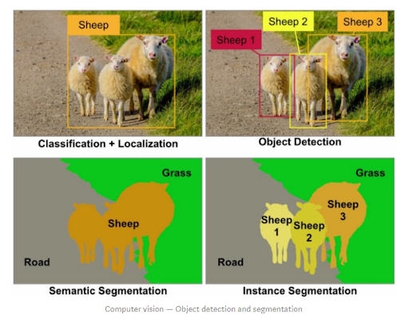

# AIFFEL_63일차 2020.10.26

Tags: AIFFEL_DAILY

### 일정

- [x]  GD Lec4
- [ ]  해커톤 3 논문목록 정리하기
    - [ ]  Object Detection, Instance Segmentation 기본 논문
    - [x]  DeepFashion2 데이터셋 논문 내용 정리해놓기
- [x]  ReID 관련 찾아보기

# GD Lec4

물체를 분리하자! - 세그멘테이션 살펴보기

## 학**습 목표**

---

1. 세그멘테이션의 방식을 공부합니다.
2. 시맨틱 세그멘테이션 모델의 결괏값을 이해합니다.
3. 시맨틱 세그멘테이션을 위한 접근 방식을 이해합니다.

## 세그멘테이션 문제의 종류

---

1. 인스턴스 세그멘테이션
2. 시맨틱 세그멘테이션

영역 분리라는 관점에서는 비슷하지만, 두 방법은 분명 차이가 있다!

- 시맨틱 세그멘테이션 : 이미지 내에서 각 픽셀이 갖는 의미를 통해 영역 분리. 단, 각 픽셀이 어느 개체에 속하는지는 상관하지 않음. 구분된다고 생각되는 영역을 분리하기만 한다!
- 인스턴스 세그멘테이션 : 각 개체에 따른 영역 획득.

### 시맨틱 세그멘테이션

***U-Net*** 시맨틱 세그멘테이션의 대표적인 모델!

⇒ 마지막 ouput layer 의 채널 수가 '2' 이다.

⇒ 두 가지 클래스를 정의하면, 클래스에 따른 시맨틱 세그멘테이션 맵을 얻을 수 있다는 의미!

⇒ [EX] 인물사진 모드에서는 사람과 배경을 나누는 것, 세포 사진에서 병이 있는 영역과 정상인 영역 나눔.

⇒ 그리고 , ouput layer 크기가 388 x 388 이잖아. 여태 봐왔던 image classification, object detection 문제보다 확실히 크지! ⇒ why? 세그멘테이션을 위해 이미지의 각 픽셀에 해당하는 영역의 클래스 정보 필요.

### 인스턴스 세그멘테이션

같은 클래스 내라도 각 객체(instance)들을 분리하여 세그멘테이션 수행.

⇒ 대표적인 것이 ***Mask R-CNN***

⇒ 2 stage Detection 에서 대표적인 Faster R-CNN 을 계승한 모델임.

⇒ ***RoI(Region of Interest) Pooling Layer (RoIPool)*** 개념을 개선하여 Segmentation에 유리하게 한 ***RoIAlign ,*** 그리고 ***클래스별 마스크 분리*** 두 가지 아이디어를 통해 클래스별 Object Detection 과 Semantic Segmentation을 하나의 Task로 엮어낸 것으로 평가받는다!

***그럼 일단 Faster R-CNN 계열에서 사용하는 RoIPool 개념을 살펴보자***

⇒ RoI pooling을 통해 고정된 사이즈의 Feature map 으로 만들고, 이 고정 사이즈 feature map 을바탕으로 바운딩 박스와 object의 클래스 추론.

⇒ Object Detection 을 위해서는 문제가 되지 않는다!

⇒ 하지만, object 영역의 정확한 마스킹이 필요한 Segmentation 문제에서는 문제가 발생한다!

⇒ Why? RoIPool 과정에서 ***Quantization*** 이 필요하다는 점에서!

*이미지에서 RoI 영역의 크기는 다양한데, 모든 RoI 영역의 가로/세로 픽셀 크기가 16의 배수인 것은 아닙니다. 아래 그림의 예에서 가로 200, 세로 145픽셀짜리 RoI 영역을 ~~~~16X16으로 분할된 영역 중 절반 이상이 RoI 영역에 덮히는 곳들로 끼워맞추다 보면, 어쩔 수 없이 RoI 영역 밖이 포함되는 경우도 있고, 자투리 영역이 버려지는 경우도 생기게 됩니다.*

(항상 16x16 으로 나눈다는 것이 아니라, RoI pooling layer 의 크기에 맞춰서 나눠놓은 것 뿐 ㅇㅇ 문제별로 다른 크기이다) 

⇒ 따라서, 시맨틱 세그멘테이션의 정보손실과 왜곡을 야기한다.

⇒ 그치, 전체 이미지를 16x16 그리드로 쪼개놓고, 거기서 RoI 를 뽑아낸다고 하면, 이미지 가로 세로 길이가 16의 배수가 아닌 이상 부분적으로 포함되는 grid가 생기게 될 것이고!

⇒ 이는 data loss 와 gain 을 만들게 되는데, 이게 정보 손실과 왜곡을 야기한다는 의미! 

따라서, Mask R-CNN의 ***RoIAlign*** 은 Quantization 하지 않고도 RoI를 처리할 고정 사이즈의 feature map을 생성할 수 있도록 한다!

⇒ How? 일단은 RoI 영역을 pooling layer의 크기에 맞춰 등분한 후, RoIPool 했을 때의 quantization 영역 중 가까운 것들과의 ***bilinear interpolation*** 계산을 진행하여 생성할 Feature Map을 계산해낸다.

---

[RoI Align 참고자료]

[https://towardsdatascience.com/understanding-region-of-interest-part-2-roi-align-and-roi-warp-f795196fc193](https://towardsdatascience.com/understanding-region-of-interest-part-2-roi-align-and-roi-warp-f795196fc193)

RoI Pooling을 하면, data loss & gain 이 생긴다는 문제가 있다!

⇒ 당장은 사소해보일 수 있지만, 시간이 지날수록 모델 전체에 큰 영향을 끼칠 수 있다는거지.

⇒ 그래서 해결하고자 했던거다.

***RoI Align***

The main difference between RoI Pooling and RoI Align is ***quantization(양자화...??).***

원래 Fast R-CNN 에서 하던 방식 ( 두번의 Quantization 이 발생한다 )

원래 RoI를 동일한 크기의 박스로 나누고, 각각에 대해 bilinear interpolation을 적용!

***Bilinear Interpolation***

Bilinear interpolation은 우리 말로 적자면 쌍선형 보간법, 또는 이중선형 보간법 정도가 되며 1차원에서의 선형 보간법을 2차원으로 확장한 것이다.

좌상단 사각형을 봐보자, 원래 feature map 에서 6개의 구역(사각형)을 담고 있는 것을 알 수 있다!

pooling layer 를 위한 값을 추출하기 위해 데이터를 sample 할 필요가 있다. 그리고 데이터를 sample하기 위해 박스(새로 설정한 박스) 안에 4개의 sampling point를 지정한 모습이다.

위에 보인 점 계산처럼, 네 개의 점 계산을 끝내면 아래와같은 형태가 된다.

그리고 네 개의 점 값에 대해 Max Pooling을 실시하면 첫 번째 칸의 값이 채워진다. (Average Pooling을 해도 된다고 한다.)

그래서, 각각의 사각형에 대해 진행하는 것은, 아래와 같은 모습이다.

그리고, 이 과정을 모든 채널에 대해 진행해야한다.

그래서, 결국 RoIAlign 과 RoIPooling 을 비교하자면! data loss가 사라진 것을 알 수 있다.

---

그리고, Mask R-CNN은 Faster R-CNN 에서 Feature extraction 방식을 RoIPooling 에서 RoIAlign 방식으로 개선하고 세그맨테이션을 더한 방식!

feature map 의 크기를 키워서 mask 를 생성해내는 부분을 통해 인스턴스에 해당하는 영역, 즉 인스턴스 맵을 추론한다.

Bbox regression 을 하는 Bbox head와 마스크를 예측하는 Mask head의 두 갈래로 나뉘는 것이 보인다.

⇒ 그리고, Mask map의 경우 시맨틱 세그멘테이션과 달리 상대적으로 작은 feature map 크기를 갖는다(28 x 28) ( semantic segmentation은 388x388 인가 그랬잖아) 

⇒ RoIAlign 을 통해 줄어든 feature 에서 마스크를 예측하기 때문에 목적에 따라 적확한 마스크를 얻으려는 경우에는 부적합 할 수도 있다는 점을 시사.

*세그멘테이션 모델의 발달 역사를 살펴봅시다.*

## 주요 세그멘테이션 모델 (1) FCN

---

[참고자료]

---

[https://medium.com/@msmapark2/fcn-논문-리뷰-fully-convolutional-networks-for-semantic-segmentation-81f016d76204](https://medium.com/@msmapark2/fcn-%EB%85%BC%EB%AC%B8-%EB%A6%AC%EB%B7%B0-fully-convolutional-networks-for-semantic-segmentation-81f016d76204)

Fully Convolutional Network 는 Semantic Segmentation 모델을 위해 기존 CNN 기반 모델(AlexNet,...)을 목적에 맞춰 변형시킨 것.

이러한 [Image classification model] to [Semantic segmentation model]은 크게 다음의 세 과정으로 표현할 수 있다:

- ***Convolutionalization***
    - segmentation 에서는 위치정보가 중요하다! 근데 fc-layer 는 위치 정보를 없애버린다.
    - 따라서, 위치 정보를 보존하기 위해 fc-layer 를 conv-layer로 대체한다.
- ***Upsampling***
    - 근데, Semantic segmentation의 최종 목적인 픽셀 단위 예측과 비교해보면, output feature map 은 너무 coarse 하게 된다!
    - Conv Layer 를 거치면서 feature map 의 크기는 줄어들고 차원이 늘어나는 형태, 즉 정보의 압축 상태가 되어있을테니까.
    - 이것을 해결하기 위해, 이런 Coarse map을 원본 이미지 크기에 가까운 Dense map으로 변환할 필요가 있다.
    - 단, Pooling을 사용하지 않거나 stride를 줄여서 feature map의 크기가 작아지는 것을 처음부터 피할 수도 있지만, receptive field가 줄어들어서 이미지의 컨텍스트를 놓치게 된다! (한 번에 넓게넓게 쳐다보면서 이미지 맥락) && Pooling 안하면 연산량도 엄청 늘어나게 되겠지!
    - 이런 맥락때문에 Upsampling을 사용하는거임.
- ***Skip architecture***
    - Deep & Coarse 레이어의 의미적(Semantic) 정보와 Shallow & Fine 층의 외관적 정보를 결합한 Skip architecture.

        

FCNs은 기존의 딥러닝 기반 이미지 분류를 위해 학습이 완료된 모델의 구조를 Semantic Segmentation 목적에 맞게 수정하여 Transfer learning 하였다.

Convolutionalized 모델을 통해 예측된 Coarse map을 원본 이미지 사이즈와 같이 세밀(Dense)하게 만들기 위해 Up-sampling을 수행하였다.

또한 Deep Neural Network에서 **얕은 층의 Local 정보와 깊은 층의 Semantic 정보를 결함하는 Skip architecture**를 통해 보다 정교한 Segmantation 결과를 얻을 수 있었다.

FCNs은 End-to-End 방식의 Fully-Convolution Model을 통한 Dense Prediction 혹은 Semantic Segmentation의 초석을 닦은 연구로써 이후 많은 관련 연구들에 영향을 주었다.

---

FCN에서는 세그멘테이션을 하기 위해서 네트워크 뒷단에 fully connected layer 대신 CNN을 붙여줍니다.

마지막 CNN은 어떤 세팅을 갖게 될까요? 위치의 특성을 유지하면서 이미지 분류를 하기 위해서 마지막 CNN은 1x1의 커널 크기(kernel size)와 클래스의 개수만큼의 채널을 갖습니다. 이렇게 CNN을 거치면 클래스 히트맵을 얻을 수 있습니다.

⇒ Skip Architecture를 보여주는 그림

⇒ Deep & Coarse 레이어의 의미적(Semantic) 정보와 Shallow & Fine 층의 외관적 정보를 결합

( pool3는 비교적 Shallow & Fine 인거고, pool5는 비교적 Deep & Coarse 인거임 )

## 주요 세그멘테이션 모델 (2) U-Net

---

이름처럼, U자 형태를 띈다! downsampling 과 upsampling 을 (or encoding, decoding) 대칭으로 하는 구조.

FCN 에서 upsampling을 통해서 특성 맵을 키운 것을 입력값과 대칭적으로 만들어준다!

---

[참고자료]

[https://medium.com/@msmapark2/u-net-논문-리뷰-u-net-convolutional-networks-for-biomedical-image-segmentation-456d6901b28a](https://medium.com/@msmapark2/u-net-%EB%85%BC%EB%AC%B8-%EB%A6%AC%EB%B7%B0-u-net-convolutional-networks-for-biomedical-image-segmentation-456d6901b28a)

이미지의 전반적인 컨텍스트 정보를 얻기 위한 네트워크와 **정확한 지역화(Localization)**를 위한 네트워크가 대칭 형태로 구성

수축 단계

팽창 단계

팽창 단계는 말 그대로 수축 단계의 최종 단계에서 나온 feature map 보다 높은 해상도의 Segmentation 결과를 얻기 위해 몇 차례의 Upsampling 진행.

즉, Coarse Map 에서 Dense Prediction을 얻기 위한 구조.

**The Contracting Path**

- 3x3 convolutions을 두 차례씩 반복 (패딩 없음)
- 활성화 함수는 ReLU
- 2x2 max-pooling (stride: 2)
- Down-sampling 마다 채널의 수를 2배로 늘림

주목해야 하는 점은 최종 출력인 Segmentation map의 크기는 Input Image 크기보다 작다는 것이다. Convolution 연산에서 패딩을 사용하지 않았기 때문이다.

**The Expanding Path**

- 2x2 convolution ~~(“up-convolution”,~~ 'transpose convolution')
- 3x3 convolutions을 두 차례씩 반복 (패딩 없음)
- Up-Conv를 통한 Up-sampling 마다 채널의 수를 반으로 줄임
- 활성화 함수는 ReLU
- Up-Conv 된 특징맵은 Contracting path의 테두리가 Cropped된 특징맵과 concatenation 함
- 마지막 레이어에 1x1 convolution 연산

### **Overlap-Tite Input**

Fully Convolutional Network 구조의 특성상 입력 이미지의 크기에 제약이 없다. 따라서 U-Net 연구팀은 크기가 큰 이미지의 경우 이미지 전체를 사용하는 대신 overlap-tite 전략을 사용하였다.

⇒ 이미지를 타일(Tile ; Patch)로 나눠서 입력으로 사용!

⇒ 파란 이미지를 입력하면 노란 영역의 Segmentation 결과를 얻는 식.

⇒ 그리고, 다음 tile에 대한 segmentation을 얻기 위해서는 이전 입력의 일부가 포함되어있어야 함. 그런 이유로 이름이 Overlap-Tite 전략임!

### Mirroring extrapolatation

이미지의 경계 부분 픽셀에 대한 세그멘테이션을 위해 0이나 임의의 패딩값을 사용하는 대신 이미지 경계 부분의 미러링을 이용한 Extrapolatation 기법을 사용

U-Net은 FCNs보다 확장된 개념의 Up-sampling과 Skip Architecture를 적용한 모델을 제안하였다. 결과적으로 U-Net의 구조는 아주 적은 양의 학습 데이터만으로 Data Augmentation을 활용하여 여러 Biomedical Image Segmentation 문제에서 우수한 성능을 보여주었다.

---

U-Net이 세그멘테이션뿐만 아니라 여러 이미지 태스크에서 사용되는 유명 네트워크가 되었지만, 원래 의학논문으로 시작되었다! 제목도 biomedical image segmentation 인거보면 ㅇㅇ

### 전체 구조

- 좌측 Contracting path
- 우측 Expansive path

마지막 세그멘테이션 맵의 크기가 입력 이미지와 다른 것은 앞에서 이야기한 것처럼 세그멘테이션 맵을 원하는 크기로 조정하여(resize) 해결할 수 있습니다. 원본 이미지에 맞게 크기를 조정해주면 위에서 봤던 우리가 원하는 시맨틱 세그멘테이션 결과를 얻을 수 있게 되죠.

### 타일(Tile or Patch) 기법

FCN은 입력 이미지의 크기를 조정하여 세그멘테이션 맵을 얻어냈습니다. 반면 U-Net은 타일(tile) 방식을 사용해서 어느 정도 서로 겹치는 구간으로 타일을 나누어 네트워크를 추론, 큰 이미지에서도 높은 해상도의 세그멘테이션 맵을 얻을 수 있도록 했습니다.

### 데이터 분균형 해결

세포 검출을 위해서는 세포의 영역뿐만 아니라 경계 또한 예측이 필요함.

픽셀 단위로 라벨을 매기면, 데이터셋에 세포나 배경보다는 절대적으로 세포 간 경계 면적이 작을 것임.

이런 class data imbalance 문제를 해결하기 위해서, 분포를 고려한 weight map을 학습에 사용.

여기서 weight map의 weight를 신경망의 학습 파라미터를 가리키는 weight라고 착각할 수도 있지만, 여기서 말하는 weight는 손실함수(loss)에 적용되는 가중치를 말함.

의료 영상에서 세포 내부나 배경보다는 상대적으로 면적이 작은 세포 경계를 명확하게 추론해 내는 것이 더 중요하기 때문에, 세포 경계의 손실에 더 많은 패널티 부과. ( 경계 추론이 더 중요한 일인데, 그걸 할 수 있는 데이터는 상대적으로 적은 상황이잖아? 그럼, 그 일을 하는 중에 일을 잘못하면 더 많은 패널티를 준다. )

## 주요 세그멘테이션 모델 (3) DeepLab 계열

---

***우선, Inception Module 에 대해 복습해보자!***

***그럼 DeepLab 계열은 뭐냐?***

- A. Convolution 을 할 때 하나의 큰 kernel 을 사용할게 아니라 다양한 크기를 이어붙이는것이 연산량 & parameter의 개수도 적도, 좋은 결과를 얻을 수 있다! ⇒  Inception 모듈의 활용
- B. 거기에 ResNet 넣으면 수렴속도도 빨라지고
- C. 하는김에 Factorization 까지 하면 더 연산량도 줄고

그리고, 어떻게 Inception module 을 구성하느냐에 따라 버젼이 바뀐다! (DeepLab v1, v2, v3, v3+)

[참고자료]

---

[https://blog.lunit.io/2018/07/02/deeplab-v3-encoder-decoder-with-atrous-separable-convolution-for-semantic-image-segmentation/](https://blog.lunit.io/2018/07/02/deeplab-v3-encoder-decoder-with-atrous-separable-convolution-for-semantic-image-segmentation/)

### ***Atrous convolution***

Atrous convolution은 기존 convolution과 다르게, 필터 내부에 빈 공간을 둔 채로 작동하게 됩니다. 위 예시에서, 얼마나 빈 공간을 둘 지 결정하는 파라미터인 rate *r*=1일 경우, 기존 convolution과 동일하고, *r*이 커질 수록, 빈 공간이 넓어지게 됩니다.

Atrous convolution을 활용함으로써 얻을 수 있는 이점은, 기존 convolution과 동일한 양의 파라미터와 계산량을 유지하면서도, field of view (한 픽셀이 볼 수 있는 영역) 를 크게 가져갈 수 있게 됩니다.

보통 semantic segmentation에서 높은 성능을 내기 위해서는 convolutional neural network의 마지막에 존재하는 한 픽셀이 입력값에서 어느 크기의 영역을 커버할 수 있는지를 결정하는 ***receptive field 크기가 중요***하게 작용합니다. Atrous convolution을 활용하면 파라미터 수를 늘리지 않으면서도 receptive field를 크게 키울 수 있기 때문에 DeepLab series에서는 이를 적극적으로 활용하려 노력함.

### Spatial Pyramid Pooling

DeepLab V2에서는 feature map으로부터 여러 개의 rate가 다른 atrous convolution을 병렬로 적용한 뒤, 이를 다시 합쳐주는 **atrous spatial pyramid pooling (ASPP)** 기법을 활용할 것을 제안

⇒ SPP 에 input으로 들어오는 CNN input이 서로 다른 rate를 기준으로 한 atrous convolution 의 결과라는 의미임!

DeepLab 에서는 ASPP를 기본 모듈로 사용.

### Depthwise Separable Convolution

[1] 원래 conv 연산

원래 Conv 연산

입력 이미지가 8×8×3 (H×W×C) 이고, convolution filter 크기가 3×3 (F×F) 이라고 했을 때, filter 한 개가 가지는 파라미터 수는 3×3×3 (F×F×C) = 27 이 됩니다. 만약 filter가 4개 존재한다면, 해당 convolution의 총 파라미터 수는 3×3×3×4 (F×F×C×N) 만큼 지니게 됩니다.

[2] Depthwise conv 연산

Depthwise Conv 연산

Convolution 연산에서 channel 축을 filter가 한 번에 연산하는 대신에, 위 그림과 같이 입력 영상의 channel 축을 모두 분리시킨 뒤, channel 축 길이를 항상 1로 가지는 여러 개의 convolution 필터로 대체시킨 연산을 depthwise convolution이라고 합니다.

[3] Depthwise Separable Conv 연산

Depthwise Separable Conv 연산

이제, 위의 depthwise convolution으로 나온 결과에 대해, 1×1×C 크기의 convolution filter를 적용한 것을 ***depthwise separable convolution*** 이라 합니다. 이처럼 복잡한 연산을 수행하는 이유는 기존 convolution과 **유사한 성능을 보이면서도 사용되는 파라미터 수와 연산량을 획기적으로 줄일 수 있기 때문**입니다.

[EX] 입력값이 8×8×3 이고 16개의 3×3 convolution 필터를 적용할 때 사용되는 파라미터의 개수는

- Convolution: Filter size x Filter size x (# of channels) x (# of filters) ⇒ 3×3×3×16 = 432
- Depthwise separable convolution: Filter size x Filter size x (# of channels)  + 1 x 1 x (# of channels) x (# of filters) ⇒ 3×3×3 + 3×16 = 27 + 48 = 75
    - ⇒  **spatial dimension,** 한 층에 대해 Filter size x Filter size 갯수만큼의 파라미터 를 갖는 필터가 있고, 그게 층수만큼 있는거니까  Filter size x Filter size x (# of channels)
    - ⇒ **channel dimension,** 층별로 convolution 한 결과물에 대해 filter 숫자만큼 1x1 conv 진행

Depthwise separable convolution은 기존 convolution filter가 **spatial dimension**과 **channel dimension**을 동시에 처리하던 것을 따로 분리시켜 각각 처리한다고 볼 수 있습니다. 이 과정에서, 여러 개의 필터가 spatial dimension 처리에 필요한 파라미터를 하나로 공유함으로써 파라미터의 수를 더 줄일 수 있게 됩니다. 두 축을 분리시켜 연산을 수행하더라도 최종 결과값은 결국 두 가지 축 모두를 처리한 결과값을 얻을 수 있으므로, 기존 convolution filter가 수행하던 역할을 충분히 대체할 수 있게 됩니다.

픽셀 각각에 대해서 label을 예측해야 하는 **semantic segmentation**은 난이도가 높은 편에 속하기 때문에 CNN 구조가 깊어지고 **receptive field를 넓히기 위해 더 많은 파라미터들을 사용하게 되는 상황에서**, **separable convolution**을 잘 활용할 경우 모델에 필요한 **parameter 수를 대폭 줄일 수** 있게 되므로 보다 깊은 구조로 확장하여 성능 향상을 꾀하거나, 기존 대비 메모리 사용량 감소와 속도 향상을 기대할 수 있습니다.

### DeepLabV3+ 의 구조 및 주요 구성요소

- Encoder: ResNet with atrous convolution →V3+부터 대체 → **Xception**(Inception with separable convolution)
- ASPP → ASSPP (Atrous Separable Spatial Pyramid Pooling)
- Decoder: Bilinear upsampling → Simplified U-Net style decoder

Encoder와 ASPP, 그리고 decoder 모두 separable convolution을 적극 활용함으로써 파라미터 사용량 대비 성능 효율을 극대화시키려는 노력이 보이는 구조.

아무튼 Semantic Segmentation 을 시작해보기에 가장 좋은 시작점 중에 하나! DeepLabV3+

---

U-Net에서의 Contracting path과 Expansive path의 역할을 하는 것이 여기서는 위 그림의 인코더(Encoder), 디코더(Decoder)

다양한 rate의 Atrous Convolution 을 병렬적으로 다양하게 적용하고, 그걸 Spatial Pyramid Pooling : ASPP

ASPP가 있는 블록을 통해 특성을 추출하고 디코더에서 Upsampling 을 통해 세그멘테이션 마스크를 얻음,

### Atrous Convolution

다시 설명해보자면, '띄엄띄엄 보는 컨볼루션 연산' 으로 설명할 수 있다.

Conv Layer 를 너무 깊게 쌓지 않아도 넓은 영역의 정보를 커버할 수 있게 되는거지.

### Spatial Pyramid Pooling

[Spatial Pyramid Pooling](https://www.notion.so/Spatial-Pyramid-Pooling-a1d9b3789e034ade8aa6d55495f905a3)

## 세그멘테이션의 평가

---

[참고자료]

[https://www.jeremyjordan.me/evaluating-image-segmentation-models/](https://www.jeremyjordan.me/evaluating-image-segmentation-models/)

일반적으로 시맨틱 세그멘테이션의 결괏값은 이미지의 크기에 맞는 세그멘테이션 맵 크기 와 시맨틱 클래스의 수에 맞는 채널 크기 를 갖습니다. 여기서 각 채널의 max probability에 따라서 **해당 위치의 클래스**가 결정됩니다.

### 픽셀별 정확도

말 그대로 픽셀에 따른 정확도

예측 결과 맵(prediction map)을 클래스 별로 평가하는 경우에는 이진 분류 문제(binary classification)로 생각해 픽셀 및 채널 별로 평가. 픽셀별 이미지 분류 문제로 평가하는 경우에는 픽셀 별로 정답 클래스를 맞추었는지 여부, 즉 True/False를 구분

### 마스크 IoU (Mask Intersection-over-Union)

정답인 영역과 예측한 영역의 IoU를 계산하여 산출해볼 수 있다!

마스크 IoU를 클래스별로 계산하면 한 이미지에서 여러 클래스에 대한 IoU 점수를 얻을 수 있다.

이를 평균하면 전체적인 시맨틱 세그멘테이션의 성능 가늠 가능.

## Upsampling의 다양한 방법

---

[Upsampling](https://www.notion.so/Upsampling-4d5fc47dba014e988c10477b1ed9b5d9)

### Nearest Neighbor

### Bilinear Interpolation

두 축에 대해서 선형보간법을 통해 필요한 값을 메우는 방식.

$R_1, R_2$ 를 구해내고, 이 두 값을 통해 P 값을 구해내는 방식.

### Transposed Convolution

[참고자료]

---

[https://zzsza.github.io/data/2018/06/25/upsampling-with-transposed-convolution/](https://zzsza.github.io/data/2018/06/25/upsampling-with-transposed-convolution/)

요약하면, convolution matrix는 kernel weights의 재배치일 뿐이고 convolution 연산은 convolution matrix를 사용해 표현할 수 있습니다.

### **Transposed Convolution Matrix**

4(2x2)에서 16(4x4)로 가고 싶습니다. 따라서 우리는 16x4 matrix를 사용합니다. 또한 1 to 9의 관계를 유지하길 원합니다.

Convolution matrix C(4x16)를 C.T(16x4)로 Transpose 했다고 가정하겠습니다. C.T(16x4)와 column vector(4x1)를 행렬 곱해서 output matrix(16x1)를 구할 수 있습니다. Transposed matrix는 1개의 값을 9개의 값들과 연결합니다.

주의 : matrix의 실제 가중치는 기존의 convolution matrix로 계산되지 않아도 됩니다. 중요한 것은 가중치 배치가 convolution matrix의 transpose에 의해 바뀌는 것입니다.

Transposed convolution을 up-sampling시 사용할 수 있습니다. 또한 Transposed convolution의 가중치들은 학습 가능하기 때문에 미리 정의된 보간 방법이 필요하지 않습니다.

Transposed convolution이라고 부르지만, 기존에 있던 convolution matrix를 Transpose해서 사용하는 것을 의미하진 않습니다. 핵심은 input과 output간의 연관성이 일반 convolution matrix와 비교할 때 역방향으로 처리되는 것입니다(many-to-one이 일반 convolution matrix, one-to-many가 transposed convolution)

따라서 Transposed convolution은 convolution이 아닙니다. 그러나 convolution을 사용해 transposed convolution을 모방할 수 있습니다.