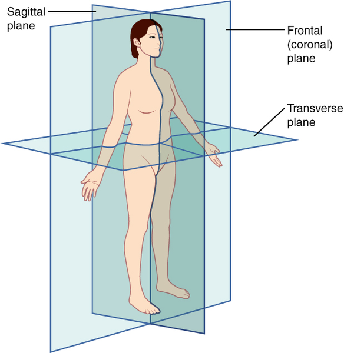

# AIFFEL_64일차 2020.10.27

Tags: AIFFEL_DAILY

### 일정


- [x]  해커톤 3 팀명 회의, 데이터셋 안내
- [x]  LMS E-22

# 해커톤 3 준비


팀명 투표, 데이터셋 안내

# [E-22] 폐렴아 기다려라!


의료영상을 분석하는 것은 일반적인 이미지 처리와는 다소 다른 독특한 특징이 있습니다.

- 의료영상 이미지는 개인정보 보호 등의 이슈로 인해 데이터를 구하는 것이 쉽지 않습니다.
- 라벨링 작업 자체가 전문적 지식을 요하므로 데이터셋 구축 비용이 비쌉니다.
- 희귀질병을 다루는 경우 데이터를 입수하는 것 자체가 드문 일입니다.
- 음성/양성 데이터간 **imbalance**가 심합니다. 학습에 주의가 필요합니다.
- 이미지만으로 진단이 쉽지 않아 다른 데이터와 결합해서 해석해야 할수도 있습니다.

## 의료영상에 대해

---

### **CT**

- CT는 Computed Tomography의 줄임말로, 환자를 중심으로 **X-RAY를 빠르게 회전하여 3D 이미지를 만들어내는 영상**입니다. 환자의 3 차원 이미지를 형성하여 기본 구조는 물론 가능한 종양 또는 이상을 쉽게 식별하고 위치를 파악할 수 있습니다.
- 신체의 단면 이미지를 "Slice"라고 합니다. 이러한 Slice는 단층 촬영 이미지라고도 하며 기존의 X-RAY보다 더 자세한 정보를 포함합니다.

### **MRI**

- MRI는 Magnetic Resonance Imaging(자기 공명 영상)의 줄임말로 신체의 해부학적 과정과 생리적 과정을 보기 위해 사용하는 의료 영상 기술 입니다. MRI 스캐너는 강한 자기장를 사용하여 신체 기관의 이미지를 생성합니다. MRI는 CT, X-RAY와 다르게 방사선을 사용하지 않아서 방사선의 위험성에서는 보다 안전. 오호...

## X-RAY 이미지

---



영상 촬영은 인체를 세 방향의 단면으로 나누어 진행됩니다.

- **Sagittal plane** : **시상면**. 사람을 왼쪽과 오른쪽을 나누는 면.
- **Coronal plane** : **관상면**. 인체를 앞 뒤로 나누는 면.
- **Transverse plane** : **횡단면(수평면)**. 인체를 상하로 나누는 면.

## 폐렴을 진단해보자 (1)

---

폐렴은 쉽게 말해 폐에 염증이 생기는 것.

염증은 쉽게 말해 우리 몸을 지키기 위해 백혈구들이 싸우고 있는 장소.

폐렴이라면 폐에서 바이러스나 세균으로부터 우리 몸을 지키기 위해 백혈구들이 싸우고 있는 상황.


X-RAY 사진상, 다양한 양상의 음영(폐 부위에 희미한 그림자) 증가가 관찰


세균성 폐렴 (가운데)은 일반적으로 오른쪽 상부 엽 (흰색 화살표)에 있는 나타내는 반면

바이러스성 폐렴 (오른쪽)은 양쪽 폐에서보다 확산 된 "interstitial(조직 사이에 있는)" 패턴.

⇒ 특정 패턴이 발견된다!

⇒ 패턴이 발견되면? 딥러닝 알고리즘에 학습시킬 수 있다!

⇒ 결국, 패턴인식 알고리즘의 일종이니까.

```python
import re    # 정규표현식 관련된 작업에 필요한 패키지
import os    # I/O 관련된 작업에 필요한 패키지 
import pandas as pd     # 데이터 전처리 관련된 작업에 필요한 패키지
import numpy as np      # 데이터 array 작업에 필요한 패키지
import tensorflow as tf  # 딥러닝 관련된 작업에 필요한 패키지
import matplotlib.pyplot as plt    # 데이터 시각화에 관련된 작업에 필요한 패키지
from sklearn.model_selection import train_test_split  # 데이터 전처리에 필요한 패키지
```

```python
# 데이터 로드할 때 빠르게 로드할 수 있도록하는 설정 변수
AUTOTUNE = tf.data.experimental.AUTOTUNE

# 데이터 ROOT 경로 변수
ROOT_PATH = os.path.join(os.getenv('HOME'), 'aiffel')

# BATCH_SIZE 변수
BATCH_SIZE = 16

# X-RAY 이미지 사이즈 변수
IMAGE_SIZE = [180, 180]

# EPOCH 크기 변수
EPOCHS = 25

print(ROOT_PATH)
```

### 데이터 가져오기

```python
train_filenames = tf.io.gfile.glob(str(ROOT_PATH + '/chest_xray/train/*/*'))
test_filenames = tf.io.gfile.glob(str(ROOT_PATH + '/chest_xray/test/*/*'))
val_filenames = tf.io.gfile.glob(str(ROOT_PATH + '/chest_xray/val/*/*'))

print(len(train_filenames))
print(len(test_filenames))
print(len(val_filenames))
```

⇒ train 안에는 5216개, test 안에는 624개, val 안에는 16개

⇒ val 너무 없으니 train에서 val 에 쓰일 데이터를 더 가져오자

```python
filenames = tf.io.gfile.glob(str(ROOT_PATH + '/chest_xray/train/*/*'))
filenames.extend(tf.io.gfile.glob(str(ROOT_PATH + '/chest_xray/val/*/*')))

# train, test(val) dataset으로 분할. test_size에 0.2는 20%롤 의미함.
train_filenames, val_filenames = train_test_split(filenames, test_size=0.2)

print(len(train_filenames))
print(len(val_filenames))
```

train 데이터 안에 정상 이미지와 폐렴 이미지 수

```python
COUNT_NORMAL = len([filename for filename in train_filenames if "NORMAL" in filename])
print("Normal images count in training set: " + str(COUNT_NORMAL))

COUNT_PNEUMONIA = len([filename for filename in train_filenames if "PNEUMONIA" in filename])
print("Pneumonia images count in training set: " + str(COUNT_PNEUMONIA))
```

```
Normal images count in training set: 1101
Pneumonia images count in training set: 3084
```

정상보다 폐렴 이미지 수가 3배 더 많다.

⇒ 클래스별 balance가 좋을수록 training을 더 잘한다!

⇒ class data imbalance는 차후 조정.

⇒ test 와 val 데이터는 평가를 위해 사용되는 것이기 때문에, 학습과 관련이 없다! 따라서, imbalance한 데이터셋이어도 문제 없다!

***tf.data 인스턴스 만들기***

tf.data 인스턴스는 tf에서 학습시킬 때 배치처리 작업을 보다 효율적으로 할 수 있도록 해준다.

```python
train_list_ds = tf.data.Dataset.from_tensor_slices(train_filenames)
val_list_ds = tf.data.Dataset.from_tensor_slices(val_filenames)
```

```python
TRAIN_IMG_COUNT = tf.data.experimental.cardinality(train_list_ds).numpy()
print("Training images count: " + str(TRAIN_IMG_COUNT))

VAL_IMG_COUNT = tf.data.experimental.cardinality(val_list_ds).numpy()
print("Validating images count: " + str(VAL_IMG_COUNT))
```

라벨 이름 확인.

```python
CLASS_NAMES = np.array([str(tf.strings.split(item, os.path.sep)[-1].numpy())[2:-1]
                        for item in tf.io.gfile.glob(str(ROOT_PATH + "/chest_xray/train/*"))])
print(CLASS_NAMES)
```

⇒ ['PNEUMONIA' 'NORMAL']

현재 이미지에 따로 라벨 데이터가 없기 때문에, 라벨 데이터 만들어주는 함수를 만들고 활용.

```python
def get_label(file_path):
    parts = tf.strings.split(file_path, os.path.sep)
    return parts[-2] == "PNEUMONIA"   # 폐렴이면 양성(True), 노말이면 음성(False)를 리턴하게 합니다.
```

***이미지 사이즈 관련 작업***

이미지 데이터는 사이즈 제각각일 가능성이 높다!

이미지 사이즈를 통일시키고 GPU 메모리 효율적 사용을 위해 이미지 사이즈를 줄여본다.

⇒ decode_img 함수, process_path 함수

process_path 함수에서 decode_img 함수를 이용해서 이미지의 데이터 타입을 float으로 바꾸고 사이즈를 변경합니다. get_label을 이용해서 라벨 값을 가져옵니다.

```python
def decode_img(img):
  # 이미지를 uint8 tensor로 바꾼다.
  img = tf.image.decode_jpeg(img, channels=3)
  # img를 범위 [0,1]의 float32 데이터 타입으로 바꾼다.
  img = tf.image.convert_image_dtype(img, tf.float32)
  # img의 이미지 사이즈를 IMAGE_SIZE에서 지정한 사이즈로 수정한다.
  return tf.image.resize(img, IMAGE_SIZE)

def process_path(file_path):
    label = get_label(file_path)
    img = tf.io.read_file(file_path)
    img = decode_img(img)
    return img, label
```

train 데이터셋과 validation 데이터셋 만들기

```python
train_ds = train_list_ds.map(process_path, num_parallel_calls=AUTOTUNE)
val_ds = val_list_ds.map(process_path, num_parallel_calls=AUTOTUNE)
```

num_parallel_calls 파라미터에서 set-up에서 초기화 한 AUTOTUNE을 이용하면 더욱 빠르게 데이터를 처리해줍니다. 오호...

이미지 확인

```python
for image, label in train_ds.take(1):
    print("Image shape: ", image.numpy().shape)
    print("Label: ", label.numpy())
```

테스트 데이터셋도 만들자

```python
test_list_ds = tf.data.Dataset.list_files(str(ROOT_PATH + '/chest_xray/test/*/*'))
TEST_IMAGE_COUNT = tf.data.experimental.cardinality(test_list_ds).numpy()
test_ds = test_list_ds.map(process_path, num_parallel_calls=AUTOTUNE)
test_ds = test_ds.batch(BATCH_SIZE)

print(TEST_IMAGE_COUNT)
```

학습 데이터를 효율적으로 할 수 있도록 데이터를 변환하는 함수 만들기

```python
def prepare_for_training(ds, shuffle_buffer_size=1000):
		# 고정 크기 버퍼를 유지하고 해당 버퍼에서 무작위로 균일하게 다음 요소를 선택
    ds = ds.shuffle(buffer_size=shuffle_buffer_size)
		
		# epoch를 진행하면서 여러번 데이터셋을 불러오게 되는데,
		# 이때 repeat()를 사용한 데이터셋의 경우 여러번 데이터셋을 사용할 수 있게 해줍니다.
		# 예를 들어, 100개의 데이터를 10번 반복하면 1000개의 데이터가 필요하게 됩니다.
		# repeat()를 사용하면 자동으로 데이터를 맞춰줍니다.
    ds = ds.repeat()

		# batch()를 사용하면 BATCH_SIZE에서 정한 만큼의 배치로 주어집니다.
    ds = ds.batch(BATCH_SIZE)

		# prefetch()를 사용하면 학습데이터를 나눠서 읽어오기 때문에,
		# 첫 번째 데이터를 GPU에서 학습하는 동안 두 번째 데이터를 CPU에서 준비할 수 있어
		# 리소스의 유휴 상태를 줄일 수 있습니다.
    ds = ds.prefetch(buffer_size=AUTOTUNE)

    return ds

train_ds = prepare_for_training(train_ds)
val_ds = prepare_for_training(val_ds)
```

### 데이터 시각화

batch 를 하나 추출해보고, 시각화해본다.

```python
image_batch, label_batch = next(iter(train_ds))

def show_batch(image_batch, label_batch):
    plt.figure(figsize=(10,10))
    for n in range(16):
        ax = plt.subplot(5,5,n+1)
        plt.imshow(image_batch[n])
        if label_batch[n]:
            plt.title("PNEUMONIA")
        else:
            plt.title("NORMAL")
        plt.axis("off")

show_batch(image_batch.numpy(), label_batch.numpy())
```


## 폐렴을 진단해보자(2)

---

Conv Block

```python
def conv_block(filters):
    block = tf.keras.Sequential([
        tf.keras.layers.SeparableConv2D(filters, 3, activation='relu', padding='same'),
        tf.keras.layers.SeparableConv2D(filters, 3, activation='relu', padding='same'),
        tf.keras.layers.BatchNormalization(),
        tf.keras.layers.MaxPool2D()
    ]
    )
    
    return block
```

⇒ Conv 2번 진행하고, BN 이후 MaxPooling

Dense Block

```python
def dense_block(units, dropout_rate):
    block = tf.keras.Sequential([
        tf.keras.layers.Dense(units, activation='relu'),
        tf.keras.layers.BatchNormalization(),
        tf.keras.layers.Dropout(dropout_rate)
    ])
    
    return block
```

Dense 이후 두가지 regularization 기법, BN 과 Dropout이 사용되는 중.

⇒ 근데, 일반적으로 이렇게 두 개 다 사용하는건 잘 사용되지 않거나 금기시되기도 함!

[예시_Understanding the Disharmony between Dropout and Batch Normalization by
Variance Shift]

[https://openaccess.thecvf.com/content_CVPR_2019/papers/Li_Understanding_the_Disharmony_Between_Dropout_and_Batch_Normalization_by_Variance_CVPR_2019_paper.pdf](https://openaccess.thecvf.com/content_CVPR_2019/papers/Li_Understanding_the_Disharmony_Between_Dropout_and_Batch_Normalization_by_Variance_CVPR_2019_paper.pdf)

⇒ 위 논문에서는 variance shift를 억제하는 Batch Normalization과 이를 유발시키는 Dropout을 동시에 사용하는 것이 어울리지 않는다고 밝히고 있습니다.

 

그러나, 실용적으로는 두 방법을 같이 쓰는 것이 낫다고 보는 견해도 없는 것은 아닙니다. 예외적으로 동시에 사용하는 것이 성능향상에 도움을 주는 경우가 실제로 있습니다. 아래 논문과 같이 두 방법을 같이 쓰는 것을 옹호하는 경우도 있습니다.

[Rethinking the Usage of Batch Normalization and Dropout in the Training of
Deep Neural Networks]

[https://arxiv.org/pdf/1905.05928.pdf](https://arxiv.org/pdf/1905.05928.pdf)

이 예제에서는 두가지를 동시에 사용하는 모델로 진행하잖아?? 성능 향상에 도움이 되는지 살펴볼만하지.

***모델 생성 함수***

```python
def build_model():
    model = tf.keras.Sequential([
        tf.keras.Input(shape=(IMAGE_SIZE[0], IMAGE_SIZE[1], 3)),
        
        tf.keras.layers.Conv2D(16, 3, activation='relu', padding='same'),
        tf.keras.layers.Conv2D(16, 3, activation='relu', padding='same'),
        tf.keras.layers.MaxPool2D(),
        
        conv_block(32),
        conv_block(64),
        
        conv_block(128),
        tf.keras.layers.Dropout(0.2),
        
        conv_block(256),
        tf.keras.layers.Dropout(0.2),
        
        tf.keras.layers.Flatten(),
        dense_block(512, 0.7),
        dense_block(128, 0.5),
        dense_block(64, 0.3),
        
        tf.keras.layers.Dense(1, activation='sigmoid')
    ])
    
    return model
```

### 데이터 imbalance 처리

Normal 데이터와 Pneumonia 데이터 중 Pneumonia 데이터가 더 많이 있었잖아!

⇒ 한 라벨의 데이터가 너무 많은 경우를 imbalance 하다고 표현!

⇒ 이런 경우 학습 효과가 당연히 좋지 않지.

⇒ 이런 문제를 해결하는 방법으로 **Weight balancing** 테크닉이 사용된다.

⇒ training set의 각 데이터에서 loss를 계산할 때 **특정 클래스의 데이터에 더 큰 loss 값을 갖도록 가중치**를 부여하는 방법. (데이터가 적은 라벨에 대해서 실수하면 자극을 더 강하게 주는거지!)

⇒ Keras 에서는 model.fit()을 호출할 때 파라미터로 넘기는 class_weight에 이러한 클래스별 가중치를 세팅할 수 있도록 지원한다.

---

[참고자료] [https://3months.tistory.com/414](https://3months.tistory.com/414)

**클래스 균형 클래스 균형은 소수의 클래스에 특별히 더 큰 관심이 있는 경우에 필요하다.**

[ex] 집을 사야하나 말아야 하나??

집을 사는것과 사지 말라고 하는 판단은 그 무게가 다르다.

집을 사라고 예측하는 것은 훨씬 더 큰 리스크를 수반함!

잘못 투자하면 엄청 큰 손실이 발생하니까!

⇒ 근데, 데이터가 집을 '사지 말라' 클래스에 몰려있는 경우, '사지 말라' 에 대한 정확도는 높아져도, '사라' 에 대한 정확도는 좋지 못하게 된다.

***⇒ 클래스 불균형이 있는 경우, 클래스 정확도가 달라진다.***

⇒ 따라서, '사라' 클래스에는 더 큰 비중(weight)를 두고 정확한 예측을 할 수있도록 만들어줘야함!

 

***Focal loss***

Focal loss 의 메인 아이디어는 다음과 같다. 다중 클래스 분류 문제에서, A, B, C 3개의 클래스가 존재한다고 하자. A 클래스는 상대적으로 분류하기 쉽고, B, C 클래스는 어렵다고 하자. 총 100번의 epoch 에서 단지 10번의 epoch 만에 validation set 에 대해 99 % 의 정확도를 얻었다. 그럼에도 불구하고 나머지 90 epoch 에 대해 A 클래스는 계속 loss 의 계산에 기여한다. 만약 상대적으로 분류하기 쉬운 A 클래스의 데이터 대신, **B, C 클래스의 데이터에 더욱 집중을 해서 loss 를 계산을 하면 전체적인 정확도를 더 높일 수 있지 않을까?** 예를 들어 batch size 가 64 라고 하면, 64 개의 sample 을 본 후, loss 를 계산해서 backpropagation 을 통해 weight 를 업데이트 하게 되는데 이 때, **이 loss 의 계산에 현재까지의 클래스 별 정확도를 고려한 weight 를 줌으로서 전반적인 모델의 정확도를 높이고자 하는 것**이다.


Focal loss 는 어떤 batch 의 트레이닝 데이터에 같은 weight 를 주지 않고, 분류 성능이 높은 클래스에 대해서는 down-weighting 을 한다. 이 때, gamma (위 그림) 를 주어, 이 down-weighting 의 정도를 결정한다. 이 방법은 분류가 힘든 데이터에 대한 트레닝을 강조하는 효과

focal loss 예시코드

```python
import keras
from keras import backend as K
import tensorflow as tf

# Define our custom loss function
def focal_loss(y_true, y_pred):
    gamma = 2.0, alpha = 0.25
    pt_1 = tf.where(tf.equal(y_true, 1), y_pred, tf.ones_like(y_pred))
    pt_0 = tf.where(tf.equal(y_true, 0), y_pred, tf.zeros_like(y_pred))
# 0과 1에 대해 loss 각각 계산해서 합치는 중
    return -K.sum(alpha * K.pow(1. - pt_1, gamma) * K.log(pt_1))-K.sum((1-alpha) * K.pow( pt_0, gamma) * K.log(1. - pt_0))

# Compile our model
adam = Adam(lr=0.0001)
model.compile(loss=[focal_loss], metrics=["accuracy"], optimizer=adam)
```

***Over and under sampling***

클래스 불균형을 다루기 위해 샘플링을 이용하는 방법도 있다!


majority인 데이터에서 일부만 가져오거나, minority 데이터를 여러 벌 복사해서 사용하거나

Oversampling은 데이터를 최대한 많이 사용하고자 할때 사용할 수 있겠지??

---

weight_balancing

```python
# normal 이미지에 사용할 weight
weight_for_0 = (1 / COUNT_NORMAL)*(TRAIN_IMG_COUNT)/2.0 

# pneumonia 이미지에 사용할 weight
weight_for_1 = (1 / COUNT_PNEUMONIA)*(TRAIN_IMG_COUNT)/2.0

# 전체 데이터 건수에 반비례하도록 설정된다.

class_weight = {0: weight_for_0, 1: weight_for_1}

print('Weight for class 0: {:.2f}'.format(weight_for_0))
print('Weight for class 1: {:.2f}'.format(weight_for_1))
```

### 모델 학습

모델 생성

```python
with tf.device('/GPU:0'):
    model = build_model()

    METRICS = [
        'accuracy',
        tf.keras.metrics.Precision(name='precision'),
        tf.keras.metrics.Recall(name='recall')
    ]
    
    model.compile(
        optimizer='adam',
        loss='binary_crossentropy',
        metrics=METRICS
    ) 
```

model 학습 진행

```python
with tf.device('/GPU:0'):
    history = model.fit(
        train_ds,
        steps_per_epoch=TRAIN_IMG_COUNT // BATCH_SIZE,
        epochs=EPOCHS,
        validation_data=val_ds,
        validation_steps=VAL_IMG_COUNT // BATCH_SIZE,
        class_weight=class_weight,
    )
```

### 결과 확인

```python
fig, ax = plt.subplots(1, 4, figsize=(20, 3))
ax = ax.ravel()

for i, met in enumerate(['precision', 'recall', 'accuracy', 'loss']):
    ax[i].plot(history.history[met])
    ax[i].plot(history.history['val_' + met])
    ax[i].set_title('Model {}'.format(met))
    ax[i].set_xlabel('epochs')
    ax[i].set_ylabel(met)
    ax[i].legend(['train', 'val'])
```

테스트 데이터로 모델 평가

```python
loss, acc, prec, rec = model.evaluate(test_ds)
```

의료 데이터는 얻기도 힘들고, 비싸고 암튼 그러하다! 그래서 Data Augmentation을 많이 사용한다!

그리고 Data Augmentation 이외에도 GAN을 이용하여 Data Augmentation을 시도하는 연구도 많다!

## 프로젝트: 폐렴 진단기 성능개선

---

결과물 : [https://github.com/bluecandle/2020_AIFFEL/blob/master/daily_notes/exploration_codes/e22_code/E22.ipynb](https://github.com/bluecandle/2020_AIFFEL/blob/master/daily_notes/exploration_codes/e22_code/E22.ipynb)