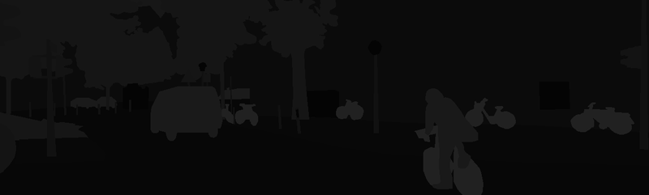

# AIFFEL_65일차 2020.10.28

Tags: AIFFEL_DAILY

### 일정


- [x]  LMS E-22 나머지 모델 2개 학습마무리 && 제출
- [x]  [GD4 Proj] 도로 영역을 찾자! - 세그멘테이션 모델 만들기
- [x]  선대 강의듣기

# [E-22] 모델 2개 학습 후 결과 제출


결과물 : [https://github.com/bluecandle/2020_AIFFEL/blob/master/daily_notes/exploration_codes/e22_code/E22.ipynb](https://github.com/bluecandle/2020_AIFFEL/blob/master/daily_notes/exploration_codes/e22_code/E22.ipynb)

# GD4 Proj

도로 영역을 찾자! - 세그멘테이션 모델 만들기


시맨틱 세그멘테이션!

U-Net을 사용해서 도로의 영역을 세그멘테이션 하는 모델을 만들어보자.


예상 결과물 : 도로 영역으로 인식한 영역을 흰색으로 오버레이한 모습

## **실습목표**

---

1. 시맨틱 세그멘테이션 데이터셋을 전처리할 수 있습니다.
2. 시맨틱 세그멘테이션 모델을 만들고 학습할 수 있습니다.
3. 시맨틱 세그멘테이션 모델의 결과를 시각화할 수 있습니다.

## 시맨틱 세그멘테이션 데이터셋

---

도로의 영역을 분리하려면, 도로의 영역을 라벨로 가진 데이터셋을 가지고 학습할 수 있도록 파싱해야지!

KITTI 데이터셋의 세그멘테이션 데이터를 사용한다.



[KITTI 데이터셋 세그멘테이션] 세그멘테이션 데이터는 이미지 형태의 라벨로 되어있다!


[KITTI 데이터셋 세그멘테이션 RGB]

### 데이터 로더 만들기

입력값(224,224), 출력값(224,224) 크기를 갖는 모델을 학습시킬 수 있도록 데이터셋 파싱.

augmentation도 적용할건데! 파이썬에서 많이 사용하는 `albumentations` 사용해보자. (imgaug 같은 다른 라이브러리 써도 됨)

데이터 로더를 만든 후에는, 데이터셋이 잘 파싱되어 나오는지 확인할 필요가 있다!

데이터셋에 오류가 없어야 성능이 안 나오더라도 문제를 찾아내기 쉬우니까!

```python
#필요한 라이브러리를 로드합니다. 
import os
import math
import numpy as np
import tensorflow as tf

from PIL import Image
import matplotlib.pyplot as plt
from skimage.io import imread
from skimage.transform import resize
from glob import glob

from tensorflow.keras.models import *
from tensorflow.keras.layers import *
from tensorflow.keras.optimizers import *
```

imgaug의 Sometimes()와 비슷한 기능으로, aug 기법을 확률적으로 적용하는 `Compose()` 활용 예시코드

```python
from albumentations import  HorizontalFlip, RandomSizedCrop, Compose, OneOf, Resize

# augmentation 기능을 뱉어내는 함수
def build_augmentation(is_train=True):
  if is_train:    # 훈련용 데이터일 경우
    return Compose([
                    HorizontalFlip(p=0.5),    # 50%의 확률로 좌우대칭
                    RandomSizedCrop(         # 50%의 확률로 RandomSizedCrop
                        min_max_height=(300, 370),
                        w2h_ratio=370/1242,
                        height=224,
                        width=224,
                        p=0.5
                        ),
                    Resize(              # 입력이미지를 224X224로 resize
                        width=224,
                        height=224
                        )
                    ])
  return Compose([      # 테스트용 데이터일 경우에는 224X224로 resize만 수행합니다. 
                Resize(
                    width=224,
                    height=224
                    )
                ])
```

적용해보기

```python
import os

dir_path = os.getenv('HOME')+'/aiffel/semantic_segmentation/data/training'

augmentation = build_augmentation()
input_images = glob(os.path.join(dir_path, "image_2", "*.png"))

# 훈련 데이터셋에서 5개만 가져와 augmentation을 적용해 봅시다.  
plt.figure(figsize=(12, 20))
for i in range(5):
    image = imread(input_images[i]) 
    image_data = {"image":image}
    resized = augmentation(**image_data, is_train=False)
    processed = augmentation(**image_data)
    plt.subplot(5, 2, 2*i+1)
    plt.imshow(resized["image"])  # 왼쪽이 원본이미지
    plt.subplot(5, 2, 2*i+2)
    plt.imshow(processed["image"])  # 오른쪽이 augment된 이미지
  
plt.show()
```


***데이터셋 구성해보자***
[참고자료]

[https://hwiyong.tistory.com/241](https://hwiyong.tistory.com/241)

[https://medium.com/the-artificial-impostor/custom-image-augmentation-with-keras-70595b01aeac](https://medium.com/the-artificial-impostor/custom-image-augmentation-with-keras-70595b01aeac)

```python
class KittiGenerator(tf.keras.utils.Sequence):
  '''
  KittiGenerator는 tf.keras.utils.Sequence를 상속받습니다.
  우리가 KittiDataset을 원하는 방식으로 preprocess하기 위해서 Sequnce를 커스텀해 사용합니다.
  '''
  def __init__(self, 
               dir_path,
               batch_size=16,
               img_size=(224, 224, 3),
               output_size=(224, 224),
               is_train=True,
               augmentation=None):
    '''
    dir_path: dataset의 directory path입니다.
    batch_size: batch_size입니다.
    img_size: preprocess에 사용할 입력이미지의 크기입니다.
    output_size: ground_truth를 만들어주기 위한 크기입니다.
    is_train: 이 Generator가 학습용인지 테스트용인지 구분합니다.
    augmentation: 적용하길 원하는 augmentation 함수를 인자로 받습니다.
    '''
    self.dir_path = dir_path
    self.batch_size = batch_size
    self.is_train = is_train
    self.dir_path = dir_path
    self.augmentation = augmentation
    self.img_size = img_size
    self.output_size = output_size

    # load_dataset()을 통해서 kitti dataset의 directory path에서 라벨과 이미지를 확인합니다.
    self.data = self.load_dataset()

  def load_dataset(self):
    # kitti dataset에서 필요한 정보(이미지 경로 및 라벨)를 directory에서 확인하고 로드하는 함수입니다.
    # 이때 is_train에 따라 test set을 분리해서 load하도록 해야합니다.
    input_images = glob(os.path.join(self.dir_path, "image_2", "*.png"))
    label_images = glob(os.path.join(self.dir_path, "semantic", "*.png"))
    input_images.sort()
    label_images.sort()
		# AssertionError 발생여부를 통해 상황 점검
    assert len(input_images) == len(label_images)
    data = [ _ for _ in zip(input_images, label_images)]

    if self.is_train:
      return data[:-30]
    return data[-30:]
    
  def __len__(self):
    # Generator의 length로서 전체 dataset을 batch_size로 나누고 소숫점 첫째자리에서 올림한 값을 반환합니다.
    return math.ceil(len(self.data) / self.batch_size)

  def __getitem__(self, index):
    # 입력과 출력을 만듭니다.
    # 입력은 resize및 augmentation이 적용된 input image이고 
    # 출력은 semantic label입니다.
    batch_data = self.data[
                           index*self.batch_size:
                           (index + 1)*self.batch_size
                           ]
    inputs = np.zeros([self.batch_size, *self.img_size])
    outputs = np.zeros([self.batch_size, *self.output_size])
        
    for i, data in enumerate(batch_data):
      input_img_path, output_path = data
      _input = imread(input_img_path)
      _output = imread(output_path)
      _output = (_output==7).astype(np.uint8)*1
      data = {
          "image": _input,
          "mask": _output,
          }
      augmented = self.augmentation(**data)
      inputs[i] = augmented["image"]/255
      outputs[i] = augmented["mask"]
      return inputs, outputs

  def on_epoch_end(self):
    # 한 epoch가 끝나면 실행되는 함수입니다. 학습중인 경우에 순서를 random shuffle하도록 적용한 것을 볼 수 있습니다.
    self.indexes = np.arange(len(self.data))
    if self.is_train == True :
      np.random.shuffle(self.indexes)
      return self.indexes
```

train, test generator 생성

```python
augmentation = build_augmentation()
test_preproc = build_augmentation(is_train=False)
        
train_generator = KittiGenerator(
    dir_path, 
    augmentation=augmentation,
)

test_generator = KittiGenerator(
    dir_path, 
    augmentation=test_preproc,
    is_train=False
)
```

## 시맨틱 세그멘테이션 모델

---

### 모델 구조 만들기 (U-Net)


모델 만들기

```python
def build_model(input_shape=(224, 224, 3)):
    model = None
    # TODO: input_shape에 따라 U-Net을 만들어주세요
    # 이때 model은 fully convolutional해야하합니다.
    
    # Contracting Path
      
    inputs = Input(input_shape)
    
    conv1_1 = Conv2D(filters=64, kernel_size=(3,3),activation='relu',padding='same',kernel_initializer='he_normal')(inputs)
    conv1_2 =Conv2D(filters=64, kernel_size=(3,3),activation='relu',padding='same',kernel_initializer='he_normal')(conv1_1)
    
    pool1 = MaxPooling2D(pool_size=(2,2))(conv1_2)
    
    conv2_1 = Conv2D(filters=128, kernel_size=(3,3),activation='relu',padding='same',kernel_initializer='he_normal')(pool1)
    conv2_2 = Conv2D(filters=128, kernel_size=(3,3),activation='relu',padding='same',kernel_initializer='he_normal')(conv2_1)
    
    pool2 = MaxPooling2D(pool_size=(2,2))(conv2_2)
    
    conv3_1 = Conv2D(filters=256, kernel_size=(3,3),activation='relu',padding='same',kernel_initializer='he_normal')(pool2)
    conv3_2 = Conv2D(filters=256, kernel_size=(3,3),activation='relu',padding='same',kernel_initializer='he_normal')(conv3_1)
    
    pool3 = MaxPooling2D(pool_size=(2,2))(conv3_2)
    
    conv4_1 = Conv2D(filters=512, kernel_size=(3,3),activation='relu',padding='same',kernel_initializer='he_normal')(pool3)
    conv4_2 = Conv2D(filters=512, kernel_size=(3,3),activation='relu',padding='same',kernel_initializer='he_normal')(conv4_1)
    drop4 = Dropout(0.5)(conv4_2)
    
    pool4 = MaxPooling2D(pool_size=(2,2))(drop4)
    
    conv5_1 = Conv2D(filters=1024, kernel_size=(3,3),activation='relu',padding='same',kernel_initializer='he_normal')(pool4)
    conv5_2 = Conv2D(filters=1024, kernel_size=(3,3),activation='relu',padding='same',kernel_initializer='he_normal')(conv5_1)
    
    # Expanding Path
    
    drop5 = Dropout(0.5)(conv5_2)
    # conv5_2 까지 마친 블록을 Upsampling 하고, Conv 진행
    up6_1 = UpSampling2D(size = (2,2))(drop5)
    up6_2 = Conv2D(filters=512, kernel_size=(3,3),activation='relu', padding='same',kernel_initializer='he_normal')(up6_1)    
    merge6 = concatenate([conv4_2,up6_2], axis = 3)    
    conv6_1 = Conv2D(filters=512, kernel_size=(3,3), activation='relu', padding='same',kernel_initializer='he_normal')(merge6)
    conv6_2 = Conv2D(filters=512, kernel_size=(3,3), activation='relu', padding='same',kernel_initializer='he_normal')(conv6_1)
    
    up7_1 = UpSampling2D(size = (2,2))(conv6_2)
    up7_2 = Conv2D(filters=256, kernel_size=(3,3),activation='relu', padding='same',kernel_initializer='he_normal')(up7_1)  
    merge7 =  concatenate([conv3_2,up7_2], axis = 3)
    conv7_1 = Conv2D(filters=256, kernel_size=(3,3), activation='relu', padding='same',kernel_initializer='he_normal')(merge7)
    conv7_2 = Conv2D(filters=256, kernel_size=(3,3), activation='relu', padding='same',kernel_initializer='he_normal')(conv7_1)
    
    up8_1 = UpSampling2D(size = (2,2))(conv7_2)
    up8_2 = Conv2D(filters=128, kernel_size=(3,3),activation='relu', padding='same',kernel_initializer='he_normal')(up8_1)
    merge8 =  concatenate([conv2_2,up8_2], axis = 3)
    conv8_1 = Conv2D(filters=128, kernel_size=(3,3), activation='relu', padding='same',kernel_initializer='he_normal')(merge8)
    conv8_2 = Conv2D(filters=128, kernel_size=(3,3), activation='relu', padding='same',kernel_initializer='he_normal')(conv8_1)
    
    up9_1 = UpSampling2D(size = (2,2))(conv8_2)
    up9_2 = Conv2D(filters=64, kernel_size=(3,3),activation='relu', padding='same',kernel_initializer='he_normal')(up9_1)
    merge9 =  concatenate([conv1_2,up9_2], axis = 3)
    conv9_1 = Conv2D(filters=64, kernel_size=(3,3), activation='relu', padding='same',kernel_initializer='he_normal')(merge9)
    conv9_2 = Conv2D(filters=64, kernel_size=(3,3), activation='relu', padding='same',kernel_initializer='he_normal')(conv9_1)
    conv9_3 = Conv2D(filters=2, kernel_size=(3,3), activation='relu', padding='same',kernel_initializer='he_normal')(conv9_2)
    
    
    conv10 = Conv2D(filters=1, kernel_size=(1,1), activation='sigmoid')(conv9_3)     
    
    # conv10 = Conv2D(filters=1, kernel_size=(1,1), activation='sigmoid')(conv9_3)
    
    model = Model(inputs = inputs, outputs = conv10)
    
    return model
```

모델 학습하기

```python
model = build_model()
model.compile(optimizer = Adam(lr = 1e-4), loss = 'binary_crossentropy')
model.fit_generator(
     generator=train_generator,
     validation_data=test_generator,
     steps_per_epoch=len(train_generator),
     epochs=100,
 )

model_path = dir_path + '/seg_model_unet.h5'
model.save(model_path)  #학습한 모델을 저장해 주세요.
```

## 시맨틱 세그멘테이션 모델 시각화

---

추론 결과를 확인할 수 있는 세그멘테이션 이미지로 만들자!

단, 이때 이미지와 라벨을 한번에 볼 수 있도록 모델의 출력값을 입력 이미지 위에 겹쳐서 보이기, 즉 오버레이(overray)해서 보이자. ⇒ PIL 패키지의 `Image.blend` 활용가능.

```python
def get_output(model, preproc, image_path, output_path, threshold=0.5):
    # TODO: image_path로 입력된 이미지를 입력받아 preprocess를 해서 model로 infernece한 결과를 시각화하고 
    # 이를 output_path에 저장하는 함수를 작성해주세요.
    
    origin_img = imread(image_path)
    data = {"image":origin_img}
    processed = preproc(**data)
    output = model(np.expand_dims(processed["image"]/255,axis=0))
    output = (output[0].numpy()>threshold).astype(np.uint8).squeeze(-1)*255  #0.5라는 threshold를 변경하면 도로인식 결과범위가 달라집니다.
    output = Image.fromarray(output)
    background = Image.fromarray(origin_img).convert('RGBA')
    output = output.resize((origin_img.shape[1], origin_img.shape[0])).convert('RGBA')
    output = Image.blend(background, output, alpha=0.5)
    output.save(output_path)
    output.show()
 

# 완성한 뒤에는 시각화한 결과를 눈으로 확인해봅시다!
i = 2    # i값을 바꾸면 테스트용 파일이 달라집니다. 
# print(model_path)
model = tf.keras.models.load_model(model_path)
threshold = 0.45
get_output(
     model, 
     test_preproc,
     image_path=dir_path + f'/image_2/00{str(i).zfill(4)}_10.png',
     output_path=dir_path + f'/result/result_{str(i).zfill(3)}_{int(threshold*100)}.png',
		threshold
 )
```

### 세그멘테이션 성능 정량평가 : IoU

IoU 계산을 위해서는 두 가지 행렬이 필요.

- 모델이 도로 영역이라고 판단한 부분을 1, 나머지 부분을 0으로 표시된 행렬
- 그리고 라벨 데이터에서 도로 영역이 1, 나머지 부분을 0으로 표시한 행렬

⇒ 각각 prediction, target 이라고 하고, 이를 계산하는 함수 구현

```python
def calculate_iou_score(target, prediction):
    intersection = np.logical_and(target, prediction)
    union = np.logical_or(target, prediction)
    iou_score = float(np.sum(intersection)) / float(np.sum(union))
    print('IoU : %f' % iou_score )
    return iou_score
```

```python
def get_output(model, preproc, image_path, output_path, label_path, threshold = 0.5):
    origin_img = imread(image_path)
    data = {"image":origin_img}
    processed = preproc(**data)
    output = model(np.expand_dims(processed["image"]/255,axis=0))
    output = (output[0].numpy()>=threshold).astype(np.uint8).squeeze(-1)*255  #0.5라는 threshold를 변경하면 도로인식 결과범위가 달라집니다.
    prediction = output/255   # 도로로 판단한 영역
    
    output = Image.fromarray(output)
    background = Image.fromarray(origin_img).convert('RGBA')
    output = output.resize((origin_img.shape[1], origin_img.shape[0])).convert('RGBA')
    output = Image.blend(background, output, alpha=0.5)
    output.save(output_path)
    output.show()   # 도로로 판단한 영역을 시각화!
     
    if label_path:   
        label_img = imread(label_path)
        label_data = {"image":label_img}
        label_processed = preproc(**label_data)
        label_processed = label_processed["image"]
        target = (label_processed == 7).astype(np.uint8)*1   # 라벨에서 도로로 기재된 영역

        return output, prediction, target
    else:
        return output, prediction, _
```

```python
# 완성한 뒤에는 시각화한 결과를 눈으로 확인해봅시다!
i = 1    # i값을 바꾸면 테스트용 파일이 달라집니다. 
threshold = 5
output, prediction, target = get_output(
     model, 
     test_preproc,
     image_path=dir_path + f'/image_2/00{str(i).zfill(4)}_10.png',
     output_path=dir_path + f'/result_{str(i).zfill(3)}.png',
     label_path=dir_path + f'/semantic/00{str(i).zfill(4)}_10.png',
  threshold = threshold
 )

calculate_iou_score(target, prediction)
```

## 프로젝트: 개선된 U-Net 모델 만들기

---

U-Net 구조에 DenseNet의 아이디어를 가미하여 성능을 개선한 모델.

---

[참고자료, U-Net++ 저자 블로그]

[https://sh-tsang.medium.com/review-unet-a-nested-u-net-architecture-biomedical-image-segmentation-57be56859b20](https://sh-tsang.medium.com/review-unet-a-nested-u-net-architecture-biomedical-image-segmentation-57be56859b20)

### Re-designed Skip Pathways


### Deep Supervision


---

결과물 : 

[https://github.com/bluecandle/2020_AIFFEL/blob/master/daily_notes/going_deeper_codes/GD4_code/GD4.ipynb](https://github.com/bluecandle/2020_AIFFEL/blob/master/daily_notes/going_deeper_codes/GD4_code/GD4.ipynb)

선대 강의듣기

[Linear Algebra](https://www.notion.so/Linear-Algebra-2f9498958024479eafdc4a0760eb2a85)