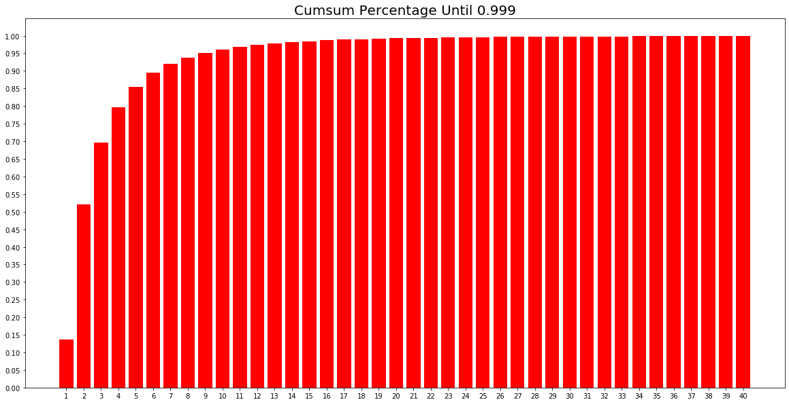

# AIFFEL_66일차 2020.10.29

Tags: AIFFEL_DAILY

### 일정


- [x]  선대 강의듣기
- [x]  LMS E-23

[Linear Algebra](https://www.notion.so/Linear-Algebra-2f9498958024479eafdc4a0760eb2a85)

# [E-23] 다음에 볼 영화 예측하기


Session-Based Recommendation

A 고객에게 해당 고객과 유사한 다른 고객이 좋아하는 상품을 보여주는 전략의 유효성?? 고객의 선호가 고정되어있다면 유효하겠지만, 고객의 마음은 항상 바뀐다!

⇒ 고로, '바로 지금 시점에 이 고객이 좋아할만한 상품'을 추천해주면 좋겠다는 생각으로 이어진다.

이런 맥락에서, Session-Based Recommendation은 세션 데이터를 기반으로 유저가 **다음에** **클릭 또는 구매할 아이템을 예측하는 추천**

```python
# 데이터 설명(README)를 읽어 봅니다. 
import os
f = open(os.getenv('HOME')+'/aiffel/yoochoose-data/dataset-README.txt', 'r')
while True:
    line = f.readline()
    if not line: break
    print(line)
f.close()
```

학습 노드에서 사용하는 데이터는 유저에 대한 정보를 알 수 없는 데이터!

반면, 유저에 대한 정보를 알 수 있는 경우를 Sequential Recommendation 이라고 구별해서 부른다.

유저와 아이템의 추가 정보를 Sequential Recommendation 모델에 적용하는 분야는 Context-Aware 라는 키워드로 연구되는 중.

그리고, E-commerce 데이터는

1. 비로그인 유저가 많다.
2. 로그인 상태로 탐색한다고 하더라도 접속할 때마다 탐색하는 의도가 뚜렷하게 다르다.

## Data Preprocess

---

```python
import datetime as dt
from pathlib import Path
import os

import numpy as np
import pandas as pd
import warnings
warnings.filterwarnings('ignore')
```

```python
data_path = Path(os.getenv('HOME')+'/aiffel/yoochoose-data') 
train_path = data_path / 'yoochoose-clicks.dat'
train_path
```

```python
def load_data(data_path: Path, nrows=None):
    data = pd.read_csv(data_path, sep=',', header=None, usecols=[0, 1, 2],
                       parse_dates=[1], dtype={0: np.int32, 2: np.int32}, nrows=nrows)
    data.columns = ['SessionId', 'Time', 'ItemId']
    return data
```

```python
# 시간이 좀 걸릴 수 있습니다. 메모리도 10GB 가까이 소요될 수 있으니 메모리 상태에 주의해 주세요.  

data = load_data(train_path, None)
data.sort_values(['SessionId', 'Time'], inplace=True)  # data를 id와 시간 순서로 정렬해줍니다.
data
```

추천시스템 구축시에, 가장 먼저 유저수(세션 수)와 아이템 수를 확인해보아야한다!

```python
data['SessionId'].nunique(), data['ItemId'].nunique()
```

세션 900만개, 아이템 5만개가량

(유저가 900만명이라는 것은 아님, 같은 유저가 여러개의 세션을 만들 수도 있기때문)

### Session Length

각 세션이 대략 몇 개의 클릭 데이터를 갖는가??

```python
session_length = data.groupby('SessionId').size()
session_length
```

⇒ `session_length` : 같은 SessionId를 공유하는 데이터 row 의 개수

```python
  session_length.median(), session_length.mean()
```

(2, 3.xxx)

```python
session_length.min(), session_length.max()
```

(1,200)

```python
# 오호... 99.9 % 이하에 속하는 기준점이 어디인지 찾기위해 사용한 함수.
session_length.quantile(0.999)
```

(41.0)

⇒ 99.9% 세션은 길이가 41이하!

```python
long_session = session_length[session_length==200].index[0]
data[data['SessionId']==long_session]
```

⇒ 길이가 200인 세션을 살펴보자.

⇒ 매우 짧은 간격으로 클릭을 1시간 30분간 지속하는 경우로 보임!

⇒ 이걸 어떻게 전처리 할 것인지는 **모델을 만드는 사람이 판단해야함!**

시각화해서 파악해보기

```python
length_count = session_length.groupby(session_length).size()
length_percent_cumsum = length_count.cumsum() / length_count.sum()
length_percent_cumsum_999 = length_percent_cumsum[length_percent_cumsum < 0.999]
```

```python
import matplotlib.pyplot as plt

plt.figure(figsize=(20, 10))
plt.bar(x=length_percent_cumsum_999.index,
        height=length_percent_cumsum_999, color='red')
plt.xticks(length_percent_cumsum_999.index)
plt.yticks(np.arange(0, 1.01, 0.05))
plt.title('Cumsum Percentage Until 0.999', size=20)
plt.show()
```



Q. 이 시스템에서 유저-상품관계를 행렬 곱으로 표현하는 Matrix Factorization으로 표현하는 것이 적절할까??

User * Item Matrix의 빈칸이 너무 많아서(data sparsity) 모델이 제대로 학습되지 않을 가능성이 있다. 이 세션정보는 유저를 ID 기반으로 정리할 수 없기 때문에 세션 하나를 유저 하나로 본다면 기존의 유저-상품정보 Matrix보다 훨씬 sparse한 형태가 된다.

### Session Time

유저들의 소비 패턴은 금방금방 변한다! 최근 소비 트렌드 학습이 중요하다!

이번 데이터의 시간 정보를 확인해보자.

```python
oldest, latest = data['Time'].min(), data['Time'].max()
print(oldest) 
print(latest)
```

⇒ 6개월

***datetime 라이브러리의 timedelta 객체를 사용하여 날짜끼리의 차이 구하기***

```python
month_ago = latest - dt.timedelta(30)     # 최종 날짜로부터 30일 이전 날짜를 구한다.  
data = data[data['Time'] > month_ago]   # 방금 구한 날짜 이후의 데이터만 모은다. 
data
```

### Data Cleansing

- 길이 1인 세션은 제거. ( 최소 1개보다는 많이 클릭했을 때 다음 클릭을 예측하는 것 )
- 너무 적게 클릭된 아이템도 제거

```python
# short_session을 제거한 다음 unpopular item을 제거하면 다시 길이가 1인 session이 생길 수 있습니다.
# 이를 위해 반복문을 통해 지속적으로 제거 합니다.
def cleanse_recursive(data: pd.DataFrame, shortest, least_click) -> pd.DataFrame:
    while True:
        before_len = len(data)
        data = cleanse_short_session(data, shortest)
        data = cleanse_unpopular_item(data, least_click)
        after_len = len(data)
        if before_len == after_len:
            break
    return data

def cleanse_short_session(data: pd.DataFrame, shortest):
    session_len = data.groupby('SessionId').size()
    session_use = session_len[session_len >= shortest].index
    data = data[data['SessionId'].isin(session_use)]
    return data

def cleanse_unpopular_item(data: pd.DataFrame, least_click):
    item_popular = data.groupby('ItemId').size()
    item_use = item_popular[item_popular >= least_click].index
    data = data[data['ItemId'].isin(item_use)]
    return data
```

```python
data = cleanse_recursive(data, shortest=2, least_click=5)
data
```

### Train,Valid,Test Split

```python
test_path = data_path / 'yoochoose-test.dat'
test= load_data(test_path)
test['Time'].min(), test['Time'].max()
```

추천 시스템은 '지금' 잘 예측하는 것이 중요하다!

1달 전에 성능이 좋은 모델을 지금 쓰면 맞지 않을 수 있음! 사용자들의 소비 패턴이 달라지기 때문에!

⇒ 이러한 이유로 Session-Based Recommendation 에서는 기간에 따라 Train,Valid, Test 셋을 나누기도 한다.

학습노드에서는 1-28 일을 train , 29일을 valid , 30일을 test로 놓겠다.

```python
def split_by_date(data: pd.DataFrame, n_days: int):
    final_time = data['Time'].max()
    session_last_time = data.groupby('SessionId')['Time'].max()
# 끝 날짜에서 1일 뺀거 이전 데이터를 train으로 그리고 1일만큼을 test 로 나누고
# 다시 1일 뺀거 이전 데이터에서 1일 뺀 데이터를 train으로 그리고 1일만큼을 val 로 나누는 코드 
    session_in_train = session_last_time[session_last_time < final_time - dt.timedelta(n_days)].index
    session_in_test = session_last_time[session_last_time >= final_time - dt.timedelta(n_days)].index

    before_date = data[data['SessionId'].isin(session_in_train)]
    after_date = data[data['SessionId'].isin(session_in_test)]
    after_date = after_date[after_date['ItemId'].isin(before_date['ItemId'])]
    return before_date, after_date
```

```python
tr, test = split_by_date(data, n_days=1)
tr, val = split_by_date(tr, n_days=1)
```

```python
# data에 대한 정보를 살펴봅니다.
def stats_info(data: pd.DataFrame, status: str):
    print(f'* {status} Set Stats Info\n'
          f'\t Events: {len(data)}\n'
          f'\t Sessions: {data["SessionId"].nunique()}\n'
          f'\t Items: {data["ItemId"].nunique()}\n'
          f'\t First Time : {data["Time"].min()}\n'
          f'\t Last Time : {data["Time"].max()}\n')
```

```python
stats_info(tr, 'train')
stats_info(val, 'valid')
stats_info(test, 'test')
```

```python
# train set에 없는 아이템이 val, test기간에 생길 수 있으므로 train data를 기준으로 인덱싱합니다.
id2idx = {item_id : index for index, item_id in enumerate(tr['ItemId'].unique())}

def indexing(df, id2idx):
    df['item_idx'] = df['ItemId'].map(lambda x: id2idx.get(x, -1))  # id2idx에 없는 아이템은 모르는 값(-1) 처리 해줍니다.
    return df

tr = indexing(tr, id2idx)
val = indexing(val, id2idx)
test = indexing(test, id2idx)
```

```python
save_path = data_path / 'processed'
save_path.mkdir(parents=True, exist_ok=True)

tr.to_pickle(save_path / 'train.pkl')
val.to_pickle(save_path / 'valid.pkl')
test.to_pickle(save_path / 'test.pkl')
```

## 논문소개(GRU4REC)

---

[SESSION-BASED RECOMMENDATIONS WITH RECURRENT NEURAL NETWORKS]

[https://arxiv.org/pdf/1511.06939v4.pdf](https://arxiv.org/pdf/1511.06939v4.pdf)

Session Data 에서는 처음으로 RNN 계열 모델을 적용.

여러 RNN 계열의 모델(e.g. LSTM)이 있겠지만 저자가 실험해본 결과 GRU의 성능이 제일 좋았다고 \함.

또한 Embedding Layer를 사용하지 않았을 때가 사용했을 때보다 성능이 좋았다고 합니다.

이번 자료에서도 Embedding Layer를 사용하지 않고 One-hot Encoding만 사용함.


단, 추천 데이터의 특징 몇 가지를 살려 모델링을 해보았다!

### Session-Parallel Mini-Batches:

Session 길이는 매우 짧은 것이 대부분이지만, 매우 긴 것들도 있음!

세션들을 데이터 샘플 하나로 보고 mini-batch를 구성하여 input으로 넣는다면 길이가 제일 긴 세션의 연산이 끝날 때까지 짧은 세션들이 기다려야 함!


여기서 Session 1,2,3을 하나의 mini-batch로 만든다면, 해당 미니배치의 연산은 Session 3의 연산이 끝나야 끝나는 식! ⇒ 이 점을 해결하기 위해 Session-Parallel Mini-Batches 제안

말 그대로 Session이 끝날 때까지 기다리지 않고 병렬계산하자!


이렇게 구성하면 Mini-Batch의 shape은 (3,1,1) 이 되고, RNN cell의 state가 1개로만 이루어짐!

그리고 TF 기준으로 RNN을 만들 때 statful = True 옵션을 사용하고, 세션이 끝나면 state를 0으로 만들어준다...?

[https://www.tensorflow.org/api_docs/python/tf/keras/layers/RNN](https://www.tensorflow.org/api_docs/python/tf/keras/layers/RNN)

stateful	Boolean (default False). If True, the last state for each sample at index i in a batch will be used as initial state for the sample of index i in the following batch.

(이전 batch 의 state가 이후 batch 의 initial state로 사용된다.)

### Sampling on the output

negative sampling과 같은 개념!

Item 수가 많기 때문에 Loss를 계산할 때 모든 아이템을 비교하지 않고, 인기도를 고려하여 Sampling 하는것! ⇒ 이번 노드에서는 구현하지는 않음

### Ranking Loss

Session-Based Recommendation Task를 여러 아이템 중 **다음 아이템이 무엇인지 Classification** 하는 Task로 생각할 수 있음.

그러나 여러 아이템을 관련도 순으로 랭킹을 매겨서 높은 랭킹의 아이템을 추천하는 Task로도 생각가능.

추천시스템 연구 분야 안에서 Ranking을 맞추는 objective function에 대한 연구가 있었고, 논문 저자 역시 이런 Ranking Loss를 사용하였음!

하지만, 학습 노드에서는 Classification Task로 보고 CE Loss 사용.

 

## Data Pipeline

---

### SessionDataset

데이터가 주어지면 세션이 시작되는 인덱스를 담는 값과 세션을 새로 인덱싱한 값을 갖는 클래스.

```python
class SessionDataset:
    """Credit to yhs-968/pyGRU4REC."""

    def __init__(self, data):
        self.df = data
        self.click_offsets = self.get_click_offsets()
        self.session_idx = np.arange(self.df['SessionId'].nunique())  # indexing to SessionId

    def get_click_offsets(self):
        """
        Return the indexes of the first click of each session IDs,
        """
        offsets = np.zeros(self.df['SessionId'].nunique() + 1, dtype=np.int32)
        offsets[1:] = self.df.groupby('SessionId').size().cumsum()
        return offsets
```

train 데이터로 SessionDataset 객체를 만들고 인스턴스 변수들을 살펴보자.

`click_offsets` 각 세션이 시작된 인덱스

`session_idx` 각 세션을 인덱싱한 np.array

```python
tr_dataset = SessionDataset(tr)
tr_dataset.df.head(10)
```

```python
tr_dataset.click_offsets
```

```python
tr_dataset.session_idx
```

### SessionDataLoader

SessionDataset 객체를 받아서 Session-Parallel mini-batch를 만드는 클래스를 만든다.

`__iter__` 메소드는 모델 인풋, 라벨, 세션이 끝나는 곳의 위치를 yield

mask는 후에 RNN Cell State 초기화에 사용.

```python
class SessionDataLoader:
    """Credit to yhs-968/pyGRU4REC."""
		
		# SessionDataset Class에 속하는 dataset 객체를 받겠다. 
    def __init__(self, dataset: SessionDataset, batch_size=50):
        self.dataset = dataset
        self.batch_size = batch_size

    def __iter__(self):
        """ Returns the iterator for producing session-parallel training mini-batches.
        Yields:
            input (B,):  Item indices that will be encoded as one-hot vectors later.
            target (B,): a Variable that stores the target item indices
            masks: Numpy array indicating the positions of the sessions to be terminated
        """

        start, end, mask, last_session, finished = self.initialize()
				# initialize 메소드에서 확인해주세요.
        """
        start : Index Where Session Start
        end : Index Where Session End
        mask : indicator for the sessions to be terminated
        """

        while not finished:
            min_len = (end - start).min() - 1  # Shortest Length Among Sessions
            for i in range(min_len):
                # Build inputs & targets
                inp = self.dataset.df['item_idx'].values[start + i]
                target = self.dataset.df['item_idx'].values[start + i + 1]
                yield inp, target, mask

            start, end, mask, last_session, finished = self.update_status(start, end, min_len, last_session, finished)

    def initialize(self):
        first_iters = np.arange(self.batch_size)    # 첫 배치에 사용할 세션 Index를 가져옵니다.
        last_session = self.batch_size - 1    # 마지막으로 다루고 있는 세션 Index를 저장해둡니다.
        start = self.dataset.click_offsets[self.dataset.session_idx[first_iters]]       # data 상에서 session이 시작된 위치를 가져옵니다.
        end = self.dataset.click_offsets[self.dataset.session_idx[first_iters] + 1]  # session이 끝난 위치 바로 다음 위치를 가져옵니다.
        mask = np.array([])   # session의 모든 아이템을 다 돌은 경우 mask에 추가해줄 것입니다.
        finished = False         # data를 전부 돌았는지 기록하기 위한 변수입니다.
        return start, end, mask, last_session, finished

    def update_status(self, start: np.ndarray, end: np.ndarray, min_len: int, last_session: int, finished: bool):  
        # 다음 배치 데이터를 생성하기 위해 상태를 update합니다.
        
        start += min_len   # __iter__에서 min_len 만큼 for문을 돌았으므로 start를 min_len 만큼 더해줍니다.
        mask = np.arange(self.batch_size)[(end - start) == 1]  
        # end는 다음 세션이 시작되는 위치인데 start와 한 칸 차이난다는 것은 session이 끝났다는 뜻입니다. mask에 기록해줍니다.

        for i, idx in enumerate(mask, start=1):  # mask에 추가된 세션 개수만큼 새로운 세션을 돌것입니다.
            new_session = last_session + i  
            if new_session > self.dataset.session_idx[-1]:  # 만약 새로운 세션이 마지막 세션 index보다 크다면 모든 학습데이터를 돈 것입니다.
                finished = True
                break
            # update the next starting/ending point
            start[idx] = self.dataset.click_offsets[self.dataset.session_idx[new_session]]     # 종료된 세션 대신 새로운 세션의 시작점을 기록합니다.
            end[idx] = self.dataset.click_offsets[self.dataset.session_idx[new_session] + 1]

        last_session += len(mask)  # 마지막 세션의 위치를 기록해둡니다.
        return start, end, mask, last_session, finished
```

```python
tr_data_loader = SessionDataLoader(tr_dataset, batch_size=4)
tr_dataset.df.head(15)
```

iterator 선언

```python
iter_ex = iter(tr_data_loader)
```

iterator 에서 next 로 뽑아내서 다음 데이터 만들기.

```python
inputs, labels, mask =  next(iter_ex)
print(f'Model Input Item Idx are : {inputs}')
print(f'Label Item Idx are : {"":5} {labels}')
print(f'Previous Masked Input Idx are {mask}')
```

## Modeling

---

### Evaluation Metric

Session-Based Recommendation Task에서는 모델이 k개의 아이템을 제시했을 때, 유저가 클릭&구매한 n개의 아이템이 많아야 좋다!

따라서, recall의 개념을 확장한 recall@k 지표, precision의 개념을 확장한 Mean Average Precision@k 지표 등을 사용.

추천에서는 몇 번째로 맞추느냐도 중요. (원하는 결과가1 페이지에 딱! 나와야 한다는 말.)

따라서, 순서에 민감한 지표인 MRR, NDCG 같은 지표도 사용.

⇒ 이번 자료에서는 MRR과 Recall@k 사용.

MRR은 정답 아이템이 나온 순번의 역수 값.

⇒ 정답 아이템이 추천 결과 앞쪽 순번에 나온다면 지표가 높아지고, 뒤 혹은 안나오면 지표가 낮아짐.

[참고자료, NDCG, MRR, MAP 설명]

[https://medium.com/swlh/rank-aware-recsys-evaluation-metrics-5191bba16832](https://medium.com/swlh/rank-aware-recsys-evaluation-metrics-5191bba16832)

```python
def mrr_k(pred, truth: int, k: int):
    indexing = np.where(pred[:k] == truth)[0]
    if len(indexing) > 0:
        return 1 / (indexing[0] + 1)
    else:
        return 0

def recall_k(pred, truth: int, k: int) -> int:
    answer = truth in pred[:k]
    return int(answer)
```

### Model Architecture

```python
import numpy as np
import tensorflow as tf
from tensorflow.keras.layers import Input, Dense, Dropout, GRU
from tensorflow.keras.losses import categorical_crossentropy
from tensorflow.keras.models import Model
from tensorflow.keras.optimizers import Adam
from tensorflow.keras.utils import to_categorical
from tqdm import tqdm

```

```python
def create_model(args):
    inputs = Input(batch_shape=(args.batch_size, 1, args.num_items))
    gru, _ = GRU(args.hsz, stateful=True, return_state=True, name='GRU')(inputs)
    dropout = Dropout(args.drop_rate)(gru)
    predictions = Dense(args.num_items, activation='softmax')(dropout)
    model = Model(inputs=inputs, outputs=[predictions])
    model.compile(loss=categorical_crossentropy, optimizer=Adam(args.lr), metrics=['accuracy'])
    model.summary()
    return model
```

모델에 사용하는 hyper-parameter를 class 형식을 관리

```python
class Args:
    def __init__(self, tr, val, test, batch_size, hsz, drop_rate, lr, epochs, k):
        self.tr = tr
        self.val = val
        self.test = test
        self.num_items = tr['ItemId'].nunique()
        self.num_sessions = tr['SessionId'].nunique()
        self.batch_size = batch_size
        self.hsz = hsz
        self.drop_rate = drop_rate
        self.lr = lr
        self.epochs = epochs
        self.k = k

args = Args(tr, val, test, batch_size=2048, hsz=50, drop_rate=0.1, lr=0.001, epochs=3, k=20)
```

```python
model = create_model(args)
```

### Model Training

```python
# train 셋으로 학습하면서 valid 셋으로 검증합니다.
def train_model(model, args):
    train_dataset = SessionDataset(args.tr)
    train_loader = SessionDataLoader(train_dataset, batch_size=args.batch_size)

    for epoch in range(1, args.epochs + 1):
        total_step = len(args.tr) - args.tr['SessionId'].nunique()
        tr_loader = tqdm(train_loader, total=total_step // args.batch_size, desc='Train', mininterval=1)
        for feat, target, mask in tr_loader:
            reset_hidden_states(model, mask)  # 종료된 session은 hidden_state를 초기화합니다. 아래 메서드에서 확인해주세요.

            input_ohe = to_categorical(feat, num_classes=args.num_items)
            input_ohe = np.expand_dims(input_ohe, axis=1)
            target_ohe = to_categorical(target, num_classes=args.num_items)

            result = model.train_on_batch(input_ohe, target_ohe)
            tr_loader.set_postfix(train_loss=result[0], accuracy = result[1])

        val_recall, val_mrr = get_metrics(args.val, model, args, args.k)  # valid set에 대해 검증합니다.

        print(f"\t - Recall@{args.k} epoch {epoch}: {val_recall:3f}")
        print(f"\t - MRR@{args.k}    epoch {epoch}: {val_mrr:3f}\n")

def reset_hidden_states(model, mask):
    gru_layer = model.get_layer(name='GRU')  # model에서 gru layer를 가져옵니다.
    hidden_states = gru_layer.states[0].numpy()  # gru_layer의 parameter를 가져옵니다.
    for elt in mask:  # mask된 인덱스 즉, 종료된 세션의 인덱스를 돌면서
        hidden_states[elt, :] = 0  # parameter를 초기화 합니다.
    gru_layer.reset_states(states=hidden_states)

def get_metrics(data, model, args, k: int):  # valid셋과 test셋을 평가하는 코드입니다. 
                                             # train과 거의 같지만 mrr, recall을 구하는 라인이 있습니다.
    dataset = SessionDataset(data)
    loader = SessionDataLoader(dataset, batch_size=args.batch_size)
    recall_list, mrr_list = [], []

    total_step = len(data) - data['SessionId'].nunique()
    for inputs, label, mask in tqdm(loader, total=total_step // args.batch_size, desc='Evaluation', mininterval=1):
        reset_hidden_states(model, mask)
        input_ohe = to_categorical(inputs, num_classes=args.num_items)
        input_ohe = np.expand_dims(input_ohe, axis=1)

        pred = model.predict(input_ohe, batch_size=args.batch_size)
        pred_arg = tf.argsort(pred, direction='DESCENDING')  # softmax 값이 큰 순서대로 sorting 합니다.

        length = len(inputs)
        recall_list.extend([recall_k(pred_arg[i], label[i], k) for i in range(length)])
        mrr_list.extend([mrr_k(pred_arg[i], label[i], k) for i in range(length)])

    recall, mrr = np.mean(recall_list), np.mean(mrr_list)
    return recall, mrr
```

학습 진행

```python
# 학습 시간이 다소 오래 소요됩니다. (예상시간 1시간)
train_model(model, args)
```

### test (inference)

```python
def test_model(model, args, test):
    test_recall, test_mrr = get_metrics(test, model, args, 20)
    print(f"\t - Recall@{args.k}: {test_recall:3f}")
    print(f"\t - MRR@{args.k}: {test_mrr:3f}\n")

test_model(model, args, test)
```

## 프로젝트: Movielens 영화 SBR

---

결과물 : [https://github.com/bluecandle/2020_AIFFEL/blob/master/daily_notes/exploration_codes/e23_code/E23.ipynb](https://github.com/bluecandle/2020_AIFFEL/blob/master/daily_notes/exploration_codes/e23_code/E23.ipynb)