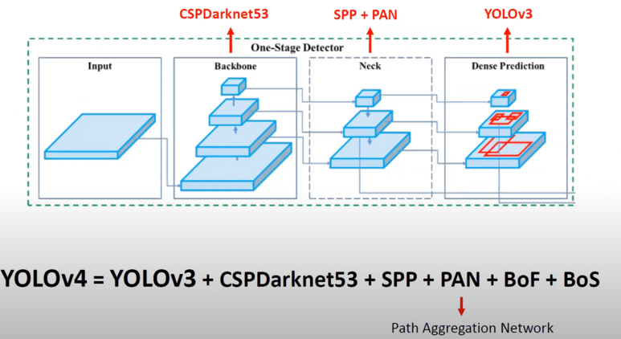

# AIFFEL_67일차 2020.10.30

Tags: AIFFEL_DAILY

### 일정

- [x]  해커톤 3 진행
- [x]  프로젝트 평가지 제출

# 해커톤 3 진행

### 추천된 논문,repo 훑어보기

- DeepFashion2
    - 491,000 images of 13 clothing categories (commercial shopping stores and consumers)
        - 801,000 clothing items in images
        - each item labeled with scale, occlusion, zoom-in, viewpoint, category, style, bounding box, dense landmarks, and per-pixel mask
    - 873K Commercial-Consumer clothes pairs
    - Train : 391,000 images , Val : 34,000 images, Test : 67,000 images
    - 해당 데이터셋을 기반으로 실험한 network : FashionNet
- [https://github.com/Snehal-Reddy/DeepFashion_MRCNN](https://github.com/Snehal-Reddy/DeepFashion_MRCNN)
    - DeepFashion2 데이터셋을 대상으로 Mask R-CNN 을 훈련시킨 repo
    - pytorch 로 구현되어있다.

- Mask R-CNN
    - Faster R-CNN 에서 object mask 를 추출하는 작업을 병렬적으로 추출하여 instance segmentation이 가능하도록 만들었다!
    - 속도 5 fps...
- YOLO v4

    

흠... 그래도 실시간이 중요한게 아니라, segmentation이 되는 모델을 만드는 것이 더 중요하다고 생각된다!

⇒ Mask R-CNN 을 구현해보는 것을 1차 목표로 한다!